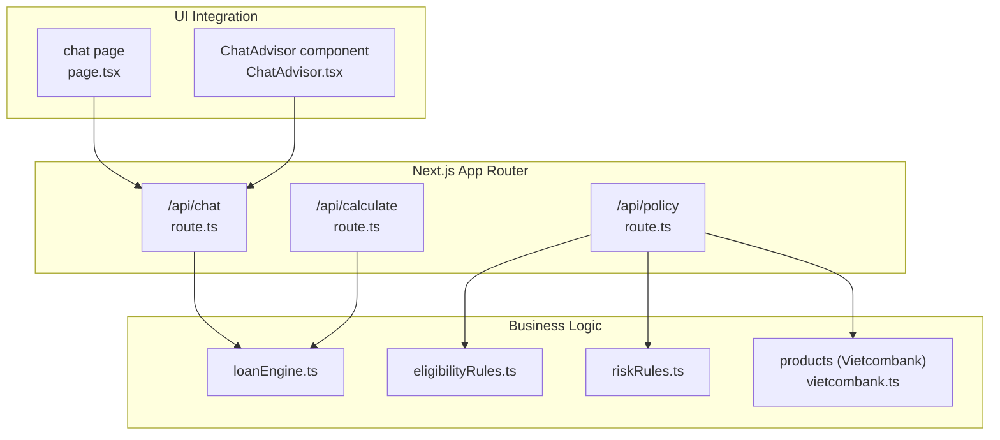
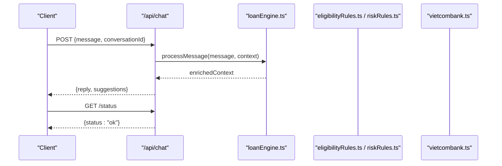
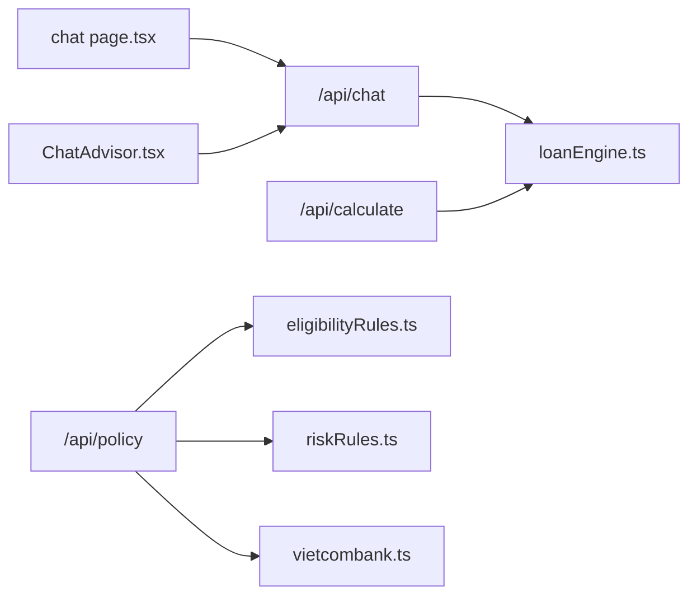

# API Reference

<cite>
**Referenced Files in This Document**
- [route.ts](file://src/app/api/calculate/route.ts)
- [route.ts](file://src/app/api/chat/route.ts)
- [route.ts](file://src/app/api/policy/route.ts)
- [page.tsx](file://src/app/chat/page.tsx)
- [ChatAdvisor.tsx](file://src/components/ChatAdvisor.tsx)
- [loanEngine.ts](file://src/lib/loanEngine.ts)
- [eligibilityRules.ts](file://src/data/eligibilityRules.ts)
- [riskRules.ts](file://src/data/riskRules.ts)
- [vietcombank.ts](file://src/data/products/vietcombank.ts)
- [index.ts](file://src/data/products/index.ts)
</cite>

## Table of Contents
1. [Introduction](#introduction)
2. [Project Structure](#project-structure)
3. [Core Components](#core-components)
4. [Architecture Overview](#architecture-overview)
5. [Detailed Component Analysis](#detailed-component-analysis)
6. [Dependency Analysis](#dependency-analysis)
7. [Performance Considerations](#performance-considerations)
8. [Troubleshooting Guide](#troubleshooting-guide)
9. [Conclusion](#conclusion)

## Introduction
This document provides comprehensive API reference documentation for the frontend-vaya application’s backend routes exposed under /api. It covers:
- AI-powered loan consultations via /api/chat
- Loan calculations via /api/calculate
- Policy compliance checking via /api/policy

For each endpoint, you will find HTTP methods, URL patterns, authentication expectations, request/response schemas, validation rules, status codes, example payloads, and error scenarios. The guide also includes security considerations, rate limiting notes, and debugging techniques to help you integrate reliably.

## Project Structure
The API endpoints are implemented as Next.js App Router route handlers located under src/app/api. Each endpoint is a separate file that exports an asynchronous function handling HTTP requests.

**Diagram sources**
- [route.ts](file://src/app/api/chat/route.ts)
- [route.ts](file://src/app/api/calculate/route.ts)
- [route.ts](file://src/app/api/policy/route.ts)
- [loanEngine.ts](file://src/lib/loanEngine.ts)
- [eligibilityRules.ts](file://src/data/eligibilityRules.ts)
- [riskRules.ts](file://src/data/riskRules.ts)
- [vietcombank.ts](file://src/data/products/vietcombank.ts)
- [page.tsx](file://src/app/chat/page.tsx)
- [ChatAdvisor.tsx](file://src/components/ChatAdvisor.tsx)

**Section sources**
- [route.ts](file://src/app/api/chat/route.ts)
- [route.ts](file://src/app/api/calculate/route.ts)
- [route.ts](file://src/app/api/policy/route.ts)
- [page.tsx](file://src/app/chat/page.tsx)
- [ChatAdvisor.tsx](file://src/components/ChatAdvisor.tsx)
- [loanEngine.ts](file://src/lib/loanEngine.ts)
- [eligibilityRules.ts](file://src/data/eligibilityRules.ts)
- [riskRules.ts](file://src/data/riskRules.ts)
- [vietcombank.ts](file://src/data/products/vietcombank.ts)

## Core Components
- Chat API (/api/chat): Handles conversational AI interactions for loan consultation. Accepts user messages and returns AI-generated responses based on context and business rules.
- Calculate API (/api/calculate): Computes loan metrics such as monthly payments, total interest, and amortization schedules using borrower inputs and product parameters.
- Policy API (/api/policy): Validates eligibility against policy rules and risk criteria, returning pass/fail outcomes with explanations.

These components rely on shared data and logic modules:
- loanEngine.ts: Core calculation engine for loan math and scenario analysis.
- eligibilityRules.ts and riskRules.ts: Rule sets used by the policy endpoint.
- Product catalogs (e.g., vietcombank.ts): Provide product-specific parameters and constraints.

**Section sources**
- [route.ts](file://src/app/api/chat/route.ts)
- [route.ts](file://src/app/api/calculate/route.ts)
- [route.ts](file://src/app/api/policy/route.ts)
- [loanEngine.ts](file://src/lib/loanEngine.ts)
- [eligibilityRules.ts](file://src/data/eligibilityRules.ts)
- [riskRules.ts](file://src/data/riskRules.ts)
- [vietcombank.ts](file://src/data/products/vietcombank.ts)

## Architecture Overview
The API layer is thin and delegates to domain logic modules. The chat flow integrates with AI services, while calculate and policy flows use deterministic engines and rule sets.

**Diagram sources**
- [route.ts](file://src/app/api/chat/route.ts)
- [loanEngine.ts](file://src/lib/loanEngine.ts)
- [eligibilityRules.ts](file://src/data/eligibilityRules.ts)
- [riskRules.ts](file://src/data/riskRules.ts)
- [vietcombank.ts](file://src/data/products/vietcombank.ts)

## Detailed Component Analysis

### /api/chat — AI-Powered Loan Consultations
- Method: POST
- URL: /api/chat
- Purpose: Process natural language messages to provide loan consultation advice, recommendations, and clarifications.

Request schema
- message: string — User’s question or statement about loans.
- conversationId: string — Optional session identifier to maintain context across turns.
- userId: string — Optional identifier for personalization and audit.
- locale: string — Optional language code (e.g., en, vi).

Response schema
- reply: string — AI-generated response text.
- suggestions: array of strings — Follow-up prompts or options.
- sessionId: string — Session identifier if not provided.
- metadata: object — Optional diagnostics (e.g., model version, latency).

Authentication
- No explicit token required in this route; consider adding API key or JWT validation at gateway level.

Status codes
- 200 OK: Successful response.
- 400 Bad Request: Invalid payload or missing required fields.
- 429 Too Many Requests: Rate limit exceeded.
- 500 Internal Server Error: Unexpected failure in processing.

Example request
- POST /api/chat
- Body:
  - message: "What documents do I need for a home loan?"
  - conversationId: "sess_abc123"
  - userId: "user_9876"
  - locale: "en"

Example response
- 200 OK
- Body:
  - reply: "You typically need ID, income proof, and bank statements..."
  - suggestions: ["Check eligibility", "Compare rates", "Apply now"]
  - sessionId: "sess_abc123"
  - metadata: { modelVersion: "v1.2", latencyMs: 320 }

Error scenarios
- Missing message field returns 400 with error details.
- Excessive requests within time window return 429 with retry-after header.
- AI service timeout returns 500 with generic error message.

Security considerations
- Validate and sanitize input to prevent injection.
- Enforce rate limiting at the edge or middleware.
- Log minimal PII; avoid storing sensitive data in logs.

Rate limiting
- Recommended: 10 requests per minute per userId or IP.
- Use X-RateLimit-* headers to inform clients.

Debugging tips
- Enable verbose logging for conversationId.
- Inspect metadata.latencyMs to identify slow paths.
- Reproduce issues with saved conversationId and message history.

**Section sources**
- [route.ts](file://src/app/api/chat/route.ts)
- [page.tsx](file://src/app/chat/page.tsx)
- [ChatAdvisor.tsx](file://src/components/ChatAdvisor.tsx)
- [loanEngine.ts](file://src/lib/loanEngine.ts)

### /api/calculate — Loan Calculations
- Method: POST
- URL: /api/calculate
- Purpose: Compute loan metrics based on borrower information, loan amount, term, and product parameters.

Request schema
- borrower: object
  - age: number — Borrower’s age.
  - income: number — Monthly gross income.
  - employmentMonths: number — Months employed.
  - creditScore: number — Credit score range (e.g., 300–850).
- loan: object
  - amount: number — Principal requested.
  - termMonths: number — Loan duration in months.
  - interestRate: number — Annual interest rate (percentage).
  - currency: string — Currency code (e.g., VND, USD).
- product: object
  - provider: string — Lender name (e.g., Vietcombank).
  - productId: string — Product identifier.
  - maxAmount: number — Maximum allowed principal.
  - minAge: number — Minimum borrower age.
  - maxAge: number — Maximum borrower age.
  - maxLTV: number — Maximum loan-to-value ratio.

Response schema
- result: object
  - monthlyPayment: number — Estimated monthly installment.
  - totalInterest: number — Total interest over term.
  - totalPayment: number — Sum of principal and interest.
  - amortizationSchedule: array of objects — Month-by-month breakdown.
- eligibility: boolean — Whether the loan meets basic eligibility.
- warnings: array of strings — Additional notes or risks.

Status codes
- 200 OK: Calculation completed successfully.
- 400 Bad Request: Invalid or incomplete input.
- 422 Unprocessable Entity: Input fails validation rules.
- 500 Internal Server Error: Unexpected failure.

Example request
- POST /api/calculate
- Body:
  - borrower: { age: 35, income: 1500, employmentMonths: 24, creditScore: 720 }
  - loan: { amount: 50000, termMonths: 36, interestRate: 8.5, currency: "VND" }
  - product: { provider: "Vietcombank", productId: "VCB-HOME-01", maxAmount: 100000, minAge: 22, maxAge: 60, maxLTV: 0.8 }

Example response
- 200 OK
- Body:
  - result: { monthlyPayment: 1520.33, totalInterest: 4726.88, totalPayment: 54726.88, amortizationSchedule: [...] }
  - eligibility: true
  - warnings: ["High debt-to-income ratio may affect approval."]

Error scenarios
- Missing borrower.income returns 400 with field-level errors.
- Interest rate out of range returns 422 with guidance.
- Product mismatch returns 422 with suggested alternatives.

Validation rules
- amount must be positive and <= product.maxAmount.
- termMonths must be between 6 and 600.
- interestRate must be between 0 and 30.
- borrower.age must be within product.minAge and product.maxAge.

Security considerations
- Sanitize numeric inputs to prevent overflow.
- Avoid logging full payloads; log sanitized summaries.

Rate limiting
- Recommended: 20 requests per minute per userId.

Debugging tips
- Include requestId in client headers for correlation.
- Return detailed field errors in 422 responses.

**Section sources**
- [route.ts](file://src/app/api/calculate/route.ts)
- [loanEngine.ts](file://src/lib/loanEngine.ts)
- [vietcombank.ts](file://src/data/products/vietcombank.ts)
- [index.ts](file://src/data/products/index.ts)

### /api/policy — Policy Compliance Checking
- Method: POST
- URL: /api/policy
- Purpose: Evaluate borrower eligibility and regulatory compliance against policy and risk rules.

Request schema
- applicant: object
  - id: string — Unique applicant identifier.
  - age: number — Applicant’s age.
  - income: number — Monthly gross income.
  - employmentMonths: number — Months employed.
  - creditScore: number — Credit score.
  - existingLoans: number — Number of active loans.
  - monthlyDebtPayments: number — Total monthly debt obligations.
- loan: object
  - amount: number — Requested principal.
  - termMonths: number — Desired term.
  - interestRate: number — Annual interest rate.
  - purpose: string — Loan purpose (e.g., home, auto, education).
- product: object
  - provider: string — Lender name.
  - productId: string — Product identifier.
  - region: string — Regulatory region (e.g., VN-HANOI).

Response schema
- decision: object
  - eligible: boolean — Overall eligibility.
  - reasons: array of strings — Explanation of pass/fail factors.
  - riskLevel: string — Risk classification (low, medium, high).
  - conditions: array of strings — Required actions or mitigations.
- compliance: object
  - passed: boolean — Regulatory compliance outcome.
  - violations: array of strings — Any regulatory breaches.
  - references: array of strings — Applicable regulation identifiers.

Status codes
- 200 OK: Evaluation completed.
- 400 Bad Request: Invalid payload.
- 422 Unprocessable Entity: Validation failures.
- 500 Internal Server Error: Unexpected failure.

Example request
- POST /api/policy
- Body:
  - applicant: { id: "A12345", age: 30, income: 1200, employmentMonths: 18, creditScore: 680, existingLoans: 1, monthlyDebtPayments: 300 }
  - loan: { amount: 30000, termMonths: 24, interestRate: 9.0, purpose: "education" }
  - product: { provider: "Vietcombank", productId: "VCB-EDU-01", region: "VN-HANOI" }

Example response
- 200 OK
- Body:
  - decision: { eligible: false, reasons: ["DTI exceeds threshold", "Credit score below minimum"], riskLevel: "high", conditions: ["Reduce existing debt", "Increase down payment"] }
  - compliance: { passed: false, violations: ["DTI > 40%"], references: ["REG-VN-2023-001"] }

Eligibility criteria
- DTI (debt-to-income) must be below a defined threshold.
- Credit score must meet minimum requirements.
- Age must be within product-defined bounds.
- Existing loans and monthly debt payments influence risk assessment.

Regulatory validation
- Region-specific rules enforced via product.region.
- Violations include specific regulatory references.

Security considerations
- Ensure applicant.id is anonymized in logs.
- Apply least-privilege access to rule datasets.

Rate limiting
- Recommended: 15 requests per minute per userId.

Debugging tips
- Capture decision.reasons and compliance.violations for root cause analysis.
- Use requestId to correlate evaluation runs.

**Section sources**
- [route.ts](file://src/app/api/policy/route.ts)
- [eligibilityRules.ts](file://src/data/eligibilityRules.ts)
- [riskRules.ts](file://src/data/riskRules.ts)
- [vietcombank.ts](file://src/data/products/vietcombank.ts)

## Dependency Analysis
The API routes depend on shared modules for calculations and rule evaluation.

**Diagram sources**
- [route.ts](file://src/app/api/chat/route.ts)
- [route.ts](file://src/app/api/calculate/route.ts)
- [route.ts](file://src/app/api/policy/route.ts)
- [loanEngine.ts](file://src/lib/loanEngine.ts)
- [eligibilityRules.ts](file://src/data/eligibilityRules.ts)
- [riskRules.ts](file://src/data/riskRules.ts)
- [vietcombank.ts](file://src/data/products/vietcombank.ts)
- [page.tsx](file://src/app/chat/page.tsx)
- [ChatAdvisor.tsx](file://src/components/ChatAdvisor.tsx)

**Section sources**
- [route.ts](file://src/app/api/chat/route.ts)
- [route.ts](file://src/app/api/calculate/route.ts)
- [route.ts](file://src/app/api/policy/route.ts)
- [loanEngine.ts](file://src/lib/loanEngine.ts)
- [eligibilityRules.ts](file://src/data/eligibilityRules.ts)
- [riskRules.ts](file://src/data/riskRules.ts)
- [vietcombank.ts](file://src/data/products/vietcombank.ts)
- [page.tsx](file://src/app/chat/page.tsx)
- [ChatAdvisor.tsx](file://src/components/ChatAdvisor.tsx)

## Performance Considerations
- Cache frequent loan products and rule sets to reduce cold starts.
- Stream large amortization schedules when possible.
- Use pagination for long outputs (e.g., amortization tables).
- Implement connection pooling for external AI services.
- Monitor latency and throughput with structured logs.

[No sources needed since this section provides general guidance]

## Troubleshooting Guide
Common issues and resolutions:
- 400 Bad Request: Verify required fields and types in request payloads.
- 422 Unprocessable Entity: Check validation rules (ranges, thresholds).
- 429 Too Many Requests: Reduce request frequency or implement exponential backoff.
- 500 Internal Server Error: Inspect server logs for stack traces; validate external service health.

Debugging techniques:
- Add requestId headers for traceability.
- Log sanitized request summaries and response durations.
- Reproduce with minimal payloads to isolate failures.
- Use feature flags to toggle verbose logging in staging.

**Section sources**
- [route.ts](file://src/app/api/chat/route.ts)
- [route.ts](file://src/app/api/calculate/route.ts)
- [route.ts](file://src/app/api/policy/route.ts)

## Conclusion
The frontend-vaya API provides three core endpoints supporting AI-driven loan consultations, precise loan calculations, and robust policy compliance checks. By adhering to the documented schemas, validation rules, and security practices, integrators can build reliable and compliant applications. For best results, implement rate limiting, thorough input validation, and observability through structured logging and tracing.

[No sources needed since this section summarizes without analyzing specific files]