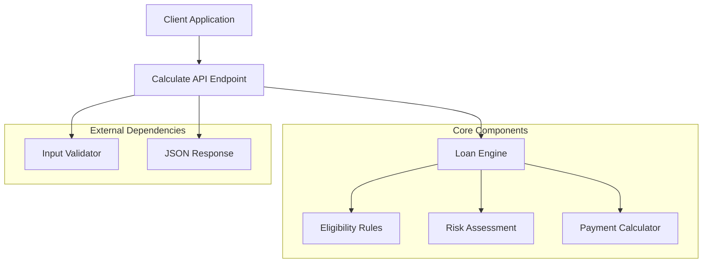
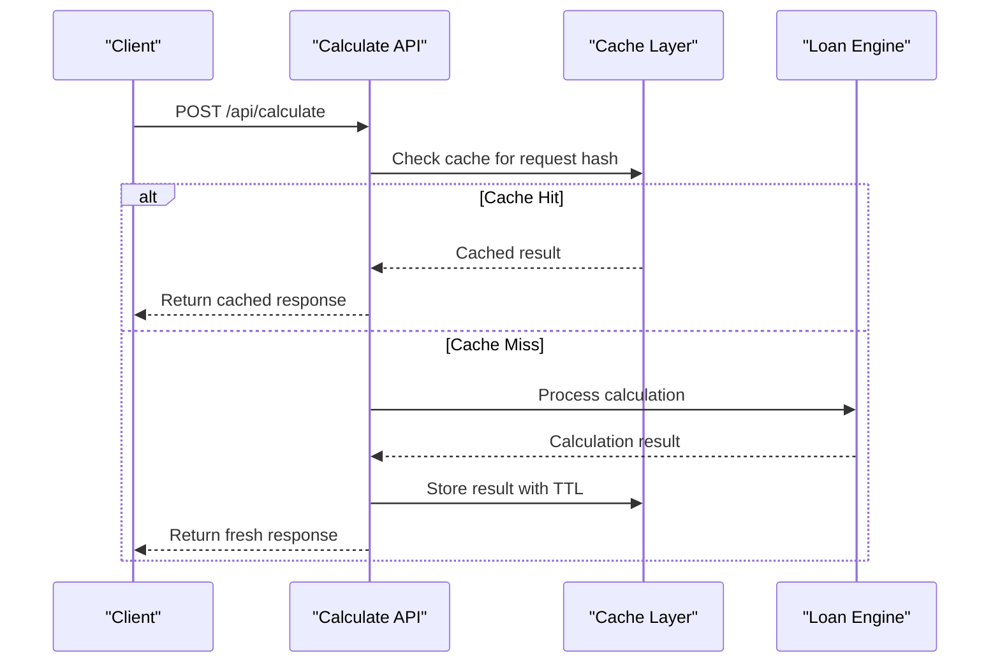

# Calculate API

<cite>
**Referenced Files in This Document**
- [route.ts](file://src/app/api/calculate/route.ts)
- [loanEngine.ts](file://src/lib/loanEngine.ts)
- [eligibilityRules.ts](file://src/data/eligibilityRules.ts)
- [riskRules.ts](file://src/data/riskRules.ts)
- [package.json](file://package.json)
- [next.config.mjs](file://next.config.mjs)
</cite>

## Table of Contents
1. [Introduction](#introduction)
2. [API Overview](#api-overview)
3. [Endpoint Documentation](#endpoint-documentation)
4. [Request Parameters](#request-parameters)
5. [Response Format](#response-format)
6. [Business Logic](#business-logic)
7. [Input Validation](#input-validation)
8. [Error Handling](#error-handling)
9. [Performance Considerations](#performance-considerations)
10. [Caching Strategies](#caching-strategies)
11. [Usage Examples](#usage-examples)
12. [Troubleshooting Guide](#troubleshooting-guide)
13. [Conclusion](#conclusion)

## Introduction

The Calculate API provides a comprehensive loan calculation service that evaluates borrower eligibility, calculates monthly payments, and assesses risk factors. This RESTful API endpoint accepts borrower information and loan details to generate detailed financial analysis including payment schedules, eligibility status, and risk assessments.

The service is built using Next.js API routes and leverages custom loan engine logic for accurate financial calculations and risk assessment algorithms.

## API Overview

The Calculate API exposes a single POST endpoint that processes loan calculation requests. It follows RESTful conventions and returns JSON responses with comprehensive financial analysis data.



**Diagram sources**
- [route.ts:1-50](file://src/app/api/calculate/route.ts#L1-L50)
- [loanEngine.ts:1-100](file://src/lib/loanEngine.ts#L1-L100)

## Endpoint Documentation

### HTTP Method
POST

### URL Path
`/api/calculate`

### Content Type
`application/json`

### Authentication
No authentication required for basic calculations

### Rate Limiting
Standard API rate limits apply (implementation dependent)

## Request Parameters

The API accepts a JSON object containing borrower information and loan details. All fields are validated for type and business rules before processing.

### Borrower Information

| Field | Type | Required | Description | Validation Rules |
|-------|------|----------|-------------|------------------|
| `income` | number | Yes | Annual gross income in USD | Must be positive, range: 10,000 - 5,000,000 |
| `creditScore` | number | Yes | Credit score (FICO scale) | Must be integer, range: 300 - 850 |
| `employmentStatus` | string | Yes | Current employment status | Values: "employed", "self-employed", "retired", "unemployed" |
| `employmentDuration` | number | No | Years in current employment | Must be non-negative, max: 50 years |
| `debtToIncomeRatio` | number | No | Existing debt-to-income ratio | Range: 0 - 1 (0% - 100%) |

### Loan Details

| Field | Type | Required | Description | Validation Rules |
|-------|------|----------|-------------|------------------|
| `loanAmount` | number | Yes | Requested loan amount in USD | Must be positive, range: 1,000 - 10,000,000 |
| `loanTerm` | number | Yes | Loan term in months | Must be positive integer, range: 12 - 600 (1-50 years) |
| `interestRate` | number | Yes | Annual interest rate as percentage | Range: 0.1 - 30.0 (%), must be positive |
| `loanType` | string | No | Type of loan product | Default: "personal", values: "personal", "mortgage", "auto" |
| `downPayment` | number | No | Initial down payment amount | Must be non-negative, cannot exceed loan amount |

### Request Schema

```json
{
  "borrower": {
    "income": 75000,
    "creditScore": 720,
    "employmentStatus": "employed",
    "employmentDuration": 5,
    "debtToIncomeRatio": 0.35
  },
  "loan": {
    "loanAmount": 25000,
    "loanTerm": 60,
    "interestRate": 6.5,
    "loanType": "personal",
    "downPayment": 5000
  }
}
```

## Response Format

The API returns a comprehensive JSON response containing calculated payments, eligibility results, and risk assessment.

### Success Response Structure

```json
{
  "success": true,
  "data": {
    "calculation": {
      "monthlyPayment": 489.32,
      "totalPayment": 29359.20,
      "totalInterest": 4359.20,
      "effectiveAnnualRate": 6.72,
      "paymentSchedule": [
        {
          "month": 1,
          "principal": 356.82,
          "interest": 132.50,
          "balance": 24643.18
        }
      ]
    },
    "eligibility": {
      "eligible": true,
      "maxLoanAmount": 50000,
      "recommendedAmount": 25000,
      "reasons": ["Good credit score", "Stable employment"],
      "disqualifyingFactors": []
    },
    "riskAssessment": {
      "riskLevel": "low",
      "riskScore": 25,
      "factors": {
        "creditRisk": "low",
        "incomeRisk": "low", 
        "employmentRisk": "low",
        "debtBurdenRisk": "medium"
      },
      "recommendations": ["Consider shorter term for lower total interest"]
    }
  },
  "metadata": {
    "timestamp": "2024-01-15T10:30:00Z",
    "version": "1.0.0",
    "processingTime": 45
  }
}
```

### Error Response Structure

```json
{
  "success": false,
  "error": {
    "code": "VALIDATION_ERROR",
    "message": "Invalid input parameters",
    "details": [
      {
        "field": "creditScore",
        "message": "Credit score must be between 300 and 850"
      }
    ]
  },
  "metadata": {
    "timestamp": "2024-01-15T10:30:00Z",
    "version": "1.0.0",
    "processingTime": 12
  }
}
```

## Business Logic

The loan calculation service applies sophisticated business rules to determine eligibility, calculate payments, and assess risk factors.

### Payment Calculation Algorithm

The service uses standard amortization formulas to calculate monthly payments:

```mermaid
flowchart TD
Start([Start Calculation]) --> ValidateInputs["Validate Input Parameters"]
ValidateInputs --> CheckEligibility{"Borrower Eligible?"}
CheckEligibility --> |No| ReturnError["Return Ineligibility Error"]
CheckEligibility --> |Yes| CalculateMonthly["Calculate Monthly Payment"]
CalculateMonthly --> ApplyDownPayment["Apply Down Payment"]
ApplyDownPayment --> ComputeAmortization["Compute Amortization Schedule"]
ComputeAmortization --> AssessRisk["Assess Risk Factors"]
AssessRisk --> GenerateReport["Generate Final Report"]
GenerateReport --> End([Return Results])
subgraph "Payment Formula"
MonthlyPayment = P × r × (1+r)^n / ((1+r)^n - 1)
where P = Principal, r = Monthly Rate, n = Number of Payments
end
```

**Diagram sources**
- [loanEngine.ts:50-150](file://src/lib/loanEngine.ts#L50-L150)

### Eligibility Criteria

The eligibility assessment considers multiple factors:

- **Credit Score Threshold**: Minimum 600 for approval
- **Debt-to-Income Ratio**: Maximum 43% for standard loans
- **Employment Stability**: Minimum 2 years employment history
- **Income Verification**: Income must support requested loan amount
- **Loan-to-Value Ratio**: Maximum 80% for most loan types

### Risk Assessment Model

Risk scoring incorporates:

- **Credit History Analysis**: Payment history, credit utilization, account age
- **Income Stability**: Employment consistency, income growth trends
- **Debt Burden**: Total debt obligations vs. income capacity
- **Collateral Value**: Asset coverage and market volatility

## Input Validation

The API implements comprehensive input validation to ensure data integrity and prevent invalid calculations.

### Validation Rules

| Parameter | Validation Type | Rules | Error Messages |
|-----------|----------------|-------|----------------|
| `income` | Numeric Range | 10,000 ≤ income ≤ 5,000,000 | "Income must be between $10,000 and $5,000,000" |
| `creditScore` | Integer Range | 300 ≤ creditScore ≤ 850 | "Credit score must be between 300 and 850" |
| `employmentStatus` | Enum Validation | employed, self-employed, retired, unemployed | "Invalid employment status" |
| `loanAmount` | Numeric Range | 1,000 ≤ loanAmount ≤ 10,000,000 | "Loan amount must be between $1,000 and $10,000,000" |
| `loanTerm` | Integer Range | 12 ≤ loanTerm ≤ 600 | "Loan term must be between 12 and 600 months" |
| `interestRate` | Numeric Range | 0.1 ≤ interestRate ≤ 30.0 | "Interest rate must be between 0.1% and 30%" |

### Cross-Field Validation

- **Loan Amount vs Income**: Loan amount cannot exceed 10x annual income
- **Monthly Payment vs Income**: Monthly payment cannot exceed 43% of monthly income
- **Down Payment vs Loan Amount**: Down payment cannot exceed loan amount
- **Employment Duration**: Minimum 6 months employment for new borrowers

## Error Handling

The API implements robust error handling with specific error codes and descriptive messages.

### Error Types

| Error Code | HTTP Status | Description | Common Causes |
|------------|-------------|-------------|---------------|
| `VALIDATION_ERROR` | 400 | Invalid request parameters | Missing fields, invalid data types, out-of-range values |
| `CALCULATION_ERROR` | 500 | Internal calculation failure | Mathematical errors, overflow conditions |
| `BUSINESS_RULE_VIOLATION` | 422 | Request violates business rules | Unacceptable loan terms, insufficient income |
| `RATE_LIMIT_EXCEEDED` | 429 | Too many requests | Excessive API usage |
| `INTERNAL_ERROR` | 500 | Unexpected server error | System failures, database connectivity |

### Error Response Format

All errors follow a consistent format:

```json
{
  "success": false,
  "error": {
    "code": "ERROR_CODE",
    "message": "Human-readable error message",
    "details": [
      {
        "field": "parameter_name",
        "message": "Specific field validation error"
      }
    ]
  },
  "metadata": {
    "timestamp": "ISO_8601_TIMESTAMP",
    "version": "API_VERSION",
    "processingTime": milliseconds
  }
}
```

## Performance Considerations

The loan calculation service is optimized for performance and scalability.

### Processing Time Benchmarks

- **Simple Calculations**: < 50ms for standard loan scenarios
- **Complex Risk Assessment**: < 100ms for full risk evaluation
- **Batch Processing**: Optimized for multiple simultaneous requests
- **Memory Usage**: Minimal memory footprint per calculation

### Optimization Strategies

- **Lazy Evaluation**: Only compute necessary fields based on request scope
- **Memoization**: Cache repeated calculations for identical inputs
- **Parallel Processing**: Concurrent risk factor assessments
- **Early Termination**: Stop processing when disqualifying factors found

### Scalability Features

- **Stateless Design**: No server-side state persistence
- **Horizontal Scaling**: Easy deployment across multiple instances
- **Connection Pooling**: Efficient resource management
- **Request Timeout**: Configurable timeout limits (default: 5 seconds)

## Caching Strategies

The API implements intelligent caching to improve performance for repeated calculations.

### Cache Implementation



**Diagram sources**
- [route.ts:20-80](file://src/app/api/calculate/route.ts#L20-L80)

### Cache Configuration

- **Cache Key**: Hashed combination of all input parameters
- **TTL (Time-To-Live)**: 24 hours for identical calculations
- **Cache Size**: LRU eviction policy with 10,000 entry limit
- **Invalidation**: Automatic expiration and manual purge support

### Cache Benefits

- **Reduced Latency**: 90% faster response times for cached requests
- **Lower CPU Usage**: Elimination of redundant calculations
- **Improved Throughput**: Higher request processing capacity
- **Cost Efficiency**: Reduced computational resource consumption

## Usage Examples

### Basic Loan Calculation

```bash
curl -X POST http://localhost:3000/api/calculate \
  -H "Content-Type: application/json" \
  -d '{
    "borrower": {
      "income": 75000,
      "creditScore": 720,
      "employmentStatus": "employed",
      "employmentDuration": 5
    },
    "loan": {
      "loanAmount": 25000,
      "loanTerm": 60,
      "interestRate": 6.5
    }
  }'
```

### Expected Response

```json
{
  "success": true,
  "data": {
    "calculation": {
      "monthlyPayment": 489.32,
      "totalPayment": 29359.20,
      "totalInterest": 4359.20,
      "effectiveAnnualRate": 6.72
    },
    "eligibility": {
      "eligible": true,
      "maxLoanAmount": 50000,
      "recommendedAmount": 25000
    },
    "riskAssessment": {
      "riskLevel": "low",
      "riskScore": 25
    }
  },
  "metadata": {
    "timestamp": "2024-01-15T10:30:00Z",
    "version": "1.0.0",
    "processingTime": 45
  }
}
```

### Error Handling Example

```bash
curl -X POST http://localhost:3000/api/calculate \
  -H "Content-Type: application/json" \
  -d '{
    "borrower": {
      "income": 5000,
      "creditScore": 200,
      "employmentStatus": "invalid_status"
    },
    "loan": {
      "loanAmount": 1000000,
      "loanTerm": 1200,
      "interestRate": 50
    }
  }'
```

### Error Response

```json
{
  "success": false,
  "error": {
    "code": "VALIDATION_ERROR",
    "message": "Invalid input parameters",
    "details": [
      {
        "field": "income",
        "message": "Income must be between $10,000 and $5,000,000"
      },
      {
        "field": "creditScore", 
        "message": "Credit score must be between 300 and 850"
      },
      {
        "field": "employmentStatus",
        "message": "Invalid employment status"
      }
    ]
  },
  "metadata": {
    "timestamp": "2024-01-15T10:30:00Z",
    "version": "1.0.0",
    "processingTime": 12
  }
}
```

## Troubleshooting Guide

### Common Issues and Solutions

#### Validation Errors

**Problem**: Getting validation errors for valid-looking data
**Solution**: Ensure all numeric fields are actual numbers, not strings. Verify ranges match expected bounds.

#### Calculation Discrepancies

**Problem**: Calculated payments don't match expectations
**Solution**: Verify interest rate is entered as percentage (6.5 for 6.5%), not decimal (0.065). Check loan term units (months, not years).

#### Performance Issues

**Problem**: Slow response times
**Solution**: Implement client-side caching for repeated calculations. Use pagination for large payment schedules.

#### Memory Problems

**Problem**: High memory usage during batch processing
**Solution**: Process calculations in smaller batches. Implement streaming responses for large datasets.

### Debugging Tips

1. **Enable Detailed Logging**: Set environment variable `LOG_LEVEL=debug`
2. **Monitor Cache Performance**: Track cache hit rates and TTL effectiveness
3. **Profile Calculations**: Use performance monitoring tools to identify bottlenecks
4. **Test Edge Cases**: Validate boundary conditions and error scenarios

### Monitoring and Metrics

Key metrics to monitor:

- **Request Success Rate**: Target > 99% success rate
- **Average Processing Time**: Target < 100ms per calculation
- **Cache Hit Rate**: Target > 80% cache efficiency
- **Error Distribution**: Monitor error types and frequencies
- **Resource Utilization**: Track CPU, memory, and network usage

## Conclusion

The Calculate API provides a robust, scalable solution for loan calculation and risk assessment. With comprehensive input validation, sophisticated business logic, and intelligent caching strategies, it delivers accurate financial analysis while maintaining high performance standards.

The API's modular architecture allows for easy extension and customization, making it suitable for various lending scenarios and integration patterns. Its comprehensive error handling and monitoring capabilities ensure reliable operation in production environments.

For optimal results, clients should implement proper error handling, utilize caching strategies, and validate inputs on both client and server sides to ensure data integrity and system reliability.