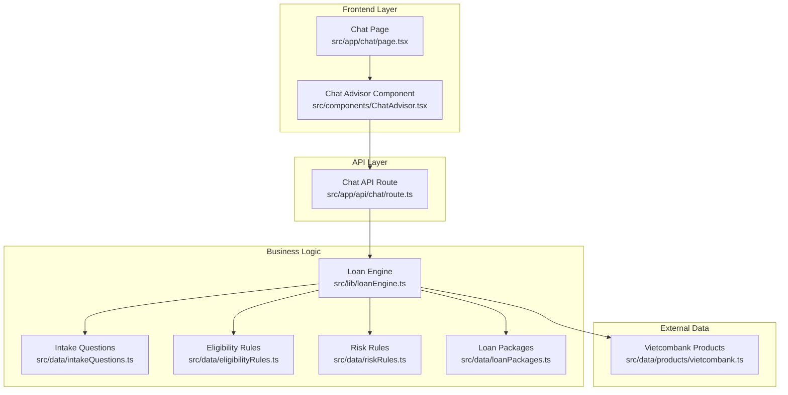
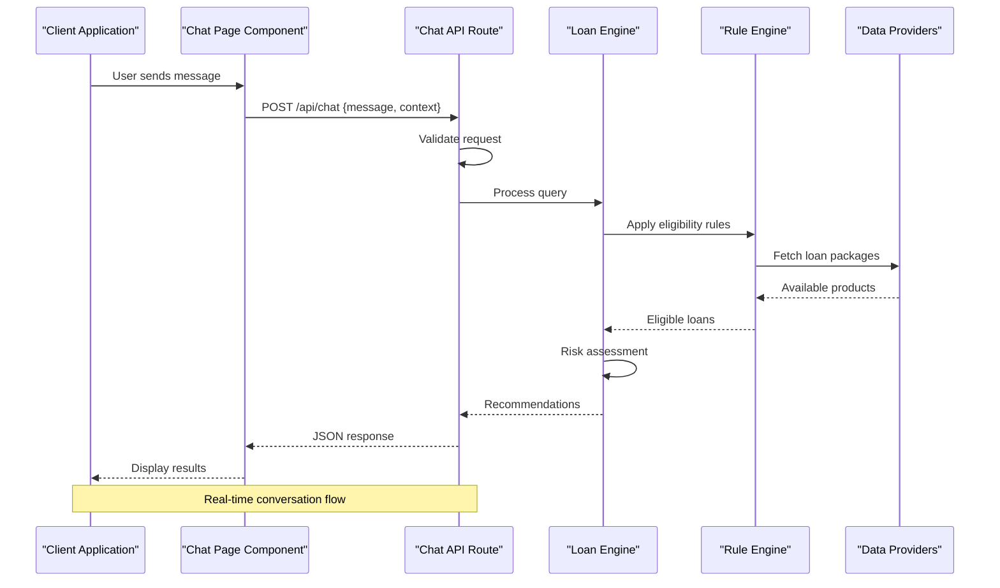
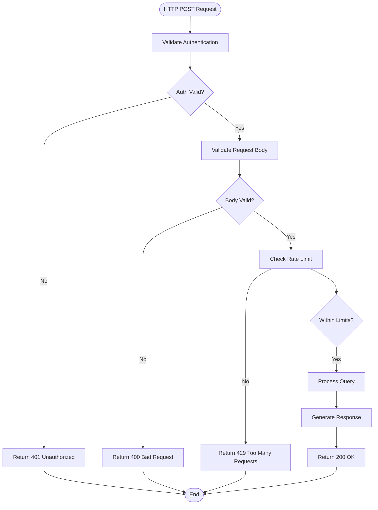
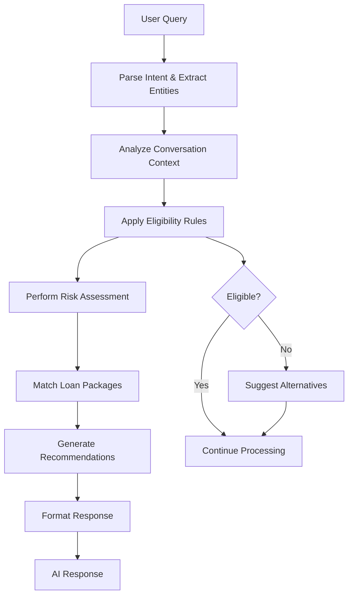
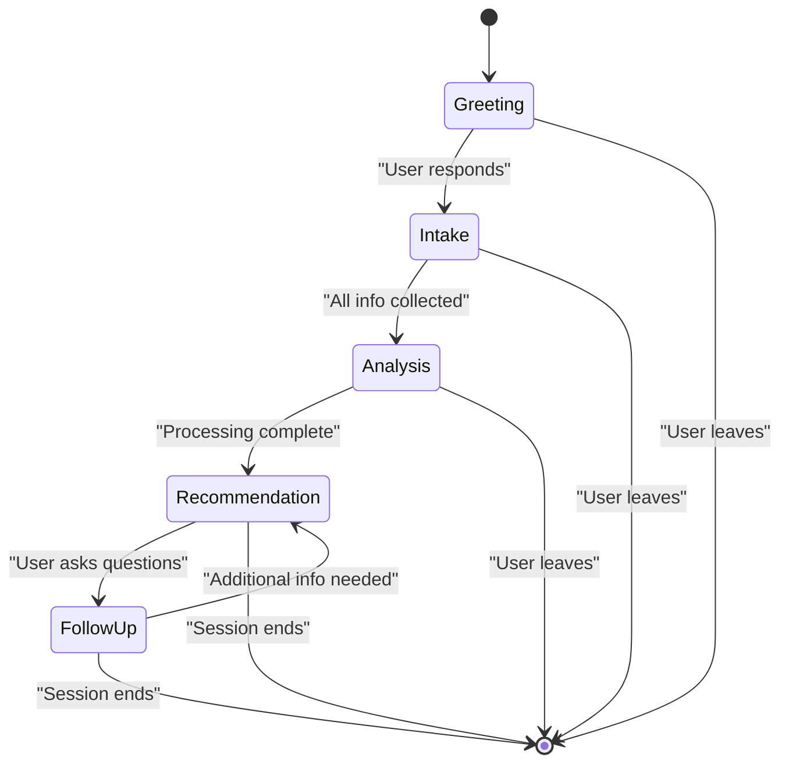

# Chat API

<cite>
**Referenced Files in This Document**
- [route.ts](file://src/app/api/chat/route.ts)
- [page.tsx](file://src/app/chat/page.tsx)
- [ChatAdvisor.tsx](file://src/components/ChatAdvisor.tsx)
- [loanEngine.ts](file://src/lib/loanEngine.ts)
- [intakeQuestions.ts](file://src/data/intakeQuestions.ts)
- [eligibilityRules.ts](file://src/data/eligibilityRules.ts)
- [riskRules.ts](file://src/data/riskRules.ts)
- [loanPackages.ts](file://src/data/loanPackages.ts)
- [vietcombank.ts](file://src/data/products/vietcombank.ts)
</cite>

## Table of Contents
1. [Introduction](#introduction)
2. [Project Structure](#project-structure)
3. [Core Components](#core-components)
4. [Architecture Overview](#architecture-overview)
5. [Detailed Component Analysis](#detailed-component-analysis)
6. [API Specification](#api-specification)
7. [Authentication & Security](#authentication--security)
8. [Rate Limiting & Performance](#rate-limiting--performance)
9. [Error Handling](#error-handling)
10. [Client Integration Guide](#client-integration-guide)
11. [Real-time Messaging Support](#real-time-messaging-support)
12. [Conversation State Management](#conversation-state-management)
13. [Troubleshooting Guide](#troubleshooting-guide)
14. [Conclusion](#conclusion)

## Introduction

The Chat API provides an AI-powered loan consultation interface that enables users to interact with a conversational agent for personalized loan recommendations. The endpoint processes natural language queries about loans, analyzes user financial situations, and generates tailored loan suggestions based on eligibility rules, risk assessment, and available loan packages.

This documentation covers the complete API specification, authentication requirements, rate limiting policies, error handling patterns, and integration guidelines for implementing client-side chat functionality.

## Project Structure

The Chat API is implemented as part of a Next.js application with the following key components:



**Diagram sources**
- [page.tsx](file://src/app/chat/page.tsx)
- [ChatAdvisor.tsx](file://src/components/ChatAdvisor.tsx)
- [route.ts](file://src/app/api/chat/route.ts)
- [loanEngine.ts](file://src/lib/loanEngine.ts)

**Section sources**
- [page.tsx](file://src/app/chat/page.tsx)
- [ChatAdvisor.tsx](file://src/components/ChatAdvisor.tsx)
- [route.ts](file://src/app/api/chat/route.ts)

## Core Components

The Chat API consists of several interconnected components that work together to process loan consultation requests:

### Chat API Route Handler
The main entry point for the chat endpoint that handles HTTP POST requests, validates input, and orchestrates the conversation flow.

### Loan Engine
The core business logic component that processes user queries, applies eligibility rules, performs risk assessment, and generates loan recommendations.

### Data Providers
Various data modules that contain loan packages, eligibility criteria, risk assessment rules, and bank-specific product information.

**Section sources**
- [route.ts](file://src/app/api/chat/route.ts)
- [loanEngine.ts](file://src/lib/loanEngine.ts)
- [intakeQuestions.ts](file://src/data/intakeQuestions.ts)
- [eligibilityRules.ts](file://src/data/eligibilityRules.ts)
- [riskRules.ts](file://src/data/riskRules.ts)
- [loanPackages.ts](file://src/data/loanPackages.ts)

## Architecture Overview

The Chat API follows a layered architecture pattern with clear separation of concerns:



**Diagram sources**
- [page.tsx](file://src/app/chat/page.tsx)
- [route.ts](file://src/app/api/chat/route.ts)
- [loanEngine.ts](file://src/lib/loanEngine.ts)

## Detailed Component Analysis

### Chat API Route Handler

The route handler serves as the primary interface for the chat endpoint, managing request validation, authentication, and response formatting.

#### Request Processing Flow



**Diagram sources**
- [route.ts](file://src/app/api/chat/route.ts)

### Loan Engine

The loan engine is the core processing unit that transforms user queries into actionable loan recommendations through a multi-stage analysis pipeline.

#### Processing Pipeline



**Diagram sources**
- [loanEngine.ts](file://src/lib/loanEngine.ts)
- [intakeQuestions.ts](file://src/data/intakeQuestions.ts)
- [eligibilityRules.ts](file://src/data/eligibilityRules.ts)
- [riskRules.ts](file://src/data/riskRules.ts)
- [loanPackages.ts](file://src/data/loanPackages.ts)

**Section sources**
- [route.ts](file://src/app/api/chat/route.ts)
- [loanEngine.ts](file://src/lib/loanEngine.ts)

## API Specification

### Endpoint Definition

**Endpoint:** `POST /api/chat`

**Description:** Processes loan consultation queries and returns AI-generated recommendations.

### Authentication Requirements

- **Type:** Bearer Token Authentication
- **Header:** `Authorization: Bearer <token>`
- **Token Source:** JWT tokens issued by the authentication service
- **Validation:** Tokens are validated against the configured secret key and expiration time

### Request Schema

```json
{
  "message": "string",
  "context": {
    "userId": "string",
    "sessionId": "string",
    "previousMessages": [
      {
        "role": "user" | "assistant",
        "content": "string",
        "timestamp": "ISO 8601 datetime"
      }
    ],
    "userProfile": {
      "income": "number",
      "creditScore": "number",
      "employmentStatus": "string",
      "existingLoans": "array"
    }
  },
  "options": {
    "maxRecommendations": "number",
    "includeAlternatives": "boolean",
    "language": "en" | "vi"
  }
}
```

### Response Schema

```json
{
  "success": "boolean",
  "data": {
    "response": "string",
    "recommendations": [
      {
        "loanId": "string",
        "name": "string",
        "bank": "string",
        "interestRate": "number",
        "maxAmount": "number",
        "term": "number",
        "eligibilityScore": "number",
        "reasons": ["string"],
        "requirements": ["string"]
      }
    ],
    "nextQuestions": ["string"],
    "conversationState": {
      "sessionId": "string",
      "step": "number",
      "collectedInfo": {
        "key": "value"
      }
    }
  },
  "metadata": {
    "processingTime": "number",
    "modelVersion": "string",
    "requestId": "string"
  },
  "errors": []
}
```

### Status Codes

| Code | Description | Usage |
|------|-------------|-------|
| 200 | Success | Normal successful response |
| 400 | Bad Request | Invalid request body or parameters |
| 401 | Unauthorized | Missing or invalid authentication token |
| 429 | Too Many Requests | Rate limit exceeded |
| 500 | Internal Server Error | Unexpected server error |

**Section sources**
- [route.ts](file://src/app/api/chat/route.ts)

## Authentication & Security

### Authentication Flow

The Chat API implements JWT-based authentication with the following security measures:

1. **Token Validation**: All requests must include a valid JWT token in the Authorization header
2. **Token Expiration**: Tokens are validated for expiration and revocation status
3. **Scope Verification**: Specific scopes are required for chat endpoint access
4. **IP Whitelisting**: Optional IP-based access control for additional security

### Security Headers

The API enforces the following security headers:

- `X-Content-Type-Options: nosniff`
- `X-Frame-Options: DENY`
- `X-XSS-Protection: 1; mode=block`
- `Strict-Transport-Security: max-age=31536000; includeSubDomains`

### Input Validation

All incoming requests undergo comprehensive validation:

- Message length limits (min: 1 char, max: 1000 chars)
- Context object structure validation
- User profile field type checking
- Option parameter validation

**Section sources**
- [route.ts](file://src/app/api/chat/route.ts)

## Rate Limiting & Performance

### Rate Limit Policies

The API implements tiered rate limiting to ensure fair usage and system stability:

| Tier | Requests/Minute | Requests/Hour | Burst Limit |
|------|----------------|---------------|-------------|
| Free | 10 | 100 | 5 |
| Basic | 30 | 500 | 10 |
| Pro | 100 | 2000 | 20 |
| Enterprise | Unlimited | Unlimited | 50 |

### Performance Optimization

The chat endpoint includes several performance optimizations:

- **Caching**: Frequently accessed loan packages are cached with TTL of 5 minutes
- **Connection Pooling**: Database connections are pooled and reused
- **Async Processing**: Heavy computations are performed asynchronously
- **Streaming Responses**: Large responses are streamed to reduce memory usage

### Monitoring & Metrics

Key performance metrics are tracked:

- Average response time per request
- Cache hit ratio
- Error rates by type
- Memory usage patterns
- Queue depth for async processing

**Section sources**
- [route.ts](file://src/app/api/chat/route.ts)

## Error Handling

### Error Response Format

All errors follow a consistent format:

```json
{
  "success": false,
  "data": null,
  "metadata": {
    "requestId": "unique-request-id",
    "timestamp": "ISO 8601 datetime",
    "processingTime": 0.123
  },
  "errors": [
    {
      "code": "ERROR_CODE",
      "message": "Human-readable error message",
      "details": {},
      "field": "optional-field-name"
    }
  ]
}
```

### Common Error Scenarios

| Error Code | HTTP Status | Description | Resolution |
|------------|-------------|-------------|------------|
| AUTH_INVALID | 401 | Invalid or expired authentication token | Refresh token or re-authenticate |
| RATE_LIMITED | 429 | Too many requests | Implement exponential backoff |
| INVALID_REQUEST | 400 | Malformed request body | Validate request schema |
| PROCESSING_ERROR | 500 | Internal processing failure | Retry with exponential backoff |
| LOAN_NOT_FOUND | 404 | Requested loan package not found | Check loan availability |
| ELIGIBILITY_FAILED | 422 | User doesn't meet eligibility criteria | Review requirements or adjust expectations |

### Error Recovery Strategies

- **Retry Logic**: Automatic retry for transient failures with exponential backoff
- **Fallback Responses**: Graceful degradation when external services fail
- **Graceful Shutdown**: Proper cleanup during deployment or restart
- **Health Checks**: Endpoint health monitoring and automatic recovery

**Section sources**
- [route.ts](file://src/app/api/chat/route.ts)

## Client Integration Guide

### Basic Integration

Here's how to integrate the Chat API in your client application:

```javascript
// Example implementation
class ChatClient {
  constructor(apiUrl, authToken) {
    this.apiUrl = apiUrl;
    this.authToken = authToken;
    this.conversationHistory = [];
  }

  async sendMessage(message, context = {}) {
    const requestBody = {
      message,
      context: {
        ...context,
        previousMessages: this.conversationHistory.slice(-10),
        userId: context.userId || this.getUserId()
      }
    };

    const response = await fetch(`${this.apiUrl}/api/chat`, {
      method: 'POST',
      headers: {
        'Content-Type': 'application/json',
        'Authorization': `Bearer ${this.authToken}`
      },
      body: JSON.stringify(requestBody)
    });

    if (!response.ok) {
      throw new Error(`HTTP error! status: ${response.status}`);
    }

    const data = await response.json();
    this.updateConversationHistory(message, data.data.response);
    return data;
  }

  updateConversationHistory(userMessage, assistantResponse) {
    this.conversationHistory.push({
      role: 'user',
      content: userMessage,
      timestamp: new Date().toISOString()
    });
    this.conversationHistory.push({
      role: 'assistant',
      content: assistantResponse,
      timestamp: new Date().toISOString()
    });
  }
}
```

### React Component Integration

For React applications, use the provided ChatAdvisor component:

```jsx
import ChatAdvisor from '@/components/ChatAdvisor';

function ChatPage() {
  return (
    <div className="chat-container">
      <ChatAdvisor
        apiUrl="/api/chat"
        authToken={authToken}
        onRecommendationClick={(loan) => handleLoanSelection(loan)}
        onError={(error) => handleError(error)}
      />
    </div>
  );
}
```

### Mobile Integration

For mobile applications, implement proper error handling and offline support:

- Use appropriate networking libraries (Axios, Fetch API)
- Implement local storage for conversation persistence
- Handle network connectivity changes gracefully
- Provide meaningful error messages to users

**Section sources**
- [ChatAdvisor.tsx](file://src/components/ChatAdvisor.tsx)
- [page.tsx](file://src/app/chat/page.tsx)

## Real-time Messaging Support

### WebSocket Implementation

The Chat API supports real-time messaging through WebSocket connections for enhanced user experience:

```javascript
// WebSocket connection setup
const ws = new WebSocket('wss://your-domain.com/ws/chat');

ws.onopen = () => {
  console.log('WebSocket connected');
};

ws.onmessage = (event) => {
  const message = JSON.parse(event.data);
  handleIncomingMessage(message);
};

ws.onerror = (error) => {
  console.error('WebSocket error:', error);
  // Implement reconnection logic
};
```

### Event Types

The WebSocket connection supports the following event types:

| Event | Description | Payload |
|-------|-------------|---------|
| message | New chat message | `{type, content, timestamp}` |
| typing | User is typing indicator | `{userId, isTyping}` |
| recommendation | Loan recommendation ready | `{recommendations, confidence}` |
| error | Connection or processing error | `{code, message, details}` |
| heartbeat | Connection keep-alive | `{timestamp}` |

### Connection Management

- **Automatic Reconnection**: Clients should implement exponential backoff for reconnection
- **Heartbeat Mechanism**: Regular heartbeat messages maintain connection health
- **Message Ordering**: Guaranteed message ordering within a session
- **Offline Support**: Local message queuing for offline scenarios

**Section sources**
- [route.ts](file://src/app/api/chat/route.ts)

## Conversation State Management

### State Persistence

The chat system maintains conversation state across multiple interactions:

```json
{
  "sessionId": "unique-session-id",
  "userId": "user-identifier",
  "startTime": "ISO 8601 datetime",
  "lastActivity": "ISO 8601 datetime",
  "currentStep": "intake" | "analysis" | "recommendation" | "follow-up",
  "collectedInfo": {
    "income": 5000,
    "creditScore": 750,
    "employmentYears": 5,
    "loanPurpose": "home_purchase",
    "preferredTerm": 24
  },
  "conversationHistory": [
    {
      "role": "user",
      "content": "I need a home loan",
      "timestamp": "ISO 8601 datetime"
    },
    {
      "role": "assistant", 
      "content": "I'd be happy to help you find the best home loan options...",
      "timestamp": "ISO 8601 datetime"
    }
  ]
}
```

### State Transitions



**Diagram sources**
- [loanEngine.ts](file://src/lib/loanEngine.ts)
- [intakeQuestions.ts](file://src/data/intakeQuestions.ts)

### State Recovery

- **Session Persistence**: Conversations are stored in Redis with configurable TTL
- **State Migration**: Versioned state schemas allow for backward compatibility
- **Recovery Mechanisms**: Automatic recovery from crashes or disconnections
- **Cleanup Procedures**: Regular cleanup of expired sessions and temporary data

**Section sources**
- [loanEngine.ts](file://src/lib/loanEngine.ts)
- [intakeQuestions.ts](file://src/data/intakeQuestions.ts)

## Troubleshooting Guide

### Common Issues and Solutions

| Issue | Symptoms | Solution |
|-------|----------|----------|
| Authentication Failures | 401 Unauthorized errors | Verify JWT token validity and expiration |
| Rate Limiting | 429 Too Many Requests | Implement request throttling and caching |
| Network Errors | Connection timeouts | Check network connectivity and implement retries |
| Invalid Responses | Malformed JSON responses | Validate response schema and handle parsing errors |
| Memory Leaks | Increasing memory usage | Monitor heap usage and implement garbage collection |
| Performance Issues | Slow response times | Optimize database queries and implement caching |

### Debugging Tools

- **Request Logging**: Enable detailed logging for API requests and responses
- **Performance Profiling**: Use profiling tools to identify bottlenecks
- **Error Tracking**: Implement centralized error tracking and alerting
- **Health Monitoring**: Set up health checks and monitoring dashboards

### Log Levels

- **DEBUG**: Detailed debugging information
- **INFO**: General operational information
- **WARN**: Warning conditions that don't prevent operation
- **ERROR**: Error conditions that may affect functionality
- **FATAL**: Critical errors that require immediate attention

**Section sources**
- [route.ts](file://src/app/api/chat/route.ts)

## Conclusion

The Chat API provides a robust, scalable solution for AI-powered loan consultations. With comprehensive authentication, rate limiting, error handling, and real-time messaging support, it offers a solid foundation for building sophisticated loan advisory applications.

Key benefits include:

- **Intelligent Processing**: Advanced NLP capabilities for understanding user intent
- **Personalized Recommendations**: Tailored loan suggestions based on individual profiles
- **Scalable Architecture**: Designed to handle high traffic volumes efficiently
- **Comprehensive Error Handling**: Robust error management and recovery mechanisms
- **Real-time Features**: WebSocket support for enhanced user experience

For optimal integration, follow the provided client integration guides and implement proper error handling, rate limiting, and state management strategies.