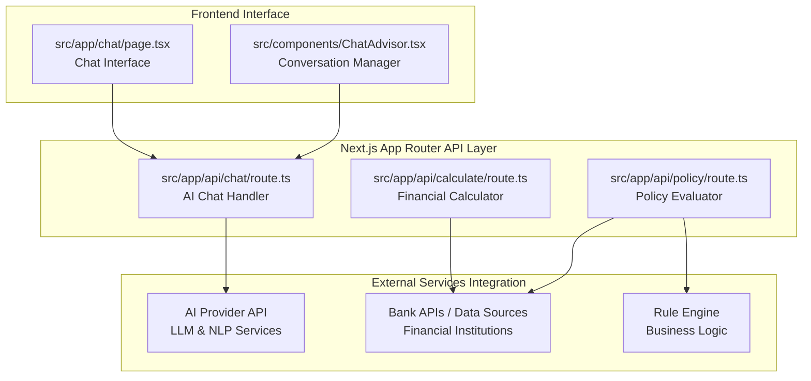
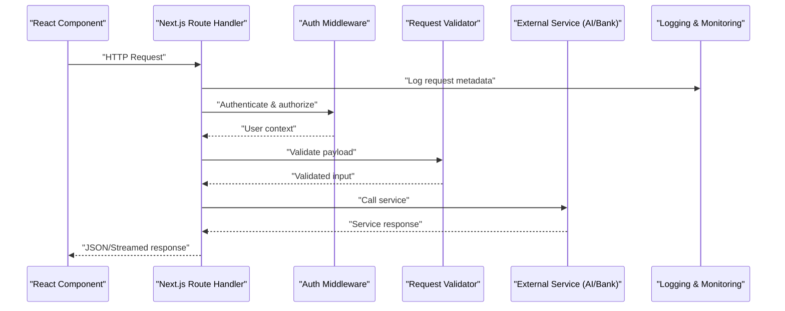
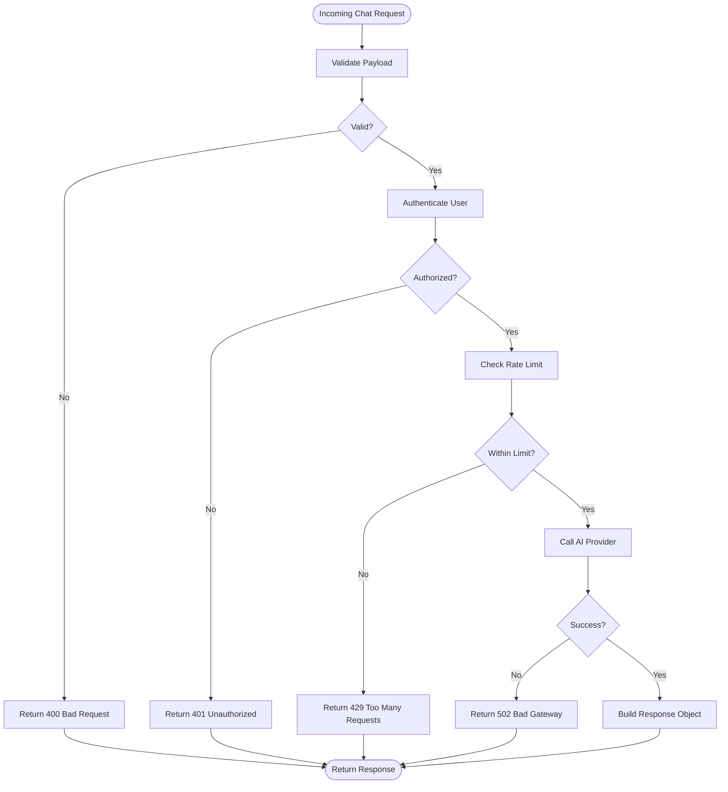
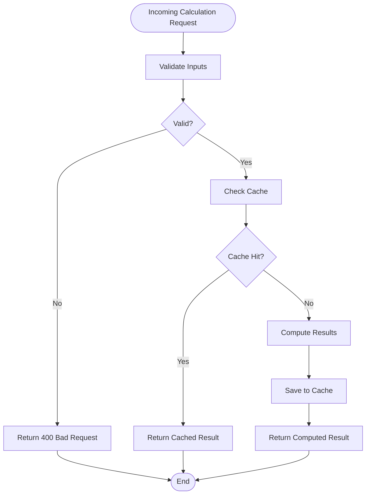
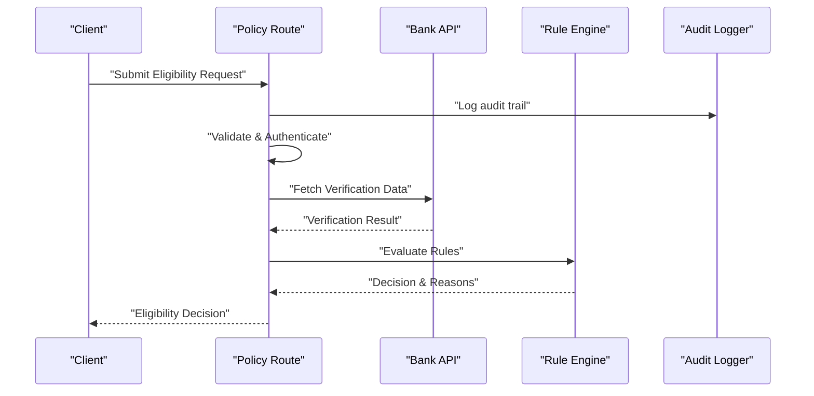
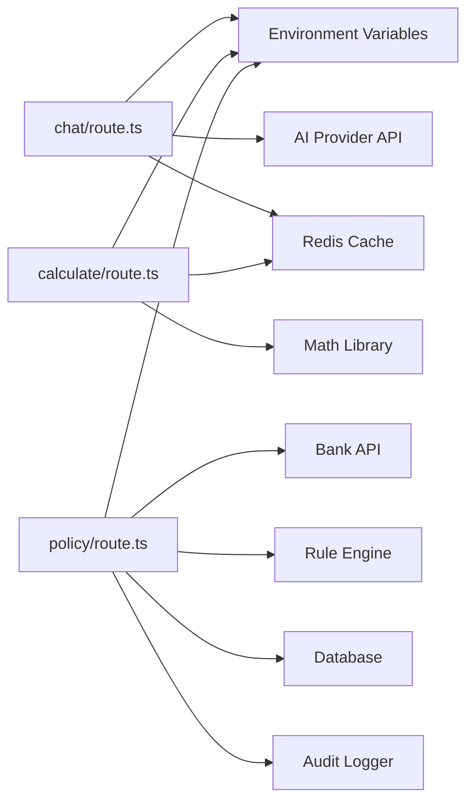

# API Architecture

<cite>
**Referenced Files in This Document**
- [route.ts](file://src/app/api/chat/route.ts)
- [route.ts](file://src/app/api/calculate/route.ts)
- [route.ts](file://src/app/api/policy/route.ts)
- [page.tsx](file://src/app/chat/page.tsx)
- [ChatAdvisor.tsx](file://src/components/ChatAdvisor.tsx)
- [next.config.mjs](file://next.config.mjs)
- [package.json](file://package.json)
</cite>

## Update Summary
**Changes Made**
- Updated to reflect the new API layer with three dedicated route handlers for chat, calculate, and policy operations
- Enhanced documentation for AI-driven financial advisory service architecture
- Added detailed analysis of the new serverless function patterns
- Updated integration patterns for external services including AI providers and bank APIs

## Table of Contents
1. [Introduction](#introduction)
2. [Project Structure](#project-structure)
3. [Core Components](#core-components)
4. [Architecture Overview](#architecture-overview)
5. [Detailed Component Analysis](#detailed-component-analysis)
6. [Dependency Analysis](#dependency-analysis)
7. [Performance Considerations](#performance-considerations)
8. [Troubleshooting Guide](#troubleshooting-guide)
9. [Conclusion](#conclusion)
10. [Appendices](#appendices)

## Introduction
This document explains the API architecture of the frontend-vaya application, focusing on the Next.js App Router serverless functions exposed under src/app/api. The new API layer implements three dedicated route handlers for chat, calculate, and policy operations, forming the foundation of an AI-driven financial advisory service. It covers request/response schemas, authentication mechanisms, error handling strategies, integration patterns with external services (AI providers and bank APIs), middleware usage for validation/logging/security headers, rate limiting, caching, performance optimization, CORS configuration, environment variable management, deployment considerations, and client-side consumption patterns in React components.

## Project Structure
The API routes follow the Next.js App Router convention where each route is a file named route.ts inside a directory under src/app/api. The three primary endpoints are:
- Chat: src/app/api/chat/route.ts - Handles conversational AI interactions
- Calculate: src/app/api/calculate/route.ts - Performs financial calculations and analysis
- Policy: src/app/api/policy/route.ts - Evaluates eligibility and policy decisions

Client-side pages and components consume these endpoints via standard fetch calls or custom hooks, providing a seamless user experience for the financial advisory service.



**Diagram sources**
- [route.ts](file://src/app/api/chat/route.ts)
- [route.ts](file://src/app/api/calculate/route.ts)
- [route.ts](file://src/app/api/policy/route.ts)
- [page.tsx](file://src/app/chat/page.tsx)
- [ChatAdvisor.tsx](file://src/components/ChatAdvisor.tsx)

**Section sources**
- [route.ts](file://src/app/api/chat/route.ts)
- [route.ts](file://src/app/api/calculate/route.ts)
- [route.ts](file://src/app/api/policy/route.ts)
- [page.tsx](file://src/app/chat/page.tsx)
- [ChatAdvisor.tsx](file://src/components/ChatAdvisor.tsx)

## Core Components
The new API layer consists of three specialized route handlers, each designed for specific financial advisory operations:

### Chat Endpoint
- **Purpose**: Handles conversational AI interactions for financial advice
- **Responsibilities**: Parse and validate chat messages, manage conversation context, integrate with AI providers, stream responses when available
- **Features**: Real-time conversation processing, context awareness, multi-turn dialogue support

### Calculate Endpoint  
- **Purpose**: Performs comprehensive financial calculations and analysis
- **Responsibilities**: Accept calculation parameters, apply business rules and formulas, return structured results with breakdowns
- **Features**: Loan calculations, investment projections, risk assessments, amortization schedules

### Policy Endpoint
- **Purpose**: Evaluates eligibility and policy decisions using business rules
- **Responsibilities**: Process applicant data, evaluate against bank rules, return decision outcomes with explanations
- **Features**: Eligibility scoring, compliance checking, recommendation engine

These endpoints implement standardized patterns for:
- Request parsing and validation with schema enforcement
- Authentication and authorization checks with role-based access
- Rate limiting and throttling for service protection
- Comprehensive logging and observability
- Robust error handling with standardized error responses
- Integration with external services (AI providers and banks)

**Section sources**
- [route.ts](file://src/app/api/chat/route.ts)
- [route.ts](file://src/app/api/calculate/route.ts)
- [route.ts](file://src/app/api/policy/route.ts)

## Architecture Overview
The API layer serves as a thin orchestration layer between the frontend and external services, implementing the serverless function pattern for scalable, maintainable financial advisory operations. Each route receives HTTP requests, validates inputs, authenticates users, enforces security policies, calls external APIs when necessary, and returns structured JSON or streamed responses.



[No sources needed since this diagram shows conceptual workflow, not actual code structure]

## Detailed Component Analysis

### Chat Endpoint
The chat endpoint provides AI-powered conversational capabilities for financial advisory services.

**Responsibilities:**
- Parse and validate chat messages and conversation context
- Authenticate user sessions/tokens for secure access
- Stream or return AI-generated financial advice
- Handle errors and timeouts gracefully with fallback mechanisms

**Request Schema:**
```typescript
interface ChatRequest {
  message: string;
  conversationId?: string;
  userId?: string;
  options?: {
    model?: string;
    temperature?: number;
    maxTokens?: number;
    context?: FinancialContext;
  };
}
```

**Response Schema:**
```typescript
interface ChatResponse {
  id: string;
  role: "assistant" | "user";
  content: string;
  timestamp: string;
  metadata?: {
    model?: string;
    tokensUsed?: number;
    confidence?: number;
    suggestions?: string[];
  };
}
```

**Authentication:**
- Validate session token or JWT from Authorization header
- Attach user context to downstream processing
- Support both authenticated and anonymous modes for basic queries

**Error Handling:**
- Return standardized error objects with status codes and messages
- Log errors with correlation IDs for debugging
- Implement retry logic for transient failures

**Integration Pattern:**
- Call AI provider with streaming support for real-time responses
- Implement retries and fallbacks for transient failures
- Cache common financial queries for improved performance

**Rate Limiting:**
- Enforce per-user or global request quotas
- Return 429 with retry-after when exceeded
- Different limits for authenticated vs anonymous users

**Caching Strategy:**
- Cache repeated prompts or short-lived responses when safe
- Use cache-control headers appropriately
- Implement intelligent caching for financial calculations

**Middleware Stack:**
- Validation middleware for request body schema enforcement
- Security headers middleware (CSP, HSTS, X-Frame-Options)
- Logging middleware for request/response lifecycle tracking
- Rate limiting middleware for abuse prevention



**Section sources**
- [route.ts](file://src/app/api/chat/route.ts)

### Calculate Endpoint
The calculate endpoint provides comprehensive financial calculation capabilities for various financial products and scenarios.

**Responsibilities:**
- Accept calculation parameters (loan amount, term, interest rate, etc.)
- Apply business rules and mathematical formulas
- Return structured results with breakdowns and recommendations
- Support multiple calculation types and scenarios

**Request Schema:**
```typescript
interface CalculateRequest {
  principal: number;
  annualInterestRate: number;
  termMonths: number;
  additionalFees?: number[];
  currency?: string;
  calculationType?: 'loan' | 'investment' | 'mortgage';
  scenario?: FinancialScenario;
}
```

**Response Schema:**
```typescript
interface CalculateResponse {
  monthlyPayment: number;
  totalPayment: number;
  totalInterest: number;
  amortizationSchedule?: Array<{
    month: number;
    payment: number;
    principal: number;
    interest: number;
    balance: number;
  }>;
  warnings?: string[];
  recommendations?: string[];
}
```

**Authentication:**
- Optional auth depending on sensitivity; may allow anonymous access for public calculators
- Support for premium features requiring authentication

**Error Handling:**
- Validate numeric ranges and units comprehensively
- Return clear error messages for invalid inputs
- Provide helpful suggestions for valid parameter ranges

**Integration Pattern:**
- Internal calculation engine with deterministic outputs
- External calculator service integration for complex scenarios
- Caching suitable for deterministic calculations

**Rate Limiting:**
- Moderate limits to prevent abuse while allowing reasonable usage
- Consider caching identical requests to reduce load

**Caching Strategy:**
- Cache frequent calculations keyed by normalized inputs
- Use ETag or cache-control headers for efficient caching
- Implement cache invalidation for changing parameters

**Middleware Stack:**
- Input validation and sanitization with schema enforcement
- Logging and metrics collection
- Performance monitoring and optimization



**Section sources**
- [route.ts](file://src/app/api/calculate/route.ts)

### Policy Endpoint
The policy endpoint evaluates eligibility and policy decisions based on user data and bank rules for financial product qualification.

**Responsibilities:**
- Evaluate eligibility and policy decisions based on user data and bank rules
- Return decision outcomes, reasons, and next steps for applicants
- Integrate with external verification services and internal rule engines

**Request Schema:**
```typescript
interface PolicyRequest {
  applicant: {
    name: string;
    income: number;
    creditScore: number;
    employmentStatus: string;
    age: number;
    location: string;
  };
  product: {
    type: string;
    minIncome: number;
    minCreditScore: number;
    requirements: Record<string, any>;
  };
  region?: string;
  documents?: Array<{
    type: string;
    verified: boolean;
    expiryDate?: string;
  }>;
}
```

**Response Schema:**
```typescript
interface PolicyResponse {
  decision: "approved" | "denied" | "review";
  score: number;
  reasons: string[];
  nextSteps?: string[];
  conditions?: string[];
  validityPeriod?: string;
}
```

**Authentication:**
- Require authenticated user with appropriate roles for sensitive operations
- Audit logging for compliance and regulatory requirements

**Error Handling:**
- Validate required fields and formats comprehensively
- Provide actionable error messages for incomplete applications
- Support partial validation for progressive forms

**Integration Pattern:**
- Call bank APIs for verification or scoring
- Use internal rule engine for decision logic
- Support multiple data sources for comprehensive evaluation

**Rate Limiting:**
- Strict limits due to sensitive nature of policy decisions
- Throttle per-user and per-IP to prevent abuse

**Caching Strategy:**
- Avoid caching sensitive decisions for security
- Cache only non-sensitive reference data and rules

**Middleware Stack:**
- Strong validation and sanitization with schema enforcement
- Security headers and audit logging for compliance
- Compliance checking and regulatory validation



**Diagram sources**
- [route.ts](file://src/app/api/policy/route.ts)

**Section sources**
- [route.ts](file://src/app/api/policy/route.ts)

## Dependency Analysis
The API routes depend on several key components and external services:

**Internal Dependencies:**
- Next.js runtime for serverless function execution
- Environment variables for secrets and configuration
- Shared utilities for validation, logging, and error handling

**External Dependencies:**
- AI providers (OpenAI, Anthropic, etc.) for conversational capabilities
- Bank APIs for verification and scoring services
- Database services for caching and persistence
- Monitoring and logging services for observability



**Diagram sources**
- [route.ts](file://src/app/api/chat/route.ts)
- [route.ts](file://src/app/api/calculate/route.ts)
- [route.ts](file://src/app/api/policy/route.ts)

**Section sources**
- [package.json](file://package.json)
- [next.config.mjs](file://next.config.mjs)

## Performance Considerations
The API layer implements several performance optimization strategies:

**Streaming Responses:**
- Streaming responses for long-running AI calls to improve perceived latency
- Progressive loading for large calculation results
- Real-time updates for policy evaluation progress

**Connection Management:**
- Connection pooling and keep-alive for external API clients
- Efficient resource cleanup and memory management
- Optimized network request batching

**Caching Strategies:**
- Caching deterministic results (calculations, reference data) with appropriate cache-control headers
- Intelligent cache invalidation based on parameter changes
- Multi-level caching (client, CDN, server) for optimal performance

**Resource Optimization:**
- Minimal payload sizes by selecting only necessary fields
- Lazy loading of heavy dependencies within route handlers
- Efficient data serialization and deserialization

**Monitoring and Scaling:**
- Monitoring and tracing to identify bottlenecks
- Auto-scaling based on demand patterns
- Graceful degradation during high load periods

[No sources needed since this section provides general guidance]

## Troubleshooting Guide
Common issues and resolutions for the API layer:

**Authentication Issues:**
- Verify token presence, expiration, and signature
- Check environment variables for secret keys
- Ensure proper CORS configuration for cross-origin requests

**Validation Errors:**
- Inspect request payloads against expected schemas
- Add detailed field-level error messages
- Validate input formats and data types

**External Service Failures:**
- Implement retries with exponential backoff
- Set appropriate timeouts and circuit breakers
- Configure fallback mechanisms for critical services

**Rate Limiting Problems:**
- Adjust quotas or implement client-side queuing
- Log throttle events for analysis
- Monitor usage patterns and adjust limits accordingly

**Performance Issues:**
- Profile slow endpoints and optimize database queries
- Implement proper caching strategies
- Monitor memory usage and garbage collection

**Deployment Issues:**
- Confirm environment variables are set in the hosting platform
- Verify route files are included in build artifacts
- Check for missing dependencies or version conflicts

**Section sources**
- [route.ts](file://src/app/api/chat/route.ts)
- [route.ts](file://src/app/api/calculate/route.ts)
- [route.ts](file://src/app/api/policy/route.ts)

## Conclusion
The frontend-vaya API architecture leverages Next.js App Router serverless functions to provide secure, scalable, and maintainable endpoints for chat, calculate, and policy operations. The new API layer forms the foundation of an AI-driven financial advisory service, implementing robust validation, authentication, rate limiting, caching, and error handling. By integrating seamlessly with external AI and bank services through standardized patterns, the system ensures reliability and performance while supporting the complex requirements of financial advisory operations. Proper middleware usage, comprehensive monitoring, and deployment practices further enhance security and operational visibility.

[No sources needed since this section summarizes without analyzing specific files]

## Appendices

### Client-Side Consumption Patterns
The frontend consumes the API endpoints through modern React patterns:

**Fetch Implementation:**
- Use fetch or custom hooks to call API endpoints
- Handle loading, success, and error states in React components
- Implement retry logic for transient failures
- Display user-friendly error messages and recovery options

**Component Integration:**
- Chat page consuming chat endpoint for conversational interface
- ChatAdvisor component managing conversation flow and state
- Form components for calculation inputs and policy applications

**Error Handling Patterns:**
- Global error boundary implementation
- Toast notifications for user feedback
- Graceful degradation for failed requests

**Section sources**
- [page.tsx](file://src/app/chat/page.tsx)
- [ChatAdvisor.tsx](file://src/components/ChatAdvisor.tsx)

### CORS Configuration
Cross-Origin Resource Sharing is configured to support the multi-domain architecture:

**Configuration Settings:**
- Configure allowed origins, methods, and headers in Next.js config or middleware
- Ensure preflight requests are handled correctly
- Test cross-origin requests during development and production

**Security Considerations:**
- Restrict allowed origins to trusted domains
- Implement proper credential handling
- Monitor and log CORS violations

**Section sources**
- [next.config.mjs](file://next.config.mjs)

### Environment Variable Management
Environment variables are managed securely across different deployment environments:

**Development Setup:**
- Store secrets and configuration in environment variables
- Use .env.local for development and platform-specific secrets for production
- Validate required variables at startup

**Production Deployment:**
- Secure secret management through platform-native solutions
- Environment-specific configuration files
- Automated validation and testing of environment setup

**Security Best Practices:**
- Never commit sensitive values to version control
- Rotate secrets regularly
- Monitor for unauthorized access attempts

**Section sources**
- [package.json](file://package.json)
- [next.config.mjs](file://next.config.mjs)

### API Documentation Examples
Example API calls for each endpoint:

**Chat Endpoint Example:**
```javascript
const response = await fetch('/api/chat', {
  method: 'POST',
  headers: { 'Content-Type': 'application/json' },
  body: JSON.stringify({
    message: "What's the best mortgage option for my situation?",
    conversationId: "unique-conversation-id"
  })
});
```

**Calculate Endpoint Example:**
```javascript
const response = await fetch('/api/calculate', {
  method: 'POST',
  headers: { 'Content-Type': 'application/json' },
  body: JSON.stringify({
    principal: 500000,
    annualInterestRate: 4.5,
    termMonths: 360,
    calculationType: 'mortgage'
  })
});
```

**Policy Endpoint Example:**
```javascript
const response = await fetch('/api/policy', {
  method: 'POST',
  headers: { 'Content-Type': 'application/json' },
  body: JSON.stringify({
    applicant: {
      name: "John Doe",
      income: 75000,
      creditScore: 720,
      employmentStatus: "full-time"
    },
    product: {
      type: "personal_loan",
      minIncome: 30000,
      minCreditScore: 650
    }
  })
});
```

[No sources needed since this section provides example code patterns]