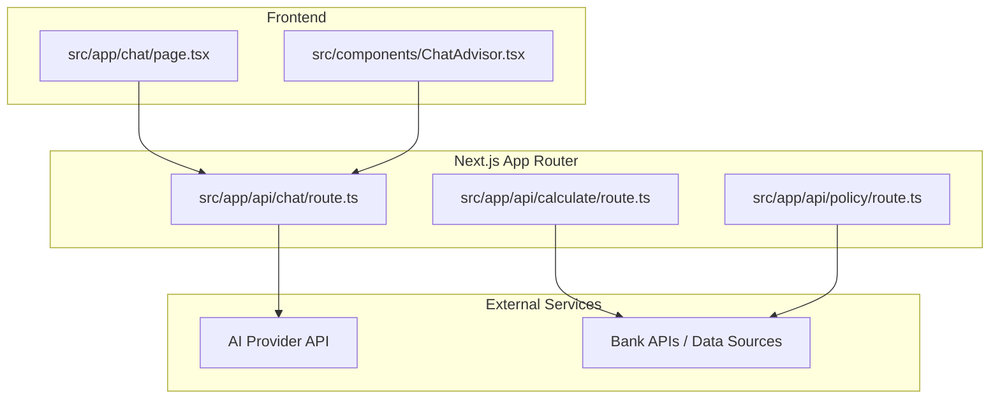
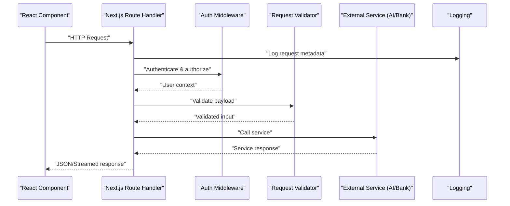
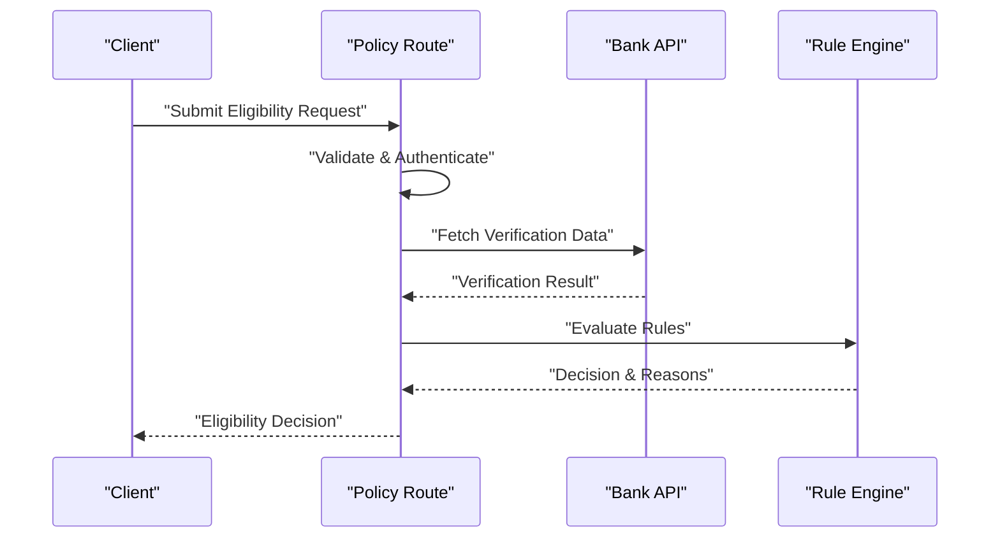
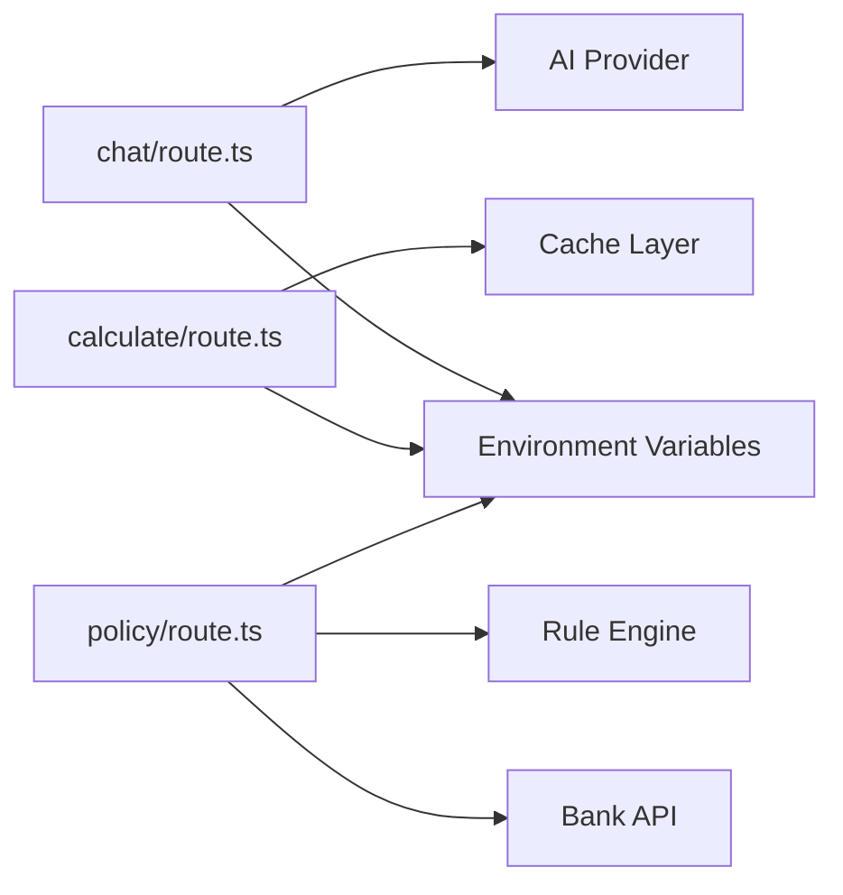

# API Architecture

<cite>
**Referenced Files in This Document**
- [route.ts](file://src/app/api/chat/route.ts)
- [route.ts](file://src/app/api/calculate/route.ts)
- [route.ts](file://src/app/api/policy/route.ts)
- [page.tsx](file://src/app/chat/page.tsx)
- [ChatAdvisor.tsx](file://src/components/ChatAdvisor.tsx)
- [next.config.mjs](file://next.config.mjs)
- [package.json](file://package.json)
</cite>

## Table of Contents
1. [Introduction](#introduction)
2. [Project Structure](#project-structure)
3. [Core Components](#core-components)
4. [Architecture Overview](#architecture-overview)
5. [Detailed Component Analysis](#detailed-component-analysis)
6. [Dependency Analysis](#dependency-analysis)
7. [Performance Considerations](#performance-considerations)
8. [Troubleshooting Guide](#troubleshooting-guide)
9. [Conclusion](#conclusion)
10. [Appendices](#appendices)

## Introduction
This document explains the API architecture of the frontend-vaya application, focusing on the Next.js App Router serverless functions exposed under src/app/api. It covers the chat, calculate, and policy endpoints, including request/response schemas, authentication mechanisms, error handling strategies, integration patterns with external services (AI providers and bank APIs), middleware usage for validation/logging/security headers, rate limiting, caching, performance optimization, CORS configuration, environment variable management, deployment considerations, and client-side consumption patterns in React components.

## Project Structure
The API routes follow the Next.js App Router convention where each route is a file named route.ts inside a directory under src/app/api. The three primary endpoints are:
- Chat: src/app/api/chat/route.ts
- Calculate: src/app/api/calculate/route.ts
- Policy: src/app/api/policy/route.ts

Client-side pages and components consume these endpoints via standard fetch calls or custom hooks.

**Diagram sources**
- [route.ts](file://src/app/api/chat/route.ts)
- [route.ts](file://src/app/api/calculate/route.ts)
- [route.ts](file://src/app/api/policy/route.ts)
- [page.tsx](file://src/app/chat/page.tsx)
- [ChatAdvisor.tsx](file://src/components/ChatAdvisor.tsx)

**Section sources**
- [route.ts](file://src/app/api/chat/route.ts)
- [route.ts](file://src/app/api/calculate/route.ts)
- [route.ts](file://src/app/api/policy/route.ts)
- [page.tsx](file://src/app/chat/page.tsx)
- [ChatAdvisor.tsx](file://src/components/ChatAdvisor.tsx)

## Core Components
- Chat endpoint: Handles conversational requests, integrates with AI provider(s), manages conversation state if needed, and returns streaming or non-streaming responses.
- Calculate endpoint: Performs financial calculations based on inputs, optionally using rules or third-party calculators, and returns structured results.
- Policy endpoint: Evaluates eligibility or policy decisions using business rules and data from bank APIs or internal datasets, returning decision outcomes and explanations.

These endpoints implement:
- Request parsing and validation
- Authentication and authorization checks
- Rate limiting and throttling
- Logging and observability
- Error handling and standardized error responses
- Integration with external services (AI and banks)

**Section sources**
- [route.ts](file://src/app/api/chat/route.ts)
- [route.ts](file://src/app/api/calculate/route.ts)
- [route.ts](file://src/app/api/policy/route.ts)

## Architecture Overview
The API layer acts as a thin orchestration layer between the frontend and external services. Each route receives HTTP requests, validates inputs, authenticates users, enforces policies (rate limits, security headers), calls external APIs when necessary, and returns JSON or streamed responses.

[No sources needed since this diagram shows conceptual workflow, not actual code structure]

## Detailed Component Analysis

### Chat Endpoint
Responsibilities:
- Parse and validate chat messages and conversation context
- Authenticate user sessions/tokens
- Stream or return AI-generated responses
- Handle errors and timeouts gracefully

Request schema:
- message: string
- conversationId?: string
- userId?: string
- options?: { model?, temperature?, maxTokens? }

Response schema:
- id: string
- role: "assistant" | "user"
- content: string
- timestamp: string
- metadata?: { model?, tokensUsed? }

Authentication:
- Validate session token or JWT from Authorization header
- Attach user context to downstream processing

Error handling:
- Return standardized error objects with status codes and messages
- Log errors with correlation IDs

Integration pattern:
- Call AI provider with streaming support when available
- Implement retries and fallbacks for transient failures

Rate limiting:
- Enforce per-user or global request quotas
- Return 429 with retry-after when exceeded

Caching:
- Cache repeated prompts or short-lived responses when safe
- Use cache-control headers appropriately

Middleware:
- Validation middleware for request body
- Security headers middleware (CSP, HSTS, X-Frame-Options)
- Logging middleware for request/response lifecycle

**Section sources**
- [route.ts](file://src/app/api/chat/route.ts)

### Calculate Endpoint
Responsibilities:
- Accept calculation parameters (e.g., loan amount, term, interest rate)
- Apply business rules and formulas
- Return structured results with breakdowns and recommendations

Request schema:
- principal: number
- annualInterestRate: number
- termMonths: number
- additionalFees?: number[]
- currency?: string

Response schema:
- monthlyPayment: number
- totalPayment: number
- totalInterest: number
- amortizationSchedule?: Array<{ month, payment, principal, interest, balance }>
- warnings?: string[]

Authentication:
- Optional auth depending on sensitivity; may allow anonymous access for public calculators

Error handling:
- Validate numeric ranges and units
- Return clear error messages for invalid inputs

Integration pattern:
- Internal calculation engine or external calculator service
- Deterministic outputs suitable for caching

Rate limiting:
- Moderate limits to prevent abuse
- Consider caching identical requests

Caching:
- Cache frequent calculations keyed by normalized inputs
- Use ETag or cache-control headers

Middleware:
- Input validation and sanitization
- Logging and metrics

**Section sources**
- [route.ts](file://src/app/api/calculate/route.ts)

### Policy Endpoint
Responsibilities:
- Evaluate eligibility and policy decisions based on user data and bank rules
- Return decision outcomes, reasons, and next steps

Request schema:
- applicant: { name, income, creditScore, employmentStatus }
- product: { type, minIncome, minCreditScore }
- region?: string
- documents?: Array<{ type, verified }>

Response schema:
- decision: "approved" | "denied" | "review"
- score: number
- reasons: string[]
- nextSteps?: string[]

Authentication:
- Require authenticated user with appropriate roles
- Audit logging for compliance

Error handling:
- Validate required fields and formats
- Provide actionable error messages

Integration pattern:
- Call bank APIs for verification or scoring
- Use internal rule engine for decision logic

Rate limiting:
- Strict limits due to sensitive nature
- Throttle per-user and per-IP

Caching:
- Avoid caching sensitive decisions
- Cache only non-sensitive reference data

Middleware:
- Strong validation and sanitization
- Security headers and audit logging

**Diagram sources**
- [route.ts](file://src/app/api/policy/route.ts)

**Section sources**
- [route.ts](file://src/app/api/policy/route.ts)

## Dependency Analysis
The API routes depend on:
- Next.js runtime for serverless function execution
- Environment variables for secrets and configuration
- External services (AI providers, bank APIs)
- Optional middleware for validation, logging, and security

**Diagram sources**
- [route.ts](file://src/app/api/chat/route.ts)
- [route.ts](file://src/app/api/calculate/route.ts)
- [route.ts](file://src/app/api/policy/route.ts)

**Section sources**
- [package.json](file://package.json)
- [next.config.mjs](file://next.config.mjs)

## Performance Considerations
- Streaming responses for long-running AI calls to improve perceived latency
- Connection pooling and keep-alive for external API clients
- Caching deterministic results (calculations, reference data) with appropriate cache-control headers
- Rate limiting to protect backend services and ensure fair usage
- Minimal payload sizes by selecting only necessary fields
- Lazy loading of heavy dependencies within route handlers
- Monitoring and tracing to identify bottlenecks

[No sources needed since this section provides general guidance]

## Troubleshooting Guide
Common issues and resolutions:
- Authentication failures: Verify token presence, expiration, and signature; check environment variables for secret keys
- Validation errors: Inspect request payloads against expected schemas; add detailed field-level error messages
- External service timeouts: Implement retries with exponential backoff; set appropriate timeouts and circuit breakers
- Rate limit errors: Adjust quotas or implement client-side queuing; log throttle events for analysis
- CORS misconfiguration: Ensure allowed origins, methods, and headers match client requirements
- Deployment issues: Confirm environment variables are set in the hosting platform; verify route files are included in build artifacts

**Section sources**
- [route.ts](file://src/app/api/chat/route.ts)
- [route.ts](file://src/app/api/calculate/route.ts)
- [route.ts](file://src/app/api/policy/route.ts)

## Conclusion
The frontend-vaya API architecture leverages Next.js App Router serverless functions to provide secure, scalable, and maintainable endpoints for chat, calculate, and policy operations. By implementing robust validation, authentication, rate limiting, caching, and error handling, the system ensures reliability and performance while integrating seamlessly with external AI and bank services. Proper middleware usage and deployment practices further enhance security and operational visibility.

[No sources needed since this section summarizes without analyzing specific files]

## Appendices

### Client-Side Consumption Patterns
- Use fetch or custom hooks to call API endpoints
- Handle loading, success, and error states in React components
- Implement retry logic for transient failures
- Display user-friendly error messages and recovery options

Example component references:
- Chat page consuming chat endpoint
- ChatAdvisor component managing conversation flow

**Section sources**
- [page.tsx](file://src/app/chat/page.tsx)
- [ChatAdvisor.tsx](file://src/components/ChatAdvisor.tsx)

### CORS Configuration
- Configure allowed origins, methods, and headers in Next.js config or middleware
- Ensure preflight requests are handled correctly
- Test cross-origin requests during development and production

**Section sources**
- [next.config.mjs](file://next.config.mjs)

### Environment Variable Management
- Store secrets and configuration in environment variables
- Use .env.local for development and platform-specific secrets for production
- Validate required variables at startup

**Section sources**
- [package.json](file://package.json)
- [next.config.mjs](file://next.config.mjs)