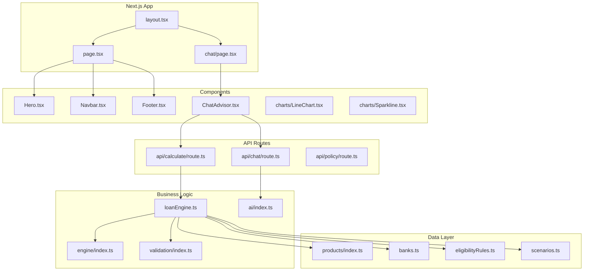
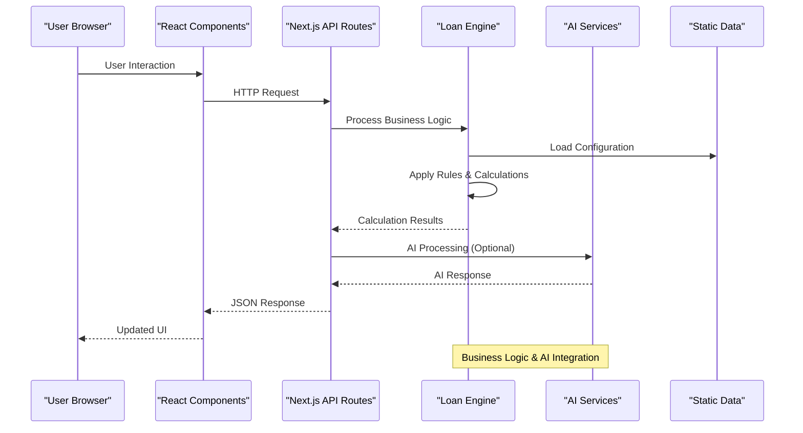
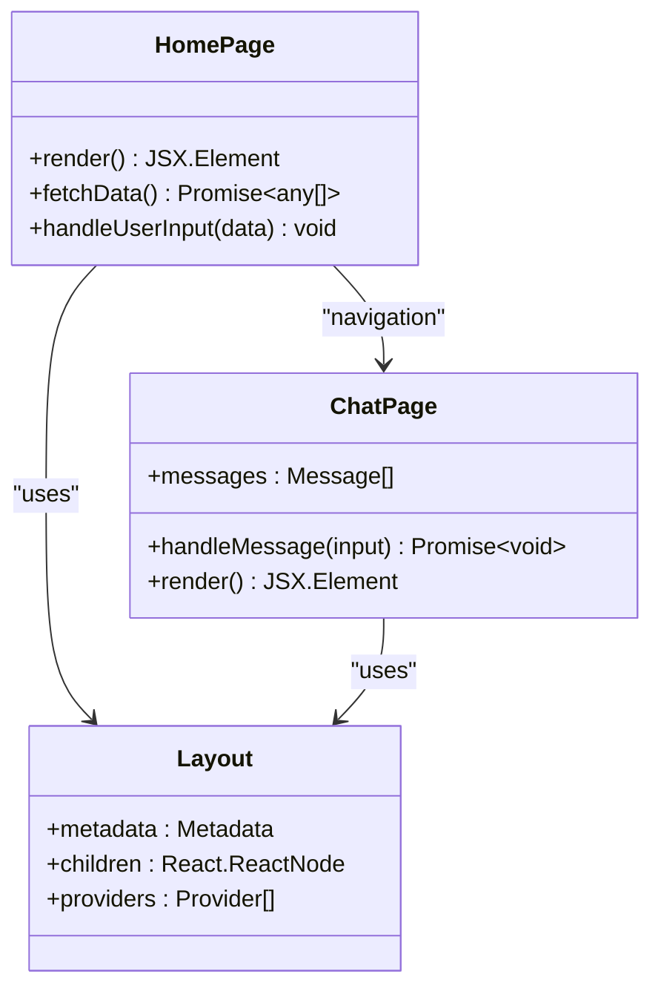
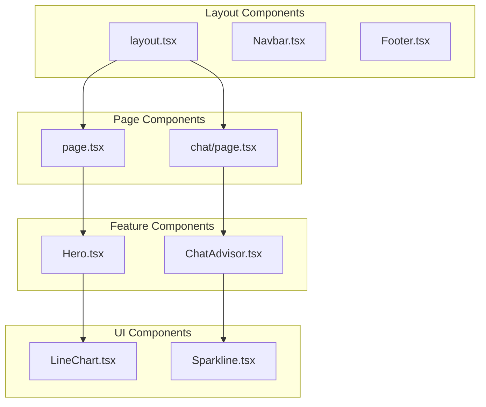
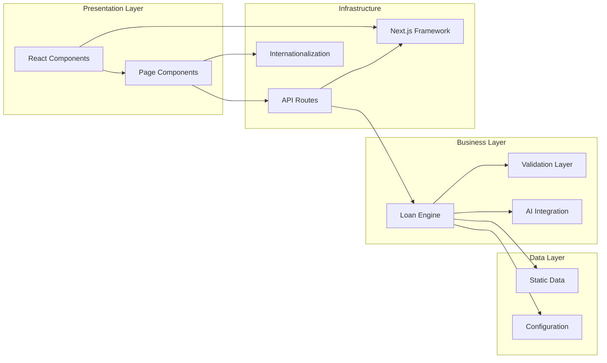

# Architecture Overview

<cite>
**Referenced Files in This Document**
- [next.config.mjs](file://next.config.mjs)
- [package.json](file://package.json)
- [tailwind.config.ts](file://tailwind.config.ts)
- [postcss.config.mjs](file://postcss.config.mjs)
- [tsconfig.json](file://tsconfig.json)
- [src/app/layout.tsx](file://src/app/layout.tsx)
- [src/app/page.tsx](file://src/app/page.tsx)
- [src/app/chat/page.tsx](file://src/app/chat/page.tsx)
- [src/app/api/calculate/route.ts](file://src/app/api/calculate/route.ts)
- [src/app/api/chat/route.ts](file://src/app/api/chat/route.ts)
- [src/app/api/policy/route.ts](file://src/app/api/policy/route.ts)
- [src/components/ChatAdvisor.tsx](file://src/components/ChatAdvisor.tsx)
- [src/components/Hero.tsx](file://src/components/Hero.tsx)
- [src/components/Navbar.tsx](file://src/components/Navbar.tsx)
- [src/components/Footer.tsx](file://src/components/Footer.tsx)
- [src/components/charts/LineChart.tsx](file://src/components/charts/LineChart.tsx)
- [src/components/charts/Sparkline.tsx](file://src/components/charts/Sparkline.tsx)
- [src/data/products/index.ts](file://src/data/products/index.ts)
- [src/data/banks.ts](file://src/data/banks.ts)
- [src/data/checklists.ts](file://src/data/checklists.ts)
- [src/data/eligibilityRules.ts](file://src/data/eligibilityRules.ts)
- [src/data/intakeQuestions.ts](file://src/data/intakeQuestions.ts)
- [src/data/loanPackages.ts](file://src/data/loanPackages.ts)
- [src/data/riskRules.ts](file://src/data/riskRules.ts)
- [src/data/scenarios.ts](file://src/data/scenarios.ts)
- [src/i18n/I18nProvider.tsx](file://src/i18n/I18nProvider.tsx)
- [src/i18n/dict.ts](file://src/i18n/dict.ts)
- [src/lib/engine/index.ts](file://src/lib/engine/index.ts)
- [src/lib/validation/index.ts](file://src/lib/validation/index.ts)
- [src/lib/ai/index.ts](file://src/lib/ai/index.ts)
- [src/lib/loanEngine.ts](file://src/lib/loanEngine.ts)
</cite>

## Table of Contents
1. [Introduction](#introduction)
2. [Project Structure](#project-structure)
3. [Core Components](#core-components)
4. [Architecture Overview](#architecture-overview)
5. [Detailed Component Analysis](#detailed-component-analysis)
6. [Dependency Analysis](#dependency-analysis)
7. [Performance Considerations](#performance-considerations)
8. [Troubleshooting Guide](#troubleshooting-guide)
9. [Conclusion](#conclusion)
10. [Appendices](#appendices)

## Introduction
This document describes the architecture of the frontend-vaya application, built with Next.js App Router for server-side rendering (SSR) and client-side interactivity. The system combines React components for UI composition, TypeScript for type safety, Tailwind CSS for consistent styling, and API routes for backend integration. It also integrates AI services through dedicated API endpoints and a loan engine to process business rules and scenarios.

The design emphasizes clear separation between layout components, business logic modules, and presentation components, while providing robust data flow patterns from user input through validation layers to the loan engine and external AI services.

## Project Structure
The project follows Next.js App Router conventions:
- app/: Contains page components, layouts, and API routes
- components/: Reusable UI components organized by feature
- data/: Static data and configuration files
- i18n/: Internationalization support
- lib/: Core libraries including engine, validation, and AI utilities

**Diagram sources**
- [src/app/layout.tsx](file://src/app/layout.tsx)
- [src/app/page.tsx](file://src/app/page.tsx)
- [src/app/chat/page.tsx](file://src/app/chat/page.tsx)
- [src/app/api/calculate/route.ts](file://src/app/api/calculate/route.ts)
- [src/app/api/chat/route.ts](file://src/app/api/chat/route.ts)
- [src/app/api/policy/route.ts](file://src/app/api/policy/route.ts)
- [src/components/Hero.tsx](file://src/components/Hero.tsx)
- [src/components/Navbar.tsx](file://src/components/Navbar.tsx)
- [src/components/Footer.tsx](file://src/components/Footer.tsx)
- [src/components/ChatAdvisor.tsx](file://src/components/ChatAdvisor.tsx)
- [src/components/charts/LineChart.tsx](file://src/components/charts/LineChart.tsx)
- [src/components/charts/Sparkline.tsx](file://src/components/charts/Sparkline.tsx)
- [src/lib/loanEngine.ts](file://src/lib/loanEngine.ts)
- [src/lib/engine/index.ts](file://src/lib/engine/index.ts)
- [src/lib/validation/index.ts](file://src/lib/validation/index.ts)
- [src/lib/ai/index.ts](file://src/lib/ai/index.ts)
- [src/data/products/index.ts](file://src/data/products/index.ts)
- [src/data/banks.ts](file://src/data/banks.ts)
- [src/data/eligibilityRules.ts](file://src/data/eligibilityRules.ts)
- [src/data/scenarios.ts](file://src/data/scenarios.ts)

**Section sources**
- [next.config.mjs](file://next.config.mjs)
- [package.json](file://package.json)
- [tailwind.config.ts](file://tailwind.config.ts)
- [postcss.config.mjs](file://postcss.config.mjs)
- [tsconfig.json](file://tsconfig.json)

## Core Components
The application is structured around several key component categories:

### Layout Components
- **layout.tsx**: Root layout component that wraps all pages with global providers and metadata
- **Navbar.tsx**: Navigation component with responsive design
- **Footer.tsx**: Application footer with links and information

### Page Components
- **page.tsx**: Home page component showcasing hero section and key features
- **chat/page.tsx**: Chat interface page for AI-powered loan consultation

### Business Logic Modules
- **loanEngine.ts**: Core loan calculation and processing engine
- **engine/index.ts**: Engine orchestration and workflow management
- **validation/index.ts**: Input validation and business rule enforcement
- **ai/index.ts**: AI service integration and chat functionality

### Data Layer
- **products/**: Product definitions and configurations
- **banks.ts**: Bank-specific rules and parameters
- **eligibilityRules.ts**: Customer eligibility criteria
- **scenarios.ts**: Loan scenario definitions and calculations

**Section sources**
- [src/app/layout.tsx](file://src/app/layout.tsx)
- [src/app/page.tsx](file://src/app/page.tsx)
- [src/app/chat/page.tsx](file://src/app/chat/page.tsx)
- [src/components/Navbar.tsx](file://src/components/Navbar.tsx)
- [src/components/Footer.tsx](file://src/components/Footer.tsx)
- [src/lib/loanEngine.ts](file://src/lib/loanEngine.ts)
- [src/lib/engine/index.ts](file://src/lib/engine/index.ts)
- [src/lib/validation/index.ts](file://src/lib/validation/index.ts)
- [src/lib/ai/index.ts](file://src/lib/ai/index.ts)
- [src/data/products/index.ts](file://src/data/products/index.ts)
- [src/data/banks.ts](file://src/data/banks.ts)
- [src/data/eligibilityRules.ts](file://src/data/eligibilityRules.ts)
- [src/data/scenarios.ts](file://src/data/scenarios.ts)

## Architecture Overview
The application follows a layered architecture pattern with clear separation of concerns:

**Diagram sources**
- [src/app/api/calculate/route.ts](file://src/app/api/calculate/route.ts)
- [src/app/api/chat/route.ts](file://src/app/api/chat/route.ts)
- [src/lib/loanEngine.ts](file://src/lib/loanEngine.ts)
- [src/lib/ai/index.ts](file://src/lib/ai/index.ts)
- [src/data/products/index.ts](file://src/data/products/index.ts)

The architecture supports:
- **Server-Side Rendering**: Initial page load optimization with SSR
- **Client-Side Interactivity**: Dynamic updates without full page reloads
- **API Abstraction**: Clean separation between frontend and backend logic
- **Modular Design**: Pluggable components and services
- **Type Safety**: Comprehensive TypeScript coverage throughout

## Detailed Component Analysis

### Page Components Architecture
The page components demonstrate the separation between layout, content, and interaction logic:

**Diagram sources**
- [src/app/page.tsx](file://src/app/page.tsx)
- [src/app/chat/page.tsx](file://src/app/chat/page.tsx)
- [src/app/layout.tsx](file://src/app/layout.tsx)

### API Route Architecture
API routes provide clean endpoints for business logic and AI integration:

```mermaid
flowchart TD
Client["Client Request"] --> Validate["Request Validation"]
Validate --> Route{"Route Type?"}
Route --> |Calculate| Calculate["calculate/route.ts"]
Route --> |Chat| Chat["chat/route.ts"]
Route --> |Policy| Policy["policy/route.ts"]
Calculate --> Engine["Loan Engine"]
Chat --> AI["AI Service"]
Policy --> Rules["Rule Engine"]
Engine --> Validation["Validation Layer"]
Engine --> Data["Static Data"]
Validation --> Engine
Data --> Engine
Engine --> Response["JSON Response"]
AI --> Response
Rules --> Response
Response --> Client
```

**Diagram sources**
- [src/app/api/calculate/route.ts](file://src/app/api/calculate/route.ts)
- [src/app/api/chat/route.ts](file://src/app/api/chat/route.ts)
- [src/app/api/policy/route.ts](file://src/app/api/policy/route.ts)
- [src/lib/loanEngine.ts](file://src/lib/loanEngine.ts)
- [src/lib/validation/index.ts](file://src/lib/validation/index.ts)

### Component Hierarchy
The component hierarchy demonstrates proper separation of concerns:

**Diagram sources**
- [src/app/layout.tsx](file://src/app/layout.tsx)
- [src/app/page.tsx](file://src/app/page.tsx)
- [src/app/chat/page.tsx](file://src/app/chat/page.tsx)
- [src/components/Hero.tsx](file://src/components/Hero.tsx)
- [src/components/ChatAdvisor.tsx](file://src/components/ChatAdvisor.tsx)
- [src/components/charts/LineChart.tsx](file://src/components/charts/LineChart.tsx)
- [src/components/charts/Sparkline.tsx](file://src/components/charts/Sparkline.tsx)

**Section sources**
- [src/app/page.tsx](file://src/app/page.tsx)
- [src/app/chat/page.tsx](file://src/app/chat/page.tsx)
- [src/app/api/calculate/route.ts](file://src/app/api/calculate/route.ts)
- [src/app/api/chat/route.ts](file://src/app/api/chat/route.ts)
- [src/components/Hero.tsx](file://src/components/Hero.tsx)
- [src/components/ChatAdvisor.tsx](file://src/components/ChatAdvisor.tsx)

## Dependency Analysis
The application maintains clear dependency boundaries and modular architecture:

**Diagram sources**
- [src/components/Hero.tsx](file://src/components/Hero.tsx)
- [src/app/page.tsx](file://src/app/page.tsx)
- [src/app/api/calculate/route.ts](file://src/app/api/calculate/route.ts)
- [src/lib/loanEngine.ts](file://src/lib/loanEngine.ts)
- [src/lib/validation/index.ts](file://src/lib/validation/index.ts)
- [src/lib/ai/index.ts](file://src/lib/ai/index.ts)
- [src/data/products/index.ts](file://src/data/products/index.ts)
- [src/i18n/I18nProvider.tsx](file://src/i18n/I18nProvider.tsx)

Key dependency patterns:
- **Unidirectional Data Flow**: Components → API Routes → Business Logic → Data
- **Loose Coupling**: Clear interfaces between layers with minimal dependencies
- **Reusability**: Shared components and utilities across the application
- **Testability**: Isolated modules with well-defined inputs and outputs

**Section sources**
- [src/lib/loanEngine.ts](file://src/lib/loanEngine.ts)
- [src/lib/engine/index.ts](file://src/lib/engine/index.ts)
- [src/lib/validation/index.ts](file://src/lib/validation/index.ts)
- [src/lib/ai/index.ts](file://src/lib/ai/index.ts)
- [src/data/products/index.ts](file://src/data/products/index.ts)

## Performance Considerations
The application implements several performance optimization strategies:

### Server-Side Rendering Optimization
- **Selective Hydration**: Only interactive components are hydrated on the client
- **Code Splitting**: Automatic code splitting by route and component
- **Static Generation**: Pre-rendering of static content where possible

### Client-Side Performance
- **Component Memoization**: React.memo for expensive components
- **State Management**: Efficient state updates with proper hooks usage
- **Bundle Optimization**: Tree shaking and dead code elimination

### API Performance
- **Request Caching**: Strategic caching of API responses
- **Error Handling**: Graceful error handling with fallbacks
- **Rate Limiting**: Protection against excessive API calls

### Data Loading Strategies
- **Lazy Loading**: Components loaded on demand
- **Data Prefetching**: Proactive loading of likely needed data
- **Caching Layers**: Multiple levels of caching for optimal performance

[No sources needed since this section provides general guidance]

## Troubleshooting Guide
Common issues and their solutions:

### API Route Issues
- **Validation Errors**: Check request payload structure and required fields
- **Business Logic Errors**: Review loan engine rules and calculations
- **AI Service Errors**: Verify API keys and service availability

### Component Rendering Issues
- **State Synchronization**: Ensure proper state updates and useEffect dependencies
- **Props Validation**: Verify prop types and required props
- **Memory Leaks**: Clean up event listeners and subscriptions

### Performance Issues
- **Bundle Size**: Analyze bundle with Next.js analyzer
- **Render Performance**: Use React DevTools Profiler
- **Network Requests**: Monitor API call frequency and payload sizes

**Section sources**
- [src/app/api/calculate/route.ts](file://src/app/api/calculate/route.ts)
- [src/app/api/chat/route.ts](file://src/app/api/chat/route.ts)
- [src/lib/validation/index.ts](file://src/lib/validation/index.ts)
- [src/lib/loanEngine.ts](file://src/lib/loanEngine.ts)

## Conclusion
The frontend-vaya application demonstrates a well-architected modern web application using Next.js App Router. The design successfully separates concerns between presentation, business logic, and data layers while maintaining type safety and performance optimization. The modular architecture enables easy maintenance, testing, and scaling of the application.

Key architectural strengths include:
- Clear separation of concerns with well-defined module boundaries
- Comprehensive TypeScript coverage for type safety
- Flexible component architecture supporting reusability
- Robust API layer for business logic and external integrations
- Performance optimizations through SSR and client-side techniques

The application is well-positioned for future enhancements and scaling requirements while maintaining code quality and developer experience.

[No sources needed since this section summarizes without analyzing specific files]

## Appendices

### Technology Stack Decisions
- **Next.js**: Chosen for SSR capabilities, routing, and ecosystem maturity
- **React**: Selected for component-based architecture and large ecosystem
- **TypeScript**: Implemented for type safety and improved developer experience
- **Tailwind CSS**: Used for utility-first styling and design consistency
- **Bun**: Adopted for faster package management and runtime performance

### Deployment Considerations
- **Containerization**: Docker-ready architecture for consistent deployments
- **Environment Variables**: Secure configuration management
- **Monitoring**: Built-in logging and error tracking capabilities
- **Scaling**: Horizontal scaling support through stateless API routes

[No sources needed since this section provides general guidance]