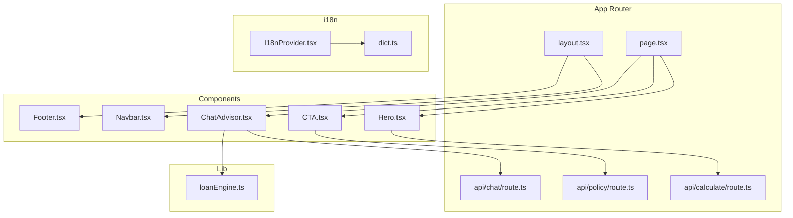
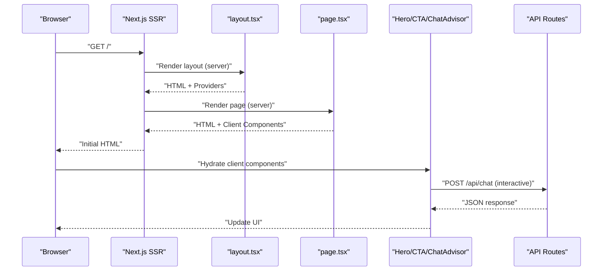
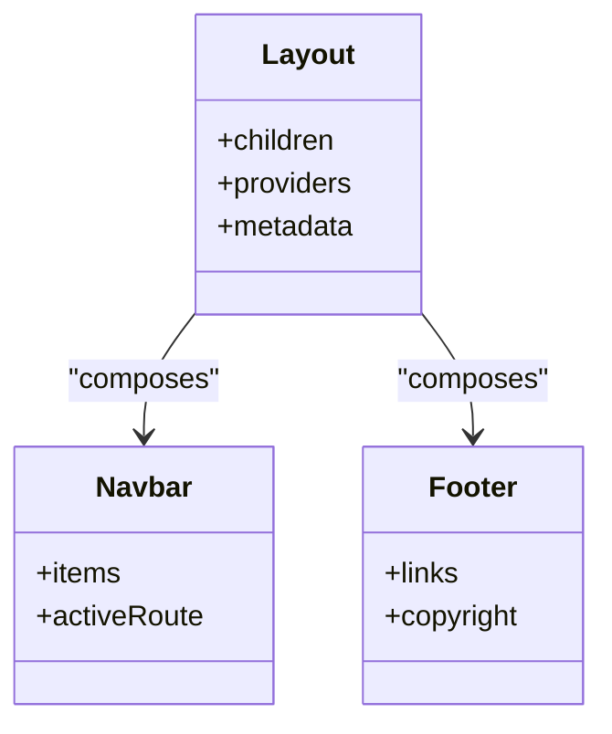
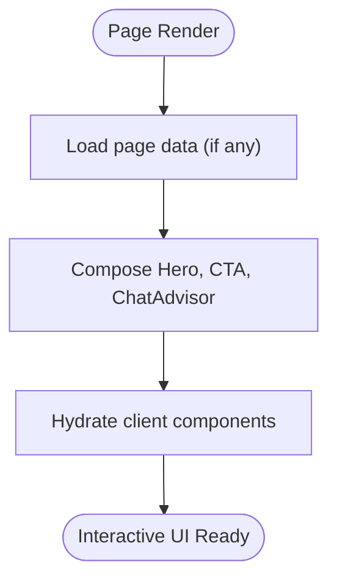
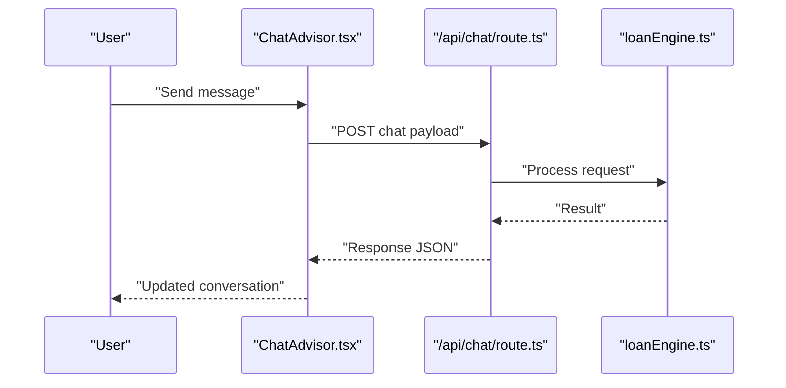
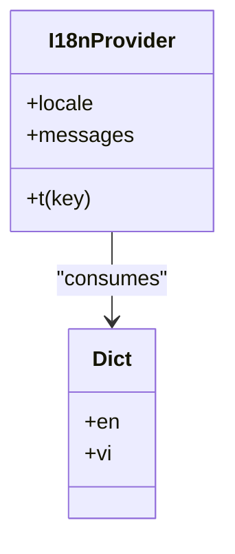
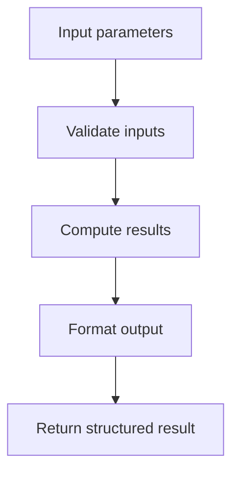
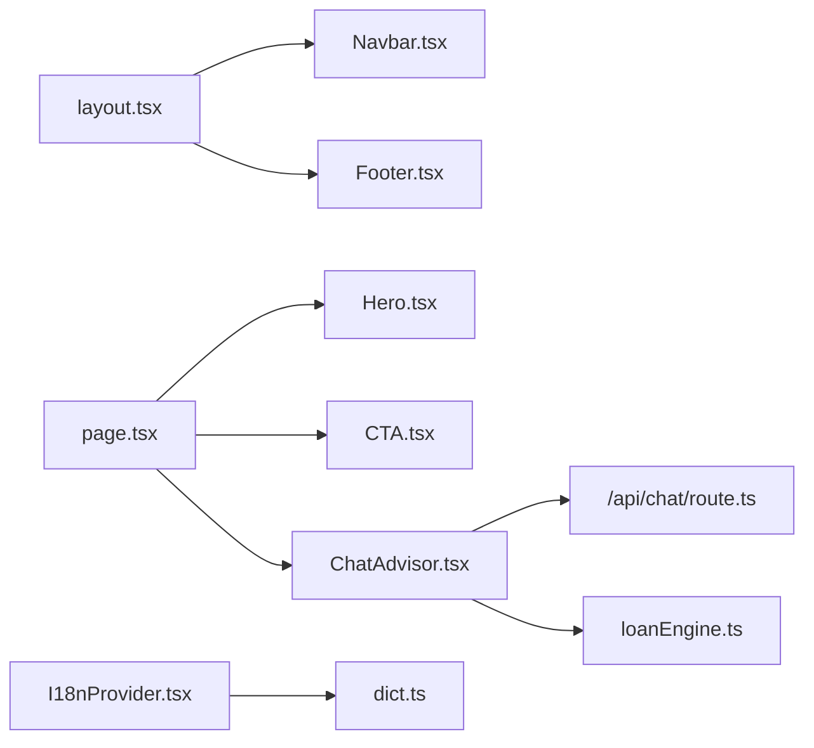

# Component Architecture

<cite>
**Referenced Files in This Document**
- [layout.tsx](file://src/app/layout.tsx)
- [page.tsx](file://src/app/page.tsx)
- [Navbar.tsx](file://src/components/Navbar.tsx)
- [Footer.tsx](file://src/components/Footer.tsx)
- [Hero.tsx](file://src/components/Hero.tsx)
- [CTA.tsx](file://src/components/CTA.tsx)
- [ChatAdvisor.tsx](file://src/components/ChatAdvisor.tsx)
- [I18nProvider.tsx](file://src/i18n/I18nProvider.tsx)
- [dict.ts](file://src/i18n/dict.ts)
- [loanEngine.ts](file://src/lib/loanEngine.ts)
- [route.ts](file://src/app/api/calculate/route.ts)
- [route.ts](file://src/app/api/chat/route.ts)
- [route.ts](file://src/app/api/policy/route.ts)
- [next.config.mjs](file://next.config.mjs)
- [package.json](file://package.json)
</cite>

## Table of Contents
1. [Introduction](#introduction)
2. [Project Structure](#project-structure)
3. [Core Components](#core-components)
4. [Architecture Overview](#architecture-overview)
5. [Detailed Component Analysis](#detailed-component-analysis)
6. [Dependency Analysis](#dependency-analysis)
7. [Performance Considerations](#performance-considerations)
8. [Troubleshooting Guide](#troubleshooting-guide)
9. [Conclusion](#conclusion)

## Introduction
This document explains the component architecture of the frontend-vaya application built with Next.js App Router. It covers how server-side rendering and client-side interactivity are combined, the hierarchical structure from page components down to reusable UI components, separation of concerns across layout, business logic, and presentation layers, and patterns for composition, TypeScript integration, state management, and performance optimization.

## Project Structure
The project follows a feature-oriented layout under src:
- app: Next.js App Router pages, layouts, and API routes
- components: Reusable UI components (e.g., Navbar, Footer, Hero, CTA)
- i18n: Internationalization provider and dictionary
- lib: Business logic modules (e.g., loan engine)
- data: Static data used by components and engines

**Diagram sources**
- [layout.tsx](file://src/app/layout.tsx)
- [page.tsx](file://src/app/page.tsx)
- [Navbar.tsx](file://src/components/Navbar.tsx)
- [Footer.tsx](file://src/components/Footer.tsx)
- [Hero.tsx](file://src/components/Hero.tsx)
- [CTA.tsx](file://src/components/CTA.tsx)
- [ChatAdvisor.tsx](file://src/components/ChatAdvisor.tsx)
- [I18nProvider.tsx](file://src/i18n/I18nProvider.tsx)
- [dict.ts](file://src/i18n/dict.ts)
- [loanEngine.ts](file://src/lib/loanEngine.ts)
- [route.ts](file://src/app/api/calculate/route.ts)
- [route.ts](file://src/app/api/chat/route.ts)
- [route.ts](file://src/app/api/policy/route.ts)

**Section sources**
- [layout.tsx](file://src/app/layout.tsx)
- [page.tsx](file://src/app/page.tsx)
- [next.config.mjs](file://next.config.mjs)
- [package.json](file://package.json)

## Core Components
- Layout layer: layout.tsx defines global shell, metadata, and providers (e.g., i18n). It composes Navbar and Footer to ensure consistent chrome across pages.
- Page layer: page.tsx composes page-specific sections such as Hero, CTA, and ChatAdvisor. It orchestrates data fetching and client interactions.
- Presentation components: Navbar, Footer, Hero, CTA focus on rendering UI and handling local state. They receive props via TypeScript interfaces for type safety.
- Client-only features: ChatAdvisor handles chat interactions using client hooks and calls API routes for AI responses.

Key responsibilities:
- layout.tsx: Global structure, providers, SSR base
- page.tsx: Page composition and orchestration
- Navbar.tsx: Navigation UI and active state
- Footer.tsx: Site footer content
- Hero.tsx: Hero section with call-to-action
- CTA.tsx: Conversion-focused action block
- ChatAdvisor.tsx: Client-side chat flow and API integration

**Section sources**
- [layout.tsx](file://src/app/layout.tsx)
- [page.tsx](file://src/app/page.tsx)
- [Navbar.tsx](file://src/components/Navbar.tsx)
- [Footer.tsx](file://src/components/Footer.tsx)
- [Hero.tsx](file://src/components/Hero.tsx)
- [CTA.tsx](file://src/components/CTA.tsx)
- [ChatAdvisor.tsx](file://src/components/ChatAdvisor.tsx)

## Architecture Overview
Next.js App Router enables server-rendered HTML with selective client hydration. The root layout renders shared chrome and providers. Pages compose sections that may be static or interactive. Client components handle user input and call server routes for business operations.

**Diagram sources**
- [layout.tsx](file://src/app/layout.tsx)
- [page.tsx](file://src/app/page.tsx)
- [ChatAdvisor.tsx](file://src/components/ChatAdvisor.tsx)
- [route.ts](file://src/app/api/chat/route.ts)

## Detailed Component Analysis

### Layout Layer (layout.tsx)
- Provides global shell, metadata, and providers (e.g., i18n).
- Composes Navbar and Footer to maintain consistent navigation and branding.
- Ensures SSR baseline while allowing client components to hydrate within children.

**Diagram sources**
- [layout.tsx](file://src/app/layout.tsx)
- [Navbar.tsx](file://src/components/Navbar.tsx)
- [Footer.tsx](file://src/components/Footer.tsx)

**Section sources**
- [layout.tsx](file://src/app/layout.tsx)
- [Navbar.tsx](file://src/components/Navbar.tsx)
- [Footer.tsx](file://src/components/Footer.tsx)

### Page Composition (page.tsx)
- Assembles page sections: Hero, CTA, ChatAdvisor.
- Orchestrates data fetching and passes props to components.
- Uses client components where interactivity is required.

**Diagram sources**
- [page.tsx](file://src/app/page.tsx)
- [Hero.tsx](file://src/components/Hero.tsx)
- [CTA.tsx](file://src/components/CTA.tsx)
- [ChatAdvisor.tsx](file://src/components/ChatAdvisor.tsx)

**Section sources**
- [page.tsx](file://src/app/page.tsx)

### Presentation Components
- Navbar.tsx: Renders navigation items, highlights active route, supports responsive behavior.
- Footer.tsx: Displays links and copyright information; minimal state.
- Hero.tsx: Presents primary messaging and initial call-to-action; may include lightweight animations.
- CTA.tsx: Drives conversions; can trigger actions like opening chat or navigating.

Typical prop interface patterns:
- Title, subtitle, and action handlers for Hero and CTA
- Navigation items and active route for Navbar
- Content blocks and links for Footer

State management approaches:
- Local state via useState for UI toggles and form inputs
- Event-driven updates without global state for simple flows

TypeScript integration:
- Interfaces define prop contracts ensuring compile-time checks
- Enums or union types for route states and action types

**Section sources**
- [Navbar.tsx](file://src/components/Navbar.tsx)
- [Footer.tsx](file://src/components/Footer.tsx)
- [Hero.tsx](file://src/components/Hero.tsx)
- [CTA.tsx](file://src/components/CTA.tsx)

### Client Interactivity (ChatAdvisor.tsx)
- Handles chat conversation state and messages
- Calls API routes for AI responses and policy calculations
- Updates UI reactively based on server responses

**Diagram sources**
- [ChatAdvisor.tsx](file://src/components/ChatAdvisor.tsx)
- [route.ts](file://src/app/api/chat/route.ts)
- [loanEngine.ts](file://src/lib/loanEngine.ts)

**Section sources**
- [ChatAdvisor.tsx](file://src/components/ChatAdvisor.tsx)
- [route.ts](file://src/app/api/chat/route.ts)
- [loanEngine.ts](file://src/lib/loanEngine.ts)

### Internationalization (I18nProvider.tsx and dict.ts)
- I18nProvider wraps the app to provide language context
- dict.ts holds translation keys and values
- Components consume i18n context to render localized text

**Diagram sources**
- [I18nProvider.tsx](file://src/i18n/I18nProvider.tsx)
- [dict.ts](file://src/i18n/dict.ts)

**Section sources**
- [I18nProvider.tsx](file://src/i18n/I18nProvider.tsx)
- [dict.ts](file://src/i18n/dict.ts)

### Business Logic Integration (loanEngine.ts)
- Encapsulates core calculations and rule evaluation
- Used by API routes and client components through well-defined functions
- Keeps UI components free from complex logic

**Diagram sources**
- [loanEngine.ts](file://src/lib/loanEngine.ts)

**Section sources**
- [loanEngine.ts](file://src/lib/loanEngine.ts)

## Dependency Analysis
Component dependencies follow a clear hierarchy:
- layout.tsx depends on Navbar and Footer
- page.tsx depends on Hero, CTA, and ChatAdvisor
- ChatAdvisor depends on API routes and loanEngine
- I18nProvider provides context consumed by components

**Diagram sources**
- [layout.tsx](file://src/app/layout.tsx)
- [page.tsx](file://src/app/page.tsx)
- [Navbar.tsx](file://src/components/Navbar.tsx)
- [Footer.tsx](file://src/components/Footer.tsx)
- [Hero.tsx](file://src/components/Hero.tsx)
- [CTA.tsx](file://src/components/CTA.tsx)
- [ChatAdvisor.tsx](file://src/components/ChatAdvisor.tsx)
- [route.ts](file://src/app/api/chat/route.ts)
- [loanEngine.ts](file://src/lib/loanEngine.ts)
- [I18nProvider.tsx](file://src/i18n/I18nProvider.tsx)
- [dict.ts](file://src/i18n/dict.ts)

**Section sources**
- [layout.tsx](file://src/app/layout.tsx)
- [page.tsx](file://src/app/page.tsx)
- [ChatAdvisor.tsx](file://src/components/ChatAdvisor.tsx)
- [loanEngine.ts](file://src/lib/loanEngine.ts)

## Performance Considerations
- Use React.memo for pure presentation components to avoid unnecessary re-renders
- Apply lazy loading for heavy client components or charts to reduce initial bundle size
- Keep server components for data-heavy sections; hydrate only what is interactive
- Prefer static generation or server-side rendering for SEO-critical content
- Minimize prop drilling by using context (e.g., i18n) or component composition
- Debounce or throttle expensive client-side operations (e.g., search, analytics)

[No sources needed since this section provides general guidance]

## Troubleshooting Guide
Common issues and resolutions:
- Hydration mismatches: Ensure client and server render identical markup; avoid browser-only APIs during SSR
- API route errors: Validate payloads and handle exceptions gracefully; log server-side errors
- State synchronization: Use controlled components and explicit event handlers to keep UI in sync
- Type errors: Update interfaces when props change; run TypeScript compiler to catch inconsistencies
- Performance regressions: Profile with React DevTools; identify unnecessary re-renders and optimize memoization

**Section sources**
- [ChatAdvisor.tsx](file://src/components/ChatAdvisor.tsx)
- [route.ts](file://src/app/api/chat/route.ts)

## Conclusion
The frontend-vaya application leverages Next.js App Router to deliver fast, SEO-friendly pages with selective client interactivity. The architecture cleanly separates layout, page composition, and presentation concerns, while integrating business logic through dedicated modules. TypeScript ensures type safety across the component hierarchy, and performance optimizations like memoization and lazy loading keep the app responsive. This structure scales well as new features and pages are added.