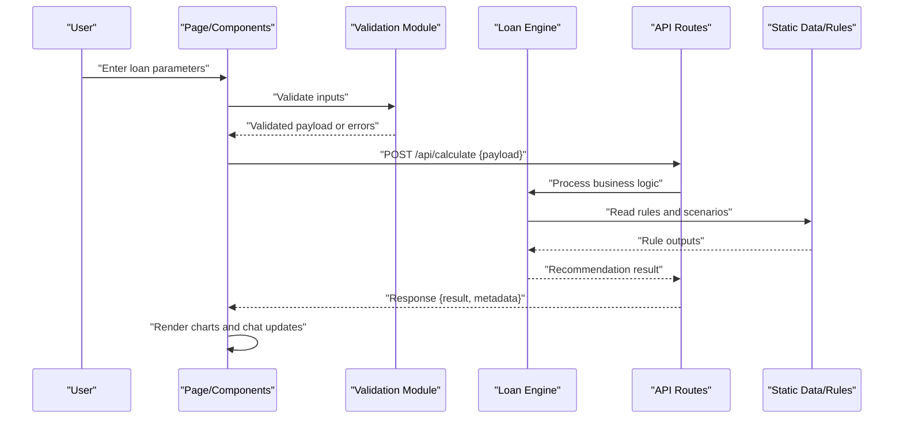
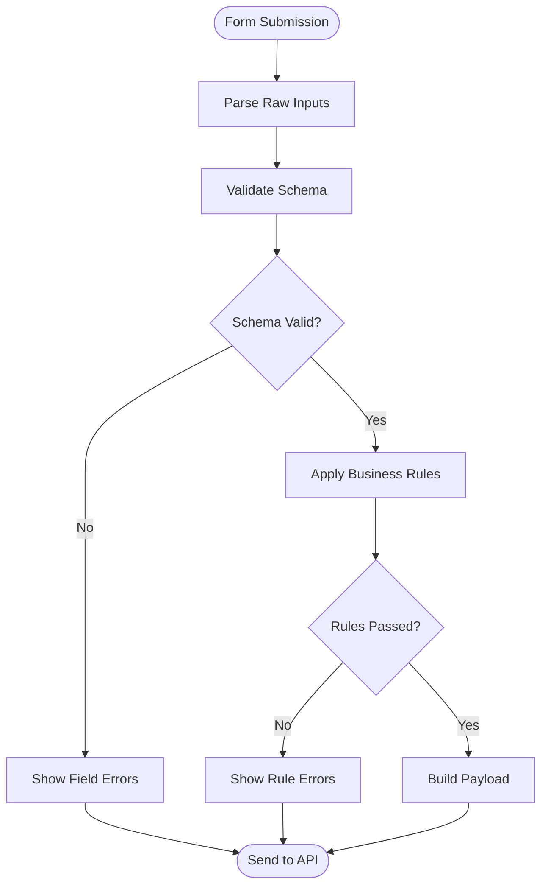
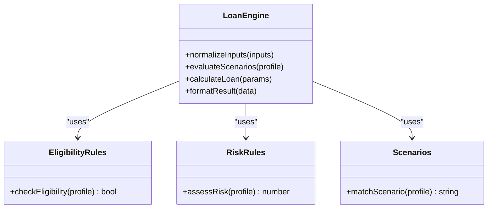
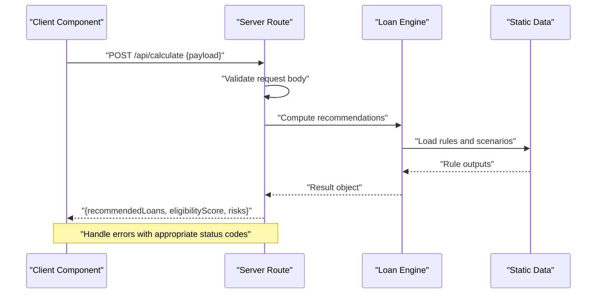
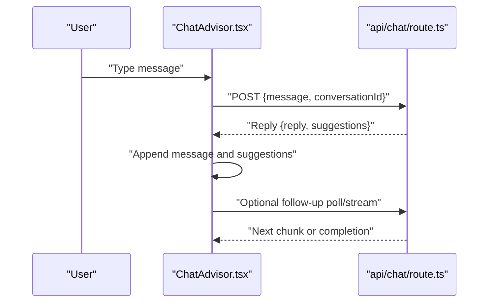
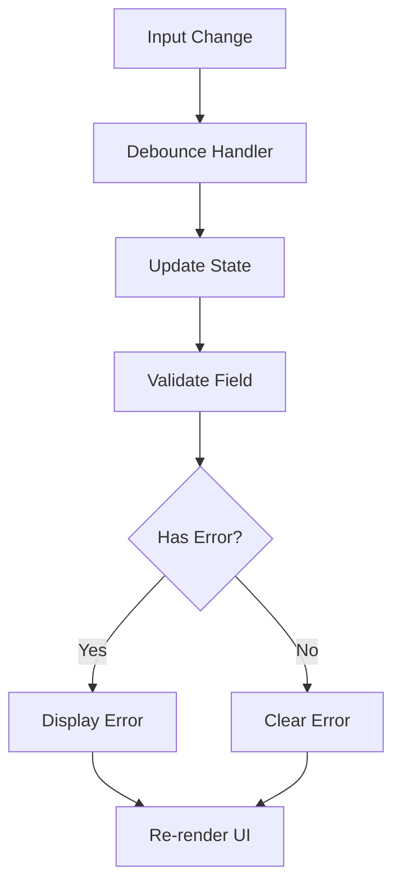
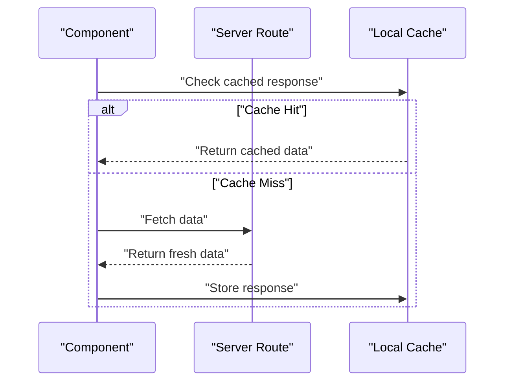
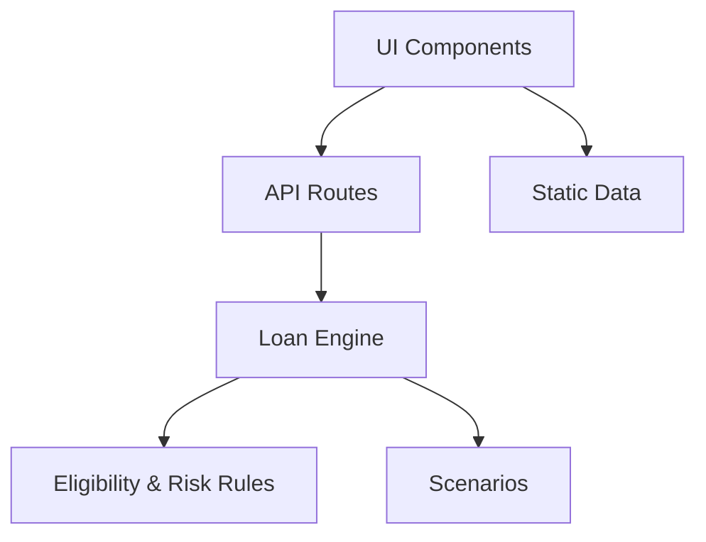

# Data Flow Patterns

<cite>
**Referenced Files in This Document**
- [page.tsx](file://src/app/page.tsx)
- [layout.tsx](file://src/app/layout.tsx)
- [globals.css](file://src/app/globals.css)
- [route.ts](file://src/app/api/calculate/route.ts)
- [route.ts](file://src/app/api/chat/route.ts)
- [route.ts](file://src/app/api/policy/route.ts)
- [ChatAdvisor.tsx](file://src/components/ChatAdvisor.tsx)
- [LineChart.tsx](file://src/components/charts/LineChart.tsx)
- [Sparkline.tsx](file://src/components/charts/Sparkline.tsx)
- [index.ts](file://src/data/products/index.ts)
- [vietcombank.ts](file://src/data/products/vietcombank.ts)
- [banks.ts](file://src/data/banks.ts)
- [checklists.ts](file://src/data/checklists.ts)
- [eligibilityRules.ts](file://src/data/eligibilityRules.ts)
- [intakeQuestions.ts](file://src/data/intakeQuestions.ts)
- [loanPackages.ts](file://src/data/loanPackages.ts)
- [riskRules.ts](file://src/data/riskRules.ts)
- [scenarios.ts](file://src/data/scenarios.ts)
- [I18nProvider.tsx](file://src/i18n/I18nProvider.tsx)
- [dict.ts](file://src/i18n/dict.ts)
- [loanEngine.ts](file://src/lib/loanEngine.ts)
</cite>

## Table of Contents
1. [Introduction](#introduction)
2. [Project Structure](#project-structure)
3. [Core Components](#core-components)
4. [Architecture Overview](#architecture-overview)
5. [Detailed Component Analysis](#detailed-component-analysis)
6. [Dependency Analysis](#dependency-analysis)
7. [Performance Considerations](#performance-considerations)
8. [Troubleshooting Guide](#troubleshooting-guide)
9. [Conclusion](#conclusion)

## Introduction
This document explains the data flow patterns in the frontend-vaya application, focusing on how user input is validated, processed by the loan engine business logic, and returned to UI components. It covers API communication between client components and server routes, request/response schemas, error handling strategies, caching mechanisms, state synchronization, and real-time updates for chat functionality. It also includes examples of data binding, form handling with validation, asynchronous data fetching, and performance considerations such as memoization, debouncing, and efficient re-rendering.

## Project Structure
The application follows a Next.js App Router structure:
- App-level pages and layouts define routing and global providers.
- API routes under src/app/api handle server-side processing for calculate, chat, and policy endpoints.
- Reusable UI components live under src/components, including charts and chat advisor.
- Static data and rules are organized under src/data.
- Internationalization is provided via src/i18n.
- Core business logic resides in src/lib, including the loan engine.

```mermaid
graph TB
subgraph "App"
A["app/page.tsx"]
L["app/layout.tsx"]
G["app/globals.css"]
end
subgraph "API Routes"
C["api/calculate/route.ts"]
H["api/chat/route.ts"]
P["api/policy/route.ts"]
end
subgraph "Components"
CA["components/ChatAdvisor.tsx"]
LC["components/charts/LineChart.tsx"]
SP["components/charts/Sparkline.tsx"]
end
subgraph "Data"
D1["data/products/index.ts"]
D2["data/products/vietcombank.ts"]
D3["data/banks.ts"]
D4["data/checklists.ts"]
D5["data/eligibilityRules.ts"]
D6["data/intakeQuestions.ts"]
D7["data/loanPackages.ts"]
D8["data/riskRules.ts"]
D9["data/scenarios.ts"]
end
subgraph "i18n"
I1["i18n/I18nProvider.tsx"]
I2["i18n/dict.ts"]
end
subgraph "Lib"
LE["lib/loanEngine.ts"]
end
A --> C
A --> H
A --> P
CA --> H
LC --> D1
SP --> D1
A --> LE
A --> I1
L --> I1
L --> G
```

**Diagram sources**
- [page.tsx](file://src/app/page.tsx)
- [layout.tsx](file://src/app/layout.tsx)
- [globals.css](file://src/app/globals.css)
- [route.ts](file://src/app/api/calculate/route.ts)
- [route.ts](file://src/app/api/chat/route.ts)
- [route.ts](file://src/app/api/policy/route.ts)
- [ChatAdvisor.tsx](file://src/components/ChatAdvisor.tsx)
- [LineChart.tsx](file://src/components/charts/LineChart.tsx)
- [Sparkline.tsx](file://src/components/charts/Sparkline.tsx)
- [index.ts](file://src/data/products/index.ts)
- [vietcombank.ts](file://src/data/products/vietcombank.ts)
- [banks.ts](file://src/data/banks.ts)
- [checklists.ts](file://src/data/checklists.ts)
- [eligibilityRules.ts](file://src/data/eligibilityRules.ts)
- [intakeQuestions.ts](file://src/data/intakeQuestions.ts)
- [loanPackages.ts](file://src/data/loanPackages.ts)
- [riskRules.ts](file://src/data/riskRules.ts)
- [scenarios.ts](file://src/data/scenarios.ts)
- [I18nProvider.tsx](file://src/i18n/I18nProvider.tsx)
- [dict.ts](file://src/i18n/dict.ts)
- [loanEngine.ts](file://src/lib/loanEngine.ts)

**Section sources**
- [page.tsx](file://src/app/page.tsx)
- [layout.tsx](file://src/app/layout.tsx)
- [globals.css](file://src/app/globals.css)
- [route.ts](file://src/app/api/calculate/route.ts)
- [route.ts](file://src/app/api/chat/route.ts)
- [route.ts](file://src/app/api/policy/route.ts)
- [ChatAdvisor.tsx](file://src/components/ChatAdvisor.tsx)
- [LineChart.tsx](file://src/components/charts/LineChart.tsx)
- [Sparkline.tsx](file://src/components/charts/Sparkline.tsx)
- [index.ts](file://src/data/products/index.ts)
- [vietcombank.ts](file://src/data/products/vietcombank.ts)
- [banks.ts](file://src/data/banks.ts)
- [checklists.ts](file://src/data/checklists.ts)
- [eligibilityRules.ts](file://src/data/eligibilityRules.ts)
- [intakeQuestions.ts](file://src/data/intakeQuestions.ts)
- [loanPackages.ts](file://src/data/loanPackages.ts)
- [riskRules.ts](file://src/data/riskRules.ts)
- [scenarios.ts](file://src/data/scenarios.ts)
- [I18nProvider.tsx](file://src/i18n/I18nProvider.tsx)
- [dict.ts](file://src/i18n/dict.ts)
- [loanEngine.ts](file://src/lib/loanEngine.ts)

## Core Components
- app/page.tsx: Entry page that orchestrates user interactions, integrates with API routes, and renders results.
- app/layout.tsx: Global layout and provider setup (e.g., i18n).
- api/calculate/route.ts: Server endpoint to compute loan recommendations based on validated inputs.
- api/chat/route.ts: Server endpoint supporting chat-based assistance and real-time updates.
- api/policy/route.ts: Server endpoint for policy-related queries and calculations.
- components/ChatAdvisor.tsx: Chat UI component that communicates with the chat API route.
- components/charts/LineChart.tsx and Sparkline.tsx: Visualization components consuming computed data.
- lib/loanEngine.ts: Business logic module encapsulating loan calculation and recommendation algorithms.
- data/*: Static datasets and rule sets used by the loan engine and UI.

**Section sources**
- [page.tsx](file://src/app/page.tsx)
- [layout.tsx](file://src/app/layout.tsx)
- [route.ts](file://src/app/api/calculate/route.ts)
- [route.ts](file://src/app/api/chat/route.ts)
- [route.ts](file://src/app/api/policy/route.ts)
- [ChatAdvisor.tsx](file://src/components/ChatAdvisor.tsx)
- [LineChart.tsx](file://src/components/charts/LineChart.tsx)
- [Sparkline.tsx](file://src/components/charts/Sparkline.tsx)
- [loanEngine.ts](file://src/lib/loanEngine.ts)

## Architecture Overview
The data flow follows a layered pattern:
- User Input Layer: Forms and interactive elements capture raw inputs.
- Validation Layer: Inputs are validated using schema checks and business rules.
- Loan Engine Layer: Validated inputs are transformed into structured parameters for calculations.
- API Layer: Client components call server routes to execute business logic and return results.
- UI Rendering Layer: Results are bound to components and visualized through charts and chat responses.

**Diagram sources**
- [page.tsx](file://src/app/page.tsx)
- [route.ts](file://src/app/api/calculate/route.ts)
- [loanEngine.ts](file://src/lib/loanEngine.ts)

## Detailed Component Analysis

### Validation Pipeline
- Input Capture: Form fields collect raw values from users.
- Schema Validation: Validate types, ranges, and required fields before sending to the server.
- Business Rule Checks: Cross-field validations and eligibility checks using static rules.
- Error Aggregation: Collect and display field-level errors to guide corrections.

**Diagram sources**
- [page.tsx](file://src/app/page.tsx)
- [eligibilityRules.ts](file://src/data/eligibilityRules.ts)
- [riskRules.ts](file://src/data/riskRules.ts)
- [intakeQuestions.ts](file://src/data/intakeQuestions.ts)

**Section sources**
- [page.tsx](file://src/app/page.tsx)
- [eligibilityRules.ts](file://src/data/eligibilityRules.ts)
- [riskRules.ts](file://src/data/riskRules.ts)
- [intakeQuestions.ts](file://src/data/intakeQuestions.ts)

### Loan Engine Processing
- Parameter Normalization: Convert validated inputs into normalized structures expected by the engine.
- Scenario Evaluation: Match user profiles against predefined scenarios and risk rules.
- Calculation Execution: Compute loan amounts, interest rates, repayment schedules, and eligibility scores.
- Result Structuring: Format outputs for consistent consumption by UI components.

**Diagram sources**
- [loanEngine.ts](file://src/lib/loanEngine.ts)
- [eligibilityRules.ts](file://src/data/eligibilityRules.ts)
- [riskRules.ts](file://src/data/riskRules.ts)
- [scenarios.ts](file://src/data/scenarios.ts)

**Section sources**
- [loanEngine.ts](file://src/lib/loanEngine.ts)
- [eligibilityRules.ts](file://src/data/eligibilityRules.ts)
- [riskRules.ts](file://src/data/riskRules.ts)
- [scenarios.ts](file://src/data/scenarios.ts)

### API Communication Patterns
- Calculate Endpoint: Accepts validated loan parameters and returns calculated recommendations.
- Chat Endpoint: Supports conversational assistance with streaming or polling for real-time updates.
- Policy Endpoint: Handles policy-specific queries and computations.

Request/Response Schemas:
- POST /api/calculate
  - Request: { loanAmount, termMonths, income, creditScore, employmentStatus, ... }
  - Response: { recommendedLoans: [], eligibilityScore, risks: [] }
- POST /api/chat
  - Request: { message, conversationId?, context? }
  - Response: { reply, suggestions?, nextSteps? }
- POST /api/policy
  - Request: { policyType, profile }
  - Response: { policyDetails, constraints, recommendations }

Error Handling Strategies:
- Validation errors return 400 with detailed field messages.
- Business rule failures return 422 with actionable guidance.
- Server errors return 500 with generic messages; client should retry or fallback gracefully.

**Diagram sources**
- [route.ts](file://src/app/api/calculate/route.ts)
- [loanEngine.ts](file://src/lib/loanEngine.ts)

**Section sources**
- [route.ts](file://src/app/api/calculate/route.ts)
- [route.ts](file://src/app/api/chat/route.ts)
- [route.ts](file://src/app/api/policy/route.ts)

### Real-Time Chat Updates
- Client sends messages to the chat API route.
- Server processes messages and may stream responses or use polling.
- UI updates incrementally as new replies arrive.

**Diagram sources**
- [ChatAdvisor.tsx](file://src/components/ChatAdvisor.tsx)
- [route.ts](file://src/app/api/chat/route.ts)

**Section sources**
- [ChatAdvisor.tsx](file://src/components/ChatAdvisor.tsx)
- [route.ts](file://src/app/api/chat/route.ts)

### Data Binding and Form Handling
- Controlled Components: Form fields bind to state variables for immediate validation feedback.
- Debounced Validation: Delay validation until user pauses typing to reduce overhead.
- Conditional Rendering: Show/hide fields based on previous selections.
- Error Display: Inline error messages near relevant fields.

**Diagram sources**
- [page.tsx](file://src/app/page.tsx)

**Section sources**
- [page.tsx](file://src/app/page.tsx)

### Asynchronous Data Fetching
- Use fetch or similar APIs to call server routes.
- Manage loading states to prevent UI flicker.
- Handle network errors and retries with exponential backoff.
- Cache responses where appropriate to improve performance.

**Diagram sources**
- [route.ts](file://src/app/api/calculate/route.ts)
- [route.ts](file://src/app/api/chat/route.ts)
- [route.ts](file://src/app/api/policy/route.ts)

**Section sources**
- [route.ts](file://src/app/api/calculate/route.ts)
- [route.ts](file://src/app/api/chat/route.ts)
- [route.ts](file://src/app/api/policy/route.ts)

### Data Caching Mechanisms
- In-memory cache: Store recent API responses in component state or context.
- URL-based cache keys: Derive cache keys from query parameters to avoid collisions.
- Stale-while-revalidate: Serve cached data immediately while refreshing in background.
- Cache invalidation: Invalidate on user actions that change inputs significantly.

**Section sources**
- [page.tsx](file://src/app/page.tsx)
- [ChatAdvisor.tsx](file://src/components/ChatAdvisor.tsx)

### State Synchronization Between Client and Server
- Optimistic Updates: Update UI immediately and revert on error.
- Conflict Resolution: Merge server state with local changes safely.
- Sync Triggers: Trigger sync on form submission, navigation, or periodic intervals.

**Section sources**
- [page.tsx](file://src/app/page.tsx)
- [ChatAdvisor.tsx](file://src/components/ChatAdvisor.tsx)

### Chart Data Visualization
- LineChart.tsx and Sparkline.tsx consume computed loan data to visualize trends and comparisons.
- Ensure data normalization before rendering to avoid chart distortion.
- Use memoization to prevent unnecessary re-renders when data hasn’t changed.

**Section sources**
- [LineChart.tsx](file://src/components/charts/LineChart.tsx)
- [Sparkline.tsx](file://src/components/charts/Sparkline.tsx)

## Dependency Analysis
The application’s dependencies are organized by feature and layer:
- UI components depend on data modules and API routes.
- API routes depend on the loan engine and static data.
- The loan engine depends on eligibility, risk, and scenario rules.

**Diagram sources**
- [ChatAdvisor.tsx](file://src/components/ChatAdvisor.tsx)
- [LineChart.tsx](file://src/components/charts/LineChart.tsx)
- [Sparkline.tsx](file://src/components/charts/Sparkline.tsx)
- [route.ts](file://src/app/api/calculate/route.ts)
- [route.ts](file://src/app/api/chat/route.ts)
- [route.ts](file://src/app/api/policy/route.ts)
- [loanEngine.ts](file://src/lib/loanEngine.ts)
- [eligibilityRules.ts](file://src/data/eligibilityRules.ts)
- [riskRules.ts](file://src/data/riskRules.ts)
- [scenarios.ts](file://src/data/scenarios.ts)

**Section sources**
- [ChatAdvisor.tsx](file://src/components/ChatAdvisor.tsx)
- [LineChart.tsx](file://src/components/charts/LineChart.tsx)
- [Sparkline.tsx](file://src/components/charts/Sparkline.tsx)
- [route.ts](file://src/app/api/calculate/route.ts)
- [route.ts](file://src/app/api/chat/route.ts)
- [route.ts](file://src/app/api/policy/route.ts)
- [loanEngine.ts](file://src/lib/loanEngine.ts)
- [eligibilityRules.ts](file://src/data/eligibilityRules.ts)
- [riskRules.ts](file://src/data/riskRules.ts)
- [scenarios.ts](file://src/data/scenarios.ts)

## Performance Considerations
- Memoization: Use React.memo or useMemo for expensive computations and chart rendering.
- Debouncing: Apply debounce to input handlers to limit validation frequency.
- Efficient Re-rendering: Split components to minimize re-renders; use stable keys for lists.
- Lazy Loading: Load heavy modules or data only when needed.
- Caching: Implement client-side caching for repeated API calls.
- Streaming Responses: For chat, stream partial responses to improve perceived latency.

[No sources needed since this section provides general guidance]

## Troubleshooting Guide
Common issues and resolutions:
- Validation Failures: Ensure schema matches expected input format; check field-level error messages.
- API Errors: Inspect status codes and response payloads; implement retry logic for transient failures.
- Chat Disconnections: Handle connection drops and reconnect automatically; queue messages until reconnected.
- Chart Rendering Issues: Verify data shapes and ensure proper normalization before passing to visualization components.

**Section sources**
- [route.ts](file://src/app/api/calculate/route.ts)
- [route.ts](file://src/app/api/chat/route.ts)
- [route.ts](file://src/app/api/policy/route.ts)
- [LineChart.tsx](file://src/components/charts/LineChart.tsx)
- [Sparkline.tsx](file://src/components/charts/Sparkline.tsx)

## Conclusion
The frontend-vaya application implements a robust data flow pattern that validates user inputs, processes them through a loan engine, and returns actionable recommendations to the UI. By leveraging API routes, static data, and real-time chat capabilities, it delivers a responsive and informative experience. Performance optimizations like memoization, debouncing, and caching ensure smooth interactions even under heavy usage.

[No sources needed since this section summarizes without analyzing specific files]