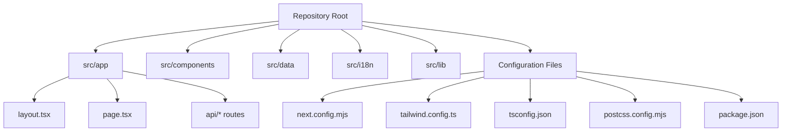
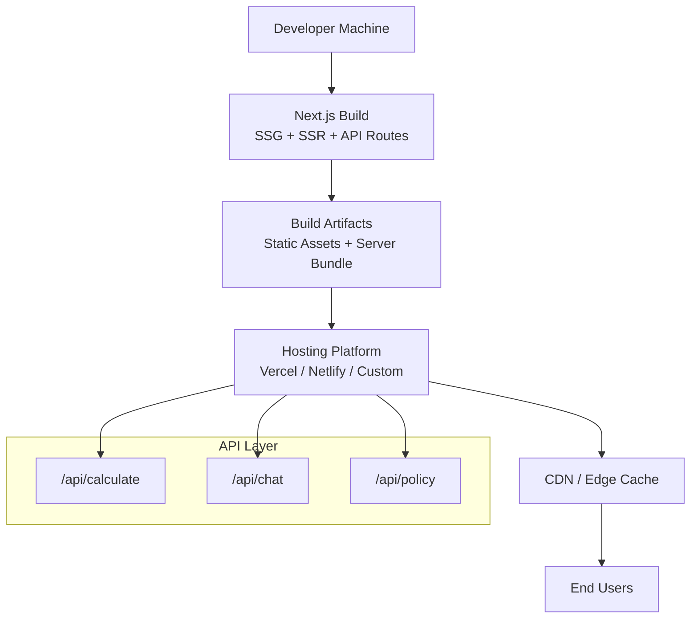
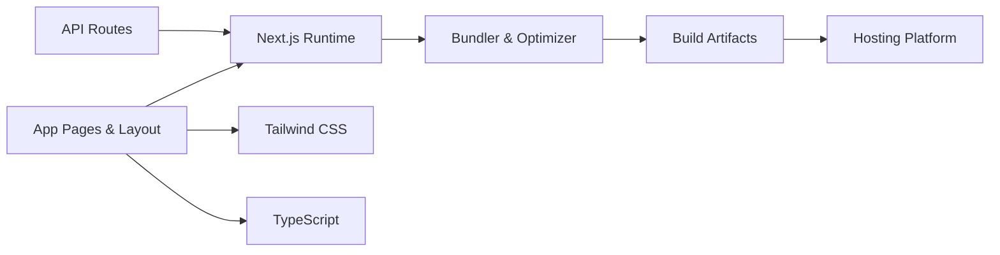

# Deployment Architecture

<cite>
**Referenced Files in This Document**
- [next.config.mjs](file://next.config.mjs)
- [tailwind.config.ts](file://tailwind.config.ts)
- [tsconfig.json](file://tsconfig.json)
- [package.json](file://package.json)
- [postcss.config.mjs](file://postcss.config.mjs)
- [src/app/layout.tsx](file://src/app/layout.tsx)
- [src/app/page.tsx](file://src/app/page.tsx)
- [src/app/api/calculate/route.ts](file://src/app/api/calculate/route.ts)
- [src/app/api/chat/route.ts](file://src/app/api/chat/route.ts)
- [src/app/api/policy/route.ts](file://src/app/api/policy/route.ts)
</cite>

## Table of Contents
1. [Introduction](#introduction)
2. [Project Structure](#project-structure)
3. [Core Components](#core-components)
4. [Architecture Overview](#architecture-overview)
5. [Detailed Component Analysis](#detailed-component-analysis)
6. [Dependency Analysis](#dependency-analysis)
7. [Performance Considerations](#performance-considerations)
8. [Troubleshooting Guide](#troubleshooting-guide)
9. [Conclusion](#conclusion)
10. [Appendices](#appendices)

## Introduction
This document describes the deployment architecture for the frontend-vaya application, a Next.js-based frontend that leverages static site generation (SSG), server-side rendering (SSR), and API routes. It explains how the build pipeline works, configuration files, environment variable management, asset optimization, CDN setup, production build strategies, code splitting, bundle optimization, monitoring/logging/debugging, and scaling considerations for high availability.

## Project Structure
The project follows the Next.js App Router structure with:
- Application pages and layout under src/app
- API routes under src/app/api
- Reusable UI components under src/components
- Data modules under src/data
- Internationalization under src/i18n
- Library utilities under src/lib
- Build and styling configuration at the repository root

**Diagram sources**
- [next.config.mjs](file://next.config.mjs)
- [tailwind.config.ts](file://tailwind.config.ts)
- [tsconfig.json](file://tsconfig.json)
- [postcss.config.mjs](file://postcss.config.mjs)
- [package.json](file://package.json)
- [src/app/layout.tsx](file://src/app/layout.tsx)
- [src/app/page.tsx](file://src/app/page.tsx)
- [src/app/api/calculate/route.ts](file://src/app/api/calculate/route.ts)
- [src/app/api/chat/route.ts](file://src/app/api/chat/route.ts)
- [src/app/api/policy/route.ts](file://src/app/api/policy/route.ts)

**Section sources**
- [next.config.mjs](file://next.config.mjs)
- [tailwind.config.ts](file://tailwind.config.ts)
- [tsconfig.json](file://tsconfig.json)
- [postcss.config.mjs](file://postcss.config.mjs)
- [package.json](file://package.json)
- [src/app/layout.tsx](file://src/app/layout.tsx)
- [src/app/page.tsx](file://src/app/page.tsx)
- [src/app/api/calculate/route.ts](file://src/app/api/calculate/route.ts)
- [src/app/api/chat/route.ts](file://src/app/api/chat/route.ts)
- [src/app/api/policy/route.ts](file://src/app/api/policy/route.ts)

## Core Components
- Next.js runtime: Provides SSG/SSR, routing, and API routes.
- Styling pipeline: Tailwind CSS with PostCSS.
- TypeScript compilation: tsconfig.json controls compiler behavior.
- Package scripts: package.json defines build, dev, and lint/test commands.

Key responsibilities:
- next.config.mjs configures Next.js features such as output mode, redirects, headers, rewrites, image optimization, and webpack/bundler settings.
- tailwind.config.ts defines theme customization, plugins, and content paths.
- tsconfig.json sets module resolution, target, strictness, and path aliases.
- postcss.config.mjs wires Tailwind and other PostCSS plugins.
- package.json centralizes dependencies and scripts.

**Section sources**
- [next.config.mjs](file://next.config.mjs)
- [tailwind.config.ts](file://tailwind.config.ts)
- [tsconfig.json](file://tsconfig.json)
- [postcss.config.mjs](file://postcss.config.mjs)
- [package.json](file://package.json)

## Architecture Overview
The application uses Next.js to serve both static assets and dynamic server-rendered pages/APIs. The build process produces optimized outputs suitable for hosting on Vercel, Netlify, or custom Node.js/static hosts.

**Diagram sources**
- [next.config.mjs](file://next.config.mjs)
- [src/app/api/calculate/route.ts](file://src/app/api/calculate/route.ts)
- [src/app/api/chat/route.ts](file://src/app/api/chat/route.ts)
- [src/app/api/policy/route.ts](file://src/app/api/policy/route.ts)

## Detailed Component Analysis

### Build Process and Output Modes
- Static Site Generation (SSG): Pages without data fetching or with pre-rendered data are built into static HTML/CSS/JS during build time.
- Server-Side Rendering (SSR): Pages that require runtime data or dynamic behavior are rendered per request on supported platforms.
- API Routes: Endpoints under src/app/api are bundled and served by the Next.js serverless functions or server runtime depending on the platform.

Recommended practices:
- Prefer SSG where possible for performance and caching.
- Use SSR only when necessary for dynamic content.
- Keep API routes stateless and idempotent where feasible.

**Section sources**
- [next.config.mjs](file://next.config.mjs)
- [src/app/page.tsx](file://src/app/page.tsx)
- [src/app/api/calculate/route.ts](file://src/app/api/calculate/route.ts)
- [src/app/api/chat/route.ts](file://src/app/api/chat/route.ts)
- [src/app/api/policy/route.ts](file://src/app/api/policy/route.ts)

### Configuration Files

#### next.config.mjs
Purpose:
- Configure Next.js behavior including output mode, redirects, headers, rewrites, images, and bundler options.
- Enable optimizations like compression, caching, and security headers.

Key areas to review:
- Output mode (standalone vs default) for deployment targets.
- Redirects and rewrites for SEO and legacy URLs.
- Headers for cache control, CORS, and security policies.
- Image optimization settings for CDN integration.
- Webpack/bundler tweaks if needed for advanced use cases.

**Section sources**
- [next.config.mjs](file://next.config.mjs)

#### tailwind.config.ts
Purpose:
- Define Tailwind theme extensions, plugins, and content scanning paths.
- Ensure unused styles are purged in production builds.

Key areas to review:
- Content paths to include all templates and components.
- Theme customizations (colors, fonts, spacing).
- Plugins and variants used across the app.

**Section sources**
- [tailwind.config.ts](file://tailwind.config.ts)

#### tsconfig.json
Purpose:
- Control TypeScript compilation, module resolution, and strictness.
- Define path aliases for cleaner imports.

Key areas to review:
- Target and module settings aligned with Next.js requirements.
- Strict mode flags for better type safety.
- Path mappings for internal modules.

**Section sources**
- [tsconfig.json](file://tsconfig.json)

#### postcss.config.mjs
Purpose:
- Wire Tailwind CSS and any additional PostCSS plugins.
- Ensure consistent processing across environments.

**Section sources**
- [postcss.config.mjs](file://postcss.config.mjs)

#### package.json
Purpose:
- Centralize dependencies and scripts for development, building, and testing.
- Define engine constraints and deployment hooks.

Key areas to review:
- Scripts for dev, build, start, lint, and test.
- Dependency versions pinned for reproducible builds.
- Optional deployment-specific configurations.

**Section sources**
- [package.json](file://package.json)

### Environment Variables Management
- Use .env.local for local development secrets.
- Use platform-specific environment variables for staging and production (e.g., Vercel dashboard, Netlify UI, CI/CD).
- Prefix client-accessible variables appropriately to expose them safely.
- Validate required variables at build/start time to fail fast.

Best practices:
- Never commit secrets to version control.
- Use separate environments for dev/staging/prod.
- Rotate secrets regularly and audit access.

**Section sources**
- [package.json](file://package.json)
- [next.config.mjs](file://next.config.mjs)

### Asset Optimization and CDN Configuration
- Images: Leverage Next.js image optimization; configure remote patterns and CDN origins.
- Fonts: Self-host or use a font CDN; preload critical fonts.
- Static assets: Place under public/ for direct serving; ensure proper cache headers.
- Compression: Enable gzip/brotli via hosting platform or reverse proxy.
- Caching: Set appropriate cache-control headers for immutable assets.

**Section sources**
- [next.config.mjs](file://next.config.mjs)

### Production Build Pipeline
- Install dependencies and run the Next.js build to generate optimized artifacts.
- Lint and type-check before build to catch issues early.
- Run tests (unit/integration) in CI to ensure quality gates.
- Publish artifacts to the hosting platform’s artifact store or deploy directly.

CI/CD recommendations:
- Cache node_modules and Next.js build cache.
- Parallelize lint, test, and build steps.
- Store build logs and artifacts for debugging.

**Section sources**
- [package.json](file://package.json)

### Code Splitting Strategies
- Route-level splitting: Each page is split into its own chunk by default.
- Component-level splitting: Use dynamic imports for heavy components.
- Third-party libraries: Lazy-load non-critical libraries.
- Tree-shaking: Ensure side-effect-free modules to reduce bundle size.

**Section sources**
- [next.config.mjs](file://next.config.mjs)
- [package.json](file://package.json)

### Bundle Optimization Techniques
- Analyze bundle sizes using tools like webpack-bundle-analyzer or Next.js built-in reports.
- Remove unused dependencies and dead code.
- Prefer lightweight alternatives for large libraries.
- Optimize images and fonts; use modern formats (WebP, AVIF).
- Minimize global CSS; rely on Tailwind’s purge in production.

**Section sources**
- [next.config.mjs](file://next.config.mjs)
- [tailwind.config.ts](file://tailwind.config.ts)

### Monitoring, Logging, and Debugging in Production
- Error tracking: Integrate an error monitoring service (e.g., Sentry) for frontend and API errors.
- Performance monitoring: Use RUM (Real User Monitoring) and APM tools to track latency and errors.
- Logging: Centralize logs from API routes and server processes; avoid logging sensitive data.
- Health checks: Implement health endpoints for load balancers and orchestrators.
- Debugging: Use source maps carefully in production; enable only when necessary.

**Section sources**
- [src/app/api/calculate/route.ts](file://src/app/api/calculate/route.ts)
- [src/app/api/chat/route.ts](file://src/app/api/chat/route.ts)
- [src/app/api/policy/route.ts](file://src/app/api/policy/route.ts)

### Scaling Considerations, Load Balancing, and High Availability
- Horizontal scaling: Deploy multiple instances behind a load balancer; keep sessions stateless.
- Auto-scaling: Configure auto-scaling rules based on CPU/memory or request metrics.
- Caching: Use CDN and edge caching for static assets and API responses where safe.
- Database and external services: Use connection pooling and retries; consider read replicas.
- Observability: Metrics, alerts, and dashboards for proactive issue detection.

[No sources needed since this section provides general guidance]

## Dependency Analysis
The application’s runtime depends on Next.js, React, Tailwind CSS, and TypeScript tooling. API routes may depend on external AI or policy engines through environment-driven configuration.

**Diagram sources**
- [next.config.mjs](file://next.config.mjs)
- [tailwind.config.ts](file://tailwind.config.ts)
- [tsconfig.json](file://tsconfig.json)
- [package.json](file://package.json)
- [src/app/layout.tsx](file://src/app/layout.tsx)
- [src/app/page.tsx](file://src/app/page.tsx)
- [src/app/api/calculate/route.ts](file://src/app/api/calculate/route.ts)
- [src/app/api/chat/route.ts](file://src/app/api/chat/route.ts)
- [src/app/api/policy/route.ts](file://src/app/api/policy/route.ts)

**Section sources**
- [next.config.mjs](file://next.config.mjs)
- [tailwind.config.ts](file://tailwind.config.ts)
- [tsconfig.json](file://tsconfig.json)
- [package.json](file://package.json)
- [src/app/layout.tsx](file://src/app/layout.tsx)
- [src/app/page.tsx](file://src/app/page.tsx)
- [src/app/api/calculate/route.ts](file://src/app/api/calculate/route.ts)
- [src/app/api/chat/route.ts](file://src/app/api/chat/route.ts)
- [src/app/api/policy/route.ts](file://src/app/api/policy/route.ts)

## Performance Considerations
- Prefer SSG for content-heavy pages to minimize TTFB.
- Use SSR selectively for personalized or real-time data.
- Implement incremental static regeneration (ISR) for frequently updated content.
- Optimize images and fonts; leverage CDN caching.
- Monitor core web vitals and set budgets for bundle size.

[No sources needed since this section provides general guidance]

## Troubleshooting Guide
Common issues and resolutions:
- Build failures due to missing environment variables: Ensure all required variables are defined in the deployment environment.
- API route errors: Check logs and validate inputs; add structured error responses.
- Styling inconsistencies: Verify Tailwind content paths and rebuild.
- Performance regressions: Analyze bundle size and network waterfall; optimize assets and lazy-load heavy components.
- Caching problems: Inspect cache-control headers and CDN invalidation workflows.

**Section sources**
- [next.config.mjs](file://next.config.mjs)
- [tailwind.config.ts](file://tailwind.config.ts)
- [src/app/api/calculate/route.ts](file://src/app/api/calculate/route.ts)
- [src/app/api/chat/route.ts](file://src/app/api/chat/route.ts)
- [src/app/api/policy/route.ts](file://src/app/api/policy/route.ts)

## Conclusion
The frontend-vaya application is designed for efficient deployment using Next.js capabilities. By leveraging SSG/SSR, robust configuration, and optimized build pipelines, it can be hosted on Vercel, Netlify, or custom environments with strong performance and scalability characteristics. Proper environment management, asset optimization, and observability ensure reliable production operations.

[No sources needed since this section summarizes without analyzing specific files]

## Appendices

### Deployment Options

#### Vercel
- Zero-config deployment with automatic builds and previews.
- Environment variables managed in the dashboard.
- Built-in CDN and edge caching.

#### Netlify
- Git-based deployments with branch previews.
- Environment variables in the UI or CI/CD.
- CDN and serverless functions support.

#### Custom Hosting
- Node.js servers: Serve the Next.js server bundle with PM2 or similar process managers.
- Static hosting: Export static site and serve with Nginx/Apache or cloud storage buckets.
- Containerized: Dockerize the app and orchestrate with Kubernetes or ECS.

[No sources needed since this section provides general guidance]

### Environment Variable Checklist
- API keys and secrets for external services.
- Feature flags and toggles.
- CDN origins and image optimization settings.
- Logging and monitoring endpoints.

[No sources needed since this section provides general guidance]

### Production Build Pipeline Checklist
- Install dependencies and cache node_modules.
- Run linters and type checks.
- Execute unit and integration tests.
- Build the application and analyze bundle size.
- Deploy artifacts and verify health endpoints.

[No sources needed since this section provides general guidance]