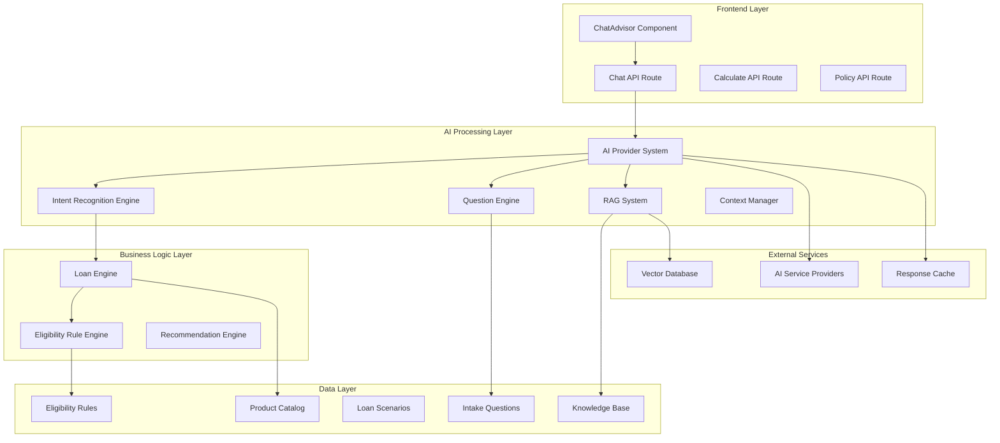
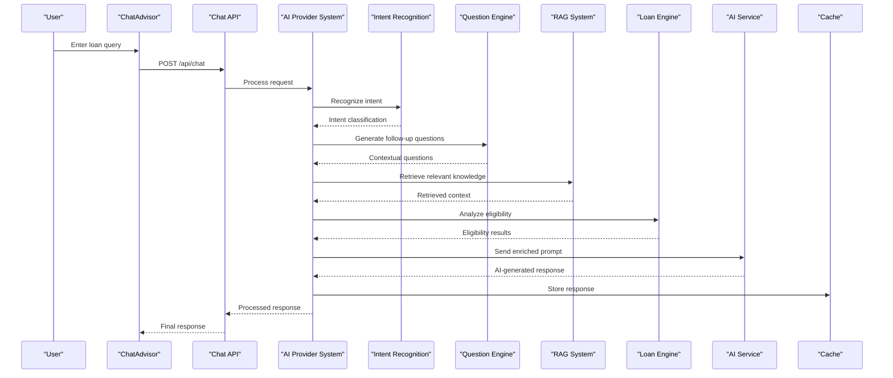
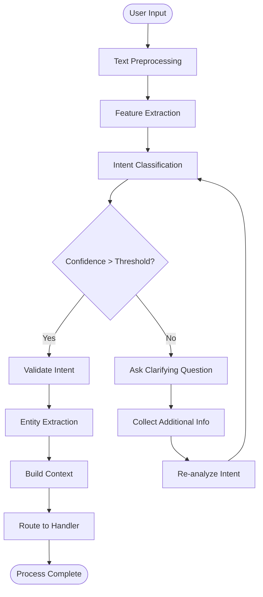
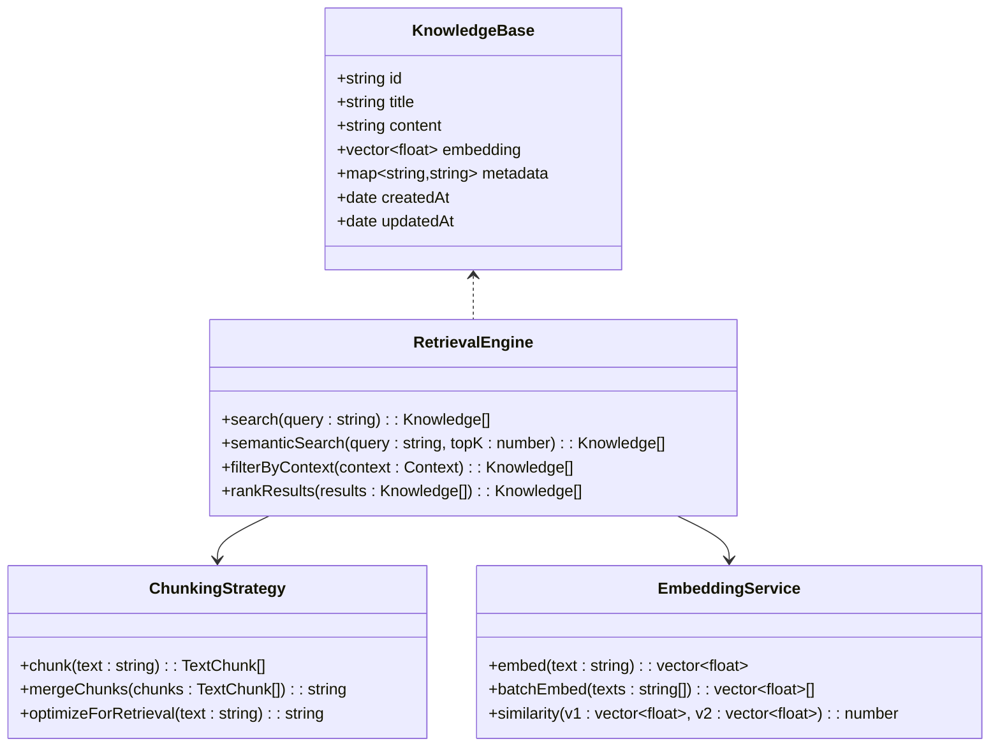
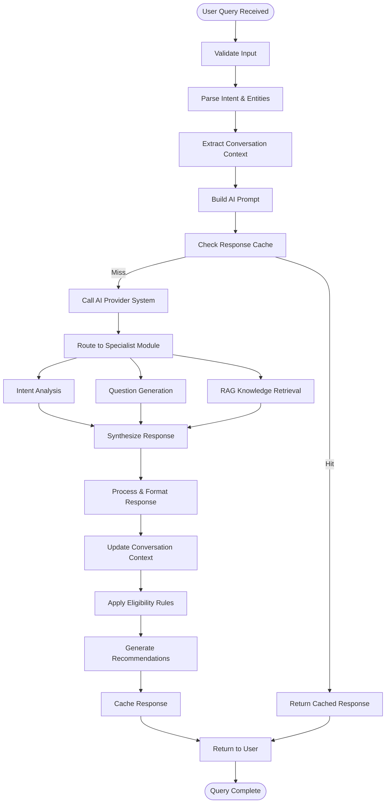
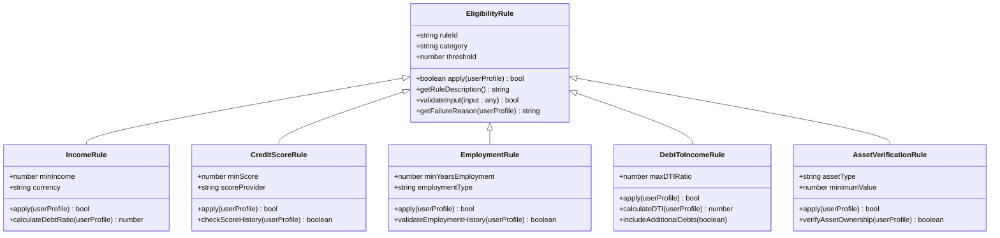
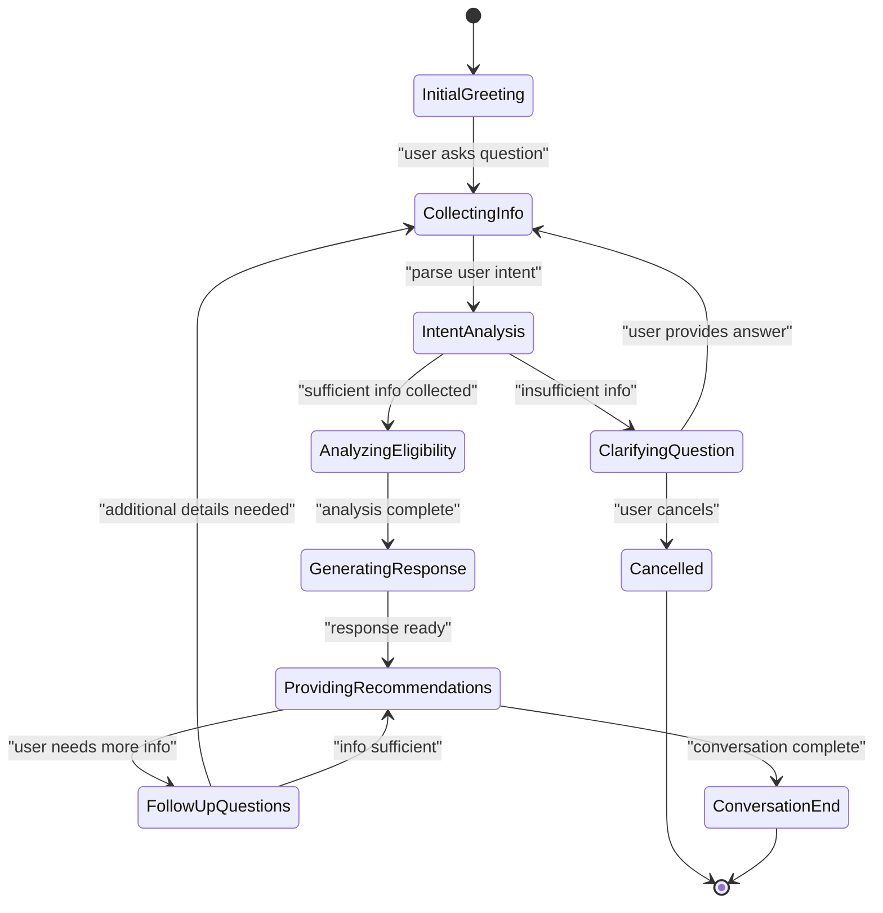
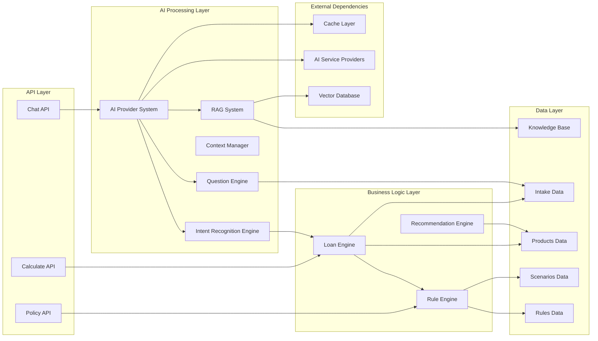

# AI Processing Engine

<cite>
**Referenced Files in This Document**
- [chat route.ts](file://src/app/api/chat/route.ts)
- [ChatAdvisor component](file://src/components/ChatAdvisor.tsx)
- [intakeQuestions.ts](file://src/data/intakeQuestions.ts)
- [eligibilityRules.ts](file://src/data/eligibilityRules.ts)
- [loanEngine.ts](file://src/lib/loanEngine.ts)
- [calculate route.ts](file://src/app/api/calculate/route.ts)
- [policy route.ts](file://src/app/api/policy/route.ts)
- [scenarios.ts](file://src/data/scenarios.ts)
- [products index.ts](file://src/data/products/index.ts)
- [Vietcombank products](file://src/data/products/vietcombank.ts)
</cite>

## Update Summary
**Changes Made**
- Updated architecture overview to reflect comprehensive AI engine with provider system
- Added new sections for intent recognition and question engine components
- Enhanced RAG system implementation details
- Updated multi-module architecture description
- Added provider system integration patterns
- Expanded conversation memory and context management

## Table of Contents
1. [Introduction](#introduction)
2. [Project Structure](#project-structure)
3. [Core Components](#core-components)
4. [Architecture Overview](#architecture-overview)
5. [AI Provider System](#ai-provider-system)
6. [Intent Recognition Engine](#intent-recognition-engine)
7. [Question Engine](#question-engine)
8. [RAG System Implementation](#rag-system-implementation)
9. [Detailed Component Analysis](#detailed-component-analysis)
10. [Dependency Analysis](#dependency-analysis)
11. [Performance Considerations](#performance-considerations)
12. [Troubleshooting Guide](#troubleshooting-guide)
13. [Conclusion](#conclusion)

## Introduction

The AI Processing Engine is a sophisticated loan advisory system that leverages artificial intelligence through a comprehensive provider-based architecture to provide personalized financial guidance. The system processes loan-related queries through an intelligent chat interface, analyzes user inputs using advanced intent recognition and prompt engineering techniques, and generates tailored responses based on eligibility rules and product recommendations.

This documentation covers the complete architecture of the AI processing pipeline, from initial user interaction through complex loan scenario analysis, including multi-turn dialogue handling, context management, response optimization strategies, and the integration of Retrieval-Augmented Generation (RAG) systems for enhanced knowledge retrieval.

## Project Structure

The AI Processing Engine follows a modular architecture with clear separation of concerns across specialized modules:

**Diagram sources**
- [chat route.ts](file://src/app/api/chat/route.ts)
- [ChatAdvisor component](file://src/components/ChatAdvisor.tsx)
- [loanEngine.ts](file://src/lib/loanEngine.ts)

**Section sources**
- [chat route.ts](file://src/app/api/chat/route.ts)
- [ChatAdvisor component](file://src/components/ChatAdvisor.tsx)

## Core Components

### Chat Interface Component
The ChatAdvisor component serves as the primary user interface for the AI processing engine. It handles real-time conversation flow, message rendering, and user input processing with enhanced state management for multi-turn dialogues.

### API Routes
The system exposes three main API endpoints:
- **Chat API**: Handles conversational interactions and query processing with intent recognition
- **Calculate API**: Processes loan calculations and financial projections with rule validation
- **Policy API**: Manages policy-specific logic and compliance checks with RAG integration

### Data Management
The data layer consists of structured information about:
- Intake questions for user profiling with dynamic question generation
- Eligibility rules for loan qualification with configurable criteria
- Predefined loan scenarios for testing and examples
- Product catalog with bank-specific offerings
- Knowledge base for RAG system enhancement

**Section sources**
- [ChatAdvisor component](file://src/components/ChatAdvisor.tsx)
- [chat route.ts](file://src/app/api/chat/route.ts)
- [intakeQuestions.ts](file://src/data/intakeQuestions.ts)
- [eligibilityRules.ts](file://src/data/eligibilityRules.ts)

## Architecture Overview

The AI Processing Engine implements a multi-layered architecture designed for scalability and maintainability with specialized modules for different aspects of AI processing:

**Diagram sources**
- [chat route.ts](file://src/app/api/chat/route.ts)
- [loanEngine.ts](file://src/lib/loanEngine.ts)

## AI Provider System

The AI Provider System serves as the central orchestration layer that manages multiple AI service providers and coordinates the overall processing workflow:

### Provider Abstraction Layer
- **Multi-Provider Support**: Abstracts different AI service implementations
- **Fallback Mechanisms**: Automatic switching between providers based on availability
- **Load Balancing**: Distributes requests across available providers
- **Configuration Management**: Centralized provider configuration and routing

### Request Routing and Orchestration
- **Intelligent Routing**: Routes requests to appropriate providers based on query type
- **Response Aggregation**: Combines responses from multiple providers when needed
- **Error Handling**: Comprehensive error handling and retry mechanisms
- **Performance Monitoring**: Tracks provider performance metrics

### Provider Integration Patterns
- **Strategy Pattern**: Implements different provider strategies for various use cases
- **Observer Pattern**: Monitors provider health and performance
- **Circuit Breaker Pattern**: Prevents cascading failures when providers are unavailable

**Section sources**
- [chat route.ts](file://src/app/api/chat/route.ts)
- [loanEngine.ts](file://src/lib/loanEngine.ts)

## Intent Recognition Engine

The Intent Recognition Engine analyzes user inputs to understand their loan-related intentions and required actions:

### Intent Classification
- **Natural Language Processing**: Advanced NLP techniques for understanding user queries
- **Context-Aware Classification**: Considers conversation history for accurate intent detection
- **Multi-Label Classification**: Supports queries with multiple intents
- **Confidence Scoring**: Provides confidence levels for intent classifications

### Supported Intent Types
- **Loan Inquiry**: General questions about loan products and features
- **Eligibility Check**: Determining if user qualifies for specific loans
- **Calculation Request**: Financial projections and payment calculations
- **Comparison Query**: Comparing different loan options
- **Application Guidance**: Step-by-step application assistance

### Intent Processing Pipeline

**Diagram sources**
- [chat route.ts](file://src/app/api/chat/route.ts)
- [intakeQuestions.ts](file://src/data/intakeQuestions.ts)

**Section sources**
- [chat route.ts](file://src/app/api/chat/route.ts)
- [intakeQuestions.ts](file://src/data/intakeQuestions.ts)

## Question Engine

The Question Engine dynamically generates contextual follow-up questions to gather necessary information for loan processing:

### Dynamic Question Generation
- **Context-Aware Questions**: Generates questions based on conversation context
- **Adaptive Difficulty**: Adjusts question complexity based on user expertise
- **Personalization**: Tailors questions to user profile and preferences
- **Branching Logic**: Supports conditional question flows

### Question Types and Strategies
- **Information Gathering**: Basic loan requirement collection
- **Clarification Questions**: Resolving ambiguities in user responses
- **Validation Questions**: Confirming critical information accuracy
- **Educational Questions**: Explaining loan concepts to users

### Question Flow Management
- **State Machine**: Manages complex question sequences and branching
- **Memory Persistence**: Maintains conversation state across sessions
- **Fallback Strategies**: Alternative question paths when primary flow fails
- **Completion Detection**: Automatically determines when sufficient information is collected

**Section sources**
- [intakeQuestions.ts](file://src/data/intakeQuestions.ts)
- [chat route.ts](file://src/app/api/chat/route.ts)

## RAG System Implementation

The Retrieval-Augmented Generation (RAG) System enhances AI responses by retrieving relevant knowledge from structured and unstructured data sources:

### Knowledge Base Architecture
- **Multi-Source Integration**: Combines data from banks, regulations, and financial products
- **Vector Embeddings**: Converts text content into searchable vector representations
- **Metadata Tagging**: Rich metadata for improved search relevance
- **Version Control**: Tracks knowledge base updates and changes

### Retrieval Strategies
- **Semantic Search**: Finds conceptually similar content beyond keyword matching
- **Hybrid Retrieval**: Combines vector similarity with traditional search methods
- **Contextual Filtering**: Filters results based on conversation context
- **Ranking Algorithms**: Prioritizes most relevant knowledge snippets

### Response Enhancement
- **Context Injection**: Seamlessly integrates retrieved knowledge into AI prompts
- **Citation Management**: Tracks source attribution for generated responses
- **Fact Verification**: Cross-references AI responses with retrieved facts
- **Confidence Scoring**: Indicates reliability of retrieved information

**Diagram sources**
- [chat route.ts](file://src/app/api/chat/route.ts)
- [loanEngine.ts](file://src/lib/loanEngine.ts)

**Section sources**
- [chat route.ts](file://src/app/api/chat/route.ts)
- [loanEngine.ts](file://src/lib/loanEngine.ts)

## Detailed Component Analysis

### Enhanced Chat Processing Pipeline

The chat processing pipeline now incorporates the comprehensive AI engine architecture:

**Diagram sources**
- [chat route.ts](file://src/app/api/chat/route.ts)
- [loanEngine.ts](file://src/lib/loanEngine.ts)

### Enhanced Eligibility Rule Engine

The eligibility rule engine has been enhanced with more sophisticated evaluation capabilities:

**Diagram sources**
- [eligibilityRules.ts](file://src/data/eligibilityRules.ts)
- [loanEngine.ts](file://src/lib/loanEngine.ts)

### Advanced Prompt Engineering Strategy

The system employs sophisticated prompt engineering techniques enhanced by the RAG system and intent recognition:

#### Context-Aware Prompting Enhancements
- **Conversation History Integration**: Maintains context across multiple turns with intelligent summarization
- **User Profile Embedding**: Includes relevant user characteristics and preferences in prompts
- **Domain-Specific Instructions**: Tailors AI behavior for financial advice with regulatory compliance
- **RAG Context Injection**: Seamlessly integrates retrieved knowledge into prompts
- **Intent-Based Prompting**: Adapts prompt structure based on recognized user intent

#### Response Formatting and Validation
- **Structured Output**: Ensures consistent response formats with schema validation
- **Conditional Logic**: Adapts response complexity based on user expertise level
- **Compliance Checks**: Validates responses against regulatory requirements
- **Source Attribution**: Includes citations for RAG-sourced information
- **Confidence Indicators**: Shows confidence levels for generated recommendations

**Section sources**
- [chat route.ts](file://src/app/api/chat/route.ts)
- [eligibilityRules.ts](file://src/data/eligibilityRules.ts)

### Enhanced Multi-Turn Dialogue Handling

The engine manages complex conversations through sophisticated stateful dialogue management:

**Diagram sources**
- [chat route.ts](file://src/app/api/chat/route.ts)
- [intakeQuestions.ts](file://src/data/intakeQuestions.ts)

## Dependency Analysis

The system maintains clear dependency relationships between components with enhanced modularity:

**Diagram sources**
- [chat route.ts](file://src/app/api/chat/route.ts)
- [calculate route.ts](file://src/app/api/calculate/route.ts)
- [policy route.ts](file://src/app/api/policy/route.ts)
- [loanEngine.ts](file://src/lib/loanEngine.ts)

**Section sources**
- [chat route.ts](file://src/app/api/chat/route.ts)
- [calculate route.ts](file://src/app/api/calculate/route.ts)
- [policy route.ts](file://src/app/api/policy/route.ts)

## Performance Considerations

### Enhanced Response Caching Strategy
The system implements intelligent caching optimized for the multi-module architecture:
- **Content-Based Caching**: Caches responses based on query similarity and context
- **TTL Management**: Configurable cache expiration policies per module
- **Memory Optimization**: Efficient storage of frequently accessed data
- **Distributed Caching**: Support for distributed cache clusters
- **Cache Warming**: Proactive caching of common query patterns

### Conversation Memory Management
- **Context Window Optimization**: Limits conversation history size with intelligent truncation
- **Selective State Persistence**: Stores only essential conversation state
- **Garbage Collection**: Automatic cleanup of unused conversation data
- **Memory Pooling**: Efficient memory allocation for conversation contexts

### AI Service Optimization
- **Request Batching**: Groups similar requests when possible
- **Timeout Handling**: Configurable timeouts for external services
- **Fallback Mechanisms**: Graceful degradation when services are unavailable
- **Load Distribution**: Intelligent load balancing across providers
- **Connection Pooling**: Optimized connection management for external services

### RAG System Performance
- **Vector Index Optimization**: Efficient vector database indexing and querying
- **Caching Strategies**: Caches frequent knowledge retrievals
- **Batch Processing**: Processes multiple queries efficiently
- **Memory Management**: Optimizes memory usage for large knowledge bases

## Troubleshooting Guide

### Common Issues and Solutions

#### AI Provider System Issues
- **Symptoms**: Provider connectivity failures, slow response times
- **Solutions**: Verify provider credentials, check network connectivity, implement retry logic, monitor provider health

#### Intent Recognition Problems
- **Symptoms**: Incorrect intent classification, low confidence scores
- **Solutions**: Review training data, adjust classification thresholds, enhance feature extraction, validate input preprocessing

#### Question Engine Failures
- **Symptoms**: Inappropriate questions, infinite loops, missing context
- **Solutions**: Validate question templates, check state machine logic, verify context persistence, review branching conditions

#### RAG System Issues
- **Symptoms**: Irrelevant knowledge retrieval, slow search performance
- **Solutions**: Optimize embeddings, tune search parameters, improve knowledge base quality, adjust ranking algorithms

#### Conversation Context Loss
- **Symptoms**: Inconsistent responses across conversation turns
- **Solutions**: Verify context persistence, check memory limits, validate state serialization, review context window management

#### Performance Degradation
- **Symptoms**: Slow response times, high memory usage, increased latency
- **Solutions**: Optimize cache settings, review query patterns, monitor resource utilization, scale infrastructure

**Section sources**
- [chat route.ts](file://src/app/api/chat/route.ts)
- [loanEngine.ts](file://src/lib/loanEngine.ts)

## Conclusion

The AI Processing Engine represents a comprehensive solution for automated loan advisory services through its sophisticated multi-module architecture. The integration of AI provider systems, intent recognition, question engines, and RAG capabilities delivers personalized loan recommendations while maintaining accuracy and compliance.

Key strengths include:
- **Modular AI Architecture**: Specialized modules for different aspects of AI processing
- **Intelligent Query Processing**: Advanced NLP capabilities with intent recognition
- **Enhanced Knowledge Retrieval**: RAG system for contextually relevant information
- **Robust Rule Engine**: Comprehensive eligibility checking with customizable criteria
- **Scalable Design**: Modular architecture supporting future enhancements
- **Performance Optimization**: Intelligent caching and memory management
- **Multi-Turn Support**: Sophisticated conversation handling for complex scenarios
- **Provider Flexibility**: Support for multiple AI service providers with fallback mechanisms

The system's design ensures maintainability, scalability, and adaptability to evolving financial product offerings and regulatory requirements while providing a seamless user experience through intelligent conversational interfaces.