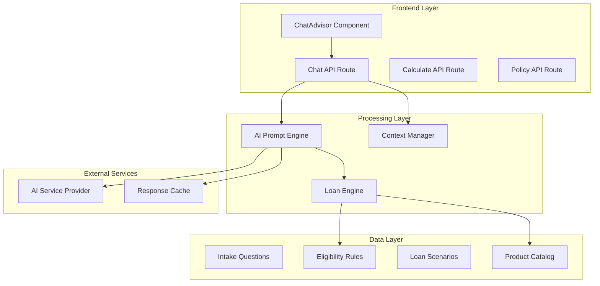
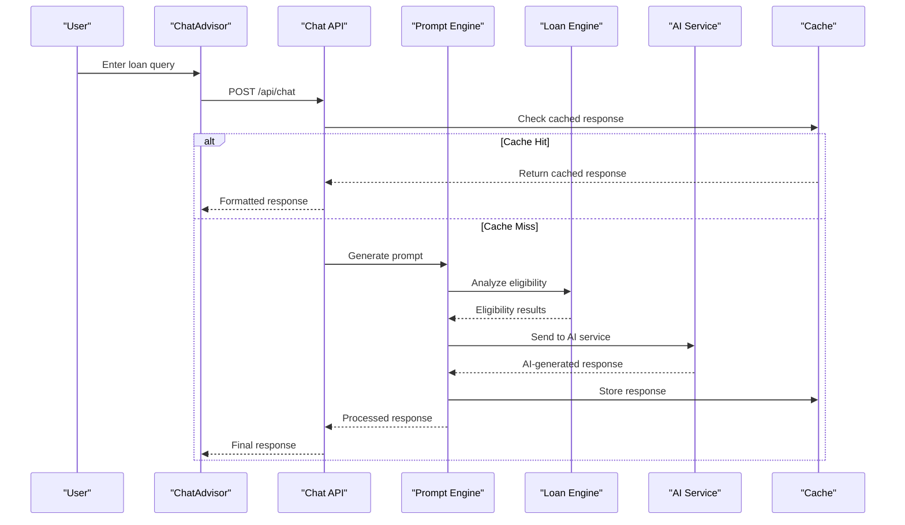
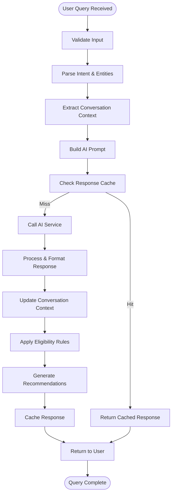
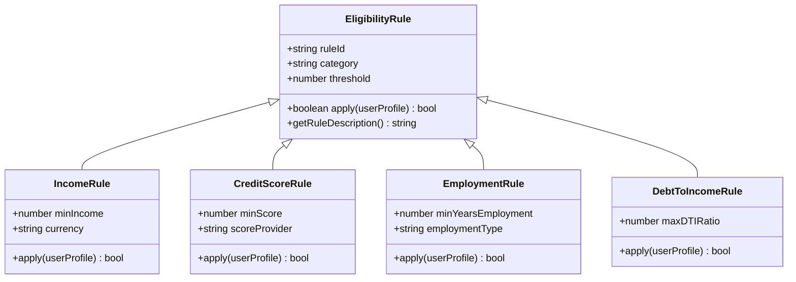
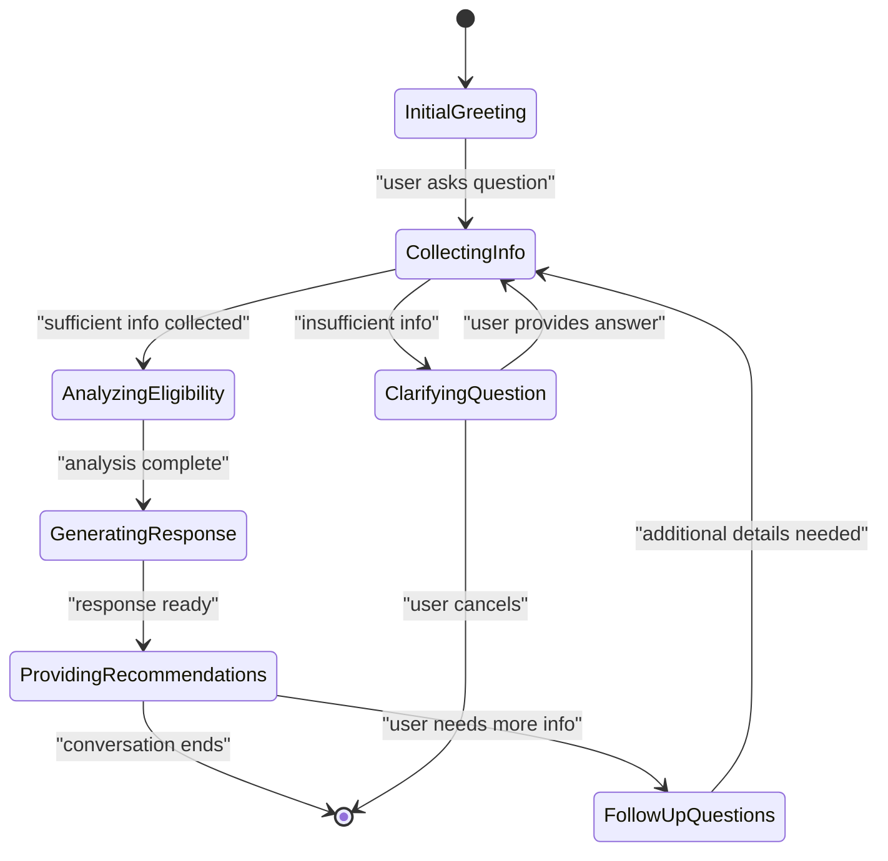
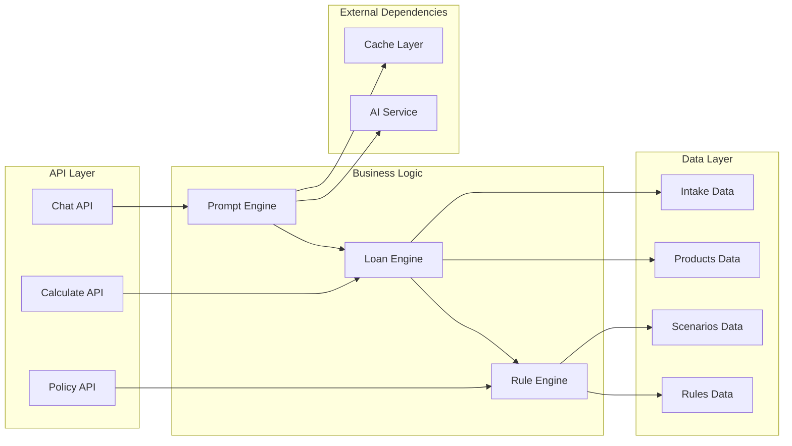

# AI Processing Engine

<cite>
**Referenced Files in This Document**
- [chat route.ts](file://src/app/api/chat/route.ts)
- [ChatAdvisor component](file://src/components/ChatAdvisor.tsx)
- [intakeQuestions.ts](file://src/data/intakeQuestions.ts)
- [eligibilityRules.ts](file://src/data/eligibilityRules.ts)
- [loanEngine.ts](file://src/lib/loanEngine.ts)
- [calculate route.ts](file://src/app/api/calculate/route.ts)
- [policy route.ts](file://src/app/api/policy/route.ts)
- [scenarios.ts](file://src/data/scenarios.ts)
- [products index.ts](file://src/data/products/index.ts)
- [Vietcombank products](file://src/data/products/vietcombank.ts)
</cite>

## Table of Contents
1. [Introduction](#introduction)
2. [Project Structure](#project-structure)
3. [Core Components](#core-components)
4. [Architecture Overview](#architecture-overview)
5. [Detailed Component Analysis](#detailed-component-analysis)
6. [Dependency Analysis](#dependency-analysis)
7. [Performance Considerations](#performance-considerations)
8. [Troubleshooting Guide](#troubleshooting-guide)
9. [Conclusion](#conclusion)

## Introduction

The AI Processing Engine is a sophisticated loan advisory system that leverages artificial intelligence to provide personalized financial guidance. The system processes loan-related queries through an intelligent chat interface, analyzes user inputs using advanced prompt engineering techniques, and generates tailored responses based on eligibility rules and product recommendations.

This documentation covers the complete architecture of the AI processing pipeline, from initial user interaction through complex loan scenario analysis, including multi-turn dialogue handling, context management, and response optimization strategies.

## Project Structure

The AI Processing Engine follows a modular architecture with clear separation of concerns:

**Diagram sources**
- [chat route.ts](file://src/app/api/chat/route.ts)
- [ChatAdvisor component](file://src/components/ChatAdvisor.tsx)
- [loanEngine.ts](file://src/lib/loanEngine.ts)

**Section sources**
- [chat route.ts](file://src/app/api/chat/route.ts)
- [ChatAdvisor component](file://src/components/ChatAdvisor.tsx)

## Core Components

### Chat Interface Component
The ChatAdvisor component serves as the primary user interface for the AI processing engine. It handles real-time conversation flow, message rendering, and user input processing.

### API Routes
The system exposes three main API endpoints:
- **Chat API**: Handles conversational interactions and query processing
- **Calculate API**: Processes loan calculations and financial projections
- **Policy API**: Manages policy-specific logic and compliance checks

### Data Management
The data layer consists of structured information about:
- Intake questions for user profiling
- Eligibility rules for loan qualification
- Predefined loan scenarios for testing and examples
- Product catalog with bank-specific offerings

**Section sources**
- [ChatAdvisor component](file://src/components/ChatAdvisor.tsx)
- [chat route.ts](file://src/app/api/chat/route.ts)
- [intakeQuestions.ts](file://src/data/intakeQuestions.ts)
- [eligibilityRules.ts](file://src/data/eligibilityRules.ts)

## Architecture Overview

The AI Processing Engine implements a multi-layered architecture designed for scalability and maintainability:

**Diagram sources**
- [chat route.ts](file://src/app/api/chat/route.ts)
- [loanEngine.ts](file://src/lib/loanEngine.ts)

## Detailed Component Analysis

### Chat Processing Pipeline

The chat processing pipeline handles the complete lifecycle of a loan query:

**Diagram sources**
- [chat route.ts](file://src/app/api/chat/route.ts)
- [loanEngine.ts](file://src/lib/loanEngine.ts)

### Eligibility Rule Engine

The eligibility rule engine evaluates user qualifications against predefined criteria:

**Diagram sources**
- [eligibilityRules.ts](file://src/data/eligibilityRules.ts)
- [loanEngine.ts](file://src/lib/loanEngine.ts)

### Prompt Engineering Strategy

The system employs sophisticated prompt engineering techniques for financial domain queries:

#### Context-Aware Prompting
- **Conversation History Integration**: Maintains context across multiple turns
- **User Profile Embedding**: Includes relevant user characteristics in prompts
- **Domain-Specific Instructions**: Tailors AI behavior for financial advice

#### Response Formatting
- **Structured Output**: Ensures consistent response formats
- **Conditional Logic**: Adapts response complexity based on user expertise
- **Compliance Checks**: Validates responses against regulatory requirements

**Section sources**
- [chat route.ts](file://src/app/api/chat/route.ts)
- [eligibilityRules.ts](file://src/data/eligibilityRules.ts)

### Multi-Turn Dialogue Handling

The engine manages complex conversations through stateful dialogue management:

**Diagram sources**
- [chat route.ts](file://src/app/api/chat/route.ts)
- [intakeQuestions.ts](file://src/data/intakeQuestions.ts)

## Dependency Analysis

The system maintains clear dependency relationships between components:

**Diagram sources**
- [chat route.ts](file://src/app/api/chat/route.ts)
- [calculate route.ts](file://src/app/api/calculate/route.ts)
- [policy route.ts](file://src/app/api/policy/route.ts)
- [loanEngine.ts](file://src/lib/loanEngine.ts)

**Section sources**
- [chat route.ts](file://src/app/api/chat/route.ts)
- [calculate route.ts](file://src/app/api/calculate/route.ts)
- [policy route.ts](file://src/app/api/policy/route.ts)

## Performance Considerations

### Response Caching Strategy
The system implements intelligent caching to optimize performance:
- **Content-Based Caching**: Caches responses based on query similarity
- **TTL Management**: Configurable cache expiration policies
- **Memory Optimization**: Efficient storage of frequently accessed data

### Conversation Memory Management
- **Context Window Optimization**: Limits conversation history size
- **Selective State Persistence**: Stores only essential conversation state
- **Garbage Collection**: Automatic cleanup of unused conversation data

### AI Service Optimization
- **Request Batching**: Groups similar requests when possible
- **Timeout Handling**: Configurable timeouts for external services
- **Fallback Mechanisms**: Graceful degradation when services are unavailable

## Troubleshooting Guide

### Common Issues and Solutions

#### AI Service Connectivity
- **Symptoms**: Timeout errors, connection failures
- **Solutions**: Verify API credentials, check network connectivity, implement retry logic

#### Eligibility Rule Failures
- **Symptoms**: Incorrect loan qualification decisions
- **Solutions**: Validate rule configurations, check data types, review threshold values

#### Conversation Context Loss
- **Symptoms**: Inconsistent responses across conversation turns
- **Solutions**: Verify context persistence, check memory limits, validate state serialization

#### Performance Degradation
- **Symptoms**: Slow response times, high memory usage
- **Solutions**: Optimize cache settings, review query patterns, monitor resource utilization

**Section sources**
- [chat route.ts](file://src/app/api/chat/route.ts)
- [loanEngine.ts](file://src/lib/loanEngine.ts)

## Conclusion

The AI Processing Engine represents a comprehensive solution for automated loan advisory services. Through its sophisticated architecture combining AI-powered natural language processing with rule-based financial logic, the system delivers personalized loan recommendations while maintaining accuracy and compliance.

Key strengths include:
- **Intelligent Query Processing**: Advanced NLP capabilities for understanding complex loan queries
- **Robust Rule Engine**: Comprehensive eligibility checking with customizable criteria
- **Scalable Architecture**: Modular design supporting future enhancements
- **Performance Optimization**: Intelligent caching and memory management
- **Multi-Turn Support**: Sophisticated conversation handling for complex scenarios

The system's design ensures maintainability, scalability, and adaptability to evolving financial product offerings and regulatory requirements.