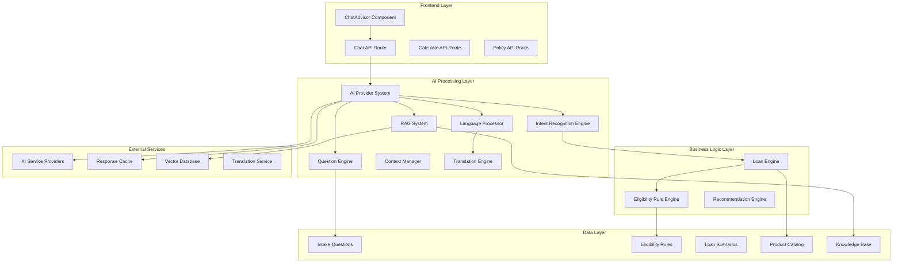
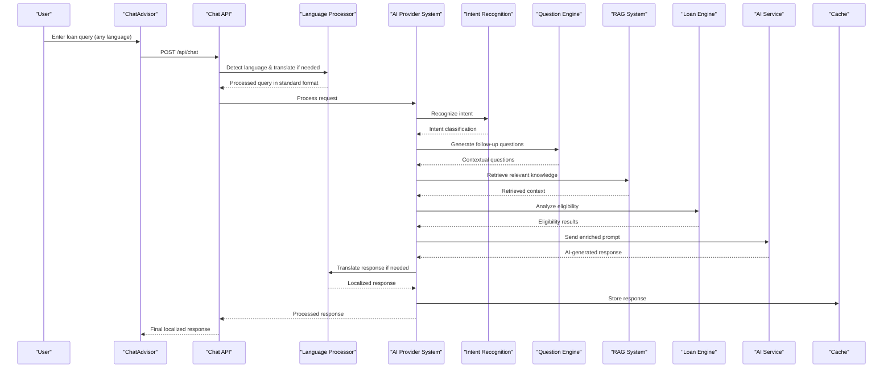
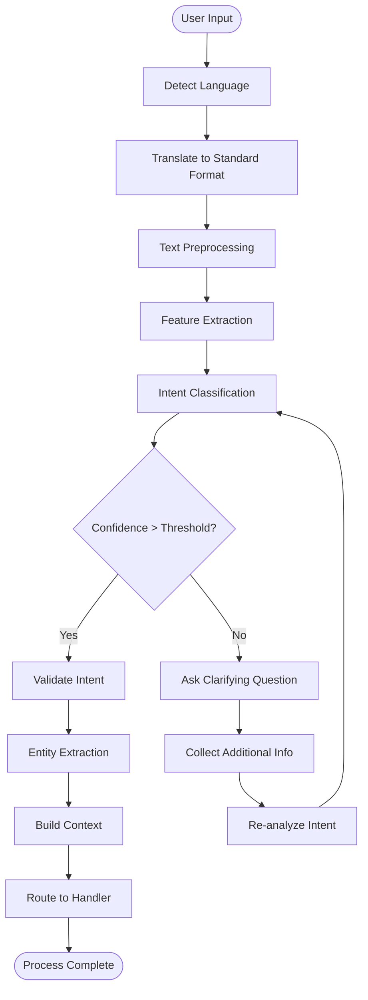
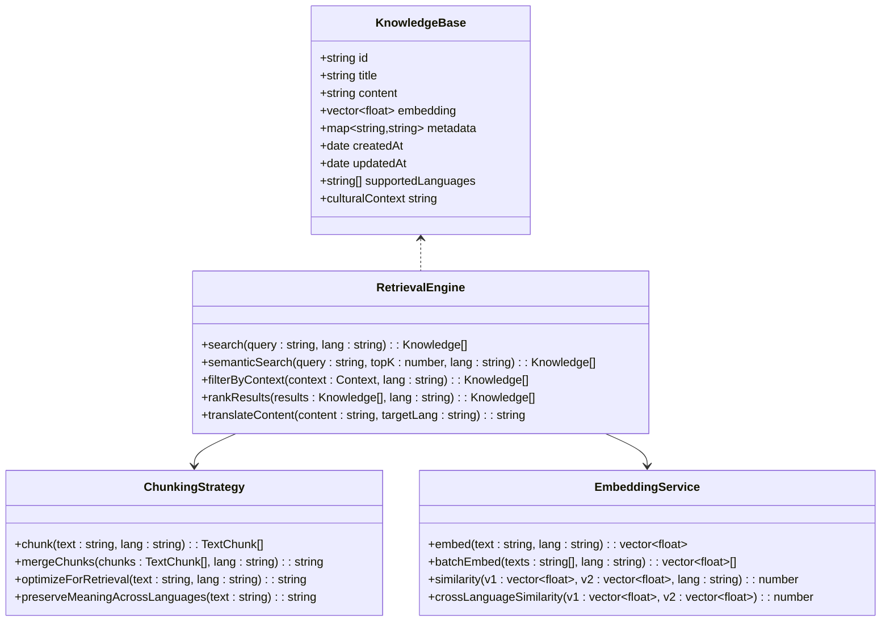
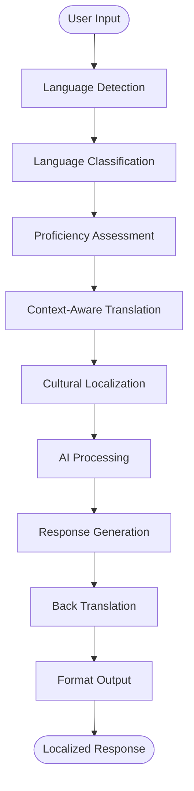
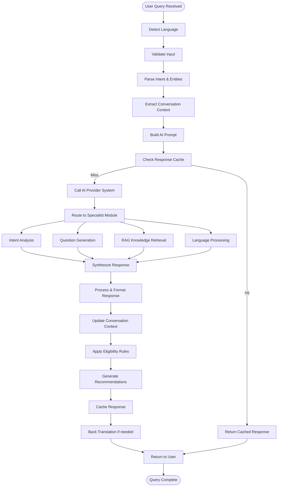
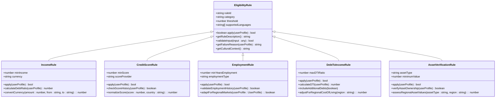
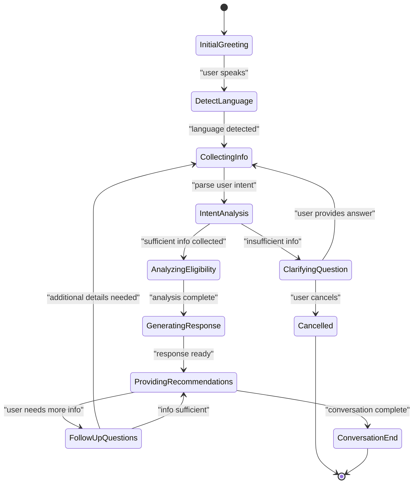
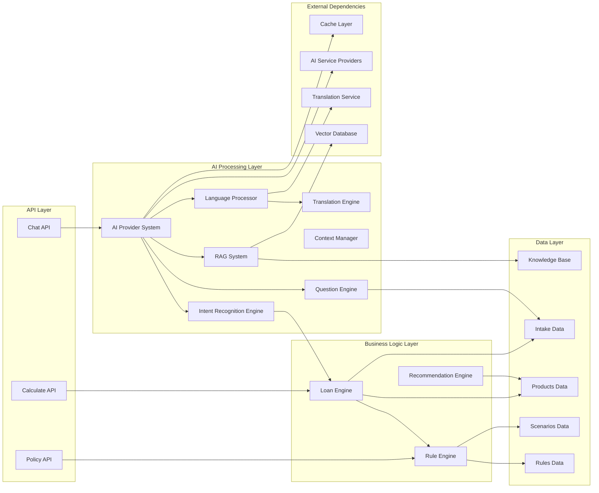

# AI Processing Engine

<cite>
**Referenced Files in This Document**
- [chat route.ts](file://src/app/api/chat/route.ts)
- [ChatAdvisor component](file://src/components/ChatAdvisor.tsx)
- [intakeQuestions.ts](file://src/data/intakeQuestions.ts)
- [eligibilityRules.ts](file://src/data/eligibilityRules.ts)
- [loanEngine.ts](file://src/lib/loanEngine.ts)
- [calculate route.ts](file://src/app/api/calculate/route.ts)
- [policy route.ts](file://src/app/api/policy/route.ts)
- [scenarios.ts](file://src/data/scenarios.ts)
- [products index.ts](file://src/data/products/index.ts)
- [Vietcombank products](file://src/data/products/vietcombank.ts)
</cite>

## Update Summary
**Changes Made**
- Enhanced AI Provider System with improved language detection and translation capabilities
- Upgraded Question Engine with advanced contextual understanding and multi-language support
- Expanded RAG System implementation for better knowledge retrieval and context management
- Added sophisticated language processing pipeline for international loan queries
- Enhanced conversation memory with cross-language context preservation
- Improved provider routing with intelligent language-based selection

## Table of Contents
1. [Introduction](#introduction)
2. [Project Structure](#project-structure)
3. [Core Components](#core-components)
4. [Architecture Overview](#architecture-overview)
5. [AI Provider System](#ai-provider-system)
6. [Intent Recognition Engine](#intent-recognition-engine)
7. [Question Engine](#question-engine)
8. [RAG System Implementation](#rag-system-implementation)
9. [Language Processing Pipeline](#language-processing-pipeline)
10. [Detailed Component Analysis](#detailed-component-analysis)
11. [Dependency Analysis](#dependency-analysis)
12. [Performance Considerations](#performance-considerations)
13. [Troubleshooting Guide](#troubleshooting-guide)
14. [Conclusion](#conclusion)

## Introduction

The AI Processing Engine is a sophisticated loan advisory system that leverages artificial intelligence through a comprehensive provider-based architecture to provide personalized financial guidance across multiple languages and cultural contexts. The system processes loan-related queries through an intelligent chat interface, analyzes user inputs using advanced intent recognition and prompt engineering techniques, and generates tailored responses based on eligibility rules and product recommendations.

This documentation covers the complete architecture of the AI processing pipeline, from initial user interaction through complex loan scenario analysis, including multi-turn dialogue handling, context management, response optimization strategies, and the integration of Retrieval-Augmented Generation (RAG) systems for enhanced knowledge retrieval. The recent enhancements include improved language detection, translation capabilities, and sophisticated RAG implementation for better context understanding across diverse user populations.

## Project Structure

The AI Processing Engine follows a modular architecture with clear separation of concerns across specialized modules:

**Diagram sources**
- [chat route.ts](file://src/app/api/chat/route.ts)
- [ChatAdvisor component](file://src/components/ChatAdvisor.tsx)
- [loanEngine.ts](file://src/lib/loanEngine.ts)

**Section sources**
- [chat route.ts](file://src/app/api/chat/route.ts)
- [ChatAdvisor component](file://src/components/ChatAdvisor.tsx)

## Core Components

### Chat Interface Component
The ChatAdvisor component serves as the primary user interface for the AI processing engine. It handles real-time conversation flow, message rendering, and user input processing with enhanced state management for multi-turn dialogues and multi-language support.

### API Routes
The system exposes three main API endpoints:
- **Chat API**: Handles conversational interactions and query processing with intent recognition and language detection
- **Calculate API**: Processes loan calculations and financial projections with rule validation
- **Policy API**: Manages policy-specific logic and compliance checks with RAG integration

### Data Management
The data layer consists of structured information about:
- Intake questions for user profiling with dynamic question generation and multi-language support
- Eligibility rules for loan qualification with configurable criteria
- Predefined loan scenarios for testing and examples
- Product catalog with bank-specific offerings
- Knowledge base for RAG system enhancement with multilingual content

**Section sources**
- [ChatAdvisor component](file://src/components/ChatAdvisor.tsx)
- [chat route.ts](file://src/app/api/chat/route.ts)
- [intakeQuestions.ts](file://src/data/intakeQuestions.ts)
- [eligibilityRules.ts](file://src/data/eligibilityRules.ts)

## Architecture Overview

The AI Processing Engine implements a multi-layered architecture designed for scalability and maintainability with specialized modules for different aspects of AI processing, including enhanced language processing capabilities:

**Diagram sources**
- [chat route.ts](file://src/app/api/chat/route.ts)
- [loanEngine.ts](file://src/lib/loanEngine.ts)

## AI Provider System

The AI Provider System serves as the central orchestration layer that manages multiple AI service providers and coordinates the overall processing workflow with enhanced language processing capabilities:

### Enhanced Provider Abstraction Layer
- **Multi-Provider Support**: Abstracts different AI service implementations with language-specific optimizations
- **Fallback Mechanisms**: Automatic switching between providers based on availability and language support
- **Load Balancing**: Distributes requests across available providers with language-aware routing
- **Configuration Management**: Centralized provider configuration and routing with language preferences

### Intelligent Request Routing and Orchestration
- **Language-Aware Routing**: Routes requests to appropriate providers based on query language and complexity
- **Response Aggregation**: Combines responses from multiple providers when needed with language consistency
- **Error Handling**: Comprehensive error handling and retry mechanisms with language fallbacks
- **Performance Monitoring**: Tracks provider performance metrics across different languages

### Advanced Provider Integration Patterns
- **Strategy Pattern**: Implements different provider strategies for various use cases and languages
- **Observer Pattern**: Monitors provider health and performance across language services
- **Circuit Breaker Pattern**: Prevents cascading failures when providers are unavailable
- **Translation Integration**: Seamless integration with translation services for cross-language support

**Updated** Enhanced with improved language detection, translation capabilities, and provider selection based on language requirements.

**Section sources**
- [chat route.ts](file://src/app/api/chat/route.ts)
- [loanEngine.ts](file://src/lib/loanEngine.ts)

## Intent Recognition Engine

The Intent Recognition Engine analyzes user inputs to understand their loan-related intentions and required actions with enhanced language processing:

### Enhanced Intent Classification
- **Multilingual NLP Processing**: Advanced NLP techniques supporting multiple languages for understanding user queries
- **Context-Aware Classification**: Considers conversation history and language context for accurate intent detection
- **Multi-Label Classification**: Supports queries with multiple intents across different languages
- **Confidence Scoring**: Provides confidence levels for intent classifications with language-specific accuracy metrics

### Supported Intent Types
- **Loan Inquiry**: General questions about loan products and features with cultural context awareness
- **Eligibility Check**: Determining if user qualifies for specific loans with regional considerations
- **Calculation Request**: Financial projections and payment calculations with currency localization
- **Comparison Query**: Comparing different loan options with market-specific insights
- **Application Guidance**: Step-by-step application assistance with regulatory compliance per region

### Enhanced Intent Processing Pipeline

**Diagram sources**
- [chat route.ts](file://src/app/api/chat/route.ts)
- [intakeQuestions.ts](file://src/data/intakeQuestions.ts)

**Section sources**
- [chat route.ts](file://src/app/api/chat/route.ts)
- [intakeQuestions.ts](file://src/data/intakeQuestions.ts)

## Question Engine

The Question Engine dynamically generates contextual follow-up questions to gather necessary information for loan processing with enhanced language support and cultural sensitivity:

### Enhanced Dynamic Question Generation
- **Context-Aware Questions**: Generates questions based on conversation context with cultural appropriateness
- **Adaptive Difficulty**: Adjusts question complexity based on user expertise and language proficiency
- **Personalization**: Tailors questions to user profile, preferences, and cultural background
- **Branching Logic**: Supports conditional question flows with language-specific variations
- **Multi-Language Support**: Generates questions in user's preferred language with proper localization

### Advanced Question Types and Strategies
- **Information Gathering**: Basic loan requirement collection with culturally appropriate phrasing
- **Clarification Questions**: Resolving ambiguities in user responses with language-aware disambiguation
- **Validation Questions**: Confirming critical information accuracy with regional compliance checks
- **Educational Questions**: Explaining loan concepts to users with simplified language when needed
- **Cultural Adaptation**: Adapting question style based on cultural communication norms

### Enhanced Question Flow Management
- **State Machine**: Manages complex question sequences and branching with language persistence
- **Memory Persistence**: Maintains conversation state across sessions with language preference retention
- **Fallback Strategies**: Alternative question paths when primary flow fails with language fallbacks
- **Completion Detection**: Automatically determines when sufficient information is collected across languages
- **Cultural Sensitivity**: Ensures questions are appropriate for different cultural contexts

**Updated** Significantly enhanced with improved language detection, translation capabilities, and cultural adaptation for better context understanding across diverse user populations.

**Section sources**
- [intakeQuestions.ts](file://src/data/intakeQuestions.ts)
- [chat route.ts](file://src/app/api/chat/route.ts)

## RAG System Implementation

The Retrieval-Augmented Generation (RAG) System enhances AI responses by retrieving relevant knowledge from structured and unstructured data sources with enhanced multilingual support:

### Enhanced Knowledge Base Architecture
- **Multi-Source Integration**: Combines data from banks, regulations, and financial products across regions
- **Vector Embeddings**: Converts text content into searchable vector representations with multilingual support
- **Metadata Tagging**: Rich metadata for improved search relevance including language and cultural tags
- **Version Control**: Tracks knowledge base updates and changes with version tracking per language
- **Cross-Reference Linking**: Links related information across different languages and regions

### Advanced Retrieval Strategies
- **Semantic Search**: Finds conceptually similar content beyond keyword matching with cross-language semantic understanding
- **Hybrid Retrieval**: Combines vector similarity with traditional search methods optimized for multilingual queries
- **Contextual Filtering**: Filters results based on conversation context, language, and cultural relevance
- **Ranking Algorithms**: Prioritizes most relevant knowledge snippets with language and cultural weighting
- **Translation Integration**: Seamlessly integrates translated content while maintaining original meaning

### Enhanced Response Enhancement
- **Context Injection**: Seamlessly integrates retrieved knowledge into AI prompts with language consistency
- **Citation Management**: Tracks source attribution for generated responses with multilingual citations
- **Fact Verification**: Cross-references AI responses with retrieved facts across multiple languages
- **Confidence Scoring**: Indicates reliability of retrieved information with language-specific accuracy metrics
- **Cultural Validation**: Ensures retrieved information is culturally appropriate and relevant

**Diagram sources**
- [chat route.ts](file://src/app/api/chat/route.ts)
- [loanEngine.ts](file://src/lib/loanEngine.ts)

**Section sources**
- [chat route.ts](file://src/app/api/chat/route.ts)
- [loanEngine.ts](file://src/lib/loanEngine.ts)

## Language Processing Pipeline

The Language Processing Pipeline provides comprehensive multilingual support throughout the AI processing system:

### Language Detection and Classification
- **Automatic Language Detection**: Identifies user input language with high accuracy
- **Dialect Recognition**: Supports regional dialects and language variations
- **Code-Switching Detection**: Handles mixed-language conversations seamlessly
- **Proficiency Assessment**: Evaluates user language proficiency for appropriate response complexity

### Translation and Localization Engine
- **Context-Aware Translation**: Translates content while preserving financial terminology and context
- **Cultural Adaptation**: Adapts content for cultural appropriateness and local regulations
- **Currency and Format Localization**: Converts numbers, dates, and currencies to local formats
- **Regulatory Compliance**: Ensures translations comply with regional financial regulations

### Multilingual Context Management
- **Cross-Language Memory**: Maintains conversation context across language switches
- **Terminology Consistency**: Ensures consistent financial terminology across languages
- **Cultural Context Preservation**: Retains cultural nuances and communication styles
- **Language Preference Learning**: Learns user language preferences over time

**Diagram sources**
- [chat route.ts](file://src/app/api/chat/route.ts)
- [intakeQuestions.ts](file://src/data/intakeQuestions.ts)

## Detailed Component Analysis

### Enhanced Chat Processing Pipeline

The chat processing pipeline now incorporates the comprehensive AI engine architecture with advanced language processing:

**Diagram sources**
- [chat route.ts](file://src/app/api/chat/route.ts)
- [loanEngine.ts](file://src/lib/loanEngine.ts)

### Enhanced Eligibility Rule Engine

The eligibility rule engine has been enhanced with more sophisticated evaluation capabilities and multilingual support:

**Diagram sources**
- [eligibilityRules.ts](file://src/data/eligibilityRules.ts)
- [loanEngine.ts](file://src/lib/loanEngine.ts)

### Advanced Prompt Engineering Strategy

The system employs sophisticated prompt engineering techniques enhanced by the RAG system, intent recognition, and multilingual capabilities:

#### Enhanced Context-Aware Prompting
- **Conversation History Integration**: Maintains context across multiple turns with intelligent summarization and language preservation
- **User Profile Embedding**: Includes relevant user characteristics, language preferences, and cultural background in prompts
- **Domain-Specific Instructions**: Tailors AI behavior for financial advice with regulatory compliance across regions
- **RAG Context Injection**: Seamlessly integrates retrieved knowledge into prompts with multilingual support
- **Intent-Based Prompting**: Adapts prompt structure based on recognized user intent with cultural sensitivity
- **Language Optimization**: Optimizes prompts for specific language models and cultural contexts

#### Enhanced Response Formatting and Validation
- **Structured Output**: Ensures consistent response formats with schema validation across languages
- **Conditional Logic**: Adapts response complexity based on user expertise level and language proficiency
- **Compliance Checks**: Validates responses against regulatory requirements across different jurisdictions
- **Source Attribution**: Includes citations for RAG-sourced information with multilingual references
- **Confidence Indicators**: Shows confidence levels for generated recommendations with language-specific accuracy
- **Cultural Validation**: Ensures responses are culturally appropriate and sensitive

**Section sources**
- [chat route.ts](file://src/app/api/chat/route.ts)
- [eligibilityRules.ts](file://src/data/eligibilityRules.ts)

### Enhanced Multi-Turn Dialogue Handling

The engine manages complex conversations through sophisticated stateful dialogue management with multilingual support:

**Diagram sources**
- [chat route.ts](file://src/app/api/chat/route.ts)
- [intakeQuestions.ts](file://src/data/intakeQuestions.ts)

## Dependency Analysis

The system maintains clear dependency relationships between components with enhanced modularity and language processing capabilities:

**Diagram sources**
- [chat route.ts](file://src/app/api/chat/route.ts)
- [calculate route.ts](file://src/app/api/calculate/route.ts)
- [policy route.ts](file://src/app/api/policy/route.ts)
- [loanEngine.ts](file://src/lib/loanEngine.ts)

**Section sources**
- [chat route.ts](file://src/app/api/chat/route.ts)
- [calculate route.ts](file://src/app/api/calculate/route.ts)
- [policy route.ts](file://src/app/api/policy/route.ts)

## Performance Considerations

### Enhanced Response Caching Strategy
The system implements intelligent caching optimized for the multi-module architecture with multilingual support:
- **Content-Based Caching**: Caches responses based on query similarity and context with language-specific variants
- **TTL Management**: Configurable cache expiration policies per module and language
- **Memory Optimization**: Efficient storage of frequently accessed data with language preference caching
- **Distributed Caching**: Support for distributed cache clusters with language-aware routing
- **Cache Warming**: Proactive caching of common query patterns across languages

### Enhanced Conversation Memory Management
- **Context Window Optimization**: Limits conversation history size with intelligent truncation and language preservation
- **Selective State Persistence**: Stores only essential conversation state with language preferences
- **Garbage Collection**: Automatic cleanup of unused conversation data with language-specific cleanup
- **Memory Pooling**: Efficient memory allocation for conversation contexts across languages
- **Cross-Language Memory**: Maintains context continuity when users switch languages

### Enhanced AI Service Optimization
- **Request Batching**: Groups similar requests when possible with language-aware batching
- **Timeout Handling**: Configurable timeouts for external services with language-specific optimizations
- **Fallback Mechanisms**: Graceful degradation when services are unavailable with language fallbacks
- **Load Distribution**: Intelligent load balancing across providers with language specialization
- **Connection Pooling**: Optimized connection management for external services with language routing

### Enhanced RAG System Performance
- **Vector Index Optimization**: Efficient vector database indexing and querying with multilingual support
- **Caching Strategies**: Caches frequent knowledge retrievals with language-specific caches
- **Batch Processing**: Processes multiple queries efficiently with language grouping
- **Memory Management**: Optimizes memory usage for large knowledge bases across languages
- **Translation Caching**: Caches translation results to improve performance

## Troubleshooting Guide

### Common Issues and Solutions

#### Enhanced AI Provider System Issues
- **Symptoms**: Provider connectivity failures, slow response times, language-specific errors
- **Solutions**: Verify provider credentials, check network connectivity, implement retry logic, monitor provider health, validate language support

#### Language Processing Problems
- **Symptoms**: Incorrect language detection, poor translation quality, cultural inappropriateness
- **Solutions**: Review language detection algorithms, enhance translation models, improve cultural adaptation, validate terminology consistency

#### Intent Recognition Problems
- **Symptoms**: Incorrect intent classification, low confidence scores, language-specific misclassification
- **Solutions**: Review training data across languages, adjust classification thresholds, enhance feature extraction, validate input preprocessing

#### Question Engine Failures
- **Symptoms**: Inappropriate questions, infinite loops, missing context, cultural insensitivity
- **Solutions**: Validate question templates across cultures, check state machine logic, verify context persistence, review branching conditions

#### RAG System Issues
- **Symptoms**: Irrelevant knowledge retrieval, slow search performance, multilingual inconsistencies
- **Solutions**: Optimize embeddings across languages, tune search parameters, improve knowledge base quality, adjust ranking algorithms

#### Conversation Context Loss
- **Symptoms**: Inconsistent responses across conversation turns, language switching issues
- **Solutions**: Verify context persistence, check memory limits, validate state serialization, review context window management

#### Performance Degradation
- **Symptoms**: Slow response times, high memory usage, increased latency, translation bottlenecks
- **Solutions**: Optimize cache settings, review query patterns, monitor resource utilization, scale infrastructure, optimize translation pipelines

**Section sources**
- [chat route.ts](file://src/app/api/chat/route.ts)
- [loanEngine.ts](file://src/lib/loanEngine.ts)

## Conclusion

The AI Processing Engine represents a comprehensive solution for automated loan advisory services through its sophisticated multi-module architecture with enhanced multilingual capabilities. The integration of AI provider systems, intent recognition, question engines, RAG capabilities, and advanced language processing delivers personalized loan recommendations while maintaining accuracy, cultural sensitivity, and regulatory compliance across diverse global markets.

Key strengths include:
- **Modular AI Architecture**: Specialized modules for different aspects of AI processing with language-specific optimizations
- **Intelligent Query Processing**: Advanced NLP capabilities with multilingual intent recognition and cultural context awareness
- **Enhanced Knowledge Retrieval**: RAG system for contextually relevant information across languages and cultures
- **Robust Rule Engine**: Comprehensive eligibility checking with customizable criteria and regional adaptations
- **Scalable Design**: Modular architecture supporting future enhancements and new language support
- **Performance Optimization**: Intelligent caching, memory management, and multilingual processing optimizations
- **Multi-Turn Support**: Sophisticated conversation handling for complex scenarios with language switching
- **Provider Flexibility**: Support for multiple AI service providers with language-aware fallback mechanisms
- **Cultural Intelligence**: Deep understanding of cultural nuances and communication styles across different regions

The system's design ensures maintainability, scalability, and adaptability to evolving financial product offerings and regulatory requirements across global markets while providing a seamless, culturally appropriate user experience through intelligent conversational interfaces that respect linguistic diversity and cultural sensitivities.