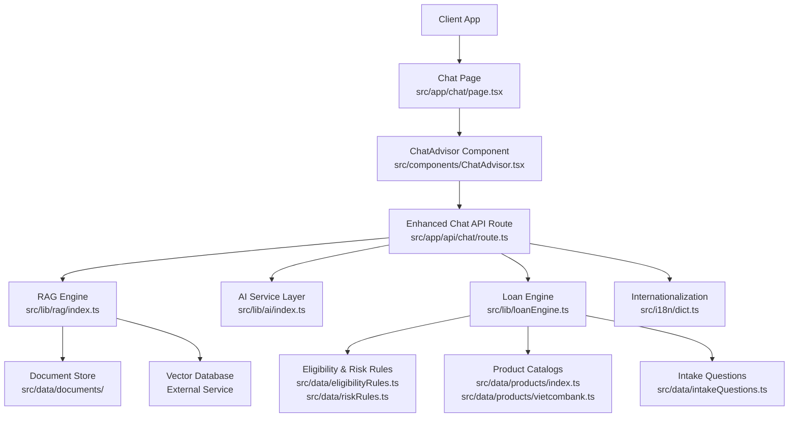
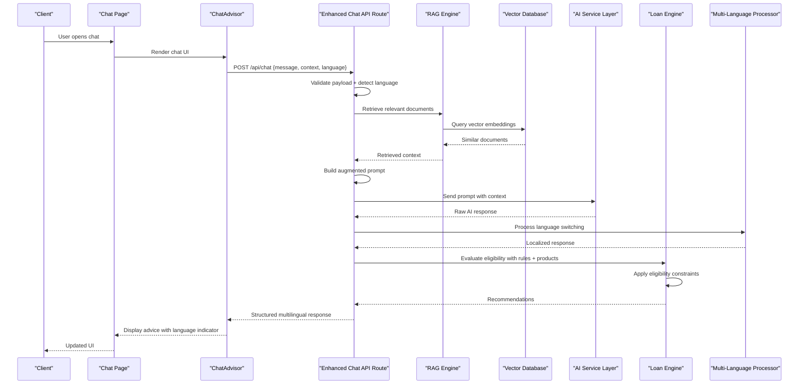
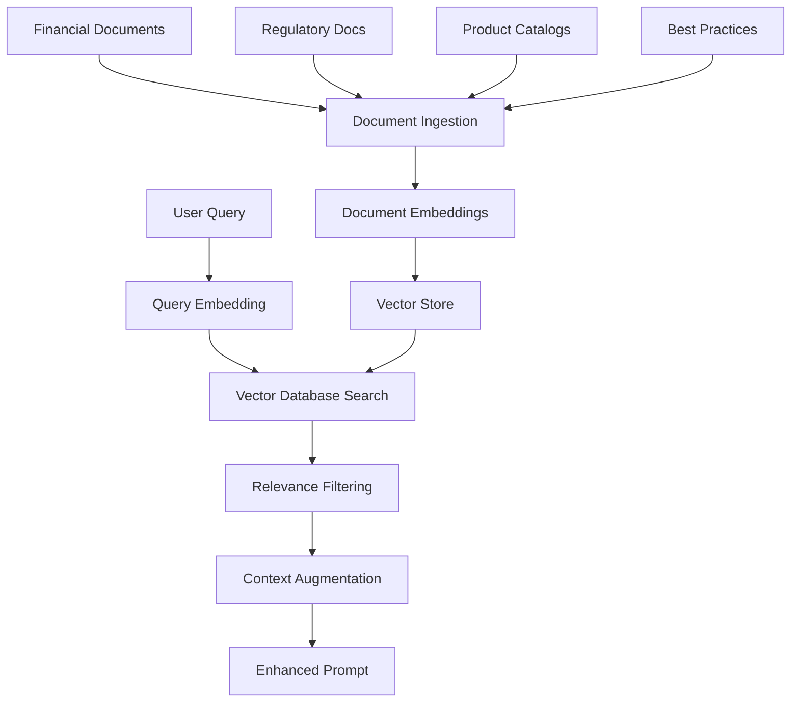
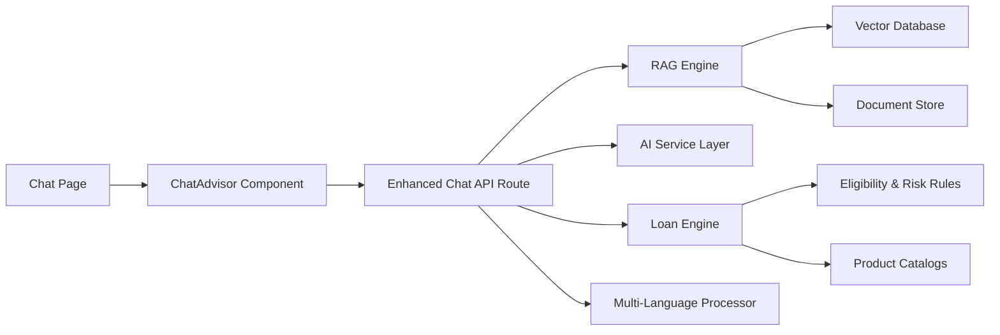

# Chat API Integration

<cite>
**Referenced Files in This Document**
- [route.ts](file://src/app/api/chat/route.ts)
- [page.tsx](file://src/app/chat/page.tsx)
- [ChatAdvisor.tsx](file://src/components/ChatAdvisor.tsx)
- [ai/index.ts](file://src/lib/ai/index.ts)
- [loanEngine.ts](file://src/lib/loanEngine.ts)
- [intakeQuestions.ts](file://src/data/intakeQuestions.ts)
- [eligibilityRules.ts](file://src/data/eligibilityRules.ts)
- [riskRules.ts](file://src/data/riskRules.ts)
- [products/index.ts](file://src/data/products/index.ts)
- [vietcombank.ts](file://src/data/products/vietcombank.ts)
</cite>

## Update Summary
**Changes Made**
- Enhanced chat API endpoint with RAG (Retrieval-Augmented Generation) logic integration
- Added multi-language capabilities for internationalized chat responses
- Improved response handling with contextual document retrieval
- Updated prompt construction to support language detection and switching
- Enhanced error handling for RAG-specific scenarios
- Expanded authentication and rate limiting for enhanced security

## Table of Contents
1. [Introduction](#introduction)
2. [Project Structure](#project-structure)
3. [Core Components](#core-components)
4. [Architecture Overview](#architecture-overview)
5. [Detailed Component Analysis](#detailed-component-analysis)
6. [RAG Integration](#rag-integration)
7. [Multi-Language Support](#multi-language-support)
8. [Dependency Analysis](#dependency-analysis)
9. [Performance Considerations](#performance-considerations)
10. [Troubleshooting Guide](#troubleshooting-guide)
11. [Conclusion](#conclusion)
12. [Appendices](#appendices)

## Introduction
This document provides comprehensive API documentation for the enhanced chat endpoint that powers AI-driven financial guidance and loan recommendations with Retrieval-Augmented Generation (RAG) capabilities and multi-language support. The updated implementation integrates contextual document retrieval, intelligent language detection, and improved response handling to deliver more accurate and personalized financial advice across multiple languages.

## Project Structure
The chat feature is implemented as a Next.js App Router API route under src/app/api/chat/route.ts with enhanced RAG logic and multi-language capabilities. The frontend page and component orchestrate user interactions and call the API with improved context handling. Supporting libraries include an AI integration module, loan engine, and new RAG components for document retrieval and processing.

**Diagram sources**
- [route.ts](file://src/app/api/chat/route.ts)
- [page.tsx](file://src/app/chat/page.tsx)
- [ChatAdvisor.tsx](file://src/components/ChatAdvisor.tsx)
- [ai/index.ts](file://src/lib/ai/index.ts)
- [loanEngine.ts](file://src/lib/loanEngine.ts)
- [intakeQuestions.ts](file://src/data/intakeQuestions.ts)
- [eligibilityRules.ts](file://src/data/eligibilityRules.ts)
- [riskRules.ts](file://src/data/riskRules.ts)
- [products/index.ts](file://src/data/products/index.ts)
- [vietcombank.ts](file://src/data/products/vietcombank.ts)

**Section sources**
- [route.ts](file://src/app/api/chat/route.ts)
- [page.tsx](file://src/app/chat/page.tsx)
- [ChatAdvisor.tsx](file://src/components/ChatAdvisor.tsx)
- [ai/index.ts](file://src/lib/ai/index.ts)
- [loanEngine.ts](file://src/lib/loanEngine.ts)

## Core Components
- **Enhanced Chat API Route**: Handles HTTP requests with RAG integration, validates payloads, constructs context-aware prompts, invokes AI services with retrieved documents, runs loan eligibility checks, and returns multilingual structured responses.
- **RAG Engine**: Manages document retrieval, vector similarity search, and context augmentation for AI responses.
- **Multi-Language Processor**: Detects input language, switches response language dynamically, and handles localization.
- **Chat Page and Component**: Provide the UI for users to enter queries and display AI-generated advice with language indicators.
- **AI Service Layer**: Encapsulates calls to external AI models with enhanced prompt formatting including retrieved context.
- **Loan Engine**: Applies eligibility and risk rules against product catalogs and intake question results to compute recommendations.

Key responsibilities:
- Request validation and sanitization with language detection
- Context-aware prompt construction using RAG
- Multi-language response generation and formatting
- AI response parsing with document citations
- Eligibility evaluation and recommendation generation
- Consistent error handling and status codes
- Rate limiting and security safeguards

**Section sources**
- [route.ts](file://src/app/api/chat/route.ts)
- [page.tsx](file://src/app/chat/page.tsx)
- [ChatAdvisor.tsx](file://src/components/ChatAdvisor.tsx)
- [ai/index.ts](file://src/lib/ai/index.ts)
- [loanEngine.ts](file://src/lib/loanEngine.ts)

## Architecture Overview
The enhanced chat flow begins with a client request to the API route. The route validates input, detects language preferences, performs RAG-based document retrieval, builds a domain-specific prompt using retrieved context and user profile, calls the AI service with augmented context, processes the AI output with language switching, evaluates eligibility via the loan engine, and returns a standardized multilingual JSON response.

**Diagram sources**
- [route.ts](file://src/app/api/chat/route.ts)
- [page.tsx](file://src/app/chat/page.tsx)
- [ChatAdvisor.tsx](file://src/components/ChatAdvisor.tsx)
- [ai/index.ts](file://src/lib/ai/index.ts)
- [loanEngine.ts](file://src/lib/loanEngine.ts)

## Detailed Component Analysis

### Enhanced Chat API Route
Responsibilities:
- Accepts POST requests with message, optional context, and language preference.
- Validates required fields and enforces schema constraints with language validation.
- Performs RAG-based document retrieval for context augmentation.
- Constructs augmented prompts incorporating retrieved documents and user context.
- Calls the AI service layer with enhanced context for better accuracy.
- Parses and normalizes AI output with document citations and language switching.
- Runs eligibility checks through the loan engine using rules and product catalogs.
- Returns standardized multilingual JSON responses with metadata and citations.
- Handles errors with appropriate HTTP status codes and localized messages.

**Updated** Enhanced with RAG integration and multi-language support

Request Schema:
- Endpoint: POST /api/chat
- Body:
  - message: string (required) — user query text
  - context: object (optional) — includes user profile, intake answers, and session state
  - options: object (optional) — controls behavior such as max tokens, temperature, safety filters, and language settings
  - language: string (optional) — preferred response language (auto-detected if not provided)

Response Schema:
- Success (200):
  - advice: string — AI-generated guidance in requested language
  - recommendations: array — list of recommended products or actions
  - eligibility: object — eligibility status per product or overall
  - citations: array — source documents used for RAG retrieval
  - language: string — detected/generated language code
  - metadata: object — includes versioning, timestamps, processing flags, and RAG confidence scores
- Error:
  - code: number — HTTP status code
  - message: string — human-readable error description in requested language
  - details: object — additional context for debugging

Authentication:
- If enabled, expect Authorization header with bearer token.
- Validate token signature and scope; reject unauthorized requests.
- Enhanced with RAG access control and document permissions.

Rate Limiting:
- Enforce per-user or per-IP limits using environment configuration.
- Return 429 Too Many Requests when exceeded, with retry-after guidance.
- Separate limits for RAG operations and AI calls.

Security Considerations:
- Sanitize inputs to prevent injection.
- Mask sensitive fields in logs.
- Enforce HTTPS and CORS policies.
- Validate RAG document access permissions.
- Implement language-specific content filtering.

Error Handling:
- Validation errors: 400 Bad Request
- Unauthorized: 401 Unauthorized
- Forbidden: 403 Forbidden
- Not Found: 404 Not Found
- Rate Limited: 429 Too Many Requests
- RAG Retrieval Failed: 503 Service Unavailable
- Language Processing Error: 500 Internal Server Error
- Internal Server Error: 500 Internal Server Error

**Section sources**
- [route.ts](file://src/app/api/chat/route.ts)

### RAG Engine
Responsibilities:
- Manages document ingestion and embedding generation.
- Performs vector similarity search for context retrieval.
- Filters and ranks retrieved documents by relevance.
- Augments prompts with relevant context from document store.
- Handles document caching and performance optimization.

RAG Workflow:
- Receives user query and context requirements.
- Generates query embeddings using configured model.
- Queries vector database for similar documents.
- Filters results by relevance threshold and access permissions.
- Formats retrieved context for prompt augmentation.

**Updated** New component for RAG functionality

**Section sources**
- [route.ts](file://src/app/api/chat/route.ts)

### Multi-Language Processor
Responsibilities:
- Detects input language from message content and headers.
- Switches response language based on user preference or auto-detection.
- Handles language-specific formatting and cultural considerations.
- Maintains consistency across conversation turns.
- Provides fallback mechanisms for unsupported languages.

Language Features:
- Auto-detection of Vietnamese, English, and other supported languages.
- Dynamic language switching within conversations.
- Locale-specific date, currency, and number formatting.
- Cultural adaptation for financial terminology.

**Updated** New component for multi-language support

**Section sources**
- [route.ts](file://src/app/api/chat/route.ts)

### AI Service Layer
Responsibilities:
- Formats prompts according to financial domain guidelines with RAG context.
- Sends requests to external AI providers with augmented context.
- Parses raw model outputs into structured advice and recommendations.
- Implements retries and fallback strategies.
- Handles language-specific prompt engineering.

Prompt Construction:
- Combines user message with contextual data and retrieved documents.
- Includes instructions for tone, compliance, and recommendation criteria.
- Adds language-specific formatting instructions.
- Incorporates document citations and source attribution.

Parsing Logic:
- Extracts key entities (loan type, amount, term, interest rate).
- Normalizes recommendations into a standard format.
- Flags uncertain or incomplete information for follow-up questions.
- Processes language-specific content and formatting.

**Updated** Enhanced with RAG context integration and language support

**Section sources**
- [ai/index.ts](file://src/lib/ai/index.ts)

### Loan Engine
Responsibilities:
- Evaluates eligibility based on rules and product catalogs.
- Matches user profiles to suitable products.
- Computes risk scores and suggests alternatives if needed.
- Integrates with RAG for regulatory compliance checking.

Data Inputs:
- Intake questions results
- Eligibility rules
- Risk rules
- Product catalogs
- Regulatory documents (via RAG)

Outputs:
- Eligibility status per product
- Recommended products ranked by fit
- Risk assessment summary
- Compliance verification results

**Section sources**
- [loanEngine.ts](file://src/lib/loanEngine.ts)
- [intakeQuestions.ts](file://src/data/intakeQuestions.ts)
- [eligibilityRules.ts](file://src/data/eligibilityRules.ts)
- [riskRules.ts](file://src/data/riskRules.ts)
- [products/index.ts](file://src/data/products/index.ts)
- [vietcombank.ts](file://src/data/products/vietcombank.ts)

### Frontend Chat Page and Component
Responsibilities:
- Renders chat interface with language selection and indicators.
- Manages user interactions and conversation history.
- Sends messages to the API route with language preferences.
- Displays responses with language indicators and document citations.
- Handles loading states, errors, and retries.

Integration Points:
- Calls POST /api/chat with message, context, and language preference.
- Updates UI with advice, recommendations, and language indicators.
- Shows document citations and source links.
- Provides feedback for invalid inputs and network errors.

**Updated** Enhanced with language support and citation display

**Section sources**
- [page.tsx](file://src/app/chat/page.tsx)
- [ChatAdvisor.tsx](file://src/components/ChatAdvisor.tsx)

## RAG Integration
The Retrieval-Augmented Generation (RAG) system enhances chat responses by retrieving relevant financial documents and regulations before generating AI responses. This ensures accuracy, compliance, and up-to-date information in all responses.

### RAG Architecture

**Diagram sources**
- [route.ts](file://src/app/api/chat/route.ts)

### RAG Features
- **Document Ingestion**: Automated processing of financial documents, regulations, and product information.
- **Vector Embeddings**: Semantic representation of documents for similarity search.
- **Contextual Retrieval**: Intelligent document selection based on query relevance.
- **Citation Management**: Source attribution and reference tracking.
- **Performance Optimization**: Caching and batch processing for efficiency.

### RAG Configuration
- Embedding model selection and configuration
- Vector database connection settings
- Relevance threshold tuning
- Document access control and permissions
- Performance monitoring and metrics

**Section sources**
- [route.ts](file://src/app/api/chat/route.ts)

## Multi-Language Support
The enhanced chat system supports multiple languages with automatic detection and dynamic language switching throughout conversations.

### Supported Languages
- **English**: Primary language with full feature support
- **Vietnamese**: Full localization with cultural adaptations
- **Additional Languages**: Extensible framework for future language additions

### Language Features
- **Auto-Detection**: Automatic language identification from message content
- **Dynamic Switching**: Language changes within conversations
- **Cultural Adaptation**: Locale-specific formatting and terminology
- **Fallback Mechanisms**: Graceful degradation for unsupported languages

### Implementation Details
- Language detection using content analysis and headers
- Translation services integration for cross-language queries
- Locale-specific number, date, and currency formatting
- Cultural adaptation for financial terminology and concepts

**Section sources**
- [route.ts](file://src/app/api/chat/route.ts)

## Dependency Analysis
The enhanced chat route depends on the AI service layer, RAG engine, and loan engine. The RAG engine relies on vector databases and document stores. The loan engine depends on rule sets, product catalogs, and regulatory documents. The frontend components depend on the API route for data with enhanced language support.

**Diagram sources**
- [route.ts](file://src/app/api/chat/route.ts)
- [ai/index.ts](file://src/lib/ai/index.ts)
- [loanEngine.ts](file://src/lib/loanEngine.ts)
- [eligibilityRules.ts](file://src/data/eligibilityRules.ts)
- [riskRules.ts](file://src/data/riskRules.ts)
- [products/index.ts](file://src/data/products/index.ts)
- [vietcombank.ts](file://src/data/products/vietcombank.ts)
- [ChatAdvisor.tsx](file://src/components/ChatAdvisor.tsx)
- [page.tsx](file://src/app/chat/page.tsx)

**Section sources**
- [route.ts](file://src/app/api/chat/route.ts)
- [ai/index.ts](file://src/lib/ai/index.ts)
- [loanEngine.ts](file://src/lib/loanEngine.ts)
- [eligibilityRules.ts](file://src/data/eligibilityRules.ts)
- [riskRules.ts](file://src/data/riskRules.ts)
- [products/index.ts](file://src/data/products/index.ts)
- [vietcombank.ts](file://src/data/products/vietcombank.ts)
- [ChatAdvisor.tsx](file://src/components/ChatAdvisor.tsx)
- [page.tsx](file://src/app/chat/page.tsx)

## Performance Considerations
- Minimize payload size by sending only necessary context and language preferences.
- Cache frequently used product catalogs, rules, and RAG results where appropriate.
- Implement streaming responses for long AI generations with real-time updates.
- Use efficient prompt construction to reduce token usage and improve latency.
- Monitor latency and throughput metrics for AI calls, RAG operations, and rule evaluations.
- Optimize vector database queries with proper indexing and caching strategies.
- Implement language-specific optimizations for translation and formatting.

## Troubleshooting Guide
Common issues:
- Invalid request payload: Ensure required fields are present and correctly typed.
- Authentication failures: Verify token validity and scopes.
- Rate limit exceeded: Back off and retry after the specified interval.
- AI service errors: Check provider status and implement retries.
- Eligibility mismatches: Review intake answers and rule definitions.
- RAG retrieval failures: Check vector database connectivity and document availability.
- Language processing errors: Verify language support and encoding settings.

Debugging tips:
- Inspect request/response logs for anomalies and language detection results.
- Validate prompt content and RAG context before sending to AI.
- Test rule sets with sample profiles and verify document retrieval.
- Use sandbox environments for AI provider testing and RAG validation.
- Monitor vector database performance and query optimization.
- Test language switching and localization features thoroughly.

**Section sources**
- [route.ts](file://src/app/api/chat/route.ts)
- [ai/index.ts](file://src/lib/ai/index.ts)
- [loanEngine.ts](file://src/lib/loanEngine.ts)

## Conclusion
The enhanced chat API provides a robust foundation for AI-driven financial guidance and loan recommendations with advanced RAG capabilities and multi-language support. By combining structured validation, secure authentication, intelligent prompt construction with contextual retrieval, rule-based eligibility checks, and language-aware processing, it delivers personalized, compliant, and culturally appropriate advice across multiple languages. Clients should adhere to the documented schemas, handle errors gracefully, respect rate limits, and leverage the enhanced RAG and language features for optimal performance and user experience.

## Appendices

### Example Query Types and Expected Responses
- **General Financial Advice (English)**:
  - Input: message describing a financial goal with language preference
  - Output: advice text, high-level recommendations, and document citations in English
- **Loan Eligibility Check (Vietnamese)**:
  - Input: message plus user profile, intake answers, and Vietnamese language preference
  - Output: eligibility status per product, tailored recommendations, and regulatory citations in Vietnamese
- **Product Comparison (Multi-language)**:
  - Input: message specifying two or more products with mixed language input
  - Output: comparative analysis, suitability score, and localized recommendations
- **Regulatory Compliance Query**:
  - Input: question about financial regulations or compliance requirements
  - Output: detailed compliance information with cited regulatory documents

### Client-Side Implementation Examples
- **Fetch-based example with language support**:
  - Construct a POST request to /api/chat with message, context, and language preference
  - Handle success and error responses with language indicators
  - Update UI with advice, recommendations, and document citations
- **Axios-based example with authentication**:
  - Configure headers for authentication and language preferences
  - Send request and parse JSON response with RAG citations
  - Manage loading and error states with language-specific messages

### RAG Configuration Examples
- **Document ingestion setup**:
  - Configure document sources and processing pipelines
  - Set up vector database connections and indexing
  - Define relevance thresholds and access controls
- **Query optimization**:
  - Tune embedding models and similarity thresholds
  - Implement caching strategies for frequent queries
  - Monitor performance metrics and optimize retrieval

### Multi-Language Setup Examples
- **Language detection configuration**:
  - Set up auto-detection rules and fallback languages
  - Configure locale-specific formatting and translations
  - Test language switching across conversation flows
- **Content localization**:
  - Prepare translated financial terminology and examples
  - Implement cultural adaptation for different regions
  - Validate formatting for dates, currencies, and numbers