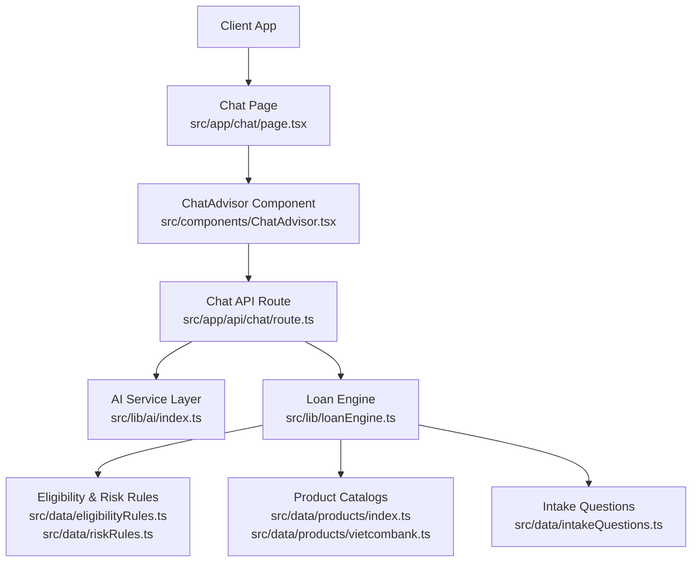
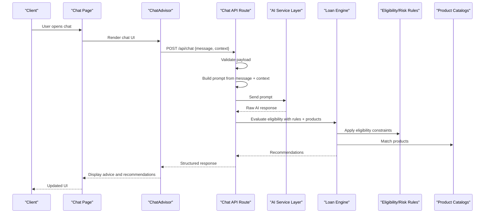
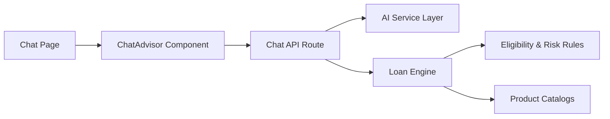

# Chat API Integration

<cite>
**Referenced Files in This Document**
- [route.ts](file://src/app/api/chat/route.ts)
- [page.tsx](file://src/app/chat/page.tsx)
- [ChatAdvisor.tsx](file://src/components/ChatAdvisor.tsx)
- [ai/index.ts](file://src/lib/ai/index.ts)
- [loanEngine.ts](file://src/lib/loanEngine.ts)
- [intakeQuestions.ts](file://src/data/intakeQuestions.ts)
- [eligibilityRules.ts](file://src/data/eligibilityRules.ts)
- [riskRules.ts](file://src/data/riskRules.ts)
- [products/index.ts](file://src/data/products/index.ts)
- [vietcombank.ts](file://src/data/products/vietcombank.ts)
</cite>

## Table of Contents
1. [Introduction](#introduction)
2. [Project Structure](#project-structure)
3. [Core Components](#core-components)
4. [Architecture Overview](#architecture-overview)
5. [Detailed Component Analysis](#detailed-component-analysis)
6. [Dependency Analysis](#dependency-analysis)
7. [Performance Considerations](#performance-considerations)
8. [Troubleshooting Guide](#troubleshooting-guide)
9. [Conclusion](#conclusion)
10. [Appendices](#appendices)

## Introduction
This document provides comprehensive API documentation for the chat endpoint that powers AI-driven financial guidance and loan recommendations. It explains how requests are validated, processed, and returned to clients, including authentication methods, data formats, error handling, rate limiting considerations, and client-side integration examples. The chat route integrates with an AI service layer and a loan engine to construct prompts, evaluate eligibility, and return personalized recommendations based on user inputs and product rules.

## Project Structure
The chat feature is implemented as a Next.js App Router API route under src/app/api/chat/route.ts. The frontend page and component orchestrate user interactions and call the API. Supporting libraries include an AI integration module and a loan engine that applies business rules and product catalogs.

**Diagram sources**
- [route.ts](file://src/app/api/chat/route.ts)
- [page.tsx](file://src/app/chat/page.tsx)
- [ChatAdvisor.tsx](file://src/components/ChatAdvisor.tsx)
- [ai/index.ts](file://src/lib/ai/index.ts)
- [loanEngine.ts](file://src/lib/loanEngine.ts)
- [intakeQuestions.ts](file://src/data/intakeQuestions.ts)
- [eligibilityRules.ts](file://src/data/eligibilityRules.ts)
- [riskRules.ts](file://src/data/riskRules.ts)
- [products/index.ts](file://src/data/products/index.ts)
- [vietcombank.ts](file://src/data/products/vietcombank.ts)

**Section sources**
- [route.ts](file://src/app/api/chat/route.ts)
- [page.tsx](file://src/app/chat/page.tsx)
- [ChatAdvisor.tsx](file://src/components/ChatAdvisor.tsx)
- [ai/index.ts](file://src/lib/ai/index.ts)
- [loanEngine.ts](file://src/lib/loanEngine.ts)
- [intakeQuestions.ts](file://src/data/intakeQuestions.ts)
- [eligibilityRules.ts](file://src/data/eligibilityRules.ts)
- [riskRules.ts](file://src/data/riskRules.ts)
- [products/index.ts](file://src/data/products/index.ts)
- [vietcombank.ts](file://src/data/products/vietcombank.ts)

## Core Components
- Chat API Route: Handles HTTP requests, validates payloads, constructs prompts, invokes AI services, runs loan eligibility checks, and returns structured responses.
- Chat Page and Component: Provide the UI for users to enter queries and display AI-generated advice and recommendations.
- AI Service Layer: Encapsulates calls to external AI models, manages prompt formatting, and parses model outputs.
- Loan Engine: Applies eligibility and risk rules against product catalogs and intake question results to compute recommendations.

Key responsibilities:
- Request validation and sanitization
- Prompt construction tailored to financial queries
- AI response parsing and normalization
- Eligibility evaluation and recommendation generation
- Consistent error handling and status codes
- Rate limiting and security safeguards

**Section sources**
- [route.ts](file://src/app/api/chat/route.ts)
- [page.tsx](file://src/app/chat/page.tsx)
- [ChatAdvisor.tsx](file://src/components/ChatAdvisor.tsx)
- [ai/index.ts](file://src/lib/ai/index.ts)
- [loanEngine.ts](file://src/lib/loanEngine.ts)

## Architecture Overview
The chat flow begins with a client request to the API route. The route validates input, builds a domain-specific prompt using context (user profile, intake answers, product catalog), calls the AI service, processes the AI output, evaluates eligibility via the loan engine, and returns a standardized JSON response.

**Diagram sources**
- [route.ts](file://src/app/api/chat/route.ts)
- [page.tsx](file://src/app/chat/page.tsx)
- [ChatAdvisor.tsx](file://src/components/ChatAdvisor.tsx)
- [ai/index.ts](file://src/lib/ai/index.ts)
- [loanEngine.ts](file://src/lib/loanEngine.ts)
- [eligibilityRules.ts](file://src/data/eligibilityRules.ts)
- [riskRules.ts](file://src/data/riskRules.ts)
- [products/index.ts](file://src/data/products/index.ts)
- [vietcombank.ts](file://src/data/products/vietcombank.ts)

## Detailed Component Analysis

### Chat API Route
Responsibilities:
- Accepts POST requests with a message and optional context (e.g., user profile, prior conversation).
- Validates required fields and enforces schema constraints.
- Constructs a prompt incorporating financial domain knowledge and user context.
- Calls the AI service layer to generate advice or recommendations.
- Parses and normalizes AI output into a consistent structure.
- Runs eligibility checks through the loan engine using rules and product catalogs.
- Returns a standardized JSON response with advice, recommendations, and metadata.
- Handles errors with appropriate HTTP status codes and messages.

Request Schema:
- Endpoint: POST /api/chat
- Body:
  - message: string (required) — user query text
  - context: object (optional) — includes user profile, intake answers, and session state
  - options: object (optional) — controls behavior such as max tokens, temperature, and safety filters

Response Schema:
- Success (200):
  - advice: string — AI-generated guidance
  - recommendations: array — list of recommended products or actions
  - eligibility: object — eligibility status per product or overall
  - metadata: object — includes versioning, timestamps, and processing flags
- Error:
  - code: number — HTTP status code
  - message: string — human-readable error description
  - details: object — additional context for debugging

Authentication:
- If enabled, expect Authorization header with bearer token.
- Validate token signature and scope; reject unauthorized requests.

Rate Limiting:
- Enforce per-user or per-IP limits using environment configuration.
- Return 429 Too Many Requests when exceeded, with retry-after guidance.

Security Considerations:
- Sanitize inputs to prevent injection.
- Mask sensitive fields in logs.
- Enforce HTTPS and CORS policies.

Error Handling:
- Validation errors: 400 Bad Request
- Unauthorized: 401 Unauthorized
- Forbidden: 403 Forbidden
- Not Found: 404 Not Found
- Rate Limited: 429 Too Many Requests
- Internal Server Error: 500 Internal Server Error

**Section sources**
- [route.ts](file://src/app/api/chat/route.ts)

### AI Service Layer
Responsibilities:
- Formats prompts according to financial domain guidelines.
- Sends requests to external AI providers.
- Parses raw model outputs into structured advice and recommendations.
- Implements retries and fallback strategies.

Prompt Construction:
- Combines user message with contextual data (intake answers, product catalog highlights).
- Includes instructions for tone, compliance, and recommendation criteria.

Parsing Logic:
- Extracts key entities (loan type, amount, term, interest rate).
- Normalizes recommendations into a standard format.
- Flags uncertain or incomplete information for follow-up questions.

**Section sources**
- [ai/index.ts](file://src/lib/ai/index.ts)

### Loan Engine
Responsibilities:
- Evaluates eligibility based on rules and product catalogs.
- Matches user profiles to suitable products.
- Computes risk scores and suggests alternatives if needed.

Data Inputs:
- Intake questions results
- Eligibility rules
- Risk rules
- Product catalogs

Outputs:
- Eligibility status per product
- Recommended products ranked by fit
- Risk assessment summary

**Section sources**
- [loanEngine.ts](file://src/lib/loanEngine.ts)
- [intakeQuestions.ts](file://src/data/intakeQuestions.ts)
- [eligibilityRules.ts](file://src/data/eligibilityRules.ts)
- [riskRules.ts](file://src/data/riskRules.ts)
- [products/index.ts](file://src/data/products/index.ts)
- [vietcombank.ts](file://src/data/products/vietcombank.ts)

### Frontend Chat Page and Component
Responsibilities:
- Renders chat interface and manages user interactions.
- Sends messages to the API route and displays responses.
- Handles loading states, errors, and retries.

Integration Points:
- Calls POST /api/chat with message and context.
- Updates UI with advice and recommendations.
- Provides feedback for invalid inputs and network errors.

**Section sources**
- [page.tsx](file://src/app/chat/page.tsx)
- [ChatAdvisor.tsx](file://src/components/ChatAdvisor.tsx)

## Dependency Analysis
The chat route depends on the AI service layer and loan engine. The loan engine relies on rule sets and product catalogs. The frontend components depend on the API route for data.

**Diagram sources**
- [route.ts](file://src/app/api/chat/route.ts)
- [ai/index.ts](file://src/lib/ai/index.ts)
- [loanEngine.ts](file://src/lib/loanEngine.ts)
- [eligibilityRules.ts](file://src/data/eligibilityRules.ts)
- [riskRules.ts](file://src/data/riskRules.ts)
- [products/index.ts](file://src/data/products/index.ts)
- [vietcombank.ts](file://src/data/products/vietcombank.ts)
- [ChatAdvisor.tsx](file://src/components/ChatAdvisor.tsx)
- [page.tsx](file://src/app/chat/page.tsx)

**Section sources**
- [route.ts](file://src/app/api/chat/route.ts)
- [ai/index.ts](file://src/lib/ai/index.ts)
- [loanEngine.ts](file://src/lib/loanEngine.ts)
- [eligibilityRules.ts](file://src/data/eligibilityRules.ts)
- [riskRules.ts](file://src/data/riskRules.ts)
- [products/index.ts](file://src/data/products/index.ts)
- [vietcombank.ts](file://src/data/products/vietcombank.ts)
- [ChatAdvisor.tsx](file://src/components/ChatAdvisor.tsx)
- [page.tsx](file://src/app/chat/page.tsx)

## Performance Considerations
- Minimize payload size by sending only necessary context.
- Cache frequently used product catalogs and rules where appropriate.
- Implement streaming responses for long AI generations if supported.
- Use efficient prompt construction to reduce token usage.
- Monitor latency and throughput metrics for AI calls and rule evaluations.

[No sources needed since this section provides general guidance]

## Troubleshooting Guide
Common issues:
- Invalid request payload: Ensure required fields are present and correctly typed.
- Authentication failures: Verify token validity and scopes.
- Rate limit exceeded: Back off and retry after the specified interval.
- AI service errors: Check provider status and implement retries.
- Eligibility mismatches: Review intake answers and rule definitions.

Debugging tips:
- Inspect request/response logs for anomalies.
- Validate prompt content before sending to AI.
- Test rule sets with sample profiles.
- Use sandbox environments for AI provider testing.

**Section sources**
- [route.ts](file://src/app/api/chat/route.ts)
- [ai/index.ts](file://src/lib/ai/index.ts)
- [loanEngine.ts](file://src/lib/loanEngine.ts)

## Conclusion
The chat API provides a robust foundation for AI-driven financial guidance and loan recommendations. By combining structured validation, secure authentication, intelligent prompt construction, and rule-based eligibility checks, it delivers personalized and compliant advice. Clients should adhere to the documented schemas, handle errors gracefully, and respect rate limits for optimal performance.

[No sources needed since this section summarizes without analyzing specific files]

## Appendices

### Example Query Types and Expected Responses
- General Financial Advice:
  - Input: message describing a financial goal
  - Output: advice text and high-level recommendations
- Loan Eligibility Check:
  - Input: message plus user profile and intake answers
  - Output: eligibility status per product and tailored recommendations
- Product Comparison:
  - Input: message specifying two or more products
  - Output: comparative analysis and suitability score

[No sources needed since this section provides conceptual examples]

### Client-Side Implementation Examples
- Fetch-based example:
  - Construct a POST request to /api/chat with message and context
  - Handle success and error responses
  - Update UI with advice and recommendations
- Axios-based example:
  - Configure headers for authentication
  - Send request and parse JSON response
  - Manage loading and error states

[No sources needed since this section provides conceptual examples]