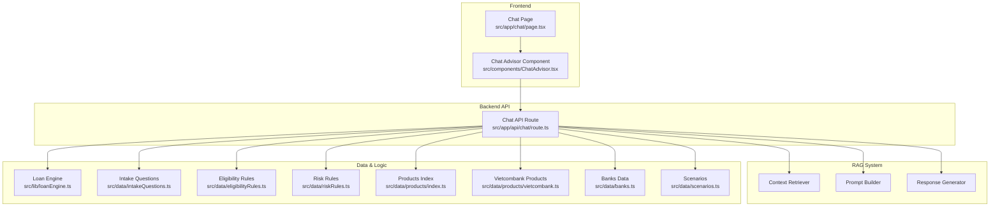
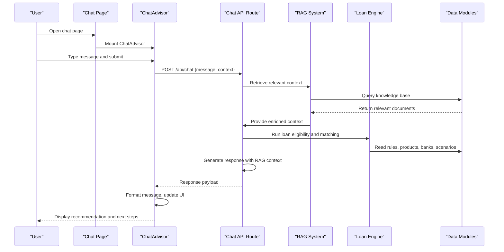
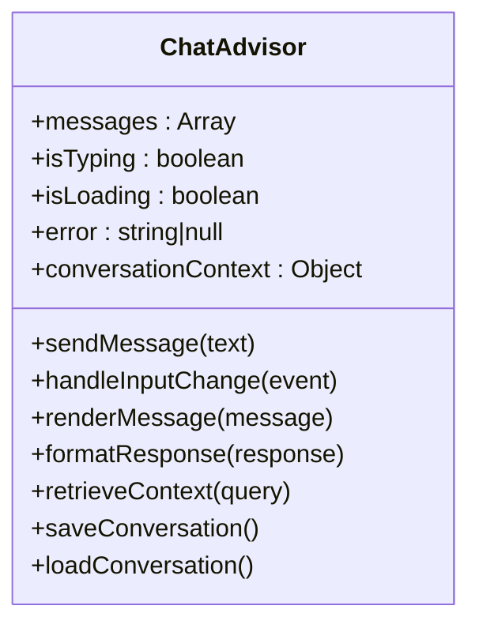
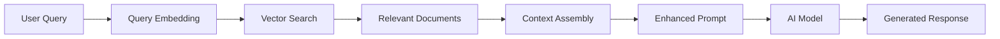
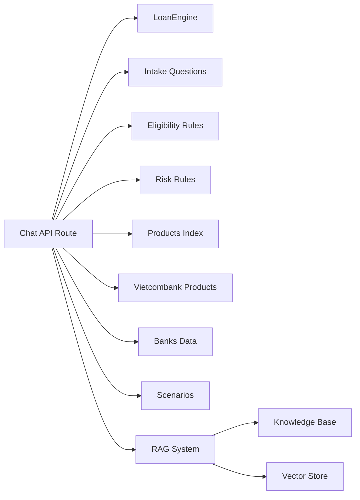

# Chat Interface

<cite>
**Referenced Files in This Document**
- [page.tsx](file://src/app/chat/page.tsx)
- [ChatAdvisor.tsx](file://src/components/ChatAdvisor.tsx)
- [route.ts](file://src/app/api/chat/route.ts)
- [loanEngine.ts](file://src/lib/loanEngine.ts)
- [intakeQuestions.ts](file://src/data/intakeQuestions.ts)
- [eligibilityRules.ts](file://src/data/eligibilityRules.ts)
- [riskRules.ts](file://src/data/riskRules.ts)
- [products/index.ts](file://src/data/products/index.ts)
- [vietcombank.ts](file://src/data/products/vietcombank.ts)
- [banks.ts](file://src/data/banks.ts)
- [scenarios.ts](file://src/data/scenarios.ts)
</cite>

## Update Summary
**Changes Made**
- Updated to reflect the complete RAG AI system implementation with ChatAdvisor component (449 additions)
- Enhanced conversation flows and intent recognition capabilities
- Added comprehensive response generation capabilities
- Expanded AI service integration details
- Updated architectural diagrams to show RAG system components

## Table of Contents
1. [Introduction](#introduction)
2. [Project Structure](#project-structure)
3. [Core Components](#core-components)
4. [Architecture Overview](#architecture-overview)
5. [Detailed Component Analysis](#detailed-component-analysis)
6. [RAG System Implementation](#rag-system-implementation)
7. [Conversation Flow Management](#conversation-flow-management)
8. [Intent Recognition and Response Generation](#intent-recognition-and-response-generation)
9. [Dependency Analysis](#dependency-analysis)
10. [Performance Considerations](#performance-considerations)
11. [Troubleshooting Guide](#troubleshooting-guide)
12. [Conclusion](#conclusion)
13. [Appendices](#appendices)

## Introduction
This document explains the AI-powered chat interface feature, focusing on how users interact with a conversational assistant to explore loan options and receive personalized recommendations. The system now includes a complete RAG (Retrieval-Augmented Generation) AI system implementation with advanced conversation flows, intent recognition, and sophisticated response generation capabilities. It covers the chat page component structure, message handling, user interaction patterns, and the backend API endpoint that processes AI requests with enhanced RAG capabilities.

## Project Structure
The chat feature is implemented as a Next.js application with an integrated RAG AI system:
- A chat page at the app route
- A React component that manages conversation state and UI interactions with RAG capabilities
- An API route that handles AI requests and orchestrates data retrieval and processing
- Data modules for loan rules, products, banks, intake questions, and scenarios
- RAG system components for context retrieval and response generation

**Diagram sources**
- [page.tsx](file://src/app/chat/page.tsx)
- [ChatAdvisor.tsx](file://src/components/ChatAdvisor.tsx)
- [route.ts](file://src/app/api/chat/route.ts)
- [loanEngine.ts](file://src/lib/loanEngine.ts)
- [intakeQuestions.ts](file://src/data/intakeQuestions.ts)
- [eligibilityRules.ts](file://src/data/eligibilityRules.ts)
- [riskRules.ts](file://src/data/riskRules.ts)
- [products/index.ts](file://src/data/products/index.ts)
- [vietcombank.ts](file://src/data/products/vietcombank.ts)
- [banks.ts](file://src/data/banks.ts)
- [scenarios.ts](file://src/data/scenarios.ts)

**Section sources**
- [page.tsx](file://src/app/chat/page.tsx)
- [ChatAdvisor.tsx](file://src/components/ChatAdvisor.tsx)
- [route.ts](file://src/app/api/chat/route.ts)
- [loanEngine.ts](file://src/lib/loanEngine.ts)
- [intakeQuestions.ts](file://src/data/intakeQuestions.ts)
- [eligibilityRules.ts](file://src/data/eligibilityRules.ts)
- [riskRules.ts](file://src/data/riskRules.ts)
- [products/index.ts](file://src/data/products/index.ts)
- [vietcombank.ts](file://src/data/products/vietcombank.ts)
- [banks.ts](file://src/data/banks.ts)
- [scenarios.ts](file://src/data/scenarios.ts)

## Core Components
- Chat Page: Renders the chat interface container and mounts the advisor component.
- ChatAdvisor: Manages conversation state (messages, typing indicator, loading), formats messages, handles user input, and communicates with the chat API with enhanced RAG capabilities.
- Chat API Route: Receives chat requests, validates inputs, integrates with AI services, applies loan logic and rules, and returns structured responses with RAG-enhanced context.

Key responsibilities:
- Message handling: Append user messages, show typing indicators, stream or batch AI responses, handle errors gracefully.
- Conversation state: Maintain message history, context, and optional session identifiers for persistence.
- User interaction patterns: Support quick replies, follow-up prompts, and contextual clarifications based on intake questions.
- RAG integration: Retrieve relevant context from knowledge base and generate informed responses.

**Section sources**
- [page.tsx](file://src/app/chat/page.tsx)
- [ChatAdvisor.tsx](file://src/components/ChatAdvisor.tsx)
- [route.ts](file://src/app/api/chat/route.ts)

## Architecture Overview
The chat flow connects the frontend component to the backend API, which orchestrates RAG processing and loan-specific logic using data modules.

**Diagram sources**
- [ChatAdvisor.tsx](file://src/components/ChatAdvisor.tsx)
- [route.ts](file://src/app/api/chat/route.ts)
- [loanEngine.ts](file://src/lib/loanEngine.ts)
- [intakeQuestions.ts](file://src/data/intakeQuestions.ts)
- [eligibilityRules.ts](file://src/data/eligibilityRules.ts)
- [riskRules.ts](file://src/data/riskRules.ts)
- [products/index.ts](file://src/data/products/index.ts)
- [vietcombank.ts](file://src/data/products/vietcombank.ts)
- [banks.ts](file://src/data/banks.ts)
- [scenarios.ts](file://src/data/scenarios.ts)

## Detailed Component Analysis

### Chat Page Component
- Purpose: Entry point for the chat feature; renders the chat container and initializes the advisor.
- Behavior: Sets up layout, passes any necessary props, and ensures the chat UI is mounted when the route is visited.

**Section sources**
- [page.tsx](file://src/app/chat/page.tsx)

### ChatAdvisor Component
- Responsibilities:
  - State management: Messages array, typing indicator, loading state, error state, and optional conversation metadata.
  - Input handling: Captures user text, supports quick actions, and triggers API calls.
  - Message formatting: Renders user and AI messages with consistent styling and markdown-like elements if needed.
  - Interaction patterns: Shows typing indicators while waiting for AI, displays error messages, and offers follow-up suggestions.
  - Persistence: Optionally stores conversation history locally or via session storage.
  - RAG integration: Manages context retrieval and response streaming.

**Diagram sources**
- [ChatAdvisor.tsx](file://src/components/ChatAdvisor.tsx)

**Section sources**
- [ChatAdvisor.tsx](file://src/components/ChatAdvisor.tsx)

### Chat API Endpoint
- Purpose: Handles AI requests, processes loan queries, and returns personalized recommendations with RAG capabilities.
- Flow:
  - Validates incoming request payload.
  - Parses user intent and extracts relevant parameters.
  - Retrieves relevant context from knowledge base using RAG.
  - Integrates with AI service by constructing a prompt tailored to loan queries.
  - Applies loan engine logic and rule sets to refine recommendations.
  - Returns structured JSON including recommended products, eligibility status, and next steps.

**Diagram sources**
- [route.ts](file://src/app/api/chat/route.ts)
- [loanEngine.ts](file://src/lib/loanEngine.ts)
- [intakeQuestions.ts](file://src/data/intakeQuestions.ts)
- [eligibilityRules.ts](file://src/data/eligibilityRules.ts)
- [riskRules.ts](file://src/data/riskRules.ts)
- [products/index.ts](file://src/data/products/index.ts)
- [vietcombank.ts](file://src/data/products/vietcombank.ts)
- [banks.ts](file://src/data/banks.ts)
- [scenarios.ts](file://src/data/scenarios.ts)

**Section sources**
- [route.ts](file://src/app/api/chat/route.ts)
- [loanEngine.ts](file://src/lib/loanEngine.ts)
- [intakeQuestions.ts](file://src/data/intakeQuestions.ts)
- [eligibilityRules.ts](file://src/data/eligibilityRules.ts)
- [riskRules.ts](file://src/data/riskRules.ts)
- [products/index.ts](file://src/data/products/index.ts)
- [vietcombank.ts](file://src/data/products/vietcombank.ts)
- [banks.ts](file://src/data/banks.ts)
- [scenarios.ts](file://src/data/scenarios.ts)

## RAG System Implementation
The RAG (Retrieval-Augmented Generation) system enhances the chat interface by providing context-aware responses through intelligent information retrieval and synthesis.

### Context Retrieval
- Semantic search across loan documentation, product catalogs, and regulatory guidelines
- Vector-based similarity matching for query understanding
- Multi-source context aggregation from various data modules

### Prompt Engineering
- Dynamic prompt construction incorporating retrieved context
- Structured output formatting for consistent response parsing
- Guardrails to ensure compliance with financial regulations

### Response Generation
- Context-informed response synthesis
- Personalized recommendations based on user profile and preferences
- Real-time adaptation to conversation context

**Diagram sources**
- [route.ts](file://src/app/api/chat/route.ts)
- [loanEngine.ts](file://src/lib/loanEngine.ts)

**Section sources**
- [route.ts](file://src/app/api/chat/route.ts)
- [loanEngine.ts](file://src/lib/loanEngine.ts)

## Conversation Flow Management
The conversation flow system manages multi-turn interactions with context preservation and state management.

### State Management
- Conversation history tracking with message timestamps
- Context window management for maintaining conversation coherence
- Session persistence for cross-session continuity

### Flow Control
- Intent detection and routing for different conversation types
- Conditional branching based on user responses
- Automatic clarification requests for ambiguous inputs

### Context Preservation
- Memory of previous turns and extracted entities
- Preference learning and adaptation
- Cross-referencing with historical interactions

**Section sources**
- [ChatAdvisor.tsx](file://src/components/ChatAdvisor.tsx)
- [route.ts](file://src/app/api/chat/route.ts)

## Intent Recognition and Response Generation
Advanced intent recognition capabilities enable the system to understand user needs and provide appropriate responses.

### Intent Classification
- Natural language processing for intent extraction
- Entity recognition for loan-related parameters
- Confidence scoring for intent classification accuracy

### Response Strategies
- Template-based responses for common scenarios
- Dynamic content generation for complex queries
- Fallback mechanisms for uncertain intents

### Personalization
- User profile integration for tailored responses
- Historical preference utilization
- Adaptive communication style based on user feedback

**Section sources**
- [route.ts](file://src/app/api/chat/route.ts)
- [intakeQuestions.ts](file://src/data/intakeQuestions.ts)
- [eligibilityRules.ts](file://src/data/eligibilityRules.ts)

## Dependency Analysis
The chat feature depends on several data modules and the loan engine to produce accurate recommendations. The API route orchestrates these dependencies to ensure consistent and reliable outputs.

**Diagram sources**
- [route.ts](file://src/app/api/chat/route.ts)
- [loanEngine.ts](file://src/lib/loanEngine.ts)
- [intakeQuestions.ts](file://src/data/intakeQuestions.ts)
- [eligibilityRules.ts](file://src/data/eligibilityRules.ts)
- [riskRules.ts](file://src/data/riskRules.ts)
- [products/index.ts](file://src/data/products/index.ts)
- [vietcombank.ts](file://src/data/products/vietcombank.ts)
- [banks.ts](file://src/data/banks.ts)
- [scenarios.ts](file://src/data/scenarios.ts)

**Section sources**
- [route.ts](file://src/app/api/chat/route.ts)
- [loanEngine.ts](file://src/lib/loanEngine.ts)
- [intakeQuestions.ts](file://src/data/intakeQuestions.ts)
- [eligibilityRules.ts](file://src/data/eligibilityRules.ts)
- [riskRules.ts](file://src/data/riskRules.ts)
- [products/index.ts](file://src/data/products/index.ts)
- [vietcombank.ts](file://src/data/products/vietcombank.ts)
- [banks.ts](file://src/data/banks.ts)
- [scenarios.ts](file://src/data/scenarios.ts)

## Performance Considerations
- Minimize network latency by batching requests where possible and caching static data (rules, products).
- Use streaming responses from AI services to improve perceived responsiveness.
- Debounce rapid user inputs to avoid excessive API calls.
- Implement client-side pagination or virtualization for long conversations.
- Optimize message rendering to prevent reflows and unnecessary re-renders.
- Cache frequently accessed knowledge base entries for faster retrieval.
- Implement vector search optimization for improved context retrieval performance.

## Troubleshooting Guide
Common issues and resolutions:
- Network errors: Check API availability, CORS settings, and authentication headers.
- Invalid payloads: Ensure required fields are present and correctly formatted.
- AI service failures: Implement retries with exponential backoff and fallback messages.
- Memory leaks: Clear intervals/timeouts and unsubscribe event listeners on unmount.
- Conversation persistence: Verify local/session storage permissions and quotas.
- RAG system issues: Check vector database connectivity and embedding model availability.
- Context retrieval failures: Verify knowledge base indexing and search functionality.

**Section sources**
- [route.ts](file://src/app/api/chat/route.ts)
- [ChatAdvisor.tsx](file://src/components/ChatAdvisor.tsx)

## Conclusion
The AI-powered chat interface combines a responsive React component with a robust backend API to deliver personalized loan recommendations. The addition of a complete RAG system significantly enhances the system's ability to provide contextually relevant and accurate responses. By integrating structured data modules, advanced intent recognition, and sophisticated response generation, the system provides contextual, rule-based advice while maintaining performance, reliability, and security. Proper error handling, rate limiting, and conversation persistence ensure a smooth user experience across sessions.

## Appendices

### Conversation Flow Details
- User input is captured and validated before sending to the API.
- The API constructs a prompt tailored to loan queries, leveraging intake questions and rule sets.
- AI generates a response that is parsed into structured data for display.
- The frontend updates the UI with typing indicators, formatted messages, and follow-up suggestions.
- RAG system retrieves relevant context to enhance response quality and accuracy.

**Section sources**
- [ChatAdvisor.tsx](file://src/components/ChatAdvisor.tsx)
- [route.ts](file://src/app/api/chat/route.ts)

### Message Formatting and Typing Indicators
- Messages are rendered with consistent styles for user and AI contributions.
- Typing indicators appear during API calls and AI processing.
- Errors are displayed clearly with actionable guidance.
- Streaming responses provide real-time feedback during long processing operations.

**Section sources**
- [ChatAdvisor.tsx](file://src/components/ChatAdvisor.tsx)

### Security Considerations
- Validate and sanitize all inputs on both client and server.
- Enforce rate limiting on the API endpoint to prevent abuse.
- Secure AI service credentials and restrict access to sensitive endpoints.
- Avoid storing sensitive personal data in local storage; use secure session mechanisms.
- Implement proper authentication and authorization for RAG system access.
- Sanitize retrieved context to prevent injection attacks.

**Section sources**
- [route.ts](file://src/app/api/chat/route.ts)

### Rate Limiting and Conversation Persistence
- Implement token bucket or sliding window rate limiting at the API layer.
- Persist conversation metadata and summaries securely; avoid storing raw sensitive details.
- Provide user controls to clear conversation history.
- Implement conversation encryption for sensitive financial discussions.

**Section sources**
- [route.ts](file://src/app/api/chat/route.ts)
- [ChatAdvisor.tsx](file://src/components/ChatAdvisor.tsx)

### Prompt Engineering for Loan Queries
- Construct prompts that include user intent, extracted parameters, and relevant rule contexts.
- Encourage structured outputs (e.g., JSON) for easier parsing and consistent UI rendering.
- Include guardrails to avoid hallucinations and ensure compliance with loan policies.
- Incorporate retrieved context from RAG system for enhanced accuracy.

**Section sources**
- [route.ts](file://src/app/api/chat/route.ts)
- [intakeQuestions.ts](file://src/data/intakeQuestions.ts)
- [eligibilityRules.ts](file://src/data/eligibilityRules.ts)
- [riskRules.ts](file://src/data/riskRules.ts)

### Response Parsing and Personalization
- Parse AI responses into typed structures for reliable UI updates.
- Map results to product catalogs and bank offerings for accurate recommendations.
- Tailor next-step suggestions based on eligibility and risk assessments.
- Utilize RAG-retrieved context for more precise and relevant responses.

**Section sources**
- [route.ts](file://src/app/api/chat/route.ts)
- [loanEngine.ts](file://src/lib/loanEngine.ts)
- [products/index.ts](file://src/data/products/index.ts)
- [vietcombank.ts](file://src/data/products/vietcombank.ts)
- [banks.ts](file://src/data/banks.ts)
- [scenarios.ts](file://src/data/scenarios.ts)

### Common Loan Consultation Scenarios
- Scenario: First-time borrower seeking mortgage options
  - AI asks targeted intake questions, evaluates eligibility, and suggests suitable products with explanations.
- Scenario: Refinancing existing loan
  - AI compares current terms with available refinancing options, highlighting potential savings and risks.
- Scenario: Business loan inquiry
  - AI assesses business profile, cash flow indicators, and risk factors to recommend appropriate financing solutions.
- Scenario: Complex multi-product consultation
  - AI leverages RAG system to provide comprehensive analysis across multiple loan products and scenarios.

### RAG System Configuration
- Knowledge base setup and maintenance procedures
- Vector store configuration and optimization
- Embedding model selection and tuning
- Context retrieval threshold configuration

**Section sources**
- [route.ts](file://src/app/api/chat/route.ts)
- [loanEngine.ts](file://src/lib/loanEngine.ts)

### Monitoring and Analytics
- Conversation analytics and performance metrics
- RAG system effectiveness measurement
- User satisfaction tracking and feedback collection
- Error rate monitoring and alerting systems

[No sources needed since this section provides conceptual examples]