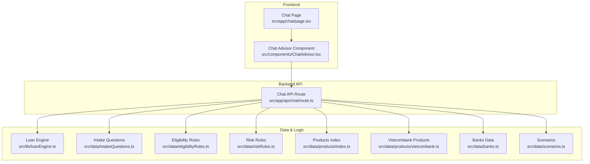
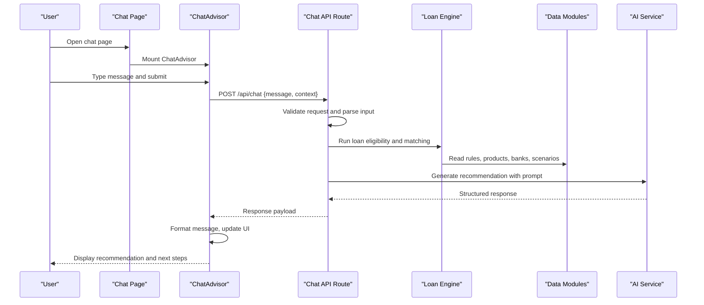
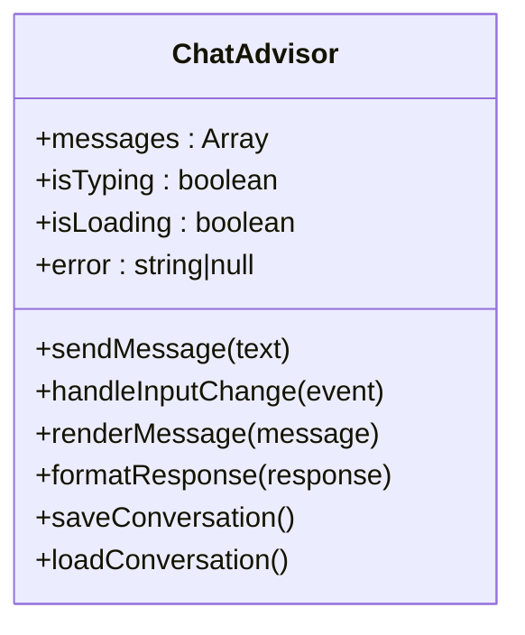
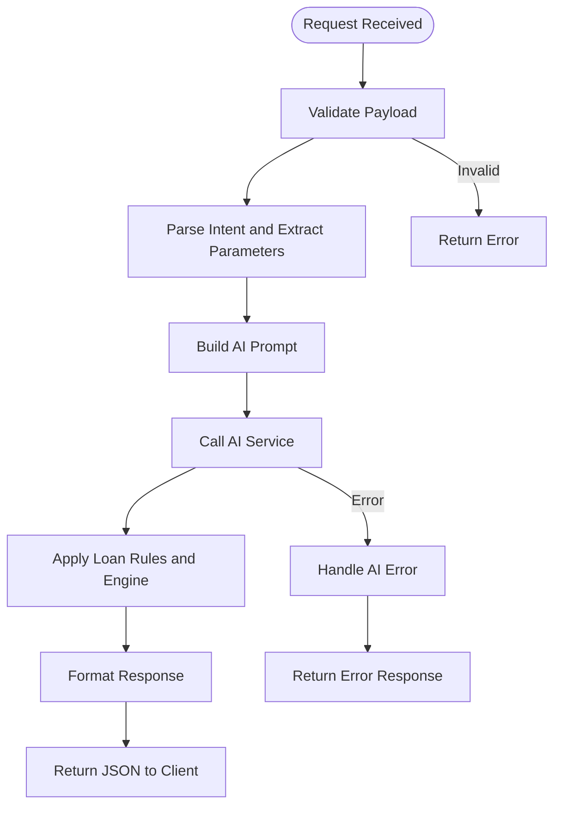
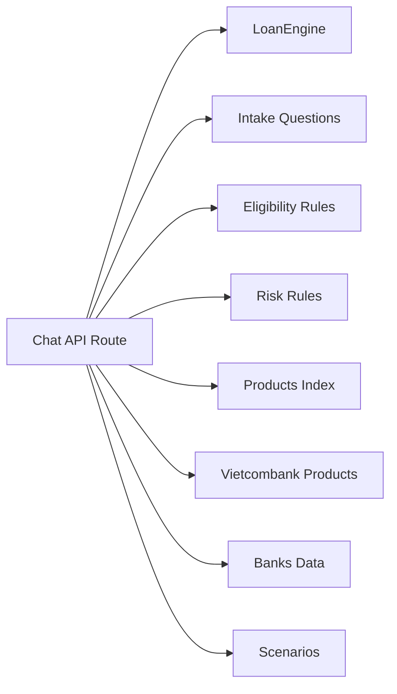

# Chat Interface

<cite>
**Referenced Files in This Document**
- [page.tsx](file://src/app/chat/page.tsx)
- [ChatAdvisor.tsx](file://src/components/ChatAdvisor.tsx)
- [route.ts](file://src/app/api/chat/route.ts)
- [loanEngine.ts](file://src/lib/loanEngine.ts)
- [intakeQuestions.ts](file://src/data/intakeQuestions.ts)
- [eligibilityRules.ts](file://src/data/eligibilityRules.ts)
- [riskRules.ts](file://src/data/riskRules.ts)
- [products/index.ts](file://src/data/products/index.ts)
- [vietcombank.ts](file://src/data/products/vietcombank.ts)
- [banks.ts](file://src/data/banks.ts)
- [scenarios.ts](file://src/data/scenarios.ts)
</cite>

## Table of Contents
1. [Introduction](#introduction)
2. [Project Structure](#project-structure)
3. [Core Components](#core-components)
4. [Architecture Overview](#architecture-overview)
5. [Detailed Component Analysis](#detailed-component-analysis)
6. [Dependency Analysis](#dependency-analysis)
7. [Performance Considerations](#performance-considerations)
8. [Troubleshooting Guide](#troubleshooting-guide)
9. [Conclusion](#conclusion)
10. [Appendices](#appendices)

## Introduction
This document explains the AI-powered chat interface feature, focusing on how users interact with a conversational assistant to explore loan options and receive personalized recommendations. It covers the chat page component structure, message handling, user interaction patterns, and the backend API endpoint that processes AI requests. It also documents conversation state management, message formatting, typing indicators, error handling, loading states, integration with AI services, prompt engineering for loan-related queries, response parsing, security considerations, rate limiting, and conversation persistence. Finally, it provides examples of common loan consultation scenarios and expected AI responses.

## Project Structure
The chat feature is implemented as a Next.js application with:
- A chat page at the app route
- A React component that manages conversation state and UI interactions
- An API route that handles AI requests and orchestrates data retrieval and processing
- Data modules for loan rules, products, banks, intake questions, and scenarios

**Diagram sources**
- [page.tsx](file://src/app/chat/page.tsx)
- [ChatAdvisor.tsx](file://src/components/ChatAdvisor.tsx)
- [route.ts](file://src/app/api/chat/route.ts)
- [loanEngine.ts](file://src/lib/loanEngine.ts)
- [intakeQuestions.ts](file://src/data/intakeQuestions.ts)
- [eligibilityRules.ts](file://src/data/eligibilityRules.ts)
- [riskRules.ts](file://src/data/riskRules.ts)
- [products/index.ts](file://src/data/products/index.ts)
- [vietcombank.ts](file://src/data/products/vietcombank.ts)
- [banks.ts](file://src/data/banks.ts)
- [scenarios.ts](file://src/data/scenarios.ts)

**Section sources**
- [page.tsx](file://src/app/chat/page.tsx)
- [ChatAdvisor.tsx](file://src/components/ChatAdvisor.tsx)
- [route.ts](file://src/app/api/chat/route.ts)
- [loanEngine.ts](file://src/lib/loanEngine.ts)
- [intakeQuestions.ts](file://src/data/intakeQuestions.ts)
- [eligibilityRules.ts](file://src/data/eligibilityRules.ts)
- [riskRules.ts](file://src/data/riskRules.ts)
- [products/index.ts](file://src/data/products/index.ts)
- [vietcombank.ts](file://src/data/products/vietcombank.ts)
- [banks.ts](file://src/data/banks.ts)
- [scenarios.ts](file://src/data/scenarios.ts)

## Core Components
- Chat Page: Renders the chat interface container and mounts the advisor component.
- ChatAdvisor: Manages conversation state (messages, typing indicator, loading), formats messages, handles user input, and communicates with the chat API.
- Chat API Route: Receives chat requests, validates inputs, integrates with AI services, applies loan logic and rules, and returns structured responses.

Key responsibilities:
- Message handling: Append user messages, show typing indicators, stream or batch AI responses, handle errors gracefully.
- Conversation state: Maintain message history, context, and optional session identifiers for persistence.
- User interaction patterns: Support quick replies, follow-up prompts, and contextual clarifications based on intake questions.

**Section sources**
- [page.tsx](file://src/app/chat/page.tsx)
- [ChatAdvisor.tsx](file://src/components/ChatAdvisor.tsx)
- [route.ts](file://src/app/api/chat/route.ts)

## Architecture Overview
The chat flow connects the frontend component to the backend API, which orchestrates AI processing and loan-specific logic using data modules.

**Diagram sources**
- [ChatAdvisor.tsx](file://src/components/ChatAdvisor.tsx)
- [route.ts](file://src/app/api/chat/route.ts)
- [loanEngine.ts](file://src/lib/loanEngine.ts)
- [intakeQuestions.ts](file://src/data/intakeQuestions.ts)
- [eligibilityRules.ts](file://src/data/eligibilityRules.ts)
- [riskRules.ts](file://src/data/riskRules.ts)
- [products/index.ts](file://src/data/products/index.ts)
- [vietcombank.ts](file://src/data/products/vietcombank.ts)
- [banks.ts](file://src/data/banks.ts)
- [scenarios.ts](file://src/data/scenarios.ts)

## Detailed Component Analysis

### Chat Page Component
- Purpose: Entry point for the chat feature; renders the chat container and initializes the advisor.
- Behavior: Sets up layout, passes any necessary props, and ensures the chat UI is mounted when the route is visited.

**Section sources**
- [page.tsx](file://src/app/chat/page.tsx)

### ChatAdvisor Component
- Responsibilities:
  - State management: Messages array, typing indicator, loading state, error state, and optional conversation metadata.
  - Input handling: Captures user text, supports quick actions, and triggers API calls.
  - Message formatting: Renders user and AI messages with consistent styling and markdown-like elements if needed.
  - Interaction patterns: Shows typing indicators while waiting for AI, displays error messages, and offers follow-up suggestions.
  - Persistence: Optionally stores conversation history locally or via session storage.

**Diagram sources**
- [ChatAdvisor.tsx](file://src/components/ChatAdvisor.tsx)

**Section sources**
- [ChatAdvisor.tsx](file://src/components/ChatAdvisor.tsx)

### Chat API Endpoint
- Purpose: Handles AI requests, processes loan queries, and returns personalized recommendations.
- Flow:
  - Validates incoming request payload.
  - Parses user intent and extracts relevant parameters.
  - Integrates with AI service by constructing a prompt tailored to loan queries.
  - Applies loan engine logic and rule sets to refine recommendations.
  - Returns structured JSON including recommended products, eligibility status, and next steps.

**Diagram sources**
- [route.ts](file://src/app/api/chat/route.ts)
- [loanEngine.ts](file://src/lib/loanEngine.ts)
- [intakeQuestions.ts](file://src/data/intakeQuestions.ts)
- [eligibilityRules.ts](file://src/data/eligibilityRules.ts)
- [riskRules.ts](file://src/data/riskRules.ts)
- [products/index.ts](file://src/data/products/index.ts)
- [vietcombank.ts](file://src/data/products/vietcombank.ts)
- [banks.ts](file://src/data/banks.ts)
- [scenarios.ts](file://src/data/scenarios.ts)

**Section sources**
- [route.ts](file://src/app/api/chat/route.ts)
- [loanEngine.ts](file://src/lib/loanEngine.ts)
- [intakeQuestions.ts](file://src/data/intakeQuestions.ts)
- [eligibilityRules.ts](file://src/data/eligibilityRules.ts)
- [riskRules.ts](file://src/data/riskRules.ts)
- [products/index.ts](file://src/data/products/index.ts)
- [vietcombank.ts](file://src/data/products/vietcombank.ts)
- [banks.ts](file://src/data/banks.ts)
- [scenarios.ts](file://src/data/scenarios.ts)

## Dependency Analysis
The chat feature depends on several data modules and the loan engine to produce accurate recommendations. The API route orchestrates these dependencies to ensure consistent and reliable outputs.

**Diagram sources**
- [route.ts](file://src/app/api/chat/route.ts)
- [loanEngine.ts](file://src/lib/loanEngine.ts)
- [intakeQuestions.ts](file://src/data/intakeQuestions.ts)
- [eligibilityRules.ts](file://src/data/eligibilityRules.ts)
- [riskRules.ts](file://src/data/riskRules.ts)
- [products/index.ts](file://src/data/products/index.ts)
- [vietcombank.ts](file://src/data/products/vietcombank.ts)
- [banks.ts](file://src/data/banks.ts)
- [scenarios.ts](file://src/data/scenarios.ts)

**Section sources**
- [route.ts](file://src/app/api/chat/route.ts)
- [loanEngine.ts](file://src/lib/loanEngine.ts)
- [intakeQuestions.ts](file://src/data/intakeQuestions.ts)
- [eligibilityRules.ts](file://src/data/eligibilityRules.ts)
- [riskRules.ts](file://src/data/riskRules.ts)
- [products/index.ts](file://src/data/products/index.ts)
- [vietcombank.ts](file://src/data/products/vietcombank.ts)
- [banks.ts](file://src/data/banks.ts)
- [scenarios.ts](file://src/data/scenarios.ts)

## Performance Considerations
- Minimize network latency by batching requests where possible and caching static data (rules, products).
- Use streaming responses from AI services to improve perceived responsiveness.
- Debounce rapid user inputs to avoid excessive API calls.
- Implement client-side pagination or virtualization for long conversations.
- Optimize message rendering to prevent reflows and unnecessary re-renders.

[No sources needed since this section provides general guidance]

## Troubleshooting Guide
Common issues and resolutions:
- Network errors: Check API availability, CORS settings, and authentication headers.
- Invalid payloads: Ensure required fields are present and correctly formatted.
- AI service failures: Implement retries with exponential backoff and fallback messages.
- Memory leaks: Clear intervals/timeouts and unsubscribe event listeners on unmount.
- Conversation persistence: Verify local/session storage permissions and quotas.

**Section sources**
- [route.ts](file://src/app/api/chat/route.ts)
- [ChatAdvisor.tsx](file://src/components/ChatAdvisor.tsx)

## Conclusion
The AI-powered chat interface combines a responsive React component with a robust backend API to deliver personalized loan recommendations. By integrating structured data modules and an AI service, the system provides contextual, rule-based advice while maintaining performance, reliability, and security. Proper error handling, rate limiting, and conversation persistence ensure a smooth user experience across sessions.

[No sources needed since this section summarizes without analyzing specific files]

## Appendices

### Conversation Flow Details
- User input is captured and validated before sending to the API.
- The API constructs a prompt tailored to loan queries, leveraging intake questions and rule sets.
- AI generates a response that is parsed into structured data for display.
- The frontend updates the UI with typing indicators, formatted messages, and follow-up suggestions.

**Section sources**
- [ChatAdvisor.tsx](file://src/components/ChatAdvisor.tsx)
- [route.ts](file://src/app/api/chat/route.ts)

### Message Formatting and Typing Indicators
- Messages are rendered with consistent styles for user and AI contributions.
- Typing indicators appear during API calls and AI processing.
- Errors are displayed clearly with actionable guidance.

**Section sources**
- [ChatAdvisor.tsx](file://src/components/ChatAdvisor.tsx)

### Security Considerations
- Validate and sanitize all inputs on both client and server.
- Enforce rate limiting on the API endpoint to prevent abuse.
- Secure AI service credentials and restrict access to sensitive endpoints.
- Avoid storing sensitive personal data in local storage; use secure session mechanisms.

**Section sources**
- [route.ts](file://src/app/api/chat/route.ts)

### Rate Limiting and Conversation Persistence
- Implement token bucket or sliding window rate limiting at the API layer.
- Persist conversation metadata and summaries securely; avoid storing raw sensitive details.
- Provide user controls to clear conversation history.

**Section sources**
- [route.ts](file://src/app/api/chat/route.ts)
- [ChatAdvisor.tsx](file://src/components/ChatAdvisor.tsx)

### Prompt Engineering for Loan Queries
- Construct prompts that include user intent, extracted parameters, and relevant rule contexts.
- Encourage structured outputs (e.g., JSON) for easier parsing and consistent UI rendering.
- Include guardrails to avoid hallucinations and ensure compliance with loan policies.

**Section sources**
- [route.ts](file://src/app/api/chat/route.ts)
- [intakeQuestions.ts](file://src/data/intakeQuestions.ts)
- [eligibilityRules.ts](file://src/data/eligibilityRules.ts)
- [riskRules.ts](file://src/data/riskRules.ts)

### Response Parsing and Personalization
- Parse AI responses into typed structures for reliable UI updates.
- Map results to product catalogs and bank offerings for accurate recommendations.
- Tailor next-step suggestions based on eligibility and risk assessments.

**Section sources**
- [route.ts](file://src/app/api/chat/route.ts)
- [loanEngine.ts](file://src/lib/loanEngine.ts)
- [products/index.ts](file://src/data/products/index.ts)
- [vietcombank.ts](file://src/data/products/vietcombank.ts)
- [banks.ts](file://src/data/banks.ts)
- [scenarios.ts](file://src/data/scenarios.ts)

### Common Loan Consultation Scenarios
- Scenario: First-time borrower seeking mortgage options
  - AI asks targeted intake questions, evaluates eligibility, and suggests suitable products with explanations.
- Scenario: Refinancing existing loan
  - AI compares current terms with available refinancing options, highlighting potential savings and risks.
- Scenario: Business loan inquiry
  - AI assesses business profile, cash flow indicators, and risk factors to recommend appropriate financing solutions.

[No sources needed since this section provides conceptual examples]