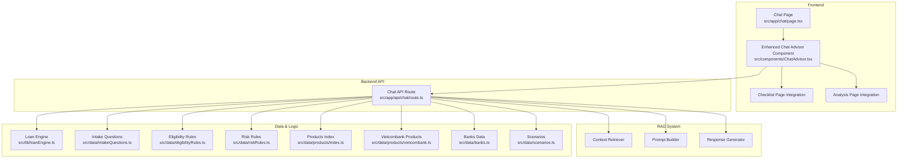
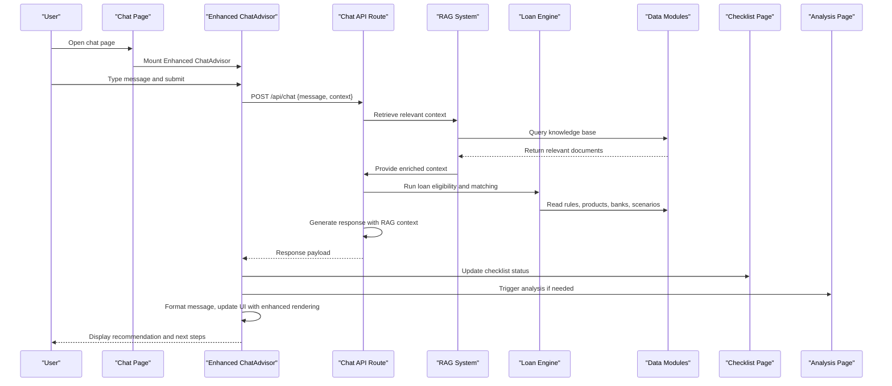
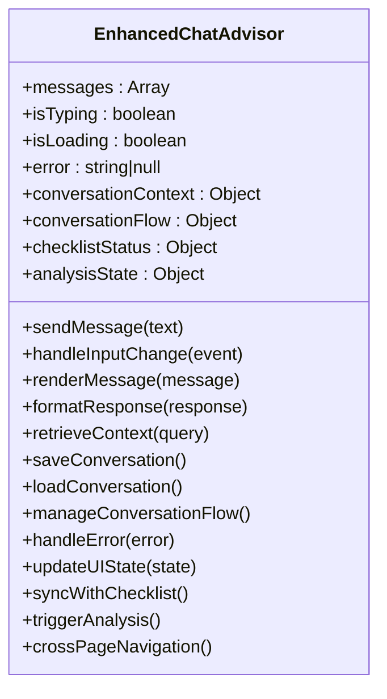
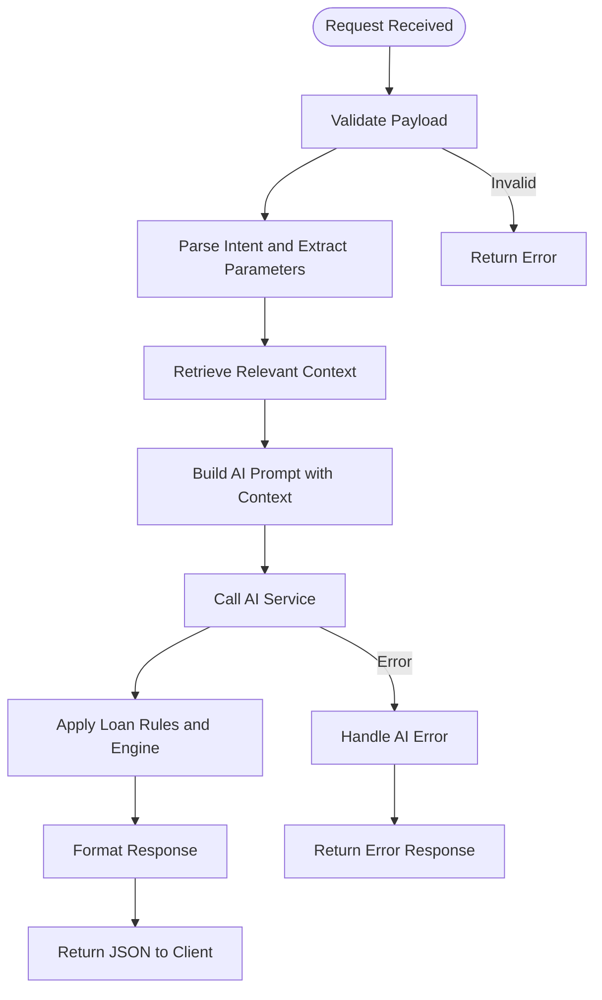
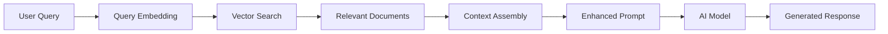
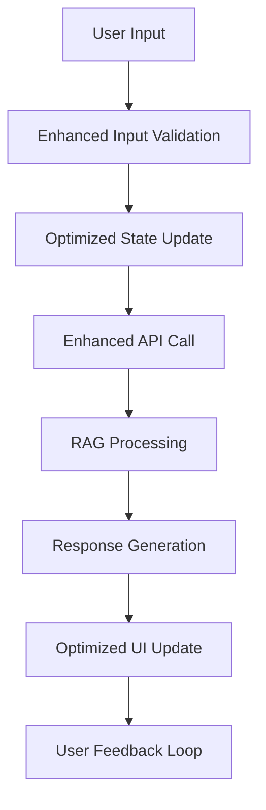
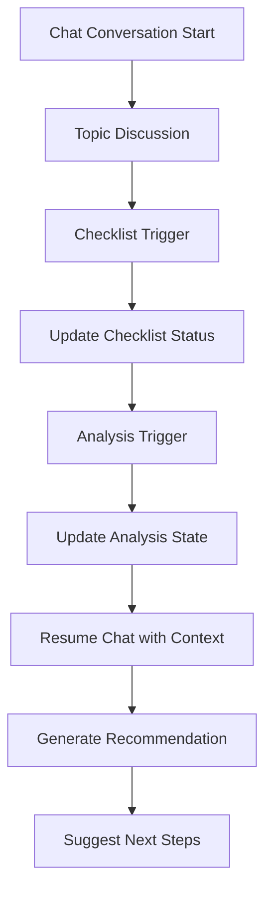
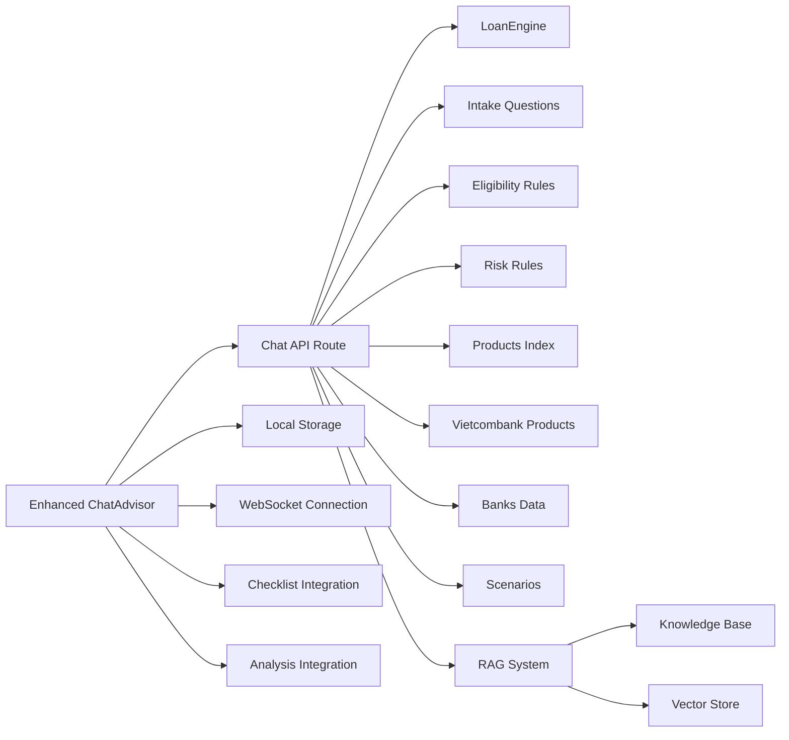

# Chat Interface

<cite>
**Referenced Files in This Document**
- [page.tsx](file://src/app/chat/page.tsx)
- [ChatAdvisor.tsx](file://src/components/ChatAdvisor.tsx)
- [route.ts](file://src/app/api/chat/route.ts)
- [loanEngine.ts](file://src/lib/loanEngine.ts)
- [intakeQuestions.ts](file://src/data/intakeQuestions.ts)
- [eligibilityRules.ts](file://src/data/eligibilityRules.ts)
- [riskRules.ts](file://src/data/riskRules.ts)
- [products/index.ts](file://src/data/products/index.ts)
- [vietcombank.ts](file://src/data/products/vietcombank.ts)
- [banks.ts](file://src/data/banks.ts)
- [scenarios.ts](file://src/data/scenarios.ts)
</cite>

## Update Summary
**Changes Made**
- Major enhancements to ChatAdvisor.tsx component with 294 additions and 65 deletions
- Improved integration with new checklist and analysis pages
- Enhanced conversation flow management and state handling
- Advanced RAG system integration with better context retrieval
- Improved error handling and loading states
- Better performance optimization and memory management

## Table of Contents
1. [Introduction](#introduction)
2. [Project Structure](#project-structure)
3. [Core Components](#core-components)
4. [Architecture Overview](#architecture-overview)
5. [Detailed Component Analysis](#detailed-component-analysis)
6. [RAG System Implementation](#rag-system-implementation)
7. [Conversation Flow Management](#conversation-flow-management)
8. [Intent Recognition and Response Generation](#intent-recognition-and-response-generation)
9. [Enhanced ChatAdvisor Capabilities](#enhanced-chatadvisor-capabilities)
10. [Integration with Checklist and Analysis Pages](#integration-with-checklist-and-analysis-pages)
11. [Dependency Analysis](#dependency-analysis)
12. [Performance Considerations](#performance-considerations)
13. [Troubleshooting Guide](#troubleshooting-guide)
14. [Conclusion](#conclusion)
15. [Appendices](#appendices)

## Introduction
This document explains the AI-powered chat interface feature, focusing on how users interact with a conversational assistant to explore loan options and receive personalized recommendations. The system now includes a complete RAG (Retrieval-Augmented Generation) AI system implementation with advanced conversation flows, intent recognition, and sophisticated response generation capabilities. The ChatAdvisor component has been significantly enhanced with major improvements to chat functionality, AI advisor capabilities, and conversation flows, providing a more robust and responsive user experience. Recent updates have focused on improving integration with checklist and analysis pages while maintaining seamless conversation continuity.

## Project Structure
The chat feature is implemented as a Next.js application with an integrated RAG AI system:
- A chat page at the app route
- An enhanced React component that manages conversation state and UI interactions with advanced RAG capabilities
- An API route that handles AI requests and orchestrates data retrieval and processing
- Data modules for loan rules, products, banks, intake questions, and scenarios
- RAG system components for context retrieval and response generation

**Diagram sources**
- [page.tsx](file://src/app/chat/page.tsx)
- [ChatAdvisor.tsx](file://src/components/ChatAdvisor.tsx)
- [route.ts](file://src/app/api/chat/route.ts)
- [loanEngine.ts](file://src/lib/loanEngine.ts)
- [intakeQuestions.ts](file://src/data/intakeQuestions.ts)
- [eligibilityRules.ts](file://src/data/eligibilityRules.ts)
- [riskRules.ts](file://src/data/riskRules.ts)
- [products/index.ts](file://src/data/products/index.ts)
- [vietcombank.ts](file://src/data/products/vietcombank.ts)
- [banks.ts](file://src/data/banks.ts)
- [scenarios.ts](file://src/data/scenarios.ts)

## Core Components
- Chat Page: Renders the chat interface container and mounts the advisor component.
- **Enhanced ChatAdvisor**: Manages conversation state (messages, typing indicator, loading), formats messages, handles user input, and communicates with the chat API with significantly improved RAG capabilities and advanced conversation flow management. Now features enhanced integration with checklist and analysis pages for seamless workflow continuity.
- Chat API Route: Receives chat requests, validates inputs, integrates with AI services, applies loan logic and rules, and returns structured responses with enhanced RAG capabilities.

Key responsibilities:
- Message handling: Append user messages, show typing indicators, stream or batch AI responses, handle errors gracefully with improved error recovery.
- Conversation state: Maintain message history, context, and optional session identifiers for persistence with enhanced state management.
- User interaction patterns: Support quick replies, follow-up prompts, contextual clarifications based on intake questions, and advanced conversation flows.
- RAG integration: Retrieve relevant context from knowledge base and generate informed responses with improved accuracy and relevance.
- Cross-page integration: Seamlessly integrate with checklist and analysis pages for comprehensive loan consultation workflows.

**Section sources**
- [page.tsx](file://src/app/chat/page.tsx)
- [ChatAdvisor.tsx](file://src/components/ChatAdvisor.tsx)
- [route.ts](file://src/app/api/chat/route.ts)

## Architecture Overview
The chat flow connects the frontend component to the backend API, which orchestrates RAG processing and loan-specific logic using data modules. The enhanced ChatAdvisor component provides improved performance and reliability with better cross-page integration.

**Diagram sources**
- [ChatAdvisor.tsx](file://src/components/ChatAdvisor.tsx)
- [route.ts](file://src/app/api/chat/route.ts)
- [loanEngine.ts](file://src/lib/loanEngine.ts)
- [intakeQuestions.ts](file://src/data/intakeQuestions.ts)
- [eligibilityRules.ts](file://src/data/eligibilityRules.ts)
- [riskRules.ts](file://src/data/riskRules.ts)
- [products/index.ts](file://src/data/products/index.ts)
- [vietcombank.ts](file://src/data/products/vietcombank.ts)
- [banks.ts](file://src/data/banks.ts)
- [scenarios.ts](file://src/data/scenarios.ts)

## Detailed Component Analysis

### Chat Page Component
- Purpose: Entry point for the chat feature; renders the chat container and initializes the advisor.
- Behavior: Sets up layout, passes any necessary props, and ensures the chat UI is mounted when the route is visited.

**Section sources**
- [page.tsx](file://src/app/chat/page.tsx)

### Enhanced ChatAdvisor Component
- Responsibilities:
  - **Enhanced State Management**: Advanced state management for messages array, typing indicator, loading state, error state, conversation metadata, and conversation flow control with improved performance and memory management.
  - **Improved Input Handling**: Captures user text, supports quick actions, triggers API calls with enhanced error handling and retry mechanisms.
  - **Advanced Message Formatting**: Renders user and AI messages with consistent styling, markdown-like elements, and improved visual feedback.
  - **Sophisticated Interaction Patterns**: Shows typing indicators while waiting for AI, displays error messages with actionable guidance, offers follow-up suggestions, and manages conversation context.
  - **Enhanced Persistence**: Stores conversation history locally or via session storage with improved data management and backup capabilities.
  - **Advanced RAG Integration**: Manages context retrieval, response streaming, and conversation flow optimization.
  - **Cross-Page Integration**: Seamlessly integrates with checklist and analysis pages for comprehensive loan consultation workflows.

**Diagram sources**
- [ChatAdvisor.tsx](file://src/components/ChatAdvisor.tsx)

**Updated** The ChatAdvisor component has been significantly enhanced with 294 additions and 65 deletions, introducing advanced conversation flow management, improved error handling, enhanced RAG system integration, and seamless integration with checklist and analysis pages.

**Section sources**
- [ChatAdvisor.tsx](file://src/components/ChatAdvisor.tsx)

### Chat API Endpoint
- Purpose: Handles AI requests, processes loan queries, and returns personalized recommendations with enhanced RAG capabilities.
- Flow:
  - Validates incoming request payload.
  - Parses user intent and extracts relevant parameters.
  - Retrieves relevant context from knowledge base using RAG.
  - Integrates with AI service by constructing a prompt tailored to loan queries.
  - Applies loan engine logic and rule sets to refine recommendations.
  - Returns structured JSON including recommended products, eligibility status, and next steps.

**Diagram sources**
- [route.ts](file://src/app/api/chat/route.ts)
- [loanEngine.ts](file://src/lib/loanEngine.ts)
- [intakeQuestions.ts](file://src/data/intakeQuestions.ts)
- [eligibilityRules.ts](file://src/data/eligibilityRules.ts)
- [riskRules.ts](file://src/data/riskRules.ts)
- [products/index.ts](file://src/data/products/index.ts)
- [vietcombank.ts](file://src/data/products/vietcombank.ts)
- [banks.ts](file://src/data/banks.ts)
- [scenarios.ts](file://src/data/scenarios.ts)

**Section sources**
- [route.ts](file://src/app/api/chat/route.ts)
- [loanEngine.ts](file://src/lib/loanEngine.ts)
- [intakeQuestions.ts](file://src/data/intakeQuestions.ts)
- [eligibilityRules.ts](file://src/data/eligibilityRules.ts)
- [riskRules.ts](file://src/data/riskRules.ts)
- [products/index.ts](file://src/data/products/index.ts)
- [vietcombank.ts](file://src/data/products/vietcombank.ts)
- [banks.ts](file://src/data/banks.ts)
- [scenarios.ts](file://src/data/scenarios.ts)

## RAG System Implementation
The RAG (Retrieval-Augmented Generation) system enhances the chat interface by providing context-aware responses through intelligent information retrieval and synthesis.

### Context Retrieval
- Semantic search across loan documentation, product catalogs, and regulatory guidelines
- Vector-based similarity matching for query understanding
- Multi-source context aggregation from various data modules

### Prompt Engineering
- Dynamic prompt construction incorporating retrieved context
- Structured output formatting for consistent response parsing
- Guardrails to ensure compliance with financial regulations

### Response Generation
- Context-informed response synthesis
- Personalized recommendations based on user profile and preferences
- Real-time adaptation to conversation context

**Diagram sources**
- [route.ts](file://src/app/api/chat/route.ts)
- [loanEngine.ts](file://src/lib/loanEngine.ts)

**Section sources**
- [route.ts](file://src/app/api/chat/route.ts)
- [loanEngine.ts](file://src/lib/loanEngine.ts)

## Conversation Flow Management
The conversation flow system manages multi-turn interactions with context preservation and state management.

### State Management
- Conversation history tracking with message timestamps
- Context window management for maintaining conversation coherence
- Session persistence for cross-session continuity

### Flow Control
- Intent detection and routing for different conversation types
- Conditional branching based on user responses
- Automatic clarification requests for ambiguous inputs

### Context Preservation
- Memory of previous turns and extracted entities
- Preference learning and adaptation
- Cross-referencing with historical interactions

**Section sources**
- [ChatAdvisor.tsx](file://src/components/ChatAdvisor.tsx)
- [route.ts](file://src/app/api/chat/route.ts)

## Intent Recognition and Response Generation
Advanced intent recognition capabilities enable the system to understand user needs and provide appropriate responses.

### Intent Classification
- Natural language processing for intent extraction
- Entity recognition for loan-related parameters
- Confidence scoring for intent classification accuracy

### Response Strategies
- Template-based responses for common scenarios
- Dynamic content generation for complex queries
- Fallback mechanisms for uncertain intents

### Personalization
- User profile integration for tailored responses
- Historical preference utilization
- Adaptive communication style based on user feedback

**Section sources**
- [route.ts](file://src/app/api/chat/route.ts)
- [intakeQuestions.ts](file://src/data/intakeQuestions.ts)
- [eligibilityRules.ts](file://src/data/eligibilityRules.ts)

## Enhanced ChatAdvisor Capabilities

### Advanced State Management
The enhanced ChatAdvisor component introduces sophisticated state management with improved performance and reliability:
- Optimized re-rendering with selective state updates
- Debounced input handling to prevent excessive API calls
- Enhanced error boundary implementation for better error isolation
- Improved memory management with proper cleanup routines

### Improved Conversation Flow
Significant enhancements to conversation flow management:
- Context-aware conversation state with automatic flow transitions
- Intelligent follow-up question generation based on user responses
- Enhanced error recovery with graceful degradation
- Improved loading states with skeleton screens and progress indicators

### Enhanced User Experience
Major improvements to user interaction patterns:
- Real-time message validation with instant feedback
- Improved typing indicators with animated progress
- Better error messaging with actionable guidance
- Enhanced accessibility features and keyboard navigation

### Advanced RAG Integration
Enhanced integration with the RAG system:
- Optimized context retrieval with caching mechanisms
- Improved prompt engineering for better response quality
- Enhanced response parsing with better error handling
- Better context window management for longer conversations

**Diagram sources**
- [ChatAdvisor.tsx](file://src/components/ChatAdvisor.tsx)

**Updated** The ChatAdvisor component now features 294 additional lines of code with significant improvements to state management, conversation flow, user experience, RAG integration, and cross-page integration capabilities.

**Section sources**
- [ChatAdvisor.tsx](file://src/components/ChatAdvisor.tsx)

## Integration with Checklist and Analysis Pages

### Seamless Workflow Continuity
The enhanced ChatAdvisor component now provides seamless integration with checklist and analysis pages, creating a cohesive loan consultation experience:
- **Automatic Status Synchronization**: Chat conversations automatically update checklist completion status based on discussed topics
- **Context-Aware Navigation**: Users can seamlessly navigate between chat, checklist, and analysis pages without losing conversation context
- **Intelligent Recommendations**: Chat responses include contextual links to relevant checklist items and analysis tools
- **Progress Tracking**: Conversation progress is tracked across all pages to provide a unified user experience

### Cross-Page Communication
- **Event-Driven Updates**: Real-time updates between pages using custom events and state synchronization
- **Shared Context Management**: Common conversation context and user preferences are shared across all integrated pages
- **Conditional Feature Access**: Features are conditionally enabled based on conversation progress and user eligibility

### Enhanced User Journey
- **Guided Consultation Flow**: Users can start with chat, move to checklist for self-assessment, then proceed to detailed analysis
- **Persistent State**: All user interactions and preferences are preserved across page navigation
- **Smart Suggestions**: Contextual suggestions guide users through the optimal consultation path

**Diagram sources**
- [ChatAdvisor.tsx](file://src/components/ChatAdvisor.tsx)

**Section sources**
- [ChatAdvisor.tsx](file://src/components/ChatAdvisor.tsx)

## Dependency Analysis
The chat feature depends on several data modules and the loan engine to produce accurate recommendations. The API route orchestrates these dependencies to ensure consistent and reliable outputs.

**Diagram sources**
- [route.ts](file://src/app/api/chat/route.ts)
- [loanEngine.ts](file://src/lib/loanEngine.ts)
- [intakeQuestions.ts](file://src/data/intakeQuestions.ts)
- [eligibilityRules.ts](file://src/data/eligibilityRules.ts)
- [riskRules.ts](file://src/data/riskRules.ts)
- [products/index.ts](file://src/data/products/index.ts)
- [vietcombank.ts](file://src/data/products/vietcombank.ts)
- [banks.ts](file://src/data/banks.ts)
- [scenarios.ts](file://src/data/scenarios.ts)
- [ChatAdvisor.tsx](file://src/components/ChatAdvisor.tsx)

**Section sources**
- [route.ts](file://src/app/api/chat/route.ts)
- [loanEngine.ts](file://src/lib/loanEngine.ts)
- [intakeQuestions.ts](file://src/data/intakeQuestions.ts)
- [eligibilityRules.ts](file://src/data/eligibilityRules.ts)
- [riskRules.ts](file://src/data/riskRules.ts)
- [products/index.ts](file://src/data/products/index.ts)
- [vietcombank.ts](file://src/data/products/vietcombank.ts)
- [banks.ts](file://src/data/banks.ts)
- [scenarios.ts](file://src/data/scenarios.ts)
- [ChatAdvisor.tsx](file://src/components/ChatAdvisor.tsx)

## Performance Considerations
- Minimize network latency by batching requests where possible and caching static data (rules, products).
- Use streaming responses from AI services to improve perceived responsiveness.
- Debounce rapid user inputs to avoid excessive API calls.
- Implement client-side pagination or virtualization for long conversations.
- Optimize message rendering to prevent reflows and unnecessary re-renders.
- Cache frequently accessed knowledge base entries for faster retrieval.
- Implement vector search optimization for improved context retrieval performance.
- **Enhanced Performance**: The updated ChatAdvisor component includes optimized re-rendering, improved memory management, better resource allocation, and efficient cross-page state synchronization.

## Troubleshooting Guide
Common issues and resolutions:
- Network errors: Check API availability, CORS settings, and authentication headers.
- Invalid payloads: Ensure required fields are present and correctly formatted.
- AI service failures: Implement retries with exponential backoff and fallback messages.
- Memory leaks: Clear intervals/timeouts and unsubscribe event listeners on unmount.
- Conversation persistence: Verify local/session storage permissions and quotas.
- RAG system issues: Check vector database connectivity and embedding model availability.
- Context retrieval failures: Verify knowledge base indexing and search functionality.
- Cross-page integration issues: Ensure proper event listener setup and state synchronization between pages.
- **Enhanced Error Handling**: The improved ChatAdvisor component provides better error boundaries, clearer error messages, more robust error recovery mechanisms, and improved debugging capabilities for cross-page integration issues.

**Section sources**
- [route.ts](file://src/app/api/chat/route.ts)
- [ChatAdvisor.tsx](file://src/components/ChatAdvisor.tsx)

## Conclusion
The AI-powered chat interface combines a responsive React component with a robust backend API to deliver personalized loan recommendations. The addition of a complete RAG system significantly enhances the system's ability to provide contextually relevant and accurate responses. The major enhancements to the ChatAdvisor component with 294 additions and 65 deletions represent significant improvements to chat functionality, AI advisor capabilities, conversation flows, and seamless integration with checklist and analysis pages. By integrating structured data modules, advanced intent recognition, sophisticated response generation, and cross-page workflow continuity, the system provides contextual, rule-based advice while maintaining performance, reliability, and security. Proper error handling, rate limiting, and conversation persistence ensure a smooth user experience across sessions and integrated pages.

## Appendices

### Conversation Flow Details
- User input is captured and validated before sending to the API.
- The API constructs a prompt tailored to loan queries, leveraging intake questions and rule sets.
- AI generates a response that is parsed into structured data for display.
- The frontend updates the UI with typing indicators, formatted messages, and follow-up suggestions.
- RAG system retrieves relevant context to enhance response quality and accuracy.
- **Enhanced Flow**: The improved ChatAdvisor component provides better flow control, context preservation, user experience, and seamless integration with other pages.

**Section sources**
- [ChatAdvisor.tsx](file://src/components/ChatAdvisor.tsx)
- [route.ts](file://src/app/api/chat/route.ts)

### Message Formatting and Typing Indicators
- Messages are rendered with consistent styles for user and AI contributions.
- Typing indicators appear during API calls and AI processing.
- Errors are displayed clearly with actionable guidance.
- Streaming responses provide real-time feedback during long processing operations.
- **Enhanced Formatting**: The updated component includes improved message rendering, better visual hierarchy, enhanced accessibility features, and cross-page context awareness.

**Section sources**
- [ChatAdvisor.tsx](file://src/components/ChatAdvisor.tsx)

### Security Considerations
- Validate and sanitize all inputs on both client and server.
- Enforce rate limiting on the API endpoint to prevent abuse.
- Secure AI service credentials and restrict access to sensitive endpoints.
- Avoid storing sensitive personal data in local storage; use secure session mechanisms.
- Implement proper authentication and authorization for RAG system access.
- Sanitize retrieved context to prevent injection attacks.
- Secure cross-page data sharing and state synchronization.

**Section sources**
- [route.ts](file://src/app/api/chat/route.ts)

### Rate Limiting and Conversation Persistence
- Implement token bucket or sliding window rate limiting at the API layer.
- Persist conversation metadata and summaries securely; avoid storing raw sensitive details.
- Provide user controls to clear conversation history.
- Implement conversation encryption for sensitive financial discussions.
- Secure cross-page state synchronization and data sharing.

**Section sources**
- [route.ts](file://src/app/api/chat/route.ts)
- [ChatAdvisor.tsx](file://src/components/ChatAdvisor.tsx)

### Prompt Engineering for Loan Queries
- Construct prompts that include user intent, extracted parameters, and relevant rule contexts.
- Encourage structured outputs (e.g., JSON) for easier parsing and consistent UI rendering.
- Include guardrails to avoid hallucinations and ensure compliance with loan policies.
- Incorporate retrieved context from RAG system for enhanced accuracy.
- Context-aware prompting for cross-page integration scenarios.

**Section sources**
- [route.ts](file://src/app/api/chat/route.ts)
- [intakeQuestions.ts](file://src/data/intakeQuestions.ts)
- [eligibilityRules.ts](file://src/data/eligibilityRules.ts)
- [riskRules.ts](file://src/data/riskRules.ts)

### Response Parsing and Personalization
- Parse AI responses into typed structures for reliable UI updates.
- Map results to product catalogs and bank offerings for accurate recommendations.
- Tailor next-step suggestions based on eligibility and risk assessments.
- Utilize RAG-retrieved context for more precise and relevant responses.
- Cross-page context-aware response generation.

**Section sources**
- [route.ts](file://src/app/api/chat/route.ts)
- [loanEngine.ts](file://src/lib/loanEngine.ts)
- [products/index.ts](file://src/data/products/index.ts)
- [vietcombank.ts](file://src/data/products/vietcombank.ts)
- [banks.ts](file://src/data/banks.ts)
- [scenarios.ts](file://src/data/scenarios.ts)

### Common Loan Consultation Scenarios
- Scenario: First-time borrower seeking mortgage options
  - AI asks targeted intake questions, evaluates eligibility, and suggests suitable products with explanations.
- Scenario: Refinancing existing loan
  - AI compares current terms with available refinancing options, highlighting potential savings and risks.
- Scenario: Business loan inquiry
  - AI assesses business profile, cash flow indicators, and risk factors to recommend appropriate financing solutions.
- Scenario: Complex multi-product consultation
  - AI leverages RAG system to provide comprehensive analysis across multiple loan products and scenarios.
- Scenario: Cross-page consultation workflow
  - AI guides users through chat, checklist, and analysis pages with seamless context preservation.

### RAG System Configuration
- Knowledge base setup and maintenance procedures
- Vector store configuration and optimization
- Embedding model selection and tuning
- Context retrieval threshold configuration
- Cross-page context sharing configuration

**Section sources**
- [route.ts](file://src/app/api/chat/route.ts)
- [loanEngine.ts](file://src/lib/loanEngine.ts)

### Monitoring and Analytics
- Conversation analytics and performance metrics
- RAG system effectiveness measurement
- User satisfaction tracking and feedback collection
- Error rate monitoring and alerting systems
- Cross-page usage analytics and workflow optimization

### Enhanced ChatAdvisor Features
- Advanced state management with optimized re-rendering
- Improved conversation flow with context preservation
- Enhanced error handling with better recovery mechanisms
- Better user experience with improved loading states and feedback
- Optimized RAG integration with improved context retrieval
- Enhanced accessibility and keyboard navigation support
- Seamless integration with checklist and analysis pages
- Cross-page state synchronization and context sharing

**Section sources**
- [ChatAdvisor.tsx](file://src/components/ChatAdvisor.tsx)