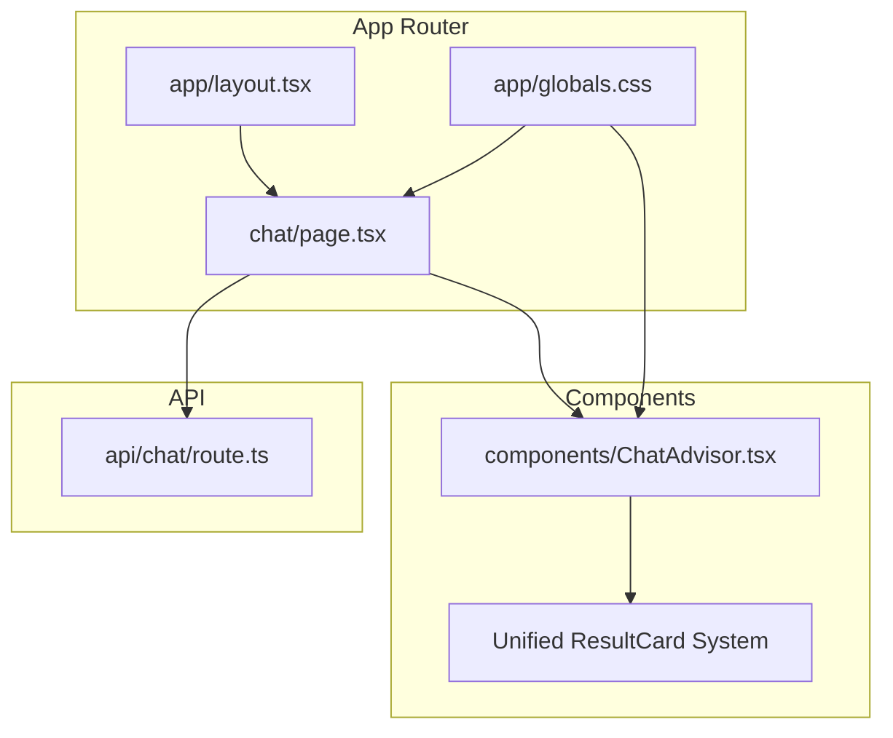
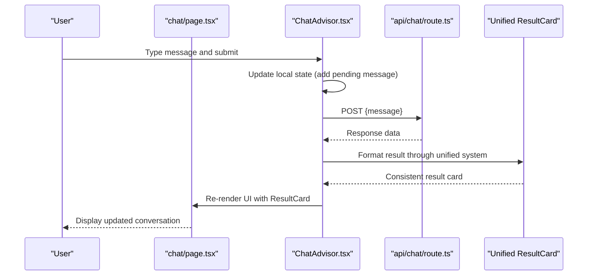
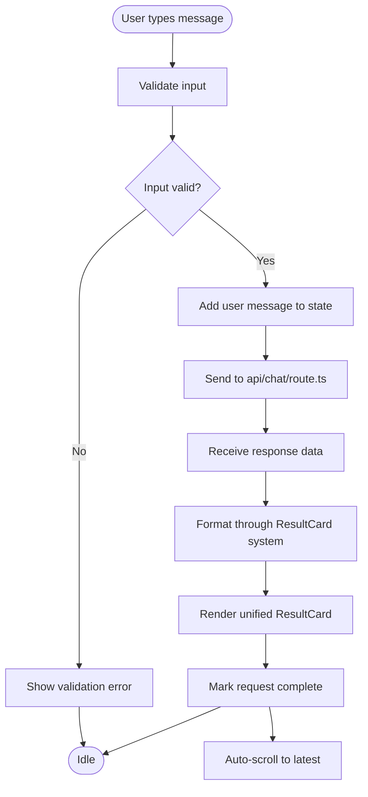
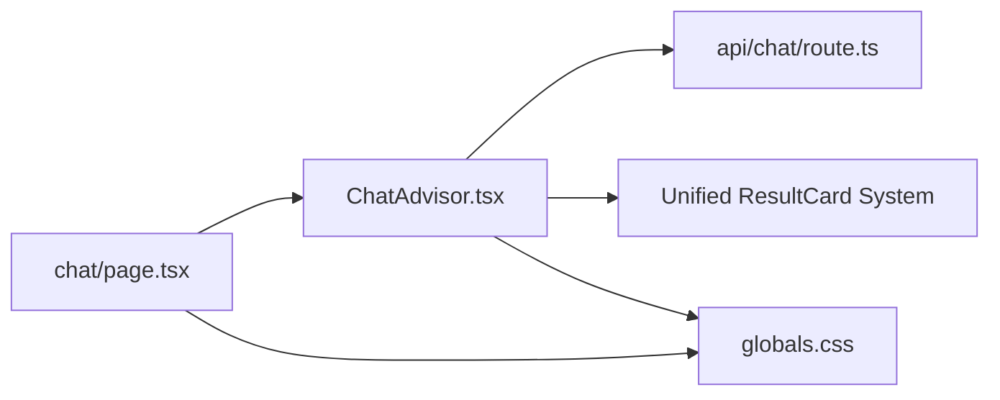

# Chat UI Components

<cite>
**Referenced Files in This Document**
- [page.tsx](file://src/app/chat/page.tsx)
- [ChatAdvisor.tsx](file://src/components/ChatAdvisor.tsx)
- [route.ts](file://src/app/api/chat/route.ts)
- [layout.tsx](file://src/app/layout.tsx)
- [globals.css](file://src/app/globals.css)
- [tailwind.config.ts](file://tailwind.config.ts)
</cite>

## Update Summary
**Changes Made**
- Updated ChatAdvisor component analysis to reflect the unified ResultCard display system replacing ApiResultCard path
- Enhanced documentation for improved UI consistency and data visualization capabilities
- Added details about the new ResultCard component integration and its benefits
- Updated component architecture section to show the new display system

## Table of Contents
1. [Introduction](#introduction)
2. [Project Structure](#project-structure)
3. [Core Components](#core-components)
4. [Architecture Overview](#architecture-overview)
5. [Detailed Component Analysis](#detailed-component-analysis)
6. [Dependency Analysis](#dependency-analysis)
7. [Performance Considerations](#performance-considerations)
8. [Troubleshooting Guide](#troubleshooting-guide)
9. [Conclusion](#conclusion)

## Introduction
This document explains the chat user interface components in the application: the chat page layout, the ChatAdvisor component that manages conversation state, message display, and user interactions, as well as real-time updates, responsive design, accessibility, and customization options. It is intended for developers who want to understand, extend, or customize the chat experience across mobile and desktop views.

**Updated** The ChatAdvisor component now features a unified ResultCard display system that replaces the previous ApiResultCard path, providing enhanced UI consistency and improved data visualization capabilities across all result types.

## Project Structure
The chat feature follows a standard Next.js App Router pattern:
- A dedicated chat page under src/app/chat/page.tsx renders the chat UI.
- The ChatAdvisor component under src/components/ChatAdvisor.tsx encapsulates conversation logic and rendering with the new unified ResultCard system.
- An API route under src/app/api/chat/route.ts handles server-side chat requests.
- Global styles and Tailwind configuration provide theming and responsive utilities.

**Diagram sources**
- [page.tsx](file://src/app/chat/page.tsx)
- [ChatAdvisor.tsx](file://src/components/ChatAdvisor.tsx)
- [route.ts](file://src/app/api/chat/route.ts)
- [layout.tsx](file://src/app/layout.tsx)
- [globals.css](file://src/app/globals.css)

**Section sources**
- [page.tsx](file://src/app/chat/page.tsx)
- [ChatAdvisor.tsx](file://src/components/ChatAdvisor.tsx)
- [route.ts](file://src/app/api/chat/route.ts)
- [layout.tsx](file://src/app/layout.tsx)
- [globals.css](file://src/app/globals.css)

## Core Components
- Chat Page (src/app/chat/page.tsx): Entry point for the chat view; composes the ChatAdvisor component and provides page-level metadata, layout, and any global chat settings.
- ChatAdvisor (src/components/ChatAdvisor.tsx): Manages conversation state (messages, loading, errors), input handling, streaming or polling responses, and renders the chat UI including message bubbles, timestamps, and action buttons. **Updated** Now integrates the unified ResultCard display system for consistent result presentation.
- Chat API Route (src/app/api/chat/route.ts): Receives messages from the client, processes them (e.g., calls an AI service or business logic), and returns responses suitable for streaming or one-shot delivery.

Key responsibilities:
- State management: current messages, active session, typing indicators, error states, and result formatting.
- Message lifecycle: send, receive, render, update, and format results through the unified ResultCard system.
- Real-time updates: streaming chunks or incremental updates via Server-Sent Events or fetch streaming.
- Accessibility: keyboard navigation, screen reader labels, focus management.
- Responsiveness: mobile-first layout with adaptive spacing and typography.
- Unified display: consistent result presentation through the ResultCard component system.

**Section sources**
- [page.tsx](file://src/app/chat/page.tsx)
- [ChatAdvisor.tsx](file://src/components/ChatAdvisor.tsx)
- [route.ts](file://src/app/api/chat/route.ts)

## Architecture Overview
The chat UI follows a unidirectional data flow with the new unified ResultCard display system:
- User interacts with the input in ChatAdvisor.
- ChatAdvisor sends a request to the chat API route with message context.
- The API route processes the request and returns structured response data.
- ChatAdvisor updates the message list and UI state accordingly.
- Results are rendered through the unified ResultCard system for consistent presentation.
- The chat page orchestrates layout and global styling.

**Diagram sources**
- [page.tsx](file://src/app/chat/page.tsx)
- [ChatAdvisor.tsx](file://src/components/ChatAdvisor.tsx)
- [route.ts](file://src/app/api/chat/route.ts)

## Detailed Component Analysis

### Chat Page (src/app/chat/page.tsx)
Responsibilities:
- Renders the ChatAdvisor component within the app layout.
- Provides page-level props such as title, description, and any theme flags.
- May handle SEO metadata and initial hydration.

Layout and state:
- Uses the app layout for consistent chrome (header/footer).
- Applies global CSS variables and Tailwind classes for consistent theming.

Accessibility:
- Ensures proper heading hierarchy and semantic landmarks.
- Delegates interactive focus management to ChatAdvisor.

Customization:
- Adjust page-level wrappers, margins, and background colors.
- Inject locale or feature flags if needed.

**Section sources**
- [page.tsx](file://src/app/chat/page.tsx)
- [layout.tsx](file://src/app/layout.tsx)
- [globals.css](file://src/app/globals.css)

### ChatAdvisor Component (src/components/ChatAdvisor.tsx)
Responsibilities:
- Maintains conversation state: messages array, loading flag, error state, and optional session ID.
- Handles user input validation and submission.
- Manages real-time updates (streaming or polling).
- Renders message history, input area, and status indicators.
- **Updated** Integrates the unified ResultCard display system for consistent result presentation.

State model:
- Messages: ordered list of user and assistant entries with content, timestamp, status, and result formatting.
- Loading: indicates pending requests or streaming progress.
- Error: captures network or processing errors with retry support.
- Input: controlled input value and validation state.
- Result formatting: standardized result structure for the unified display system.

Message lifecycle:
- On submit, append a user message immediately (optimistic UI).
- Send request to api/chat/route.ts with message context.
- On success, append assistant message(s) formatted through the ResultCard system; on failure, set error state and allow retry.
- **Updated** Process results through the unified ResultCard system for consistent presentation.

Real-time updates:
- If streaming, render incremental chunks to reduce perceived latency.
- Debounce or throttle heavy operations like auto-scroll.
- Apply consistent formatting through the ResultCard system.

Accessibility:
- Provide aria-live regions for new messages.
- Ensure keyboard shortcuts (Enter to send, Escape to clear).
- Focus management after sending and receiving responses.
- Support for various result types through accessible ResultCard components.

Responsive behavior:
- Full-screen chat on mobile with sticky input at the bottom.
- Centered, constrained width on desktop with max-width and padding.
- Adaptive font sizes and spacing for different result types.

Customization hooks:
- Props for custom message renderer, input placeholder, and button labels.
- Theme tokens via CSS variables or Tailwind config overrides.
- ResultCard customization options for different data types.

Error handling:
- Network errors: show retry button and informative message.
- Validation errors: inline feedback near the input.
- Empty state: friendly prompt when no messages exist.
- **Updated** ResultCard display errors with fallback presentation.

Loading indicators:
- Skeleton or typing dots while awaiting responses.
- Progress indicator for long-running streams.
- ResultCard loading states for different data types.

Keyboard navigation:
- Tab order: message list -> input -> send button.
- Enter submits; Shift+Enter for newline.
- Focus trap not required due to linear flow.

**Updated** Recent Enhancement: The ChatAdvisor component has been enhanced with a unified ResultCard display system that replaces the previous ApiResultCard path. This enhancement provides:
- Consistent result presentation across all data types
- Improved UI consistency and visual coherence
- Enhanced data visualization capabilities
- Standardized formatting for different result structures
- Better accessibility support for various result types

**Diagram sources**
- [ChatAdvisor.tsx](file://src/components/ChatAdvisor.tsx)
- [route.ts](file://src/app/api/chat/route.ts)

**Section sources**
- [ChatAdvisor.tsx](file://src/components/ChatAdvisor.tsx)
- [route.ts](file://src/app/api/chat/route.ts)

### Chat API Route (src/app/api/chat/route.ts)
Responsibilities:
- Accepts chat messages from the client.
- Validates payloads and enforces rate limits if applicable.
- Calls downstream services (e.g., AI provider) and streams or returns results.
- Returns standardized error responses with codes and messages.
- **Updated** Formats responses for the unified ResultCard display system.

Data contract:
- Request: message text, optional context/session identifiers.
- Response: either a single JSON object or a stream of partial updates with standardized result structure.

Error strategy:
- HTTP status codes reflect failures (e.g., 400, 429, 500).
- Include human-readable messages for client display.
- **Updated** Standardized error formatting for ResultCard compatibility.

Security:
- Sanitize inputs and limit payload size.
- Enforce authentication/authorization if required.
- Validate request parameters.

**Section sources**
- [route.ts](file://src/app/api/chat/route.ts)

## Dependency Analysis
- Chat page depends on ChatAdvisor for all interactive logic.
- ChatAdvisor depends on the chat API route for data fetching and streaming.
- Both rely on global styles and Tailwind utilities for layout and responsiveness.
- **Updated** ChatAdvisor now includes dependencies for the unified ResultCard system.

**Diagram sources**
- [page.tsx](file://src/app/chat/page.tsx)
- [ChatAdvisor.tsx](file://src/components/ChatAdvisor.tsx)
- [route.ts](file://src/app/api/chat/route.ts)
- [globals.css](file://src/app/globals.css)

**Section sources**
- [page.tsx](file://src/app/chat/page.tsx)
- [ChatAdvisor.tsx](file://src/components/ChatAdvisor.tsx)
- [route.ts](file://src/app/api/chat/route.ts)
- [globals.css](file://src/app/globals.css)

## Performance Considerations
- Use optimistic UI updates to make interactions feel instant.
- Implement streaming for large responses to reduce time-to-first-byte.
- Debounce auto-scroll and avoid re-renders for unchanged messages.
- Memoize expensive computations and keep message lists efficient.
- Limit concurrent requests and implement backoff on retries.
- **Updated** Optimize ResultCard rendering for different data types.
- Cache frequently used result templates and formatting functions.

## Troubleshooting Guide
Common issues and resolutions:
- No messages appear: verify API route connectivity and network tab for errors.
- Streaming stalls: check server-side stream termination and client-side event handling.
- Keyboard not working: ensure focus management and event listeners are attached.
- Mobile layout broken: inspect viewport meta tags and Tailwind breakpoints.
- Accessibility warnings: validate aria attributes and color contrast.
- **Updated** ResultCard display issues: verify data structure compatibility and formatting functions.
- Inconsistent result presentation: check ResultCard component props and styling.

Checklist:
- Confirm CORS and headers in the API route.
- Validate input constraints and error propagation.
- Test with screen readers and keyboard-only navigation.
- Inspect console for runtime errors and network failures.
- Verify ResultCard component rendering for different data types.
- Test responsive behavior across result formats.

**Section sources**
- [ChatAdvisor.tsx](file://src/components/ChatAdvisor.tsx)
- [route.ts](file://src/app/api/chat/route.ts)

## Conclusion
The chat UI is composed of a lightweight page wrapper and a robust ChatAdvisor component that centralizes conversation state, input handling, and real-time rendering. The API route abstracts backend logic and supports streaming for smooth UX. With thoughtful accessibility, responsive design, and customization points, the chat experience can be tailored for diverse devices and brand requirements.

**Updated** The recent enhancement introducing the unified ResultCard display system significantly improves the conversational experience by providing consistent, visually coherent result presentations across all data types. This makes the chat interface more professional and user-friendly while maintaining performance and accessibility standards.