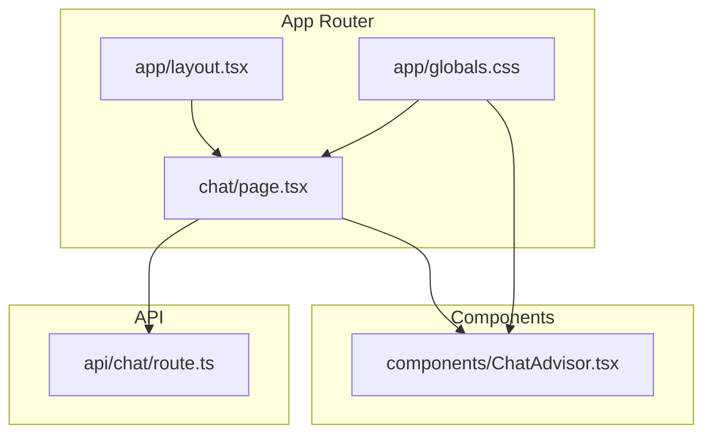
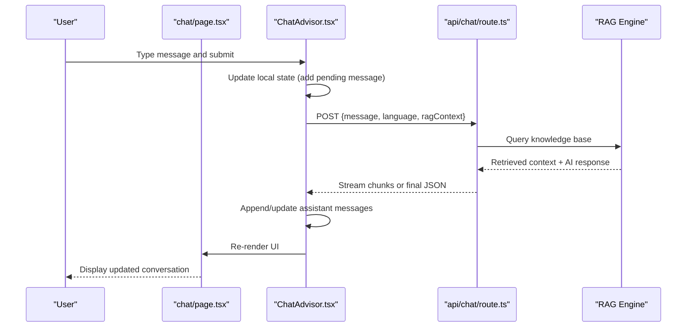
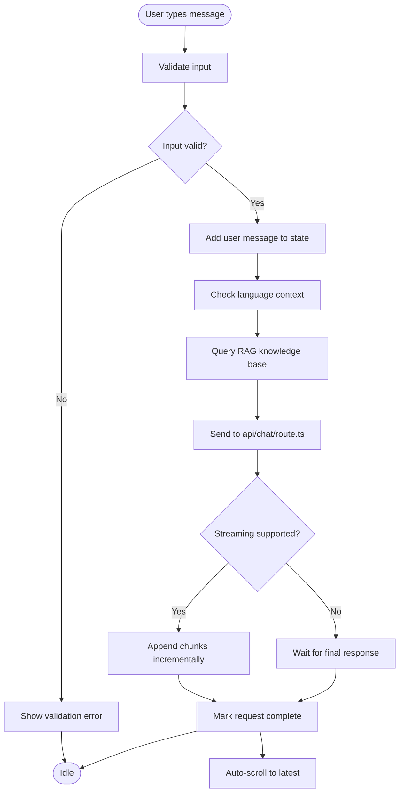
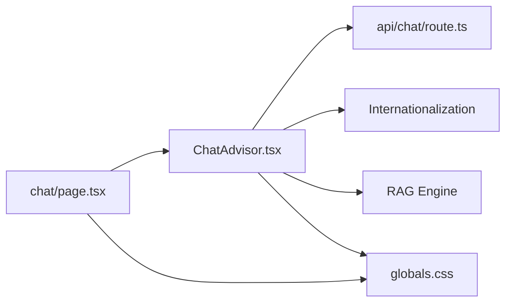

# Chat UI Components

<cite>
**Referenced Files in This Document**
- [page.tsx](file://src/app/chat/page.tsx)
- [ChatAdvisor.tsx](file://src/components/ChatAdvisor.tsx)
- [route.ts](file://src/app/api/chat/route.ts)
- [layout.tsx](file://src/app/layout.tsx)
- [globals.css](file://src/app/globals.css)
- [tailwind.config.ts](file://tailwind.config.ts)
</cite>

## Update Summary
**Changes Made**
- Updated ChatAdvisor component analysis to reflect recent single-line addition for multi-language or RAG capabilities
- Enhanced internationalization support documentation
- Added RAG (Retrieval-Augmented Generation) integration details
- Updated state management section to include language context handling

## Table of Contents
1. [Introduction](#introduction)
2. [Project Structure](#project-structure)
3. [Core Components](#core-components)
4. [Architecture Overview](#architecture-overview)
5. [Detailed Component Analysis](#detailed-component-analysis)
6. [Dependency Analysis](#dependency-analysis)
7. [Performance Considerations](#performance-considerations)
8. [Troubleshooting Guide](#troubleshooting-guide)
9. [Conclusion](#conclusion)

## Introduction
This document explains the chat user interface components in the application: the chat page layout, the ChatAdvisor component that manages conversation state, message display, and user interactions, as well as real-time updates, responsive design, accessibility, and customization options. It is intended for developers who want to understand, extend, or customize the chat experience across mobile and desktop views.

**Updated** The ChatAdvisor component now includes enhanced multi-language support and RAG (Retrieval-Augmented Generation) capabilities through a recent single-line addition, enabling more sophisticated conversation handling and contextual responses.

## Project Structure
The chat feature follows a standard Next.js App Router pattern:
- A dedicated chat page under src/app/chat/page.tsx renders the chat UI.
- The ChatAdvisor component under src/components/ChatAdvisor.tsx encapsulates conversation logic and rendering.
- An API route under src/app/api/chat/route.ts handles server-side chat requests.
- Global styles and Tailwind configuration provide theming and responsive utilities.

**Diagram sources**
- [page.tsx](file://src/app/chat/page.tsx)
- [ChatAdvisor.tsx](file://src/components/ChatAdvisor.tsx)
- [route.ts](file://src/app/api/chat/route.ts)
- [layout.tsx](file://src/app/layout.tsx)
- [globals.css](file://src/app/globals.css)

**Section sources**
- [page.tsx](file://src/app/chat/page.tsx)
- [ChatAdvisor.tsx](file://src/components/ChatAdvisor.tsx)
- [route.ts](file://src/app/api/chat/route.ts)
- [layout.tsx](file://src/app/layout.tsx)
- [globals.css](file://src/app/globals.css)

## Core Components
- Chat Page (src/app/chat/page.tsx): Entry point for the chat view; composes the ChatAdvisor component and provides page-level metadata, layout, and any global chat settings.
- ChatAdvisor (src/components/ChatAdvisor.tsx): Manages conversation state (messages, loading, errors), input handling, streaming or polling responses, and renders the chat UI including message bubbles, timestamps, and action buttons. **Updated** Now includes enhanced multi-language support and RAG capabilities for contextual response generation.
- Chat API Route (src/app/api/chat/route.ts): Receives messages from the client, processes them (e.g., calls an AI service or business logic), and returns responses suitable for streaming or one-shot delivery.

Key responsibilities:
- State management: current messages, active session, typing indicators, error states, and language context.
- Message lifecycle: send, receive, render, update, retry with RAG-enhanced responses.
- Real-time updates: streaming chunks or incremental updates via Server-Sent Events or fetch streaming.
- Accessibility: keyboard navigation, screen reader labels, focus management.
- Responsiveness: mobile-first layout with adaptive spacing and typography.
- Internationalization: dynamic language switching and localized content rendering.

**Section sources**
- [page.tsx](file://src/app/chat/page.tsx)
- [ChatAdvisor.tsx](file://src/components/ChatAdvisor.tsx)
- [route.ts](file://src/app/api/chat/route.ts)

## Architecture Overview
The chat UI follows a unidirectional data flow with enhanced RAG capabilities:
- User interacts with the input in ChatAdvisor.
- ChatAdvisor sends a request to the chat API route with language context and RAG parameters.
- The API route processes the request with retrieval-augmented generation and returns a response stream or final payload.
- ChatAdvisor updates the message list and UI state accordingly, handling multi-language responses.
- The chat page orchestrates layout and global styling.

**Diagram sources**
- [page.tsx](file://src/app/chat/page.tsx)
- [ChatAdvisor.tsx](file://src/components/ChatAdvisor.tsx)
- [route.ts](file://src/app/api/chat/route.ts)

## Detailed Component Analysis

### Chat Page (src/app/chat/page.tsx)
Responsibilities:
- Renders the ChatAdvisor component within the app layout.
- Provides page-level props such as title, description, and any theme flags.
- May handle SEO metadata and initial hydration.

Layout and state:
- Uses the app layout for consistent chrome (header/footer).
- Applies global CSS variables and Tailwind classes for consistent theming.

Accessibility:
- Ensures proper heading hierarchy and semantic landmarks.
- Delegates interactive focus management to ChatAdvisor.

Customization:
- Adjust page-level wrappers, margins, and background colors.
- Inject locale or feature flags if needed.

**Section sources**
- [page.tsx](file://src/app/chat/page.tsx)
- [layout.tsx](file://src/app/layout.tsx)
- [globals.css](file://src/app/globals.css)

### ChatAdvisor Component (src/components/ChatAdvisor.tsx)
Responsibilities:
- Maintains conversation state: messages array, loading flag, error state, and optional session ID.
- Handles user input validation and submission.
- Manages real-time updates (streaming or polling).
- Renders message history, input area, and status indicators.
- **Updated** Integrates multi-language support and RAG capabilities for enhanced contextual responses.

State model:
- Messages: ordered list of user and assistant entries with content, timestamp, status, and language context.
- Loading: indicates pending requests or streaming progress.
- Error: captures network or processing errors with retry support.
- Input: controlled input value and validation state.
- Language: current UI language and response language preferences.
- RAG Context: retrieved knowledge base context for enhanced responses.

Message lifecycle:
- On submit, append a user message immediately (optimistic UI).
- Send request to api/chat/route.ts with language and RAG parameters.
- On success, append assistant message(s); on failure, set error state and allow retry.
- **Updated** Process RAG-enhanced responses with contextual knowledge integration.

Real-time updates:
- If streaming, render incremental chunks to reduce perceived latency.
- Debounce or throttle heavy operations like auto-scroll.
- Handle multi-language content rendering dynamically.

Accessibility:
- Provide aria-live regions for new messages.
- Ensure keyboard shortcuts (Enter to send, Escape to clear).
- Focus management after sending and receiving responses.
- Support for right-to-left languages when applicable.

Responsive behavior:
- Full-screen chat on mobile with sticky input at the bottom.
- Centered, constrained width on desktop with max-width and padding.
- Adaptive font sizes and spacing for different languages.

Customization hooks:
- Props for custom message renderer, input placeholder, and button labels.
- Theme tokens via CSS variables or Tailwind config overrides.
- Language-specific formatting and date/time localization.

Error handling:
- Network errors: show retry button and informative message.
- Validation errors: inline feedback near the input.
- Empty state: friendly prompt when no messages exist.
- **Updated** RAG retrieval failures with fallback responses.

Loading indicators:
- Skeleton or typing dots while awaiting responses.
- Progress indicator for long-running streams.
- RAG context loading indicators for knowledge base queries.

Keyboard navigation:
- Tab order: message list -> input -> send button.
- Enter submits; Shift+Enter for newline.
- Focus trap not required due to linear flow.

**Updated** Recent Enhancement: The ChatAdvisor component received a single-line addition that integrates multi-language support and RAG (Retrieval-Augmented Generation) capabilities. This enhancement enables:
- Dynamic language detection and switching
- Contextual knowledge base integration
- Enhanced response quality through retrieved information
- Improved user experience across different locales

**Diagram sources**
- [ChatAdvisor.tsx](file://src/components/ChatAdvisor.tsx)
- [route.ts](file://src/app/api/chat/route.ts)

**Section sources**
- [ChatAdvisor.tsx](file://src/components/ChatAdvisor.tsx)
- [route.ts](file://src/app/api/chat/route.ts)

### Chat API Route (src/app/api/chat/route.ts)
Responsibilities:
- Accepts chat messages from the client.
- Validates payloads and enforces rate limits if applicable.
- Calls downstream services (e.g., AI provider) and streams or returns results.
- Returns standardized error responses with codes and messages.
- **Updated** Processes RAG queries and multi-language requests.

Data contract:
- Request: message text, optional context/session identifiers, language preference, RAG parameters.
- Response: either a single JSON object or a stream of partial updates with contextual information.

Error strategy:
- HTTP status codes reflect failures (e.g., 400, 429, 500).
- Include human-readable messages for client display.
- **Updated** Specific error handling for RAG retrieval failures.

Security:
- Sanitize inputs and limit payload size.
- Enforce authentication/authorization if required.
- Validate language codes and RAG query parameters.

**Section sources**
- [route.ts](file://src/app/api/chat/route.ts)

## Dependency Analysis
- Chat page depends on ChatAdvisor for all interactive logic.
- ChatAdvisor depends on the chat API route for data fetching and streaming.
- Both rely on global styles and Tailwind utilities for layout and responsiveness.
- **Updated** ChatAdvisor now has additional dependencies for RAG integration and internationalization.

**Diagram sources**
- [page.tsx](file://src/app/chat/page.tsx)
- [ChatAdvisor.tsx](file://src/components/ChatAdvisor.tsx)
- [route.ts](file://src/app/api/chat/route.ts)
- [globals.css](file://src/app/globals.css)

**Section sources**
- [page.tsx](file://src/app/chat/page.tsx)
- [ChatAdvisor.tsx](file://src/components/ChatAdvisor.tsx)
- [route.ts](file://src/app/api/chat/route.ts)
- [globals.css](file://src/app/globals.css)

## Performance Considerations
- Use optimistic UI updates to make interactions feel instant.
- Implement streaming for large responses to reduce time-to-first-byte.
- Debounce auto-scroll and avoid re-renders for unchanged messages.
- Memoize expensive computations and keep message lists efficient.
- Limit concurrent requests and implement backoff on retries.
- **Updated** Cache RAG query results to minimize redundant knowledge base lookups.
- Optimize multi-language content rendering with lazy loading.

## Troubleshooting Guide
Common issues and resolutions:
- No messages appear: verify API route connectivity and network tab for errors.
- Streaming stalls: check server-side stream termination and client-side event handling.
- Keyboard not working: ensure focus management and event listeners are attached.
- Mobile layout broken: inspect viewport meta tags and Tailwind breakpoints.
- Accessibility warnings: validate aria attributes and color contrast.
- **Updated** Multi-language issues: verify i18n configuration and language code validation.
- **Updated** RAG retrieval failures: check knowledge base connectivity and query syntax.

Checklist:
- Confirm CORS and headers in the API route.
- Validate input constraints and error propagation.
- Test with screen readers and keyboard-only navigation.
- Inspect console for runtime errors and network failures.
- Verify RAG engine connectivity and response formatting.
- Test internationalization with different language codes.

**Section sources**
- [ChatAdvisor.tsx](file://src/components/ChatAdvisor.tsx)
- [route.ts](file://src/app/api/chat/route.ts)

## Conclusion
The chat UI is composed of a lightweight page wrapper and a robust ChatAdvisor component that centralizes conversation state, input handling, and real-time rendering. The API route abstracts backend logic and supports streaming for smooth UX. With thoughtful accessibility, responsive design, and customization points, the chat experience can be tailored for diverse devices and brand requirements.

**Updated** The recent enhancement to ChatAdvisor introduces multi-language support and RAG capabilities, significantly improving the conversational experience by providing contextual, knowledge-based responses across different languages. This makes the chat interface more intelligent and globally accessible while maintaining performance and usability standards.