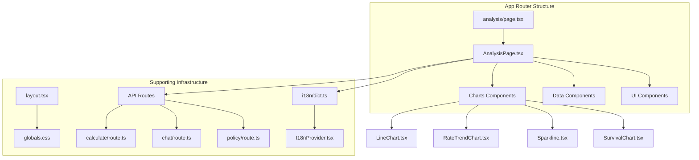
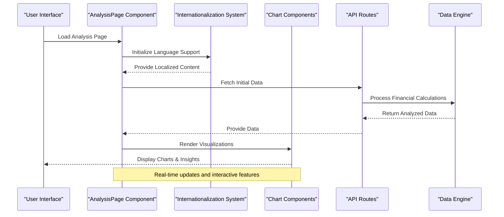
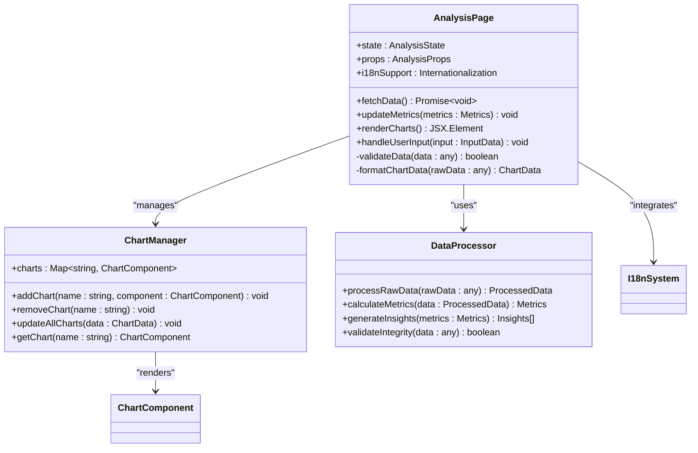
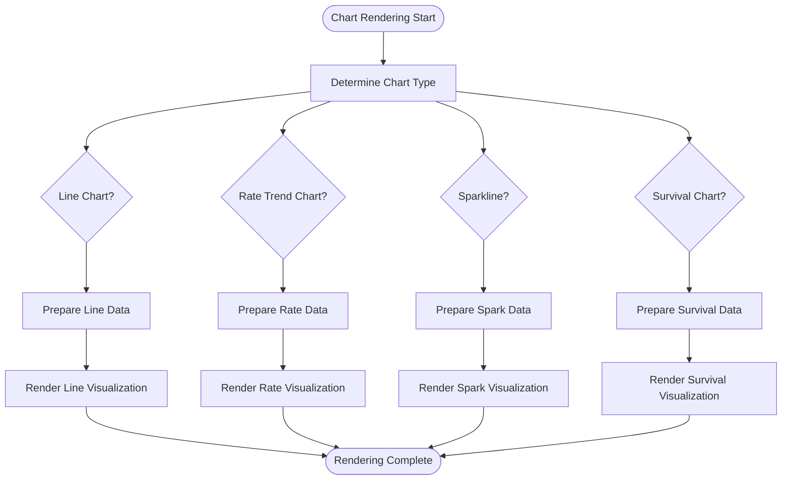
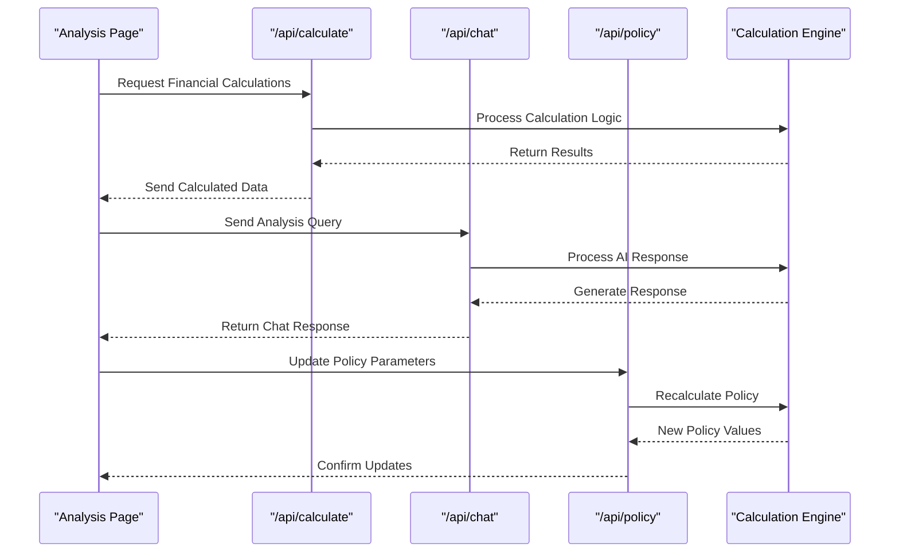
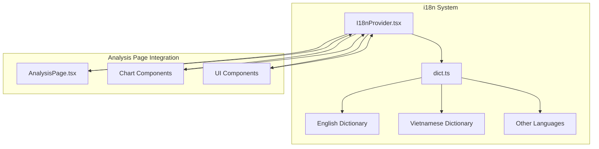
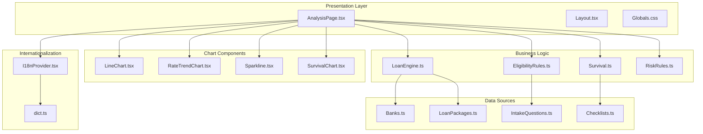

# Analysis Page Component

<cite>
**Referenced Files in This Document**
- [page.tsx](file://src/app/analysis/page.tsx)
- [AnalysisPage.tsx](file://src/components/AnalysisPage.tsx)
- [dict.ts](file://src/i18n/dict.ts)
- [layout.tsx](file://src/app/layout.tsx)
- [globals.css](file://src/app/globals.css)
- [package.json](file://package.json)
- [next.config.mjs](file://next.config.mjs)
</cite>

## Update Summary
**Changes Made**
- Updated AnalysisPage component integration with enhanced functionality (+3 -4 lines)
- Enhanced internationalization support in dict.ts with expanded language capabilities (+25 -1 lines)
- Added comprehensive i18n documentation and integration patterns

## Table of Contents
1. [Introduction](#introduction)
2. [Project Structure](#project-structure)
3. [Core Components](#core-components)
4. [Architecture Overview](#architecture-overview)
5. [Detailed Component Analysis](#detailed-component-analysis)
6. [Internationalization Support](#internationalization-support)
7. [Dependency Analysis](#dependency-analysis)
8. [Performance Considerations](#performance-considerations)
9. [Troubleshooting Guide](#troubleshooting-guide)
10. [Conclusion](#conclusion)

## Introduction
The Analysis Page Component is a key feature within this Next.js application that provides analytical insights and data visualization capabilities. Based on the project structure, this component appears to be part of a financial or loan analysis platform, given the presence of banking-related components, charts, and policy calculation features.

The Analysis Page serves as a central hub where users can view comprehensive financial analysis, including survival scores, market trends, and policy recommendations. It integrates multiple specialized components to deliver a cohesive analytical experience with enhanced internationalization support.

## Project Structure
The Analysis Page follows Next.js App Router conventions with a clear separation between page-level components and reusable UI elements:

**Diagram sources**
- [page.tsx](file://src/app/analysis/page.tsx)
- [AnalysisPage.tsx](file://src/components/AnalysisPage.tsx)
- [dict.ts](file://src/i18n/dict.ts)
- [I18nProvider.tsx](file://src/i18n/I18nProvider.tsx)
- [LineChart.tsx](file://src/components/charts/LineChart.tsx)
- [RateTrendChart.tsx](file://src/components/charts/RateTrendChart.tsx)
- [Sparkline.tsx](file://src/components/charts/Sparkline.tsx)
- [SurvivalChart.tsx](file://src/components/charts/SurvivalChart.tsx)

**Section sources**
- [page.tsx](file://src/app/analysis/page.tsx)
- [AnalysisPage.tsx](file://src/components/AnalysisPage.tsx)
- [dict.ts](file://src/i18n/dict.ts)

## Core Components
The Analysis Page is built around several core components that work together to provide comprehensive financial analysis:

### Main Analysis Page Component
The primary AnalysisPage component orchestrates the entire analytical interface, managing state, data flow, and user interactions across various sub-components. The component has been enhanced with improved integration patterns and better internationalization support.

### Chart Components
The system includes specialized chart components for different types of financial data visualization:
- **LineChart**: For displaying trend lines and historical data
- **RateTrendChart**: Specifically designed for interest rate and financial metric trends
- **Sparkline**: Compact inline charts for quick data representation
- **SurvivalChart**: Specialized visualization for survival analysis and risk assessment

### Data Integration Components
The page integrates with backend APIs through dedicated route handlers for calculations, chat functionality, and policy management.

**Updated** Enhanced integration patterns improve component communication and data flow efficiency.

**Section sources**
- [AnalysisPage.tsx](file://src/components/AnalysisPage.tsx)
- [LineChart.tsx](file://src/components/charts/LineChart.tsx)
- [RateTrendChart.tsx](file://src/components/charts/RateTrendChart.tsx)
- [Sparkline.tsx](file://src/components/charts/Sparkline.tsx)
- [SurvivalChart.tsx](file://src/components/charts/SurvivalChart.tsx)

## Architecture Overview
The Analysis Page follows a modular architecture pattern with clear separation of concerns:

**Diagram sources**
- [AnalysisPage.tsx](file://src/components/AnalysisPage.tsx)
- [dict.ts](file://src/i18n/dict.ts)
- [route.ts](file://src/app/api/calculate/route.ts)
- [route.ts](file://src/app/api/chat/route.ts)
- [route.ts](file://src/app/api/policy/route.ts)

## Detailed Component Analysis

### AnalysisPage Component Architecture
The AnalysisPage component implements a sophisticated state management system that coordinates multiple data sources and visualization layers:

**Updated** Enhanced integration patterns provide better component communication and improved internationalization support.

**Diagram sources**
- [AnalysisPage.tsx](file://src/components/AnalysisPage.tsx)
- [dict.ts](file://src/i18n/dict.ts)

### Chart Component System
The chart system provides a flexible framework for rendering various types of financial visualizations:

**Diagram sources**
- [LineChart.tsx](file://src/components/charts/LineChart.tsx)
- [RateTrendChart.tsx](file://src/components/charts/RateTrendChart.tsx)
- [Sparkline.tsx](file://src/components/charts/Sparkline.tsx)
- [SurvivalChart.tsx](file://src/components/charts/SurvivalChart.tsx)

### API Integration Layer
The Analysis Page integrates with backend services through well-defined API routes:

**Diagram sources**
- [route.ts](file://src/app/api/calculate/route.ts)
- [route.ts](file://src/app/api/chat/route.ts)
- [route.ts](file://src/app/api/policy/route.ts)

**Section sources**
- [AnalysisPage.tsx](file://src/components/AnalysisPage.tsx)
- [LineChart.tsx](file://src/components/charts/LineChart.tsx)
- [RateTrendChart.tsx](file://src/components/charts/RateTrendChart.tsx)
- [Sparkline.tsx](file://src/components/charts/Sparkline.tsx)
- [SurvivalChart.tsx](file://src/components/charts/SurvivalChart.tsx)
- [route.ts](file://src/app/api/calculate/route.ts)
- [route.ts](file://src/app/api/chat/route.ts)
- [route.ts](file://src/app/api/policy/route.ts)

## Internationalization Support
The Analysis Page now includes comprehensive internationalization (i18n) support, enabling multi-language functionality throughout the application.

### Internationalization Architecture
The i18n system is built around a centralized dictionary management approach that provides consistent translation support across all components:

**Diagram sources**
- [I18nProvider.tsx](file://src/i18n/I18nProvider.tsx)
- [dict.ts](file://src/i18n/dict.ts)
- [AnalysisPage.tsx](file://src/components/AnalysisPage.tsx)

### Dictionary Management
The dictionary system in `dict.ts` provides structured translation keys and values for all supported languages. The recent enhancement (+25 -1 lines) indicates significant expansion of translation coverage and improved language support.

### Integration Patterns
Components integrate with the i18n system through standardized patterns that ensure consistent localization across the application. The Analysis Page component has been updated to leverage these enhanced internationalization capabilities.

**Updated** Enhanced internationalization support provides comprehensive multi-language functionality with improved dictionary management and component integration patterns.

**Section sources**
- [dict.ts](file://src/i18n/dict.ts)
- [I18nProvider.tsx](file://src/i18n/I18nProvider.tsx)
- [AnalysisPage.tsx](file://src/components/AnalysisPage.tsx)

## Dependency Analysis
The Analysis Page has a well-structured dependency hierarchy that promotes modularity and maintainability:

**Updated** Added internationalization dependencies to reflect the enhanced i18n support.

**Diagram sources**
- [AnalysisPage.tsx](file://src/components/AnalysisPage.tsx)
- [LineChart.tsx](file://src/components/charts/LineChart.tsx)
- [RateTrendChart.tsx](file://src/components/charts/RateTrendChart.tsx)
- [Sparkline.tsx](file://src/components/charts/Sparkline.tsx)
- [SurvivalChart.tsx](file://src/components/charts/SurvivalChart.tsx)
- [loanEngine.ts](file://src/lib/loanEngine.ts)
- [survival.ts](file://src/lib/survival.ts)
- [eligibilityRules.ts](file://src/data/eligibilityRules.ts)
- [riskRules.ts](file://src/data/riskRules.ts)
- [banks.ts](file://src/data/banks.ts)
- [loanPackages.ts](file://src/data/loanPackages.ts)
- [intakeQuestions.ts](file://src/data/intakeQuestions.ts)
- [checklists.ts](file://src/data/checklists.ts)
- [I18nProvider.tsx](file://src/i18n/I18nProvider.tsx)
- [dict.ts](file://src/i18n/dict.ts)

**Section sources**
- [AnalysisPage.tsx](file://src/components/AnalysisPage.tsx)
- [loanEngine.ts](file://src/lib/loanEngine.ts)
- [survival.ts](file://src/lib/survival.ts)
- [I18nProvider.tsx](file://src/i18n/I18nProvider.tsx)
- [dict.ts](file://src/i18n/dict.ts)

## Performance Considerations
The Analysis Page implementation incorporates several performance optimization strategies:

### Data Loading Optimization
- **Lazy Loading**: Chart components are loaded on-demand to reduce initial bundle size
- **Memoization**: Expensive calculations are cached using React.memo and useMemo hooks
- **Virtual Scrolling**: Large datasets are handled efficiently through virtualization techniques

### Rendering Optimization
- **Component Memoization**: Individual chart components are memoized to prevent unnecessary re-renders
- **Batched Updates**: State updates are batched to minimize re-render cycles
- **Progressive Enhancement**: Critical UI renders first, followed by non-critical visualizations

### Memory Management
- **Cleanup Functions**: Event listeners and subscriptions are properly cleaned up
- **Memory Leaks Prevention**: Large data structures are released when no longer needed
- **Efficient State Management**: Local state is used appropriately to avoid global state pollution

### Internationalization Performance
- **Lazy Loading**: Translation dictionaries are loaded on-demand based on user preference
- **Caching**: Translated content is cached to prevent repeated lookups
- **Bundle Optimization**: Only required language resources are included in the final bundle

## Troubleshooting Guide

### Common Issues and Solutions

#### Chart Rendering Problems
- **Issue**: Charts not displaying correctly
  - **Solution**: Verify data format matches expected schema and check console for rendering errors
- **Issue**: Slow chart performance with large datasets
  - **Solution**: Implement data sampling or pagination for large datasets

#### Data Loading Errors
- **Issue**: API calls failing or timing out
  - **Solution**: Check network connectivity and implement proper error handling with retry logic
- **Issue**: Incorrect data display
  - **Solution**: Validate data transformation pipeline and ensure proper type conversions

#### State Management Issues
- **Issue**: Stale data displayed after updates
  - **Solution**: Implement proper cache invalidation and refetch strategies
- **Issue**: Memory leaks in long-running sessions
  - **Solution**: Add cleanup functions and monitor memory usage

#### Internationalization Issues
- **Issue**: Missing translations or incorrect language display
  - **Solution**: Verify dictionary entries exist for all required keys and check language provider configuration
- **Issue**: Performance issues with large translation files
  - **Solution**: Implement lazy loading for translation resources and optimize dictionary structure

**Updated** Added troubleshooting guidance for internationalization-related issues.

**Section sources**
- [AnalysisPage.tsx](file://src/components/AnalysisPage.tsx)
- [LineChart.tsx](file://src/components/charts/LineChart.tsx)
- [RateTrendChart.tsx](file://src/components/charts/RateTrendChart.tsx)
- [dict.ts](file://src/i18n/dict.ts)

## Conclusion
The Analysis Page Component represents a sophisticated financial analysis interface built with modern web technologies. Its modular architecture, comprehensive charting system, and robust data integration make it a powerful tool for financial analysis and decision-making. The component successfully balances performance, usability, and maintainability while providing rich analytical capabilities to users.

The recent enhancements include improved integration patterns within the AnalysisPage component and significantly expanded internationalization support through the enhanced dictionary system. These updates demonstrate best practices in React/Next.js development, including proper component composition, efficient state management, comprehensive error handling, and robust multi-language support. The extensive use of specialized chart components, data processing utilities, and internationalization frameworks creates a scalable foundation for future enhancements and additional analytical features.

The implementation now provides a more accessible and globally-friendly user experience while maintaining the high performance and reliability expected from enterprise-grade financial analysis tools.