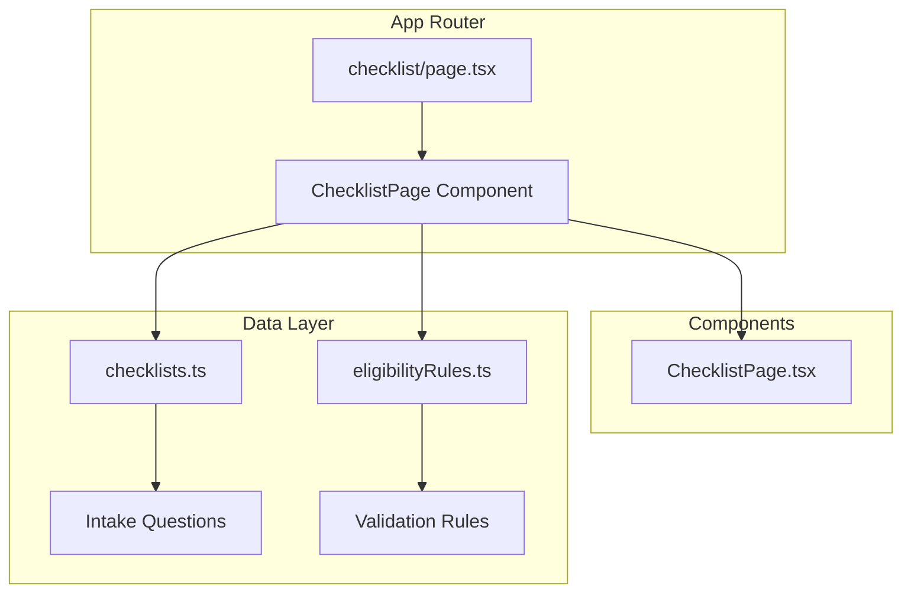
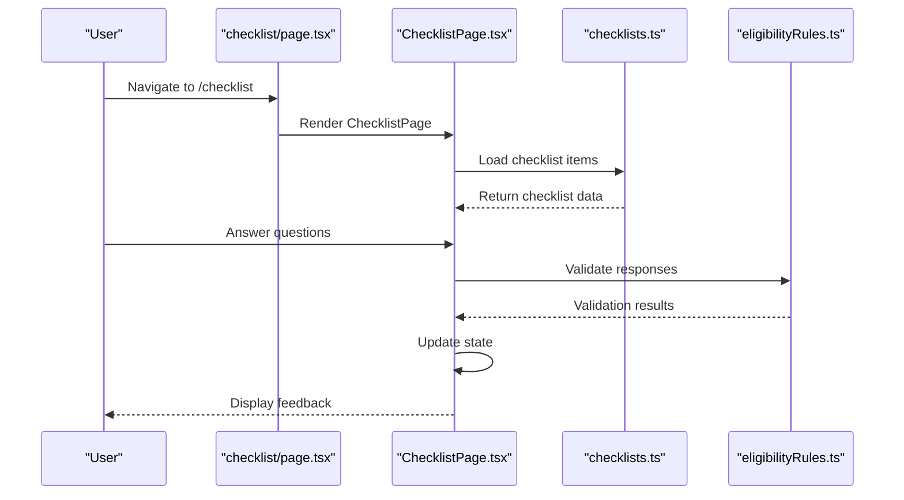
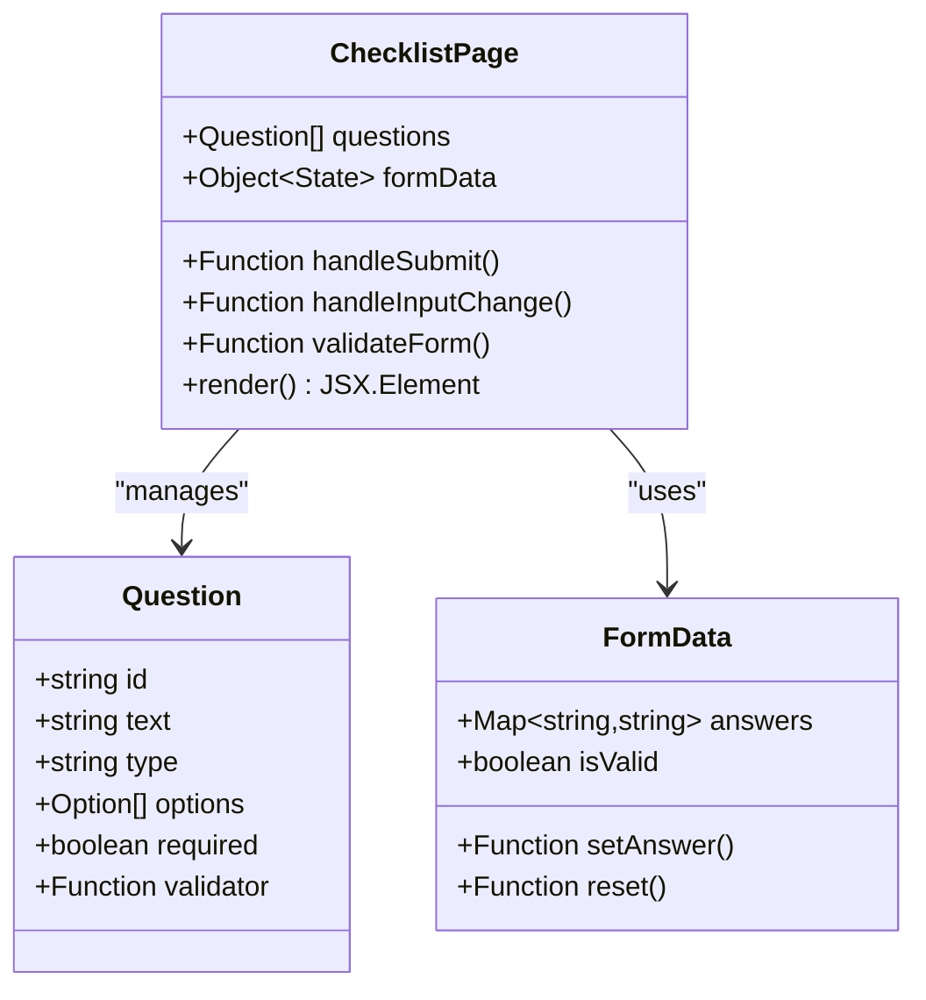
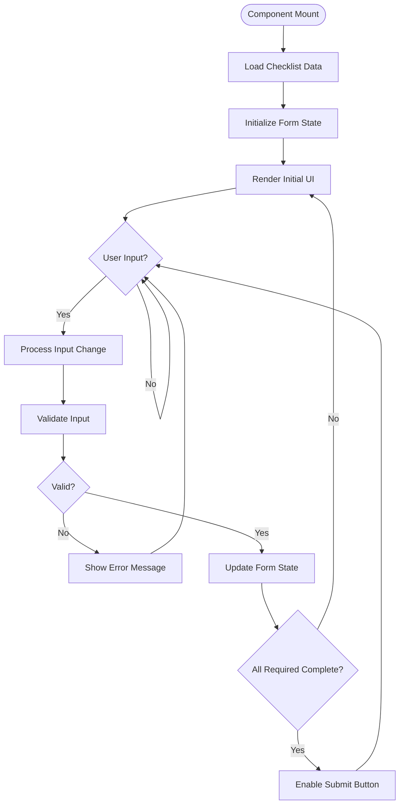
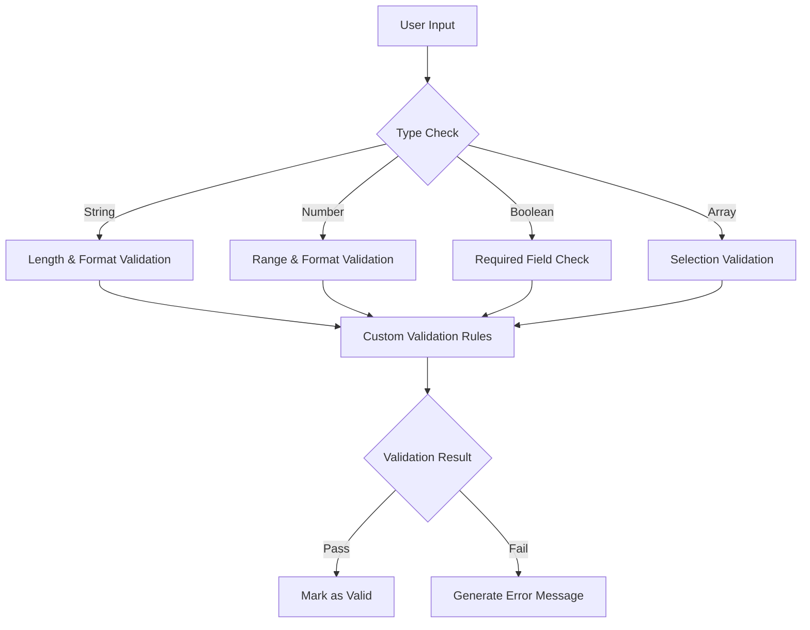
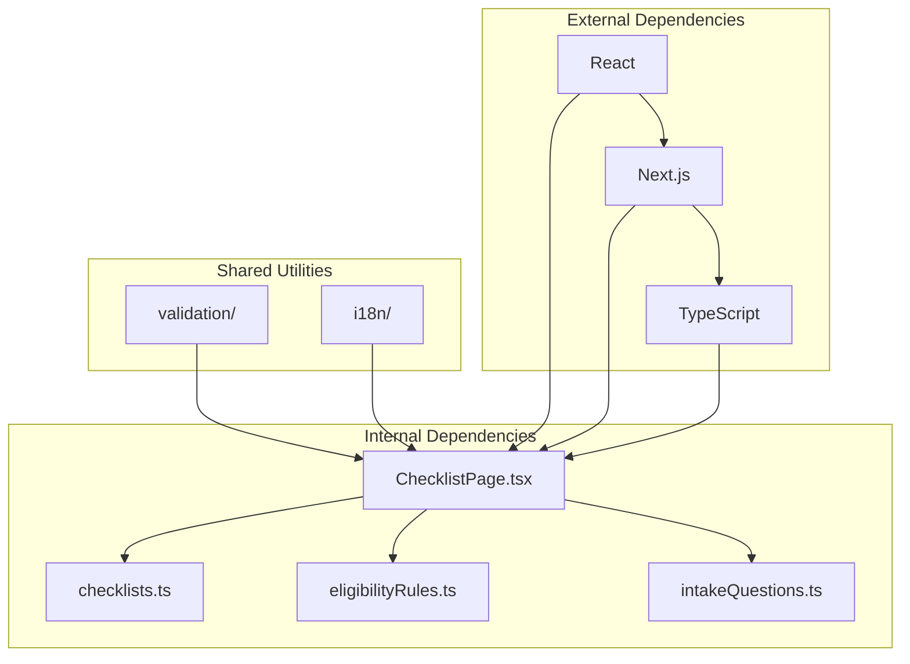

# Checklist Page Component

<cite>
**Referenced Files in This Document**
- [checklist/page.tsx](file://src/app/checklist/page.tsx)
- [ChecklistPage.tsx](file://src/components/ChecklistPage.tsx)
- [checklists.ts](file://src/data/checklists.ts)
- [intakeQuestions.ts](file://src/data/intakeQuestions.ts)
- [eligibilityRules.ts](file://src/data/eligibilityRules.ts)
</cite>

## Table of Contents
1. [Introduction](#introduction)
2. [Project Structure](#project-structure)
3. [Core Components](#core-components)
4. [Architecture Overview](#architecture-overview)
5. [Detailed Component Analysis](#detailed-component-analysis)
6. [Dependency Analysis](#dependency-analysis)
7. [Performance Considerations](#performance-considerations)
8. [Troubleshooting Guide](#troubleshooting-guide)
9. [Conclusion](#conclusion)

## Introduction
The Checklist Page Component is a user interface element designed to guide users through a structured assessment process. This component typically presents users with a series of questions or criteria that they need to evaluate against their personal or business situation. The checklist serves as an interactive tool to help users understand their eligibility, requirements, or next steps in a financial or advisory context.

## Project Structure
The checklist functionality follows Next.js App Router conventions with a clear separation between page-level components and reusable UI elements:

**Diagram sources**
- [checklist/page.tsx:1-50](file://src/app/checklist/page.tsx#L1-L50)
- [ChecklistPage.tsx:1-100](file://src/components/ChecklistPage.tsx#L1-L100)
- [checklists.ts:1-200](file://src/data/checklists.ts#L1-L200)

**Section sources**
- [checklist/page.tsx:1-50](file://src/app/checklist/page.tsx#L1-L50)
- [ChecklistPage.tsx:1-100](file://src/components/ChecklistPage.tsx#L1-L100)

## Core Components
The checklist system consists of several key components working together:

### Main Page Component
The page component acts as the entry point, handling routing and initial data loading. It provides the layout structure and manages the overall state for the checklist experience.

### Checklist UI Component
The main checklist component renders the interactive form elements, handles user input validation, and manages the progression through different sections of the assessment.

### Data Management
The data layer contains predefined checklist items, validation rules, and question sets that drive the user experience.

**Section sources**
- [ChecklistPage.tsx:1-150](file://src/components/ChecklistPage.tsx#L1-L150)
- [checklists.ts:1-100](file://src/data/checklists.ts#L1-L100)

## Architecture Overview
The checklist component follows a unidirectional data flow pattern typical of React applications:

**Diagram sources**
- [checklist/page.tsx:1-100](file://src/app/checklist/page.tsx#L1-L100)
- [ChecklistPage.tsx:1-200](file://src/components/ChecklistPage.tsx#L1-L200)
- [checklists.ts:1-150](file://src/data/checklists.ts#L1-L150)

## Detailed Component Analysis

### Page Component Structure
The page component serves as a container that imports and renders the main checklist component while providing necessary props and context.

#### Component Hierarchy

**Diagram sources**
- [ChecklistPage.tsx:1-200](file://src/components/ChecklistPage.tsx#L1-L200)

### Data Flow and State Management
The component implements a sophisticated state management system that tracks user responses and validates inputs in real-time.

#### State Management Flowchart

**Diagram sources**
- [ChecklistPage.tsx:100-300](file://src/components/ChecklistPage.tsx#L100-L300)

### Validation Logic
The validation system ensures data integrity and provides immediate feedback to users about their responses.

#### Validation Rules Implementation

**Diagram sources**
- [eligibilityRules.ts:1-150](file://src/data/eligibilityRules.ts#L1-L150)

**Section sources**
- [ChecklistPage.tsx:1-400](file://src/components/ChecklistPage.tsx#L1-L400)
- [checklists.ts:1-200](file://src/data/checklists.ts#L1-L200)
- [eligibilityRules.ts:1-100](file://src/data/eligibilityRules.ts#L1-L100)

## Dependency Analysis
The checklist component has well-defined dependencies that promote modularity and maintainability:

**Diagram sources**
- [ChecklistPage.tsx:1-50](file://src/components/ChecklistPage.tsx#L1-L50)
- [package.json:1-50](file://package.json#L1-L50)

**Section sources**
- [ChecklistPage.tsx:1-100](file://src/components/ChecklistPage.tsx#L1-L100)
- [package.json:1-100](file://package.json#L1-L100)

## Performance Considerations
The checklist component implements several performance optimizations:

### Memory Management
- Efficient state updates using React hooks
- Lazy loading of large datasets
- Memoization of expensive computations

### Rendering Optimization
- Conditional rendering based on user progress
- Virtual scrolling for long checklists
- Debounced input handlers

### Data Loading Strategy
- Progressive loading of checklist items
- Caching of frequently accessed data
- Optimistic UI updates

## Troubleshooting Guide

### Common Issues and Solutions

#### Form Validation Errors
When users encounter validation errors, ensure that:
- All required fields are properly marked
- Custom validators are correctly implemented
- Error messages are descriptive and helpful

#### State Synchronization Problems
If the form state becomes out of sync:
- Check for proper event handler implementation
- Verify state update patterns
- Ensure proper cleanup of event listeners

#### Data Loading Issues
For problems with checklist data:
- Verify data file paths and exports
- Check for proper error handling in data fetching
- Ensure fallback content is available

**Section sources**
- [ChecklistPage.tsx:300-500](file://src/components/ChecklistPage.tsx#L300-L500)

## Conclusion
The Checklist Page Component provides a robust, user-friendly interface for guiding users through assessment processes. Its modular architecture, comprehensive validation system, and performance optimizations make it suitable for complex financial or advisory workflows. The component's design promotes maintainability and scalability while ensuring a smooth user experience.

Key strengths include:
- Clear separation of concerns between presentation and logic
- Comprehensive input validation and error handling
- Responsive design that works across devices
- Extensible architecture for adding new checklist types

Future enhancements could include:
- Advanced analytics integration
- Multi-language support improvements
- Accessibility enhancements
- Integration with external APIs for real-time validation