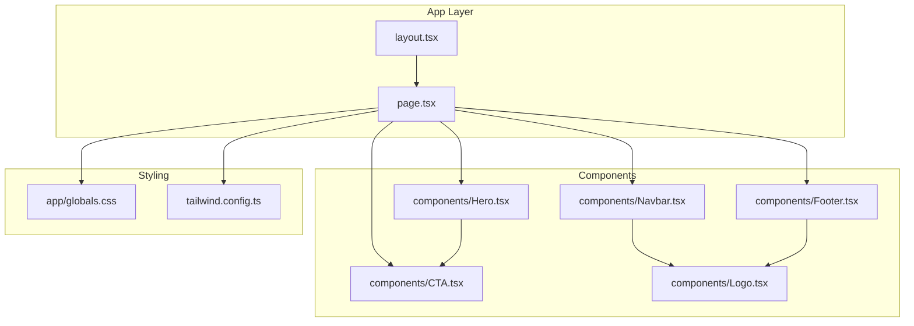
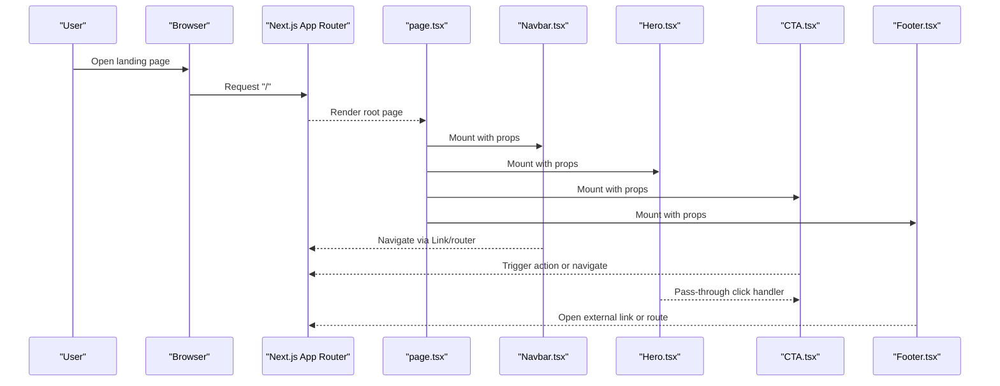
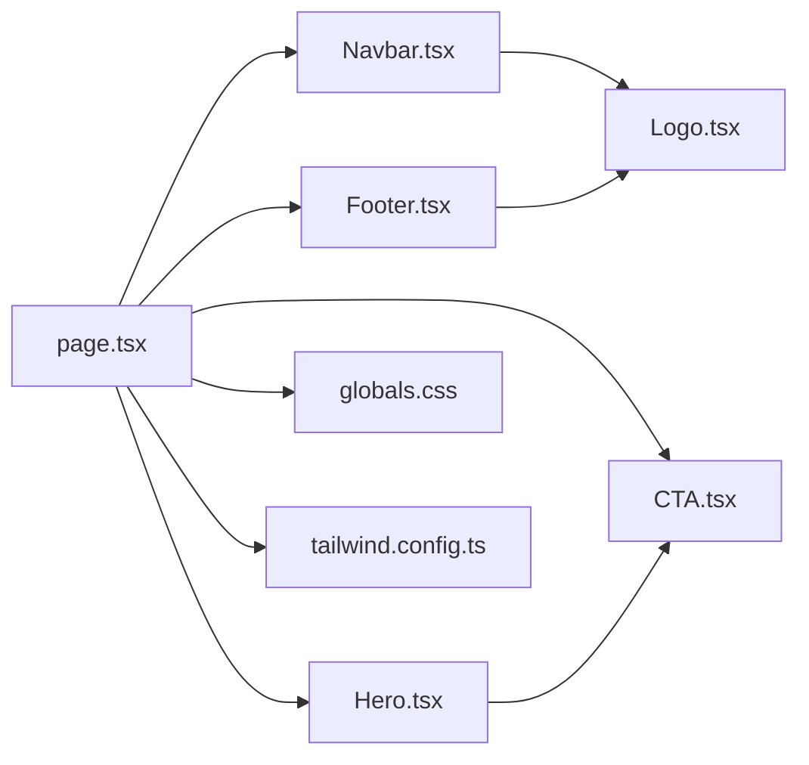

# Core Components

<cite>
**Referenced Files in This Document**
- [Navbar.tsx](file://src/components/Navbar.tsx)
- [Footer.tsx](file://src/components/Footer.tsx)
- [Hero.tsx](file://src/components/Hero.tsx)
- [CTA.tsx](file://src/components/CTA.tsx)
- [Logo.tsx](file://src/components/Logo.tsx)
- [page.tsx](file://src/app/page.tsx)
- [layout.tsx](file://src/app/layout.tsx)
- [globals.css](file://src/app/globals.css)
- [tailwind.config.ts](file://tailwind.config.ts)
</cite>

## Table of Contents
1. [Introduction](#introduction)
2. [Project Structure](#project-structure)
3. [Core Components](#core-components)
4. [Architecture Overview](#architecture-overview)
5. [Detailed Component Analysis](#detailed-component-analysis)
6. [Dependency Analysis](#dependency-analysis)
7. [Performance Considerations](#performance-considerations)
8. [Troubleshooting Guide](#troubleshooting-guide)
9. [Conclusion](#conclusion)

## Introduction
This document provides comprehensive documentation for the core UI components that power the frontend-vaya landing page experience. It focuses on the navigation system (Navbar), footer, hero section, call-to-action (CTA) system, and logo component. The guide explains prop interfaces, event handling, styling customization, responsive behavior, accessibility compliance, and integration patterns with the application’s routing and layout. Usage examples illustrate how these components collaborate to deliver a cohesive user interface.

## Project Structure
The core UI components are organized under src/components and consumed by the Next.js app entry points. The landing page composes Navbar, Hero, CTA, and Footer within the root page, while global styles and Tailwind configuration provide consistent theming and responsive utilities.

**Diagram sources**
- [layout.tsx](file://src/app/layout.tsx)
- [page.tsx](file://src/app/page.tsx)
- [Navbar.tsx](file://src/components/Navbar.tsx)
- [Hero.tsx](file://src/components/Hero.tsx)
- [CTA.tsx](file://src/components/CTA.tsx)
- [Footer.tsx](file://src/components/Footer.tsx)
- [Logo.tsx](file://src/components/Logo.tsx)
- [globals.css](file://src/app/globals.css)
- [tailwind.config.ts](file://tailwind.config.ts)

**Section sources**
- [page.tsx](file://src/app/page.tsx)
- [layout.tsx](file://src/app/layout.tsx)
- [globals.css](file://src/app/globals.css)
- [tailwind.config.ts](file://tailwind.config.ts)

## Core Components
This section summarizes the responsibilities and key behaviors of each core component:

- Navbar: Provides top-level navigation, responsive mobile menu, and links to routes. Integrates with the application router for client-side navigation and supports keyboard accessibility.
- Footer: Displays branding, legal links, social links, and accessibility information. Ensures semantic structure and focus management.
- Hero: Presents primary marketing messaging and a prominent call-to-action. Optimized for visual hierarchy and conversion.
- CTA: Reusable button/link component for driving engagement with consistent styling and event handling.
- Logo: Renders brand assets with responsive sizing and alt text for accessibility.

**Section sources**
- [Navbar.tsx](file://src/components/Navbar.tsx)
- [Footer.tsx](file://src/components/Footer.tsx)
- [Hero.tsx](file://src/components/Hero.tsx)
- [CTA.tsx](file://src/components/CTA.tsx)
- [Logo.tsx](file://src/components/Logo.tsx)

## Architecture Overview
The landing page is composed by the root page, which imports and renders the core components. Global styles and Tailwind configuration ensure consistent design tokens across components. Routing is handled by Next.js App Router; navigation links use client-side transitions where appropriate.

**Diagram sources**
- [page.tsx](file://src/app/page.tsx)
- [Navbar.tsx](file://src/components/Navbar.tsx)
- [Hero.tsx](file://src/components/Hero.tsx)
- [CTA.tsx](file://src/components/CTA.tsx)
- [Footer.tsx](file://src/components/Footer.tsx)

## Detailed Component Analysis

### Navbar Component
Responsibilities:
- Top navigation bar with brand logo and menu items.
- Responsive mobile drawer with toggle control.
- Integration with Next.js routing for smooth navigation.
- Accessibility features including aria attributes, keyboard navigation, and focus management.

Key behaviors:
- Mobile menu toggles visibility based on state.
- Links use Next.js navigation primitives to avoid full-page reloads.
- Focus trap and escape key support improve usability.

Prop interface highlights:
- Navigation items array with label, href, and optional target.
- Optional className overrides for container and list elements.
- Event handlers for menu open/close and link clicks.

Styling customization:
- Uses Tailwind utility classes for spacing, colors, and typography.
- Supports theme tokens defined in tailwind.config.ts.

Accessibility:
- Semantic nav element with proper ARIA roles.
- Keyboard navigable menu with visible focus indicators.
- Screen reader-friendly labels and descriptions.

Responsive behavior:
- Collapses into a hamburger menu on small screens.
- Drawer slides in/out with smooth transitions.

Integration patterns:
- Consumed by the root page and layout.
- Works alongside Logo for consistent branding.

Usage example:
- Define an array of navigation entries and pass to Navbar.
- Handle onClick events for analytics or custom logic.

**Section sources**
- [Navbar.tsx](file://src/components/Navbar.tsx)
- [Logo.tsx](file://src/components/Logo.tsx)
- [tailwind.config.ts](file://tailwind.config.ts)

### Footer Component
Responsibilities:
- Branding display with logo and tagline.
- Legal and policy links (e.g., privacy, terms).
- Social media links and contact information.
- Accessibility statement and copyright notice.

Key behaviors:
- External links open in new tabs with appropriate rel attributes.
- Internal links use Next.js routing for seamless navigation.
- Semantic footer structure with headings and lists.

Prop interface highlights:
- Links array with label, href, and target.
- Optional social icons configuration.
- Customizable sections via props or composition.

Styling customization:
- Tailwind-based layout with grid/flex utilities.
- Theme-aware colors and typography.

Accessibility:
- Proper heading hierarchy and landmark roles.
- Descriptive link labels and alt text for icons.
- Sufficient color contrast and focus states.

Responsive behavior:
- Multi-column layout on desktop, stacked on mobile.
- Flexible spacing and alignment adjustments.

Integration patterns:
- Composed at the bottom of the page layout.
- Shares Logo component for brand consistency.

Usage example:
- Provide arrays for links and social icons.
- Wrap with layout containers for consistent spacing.

**Section sources**
- [Footer.tsx](file://src/components/Footer.tsx)
- [Logo.tsx](file://src/components/Logo.tsx)
- [tailwind.config.ts](file://tailwind.config.ts)

### Hero Component
Responsibilities:
- Primary marketing message with headline and description.
- Prominent call-to-action button(s).
- Visual emphasis through typography and spacing.

Key behaviors:
- Click handlers forwarded to CTA for tracking or navigation.
- Optional background image or gradient styling.
- Responsive text scaling and layout adjustments.

Prop interface highlights:
- Headline, description, and CTA props.
- Optional image or video background configuration.
- Alignment and spacing controls.

Styling customization:
- Tailwind classes for typography, colors, and backgrounds.
- Theme tokens for consistency across components.

Accessibility:
- Semantic heading hierarchy.
- Alt text for images and descriptive link labels.
- Keyboard focusable CTAs with clear focus states.

Responsive behavior:
- Stacked content on mobile, side-by-side on larger screens.
- Fluid typography and spacing.

Integration patterns:
- Consumes CTA component for consistent interaction.
- Positioned prominently in the page layout.

Usage example:
- Provide headline, description, and CTA configuration.
- Attach analytics events to CTA clicks.

**Section sources**
- [Hero.tsx](file://src/components/Hero.tsx)
- [CTA.tsx](file://src/components/CTA.tsx)
- [tailwind.config.ts](file://tailwind.config.ts)

### CTA Component
Responsibilities:
- Reusable call-to-action button or link.
- Consistent styling and interaction patterns.
- Support for different variants (primary, secondary, outline).

Key behaviors:
- Handles click events and forwards to parent handlers.
- Supports loading states and disabled states.
- Accessible focus management and ARIA attributes.

Prop interface highlights:
- Label text and href or onClick handler.
- Variant selection for styling.
- Size and shape options.

Styling customization:
- Tailwind-based design tokens for colors, borders, and shadows.
- Theme-aware hover and active states.

Accessibility:
- Semantic button or anchor usage depending on behavior.
- Descriptive labels and role attributes.
- Keyboard navigable with visible focus indicators.

Responsive behavior:
- Full-width on mobile, auto-width on desktop.
- Touch-friendly sizing and spacing.

Integration patterns:
- Used within Hero and other sections for conversions.
- Can be wrapped for analytics or routing logic.

Usage example:
- Render as button for actions or anchor for navigation.
- Chain onClick handlers for tracking and side effects.

**Section sources**
- [CTA.tsx](file://src/components/CTA.tsx)
- [tailwind.config.ts](file://tailwind.config.ts)

### Logo Component
Responsibilities:
- Renders brand logo with alt text for accessibility.
- Responsive sizing based on context (navbar, footer, etc.).
- Supports light and dark themes if configured.

Key behaviors:
- Accepts size prop to adjust dimensions.
- Optional wrapper for layout control.
- Fallback image handling for robustness.

Prop interface highlights:
- Size variant (small, medium, large).
- Custom className for overrides.
- Image source and alt text configuration.

Styling customization:
- Tailwind classes for width, height, and object-fit.
- Theme-aware colors and backgrounds.

Accessibility:
- Meaningful alt text for screen readers.
- Proper role and tabindex when interactive.

Responsive behavior:
- Scales proportionally across breakpoints.
- Maintains aspect ratio and clarity.

Integration patterns:
- Embedded in Navbar and Footer for brand consistency.
- Consumed by other components needing brand imagery.

Usage example:
- Place in header for compact size, in footer for standard size.
- Combine with layout containers for alignment.

**Section sources**
- [Logo.tsx](file://src/components/Logo.tsx)
- [tailwind.config.ts](file://tailwind.config.ts)

## Dependency Analysis
The components have minimal coupling, primarily relying on shared styling and Next.js routing. Logo is reused across Navbar and Footer. CTA is embedded within Hero and potentially other sections. Global styles and Tailwind configuration provide consistent design tokens.

**Diagram sources**
- [page.tsx](file://src/app/page.tsx)
- [Navbar.tsx](file://src/components/Navbar.tsx)
- [Hero.tsx](file://src/components/Hero.tsx)
- [CTA.tsx](file://src/components/CTA.tsx)
- [Footer.tsx](file://src/components/Footer.tsx)
- [Logo.tsx](file://src/components/Logo.tsx)
- [globals.css](file://src/app/globals.css)
- [tailwind.config.ts](file://tailwind.config.ts)

**Section sources**
- [page.tsx](file://src/app/page.tsx)
- [tailwind.config.ts](file://tailwind.config.ts)
- [globals.css](file://src/app/globals.css)

## Performance Considerations
- Minimize re-renders by memoizing stable props and avoiding inline object creation in render loops.
- Use Next.js Link for client-side navigation to reduce full-page reloads.
- Optimize images and logos with appropriate formats and sizes.
- Defer non-critical scripts and animations to improve initial load time.
- Leverage Tailwind’s utility-first approach to reduce CSS bundle size.
- Implement lazy loading for off-screen sections if needed.

[No sources needed since this section provides general guidance]

## Troubleshooting Guide
Common issues and resolutions:
- Navigation not working: Ensure Next.js Link or router methods are used correctly and href values are valid.
- Mobile menu not toggling: Verify state updates and event handlers are bound properly.
- CTA click not firing: Check onClick propagation and preventDefault usage.
- Logo not displaying: Confirm image paths and alt text are correct.
- Styling inconsistencies: Validate Tailwind configuration and class names.
- Accessibility warnings: Add missing ARIA attributes and ensure keyboard navigation.

**Section sources**
- [Navbar.tsx](file://src/components/Navbar.tsx)
- [CTA.tsx](file://src/components/CTA.tsx)
- [Logo.tsx](file://src/components/Logo.tsx)
- [tailwind.config.ts](file://tailwind.config.ts)

## Conclusion
The core UI components of frontend-vaya form a cohesive, accessible, and responsive landing page experience. By leveraging Next.js routing, Tailwind styling, and well-defined component interfaces, the application delivers a scalable foundation for marketing and user engagement. Adhering to the documented patterns ensures consistency, performance, and accessibility across all touchpoints.

[No sources needed since this section summarizes without analyzing specific files]