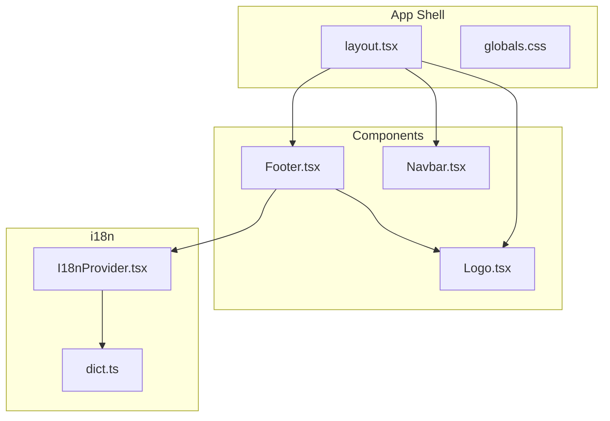
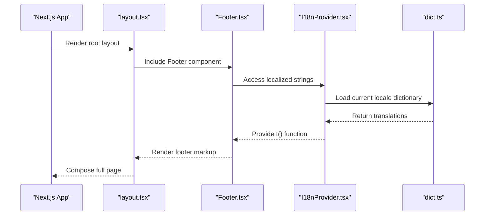
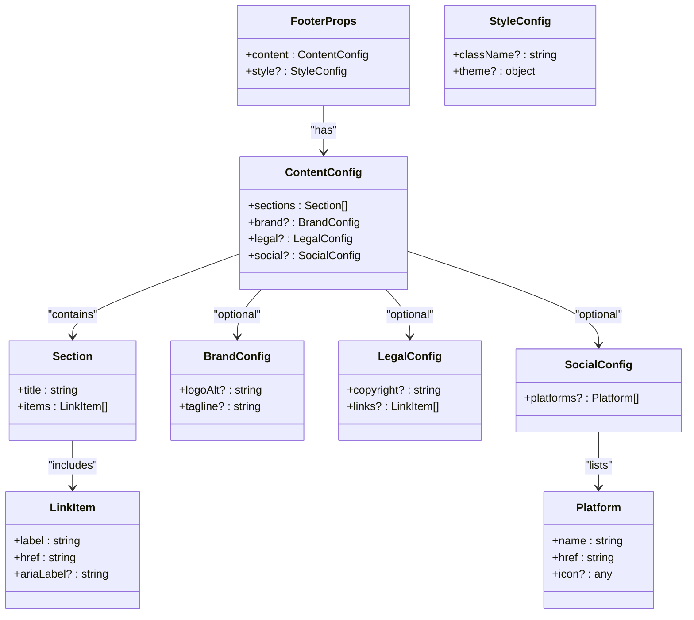
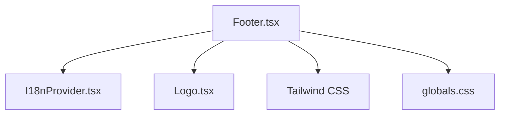

# Layout Components

<cite>
**Referenced Files in This Document**
- [Footer.tsx](file://src/components/Footer.tsx)
- [layout.tsx](file://src/app/layout.tsx)
- [I18nProvider.tsx](file://src/i18n/I18nProvider.tsx)
- [dict.ts](file://src/i18n/dict.ts)
- [Logo.tsx](file://src/components/Logo.tsx)
- [Navbar.tsx](file://src/components/Navbar.tsx)
- [tailwind.config.ts](file://tailwind.config.ts)
- [globals.css](file://src/app/globals.css)
</cite>

## Table of Contents
1. [Introduction](#introduction)
2. [Project Structure](#project-structure)
3. [Core Components](#core-components)
4. [Architecture Overview](#architecture-overview)
5. [Detailed Component Analysis](#detailed-component-analysis)
6. [Dependency Analysis](#dependency-analysis)
7. [Performance Considerations](#performance-considerations)
8. [Troubleshooting Guide](#troubleshooting-guide)
9. [Conclusion](#conclusion)
10. [Appendices](#appendices)

## Introduction
This document provides comprehensive documentation for layout components with a focus on the Footer component. It explains how the footer organizes links, branding elements, legal information, and social media integration. It also covers responsive behavior across screen sizes, accessibility features (semantic HTML and keyboard navigation), prop interfaces for customization, usage examples for extending content, SEO considerations, internationalization support, and maintenance best practices for frequently updated content.

## Project Structure
The project is organized into feature-based directories under src:
- app: Next.js application shell and global styles
- components: Reusable UI components including Footer, Navbar, Logo, and others
- i18n: Internationalization provider and dictionary
- data: Static data used by various components
- lib: Shared libraries and utilities



**Diagram sources**
- [layout.tsx](file://src/app/layout.tsx)
- [Footer.tsx](file://src/components/Footer.tsx)
- [Navbar.tsx](file://src/components/Navbar.tsx)
- [Logo.tsx](file://src/components/Logo.tsx)
- [I18nProvider.tsx](file://src/i18n/I18nProvider.tsx)
- [dict.ts](file://src/i18n/dict.ts)

**Section sources**
- [layout.tsx](file://src/app/layout.tsx)
- [Footer.tsx](file://src/components/Footer.tsx)
- [I18nProvider.tsx](file://src/i18n/I18nProvider.tsx)
- [dict.ts](file://src/i18n/dict.ts)

## Core Components
- Footer: The main layout component that renders site-wide footer content, including link groups, branding, legal text, and social links. It integrates with i18n for localized strings and uses Tailwind classes for responsive design.
- Navbar: Primary navigation component placed above the footer in the page layout.
- Logo: Branding asset component used within the footer and navbar.
- I18nProvider and dict: Internationalization setup and language dictionaries used to localize footer content.

Key responsibilities:
- Organize footer sections (links, branding, legal, social)
- Provide accessible markup and keyboard navigation
- Support responsive layouts via Tailwind
- Enable localization through i18n

**Section sources**
- [Footer.tsx](file://src/components/Footer.tsx)
- [Navbar.tsx](file://src/components/Navbar.tsx)
- [Logo.tsx](file://src/components/Logo.tsx)
- [I18nProvider.tsx](file://src/i18n/I18nProvider.tsx)
- [dict.ts](file://src/i18n/dict.ts)

## Architecture Overview
The Footer is embedded within the application layout and consumes i18n resources to render localized content. Styling is handled by Tailwind CSS, while semantic HTML ensures accessibility.



**Diagram sources**
- [layout.tsx](file://src/app/layout.tsx)
- [Footer.tsx](file://src/components/Footer.tsx)
- [I18nProvider.tsx](file://src/i18n/I18nProvider.tsx)
- [dict.ts](file://src/i18n/dict.ts)

## Detailed Component Analysis

### Footer Component
Responsibilities:
- Renders multiple link sections (e.g., product, company, support)
- Displays branding via Logo
- Shows legal information (copyright, terms, privacy)
- Integrates social media links
- Uses i18n for localized labels
- Applies responsive Tailwind classes for mobile, tablet, and desktop layouts
- Ensures semantic HTML structure and keyboard navigability

Prop interface overview:
- content: Object defining sections and their items
  - sections: Array of section objects
    - title: Section heading string
    - items: Array of link objects
      - label: Display text (localized or static)
      - href: Target URL
      - ariaLabel?: Optional accessible label
  - brand?: Branding configuration
    - logoAlt?: Alt text for logo image
    - tagline?: Tagline string
  - legal?: Legal information configuration
    - copyright?: Copyright notice
    - links?: Array of legal link objects (label, href)
  - social?: Social media configuration
    - platforms?: Array of platform objects
      - name: Platform name
      - href: Profile URL
      - icon?: Icon identifier or component reference
- style?: Styling overrides
  - className?: Additional Tailwind classes
  - theme?: Color scheme tokens if provided

Behavior and UX:
- Responsive grid/flex layout adapts from single-column on small screens to multi-column on larger screens
- Keyboard navigation supported via native anchor elements; focus states styled for visibility
- Semantic tags include nav, ul, li, a, p, and appropriate headings for each section
- Accessibility attributes such as aria-label are applied where needed

SEO considerations:
- Use descriptive link labels for crawlers
- Avoid excessive dynamic content in footer; prefer static or cached data
- Ensure canonical URLs and proper href values

Internationalization:
- All user-facing strings should be sourced from i18n dictionaries
- Provide fallbacks for missing keys
- Support right-to-left languages if applicable

Maintenance best practices:
- Centralize link configurations in data files when possible
- Version control changes to footer content
- Add tests for critical link validity and accessibility checks



**Diagram sources**
- [Footer.tsx](file://src/components/Footer.tsx)

Usage examples:
- Basic footer with default sections and branding
- Extended footer adding newsletter signup form and contact details
- Custom styling using className and theme props

Accessibility checklist:
- Semantic HTML structure (nav, headings, lists)
- Keyboard navigable links with visible focus states
- Descriptive aria-labels for non-text elements
- Sufficient color contrast for links and text

Responsive behavior:
- Single column on mobile devices
- Two or three columns on tablets and desktops
- Flexible spacing and typography scaling

**Section sources**
- [Footer.tsx](file://src/components/Footer.tsx)
- [I18nProvider.tsx](file://src/i18n/I18nProvider.tsx)
- [dict.ts](file://src/i18n/dict.ts)

### Integration with Layout and i18n
The layout composes the Footer alongside other layout elements. The i18n provider supplies translation functions to the Footer, ensuring all labels are localized based on the active locale.

```mermaid
flowchart TD
Start(["Render Page"]) --> Layout["layout.tsx"]
Layout --> Footer["Footer.tsx"]
Footer --> I18N["I18nProvider.tsx"]
I18N --> Dict["dict.ts"]
Dict --> |Translations| I18N
I18N --> |t() function| Footer
Footer --> Render["Render Footer Markup"]
Render --> End(["Page Complete"])
```

**Diagram sources**
- [layout.tsx](file://src/app/layout.tsx)
- [Footer.tsx](file://src/components/Footer.tsx)
- [I18nProvider.tsx](file://src/i18n/I18nProvider.tsx)
- [dict.ts](file://src/i18n/dict.ts)

**Section sources**
- [layout.tsx](file://src/app/layout.tsx)
- [Footer.tsx](file://src/components/Footer.tsx)
- [I18nProvider.tsx](file://src/i18n/I18nProvider.tsx)
- [dict.ts](file://src/i18n/dict.ts)

## Dependency Analysis
The Footer depends on:
- i18n provider for localized strings
- Logo component for branding visuals
- Tailwind CSS for styling
- Global styles for base typography and resets



**Diagram sources**
- [Footer.tsx](file://src/components/Footer.tsx)
- [I18nProvider.tsx](file://src/i18n/I18nProvider.tsx)
- [Logo.tsx](file://src/components/Logo.tsx)
- [tailwind.config.ts](file://tailwind.config.ts)
- [globals.css](file://src/app/globals.css)

**Section sources**
- [Footer.tsx](file://src/components/Footer.tsx)
- [I18nProvider.tsx](file://src/i18n/I18nProvider.tsx)
- [Logo.tsx](file://src/components/Logo.tsx)
- [tailwind.config.ts](file://tailwind.config.ts)
- [globals.css](file://src/app/globals.css)

## Performance Considerations
- Keep footer content static or memoized to avoid unnecessary re-renders
- Use lazy loading for heavy assets like logos or icons if they are not critical for initial paint
- Minimize runtime computations in rendering paths; prefer precomputed link structures
- Leverage Tailwind’s utility classes to reduce CSS bundle size

[No sources needed since this section provides general guidance]

## Troubleshooting Guide
Common issues and resolutions:
- Missing translations: Ensure all keys exist in the dictionary and provide fallbacks
- Broken links: Validate href values and use aria-labels for clarity
- Focus visibility: Verify focus styles are visible and meet contrast requirements
- Responsive layout problems: Check Tailwind breakpoints and container widths
- i18n provider not available: Confirm the provider wraps the app tree correctly

**Section sources**
- [Footer.tsx](file://src/components/Footer.tsx)
- [I18nProvider.tsx](file://src/i18n/I18nProvider.tsx)
- [dict.ts](file://src/i18n/dict.ts)

## Conclusion
The Footer component serves as a foundational layout element that organizes links, branding, legal information, and social media integrations. It emphasizes accessibility, responsiveness, and internationalization. By following the prop interfaces and best practices outlined here, teams can extend and maintain the footer effectively while ensuring a consistent user experience across devices and locales.

[No sources needed since this section summarizes without analyzing specific files]

## Appendices

### Prop Interface Reference
- content.sections[].items[].label: Localized display text
- content.sections[].items[].href: Destination URL
- content.brand.logoAlt: Alternative text for logo
- content.brand.tagline: Short brand message
- content.legal.copyright: Copyright notice
- content.social.platforms[].name: Platform identifier
- style.className: Additional Tailwind classes
- style.theme: Optional theme tokens

### Usage Examples
- Extend with newsletter signup: Add a new section with form fields and submit action
- Add contact information: Include phone, email, and address items in a dedicated section
- Customize styling: Apply theme tokens or className overrides for brand-specific looks

[No sources needed since this section provides general guidance]