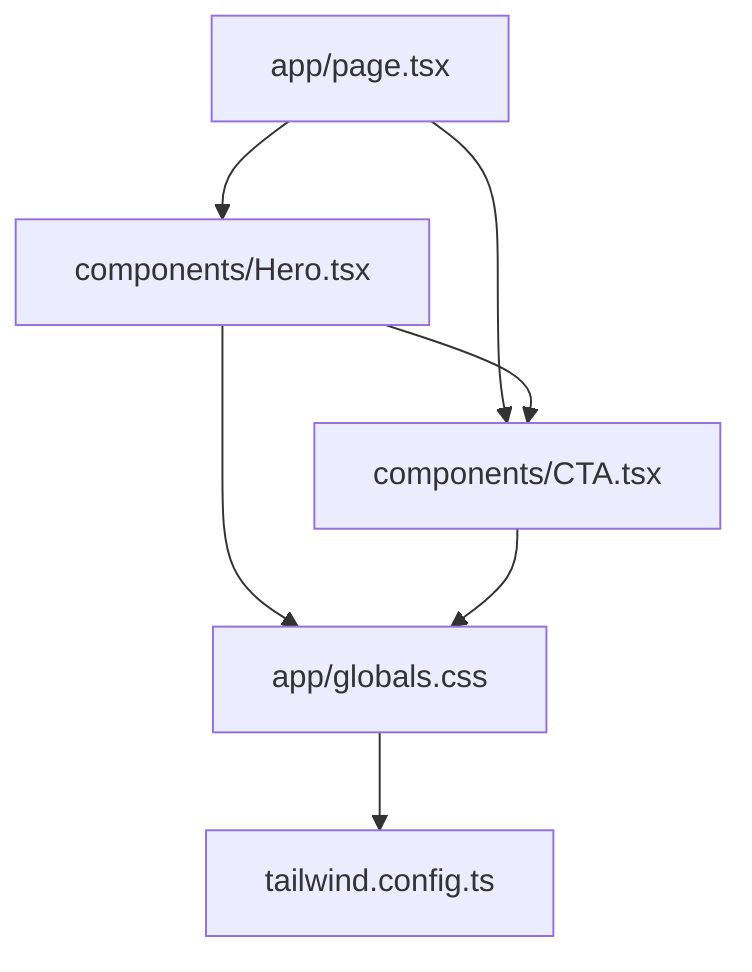
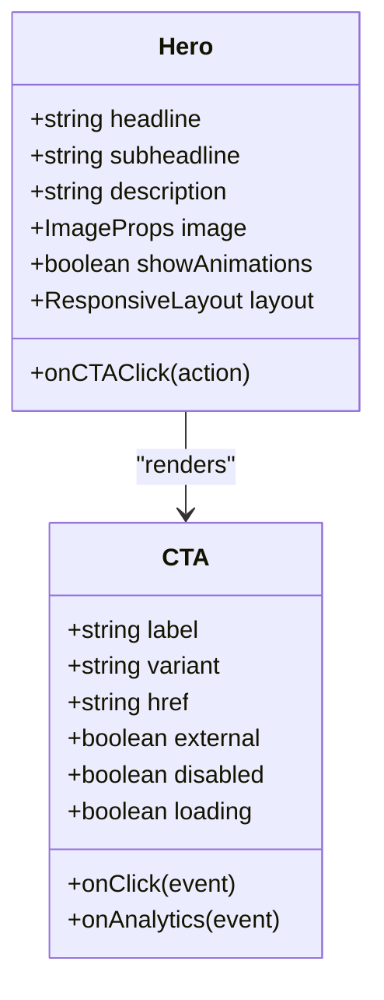
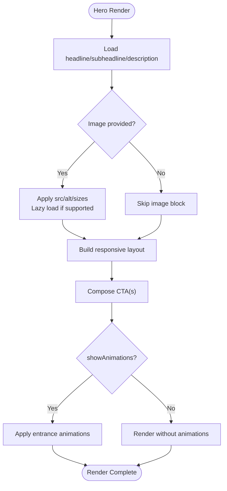
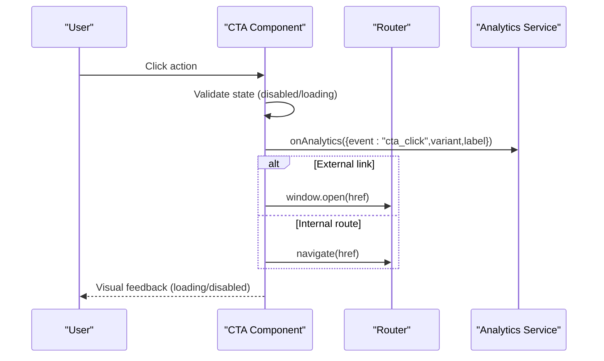
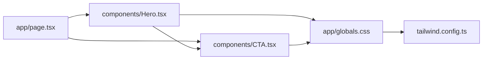

# Marketing Components

<cite>
**Referenced Files in This Document**
- [Hero.tsx](file://src/components/Hero.tsx)
- [CTA.tsx](file://src/components/CTA.tsx)
- [page.tsx](file://src/app/page.tsx)
- [globals.css](file://src/app/globals.css)
- [tailwind.config.ts](file://tailwind.config.ts)
</cite>

## Table of Contents
1. [Introduction](#introduction)
2. [Project Structure](#project-structure)
3. [Core Components](#core-components)
4. [Architecture Overview](#architecture-overview)
5. [Detailed Component Analysis](#detailed-component-analysis)
6. [Dependency Analysis](#dependency-analysis)
7. [Performance Considerations](#performance-considerations)
8. [Troubleshooting Guide](#troubleshooting-guide)
9. [Conclusion](#conclusion)
10. [Appendices](#appendices)

## Introduction
This document provides comprehensive documentation for marketing-focused components, specifically the Hero and CTA (Call-to-Action) components. It explains layout structure, messaging hierarchy, image handling, integration patterns with call-to-action elements, prop interfaces, animation options, responsive behavior, accessibility compliance, usage examples, A/B testing considerations, performance optimization, and cross-browser compatibility requirements. The goal is to help developers build effective marketing layouts that drive user engagement and conversions.

## Project Structure
The marketing components are implemented as reusable React components under src/components. The Hero component defines the primary marketing section with headline, subheadline, imagery, and integrated CTAs. The CTA component encapsulates button/link behaviors, variants, and tracking hooks. These components are consumed by the application page to assemble marketing sections.

**Diagram sources**
- [page.tsx:1-200](file://src/app/page.tsx#L1-L200)
- [Hero.tsx:1-200](file://src/components/Hero.tsx#L1-L200)
- [CTA.tsx:1-200](file://src/components/CTA.tsx#L1-L200)
- [globals.css:1-200](file://src/app/globals.css#L1-L200)
- [tailwind.config.ts:1-200](file://tailwind.config.ts#L1-L200)

**Section sources**
- [page.tsx:1-200](file://src/app/page.tsx#L1-L200)
- [Hero.tsx:1-200](file://src/components/Hero.tsx#L1-L200)
- [CTA.tsx:1-200](file://src/components/CTA.tsx#L1-L200)
- [globals.css:1-200](file://src/app/globals.css#L1-L200)
- [tailwind.config.ts:1-200](file://tailwind.config.ts#L1-L200)

## Core Components
- Hero: A full-width marketing section that presents a clear value proposition through a structured messaging hierarchy (headline, subheadline, supporting copy), hero imagery or media, and one or more integrated CTAs. It supports responsive layouts, optional animations, and accessible markup.
- CTA: A flexible component for buttons and links that drives user actions. It includes variants (primary, secondary, outline, ghost), link handling (internal navigation, external URLs), event callbacks for conversion tracking, and keyboard/mouse accessibility features.

Key responsibilities:
- Hero: Layout composition, content hierarchy, image/media handling, responsive breakpoints, animation triggers, and CTA integration points.
- CTA: Action semantics, variant styling, link routing, analytics/tracking hooks, focus management, and accessibility attributes.

**Section sources**
- [Hero.tsx:1-200](file://src/components/Hero.tsx#L1-L200)
- [CTA.tsx:1-200](file://src/components/CTA.tsx#L1-L200)

## Architecture Overview
The Hero component composes content and integrates one or more CTA instances. Styling is primarily handled via utility classes and global styles, while configuration and theme tokens come from Tailwind. The application page orchestrates these components to render marketing sections.

**Diagram sources**
- [Hero.tsx:1-200](file://src/components/Hero.tsx#L1-L200)
- [CTA.tsx:1-200](file://src/components/CTA.tsx#L1-L200)

## Detailed Component Analysis

### Hero Component Analysis
Responsibilities:
- Messaging hierarchy: Headline > Subheadline > Supporting copy.
- Image handling: Supports static images, responsive sizes, lazy loading, and fallbacks.
- Integration with CTAs: One or multiple CTAs placed within the content area or alongside imagery.
- Responsive behavior: Adapts layout for mobile, tablet, and desktop; stacks content vertically on small screens.
- Animation options: Optional entrance animations triggered on mount or scroll visibility.
- Accessibility: Semantic headings, alt text for images, proper focus order, and ARIA attributes where needed.

Prop interface highlights:
- Content: headline, subheadline, description, image metadata (src, alt, sizes).
- Behavior: showAnimations, layout mode, onCTACallback.
- Accessibility: aria-labels, role attributes, keyboard support.

Usage patterns:
- Single-column layout for mobile with stacked content and full-width image.
- Two-column layout for desktop with image on one side and text/CTAs on the other.
- Centered layout for campaigns emphasizing a single strong message and CTA.

**Diagram sources**
- [Hero.tsx:1-200](file://src/components/Hero.tsx#L1-L200)

**Section sources**
- [Hero.tsx:1-200](file://src/components/Hero.tsx#L1-L200)

### CTA Component Analysis
Responsibilities:
- Button/link semantics: Renders as <button> or <a> based on href presence.
- Variants: Primary, Secondary, Outline, Ghost with distinct visual emphasis.
- Link handling: Internal routing vs external URL opening; target and rel attributes for security.
- Conversion tracking: Exposes onClick and onAnalytics hooks to capture events.
- States: Disabled and loading states with appropriate UI feedback.
- Accessibility: Focusable, keyboard operable, aria-disabled, aria-busy, and screen reader labels.

Prop interface highlights:
- Label: string for button text.
- Variant: enum controlling style.
- Navigation: href, external boolean.
- Events: onClick, onAnalytics.
- States: disabled, loading.

Conversion flow example:

**Diagram sources**
- [CTA.tsx:1-200](file://src/components/CTA.tsx#L1-L200)

**Section sources**
- [CTA.tsx:1-200](file://src/components/CTA.tsx#L1-L200)

### Usage Examples and Patterns
- Effective marketing layout:
  - Use a compelling headline and concise subheadline to communicate value quickly.
  - Place a prominent primary CTA above the fold; add a secondary CTA for alternative actions.
  - Optimize hero image for performance (responsive sizes, lazy loading) and ensure meaningful alt text.
- Conversion optimization patterns:
  - Highlight urgency or benefit in CTA label (e.g., “Start Free Trial”).
  - Use contrasting colors for primary CTA; keep secondary CTA subtle.
  - Track clicks via onAnalytics and measure conversion rates per variant.

[No sources needed since this section provides general guidance]

## Dependency Analysis
- Hero depends on CTA for action elements.
- Both components rely on Tailwind utilities for styling and global CSS for base styles.
- Application page composes Hero and CTA to render marketing sections.

**Diagram sources**
- [page.tsx:1-200](file://src/app/page.tsx#L1-L200)
- [Hero.tsx:1-200](file://src/components/Hero.tsx#L1-L200)
- [CTA.tsx:1-200](file://src/components/CTA.tsx#L1-L200)
- [globals.css:1-200](file://src/app/globals.css#L1-L200)
- [tailwind.config.ts:1-200](file://tailwind.config.ts#L1-L200)

**Section sources**
- [page.tsx:1-200](file://src/app/page.tsx#L1-L200)
- [Hero.tsx:1-200](file://src/components/Hero.tsx#L1-L200)
- [CTA.tsx:1-200](file://src/components/CTA.tsx#L1-L200)
- [globals.css:1-200](file://src/app/globals.css#L1-L200)
- [tailwind.config.ts:1-200](file://tailwind.config.ts#L1-L200)

## Performance Considerations
- Image optimization:
  - Use responsive images with appropriate sizes and formats.
  - Implement lazy loading for off-screen images.
  - Provide fallbacks for unsupported formats.
- Animation performance:
  - Prefer CSS transitions/animations over heavy JS libraries.
  - Use will-change sparingly and only when necessary.
  - Disable animations for users preferring reduced motion.
- Rendering efficiency:
  - Memoize expensive computations in Hero and CTA props.
  - Avoid unnecessary re-renders by stabilizing prop references.
- Network and caching:
  - Leverage browser caching for static assets.
  - Preload critical images and fonts when beneficial.

[No sources needed since this section provides general guidance]

## Troubleshooting Guide
Common issues and resolutions:
- Images not displaying:
  - Verify src paths and availability.
  - Check alt text and fallback strategies.
  - Ensure responsive sizes are correctly configured.
- CTA not triggering actions:
  - Confirm href validity and external/internal routing setup.
  - Inspect onClick and onAnalytics handlers for errors.
  - Validate disabled/loading states preventing interaction.
- Accessibility problems:
  - Ensure semantic HTML and ARIA attributes are present.
  - Test keyboard navigation and screen reader announcements.
  - Verify color contrast ratios for all variants.

**Section sources**
- [Hero.tsx:1-200](file://src/components/Hero.tsx#L1-L200)
- [CTA.tsx:1-200](file://src/components/CTA.tsx#L1-L200)

## Conclusion
The Hero and CTA components form a robust foundation for marketing-focused layouts. By adhering to the documented prop interfaces, responsive patterns, accessibility guidelines, and performance best practices, teams can create high-converting experiences. Incorporate A/B testing to refine messaging and CTAs, monitor analytics for insights, and maintain cross-browser compatibility for broad reach.

[No sources needed since this section summarizes without analyzing specific files]

## Appendices

### Prop Interfaces Summary
- Hero props:
  - Content: headline, subheadline, description
  - Media: image (src, alt, sizes)
  - Behavior: showAnimations, layout mode, onCTACallback
  - Accessibility: aria-labels, roles
- CTA props:
  - Label: string
  - Variant: primary | secondary | outline | ghost
  - Navigation: href, external
  - Events: onClick, onAnalytics
  - States: disabled, loading

[No sources needed since this section provides general guidance]

### A/B Testing Considerations
- Test variations:
  - Headline and subheadline wording
  - CTA label and color variants
  - Image choices and placement
- Measurement:
  - Track click-through rates and conversion metrics
  - Segment by device and traffic source
- Iteration:
  - Use data to prioritize changes
  - Maintain consistent analytics tagging across variants

[No sources needed since this section provides general guidance]

### Cross-Browser Compatibility
- Supported browsers:
  - Latest versions of Chrome, Firefox, Safari, Edge
- Fallbacks:
  - Polyfills for older browsers if needed
  - Graceful degradation for advanced features
- Testing:
  - Validate layouts and interactions across devices and browsers
  - Address vendor-specific quirks in CSS and JS

[No sources needed since this section provides general guidance]