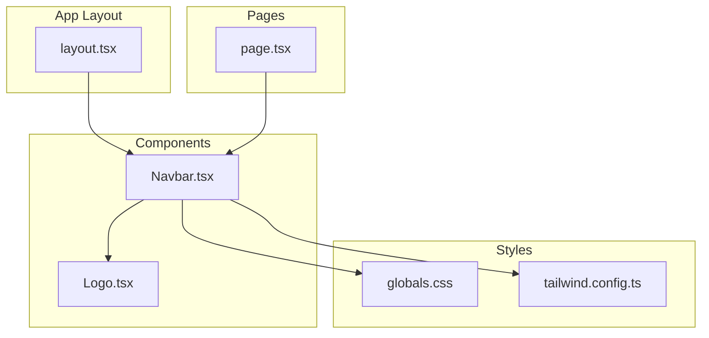
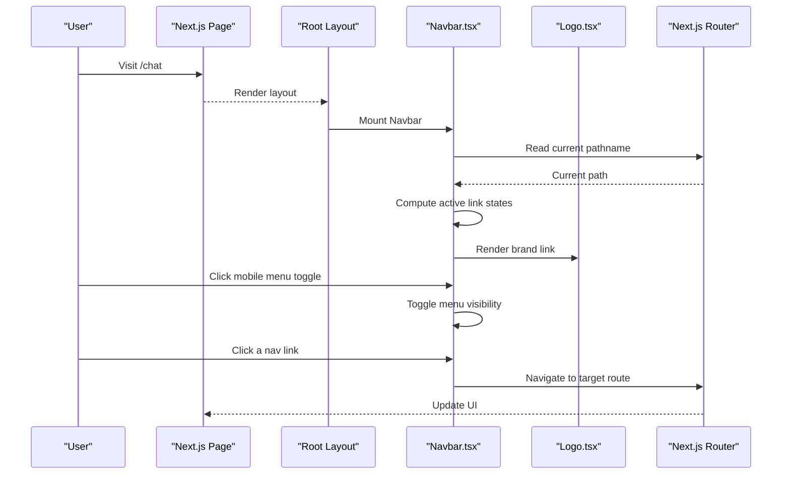
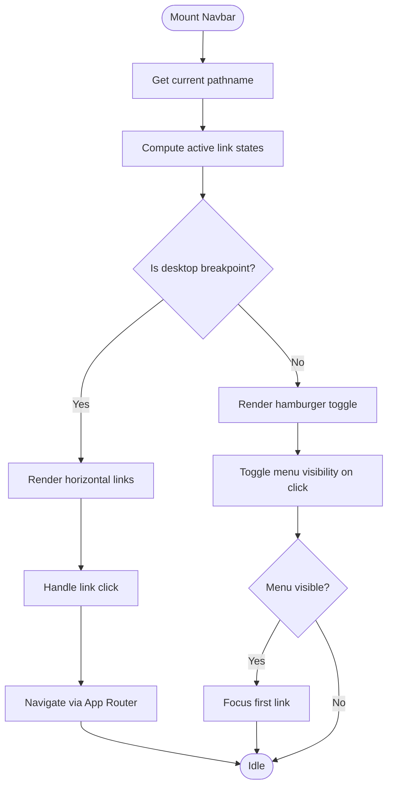
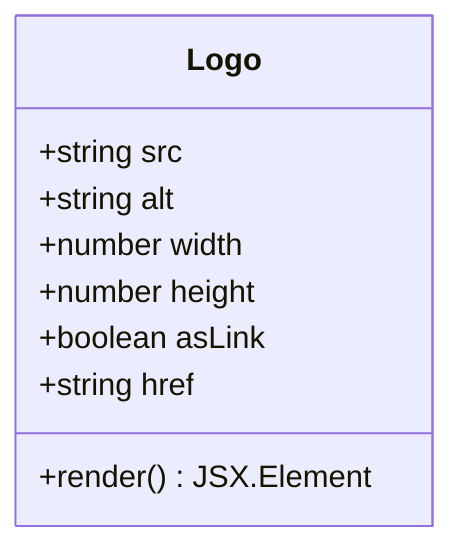
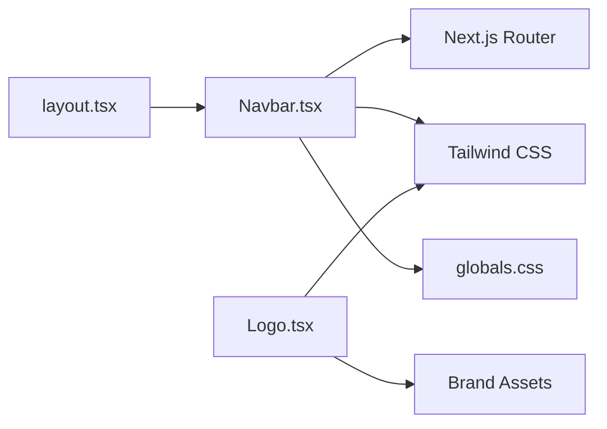

# Navigation Components

<cite>
**Referenced Files in This Document**
- [Navbar.tsx](file://src/components/Navbar.tsx)
- [Logo.tsx](file://src/components/Logo.tsx)
- [layout.tsx](file://src/app/layout.tsx)
- [page.tsx](file://src/app/page.tsx)
- [globals.css](file://src/app/globals.css)
- [tailwind.config.ts](file://tailwind.config.ts)
</cite>

## Update Summary
**Changes Made**
- Enhanced mobile menu functionality with improved hamburger menu responsiveness
- Updated responsive behavior for better mobile user experience
- Improved menu toggle interactions and accessibility features
- Refined active state management for better navigation feedback

## Table of Contents
1. [Introduction](#introduction)
2. [Project Structure](#project-structure)
3. [Core Components](#core-components)
4. [Architecture Overview](#architecture-overview)
5. [Detailed Component Analysis](#detailed-component-analysis)
6. [Dependency Analysis](#dependency-analysis)
7. [Performance Considerations](#performance-considerations)
8. [Troubleshooting Guide](#troubleshooting-guide)
9. [Conclusion](#conclusion)

## Introduction
This document provides comprehensive documentation for the navigation components: Navbar and Logo. It explains responsive behavior, mobile menu functionality, routing integration with Next.js App Router, active state management, accessibility features, styling customization options, and usage patterns across pages. The goal is to help developers implement consistent, accessible, and performant navigation throughout the application.

**Updated** Enhanced navigation system with improved mobile responsiveness and hamburger menu functionality.

## Project Structure
The navigation components are implemented as reusable React components under src/components and integrated into the application layout and pages. The key files include:
- Navbar.tsx: Main navigation bar component with responsive menu toggling and routing integration
- Logo.tsx: Brand logo component with responsive sizing and accessibility attributes
- layout.tsx: Root layout that includes the Navbar globally
- page.tsx: Example page demonstrating how Navbar integrates with routes
- globals.css and tailwind.config.ts: Global styles and Tailwind configuration used by navigation components

**Diagram sources**
- [layout.tsx](file://src/app/layout.tsx)
- [Navbar.tsx](file://src/components/Navbar.tsx)
- [Logo.tsx](file://src/components/Logo.tsx)
- [page.tsx](file://src/app/page.tsx)
- [globals.css](file://src/app/globals.css)
- [tailwind.config.ts](file://tailwind.config.ts)

**Section sources**
- [layout.tsx](file://src/app/layout.tsx)
- [Navbar.tsx](file://src/components/Navbar.tsx)
- [Logo.tsx](file://src/components/Logo.tsx)
- [page.tsx](file://src/app/page.tsx)
- [globals.css](file://src/app/globals.css)
- [tailwind.config.ts](file://tailwind.config.ts)

## Core Components
- Navbar: Provides top-level navigation with links, a mobile menu toggle, and active link highlighting based on current route. Integrates with Next.js App Router using client-side navigation hooks and supports keyboard navigation and screen reader labels.
- Logo: Renders the brand mark with responsive sizing, alt text, and focus handling. Designed to be lightweight and accessible.

Key responsibilities:
- Responsive breakpoints and mobile menu toggling
- Active state calculation from current pathname
- Accessibility attributes (aria-expanded, aria-label, role, tabIndex)
- Styling via Tailwind classes and CSS variables where applicable

**Updated** Enhanced mobile menu functionality with improved hamburger menu responsiveness and better touch interactions.

**Section sources**
- [Navbar.tsx](file://src/components/Navbar.tsx)
- [Logo.tsx](file://src/components/Logo.tsx)

## Architecture Overview
The Navbar is included at the root layout level so it appears consistently across all pages. It uses Next.js App Router's client-side navigation utilities to determine the active route and to navigate without full page reloads. The Logo component is embedded within the Navbar and can also be reused elsewhere if needed.

**Diagram sources**
- [layout.tsx](file://src/app/layout.tsx)
- [Navbar.tsx](file://src/components/Navbar.tsx)
- [Logo.tsx](file://src/components/Logo.tsx)
- [page.tsx](file://src/app/page.tsx)

## Detailed Component Analysis

### Navbar Component
Responsibilities:
- Displays primary navigation links
- Implements responsive design with a collapsible mobile menu
- Manages active link state based on current route
- Integrates with Next.js App Router for client-side navigation
- Supports keyboard navigation and ARIA attributes for accessibility

Responsive behavior:
- Desktop: Horizontal link list visible
- Mobile: Hamburger button reveals a vertical menu; menu state toggled via event handlers

Active state management:
- Compares current pathname against each link's href to apply an "active" style class

Mobile menu functionality:
- Toggle button updates local state controlling menu visibility
- Focus management ensures keyboard users can open/close and navigate links
- **Enhanced** Improved hamburger menu responsiveness with better touch interactions and smoother animations

Routing integration:
- Uses Next.js App Router client-side navigation APIs to avoid full-page reloads
- Ensures links use proper href values compatible with App Router

Accessibility:
- Menu toggle uses aria-expanded to reflect state
- Links have appropriate roles and labels where necessary
- Focus order follows logical reading sequence
- **Enhanced** Better keyboard navigation support and screen reader compatibility

Styling customization:
- Primary styling via Tailwind utility classes
- Optional CSS variables or theme tokens can override colors, spacing, and typography

Event handlers:
- onClick for menu toggle
- onKeyDown for Enter/Space activation on toggle and links
- onFocus/onBlur for focus ring management
- **Enhanced** Improved touch event handling for mobile devices

Usage example pattern:
- Include <Navbar /> in the root layout so it appears on every page
- Ensure routes are defined in the App Router structure for correct active state detection

**Updated** Enhanced mobile menu functionality with improved hamburger menu responsiveness and better touch interactions.

**Diagram sources**
- [Navbar.tsx](file://src/components/Navbar.tsx)

**Section sources**
- [Navbar.tsx](file://src/components/Navbar.tsx)

### Logo Component
Responsibilities:
- Renders the brand logo image or SVG
- Applies responsive sizing classes
- Provides alt text and focus styles for accessibility
- Can act as a navigational link to the home route

Brand asset handling:
- Accepts props for image source, dimensions, and alt text
- Supports both static assets and dynamic sources

Responsive sizing:
- Uses Tailwind classes to scale appropriately across breakpoints
- Maintains aspect ratio and prevents layout shift

Accessibility:
- Alt text describes the brand
- Keyboard focusable when used as a link
- Sufficient contrast and focus indicators

Integration patterns:
- Embedded within Navbar's brand area
- Reusable across other sections if needed

**Diagram sources**
- [Logo.tsx](file://src/components/Logo.tsx)

**Section sources**
- [Logo.tsx](file://src/components/Logo.tsx)

### Integration with Next.js App Router
- Active state: Derived from the current pathname provided by the router context
- Navigation: Client-side transitions via App Router APIs ensure smooth UX
- Consistency: Including Navbar in the root layout guarantees uniform navigation across all routes

Best practices:
- Use relative paths for internal links
- Avoid external redirects inside navigation unless intentional
- Keep link lists stable to prevent unnecessary re-renders

**Section sources**
- [layout.tsx](file://src/app/layout.tsx)
- [page.tsx](file://src/app/page.tsx)
- [Navbar.tsx](file://src/components/Navbar.tsx)

## Dependency Analysis
The Navbar depends on:
- Next.js App Router for active state and navigation
- Tailwind CSS for styling
- Optional global CSS variables for theme overrides

The Logo depends on:
- Image/SVG assets
- Tailwind CSS for responsive sizing

**Diagram sources**
- [Navbar.tsx](file://src/components/Navbar.tsx)
- [Logo.tsx](file://src/components/Logo.tsx)
- [layout.tsx](file://src/app/layout.tsx)
- [globals.css](file://src/app/globals.css)
- [tailwind.config.ts](file://tailwind.config.ts)

**Section sources**
- [Navbar.tsx](file://src/components/Navbar.tsx)
- [Logo.tsx](file://src/components/Logo.tsx)
- [layout.tsx](file://src/app/layout.tsx)
- [globals.css](file://src/app/globals.css)
- [tailwind.config.ts](file://tailwind.config.ts)

## Performance Considerations
- Minimize re-renders: Memoize computed active states and avoid heavy logic in render
- Defer non-critical assets: Load offscreen images lazily if needed
- Reduce bundle size: Keep navigation code tree-shakeable and avoid importing large libraries
- Optimize images: Use appropriate formats and sizes for Logo assets
- Debounce resize handlers: If measuring breakpoints manually, debounce to avoid excessive recalculations
- **Enhanced** Optimized mobile menu animations for smoother user experience

[No sources needed since this section provides general guidance]

## Troubleshooting Guide
Common issues and resolutions:
- Active link not updating: Verify pathname comparison logic and ensure router context is available
- Mobile menu not closing on outside click: Implement click-outside handler and focus management
- Keyboard navigation broken: Ensure tab order and aria-expanded reflect actual state
- Logo alt text missing: Provide descriptive alt text for screen readers
- Styles not applying: Confirm Tailwind classes and CSS variables are correctly configured
- **Enhanced** Mobile menu responsiveness issues: Check media query breakpoints and touch event handlers

**Section sources**
- [Navbar.tsx](file://src/components/Navbar.tsx)
- [Logo.tsx](file://src/components/Logo.tsx)
- [globals.css](file://src/app/globals.css)
- [tailwind.config.ts](file://tailwind.config.ts)

## Conclusion
The Navbar and Logo components provide a robust, accessible, and responsive navigation foundation for the application. By integrating seamlessly with Next.js App Router and leveraging Tailwind CSS, they deliver a consistent user experience across devices. Following the guidelines in this document will help maintain high quality, performance, and accessibility standards.

**Updated** Enhanced navigation system with improved mobile responsiveness and hamburger menu functionality provides a better user experience across all devices.

[No sources needed since this section summarizes without analyzing specific files]