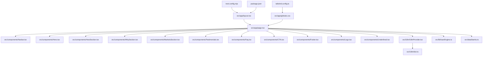
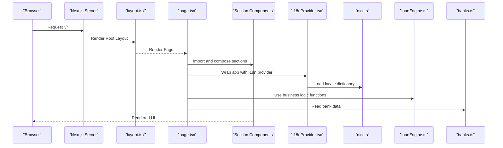
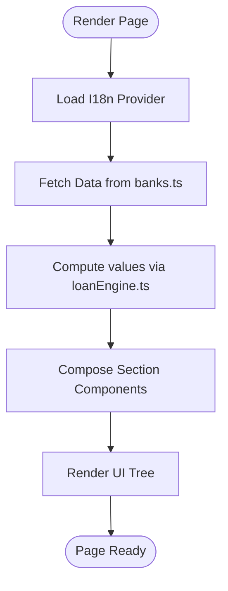
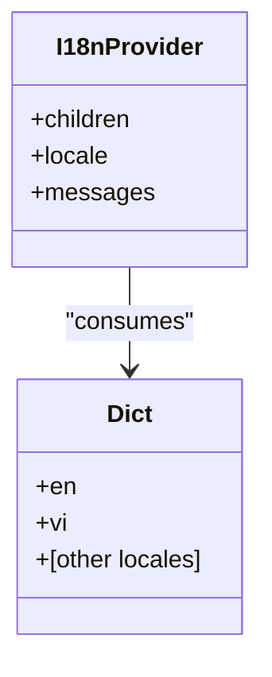
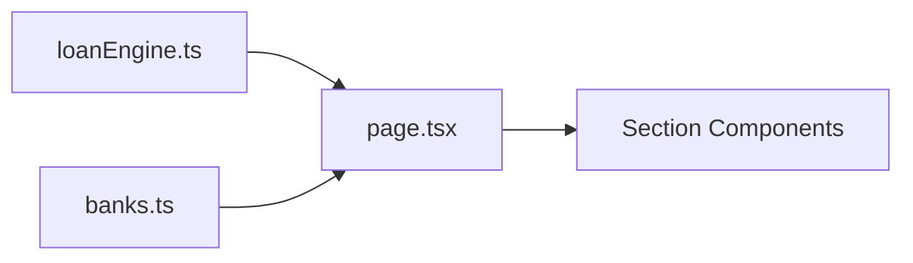
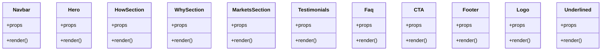
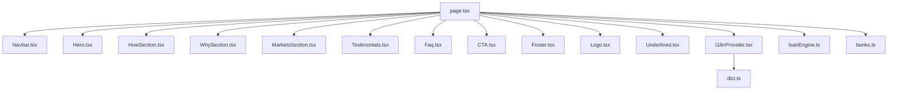

# Package Detail Component

<cite>
**Referenced Files in This Document**
- [page.tsx](file://src/app/page.tsx)
- [layout.tsx](file://src/app/layout.tsx)
- [globals.css](file://src/app/globals.css)
- [Navbar.tsx](file://src/components/Navbar.tsx)
- [Hero.tsx](file://src/components/Hero.tsx)
- [HowSection.tsx](file://src/components/HowSection.tsx)
- [WhySection.tsx](file://src/components/WhySection.tsx)
- [MarketsSection.tsx](file://src/components/MarketsSection.tsx)
- [Testimonials.tsx](file://src/components/Testimonials.tsx)
- [Faq.tsx](file://src/components/Faq.tsx)
- [CTA.tsx](file://src/components/CTA.tsx)
- [Footer.tsx](file://src/components/Footer.tsx)
- [Logo.tsx](file://src/components/Logo.tsx)
- [Underlined.tsx](file://src/components/Underlined.tsx)
- [I18nProvider.tsx](file://src/i18n/I18nProvider.tsx)
- [dict.ts](file://src/i18n/dict.ts)
- [loanEngine.ts](file://src/lib/loanEngine.ts)
- [banks.ts](file://src/data/banks.ts)
- [package.json](file://package.json)
- [next.config.mjs](file://next.config.mjs)
- [tailwind.config.ts](file://tailwind.config.ts)
</cite>

## Table of Contents
1. [Introduction](#introduction)
2. [Project Structure](#project-structure)
3. [Core Components](#core-components)
4. [Architecture Overview](#architecture-overview)
5. [Detailed Component Analysis](#detailed-component-analysis)
6. [Dependency Analysis](#dependency-analysis)
7. [Performance Considerations](#performance-considerations)
8. [Troubleshooting Guide](#troubleshooting-guide)
9. [Conclusion](#conclusion)

## Introduction
This document provides a comprehensive overview and technical analysis of the Package Detail Component within the frontend-vaya Next.js application. It explains how the landing page composes multiple UI sections, integrates internationalization, and leverages shared libraries for business logic. The goal is to make the system understandable for both developers and non-technical stakeholders by combining high-level architecture with code-level insights.

## Project Structure
The project follows a standard Next.js App Router layout:
- Application pages live under src/app, with global styles and layout configuration.
- Reusable UI components are organized under src/components.
- Internationalization resources reside under src/i18n.
- Business logic and data utilities are placed under src/lib and src/data.
- Configuration files include Next.js, Tailwind CSS, TypeScript, and package management.

**Diagram sources**
- [layout.tsx](file://src/app/layout.tsx)
- [page.tsx](file://src/app/page.tsx)
- [globals.css](file://src/app/globals.css)
- [Navbar.tsx](file://src/components/Navbar.tsx)
- [Hero.tsx](file://src/components/Hero.tsx)
- [HowSection.tsx](file://src/components/HowSection.tsx)
- [WhySection.tsx](file://src/components/WhySection.tsx)
- [MarketsSection.tsx](file://src/components/MarketsSection.tsx)
- [Testimonials.tsx](file://src/components/Testimonials.tsx)
- [Faq.tsx](file://src/components/Faq.tsx)
- [CTA.tsx](file://src/components/CTA.tsx)
- [Footer.tsx](file://src/components/Footer.tsx)
- [Logo.tsx](file://src/components/Logo.tsx)
- [Underlined.tsx](file://src/components/Underlined.tsx)
- [I18nProvider.tsx](file://src/i18n/I18nProvider.tsx)
- [dict.ts](file://src/i18n/dict.ts)
- [loanEngine.ts](file://src/lib/loanEngine.ts)
- [banks.ts](file://src/data/banks.ts)
- [tailwind.config.ts](file://tailwind.config.ts)
- [next.config.mjs](file://next.config.mjs)
- [package.json](file://package.json)

**Section sources**
- [layout.tsx](file://src/app/layout.tsx)
- [page.tsx](file://src/app/page.tsx)
- [globals.css](file://src/app/globals.css)
- [package.json](file://package.json)
- [next.config.mjs](file://next.config.mjs)
- [tailwind.config.ts](file://tailwind.config.ts)

## Core Components
The Package Detail Component is implemented as the root page that orchestrates multiple section components to present loan packages and related information. Key responsibilities include:
- Composing the landing page from reusable sections (navbar, hero, how it works, why choose us, markets, testimonials, FAQ, call-to-action, footer).
- Integrating internationalization via a provider to render localized content.
- Consuming business logic and data modules for calculations and bank listings.

Key components and their roles:
- Navbar: Navigation and branding elements.
- Hero: Primary value proposition and entry point.
- HowSection: Step-by-step explanation of the process.
- WhySection: Benefits and differentiators.
- MarketsSection: Market-related information or options.
- Testimonials: Social proof and user feedback.
- Faq: Frequently asked questions and answers.
- CTA: Call-to-action to drive conversions.
- Footer: Site-wide links and legal information.
- Logo: Brand logo component.
- Underlined: Text styling helper for emphasis.

**Section sources**
- [page.tsx](file://src/app/page.tsx)
- [Navbar.tsx](file://src/components/Navbar.tsx)
- [Hero.tsx](file://src/components/Hero.tsx)
- [HowSection.tsx](file://src/components/HowSection.tsx)
- [WhySection.tsx](file://src/components/WhySection.tsx)
- [MarketsSection.tsx](file://src/components/MarketsSection.tsx)
- [Testimonials.tsx](file://src/components/Testimonials.tsx)
- [Faq.tsx](file://src/components/Faq.tsx)
- [CTA.tsx](file://src/components/CTA.tsx)
- [Footer.tsx](file://src/components/Footer.tsx)
- [Logo.tsx](file://src/components/Logo.tsx)
- [Underlined.tsx](file://src/components/Underlined.tsx)

## Architecture Overview
The application uses Next.js App Router with a clear separation between presentation (components), localization (i18n), and business logic (lib/data). The Page acts as an orchestrator, importing and rendering section components while passing necessary props and consuming shared utilities.

**Diagram sources**
- [layout.tsx](file://src/app/layout.tsx)
- [page.tsx](file://src/app/page.tsx)
- [I18nProvider.tsx](file://src/i18n/I18nProvider.tsx)
- [dict.ts](file://src/i18n/dict.ts)
- [loanEngine.ts](file://src/lib/loanEngine.ts)
- [banks.ts](file://src/data/banks.ts)

## Detailed Component Analysis

### Page Orchestration (Package Detail)
The page component composes all major sections and wires up internationalization and business logic. It serves as the central integration point for the Package Detail view.

**Diagram sources**
- [page.tsx](file://src/app/page.tsx)
- [I18nProvider.tsx](file://src/i18n/I18nProvider.tsx)
- [dict.ts](file://src/i18n/dict.ts)
- [loanEngine.ts](file://src/lib/loanEngine.ts)
- [banks.ts](file://src/data/banks.ts)

**Section sources**
- [page.tsx](file://src/app/page.tsx)

### Internationalization Integration
Internationalization is provided through a dedicated provider that loads localized dictionaries. The page wraps its content with this provider to ensure consistent language support across components.

**Diagram sources**
- [I18nProvider.tsx](file://src/i18n/I18nProvider.tsx)
- [dict.ts](file://src/i18n/dict.ts)

**Section sources**
- [I18nProvider.tsx](file://src/i18n/I18nProvider.tsx)
- [dict.ts](file://src/i18n/dict.ts)

### Business Logic and Data Modules
Business logic resides in a dedicated library module, while static data such as bank listings are stored in a data module. These are consumed by the page and relevant sections to compute results and display accurate information.

**Diagram sources**
- [loanEngine.ts](file://src/lib/loanEngine.ts)
- [banks.ts](file://src/data/banks.ts)
- [page.tsx](file://src/app/page.tsx)

**Section sources**
- [loanEngine.ts](file://src/lib/loanEngine.ts)
- [banks.ts](file://src/data/banks.ts)

### Section Components Composition
Each section component encapsulates a specific part of the Package Detail view. They receive props for text, data, and behavior, enabling reuse and maintainability.

**Diagram sources**
- [Navbar.tsx](file://src/components/Navbar.tsx)
- [Hero.tsx](file://src/components/Hero.tsx)
- [HowSection.tsx](file://src/components/HowSection.tsx)
- [WhySection.tsx](file://src/components/WhySection.tsx)
- [MarketsSection.tsx](file://src/components/MarketsSection.tsx)
- [Testimonials.tsx](file://src/components/Testimonials.tsx)
- [Faq.tsx](file://src/components/Faq.tsx)
- [CTA.tsx](file://src/components/CTA.tsx)
- [Footer.tsx](file://src/components/Footer.tsx)
- [Logo.tsx](file://src/components/Logo.tsx)
- [Underlined.tsx](file://src/components/Underlined.tsx)

**Section sources**
- [Navbar.tsx](file://src/components/Navbar.tsx)
- [Hero.tsx](file://src/components/Hero.tsx)
- [HowSection.tsx](file://src/components/HowSection.tsx)
- [WhySection.tsx](file://src/components/WhySection.tsx)
- [MarketsSection.tsx](file://src/components/MarketsSection.tsx)
- [Testimonials.tsx](file://src/components/Testimonials.tsx)
- [Faq.tsx](file://src/components/Faq.tsx)
- [CTA.tsx](file://src/components/CTA.tsx)
- [Footer.tsx](file://src/components/Footer.tsx)
- [Logo.tsx](file://src/components/Logo.tsx)
- [Underlined.tsx](file://src/components/Underlined.tsx)

## Dependency Analysis
The following diagram illustrates how the page depends on components, i18n, and business modules.

**Diagram sources**
- [page.tsx](file://src/app/page.tsx)
- [I18nProvider.tsx](file://src/i18n/I18nProvider.tsx)
- [dict.ts](file://src/i18n/dict.ts)
- [loanEngine.ts](file://src/lib/loanEngine.ts)
- [banks.ts](file://src/data/banks.ts)
- [Navbar.tsx](file://src/components/Navbar.tsx)
- [Hero.tsx](file://src/components/Hero.tsx)
- [HowSection.tsx](file://src/components/HowSection.tsx)
- [WhySection.tsx](file://src/components/WhySection.tsx)
- [MarketsSection.tsx](file://src/components/MarketsSection.tsx)
- [Testimonials.tsx](file://src/components/Testimonials.tsx)
- [Faq.tsx](file://src/components/Faq.tsx)
- [CTA.tsx](file://src/components/CTA.tsx)
- [Footer.tsx](file://src/components/Footer.tsx)
- [Logo.tsx](file://src/components/Logo.tsx)
- [Underlined.tsx](file://src/components/Underlined.tsx)

**Section sources**
- [page.tsx](file://src/app/page.tsx)

## Performance Considerations
- Prefer lazy loading for heavy sections if they are not immediately visible above the fold.
- Memoize expensive computations in business logic modules to avoid redundant recalculations.
- Keep data modules small and stable; consider fetching dynamic data at build time or via server-side methods when appropriate.
- Ensure Tailwind classes are optimized and unused styles are purged in production builds.

## Troubleshooting Guide
Common issues and resolutions:
- Internationalization not rendering: Verify the i18n provider is wrapping the correct tree and that the dictionary keys match component expectations.
- Missing data in sections: Confirm that data modules export the expected structures and that consumers read them correctly.
- Styling inconsistencies: Check Tailwind configuration and ensure global styles do not override component-specific styles unintentionally.
- Build errors: Validate TypeScript configurations and Next.js settings to ensure compatibility with dependencies.

**Section sources**
- [I18nProvider.tsx](file://src/i18n/I18nProvider.tsx)
- [dict.ts](file://src/i18n/dict.ts)
- [banks.ts](file://src/data/banks.ts)
- [globals.css](file://src/app/globals.css)
- [tailwind.config.ts](file://tailwind.config.ts)
- [next.config.mjs](file://next.config.mjs)
- [package.json](file://package.json)

## Conclusion
The Package Detail Component is structured around a clear separation of concerns: the page orchestrates UI sections, internationalization is centralized, and business logic is isolated in dedicated modules. This design promotes maintainability, testability, and scalability. By following the guidelines and diagrams presented here, developers can extend and customize the component effectively while preserving performance and clarity.