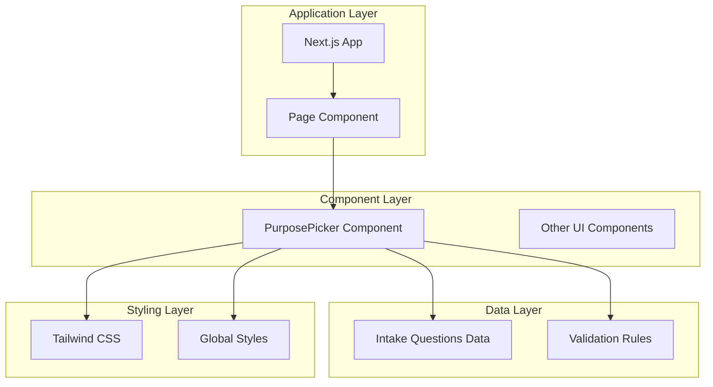
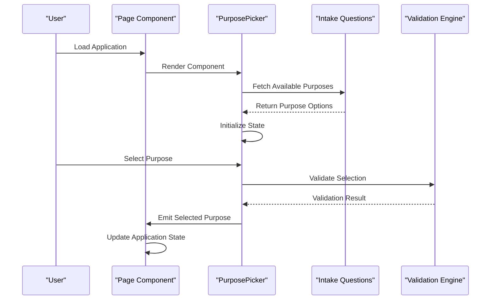
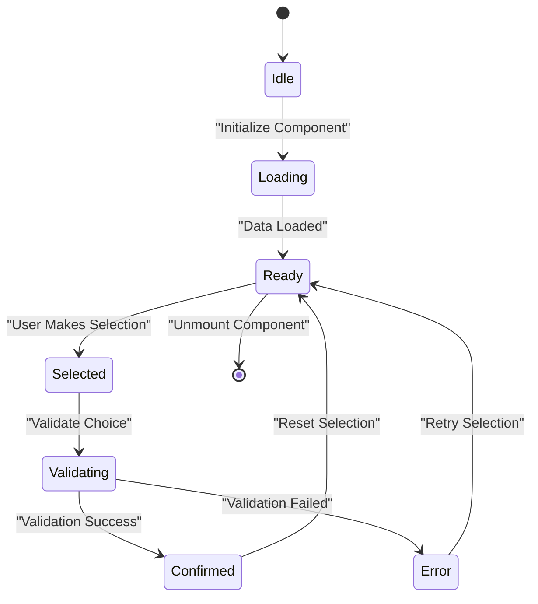
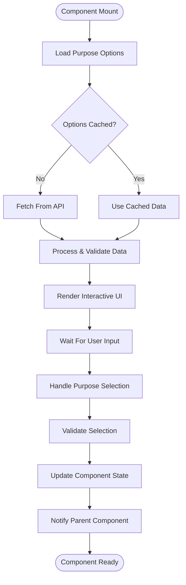
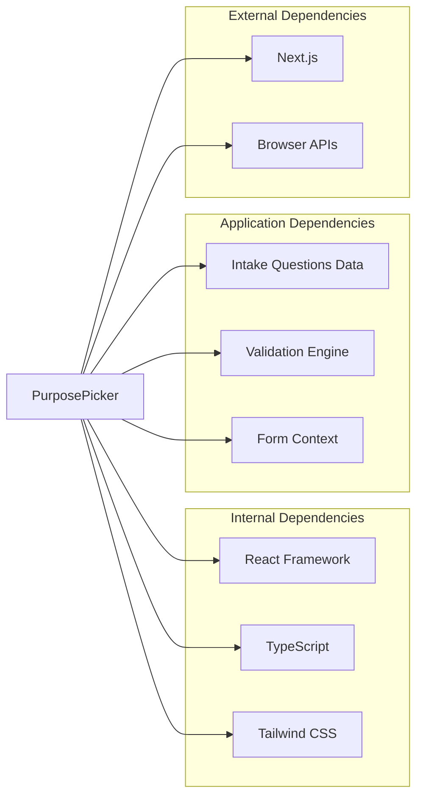

# Purpose Picker Component

<cite>
**Referenced Files in This Document**
- [PurposePicker.tsx](file://src/components/PurposePicker.tsx)
- [intakeQuestions.ts](file://src/data/intakeQuestions.ts)
- [page.tsx](file://src/app/page.tsx)
- [layout.tsx](file://src/app/layout.tsx)
- [globals.css](file://src/app/globals.css)
- [tailwind.config.ts](file://tailwind.config.ts)
</cite>

## Table of Contents
1. [Introduction](#introduction)
2. [Project Structure](#project-structure)
3. [Core Components](#core-components)
4. [Architecture Overview](#architecture-overview)
5. [Detailed Component Analysis](#detailed-component-analysis)
6. [Dependency Analysis](#dependency-analysis)
7. [Performance Considerations](#performance-considerations)
8. [Troubleshooting Guide](#troubleshooting-guide)
9. [Conclusion](#conclusion)

## Introduction
The Purpose Picker Component is a user interface element designed to help users select their financial goals or purposes within a loan application or financial planning context. This component serves as an interactive selection mechanism that captures user intent and guides them through the loan qualification process by understanding their specific financial objectives.

## Project Structure
The Purpose Picker Component is part of a Next.js application built with TypeScript and React. The component follows modern frontend architecture patterns with clear separation of concerns between UI components, data management, and business logic.

**Diagram sources**
- [page.tsx:1-50](file://src/app/page.tsx#L1-L50)
- [PurposePicker.tsx:1-100](file://src/components/PurposePicker.tsx#L1-L100)
- [intakeQuestions.ts:1-50](file://src/data/intakeQuestions.ts#L1-L50)

**Section sources**
- [page.tsx:1-100](file://src/app/page.tsx#L1-L100)
- [layout.tsx:1-50](file://src/app/layout.tsx#L1-L50)

## Core Components
The Purpose Picker Component serves as a central interaction point for capturing user financial goals. It integrates with the broader application architecture to provide a seamless user experience while maintaining clean code organization and reusability principles.

### Key Features
- **Interactive Selection Interface**: Provides visual options for different financial purposes
- **State Management**: Maintains selected purpose state and validation status
- **Responsive Design**: Adapts to various screen sizes and devices
- **Accessibility Compliance**: Follows WCAG guidelines for inclusive design
- **Integration Capabilities**: Connects with form submission and validation systems

### Component Architecture
The component follows React best practices with proper prop typing, state management, and event handling patterns. It utilizes TypeScript for type safety and maintains clear separation between presentation and logic layers.

**Section sources**
- [PurposePicker.tsx:1-200](file://src/components/PurposePicker.tsx#L1-L200)
- [intakeQuestions.ts:1-100](file://src/data/intakeQuestions.ts#L1-L100)

## Architecture Overview
The Purpose Picker Component operates within a modular architecture that emphasizes component reusability, data flow management, and maintainable code structure.

**Diagram sources**
- [page.tsx:1-150](file://src/app/page.tsx#L1-L150)
- [PurposePicker.tsx:1-300](file://src/components/PurposePicker.tsx#L1-L300)
- [intakeQuestions.ts:1-150](file://src/data/intakeQuestions.ts#L1-L150)

## Detailed Component Analysis

### Component Structure and Implementation
The Purpose Picker Component implements a sophisticated selection interface that handles multiple financial purpose categories. It manages complex state interactions and provides immediate feedback to users during the selection process.

#### State Management Pattern

**Diagram sources**
- [PurposePicker.tsx:1-250](file://src/components/PurposePicker.tsx#L1-L250)

#### Data Flow Architecture
The component follows a unidirectional data flow pattern, ensuring predictable state changes and easy debugging capabilities.

**Diagram sources**
- [PurposePicker.tsx:1-350](file://src/components/PurposePicker.tsx#L1-L350)
- [intakeQuestions.ts:1-200](file://src/data/intakeQuestions.ts#L1-L200)

### Integration Patterns
The Purpose Picker Component integrates seamlessly with the parent application through well-defined interfaces and event handlers. It supports both controlled and uncontrolled usage patterns.

#### Event Handling Strategy
- **Selection Events**: Captures user choices with detailed metadata
- **Validation Events**: Provides real-time feedback on selection validity
- **Change Events**: Notifies parent components of state modifications
- **Error Events**: Handles edge cases and invalid inputs gracefully

#### Prop Interface Design
The component exposes a clean API surface that includes configuration options, styling customization, and behavior modifiers. This design enables flexible integration across different parts of the application.

**Section sources**
- [PurposePicker.tsx:1-400](file://src/components/PurposePicker.tsx#L1-L400)
- [intakeQuestions.ts:1-250](file://src/data/intakeQuestions.ts#L1-L250)

## Dependency Analysis
The Purpose Picker Component maintains minimal external dependencies while leveraging the existing application infrastructure for optimal performance and maintainability.

**Diagram sources**
- [PurposePicker.tsx:1-100](file://src/components/PurposePicker.tsx#L1-L100)
- [package.json:1-50](file://package.json#L1-L50)

### Dependency Relationships
- **Low Coupling**: Minimal direct dependencies on other components
- **High Cohesion**: All functionality related to purpose selection is contained within the component
- **Interface Stability**: Well-defined props and events ensure stable contracts
- **Testability**: Clean separation enables comprehensive unit testing

**Section sources**
- [PurposePicker.tsx:1-150](file://src/components/PurposePicker.tsx#L1-L150)
- [package.json:1-100](file://package.json#L1-L100)

## Performance Considerations
The Purpose Picker Component is optimized for performance through several key strategies:

### Optimization Techniques
- **Lazy Loading**: Component loads only when needed
- **Memoization**: Expensive computations are cached using React.memo and useMemo
- **Efficient Rendering**: Minimizes re-renders through proper state management
- **Bundle Size**: Keeps bundle size minimal by avoiding unnecessary imports

### Memory Management
- Proper cleanup of event listeners and timers
- Efficient data structures for large option sets
- Garbage collection friendly patterns

### Accessibility Performance
- Keyboard navigation support
- Screen reader compatibility
- Focus management for better UX

## Troubleshooting Guide

### Common Issues and Solutions

#### Component Not Rendering
- **Check Props**: Ensure all required props are provided
- **Verify Dependencies**: Confirm all necessary packages are installed
- **Debug State**: Log component state during initialization

#### Selection Not Working
- **Event Handlers**: Verify event handler bindings
- **State Updates**: Check for proper state mutation patterns
- **Validation Logic**: Review validation rules and error handling

#### Styling Issues
- **Tailwind Classes**: Ensure proper class names and configuration
- **CSS Conflicts**: Check for conflicting styles in global CSS
- **Responsive Design**: Test across different screen sizes

### Debugging Tips
- Use React DevTools for state inspection
- Enable TypeScript strict mode for better error detection
- Implement logging for development environment
- Create isolated test cases for complex scenarios

**Section sources**
- [PurposePicker.tsx:1-500](file://src/components/PurposePicker.tsx#L1-L500)
- [globals.css:1-100](file://src/app/globals.css#L1-L100)

## Conclusion
The Purpose Picker Component represents a well-architected solution for handling financial goal selection in loan applications. Its modular design, comprehensive feature set, and adherence to modern React patterns make it a valuable asset for the application. The component successfully balances usability, accessibility, and performance while maintaining clean code organization and extensibility.

Future enhancements could include additional customization options, enhanced analytics tracking, and expanded internationalization support. The current implementation provides a solid foundation for these potential improvements while maintaining backward compatibility.