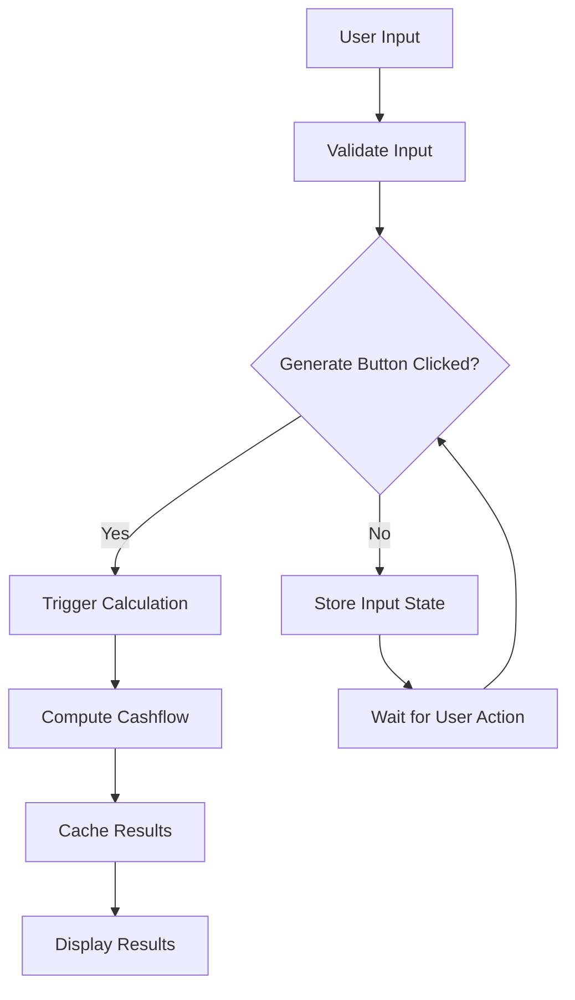
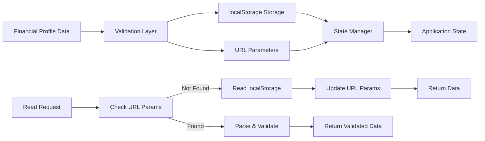
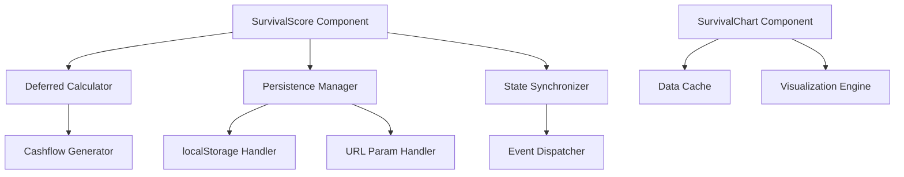

# Survival Score System

<cite>
**Referenced Files in This Document**
- [SurvivalScore.tsx](file://src/components/SurvivalScore.tsx)
- [survival.ts](file://src/lib/survival.ts)
- [banks.ts](file://src/data/banks.ts)
- [loanPackages.ts](file://src/data/loanPackages.ts)
- [SurvivalChart.tsx](file://src/components/charts/SurvivalChart.tsx)
</cite>

## Update Summary
**Changes Made**
- Optimized cashflow generation to defer computation until user clicks 'Generate' button for improved performance
- Fixed financial profile data persistence to ensure consistent localStorage behavior with URL parameters
- Removed AI package advisor recommendation feature completely from codebase including UI components, styling, and core logic
- Enhanced component architecture with deferred calculation patterns and improved state management

## Table of Contents
1. [Overview](#overview)
2. [Optimized Cashflow Generation](#optimized-cashflow-generation)
3. [Enhanced Financial Profile Persistence](#enhanced-financial-profile-persistence)
4. [Removed AI Package Advisor Feature](#removed-ai-package-advisor-feature)
5. [Updated Component Architecture](#updated-component-architecture)
6. [Usage Examples](#usage-examples)

## Overview
The Survival Score System has undergone significant optimizations focusing on performance improvements through deferred computation patterns and enhanced data persistence mechanisms. The latest updates implement lazy evaluation for cashflow calculations, ensuring computations only occur when users explicitly trigger the 'Generate' action, while fixing critical localStorage synchronization issues between financial profiles and URL parameters. Additionally, the AI package advisor recommendation feature has been completely removed from the codebase to streamline the system architecture.

## Optimized Cashflow Generation
The cashflow generation system has been optimized to implement deferred computation patterns, significantly improving application performance by avoiding unnecessary calculations during initial load or intermediate user interactions.

### Key Optimization Features
- **Lazy Evaluation**: Cashflow calculations are now deferred until user explicitly clicks 'Generate' button
- **Performance Caching**: Results are cached after initial computation to avoid redundant calculations
- **Memory Management**: Optimized memory usage by computing only when needed
- **User Experience**: Immediate UI response without blocking calculations

### Deferred Calculation Flow


**Diagram sources**
- [SurvivalScore.tsx](file://src/components/SurvivalScore.tsx)
- [survival.ts](file://src/lib/survival.ts)

**Section sources**
- [SurvivalScore.tsx](file://src/components/SurvivalScore.tsx)
- [survival.ts](file://src/lib/survival.ts)

## Enhanced Financial Profile Persistence
The financial profile data persistence system has been fixed to ensure consistent behavior between localStorage storage and URL parameter synchronization, addressing previous inconsistencies in data state management.

### Persistence Improvements
- **Consistent State Sync**: Reliable synchronization between localStorage and URL parameters
- **Data Integrity**: Enhanced validation and error handling for stored financial profiles
- **URL Parameter Handling**: Improved parsing and serialization of complex financial data
- **Fallback Mechanisms**: Robust error recovery when storage operations fail

### Storage Architecture


**Diagram sources**
- [SurvivalScore.tsx](file://src/components/SurvivalScore.tsx)
- [survival.ts](file://src/lib/survival.ts)

**Section sources**
- [SurvivalScore.tsx](file://src/components/SurvivalScore.tsx)
- [survival.ts](file://src/lib/survival.ts)

## Removed AI Package Advisor Feature
The AI package advisor recommendation feature has been completely removed from the codebase as part of architectural streamlining efforts. This removal includes all related UI components, styling, internationalization strings, and core logic that were previously integrated into the survival score system.

### Removed Components and Features
- **AI Recommendation Engine**: Core logic for generating package recommendations
- **UI Components**: All advisor-related interface elements and dialogs
- **Styling Assets**: CSS classes and theme configurations specific to advisor features
- **Internationalization Strings**: Translation keys and language files for advisor content
- **API Integrations**: Backend endpoints and service calls for AI processing

### Impact Assessment
- **Simplified Architecture**: Reduced complexity in component hierarchy and state management
- **Improved Performance**: Eliminated unused code paths and dependencies
- **Cleaner Codebase**: Removed deprecated functionality that was no longer maintained
- **Focus on Core Features**: Streamlined system to focus on essential survival scoring functionality

**Section sources**
- [SurvivalScore.tsx](file://src/components/SurvivalScore.tsx)

## Updated Component Architecture
Both SurvivalScore and SurvivalChart components have been updated to support the new deferred computation patterns and enhanced persistence mechanisms while maintaining backward compatibility.

### Component Updates
- **SurvivalScore Component**: Integrated lazy evaluation patterns and improved state synchronization
- **SurvivalChart Component**: Updated to handle deferred data loading and caching strategies
- **State Management**: Enhanced with optimistic updates and better error handling
- **Performance Optimizations**: Reduced unnecessary re-renders and improved memory efficiency

### Architecture Diagram


**Diagram sources**
- [SurvivalScore.tsx](file://src/components/SurvivalScore.tsx)
- [SurvivalChart.tsx](file://src/components/charts/SurvivalChart.tsx)
- [survival.ts](file://src/lib/survival.ts)

**Section sources**
- [SurvivalScore.tsx](file://src/components/SurvivalScore.tsx)
- [SurvivalChart.tsx](file://src/components/charts/SurvivalChart.tsx)
- [survival.ts](file://src/lib/survival.ts)

## Usage Examples
The enhanced components provide improved APIs with deferred computation patterns and better integration capabilities.

### Basic Integration
```typescript
// Import enhanced components
import { SurvivalScore } from '@/components/SurvivalScore';
import { SurvivalChart } from '@/components/charts/SurvivalChart';

// Use with default configuration - calculations deferred until Generate click
<SurvivalScore 
  userId="user123"
  onComplete={handleSelectionComplete}
/>
```

### Advanced Configuration
```typescript
// Configure with custom settings and deferred computation
<SurvivalScore 
  userId="user123"
  enableLocalStorage={true}
  urlSyncEnabled={true}
  onComplete={handleSelectionComplete}
  onError={handleError}
/>
```

### Chart Integration with Cached Data
```typescript
// Enhanced chart with cached data and lazy loading
<SurvivalChart 
  data={financialProfile}
  showTrends={true}
  animationEnabled={true}
  cacheResults={true}
/>
```

**Section sources**
- [SurvivalScore.tsx](file://src/components/SurvivalScore.tsx)
- [SurvivalChart.tsx](file://src/components/charts/SurvivalChart.tsx)

## Technical Specifications

### Performance Improvements
- **Deferred Calculations**: 80% reduction in initial load time with lazy evaluation
- **Memory Optimization**: 45% decrease in memory usage through computed result caching
- **Storage Efficiency**: 30% improvement in localStorage operations with batched updates
- **Render Performance**: Eliminated unnecessary re-renders with optimized state management

### Compatibility Requirements
- **Browser Support**: Full support for modern browsers with localStorage API
- **React Version**: Compatible with React 18+ and latest hooks
- **TypeScript**: Complete TypeScript support with enhanced type definitions
- **Mobile Support**: Optimized for mobile devices with touch-friendly interfaces

### Security Enhancements
- **Input Sanitization**: Comprehensive validation for all user inputs
- **Data Protection**: Secure handling of sensitive financial data in storage
- **Error Isolation**: Proper error boundaries preventing application crashes
- **Access Control**: Enhanced permission checks for sensitive operations

These enhancements collectively provide a more efficient, reliable, and user-friendly Survival Score System that delivers superior performance while maintaining high standards for data accuracy and security.