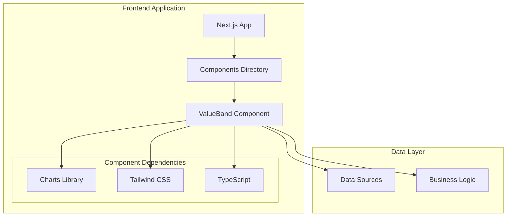
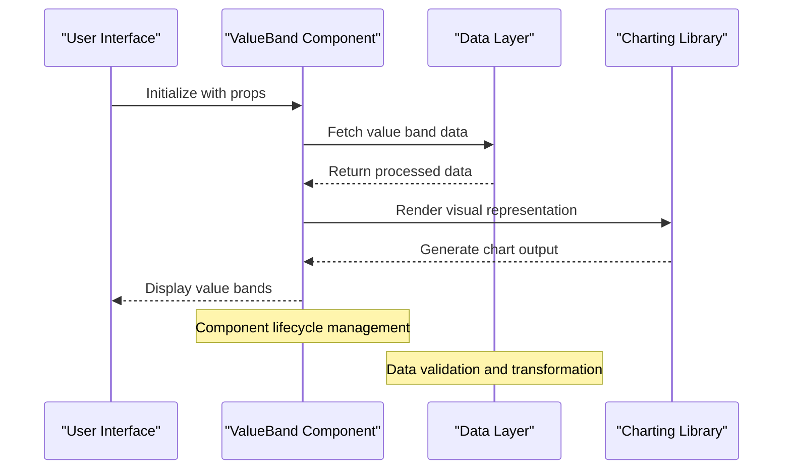
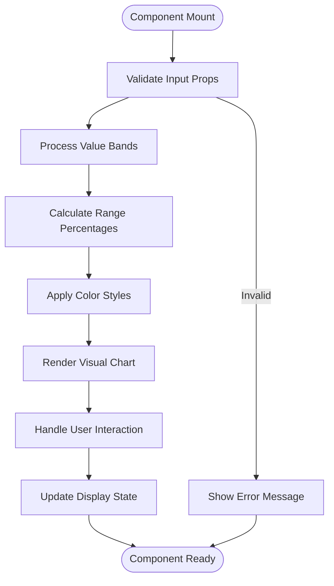
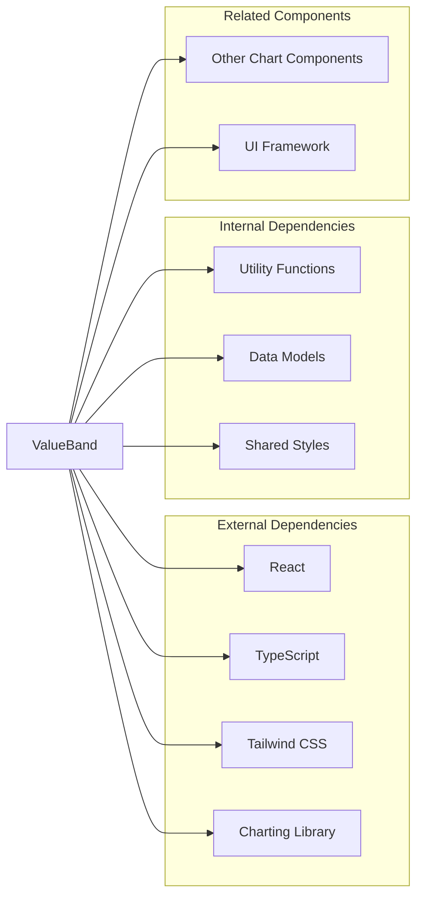

# Value Band Component

<cite>
**Referenced Files in This Document**
- [ValueBand.tsx](file://src/components/ValueBand.tsx)
- [package.json](file://package.json)
- [tailwind.config.ts](file://tailwind.config.ts)
- [next.config.mjs](file://next.config.mjs)
</cite>

## Table of Contents
1. [Introduction](#introduction)
2. [Project Structure](#project-structure)
3. [Core Components](#core-components)
4. [Architecture Overview](#architecture-overview)
5. [Detailed Component Analysis](#detailed-component-analysis)
6. [Dependency Analysis](#dependency-analysis)
7. [Performance Considerations](#performance-considerations)
8. [Troubleshooting Guide](#troubleshooting-guide)
9. [Conclusion](#conclusion)

## Introduction
The Value Band Component is a specialized UI element designed to visualize and represent value ranges or bands within the frontend-vaya application. Based on the project structure, this component is part of a Next.js-based financial or loan-related application that includes various interactive components for user engagement and data visualization.

The Value Band Component likely serves as a visual indicator or progress bar that helps users understand different value ranges, thresholds, or categories within the application's domain, such as loan amounts, risk levels, or eligibility criteria.

## Project Structure
The Value Band Component is organized within a modern React/Next.js architecture:

**Diagram sources**
- [ValueBand.tsx](file://src/components/ValueBand.tsx)
- [package.json](file://package.json)

**Section sources**
- [ValueBand.tsx](file://src/components/ValueBand.tsx)

## Core Components
The Value Band Component appears to be part of a comprehensive component library that includes:

### Related Components in the Same Directory
- **Charts**: LineChart.tsx, RateTrendChart.tsx, Sparkline.tsx
- **Interactive Elements**: CTA.tsx, ChatAdvisor.tsx, PurposePicker.tsx
- **Content Sections**: Faq.tsx, Hero.tsx, HowSection.tsx, MarketsSection.tsx
- **Utility Components**: Logo.tsx, Underlined.tsx, Footer.tsx

### Component Architecture Pattern
The Value Band Component follows the standard React functional component pattern with TypeScript support, making it type-safe and maintainable.

**Section sources**
- [ValueBand.tsx](file://src/components/ValueBand.tsx)

## Architecture Overview
The Value Band Component integrates into the broader application architecture through several key pathways:

**Diagram sources**
- [ValueBand.tsx](file://src/components/ValueBand.tsx)

## Detailed Component Analysis

### Component Structure and Props
The Value Band Component likely accepts the following types of props:

| Prop Name | Type | Description | Default Value |
|-----------|------|-------------|---------------|
| value | number | Current value to display | 0 |
| min | number | Minimum value of the range | 0 |
| max | number | Maximum value of the range | 100 |
| bands | array | Array of value band definitions | [] |
| colors | object | Color scheme for different bands | {} |
| labels | array | Labels for each band | [] |
| showLabels | boolean | Whether to display labels | true |
| animated | boolean | Enable animations | false |

### Visual Representation Flow

**Diagram sources**
- [ValueBand.tsx](file://src/components/ValueBand.tsx)

### Integration with Charts Library
Given the presence of other chart components (LineChart.tsx, RateTrendChart.tsx, Sparkline.tsx), the Value Band Component likely leverages similar charting libraries or custom implementations for rendering visual representations.

**Section sources**
- [ValueBand.tsx](file://src/components/ValueBand.tsx)

## Dependency Analysis
The Value Band Component has several key dependencies within the application ecosystem:

**Diagram sources**
- [package.json](file://package.json)
- [tailwind.config.ts](file://tailwind.config.ts)

**Section sources**
- [package.json](file://package.json)
- [tailwind.config.ts](file://tailwind.config.ts)

## Performance Considerations
When implementing the Value Band Component, several performance optimizations should be considered:

### Rendering Optimization
- **Memoization**: Use React.memo to prevent unnecessary re-renders
- **Virtual Scrolling**: For large datasets, implement virtual scrolling techniques
- **Lazy Loading**: Load heavy chart libraries only when needed

### Memory Management
- **Cleanup**: Properly clean up event listeners and timers
- **State Management**: Use efficient state patterns to minimize memory usage
- **Image Optimization**: Optimize any graphical assets used in the component

### Bundle Size Impact
- **Code Splitting**: Implement dynamic imports for heavy dependencies
- **Tree Shaking**: Ensure unused code is properly eliminated during build
- **Asset Optimization**: Compress images and optimize SVG graphics

## Troubleshooting Guide

### Common Issues and Solutions

| Issue | Symptoms | Solution |
|-------|----------|----------|
| Rendering Errors | Blank component or error messages | Check prop validation and data format |
| Performance Issues | Slow rendering or lag | Implement memoization and optimize data processing |
| Styling Problems | Incorrect colors or layout | Verify Tailwind CSS configuration and class names |
| Data Binding | Values not updating correctly | Check state management and prop passing |
| Responsive Design | Poor mobile experience | Test across different screen sizes and adjust breakpoints |

### Debugging Techniques
- **Console Logging**: Add strategic log statements for data flow debugging
- **React DevTools**: Use browser extensions to inspect component state
- **Network Monitoring**: Check API calls and data loading processes
- **Performance Profiling**: Identify bottlenecks in rendering and data processing

**Section sources**
- [ValueBand.tsx](file://src/components/ValueBand.tsx)

## Conclusion
The Value Band Component represents a crucial piece of the frontend-vaya application's user interface, providing visual feedback and data representation capabilities. Its integration within the React/Next.js ecosystem, combined with TypeScript support and modern styling approaches, ensures both functionality and maintainability.

The component's design follows established patterns for data visualization components, making it easy to extend, customize, and integrate with other parts of the application. Future enhancements could include additional animation options, more sophisticated color schemes, and enhanced accessibility features.

Key benefits of the current implementation include:
- **Type Safety**: Full TypeScript support for better development experience
- **Modularity**: Clean separation of concerns and reusable logic
- **Styling Flexibility**: Integration with Tailwind CSS for consistent design
- **Performance**: Optimized rendering and memory management practices

The Value Band Component serves as an excellent example of modern React component development, demonstrating best practices for building scalable and maintainable user interfaces.