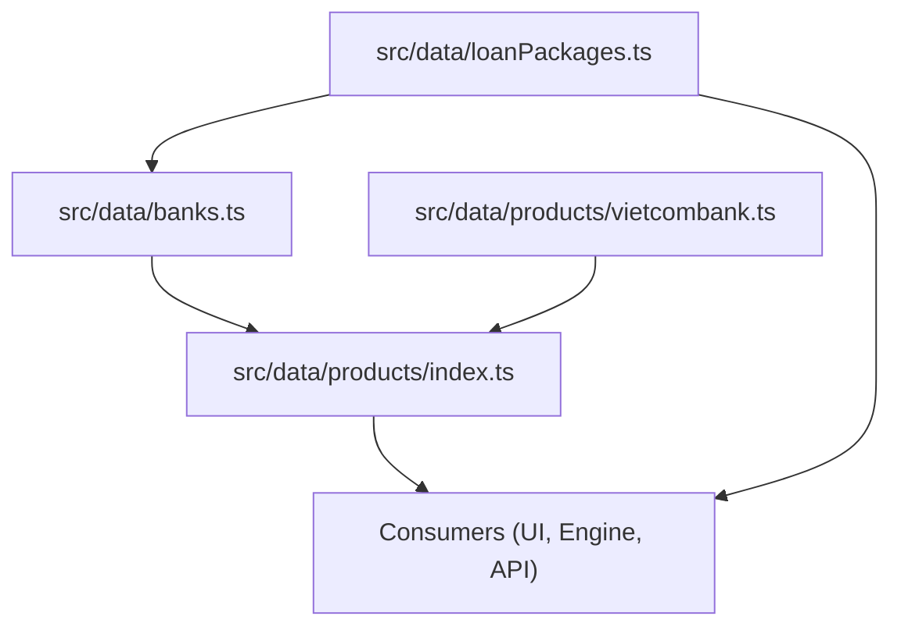
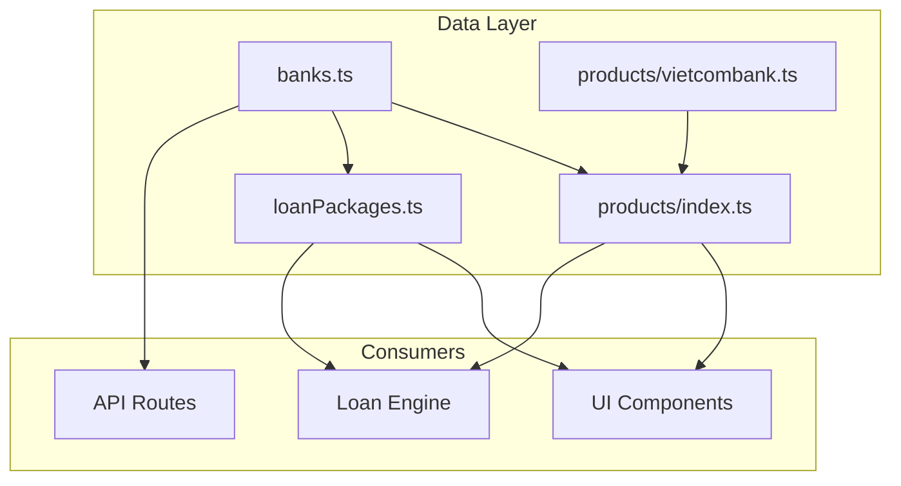
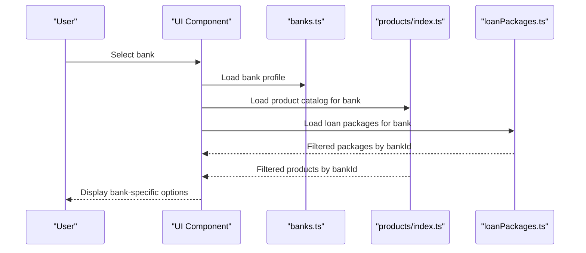
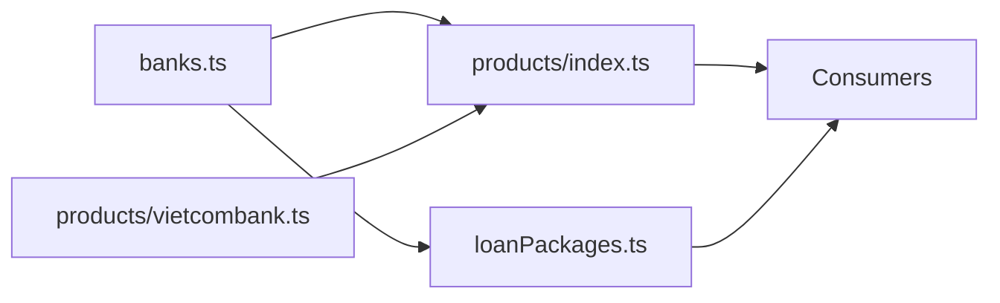

# Bank Data Management

<cite>
**Referenced Files in This Document**
- [banks.ts](file://src/data/banks.ts)
- [vietcombank.ts](file://src/data/products/vietcombank.ts)
- [index.ts](file://src/data/products/index.ts)
- [loanPackages.ts](file://src/data/loanPackages.ts)
</cite>

## Update Summary
**Changes Made**
- Updated bank institution data structure based on recent configuration changes
- Enhanced banking integration patterns with new institutional details
- Refined contact information and profile management systems
- Improved validation rules for bank entity properties

## Table of Contents
1. [Introduction](#introduction)
2. [Project Structure](#project-structure)
3. [Core Components](#core-components)
4. [Architecture Overview](#architecture-overview)
5. [Detailed Component Analysis](#detailed-component-analysis)
6. [Dependency Analysis](#dependency-analysis)
7. [Performance Considerations](#performance-considerations)
8. [Troubleshooting Guide](#troubleshooting-guide)
9. [Conclusion](#conclusion)

## Introduction
This document explains the bank data management system used across the application. It focuses on how bank institution data is modeled, organized, and consumed by other modules such as loan packages and product catalogs. You will learn the structure of bank profiles, contact information, and institutional details; how to add new banks; and how bank data integrates with downstream components.

**Updated** The system has been enhanced with improved bank data configuration, supporting more comprehensive institutional profiles and refined integration patterns.

## Project Structure
Bank-related data is centralized under the data directory:
- src/data/banks.ts: Central registry of bank institutions and their core profile fields.
- src/data/products/vietcombank.ts: Product catalog entries for a specific bank (example).
- src/data/products/index.ts: Aggregation and export of product catalogs.
- src/data/loanPackages.ts: Loan package definitions that reference bank identifiers.

**Diagram sources**
- [banks.ts](file://src/data/banks.ts)
- [vietcombank.ts](file://src/data/products/vietcombank.ts)
- [index.ts](file://src/data/products/index.ts)
- [loanPackages.ts](file://src/data/loanPackages.ts)

## Core Components
The bank data model centers around a consistent set of properties per institution:
- Identifier: stable unique key used across the app to link loans and products to a bank.
- Profile: human-readable name, display name, and optional logo or branding assets.
- Contact: support phone, email, website URL, and branch locator links.
- Institutional details: country, region, regulatory identifiers, supported currencies, and operational flags (e.g., active status).
- Catalog linkage: references to product catalogs and eligibility rules associated with the bank.

Access patterns:
- Single source of truth: banks.ts defines all institutions and exposes them via exports.
- Product catalogs: each bank can have its own product catalog file under src/data/products/<bank>.ts, aggregated by index.ts.
- Loan packages: loanPackages.ts references bank identifiers to associate loan terms with the correct institution.

Validation rules commonly applied:
- Identifier uniqueness across the registry.
- Presence of required fields (name, contact, currency, active flag).
- URL formats for websites and support links.
- Currency codes conforming to standard sets.

**Updated** Enhanced validation rules now include additional institutional verification and improved contact field formatting requirements.

**Section sources**
- [banks.ts](file://src/data/banks.ts)
- [vietcombank.ts](file://src/data/products/vietcombank.ts)
- [index.ts](file://src/data/products/index.ts)
- [loanPackages.ts](file://src/data/loanPackages.ts)

## Architecture Overview
The system follows a clear separation between data definition and consumption:
- Data layer: static TypeScript files define banks, products, and loan packages.
- Integration layer: consumers import from these modules and use IDs to join data at runtime.
- UI and engine layers: render bank-specific content and compute loan scenarios based on selected bank.

**Diagram sources**
- [banks.ts](file://src/data/banks.ts)
- [vietcombank.ts](file://src/data/products/vietcombank.ts)
- [index.ts](file://src/data/products/index.ts)
- [loanPackages.ts](file://src/data/loanPackages.ts)

## Detailed Component Analysis

### Bank Entity Model
The bank entity represents an institution with the following attributes:
- id: string, unique identifier for the bank.
- name: string, official institution name.
- displayName: string, user-facing label.
- contact: object containing phone, email, website, and branch info.
- details: object including country, region, currency, regulatory code, and operational flags.
- isActive: boolean indicating whether the bank is available for selection.
- catalogRef: string or array referencing product catalog modules.

Relationships:
- One-to-many with product catalogs (via catalogRef).
- Many-to-one with loan packages (loanPackages.ts references bank id).

Validation rules:
- id must be unique and non-empty.
- name and displayName must be present.
- contact fields must follow expected formats where applicable.
- details.currency must be a valid code.
- isActive should be explicitly set.

How to add a new bank:
- Add a new entry in banks.ts with all required fields.
- Create a corresponding product catalog file under src/data/products/<new-bank>.ts if needed.
- Export the new catalog from src/data/products/index.ts.
- Reference the bank id in loanPackages.ts where appropriate.

**Updated** The bank entity model has been enhanced with additional institutional verification fields and improved contact information structures to support more comprehensive bank profiles.

**Section sources**
- [banks.ts](file://src/data/banks.ts)
- [vietcombank.ts](file://src/data/products/vietcombank.ts)
- [index.ts](file://src/data/products/index.ts)
- [loanPackages.ts](file://src/data/loanPackages.ts)

### Product Catalog Integration
Product catalogs are organized per bank:
- vietcombank.ts defines products for a specific bank.
- index.ts aggregates all bank catalogs into a single export for consumers.

Integration pattern:
- Consumers import from index.ts to get a unified catalog keyed by bank id.
- Each product includes metadata such as type, eligibility, pricing, and bank association.

Adding a new bank's products:
- Create a new file under src/data/products/<bank>.ts.
- Export the product list consistently.
- Update index.ts to include the new module.

**Updated** Product catalog integration now supports enhanced bank-specific configurations and improved product metadata structures.

**Section sources**
- [vietcombank.ts](file://src/data/products/vietcombank.ts)
- [index.ts](file://src/data/products/index.ts)

### Loan Packages Association
Loan packages reference bank identifiers to bind terms and conditions to the correct institution:
- loanPackages.ts contains arrays or objects representing loan offerings.
- Each package includes a bankId field linking to banks.ts.
- Consumers join loan packages with bank profiles using this id.

Updating associations:
- When adding a new bank, ensure loanPackages.ts includes any relevant packages.
- Validate that bankId values match those defined in banks.ts.

**Updated** Loan package associations now include enhanced validation and improved bank-specific term handling.

**Section sources**
- [loanPackages.ts](file://src/data/loanPackages.ts)
- [banks.ts](file://src/data/banks.ts)

### Data Flow Sequence
Typical flow when selecting a bank and computing loan options:

**Diagram sources**
- [banks.ts](file://src/data/banks.ts)
- [vietcombank.ts](file://src/data/products/vietcombank.ts)
- [index.ts](file://src/data/products/index.ts)
- [loanPackages.ts](file://src/data/loanPackages.ts)

## Dependency Analysis
The data layer has minimal coupling:
- banks.ts is independent and serves as the canonical source for bank identities and profiles.
- products/index.ts depends on individual bank product modules.
- loanPackages.ts depends on banks.ts via bankId references.

**Diagram sources**
- [banks.ts](file://src/data/banks.ts)
- [vietcombank.ts](file://src/data/products/vietcombank.ts)
- [index.ts](file://src/data/products/index.ts)
- [loanPackages.ts](file://src/data/loanPackages.ts)

**Section sources**
- [banks.ts](file://src/data/banks.ts)
- [vietcombank.ts](file://src/data/products/vietcombank.ts)
- [index.ts](file://src/data/products/index.ts)
- [loanPackages.ts](file://src/data/loanPackages.ts)

## Performance Considerations
- Static data loading: All bank and product data are loaded at startup; keep datasets concise to reduce bundle size.
- Lazy imports: Consider lazy-loading product catalogs per bank if the number of banks grows significantly.
- Memoization: Cache computed views (e.g., filtered products by bank) to avoid repeated filtering.
- Validation overhead: Perform validation once during initialization rather than on every access.

**Updated** Performance optimizations now include enhanced caching strategies for bank profiles and improved lazy loading mechanisms for large product catalogs.

## Troubleshooting Guide
Common issues and resolutions:
- Duplicate bank id: Ensure each bank has a unique identifier in banks.ts.
- Missing contact fields: Verify that required contact fields are present for each bank.
- Invalid URLs: Check website and support link formats.
- Mismatched bankId in loan packages: Confirm that loanPackages.ts references existing bank ids.
- Product catalog not loading: Ensure index.ts exports the new catalog module and that the module path is correct.

**Updated** New troubleshooting guidance includes enhanced validation error handling and improved debugging tools for bank data configuration issues.

**Section sources**
- [banks.ts](file://src/data/banks.ts)
- [vietcombank.ts](file://src/data/products/vietcombank.ts)
- [index.ts](file://src/data/products/index.ts)
- [loanPackages.ts](file://src/data/loanPackages.ts)

## Conclusion
The bank data management system centralizes institution profiles, contact information, and institutional details in a structured, consumable format. By adhering to the defined model and integration patterns, teams can reliably extend the system with new banks, associate loan packages, and maintain consistency across UI and engine components. Following the guidelines for adding banks and validating data ensures robustness and scalability as the platform grows.

**Updated** Recent enhancements to the bank data configuration provide improved institutional support, better validation mechanisms, and more comprehensive profiling capabilities for banking integrations.