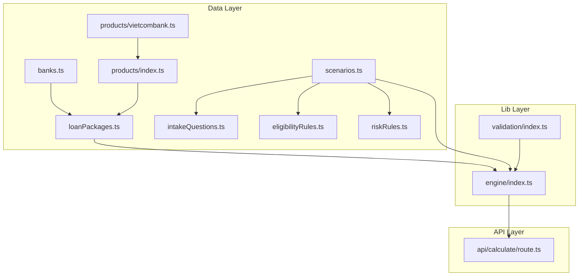
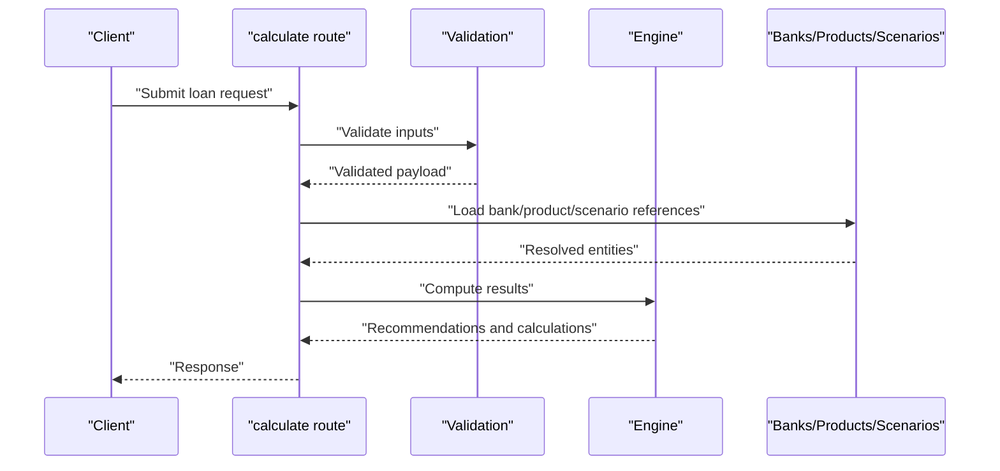
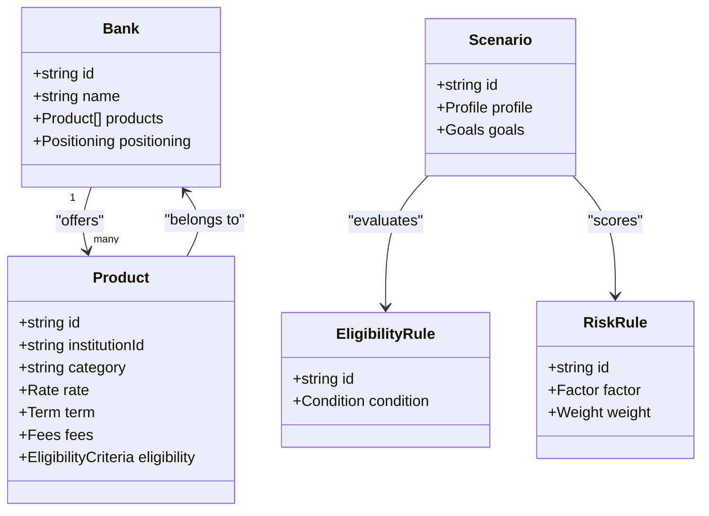
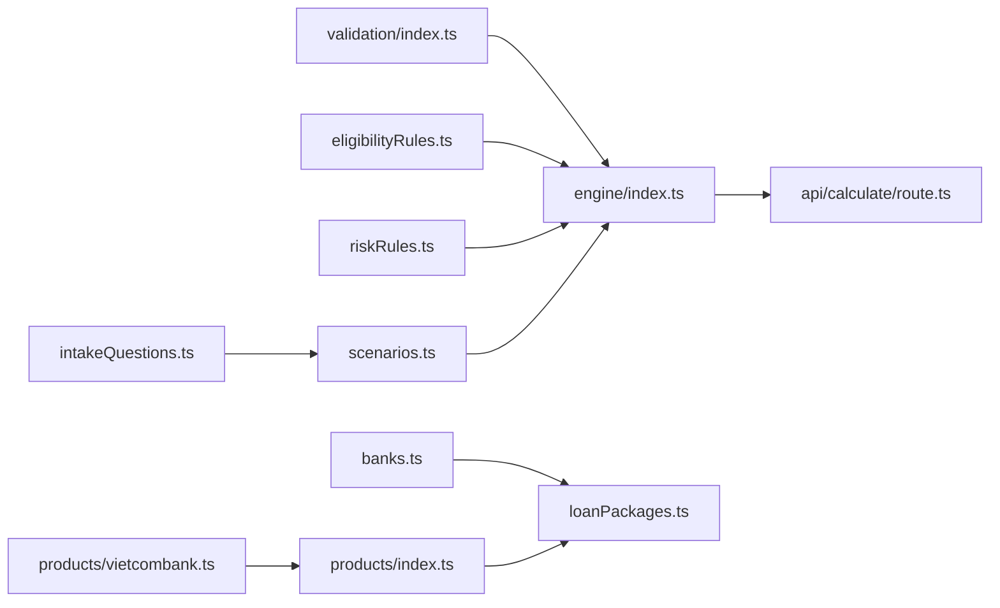

# Data Management

<cite>
**Referenced Files in This Document**
- [src/data/banks.ts](file://src/data/banks.ts)
- [src/data/loanPackages.ts](file://src/data/loanPackages.ts)
- [src/data/products/index.ts](file://src/data/products/index.ts)
- [src/data/products/vietcombank.ts](file://src/data/products/vietcombank.ts)
- [src/data/scenarios.ts](file://src/data/scenarios.ts)
- [src/data/intakeQuestions.ts](file://src/data/intakeQuestions.ts)
- [src/data/eligibilityRules.ts](file://src/data/eligibilityRules.ts)
- [src/data/riskRules.ts](file://src/data/riskRules.ts)
- [src/lib/validation/index.ts](file://src/lib/validation/index.ts)
- [src/lib/engine/index.ts](file://src/lib/engine/index.ts)
- [src/app/api/calculate/route.ts](file://src/app/api/calculate/route.ts)
</cite>

## Update Summary
**Changes Made**
- Updated to reflect comprehensive data model expansion with type definitions, validation schemas, and extensive configuration files for financial entities and AI responses
- Enhanced documentation of the centralized data structures for bank information, loan products, and financial scenarios
- Expanded coverage of product catalog system organization by institution and category
- Detailed bank data model including institution details, product offerings, and competitive positioning
- Comprehensive scenario management system documentation for borrower situations and financial profiles
- Added data validation patterns, type definitions, and data transformation utilities
- Included data loading strategies, caching mechanisms, and synchronization with external sources
- Documented entity relationships and interactions during loan processing workflows

## Table of Contents
1. [Introduction](#introduction)
2. [Project Structure](#project-structure)
3. [Core Components](#core-components)
4. [Architecture Overview](#architecture-overview)
5. [Detailed Component Analysis](#detailed-component-analysis)
6. [Dependency Analysis](#dependency-analysis)
7. [Performance Considerations](#performance-considerations)
8. [Troubleshooting Guide](#troubleshooting-guide)
9. [Conclusion](#conclusion)

## Introduction
This document explains the data management layer of the frontend-vaya application with a focus on centralized data structures for bank information, loan products, and financial scenarios. It details how the product catalog organizes loan packages by institution and category, describes the bank data model (institution details, product offerings, competitive positioning), and documents the scenario management system that models borrower situations and financial profiles. It also covers data validation patterns, type definitions, transformation utilities, data loading strategies, caching mechanisms, synchronization approaches, and entity relationships during loan processing workflows.

## Project Structure
The data management layer is primarily organized under src/data and src/lib:
- src/data: Centralized static data for banks, loan packages, product catalogs, scenarios, intake questions, eligibility rules, and risk rules.
- src/lib: Shared libraries including validation utilities and engine components used to process data through business logic.

**Diagram sources**
- [src/data/banks.ts](file://src/data/banks.ts)
- [src/data/loanPackages.ts](file://src/data/loanPackages.ts)
- [src/data/products/index.ts](file://src/data/products/index.ts)
- [src/data/products/vietcombank.ts](file://src/data/products/vietcombank.ts)
- [src/data/scenarios.ts](file://src/data/scenarios.ts)
- [src/data/intakeQuestions.ts](file://src/data/intakeQuestions.ts)
- [src/data/eligibilityRules.ts](file://src/data/eligibilityRules.ts)
- [src/data/riskRules.ts](file://src/data/riskRules.ts)
- [src/lib/validation/index.ts](file://src/lib/validation/index.ts)
- [src/lib/engine/index.ts](file://src/lib/engine/index.ts)
- [src/app/api/calculate/route.ts](file://src/app/api/calculate/route.ts)

**Section sources**
- [src/data/banks.ts](file://src/data/banks.ts)
- [src/data/loanPackages.ts](file://src/data/loanPackages.ts)
- [src/data/products/index.ts](file://src/data/products/index.ts)
- [src/data/products/vietcombank.ts](file://src/data/products/vietcombank.ts)
- [src/data/scenarios.ts](file://src/data/scenarios.ts)
- [src/data/intakeQuestions.ts](file://src/data/intakeQuestions.ts)
- [src/data/eligibilityRules.ts](file://src/data/eligibilityRules.ts)
- [src/data/riskRules.ts](file://src/data/riskRules.ts)
- [src/lib/validation/index.ts](file://src/lib/validation/index.ts)
- [src/lib/engine/index.ts](file://src/lib/engine/index.ts)
- [src/app/api/calculate/route.ts](file://src/app/api/calculate/route.ts)

## Core Components
- Bank Information Model: Central repository of institution details, product offerings, and competitive positioning metrics. Used as a reference for matching and comparison across loan products.
- Product Catalog System: Organizes loan packages by institution and category, enabling consistent discovery and filtering of available options.
- Scenario Management System: Models borrower situations and financial profiles, driving eligibility and risk evaluation.
- Validation and Rules: Type-safe validation and rule sets for eligibility and risk assessment.
- Engine Integration: Consumes validated inputs and data models to compute results and recommendations.

Key responsibilities:
- Provide single source-of-truth data for banks, products, and scenarios.
- Enforce consistent types and validation across the app.
- Support efficient lookups and transformations for loan processing.

**Section sources**
- [src/data/banks.ts](file://src/data/banks.ts)
- [src/data/loanPackages.ts](file://src/data/loanPackages.ts)
- [src/data/products/index.ts](file://src/data/products/index.ts)
- [src/data/products/vietcombank.ts](file://src/data/products/vietcombank.ts)
- [src/data/scenarios.ts](file://src/data/scenarios.ts)
- [src/data/intakeQuestions.ts](file://src/data/intakeQuestions.ts)
- [src/data/eligibilityRules.ts](file://src/data/eligibilityRules.ts)
- [src/data/riskRules.ts](file://src/data/riskRules.ts)
- [src/lib/validation/index.ts](file://src/lib/validation/index.ts)
- [src/lib/engine/index.ts](file://src/lib/engine/index.ts)

## Architecture Overview
The data architecture follows a layered approach:
- Data Layer: Static datasets for banks, products, scenarios, and rules.
- Validation Layer: Ensures input integrity and normalizes data.
- Engine Layer: Applies business rules and computes outcomes.
- API Layer: Exposes endpoints that orchestrate data retrieval, validation, and computation.

**Diagram sources**
- [src/app/api/calculate/route.ts](file://src/app/api/calculate/route.ts)
- [src/lib/validation/index.ts](file://src/lib/validation/index.ts)
- [src/lib/engine/index.ts](file://src/lib/engine/index.ts)
- [src/data/banks.ts](file://src/data/banks.ts)
- [src/data/loanPackages.ts](file://src/data/loanPackages.ts)
- [src/data/scenarios.ts](file://src/data/scenarios.ts)

## Detailed Component Analysis

### Bank Data Model
Purpose:
- Define institution identity, contact info, and metadata.
- Catalog product offerings per institution with attributes such as rates, terms, fees, and eligibility criteria.
- Capture competitive positioning signals (e.g., market share indicators, preferred segments).

Key aspects:
- Institution-level fields for identification and branding.
- Product arrays with standardized schemas for rate, term, fee structure, and conditions.
- Positioning tags or scores to support ranking and recommendation logic.

Usage:
- Referenced by the product catalog to associate loans with institutions.
- Used in engine computations to compare alternatives and apply constraints.

**Section sources**
- [src/data/banks.ts](file://src/data/banks.ts)

### Product Catalog System
Purpose:
- Organize loan packages by institution and category.
- Provide consistent identifiers and attributes for filtering, sorting, and display.

Structure:
- Category-based grouping (e.g., personal, mortgage, business).
- Institution-scoped product lists with normalized fields.
- Index file aggregating all institutional catalogs for unified access.

Benefits:
- Simplifies cross-institution comparisons.
- Enables dynamic UI rendering based on categories and filters.

**Section sources**
- [src/data/loanPackages.ts](file://src/data/loanPackages.ts)
- [src/data/products/index.ts](file://src/data/products/index.ts)
- [src/data/products/vietcombank.ts](file://src/data/products/vietcombank.ts)

### Scenario Management System
Purpose:
- Model borrower situations and financial profiles to drive eligibility and risk assessments.
- Standardize intake question responses into structured scenarios.

Components:
- Scenarios: Structured representations of borrower profiles and goals.
- Intake Questions: Question sets mapped to scenario fields for data collection.
- Eligibility Rules: Criteria determining whether a scenario qualifies for specific products.
- Risk Rules: Factors influencing risk scoring and pricing adjustments.

Workflow:
- Collect responses via intake questions.
- Transform answers into a canonical scenario object.
- Apply eligibility and risk rules to filter and score products.

**Section sources**
- [src/data/scenarios.ts](file://src/data/scenarios.ts)
- [src/data/intakeQuestions.ts](file://src/data/intakeQuestions.ts)
- [src/data/eligibilityRules.ts](file://src/data/eligibilityRules.ts)
- [src/data/riskRules.ts](file://src/data/riskRules.ts)

### Data Validation Patterns and Type Definitions
Patterns:
- Strict TypeScript interfaces for all data models.
- Runtime validation using schema checks before engine processing.
- Normalization utilities to ensure consistent field formats and units.

Implementation highlights:
- Centralized validation functions for payloads and data objects.
- Rule-based validators for eligibility and risk criteria.
- Transformation helpers to convert raw inputs into canonical forms.

**Section sources**
- [src/lib/validation/index.ts](file://src/lib/validation/index.ts)
- [src/data/eligibilityRules.ts](file://src/data/eligibilityRules.ts)
- [src/data/riskRules.ts](file://src/data/riskRules.ts)

### Engine Integration and Loan Processing
Responsibilities:
- Consume validated inputs and reference data.
- Apply eligibility and risk rules to compute outcomes.
- Generate recommendations and calculation results.

Flow:
- Receive validated payload from API.
- Resolve bank and product references.
- Evaluate scenario against rules.
- Compute outputs and return structured results.

**Section sources**
- [src/lib/engine/index.ts](file://src/lib/engine/index.ts)
- [src/app/api/calculate/route.ts](file://src/app/api/calculate/route.ts)

### Data Loading Strategies, Caching, and Synchronization
Strategies:
- Static data files are imported at build time for predictable performance.
- For external sources, implement fetch wrappers with retry and timeout handling.
- Use in-memory caches for frequently accessed references (e.g., bank catalogs).

Synchronization:
- Periodic refresh jobs to update product catalogs and bank metadata.
- Versioned data snapshots to maintain consistency across requests.
- Conflict resolution rules when merging updates from multiple sources.

Best practices:
- Separate read-only data imports from dynamic fetch operations.
- Cache invalidation policies tied to data versioning.
- Graceful degradation when external sources are unavailable.

### Entity Relationships During Loan Processing
Relationships:
- Scenarios reference eligibility and risk rules to determine product fit.
- Products belong to institutions defined in the bank model.
- The engine orchestrates interactions between scenarios, rules, and products.

**Diagram sources**
- [src/data/banks.ts](file://src/data/banks.ts)
- [src/data/loanPackages.ts](file://src/data/loanPackages.ts)
- [src/data/scenarios.ts](file://src/data/scenarios.ts)
- [src/data/eligibilityRules.ts](file://src/data/eligibilityRules.ts)
- [src/data/riskRules.ts](file://src/data/riskRules.ts)

## Dependency Analysis
The data layer has clear dependencies:
- Engine depends on validation and rule sets.
- API routes depend on engine and data modules.
- Product catalog depends on bank definitions.
- Scenarios depend on intake questions and rules.

**Diagram sources**
- [src/lib/validation/index.ts](file://src/lib/validation/index.ts)
- [src/lib/engine/index.ts](file://src/lib/engine/index.ts)
- [src/data/eligibilityRules.ts](file://src/data/eligibilityRules.ts)
- [src/data/riskRules.ts](file://src/data/riskRules.ts)
- [src/data/banks.ts](file://src/data/banks.ts)
- [src/data/loanPackages.ts](file://src/data/loanPackages.ts)
- [src/data/products/index.ts](file://src/data/products/index.ts)
- [src/data/products/vietcombank.ts](file://src/data/products/vietcombank.ts)
- [src/data/scenarios.ts](file://src/data/scenarios.ts)
- [src/data/intakeQuestions.ts](file://src/data/intakeQuestions.ts)
- [src/app/api/calculate/route.ts](file://src/app/api/calculate/route.ts)

**Section sources**
- [src/lib/validation/index.ts](file://src/lib/validation/index.ts)
- [src/lib/engine/index.ts](file://src/lib/engine/index.ts)
- [src/data/eligibilityRules.ts](file://src/data/eligibilityRules.ts)
- [src/data/riskRules.ts](file://src/data/riskRules.ts)
- [src/data/banks.ts](file://src/data/banks.ts)
- [src/data/loanPackages.ts](file://src/data/loanPackages.ts)
- [src/data/products/index.ts](file://src/data/products/index.ts)
- [src/data/products/vietcombank.ts](file://src/data/products/vietcombank.ts)
- [src/data/scenarios.ts](file://src/data/scenarios.ts)
- [src/data/intakeQuestions.ts](file://src/data/intakeQuestions.ts)
- [src/app/api/calculate/route.ts](file://src/app/api/calculate/route.ts)

## Performance Considerations
- Prefer immutable data structures for reference datasets to avoid accidental mutations.
- Use memoization for expensive computations within the engine.
- Implement lazy loading for large product catalogs if needed.
- Cache computed results keyed by scenario and product combinations.
- Minimize repeated validations by caching validated payloads where appropriate.

## Troubleshooting Guide
Common issues and resolutions:
- Invalid input payloads: Ensure validation functions are invoked before engine calls; check error messages for missing or malformed fields.
- Missing product references: Verify institution IDs and product IDs match those defined in bank and catalog data.
- Stale data: Refresh cached catalogs and re-run eligibility/rule evaluations after updates.
- Engine errors: Inspect rule evaluation logs and confirm scenario fields align with expected types.

Recommended debugging steps:
- Log validated payloads and intermediate results.
- Validate rule sets against known good scenarios.
- Compare current data versions with expected snapshots.

**Section sources**
- [src/lib/validation/index.ts](file://src/lib/validation/index.ts)
- [src/lib/engine/index.ts](file://src/lib/engine/index.ts)
- [src/app/api/calculate/route.ts](file://src/app/api/calculate/route.ts)

## Conclusion
The data management layer centralizes bank information, product catalogs, and scenario modeling to support robust loan processing. By enforcing strict types, validation, and rule-based evaluation, it ensures reliable computations and consistent user experiences. Clear separation of concerns between data, validation, engine, and API layers facilitates maintainability and scalability. Adopting caching and synchronization strategies further enhances performance and reliability when integrating with external sources.