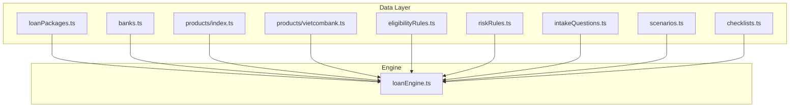
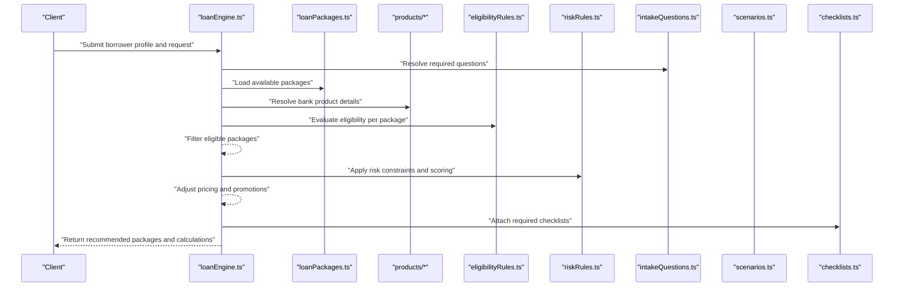
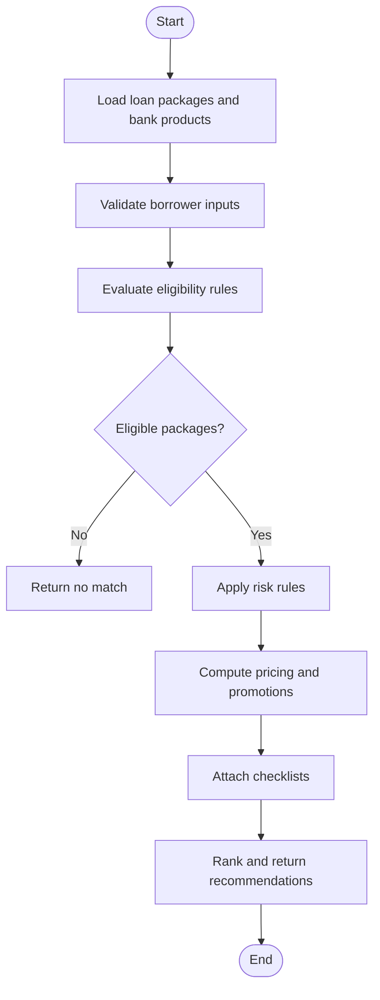
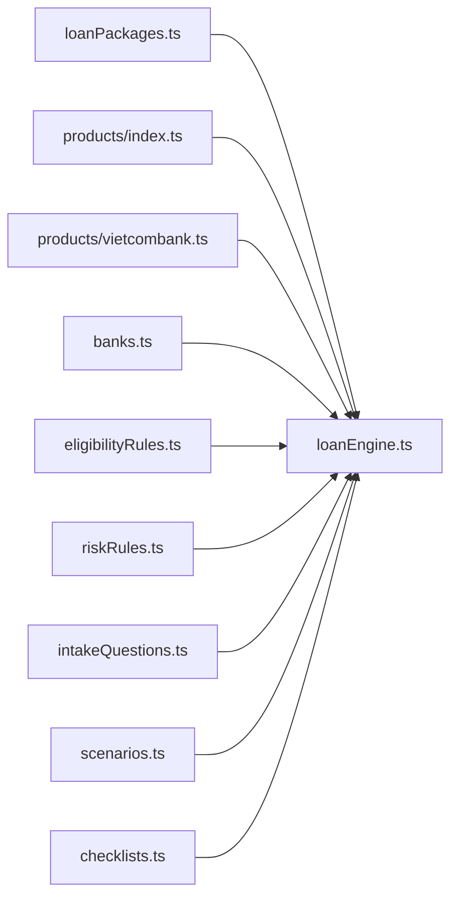

# Loan Packages Configuration

<cite>
**Referenced Files in This Document**
- [loanPackages.ts](file://src/data/loanPackages.ts)
- [index.ts](file://src/data/products/index.ts)
- [vietcombank.ts](file://src/data/products/vietcombank.ts)
- [banks.ts](file://src/data/banks.ts)
- [eligibilityRules.ts](file://src/data/eligibilityRules.ts)
- [riskRules.ts](file://src/data/riskRules.ts)
- [intakeQuestions.ts](file://src/data/intakeQuestions.ts)
- [scenarios.ts](file://src/data/scenarios.ts)
- [checklists.ts](file://src/data/checklists.ts)
- [loanEngine.ts](file://src/lib/loanEngine.ts)
</cite>

## Table of Contents
1. [Introduction](#introduction)
2. [Project Structure](#project-structure)
3. [Core Components](#core-components)
4. [Architecture Overview](#architecture-overview)
5. [Detailed Component Analysis](#detailed-component-analysis)
6. [Dependency Analysis](#dependency-analysis)
7. [Performance Considerations](#performance-considerations)
8. [Troubleshooting Guide](#troubleshooting-guide)
9. [Conclusion](#conclusion)

## Introduction
This document explains the loan packages configuration system used by the application to define, configure, and manage loan offerings. It covers the data model for loan packages (including types, pricing structures, and promotional offers), how packages relate to bank products, and the validation rules and business constraints applied during configuration and evaluation. It also provides guidance on creating custom loan packages and modifying existing configurations.

## Project Structure
Loan package configuration is primarily defined in static data files under src/data and consumed by the loan engine at runtime. The key files include:
- Loan packages definition and metadata
- Bank product catalogs and mappings
- Eligibility and risk rules that constrain package applicability
- Intake questions and scenarios that drive eligibility evaluation
- Checklists for compliance and documentation requirements
- The loan engine that orchestrates evaluation and selection

**Diagram sources**
- [loanPackages.ts](file://src/data/loanPackages.ts)
- [banks.ts](file://src/data/banks.ts)
- [index.ts](file://src/data/products/index.ts)
- [vietcombank.ts](file://src/data/products/vietcombank.ts)
- [eligibilityRules.ts](file://src/data/eligibilityRules.ts)
- [riskRules.ts](file://src/data/riskRules.ts)
- [intakeQuestions.ts](file://src/data/intakeQuestions.ts)
- [scenarios.ts](file://src/data/scenarios.ts)
- [checklists.ts](file://src/data/checklists.ts)
- [loanEngine.ts](file://src/lib/loanEngine.ts)

**Section sources**
- [loanPackages.ts](file://src/data/loanPackages.ts)
- [index.ts](file://src/data/products/index.ts)
- [vietcombank.ts](file://src/data/products/vietcombank.ts)
- [banks.ts](file://src/data/banks.ts)
- [eligibilityRules.ts](file://src/data/eligibilityRules.ts)
- [riskRules.ts](file://src/data/riskRules.ts)
- [intakeQuestions.ts](file://src/data/intakeQuestions.ts)
- [scenarios.ts](file://src/data/scenarios.ts)
- [checklists.ts](file://src/data/checklists.ts)
- [loanEngine.ts](file://src/lib/loanEngine.ts)

## Core Components
The loan packages configuration system consists of:
- Loan Package Model: Defines package identifiers, names, descriptions, associated bank product references, pricing parameters, term ranges, promotional offers, eligibility filters, and status flags.
- Bank Product Catalog: Centralized definitions of bank products with attributes such as product codes, names, supported currencies, and policy constraints.
- Eligibility Rules: Declarative rules that determine whether a borrower qualifies for a given package based on intake answers and profile attributes.
- Risk Rules: Constraints and scoring logic that influence approval thresholds, pricing adjustments, or conditional approvals.
- Intake Questions: Question sets and answer schemas used to collect borrower information required by eligibility and risk rules.
- Scenarios: Predefined borrower profiles used for testing and demonstration.
- Checklists: Required documents and steps per package or scenario.
- Loan Engine: Orchestrates evaluation of eligibility, risk, and pricing to produce recommended packages and calculations.

Key responsibilities:
- Data integrity: Strong typing and consistent schema across package definitions.
- Configurability: Easy addition of new packages and modifications to existing ones without code changes.
- Evaluation: Deterministic, rule-based selection and calculation pipeline.

**Section sources**
- [loanPackages.ts](file://src/data/loanPackages.ts)
- [index.ts](file://src/data/products/index.ts)
- [vietcombank.ts](file://src/data/products/vietcombank.ts)
- [eligibilityRules.ts](file://src/data/eligibilityRules.ts)
- [riskRules.ts](file://src/data/riskRules.ts)
- [intakeQuestions.ts](file://src/data/intakeQuestions.ts)
- [scenarios.ts](file://src/data/scenarios.ts)
- [checklists.ts](file://src/data/checklists.ts)
- [loanEngine.ts](file://src/lib/loanEngine.ts)

## Architecture Overview
At runtime, the loan engine loads configuration from data modules, evaluates borrower inputs against eligibility and risk rules, applies pricing and promotions, and returns ranked package recommendations with calculated terms.

**Diagram sources**
- [loanEngine.ts](file://src/lib/loanEngine.ts)
- [loanPackages.ts](file://src/data/loanPackages.ts)
- [index.ts](file://src/data/products/index.ts)
- [vietcombank.ts](file://src/data/products/vietcombank.ts)
- [eligibilityRules.ts](file://src/data/eligibilityRules.ts)
- [riskRules.ts](file://src/data/riskRules.ts)
- [intakeQuestions.ts](file://src/data/intakeQuestions.ts)
- [scenarios.ts](file://src/data/scenarios.ts)
- [checklists.ts](file://src/data/checklists.ts)

## Detailed Component Analysis

### Loan Package Data Model
The loan package model defines:
- Identification: Unique ID, display name, description, and versioning.
- Type: Category such as personal, mortgage, auto, or business loans.
- Bank Product Mapping: References to one or more bank products to align policies and limits.
- Pricing Structure: Base rate, fee schedule, compounding frequency, and minimum/maximum amounts.
- Term Parameters: Minimum and maximum tenor, payment frequency options.
- Promotional Offers: Conditional discounts, waived fees, or bonus rates tied to criteria.
- Eligibility Filters: Borrower attributes and income thresholds required for qualification.
- Status Flags: Active, draft, deprecated, and effective date ranges.

Best practices:
- Keep IDs stable and human-readable.
- Use explicit currency and unit fields to avoid ambiguity.
- Separate base pricing from promotions to maintain clarity.
- Version packages when changing critical terms.

**Section sources**
- [loanPackages.ts](file://src/data/loanPackages.ts)

### Bank Products and Relationships
Bank products encapsulate institutional policies and constraints that apply to loan packages:
- Product identifiers and names
- Supported currencies and regions
- Policy limits (max loan amount, max LTV, minimum credit score)
- Regulatory constraints and documentation requirements

Relationships:
- A loan package references one or more bank products to inherit policy constraints.
- Multiple packages can map to the same product if differentiated by marketing or promotional layers.
- Product updates propagate to dependent packages via shared references.

**Section sources**
- [index.ts](file://src/data/products/index.ts)
- [vietcombank.ts](file://src/data/products/vietcombank.ts)
- [banks.ts](file://src/data/banks.ts)

### Eligibility Rules
Eligibility rules are declarative conditions evaluated against borrower intake data:
- Income thresholds and employment type
- Credit score bands and history requirements
- Debt-to-income ratios and existing obligations
- Residency and age constraints

Evaluation flow:
- Resolve required questions from intake schema.
- Validate input values and coerce types.
- Apply rule expressions to compute pass/fail per package.

**Section sources**
- [eligibilityRules.ts](file://src/data/eligibilityRules.ts)
- [intakeQuestions.ts](file://src/data/intakeQuestions.ts)

### Risk Rules
Risk rules refine approval decisions and may adjust pricing or terms:
- Credit risk scoring thresholds
- Collateral valuation constraints
- Behavioral indicators and repayment capacity metrics
- Conditional approvals and additional documentation triggers

Integration:
- Applied after eligibility filtering.
- Can modify final interest rate, fees, or tenor within allowed bounds.

**Section sources**
- [riskRules.ts](file://src/data/riskRules.ts)

### Scenarios and Checklists
Scenarios provide sample borrower profiles for testing and demos:
- Predefined answers to intake questions
- Expected eligibility outcomes and recommended packages

Checklists ensure compliance and completeness:
- Required documents per package or scenario
- Steps for verification and approval workflow

**Section sources**
- [scenarios.ts](file://src/data/scenarios.ts)
- [checklists.ts](file://src/data/checklists.ts)

### Loan Engine Orchestration
The loan engine coordinates the evaluation pipeline:
- Loads configuration from data modules
- Validates borrower inputs against intake schema
- Evaluates eligibility and risk rules
- Computes pricing, fees, and promotions
- Returns ranked recommendations with explanations

**Diagram sources**
- [loanEngine.ts](file://src/lib/loanEngine.ts)

**Section sources**
- [loanEngine.ts](file://src/lib/loanEngine.ts)

## Dependency Analysis
The configuration system exhibits clear separation between data definitions and evaluation logic:
- Data modules are independent and immutable at runtime.
- The loan engine depends on all data modules but does not mutate them.
- Bank products are referenced by loan packages, enabling centralized policy management.
- Eligibility and risk rules depend on intake question schemas.

**Diagram sources**
- [loanPackages.ts](file://src/data/loanPackages.ts)
- [index.ts](file://src/data/products/index.ts)
- [vietcombank.ts](file://src/data/products/vietcombank.ts)
- [banks.ts](file://src/data/banks.ts)
- [eligibilityRules.ts](file://src/data/eligibilityRules.ts)
- [riskRules.ts](file://src/data/riskRules.ts)
- [intakeQuestions.ts](file://src/data/intakeQuestions.ts)
- [scenarios.ts](file://src/data/scenarios.ts)
- [checklists.ts](file://src/data/checklists.ts)
- [loanEngine.ts](file://src/lib/loanEngine.ts)

**Section sources**
- [loanPackages.ts](file://src/data/loanPackages.ts)
- [index.ts](file://src/data/products/index.ts)
- [vietcombank.ts](file://src/data/products/vietcombank.ts)
- [banks.ts](file://src/data/banks.ts)
- [eligibilityRules.ts](file://src/data/eligibilityRules.ts)
- [riskRules.ts](file://src/data/riskRules.ts)
- [intakeQuestions.ts](file://src/data/intakeQuestions.ts)
- [scenarios.ts](file://src/data/scenarios.ts)
- [checklists.ts](file://src/data/checklists.ts)
- [loanEngine.ts](file://src/lib/loanEngine.ts)

## Performance Considerations
- Prefer immutable data structures for configuration to avoid runtime mutations.
- Cache computed results for repeated evaluations with identical inputs.
- Defer heavy computations until necessary and short-circuit early on failed eligibility checks.
- Use efficient lookups for bank product references and rule matching.

[No sources needed since this section provides general guidance]

## Troubleshooting Guide
Common issues and resolutions:
- Missing or invalid package references: Ensure all bank product IDs exist and are active.
- Inconsistent units or currencies: Validate currency codes and numeric units consistently.
- Rule evaluation failures: Confirm intake question schemas match expected types and ranges.
- Promotion conflicts: Verify that overlapping promotions resolve deterministically.
- Deprecated packages still selected: Check effective date ranges and status flags.

Validation checklist:
- All required fields present and typed correctly
- Referential integrity for bank products and rules
- Business constraints satisfied (limits, ratios, scores)
- Promotions do not violate minimum margin policies

**Section sources**
- [loanPackages.ts](file://src/data/loanPackages.ts)
- [eligibilityRules.ts](file://src/data/eligibilityRules.ts)
- [riskRules.ts](file://src/data/riskRules.ts)
- [intakeQuestions.ts](file://src/data/intakeQuestions.ts)

## Conclusion
The loan packages configuration system provides a robust, configurable foundation for defining and managing loan offerings. By separating data definitions from evaluation logic and enforcing strict validation and business constraints, it enables flexible customization while maintaining consistency and reliability. Following the guidelines here will help you create custom packages, update existing configurations, and integrate new bank products seamlessly.

[No sources needed since this section summarizes without analyzing specific files]