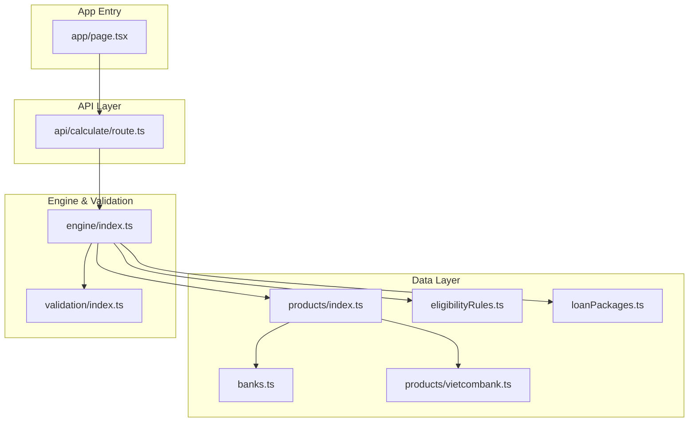
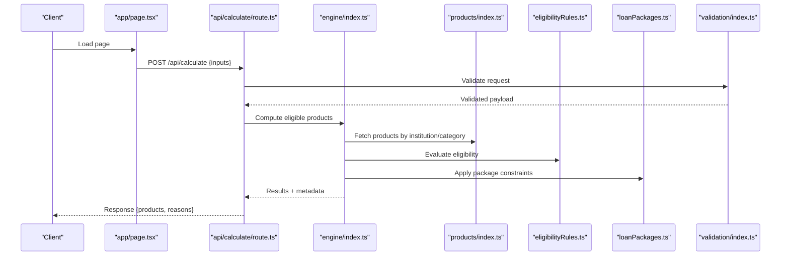
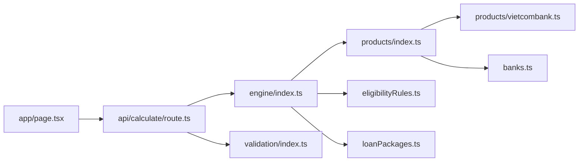

# Product Catalog System

<cite>
**Referenced Files in This Document**
- [src/data/products/index.ts](file://src/data/products/index.ts)
- [src/data/products/vietcombank.ts](file://src/data/products/vietcombank.ts)
- [src/data/banks.ts](file://src/data/banks.ts)
- [src/data/eligibilityRules.ts](file://src/data/eligibilityRules.ts)
- [src/data/loanPackages.ts](file://src/data/loanPackages.ts)
- [src/lib/engine/index.ts](file://src/lib/engine/index.ts)
- [src/lib/validation/index.ts](file://src/lib/validation/index.ts)
- [src/app/api/calculate/route.ts](file://src/app/api/calculate/route.ts)
- [src/app/page.tsx](file://src/app/page.tsx)
</cite>

## Table of Contents
1. [Introduction](#introduction)
2. [Project Structure](#project-structure)
3. [Core Components](#core-components)
4. [Architecture Overview](#architecture-overview)
5. [Detailed Component Analysis](#detailed-component-analysis)
6. [Dependency Analysis](#dependency-analysis)
7. [Performance Considerations](#performance-considerations)
8. [Troubleshooting Guide](#troubleshooting-guide)
9. [Conclusion](#conclusion)

## Introduction
This document describes the product catalog system that manages loan products across multiple banking institutions. It explains how products are modeled, organized by institution, indexed for retrieval and filtering, and synchronized with external sources. It also covers versioning, updates, and provides examples for adding new products and configuring attributes.

## Project Structure
The product catalog is implemented as a data-driven module under src/data, with supporting engine and validation logic under src/lib. The API layer exposes endpoints to compute results using the catalog.

**Diagram sources**
- [src/data/banks.ts](file://src/data/banks.ts)
- [src/data/products/index.ts](file://src/data/products/index.ts)
- [src/data/products/vietcombank.ts](file://src/data/products/vietcombank.ts)
- [src/data/eligibilityRules.ts](file://src/data/eligibilityRules.ts)
- [src/data/loanPackages.ts](file://src/data/loanPackages.ts)
- [src/lib/engine/index.ts](file://src/lib/engine/index.ts)
- [src/lib/validation/index.ts](file://src/lib/validation/index.ts)
- [src/app/api/calculate/route.ts](file://src/app/api/calculate/route.ts)
- [src/app/page.tsx](file://src/app/page.tsx)

**Section sources**
- [src/data/products/index.ts](file://src/data/products/index.ts)
- [src/data/products/vietcombank.ts](file://src/data/products/vietcombank.ts)
- [src/data/banks.ts](file://src/data/banks.ts)
- [src/data/eligibilityRules.ts](file://src/data/eligibilityRules.ts)
- [src/data/loanPackages.ts](file://src/data/loanPackages.ts)
- [src/lib/engine/index.ts](file://src/lib/engine/index.ts)
- [src/lib/validation/index.ts](file://src/lib/validation/index.ts)
- [src/app/api/calculate/route.ts](file://src/app/api/calculate/route.ts)
- [src/app/page.tsx](file://src/app/page.tsx)

## Core Components
- Product registry: Central index that aggregates products from multiple institution modules.
- Institution-specific catalogs: Per-bank product definitions (e.g., Vietcombank).
- Eligibility rules: Criteria used to determine whether a borrower qualifies for a product.
- Loan packages: Bundles or groupings of related products or terms.
- Engine: Orchestrates retrieval, filtering, and computation over products.
- Validation: Ensures inputs and outputs conform to expected schemas.
- API route: Exposes calculation endpoints that use the engine and catalog.

Key responsibilities:
- Organize products by institution and category.
- Provide indexing for fast lookup and filtering.
- Apply eligibility rules and package constraints.
- Support versioned product records and updates.
- Synchronize with external sources through defined ingestion points.

**Section sources**
- [src/data/products/index.ts](file://src/data/products/index.ts)
- [src/data/products/vietcombank.ts](file://src/data/products/vietcombank.ts)
- [src/data/eligibilityRules.ts](file://src/data/eligibilityRules.ts)
- [src/data/loanPackages.ts](file://src/data/loanPackages.ts)
- [src/lib/engine/index.ts](file://src/lib/engine/index.ts)
- [src/lib/validation/index.ts](file://src/lib/validation/index.ts)
- [src/app/api/calculate/route.ts](file://src/app/api/calculate/route.ts)

## Architecture Overview
The system follows a layered architecture:
- Data layer defines static product catalogs and rules.
- Engine layer performs queries, filtering, and computations.
- Validation layer enforces schema contracts.
- API layer exposes HTTP endpoints for clients.
- App entry renders UI and invokes API routes.

**Diagram sources**
- [src/app/page.tsx](file://src/app/page.tsx)
- [src/app/api/calculate/route.ts](file://src/app/api/calculate/route.ts)
- [src/lib/engine/index.ts](file://src/lib/engine/index.ts)
- [src/data/products/index.ts](file://src/data/products/index.ts)
- [src/data/eligibilityRules.ts](file://src/data/eligibilityRules.ts)
- [src/data/loanPackages.ts](file://src/data/loanPackages.ts)
- [src/lib/validation/index.ts](file://src/lib/validation/index.ts)

## Detailed Component Analysis

### Product Data Model
Products are modeled with fields covering type, interest rates, terms, eligibility criteria, and institutional context. Typical attributes include:
- Identifier and version
- Institution and category
- Loan type and purpose
- Interest rate model and ranges
- Term length and repayment schedule
- Eligibility rules references
- Package associations
- Status flags (active, deprecated)

Versioning and lifecycle:
- Each product record includes a version identifier.
- Updates create new versions while preserving historical records.
- Active version selection is controlled by configuration or filters.

Synchronization:
- External sources can be ingested via adapters that map external schemas to internal product models.
- Ingestion pipelines should handle deduplication, conflict resolution, and audit logs.

Examples:
- Adding a new product involves defining its attributes and associating it with an institution and category.
- Configuring attributes includes setting rate types, term options, and eligibility rule IDs.

**Section sources**
- [src/data/products/index.ts](file://src/data/products/index.ts)
- [src/data/products/vietcombank.ts](file://src/data/products/vietcombank.ts)
- [src/data/eligibilityRules.ts](file://src/data/eligibilityRules.ts)
- [src/data/loanPackages.ts](file://src/data/loanPackages.ts)

### Institution Organization and Categorization
Products are grouped by institution and categorized for easy access:
- Institution mapping links products to specific banks.
- Categories enable filtering by loan type or purpose.
- Index structures support fast lookups by institutionId and category.

Benefits:
- Simplifies multi-institution browsing.
- Enables targeted marketing and compliance checks per institution.

**Section sources**
- [src/data/banks.ts](file://src/data/banks.ts)
- [src/data/products/index.ts](file://src/data/products/index.ts)

### Product Indexing and Retrieval
Indexing strategy:
- Primary keys: productId, institutionId, categoryId.
- Secondary indexes: loanType, status, activeVersion.
- Aggregation: Central index merges per-institution catalogs.

Retrieval and filtering:
- Filter by institution, category, loan type, status, and version.
- Combine eligibility rules and package constraints to narrow results.
- Return ranked or scored results based on matching criteria.

**Section sources**
- [src/data/products/index.ts](file://src/data/products/index.ts)
- [src/lib/engine/index.ts](file://src/lib/engine/index.ts)

### Engine Orchestration
The engine coordinates:
- Loading product catalogs and rules.
- Applying filters and eligibility checks.
- Computing results and attaching explanations.
- Returning structured responses for API consumers.

Error handling:
- Validates inputs and handles missing or invalid data gracefully.
- Returns detailed reasons for ineligibility.

**Section sources**
- [src/lib/engine/index.ts](file://src/lib/engine/index.ts)
- [src/lib/validation/index.ts](file://src/lib/validation/index.ts)

### API Endpoint: Calculate
The calculate endpoint:
- Accepts client inputs (borrower profile, preferences).
- Validates payloads.
- Invokes the engine to compute eligible products.
- Returns results with metadata and reasons.

Usage example flow:
- Client sends a POST request with borrower data.
- Server validates and computes eligible products.
- Response includes product list, eligibility reasons, and recommended options.

**Section sources**
- [src/app/api/calculate/route.ts](file://src/app/api/calculate/route.ts)
- [src/lib/validation/index.ts](file://src/lib/validation/index.ts)
- [src/lib/engine/index.ts](file://src/lib/engine/index.ts)

### App Entry Point
The application page integrates with the API to display product recommendations and details. It may also provide forms for input collection and result visualization.

**Section sources**
- [src/app/page.tsx](file://src/app/page.tsx)
- [src/app/api/calculate/route.ts](file://src/app/api/calculate/route.ts)

## Dependency Analysis
The catalog system has clear dependencies:
- Engine depends on product catalogs, eligibility rules, and loan packages.
- API depends on engine and validation.
- App depends on API.

**Diagram sources**
- [src/app/page.tsx](file://src/app/page.tsx)
- [src/app/api/calculate/route.ts](file://src/app/api/calculate/route.ts)
- [src/lib/engine/index.ts](file://src/lib/engine/index.ts)
- [src/data/products/index.ts](file://src/data/products/index.ts)
- [src/data/products/vietcombank.ts](file://src/data/products/vietcombank.ts)
- [src/data/banks.ts](file://src/data/banks.ts)
- [src/data/eligibilityRules.ts](file://src/data/eligibilityRules.ts)
- [src/data/loanPackages.ts](file://src/data/loanPackages.ts)
- [src/lib/validation/index.ts](file://src/lib/validation/index.ts)

**Section sources**
- [src/lib/engine/index.ts](file://src/lib/engine/index.ts)
- [src/app/api/calculate/route.ts](file://src/app/api/calculate/route.ts)
- [src/data/products/index.ts](file://src/data/products/index.ts)

## Performance Considerations
- Precompute indexes at startup to reduce runtime overhead.
- Cache frequently accessed institution catalogs and eligibility rules.
- Use efficient filtering strategies (e.g., early exits on hard constraints).
- Avoid deep object cloning; prefer immutable updates where necessary.
- Batch eligibility evaluations to minimize repeated computations.

[No sources needed since this section provides general guidance]

## Troubleshooting Guide
Common issues and resolutions:
- Missing product fields: Ensure all required attributes are present in product definitions.
- Invalid eligibility rules: Verify rule IDs and conditions referenced by products.
- Version conflicts: Confirm active version selection and deprecation flags.
- API validation errors: Check input schemas and required fields.
- Sync failures: Inspect ingestion pipeline logs and mapping configurations.

Debugging steps:
- Log engine inputs and intermediate results.
- Validate payloads before invoking the engine.
- Review eligibility rule evaluation outcomes.
- Compare product versions to identify changes affecting results.

**Section sources**
- [src/lib/validation/index.ts](file://src/lib/validation/index.ts)
- [src/lib/engine/index.ts](file://src/lib/engine/index.ts)
- [src/app/api/calculate/route.ts](file://src/app/api/calculate/route.ts)

## Conclusion
The product catalog system provides a robust foundation for managing loan products across multiple institutions. With clear data modeling, indexing, and orchestration, it supports efficient retrieval, filtering, and synchronization. By following the guidelines for adding products, configuring attributes, and maintaining versions, teams can scale the catalog reliably and integrate with external sources effectively.