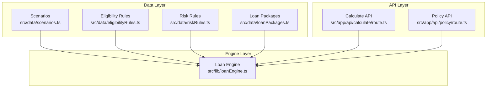
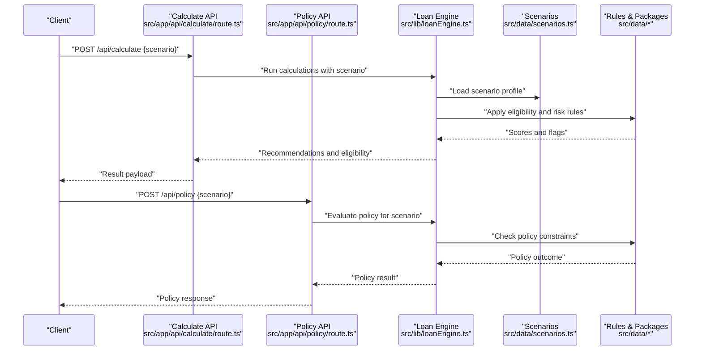
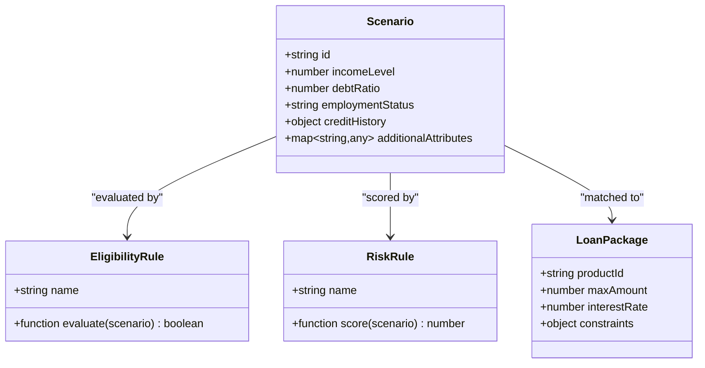
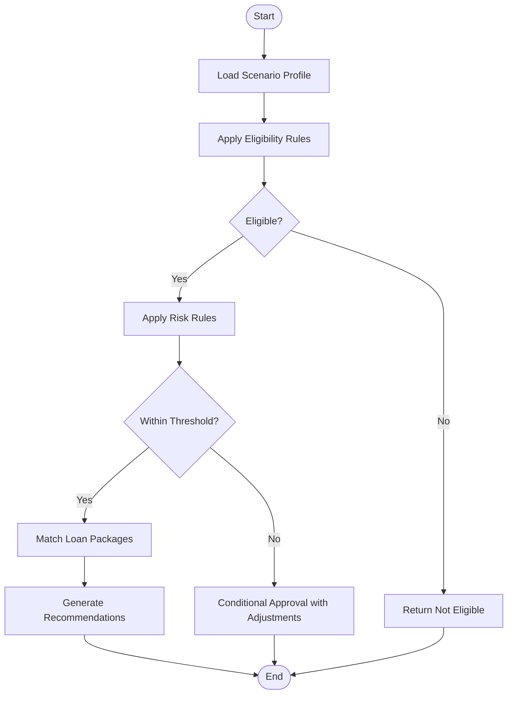
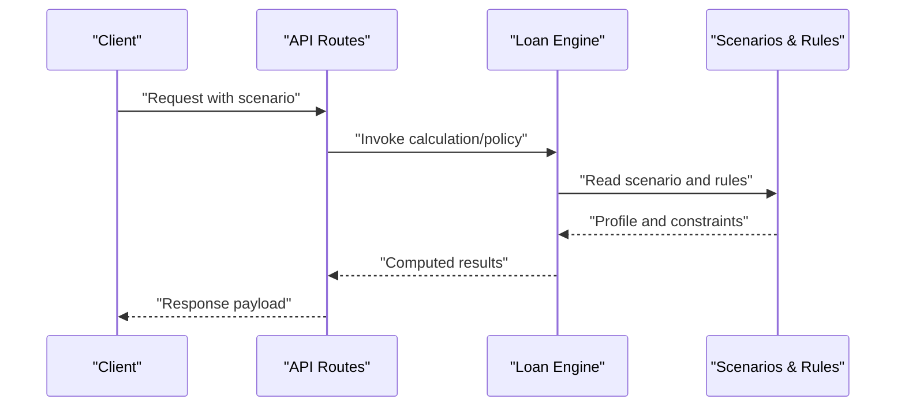
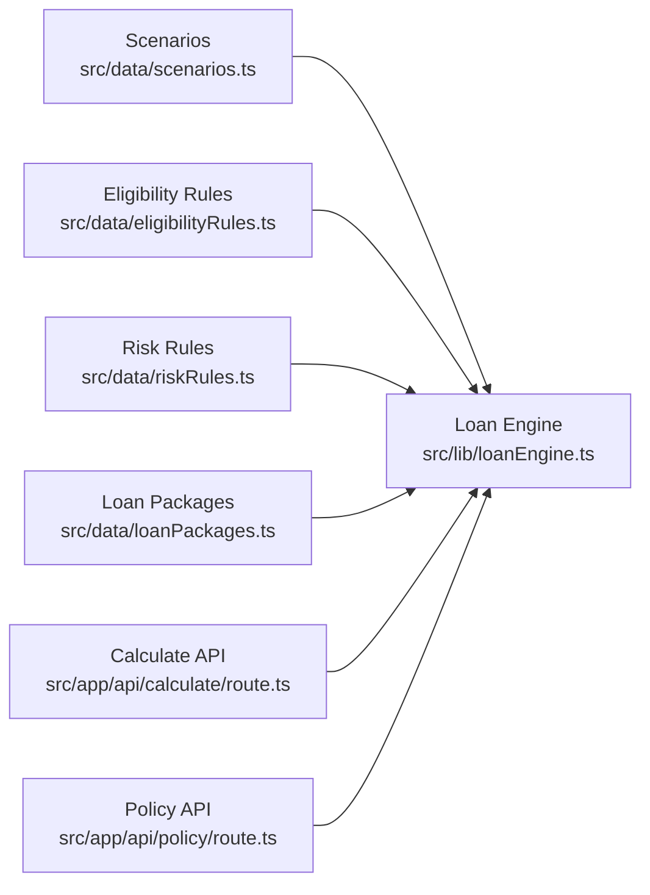

# Scenarios Management

<cite>
**Referenced Files in This Document**
- [scenarios.ts](file://src/data/scenarios.ts)
- [eligibilityRules.ts](file://src/data/eligibilityRules.ts)
- [riskRules.ts](file://src/data/riskRules.ts)
- [loanPackages.ts](file://src/data/loanPackages.ts)
- [calculate/route.ts](file://src/app/api/calculate/route.ts)
- [policy/route.ts](file://src/app/api/policy/route.ts)
- [loanEngine.ts](file://src/lib/loanEngine.ts)
</cite>

## Table of Contents
1. [Introduction](#introduction)
2. [Project Structure](#project-structure)
3. [Core Components](#core-components)
4. [Architecture Overview](#architecture-overview)
5. [Detailed Component Analysis](#detailed-component-analysis)
6. [Dependency Analysis](#dependency-analysis)
7. [Performance Considerations](#performance-considerations)
8. [Troubleshooting Guide](#troubleshooting-guide)
9. [Conclusion](#conclusion)
10. [Appendices](#appendices)

## Introduction
This document explains the scenarios management system that models different borrower situations and financial profiles to simulate lending outcomes and calculate loan eligibility. It covers:
- The scenario data structure, including income levels, debt ratios, employment status, and credit history patterns
- How scenarios are consumed by the engine to compute eligibility and recommendations
- The process for creating new scenarios and integrating them into calculations
- Examples of scenario-based calculations and their impact on loan recommendations

The goal is to make it easy for both technical and non-technical users to understand how scenarios drive decisions and how to extend the system with new borrower profiles.

## Project Structure
The scenarios system is primarily defined in data files under src/data and consumed by API routes and the loan engine. Key locations:
- Scenario definitions and related rules live in src/data (scenarios, eligibility rules, risk rules, loan packages)
- API endpoints in src/app/api provide calculation and policy evaluation services
- The loan engine in src/lib orchestrates scoring and decision logic

**Diagram sources**
- [scenarios.ts](file://src/data/scenarios.ts)
- [eligibilityRules.ts](file://src/data/eligibilityRules.ts)
- [riskRules.ts](file://src/data/riskRules.ts)
- [loanPackages.ts](file://src/data/loanPackages.ts)
- [calculate/route.ts](file://src/app/api/calculate/route.ts)
- [policy/route.ts](file://src/app/api/policy/route.ts)
- [loanEngine.ts](file://src/lib/loanEngine.ts)

**Section sources**
- [scenarios.ts](file://src/data/scenarios.ts)
- [eligibilityRules.ts](file://src/data/eligibilityRules.ts)
- [riskRules.ts](file://src/data/riskRules.ts)
- [loanPackages.ts](file://src/data/loanPackages.ts)
- [calculate/route.ts](file://src/app/api/calculate/route.ts)
- [policy/route.ts](file://src/app/api/policy/route.ts)
- [loanEngine.ts](file://src/lib/loanEngine.ts)

## Core Components
- Scenarios: Define borrower profiles with attributes such as income, debt-to-income ratio, employment status, and credit history indicators. These serve as inputs to the engine for simulation.
- Eligibility Rules: Encode thresholds and conditions used to determine whether a borrower qualifies for specific products or terms.
- Risk Rules: Capture risk factors and scoring adjustments based on profile characteristics and behavior patterns.
- Loan Packages: Represent available loan products, limits, rates, and constraints that can be matched to eligible borrowers.
- Loan Engine: Orchestrates rule application, scoring, and recommendation generation using scenarios and rules.
- API Endpoints: Expose calculation and policy evaluation capabilities to clients.

How they work together:
- A scenario is provided to the engine along with applicable rules and product catalog.
- The engine evaluates eligibility and risk, computes scores, and returns recommendations tailored to the scenario.
- API endpoints accept requests, invoke the engine, and return results to callers.

**Section sources**
- [scenarios.ts](file://src/data/scenarios.ts)
- [eligibilityRules.ts](file://src/data/eligibilityRules.ts)
- [riskRules.ts](file://src/data/riskRules.ts)
- [loanPackages.ts](file://src/data/loanPackages.ts)
- [loanEngine.ts](file://src/lib/loanEngine.ts)
- [calculate/route.ts](file://src/app/api/calculate/route.ts)
- [policy/route.ts](file://src/app/api/policy/route.ts)

## Architecture Overview
The scenarios system follows a layered architecture:
- Data layer defines scenarios, rules, and product catalogs
- Engine layer applies rules to scenarios to compute eligibility and risk
- API layer exposes endpoints to trigger calculations and policy checks

**Diagram sources**
- [calculate/route.ts](file://src/app/api/calculate/route.ts)
- [policy/route.ts](file://src/app/api/policy/route.ts)
- [loanEngine.ts](file://src/lib/loanEngine.ts)
- [scenarios.ts](file://src/data/scenarios.ts)
- [eligibilityRules.ts](file://src/data/eligibilityRules.ts)
- [riskRules.ts](file://src/data/riskRules.ts)
- [loanPackages.ts](file://src/data/loanPackages.ts)

## Detailed Component Analysis

### Scenario Data Model
Scenarios represent borrower profiles and include fields such as:
- Income level(s): monthly or annual income, stability indicators
- Debt ratios: existing obligations relative to income
- Employment status: type of employment, tenure, stability
- Credit history patterns: past performance indicators, delinquencies, utilization trends

These fields feed into eligibility and risk evaluations to determine loan suitability and terms.

**Diagram sources**
- [scenarios.ts](file://src/data/scenarios.ts)
- [eligibilityRules.ts](file://src/data/eligibilityRules.ts)
- [riskRules.ts](file://src/data/riskRules.ts)
- [loanPackages.ts](file://src/data/loanPackages.ts)

**Section sources**
- [scenarios.ts](file://src/data/scenarios.ts)
- [eligibilityRules.ts](file://src/data/eligibilityRules.ts)
- [riskRules.ts](file://src/data/riskRules.ts)
- [loanPackages.ts](file://src/data/loanPackages.ts)

### Scenario Creation Process
To add a new scenario:
- Define a new scenario object with required attributes (income, debt ratio, employment status, credit history).
- Ensure attribute names and types align with those expected by eligibility and risk rules.
- Optionally include additional attributes for nuanced modeling.
- Register the scenario in the dataset so the engine can load it during calculations.

Best practices:
- Keep scenario definitions consistent and well-documented
- Validate inputs before submission to the engine
- Use clear identifiers and descriptive labels for traceability

**Section sources**
- [scenarios.ts](file://src/data/scenarios.ts)

### Eligibility and Risk Evaluation Flow
The engine processes scenarios through a structured flow:
- Load scenario profile
- Apply eligibility rules to determine qualification
- Apply risk rules to compute risk scores and adjustments
- Match eligible scenarios against loan packages to generate recommendations

**Diagram sources**
- [loanEngine.ts](file://src/lib/loanEngine.ts)
- [eligibilityRules.ts](file://src/data/eligibilityRules.ts)
- [riskRules.ts](file://src/data/riskRules.ts)
- [loanPackages.ts](file://src/data/loanPackages.ts)

**Section sources**
- [loanEngine.ts](file://src/lib/loanEngine.ts)
- [eligibilityRules.ts](file://src/data/eligibilityRules.ts)
- [riskRules.ts](file://src/data/riskRules.ts)
- [loanPackages.ts](file://src/data/loanPackages.ts)

### API Integration for Calculations
Clients interact with the system via API endpoints:
- POST /api/calculate: Accepts a scenario and returns eligibility and recommendations
- POST /api/policy: Evaluates policy constraints for a given scenario

The endpoints delegate to the loan engine, which applies rules and returns structured results.

**Diagram sources**
- [calculate/route.ts](file://src/app/api/calculate/route.ts)
- [policy/route.ts](file://src/app/api/policy/route.ts)
- [loanEngine.ts](file://src/lib/loanEngine.ts)
- [scenarios.ts](file://src/data/scenarios.ts)
- [eligibilityRules.ts](file://src/data/eligibilityRules.ts)
- [riskRules.ts](file://src/data/riskRules.ts)
- [loanPackages.ts](file://src/data/loanPackages.ts)

**Section sources**
- [calculate/route.ts](file://src/app/api/calculate/route.ts)
- [policy/route.ts](file://src/app/api/policy/route.ts)
- [loanEngine.ts](file://src/lib/loanEngine.ts)

## Dependency Analysis
The scenarios system has clear dependencies:
- Scenarios depend on consistent field definitions across rules and packages
- Eligibility and risk rules depend on scenario attributes being present and valid
- The loan engine depends on all data modules to produce accurate outputs
- API routes depend on the engine and data modules to serve requests

**Diagram sources**
- [scenarios.ts](file://src/data/scenarios.ts)
- [eligibilityRules.ts](file://src/data/eligibilityRules.ts)
- [riskRules.ts](file://src/data/riskRules.ts)
- [loanPackages.ts](file://src/data/loanPackages.ts)
- [loanEngine.ts](file://src/lib/loanEngine.ts)
- [calculate/route.ts](file://src/app/api/calculate/route.ts)
- [policy/route.ts](file://src/app/api/policy/route.ts)

**Section sources**
- [scenarios.ts](file://src/data/scenarios.ts)
- [eligibilityRules.ts](file://src/data/eligibilityRules.ts)
- [riskRules.ts](file://src/data/riskRules.ts)
- [loanPackages.ts](file://src/data/loanPackages.ts)
- [loanEngine.ts](file://src/lib/loanEngine.ts)
- [calculate/route.ts](file://src/app/api/calculate/route.ts)
- [policy/route.ts](file://src/app/api/policy/route.ts)

## Performance Considerations
- Precompute stable rule sets where possible to reduce runtime overhead
- Cache frequently accessed scenario profiles and product catalogs
- Validate inputs early to avoid expensive computations on invalid data
- Batch multiple scenario evaluations when processing large datasets
- Monitor rule complexity and optimize thresholds to maintain responsiveness

[No sources needed since this section provides general guidance]

## Troubleshooting Guide
Common issues and resolutions:
- Missing or invalid scenario fields: Ensure all required attributes are present and correctly typed
- Rule mismatches: Verify that scenario attributes match expectations in eligibility and risk rules
- Engine errors: Check logs from the loan engine for failed evaluations or unexpected states
- API failures: Inspect request payloads and responses from calculate and policy endpoints

Recommended steps:
- Validate scenario data before submission
- Review rule definitions for consistency with scenario schema
- Add logging around key evaluation steps to pinpoint failures
- Test with known-good scenarios to isolate regressions

**Section sources**
- [scenarios.ts](file://src/data/scenarios.ts)
- [eligibilityRules.ts](file://src/data/eligibilityRules.ts)
- [riskRules.ts](file://src/data/riskRules.ts)
- [loanEngine.ts](file://src/lib/loanEngine.ts)
- [calculate/route.ts](file://src/app/api/calculate/route.ts)
- [policy/route.ts](file://src/app/api/policy/route.ts)

## Conclusion
The scenarios management system provides a robust foundation for modeling borrower profiles and simulating lending outcomes. By defining clear scenario structures, applying eligibility and risk rules, and leveraging loan packages, the engine produces actionable recommendations. Extending the system involves adding new scenarios and ensuring alignment with existing rules and packages. Proper validation, caching, and monitoring will help maintain performance and reliability.

[No sources needed since this section summarizes without analyzing specific files]

## Appendices

### Example Scenario-Based Calculations
- Low income, high debt ratio: Likely not eligible for standard loans; may receive conditional offers with reduced amounts or higher rates
- Stable employment, moderate debt ratio: Eligible for multiple packages; engine recommends best-fit product based on risk score
- Strong credit history, low debt ratio: High eligibility; engine suggests optimal package with favorable terms

These examples illustrate how scenario attributes influence eligibility and recommendations.

**Section sources**
- [scenarios.ts](file://src/data/scenarios.ts)
- [eligibilityRules.ts](file://src/data/eligibilityRules.ts)
- [riskRules.ts](file://src/data/riskRules.ts)
- [loanPackages.ts](file://src/data/loanPackages.ts)
- [loanEngine.ts](file://src/lib/loanEngine.ts)