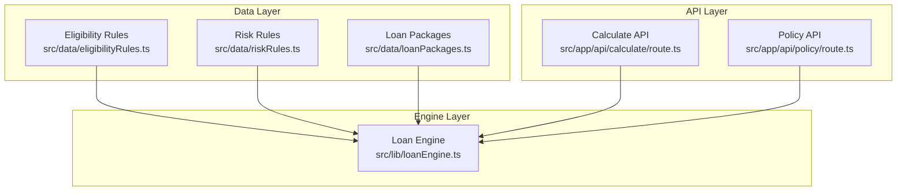
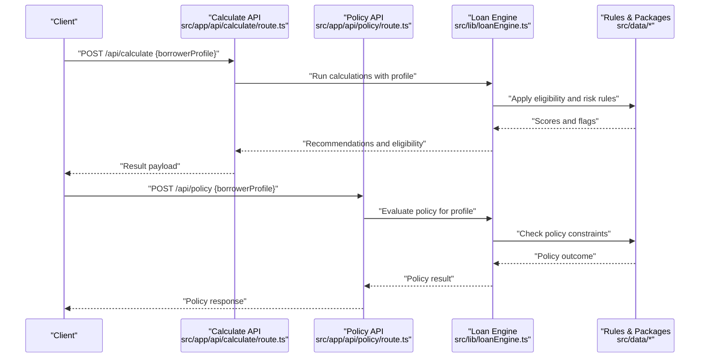
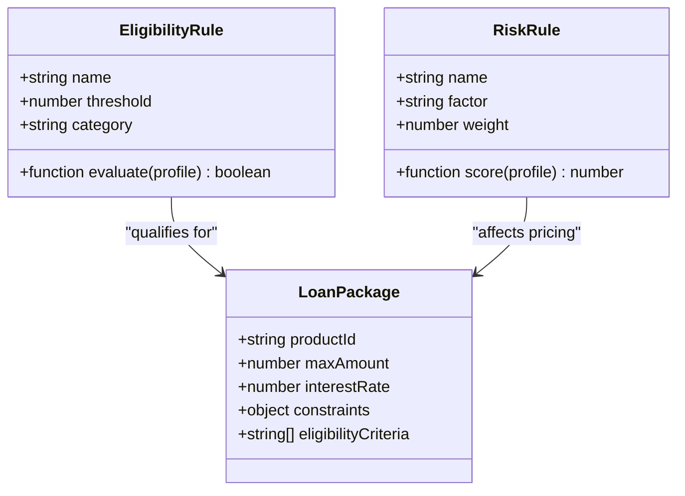
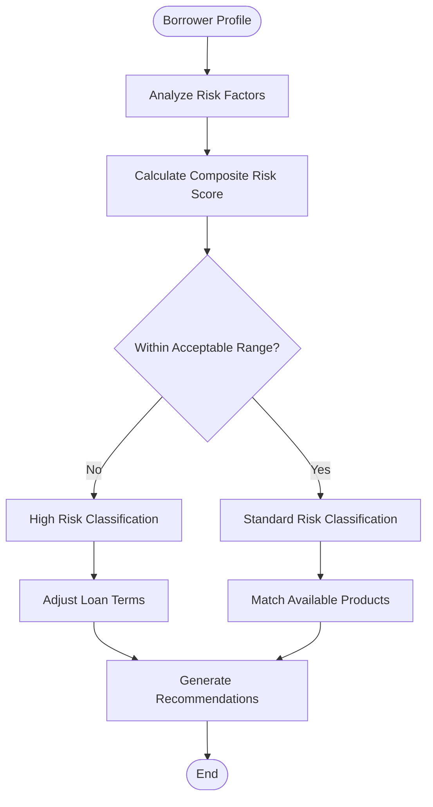
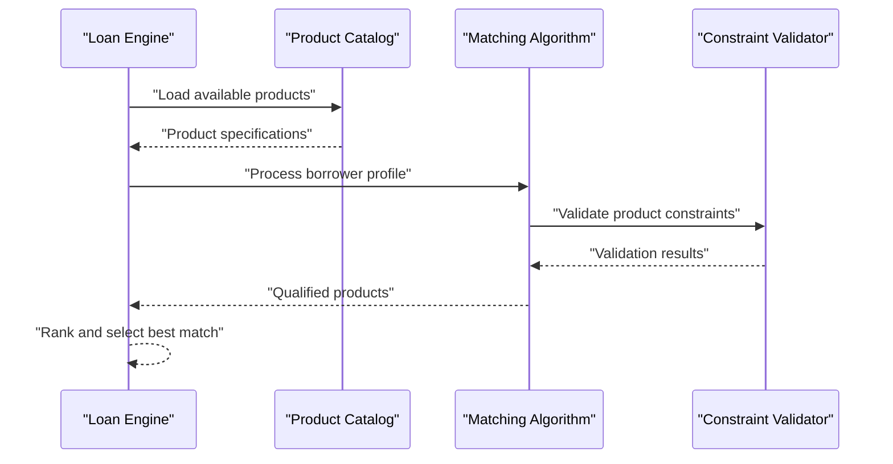
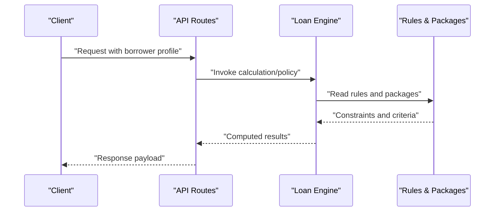
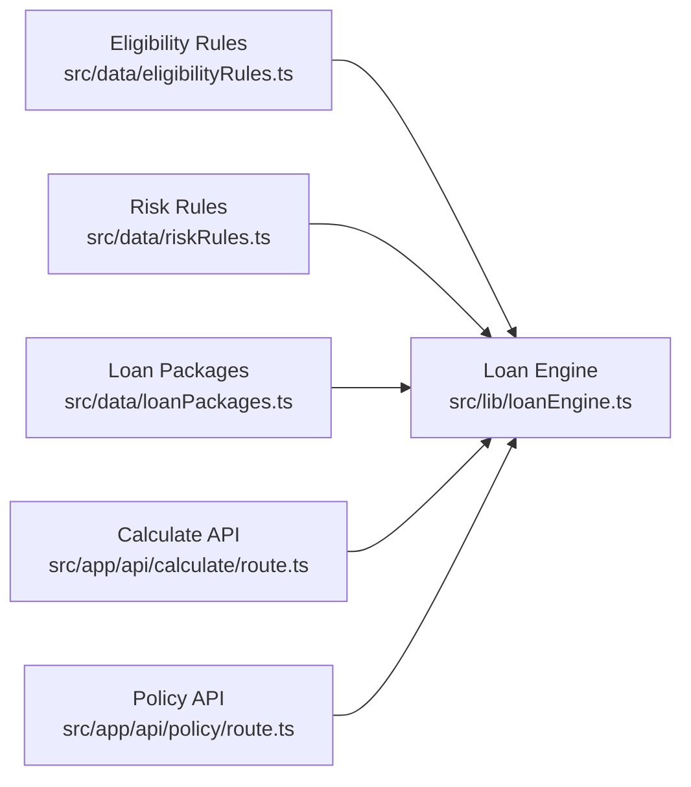

# Scenarios Management

<cite>
**Referenced Files in This Document**
- [eligibilityRules.ts](file://src/data/eligibilityRules.ts)
- [riskRules.ts](file://src/data/riskRules.ts)
- [loanPackages.ts](file://src/data/loanPackages.ts)
- [calculate/route.ts](file://src/app/api/calculate/route.ts)
- [policy/route.ts](file://src/app/api/policy/route.ts)
- [loanEngine.ts](file://src/lib/loanEngine.ts)
</cite>

## Update Summary
**Changes Made**
- Removed all references to automated scenario-based financial planning features
- Updated architecture diagrams to reflect the removal of scenarioMatcher.ts and scenarios.ts
- Revised component descriptions to focus on eligibility rules, risk assessment, and loan package matching
- Updated dependency analysis to remove scenario matching system components
- Modified examples and workflows to reflect current system capabilities

## Table of Contents
1. [Introduction](#introduction)
2. [Project Structure](#project-structure)
3. [Core Components](#core-components)
4. [Architecture Overview](#architecture-overview)
5. [Detailed Component Analysis](#detailed-component-analysis)
6. [Dependency Analysis](#dependency-analysis)
7. [Performance Considerations](#performance-considerations)
8. [Troubleshooting Guide](#troubleshooting-guide)
9. [Conclusion](#conclusion)
10. [Appendices](#appendices)

## Introduction
This document explains the lending evaluation system that processes borrower information through eligibility rules, risk assessment, and loan package matching to calculate loan recommendations. The system has been streamlined to focus on core lending functionality without automated scenario-based financial planning features. It covers:
- The eligibility rules framework for determining loan qualification
- Risk assessment mechanisms for evaluating borrower profiles
- Loan package matching algorithms for recommendation generation
- API endpoints for calculation and policy evaluation services

The goal is to provide clear understanding of how the lending engine processes borrower data to generate appropriate loan recommendations.

## Project Structure
The lending evaluation system is primarily defined in data files under src/data and consumed by API routes and the loan engine. Key locations:
- Eligibility rules, risk rules, and loan packages live in src/data
- API endpoints in src/app/api provide calculation and policy evaluation services
- The loan engine in src/lib orchestrates scoring and decision logic

**Diagram sources**
- [eligibilityRules.ts](file://src/data/eligibilityRules.ts)
- [riskRules.ts](file://src/data/riskRules.ts)
- [loanPackages.ts](file://src/data/loanPackages.ts)
- [calculate/route.ts](file://src/app/api/calculate/route.ts)
- [policy/route.ts](file://src/app/api/policy/route.ts)
- [loanEngine.ts](file://src/lib/loanEngine.ts)

## Core Components
- **Eligibility Rules**: Encode thresholds and conditions used to determine whether a borrower qualifies for specific products or terms based on their financial profile.
- **Risk Rules**: Capture risk factors and scoring adjustments based on borrower characteristics and behavior patterns.
- **Loan Packages**: Represent available loan products, limits, rates, and constraints that can be matched to eligible borrowers.
- **Loan Engine**: Orchestrates rule application, scoring, and recommendation generation using eligibility rules, risk assessments, and loan packages.
- **API Endpoints**: Expose calculation and policy evaluation capabilities to clients.

How they work together:
- Borrower information is provided to the engine along with applicable rules and product catalog.
- The engine evaluates eligibility and risk, computes scores, and returns recommendations tailored to the borrower profile.
- API endpoints accept requests, invoke the engine, and return results to callers.

## Architecture Overview
The lending evaluation system follows a streamlined layered architecture:
- Data layer defines eligibility rules, risk rules, and product catalogs
- Engine layer applies rules to borrower profiles to compute eligibility and risk
- API layer exposes endpoints to trigger calculations and policy checks

**Diagram sources**
- [calculate/route.ts](file://src/app/api/calculate/route.ts)
- [policy/route.ts](file://src/app/api/policy/route.ts)
- [loanEngine.ts](file://src/lib/loanEngine.ts)
- [eligibilityRules.ts](file://src/data/eligibilityRules.ts)
- [riskRules.ts](file://src/data/riskRules.ts)
- [loanPackages.ts](file://src/data/loanPackages.ts)

## Detailed Component Analysis

### Eligibility Rules Framework
Eligibility rules define the criteria that borrowers must meet to qualify for specific loan products. These rules evaluate various aspects of a borrower's financial profile including:
- Income thresholds and stability indicators
- Debt-to-income ratio limits
- Employment status and tenure requirements
- Credit history standards and minimum scores
- Existing debt obligations and payment history

The rules are structured as conditional statements that return boolean values indicating qualification status.

**Diagram sources**
- [eligibilityRules.ts](file://src/data/eligibilityRules.ts)
- [riskRules.ts](file://src/data/riskRules.ts)
- [loanPackages.ts](file://src/data/loanPackages.ts)

**Section sources**
- [eligibilityRules.ts](file://src/data/eligibilityRules.ts)
- [riskRules.ts](file://src/data/riskRules.ts)
- [loanPackages.ts](file://src/data/loanPackages.ts)

### Risk Assessment System
The risk assessment system evaluates borrower profiles to determine risk levels and appropriate loan terms. Key components include:
- **Risk Factors**: Individual criteria that contribute to overall risk assessment (payment history, income stability, employment type)
- **Scoring Algorithm**: Mathematical model that combines risk factors into a composite risk score
- **Adjustment Rules**: Logic that modifies base terms based on risk assessment results

Risk scores influence loan approval decisions, interest rates, and maximum borrowing amounts.

**Diagram sources**
- [riskRules.ts](file://src/data/riskRules.ts)
- [loanEngine.ts](file://src/lib/loanEngine.ts)

**Section sources**
- [riskRules.ts](file://src/data/riskRules.ts)
- [loanEngine.ts](file://src/lib/loanEngine.ts)

### Loan Package Matching
The loan package matching system connects qualified borrowers with appropriate loan products based on their profile and risk assessment. The process includes:
- **Product Catalog**: Complete list of available loan products with specifications
- **Matching Algorithm**: Logic that pairs borrower profiles with suitable products
- **Constraint Validation**: Verification that borrower meets all product requirements
- **Optimization**: Selection of best-fit product based on multiple criteria

**Diagram sources**
- [loanPackages.ts](file://src/data/loanPackages.ts)
- [loanEngine.ts](file://src/lib/loanEngine.ts)

**Section sources**
- [loanPackages.ts](file://src/data/loanPackages.ts)
- [loanEngine.ts](file://src/lib/loanEngine.ts)

### API Integration for Calculations
Clients interact with the system via API endpoints:
- POST /api/calculate: Accepts borrower profile and returns eligibility and recommendations
- POST /api/policy: Evaluates policy constraints for a given borrower profile

The endpoints delegate to the loan engine, which applies rules and returns structured results.

**Diagram sources**
- [calculate/route.ts](file://src/app/api/calculate/route.ts)
- [policy/route.ts](file://src/app/api/policy/route.ts)
- [loanEngine.ts](file://src/lib/loanEngine.ts)
- [eligibilityRules.ts](file://src/data/eligibilityRules.ts)
- [riskRules.ts](file://src/data/riskRules.ts)
- [loanPackages.ts](file://src/data/loanPackages.ts)

**Section sources**
- [calculate/route.ts](file://src/app/api/calculate/route.ts)
- [policy/route.ts](file://src/app/api/policy/route.ts)
- [loanEngine.ts](file://src/lib/loanEngine.ts)

## Dependency Analysis
The lending evaluation system has clear dependencies:
- Eligibility and risk rules depend on consistent borrower profile field definitions
- The loan engine depends on all data modules to produce accurate outputs
- API routes depend on the engine and data modules to serve requests
- Product matching depends on both eligibility validation and risk assessment results

**Diagram sources**
- [eligibilityRules.ts](file://src/data/eligibilityRules.ts)
- [riskRules.ts](file://src/data/riskRules.ts)
- [loanPackages.ts](file://src/data/loanPackages.ts)
- [loanEngine.ts](file://src/lib/loanEngine.ts)
- [calculate/route.ts](file://src/app/api/calculate/route.ts)
- [policy/route.ts](file://src/app/api/policy/route.ts)

**Section sources**
- [eligibilityRules.ts](file://src/data/eligibilityRules.ts)
- [riskRules.ts](file://src/data/riskRules.ts)
- [loanPackages.ts](file://src/data/loanPackages.ts)
- [loanEngine.ts](file://src/lib/loanEngine.ts)
- [calculate/route.ts](file://src/app/api/calculate/route.ts)
- [policy/route.ts](file://src/app/api/policy/route.ts)

## Performance Considerations
- Precompute stable rule sets where possible to reduce runtime overhead
- Cache frequently accessed rule definitions and product catalogs
- Validate inputs early to avoid expensive computations on invalid data
- Batch multiple borrower evaluations when processing large datasets
- Monitor rule complexity and optimize thresholds to maintain responsiveness
- Implement efficient matching algorithms for product selection

## Troubleshooting Guide
Common issues and resolutions:
- Missing or invalid borrower profile fields: Ensure all required attributes are present and correctly typed
- Rule mismatches: Verify that borrower profile attributes match expectations in eligibility and risk rules
- Engine errors: Check logs from the loan engine for failed evaluations or unexpected states
- API failures: Inspect request payloads and responses from calculate and policy endpoints
- Product matching failures: Review constraint validation logic and product specifications

Recommended steps:
- Validate borrower profile data before submission
- Review rule definitions for consistency with profile schema
- Add logging around key evaluation steps to pinpoint failures
- Test with known-good profiles to isolate regressions

**Section sources**
- [eligibilityRules.ts](file://src/data/eligibilityRules.ts)
- [riskRules.ts](file://src/data/riskRules.ts)
- [loanEngine.ts](file://src/lib/loanEngine.ts)
- [calculate/route.ts](file://src/app/api/calculate/route.ts)
- [policy/route.ts](file://src/app/api/policy/route.ts)

## Conclusion
The lending evaluation system provides a focused foundation for processing borrower information through eligibility rules, risk assessment, and loan package matching. By defining clear rule structures, applying consistent risk evaluation, and leveraging product catalogs, the engine produces actionable loan recommendations. The streamlined architecture removes unnecessary complexity while maintaining robust lending decision-making capabilities. Proper validation, caching, and monitoring will help maintain performance and reliability.

## Appendices

### Example Evaluation Workflows
- **Low income, high debt ratio**: Likely not eligible for standard loans; may receive conditional offers with reduced amounts or higher rates
- **Stable employment, moderate debt ratio**: Eligible for multiple packages; engine recommends best-fit product based on risk score
- **Strong credit history, low debt ratio**: High eligibility; engine suggests optimal package with favorable terms

These examples illustrate how borrower profile attributes influence eligibility and recommendations.

**Section sources**
- [eligibilityRules.ts](file://src/data/eligibilityRules.ts)
- [riskRules.ts](file://src/data/riskRules.ts)
- [loanPackages.ts](file://src/data/loanPackages.ts)
- [loanEngine.ts](file://src/lib/loanEngine.ts)

### System Limitations and Scope
The current system focuses on core lending evaluation functionality and does not include:
- Automated scenario-based financial planning features
- Complex multi-scenario comparison tools
- Advanced predictive modeling capabilities
- Real-time market condition integration

Future enhancements may expand these capabilities while maintaining the core lending evaluation framework.