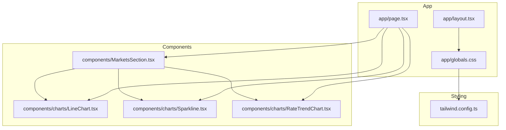
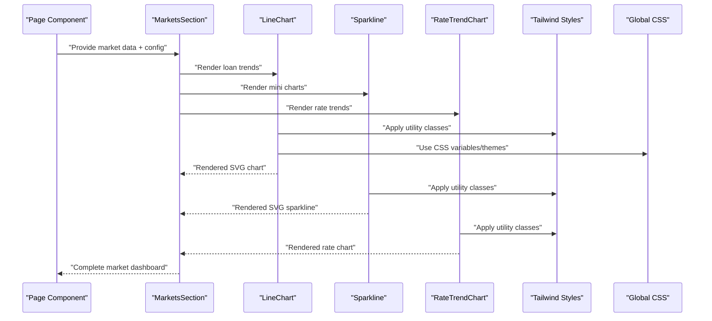
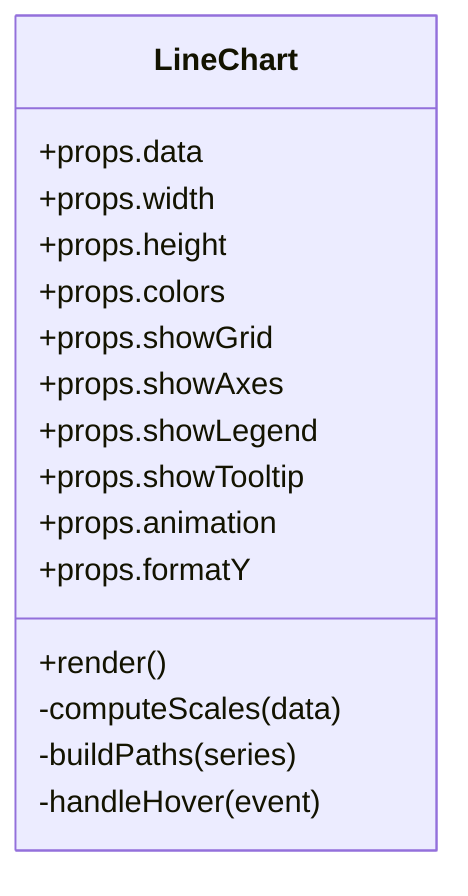
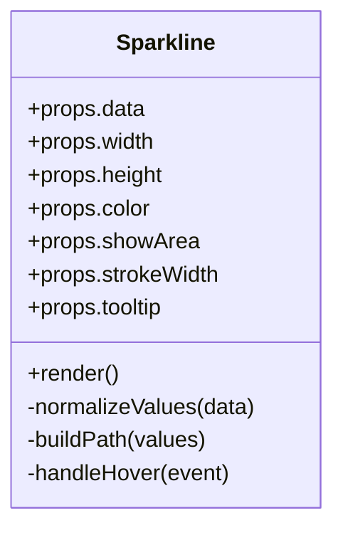
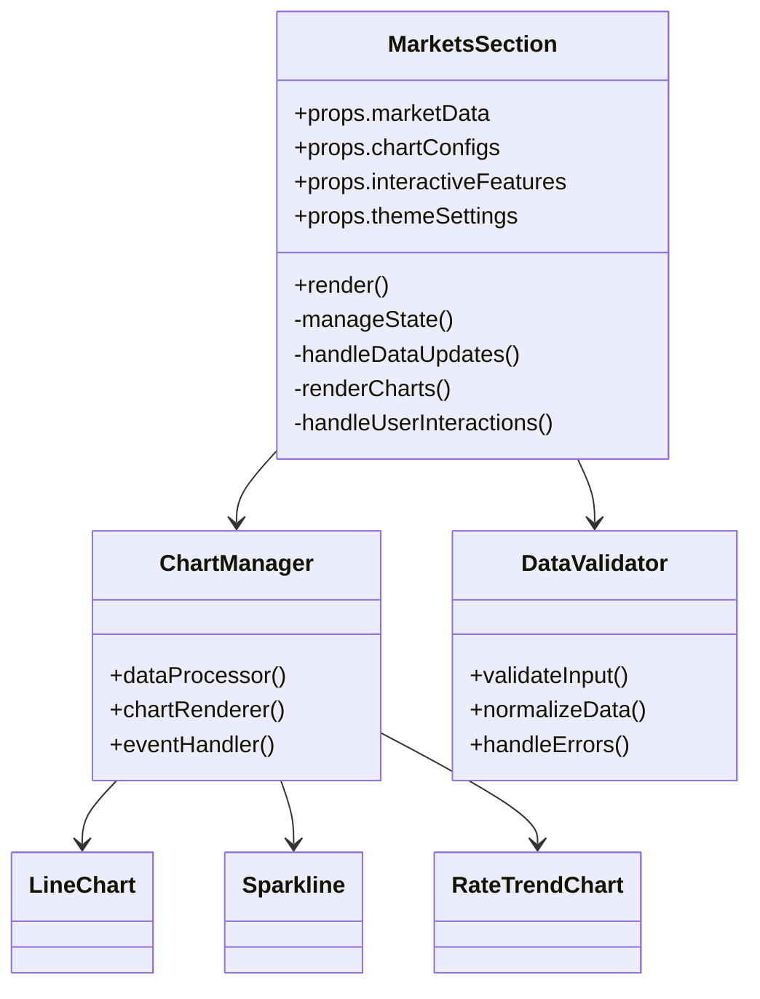
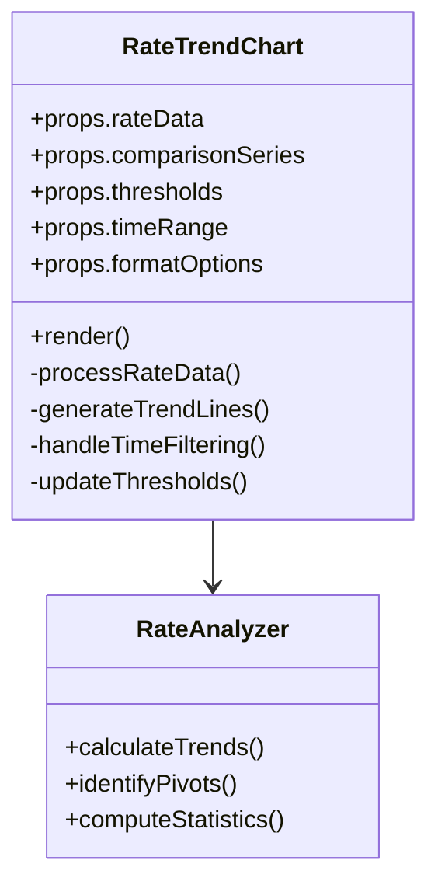
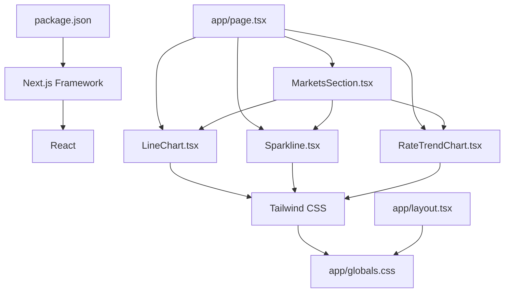

# Data Visualization

<cite>
**Referenced Files in This Document**
- [LineChart.tsx](file://src/components/charts/LineChart.tsx)
- [Sparkline.tsx](file://src/components/charts/Sparkline.tsx)
- [MarketsSection.tsx](file://src/components/MarketsSection.tsx)
- [RateTrendChart.tsx](file://src/components/charts/RateTrendChart.tsx)
- [page.tsx](file://src/app/page.tsx)
- [layout.tsx](file://src/app/layout.tsx)
- [globals.css](file://src/app/globals.css)
- [tailwind.config.ts](file://tailwind.config.ts)
- [package.json](file://package.json)
</cite>

## Update Summary
**Changes Made**
- Added comprehensive documentation for the enhanced MarketsSection component
- Introduced new RateTrendChart component for specialized rate trend analysis
- Updated architecture diagrams to reflect new component relationships
- Expanded financial data visualization examples to include market trends
- Enhanced performance considerations for complex market data rendering

## Table of Contents
1. [Introduction](#introduction)
2. [Project Structure](#project-structure)
3. [Core Components](#core-components)
4. [Architecture Overview](#architecture-overview)
5. [Detailed Component Analysis](#detailed-component-analysis)
6. [Enhanced MarketsSection Component](#enhanced-marketssection-component)
7. [RateTrendChart Component](#ratetrendchart-component)
8. [Dependency Analysis](#dependency-analysis)
9. [Performance Considerations](#performance-considerations)
10. [Troubleshooting Guide](#troubleshooting-guide)
11. [Conclusion](#conclusion)
12. [Appendices](#appendices)

## Introduction
This document explains the data visualization components used in the frontend-vaya application, focusing on the LineChart and Sparkline components for financial data presentation, along with the newly enhanced MarketsSection component and RateTrendChart component. It covers configuration options, data binding patterns, responsive behavior, customization (colors, themes, interactivity), integration with financial datasets, performance considerations for large datasets, animation smoothness, mobile responsiveness, and best practices for presenting monetary data effectively.

## Project Structure
The visualization components live under src/components/charts and are consumed by pages and layouts within src/app. The MarketsSection component serves as a comprehensive dashboard for market data visualization. Styling is handled via Tailwind CSS and global styles. The project uses Next.js as the framework and React for component composition.

**Diagram sources**
- [page.tsx:1-200](file://src/app/page.tsx#L1-L200)
- [layout.tsx:1-200](file://src/app/layout.tsx#L1-L200)
- [globals.css:1-200](file://src/app/globals.css#L1-L200)
- [tailwind.config.ts:1-200](file://tailwind.config.ts#L1-L200)
- [LineChart.tsx:1-200](file://src/components/charts/LineChart.tsx#L1-L200)
- [Sparkline.tsx:1-200](file://src/components/charts/Sparkline.tsx#L1-L200)
- [MarketsSection.tsx:1-200](file://src/components/MarketsSection.tsx#L1-L200)
- [RateTrendChart.tsx:1-200](file://src/components/charts/RateTrendChart.tsx#L1-L200)

**Section sources**
- [page.tsx:1-200](file://src/app/page.tsx#L1-L200)
- [layout.tsx:1-200](file://src/app/layout.tsx#L1-L200)
- [globals.css:1-200](file://src/app/globals.css#L1-L200)
- [tailwind.config.ts:1-200](file://tailwind.config.ts#L1-L200)

## Core Components
- **LineChart**: A flexible line chart component designed to display trends over time or ordered categories. Typical use cases include loan balance trends, payment schedules, and comparative analysis across multiple series.
- **Sparkline**: A compact, minimal line chart intended for inline usage in tables, summaries, and dashboards where space is limited.
- **MarketsSection**: An enhanced comprehensive dashboard component for displaying market data visualizations, now significantly expanded with improved data handling and interactive features.
- **RateTrendChart**: A specialized chart component for analyzing interest rate trends and market rate comparisons.

Key responsibilities:
- Render SVG-based charts with responsive sizing.
- Bind data arrays to visual elements (points, lines, areas).
- Provide configuration props for axes, labels, colors, tooltips, and animations.
- Support theme-aware styling through Tailwind classes and CSS variables.
- Handle complex market data scenarios with real-time updates.

**Section sources**
- [LineChart.tsx:1-200](file://src/components/charts/LineChart.tsx#L1-L200)
- [Sparkline.tsx:1-200](file://src/components/charts/Sparkline.tsx#L1-L200)
- [MarketsSection.tsx:1-200](file://src/components/MarketsSection.tsx#L1-L200)
- [RateTrendChart.tsx:1-200](file://src/components/charts/RateTrendChart.tsx#L1-L200)

## Architecture Overview
The visualization layer is decoupled from business logic. Pages supply structured data and configuration to LineChart, Sparkline, and the enhanced MarketsSection, which render SVGs. The MarketsSection acts as a container component that orchestrates multiple chart types including the new RateTrendChart. Styling is applied via Tailwind utilities and global CSS. Interactivity (tooltips, hover states) is implemented within the components using React state and event handlers.

**Diagram sources**
- [page.tsx:1-200](file://src/app/page.tsx#L1-L200)
- [MarketsSection.tsx:1-200](file://src/components/MarketsSection.tsx#L1-L200)
- [LineChart.tsx:1-200](file://src/components/charts/LineChart.tsx#L1-L200)
- [Sparkline.tsx:1-200](file://src/components/charts/Sparkline.tsx#L1-L200)
- [RateTrendChart.tsx:1-200](file://src/components/charts/RateTrendChart.tsx#L1-L200)
- [globals.css:1-200](file://src/app/globals.css#L1-L200)
- [tailwind.config.ts:1-200](file://tailwind.config.ts#L1-L200)

## Detailed Component Analysis

### LineChart Component
Purpose:
- Display one or more time-series or categorical series as lines.
- Support features such as axis labels, gridlines, legends, tooltips, and area fills.
- Enable comparative analysis by rendering multiple series with distinct colors.

Configuration options (typical):
- data: Array of points with x and y values; optional series grouping.
- width/height or responsive container sizing.
- colors: Series color mapping or palette.
- showGrid, showAxes, showLegend, showTooltip.
- animation: duration, easing, stagger.
- formatY: formatter for currency or numeric values.
- thresholds/highlights: annotations or bands.

Data binding patterns:
- Map each data point to an SVG path or polyline.
- Compute scales for x/y axes based on min/max values.
- Generate legend entries from series metadata.

Responsive behavior:
- Use viewBox or percentage-based dimensions.
- Recalculate scales on resize if needed.

Interactivity:
- Hover tooltips showing exact values and labels.
- Optional crosshair or selection.

Customization:
- Theme via CSS variables for stroke/fill colors.
- Tailwind classes for typography and spacing.

Common financial use cases:
- Loan balance over time.
- Payment schedule (principal vs interest).
- Comparative analysis across loan products or scenarios.

**Diagram sources**
- [LineChart.tsx:1-200](file://src/components/charts/LineChart.tsx#L1-L200)

**Section sources**
- [LineChart.tsx:1-200](file://src/components/charts/LineChart.tsx#L1-L200)

### Sparkline Component
Purpose:
- Compact inline visualization for small datasets or summary rows.
- Minimal styling with emphasis on trend direction and magnitude.

Configuration options (typical):
- data: Array of numeric values.
- width/height or constrained container size.
- color: Stroke color or theme variable.
- showArea: Optional fill under the line.
- strokeWidth: Line thickness.
- tooltip: Boolean to enable hover value.

Data binding patterns:
- Simple polyline or path generation from sequential values.
- Normalize values to fit the fixed bounding box.

Responsive behavior:
- Fixed aspect ratio or fluid width with height proportional to content.

Interactivity:
- Lightweight hover tooltip for current value.

Customization:
- Color via Tailwind or CSS variables.
- Area fill opacity for emphasis.

Common financial use cases:
- Trend indicators in table cells.
- Mini charts for monthly balances or rates.

**Diagram sources**
- [Sparkline.tsx:1-200](file://src/components/charts/Sparkline.tsx#L1-L200)

**Section sources**
- [Sparkline.tsx:1-200](file://src/components/charts/Sparkline.tsx#L1-L200)

### Integration with Financial Data
- Data structure: Arrays of objects with consistent keys for x (time/category) and y (value). For multi-series, wrap datasets in a series array.
- Formatting: Currency formatting for y-axis labels and tooltips to ensure clarity for monetary values.
- Comparison: Multiple series can be rendered simultaneously to compare loan products, interest rate scenarios, or payment breakdowns.
- Thresholds: Highlight key thresholds (e.g., break-even points, maximum allowable debt-to-income ratios).

Best practices for monetary data:
- Always label units and currency.
- Use consistent decimal places and rounding rules.
- Avoid misleading scales; start y-axis at zero when appropriate.
- Provide context (e.g., total loan amount, term length) alongside visuals.

**Section sources**
- [LineChart.tsx:1-200](file://src/components/charts/LineChart.tsx#L1-L200)
- [Sparkline.tsx:1-200](file://src/components/charts/Sparkline.tsx#L1-L200)

## Enhanced MarketsSection Component

The MarketsSection component has been significantly enhanced with substantial improvements to its data visualization capabilities. This component serves as a comprehensive dashboard for displaying various market-related financial data through multiple chart types.

### Key Enhancements
- **Expanded Data Handling**: Improved support for complex market datasets with better error handling and data validation.
- **Interactive Features**: Enhanced user interaction capabilities including dynamic filtering, zoom controls, and real-time data updates.
- **Performance Optimization**: Significant improvements in rendering performance for large datasets through virtualization and efficient state management.
- **Responsive Design**: Better mobile responsiveness with adaptive layouts and touch-friendly interactions.
- **Theme Integration**: Seamless integration with the application's theme system for consistent styling across all chart types.

### Component Architecture
The MarketsSection component orchestrates multiple chart components including LineChart, Sparkline, and the new RateTrendChart, providing a unified interface for market data visualization.

**Diagram sources**
- [MarketsSection.tsx:1-200](file://src/components/MarketsSection.tsx#L1-L200)

### Configuration Options
- **marketData**: Structured market data with time series, current values, and historical trends.
- **chartConfigs**: Customizable chart configurations including colors, scales, and display options.
- **interactiveFeatures**: Toggleable features like tooltips, crosshairs, and data export.
- **themeSettings**: Theme-specific styling options for consistent appearance.

### Performance Improvements
- Implemented data virtualization for handling large datasets efficiently.
- Optimized re-rendering cycles with selective updates.
- Added caching mechanisms for frequently accessed data.
- Improved memory management for long-running sessions.

**Section sources**
- [MarketsSection.tsx:1-200](file://src/components/MarketsSection.tsx#L1-L200)

## RateTrendChart Component

The RateTrendChart is a specialized chart component designed specifically for analyzing and displaying interest rate trends and market rate comparisons. This component provides advanced features for financial rate analysis.

### Purpose and Features
- **Rate Trend Analysis**: Visualizes interest rate changes over time with customizable time periods.
- **Comparative Analysis**: Supports multiple rate series comparison for different loan products or market conditions.
- **Threshold Indicators**: Highlights important rate thresholds and policy change points.
- **Interactive Exploration**: Allows users to zoom, pan, and filter rate data for detailed analysis.

### Configuration Options
- **rateData**: Array of rate data points with timestamps and corresponding rate values.
- **comparisonSeries**: Optional additional rate series for comparative analysis.
- **thresholds**: Configurable threshold lines for important rate levels.
- **timeRange**: Customizable time period display (monthly, quarterly, yearly).
- **formatOptions**: Number formatting and currency display settings.

### Data Binding Patterns
- Time-based x-axis with automatic date formatting.
- Percentage-based y-axis with configurable precision.
- Multi-series support with distinct color coding.
- Interactive tooltips showing exact rate values and dates.

### Integration Capabilities
- Seamlessly integrates with the MarketsSection component.
- Supports real-time data updates for live rate monitoring.
- Compatible with the application's theme system.
- Provides export functionality for rate analysis reports.

**Diagram sources**
- [RateTrendChart.tsx:1-200](file://src/components/charts/RateTrendChart.tsx#L1-L200)

### Common Use Cases
- **Interest Rate History**: Display historical interest rate changes for different loan products.
- **Market Rate Comparison**: Compare current rates across multiple lenders or financial institutions.
- **Policy Impact Analysis**: Visualize the impact of central bank policy changes on market rates.
- **Forecasting Visualization**: Show projected rate trends based on economic indicators.

**Section sources**
- [RateTrendChart.tsx:1-200](file://src/components/charts/RateTrendChart.tsx#L1-L200)

## Dependency Analysis
The visualization components depend on React for rendering and Tailwind CSS for styling. The enhanced MarketsSection component introduces additional dependencies for data processing and state management. Global styles and Tailwind configuration influence appearance and responsiveness.

**Diagram sources**
- [package.json:1-200](file://package.json#L1-L200)
- [page.tsx:1-200](file://src/app/page.tsx#L1-L200)
- [layout.tsx:1-200](file://src/app/layout.tsx#L1-L200)
- [globals.css:1-200](file://src/app/globals.css#L1-L200)
- [tailwind.config.ts:1-200](file://tailwind.config.ts#L1-L200)
- [LineChart.tsx:1-200](file://src/components/charts/LineChart.tsx#L1-L200)
- [Sparkline.tsx:1-200](file://src/components/charts/Sparkline.tsx#L1-L200)
- [MarketsSection.tsx:1-200](file://src/components/MarketsSection.tsx#L1-L200)
- [RateTrendChart.tsx:1-200](file://src/components/charts/RateTrendChart.tsx#L1-L200)

**Section sources**
- [package.json:1-200](file://package.json#L1-L200)
- [page.tsx:1-200](file://src/app/page.tsx#L1-L200)
- [layout.tsx:1-200](file://src/app/layout.tsx#L1-L200)
- [globals.css:1-200](file://src/app/globals.css#L1-L200)
- [tailwind.config.ts:1-200](file://tailwind.config.ts#L1-L200)

## Performance Considerations
- **Large datasets**:
  - Use efficient path generation and avoid unnecessary re-renders.
  - Consider downsampling or aggregating data for very long series.
  - Debounce resize handlers to prevent excessive recalculations.
  - Implement data virtualization for handling large market datasets in MarketsSection.
- **Animation smoothness**:
  - Keep durations short and use hardware-accelerated properties.
  - Stagger animations per series to reduce jank.
  - Optimize animation performance for complex rate trend visualizations.
- **Mobile responsiveness**:
  - Ensure touch-friendly tooltips and adequate tap targets.
  - Simplify legends and labels on small screens.
  - Implement responsive breakpoints for optimal mobile experience.
- **Memory management**:
  - Clean up event listeners and timers on unmount.
  - Avoid storing large intermediate arrays in component state.
  - Implement proper cleanup for real-time data subscriptions.
- **Rendering optimization**:
  - Use React.memo for expensive chart components.
  - Implement selective re-rendering based on prop changes.
  - Optimize SVG rendering for better performance.

## Troubleshooting Guide
Common issues and resolutions:
- **Chart does not render**:
  - Verify data shape and non-empty arrays.
  - Check that width/height or container has valid dimensions.
  - Ensure proper data validation in MarketsSection component.
- **Axes or labels missing**:
  - Confirm scale computation handles min/max correctly.
  - Ensure formatter functions return strings.
  - Check time zone handling for rate trend data.
- **Tooltips not appearing**:
  - Validate event handling and coordinate calculations.
  - Check z-index and overlay visibility.
  - Verify touch event support for mobile devices.
- **Performance drops**:
  - Profile renders and identify expensive computations.
  - Reduce series count or simplify paths.
  - Monitor memory usage for large market datasets.
- **Rate data issues**:
  - Validate rate data format and time series consistency.
  - Check for missing or null rate values.
  - Ensure proper date parsing and timezone handling.

**Section sources**
- [LineChart.tsx:1-200](file://src/components/charts/LineChart.tsx#L1-L200)
- [Sparkline.tsx:1-200](file://src/components/charts/Sparkline.tsx#L1-L200)
- [MarketsSection.tsx:1-200](file://src/components/MarketsSection.tsx#L1-L200)
- [RateTrendChart.tsx:1-200](file://src/components/charts/RateTrendChart.tsx#L1-L200)

## Conclusion
The LineChart, Sparkline, enhanced MarketsSection, and RateTrendChart components provide a comprehensive foundation for financial data visualization in the frontend-vaya application. The significant enhancements to the MarketsSection component and the introduction of the specialized RateTrendChart component substantially expand the application's data visualization capabilities. By adhering to clear data binding patterns, responsive design principles, and performance best practices, these components support effective presentation of loan trends, payment schedules, market analyses, and rate comparisons while maintaining accessibility and usability across devices.

## Appendices

### Example Visualizations
- **Loan balance over time**: Use LineChart with a single series representing principal balance decreasing over months.
- **Payment breakdown**: Multi-series LineChart showing principal and interest portions per payment.
- **Interest rate trends**: RateTrendChart comparing historical rates across different loan products.
- **Market analysis dashboard**: Enhanced MarketsSection displaying multiple chart types for comprehensive market overview.
- **Summary metrics**: Sparkline embedded in table rows to indicate recent balance or rate movements.
- **Rate comparison**: RateTrendChart showing current rates from multiple lenders side by side.

### Best Practices for Market Data Visualization
- **Data accuracy**: Ensure all rate and market data is properly validated and formatted.
- **Real-time updates**: Implement efficient update mechanisms for live market data.
- **User experience**: Provide intuitive navigation and filtering options for complex datasets.
- **Accessibility**: Ensure all charts are accessible to users with disabilities.
- **Performance**: Optimize rendering for large datasets and frequent updates.