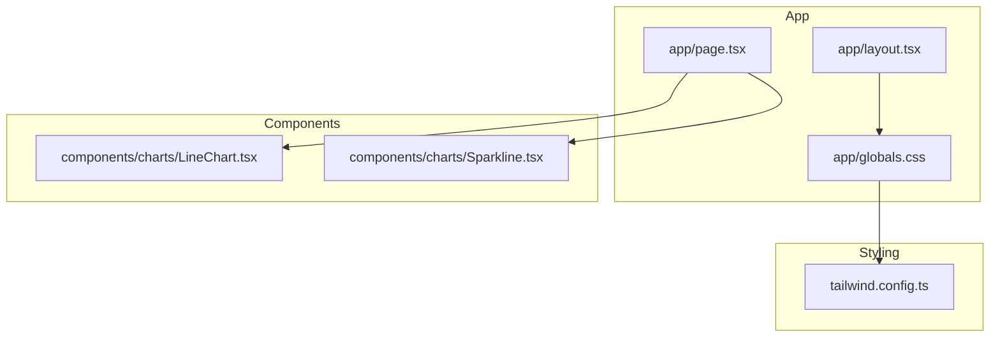
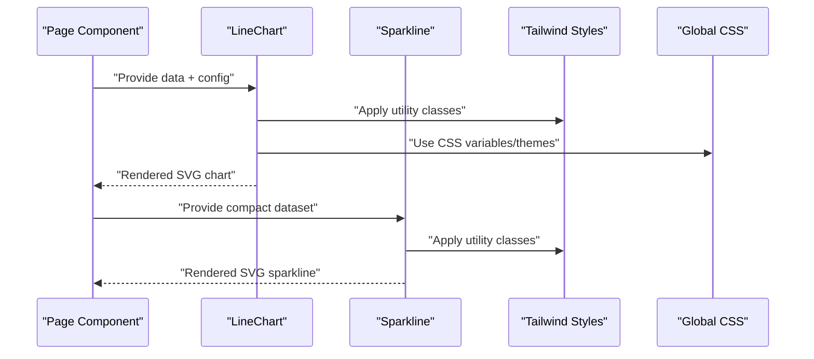
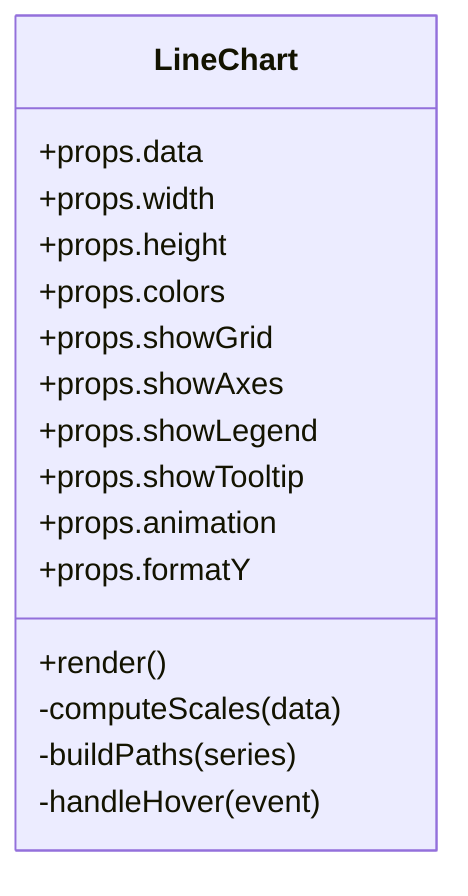
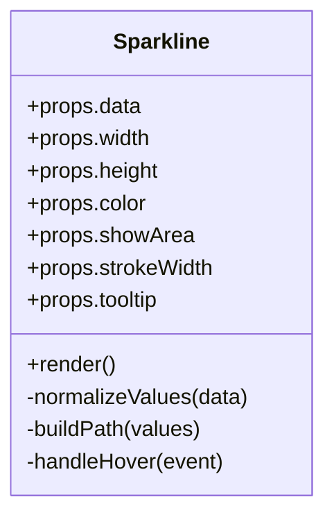
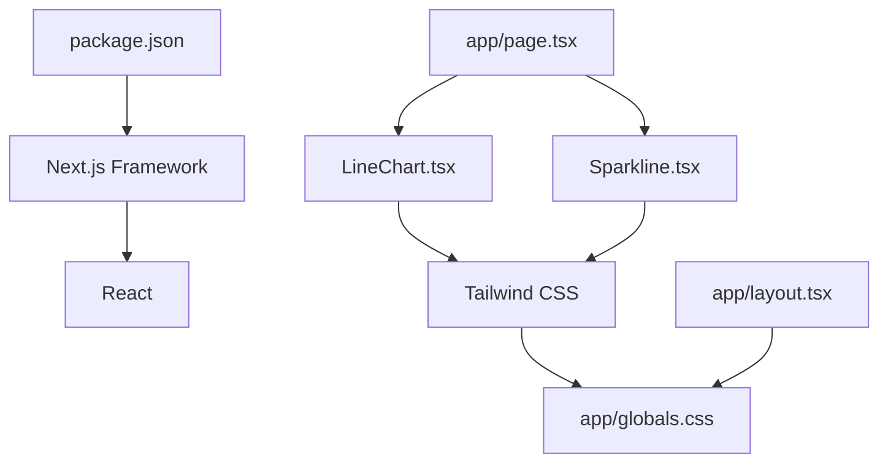

# Data Visualization

<cite>
**Referenced Files in This Document**
- [LineChart.tsx](file://src/components/charts/LineChart.tsx)
- [Sparkline.tsx](file://src/components/charts/Sparkline.tsx)
- [page.tsx](file://src/app/page.tsx)
- [layout.tsx](file://src/app/layout.tsx)
- [globals.css](file://src/app/globals.css)
- [tailwind.config.ts](file://tailwind.config.ts)
- [package.json](file://package.json)
</cite>

## Table of Contents
1. [Introduction](#introduction)
2. [Project Structure](#project-structure)
3. [Core Components](#core-components)
4. [Architecture Overview](#architecture-overview)
5. [Detailed Component Analysis](#detailed-component-analysis)
6. [Dependency Analysis](#dependency-analysis)
7. [Performance Considerations](#performance-considerations)
8. [Troubleshooting Guide](#troubleshooting-guide)
9. [Conclusion](#conclusion)
10. [Appendices](#appendices)

## Introduction
This document explains the data visualization components used in the frontend-vaya application, focusing on the LineChart and Sparkline components for financial data presentation. It covers configuration options, data binding patterns, responsive behavior, customization (colors, themes, interactivity), integration with financial datasets, performance considerations for large datasets, animation smoothness, mobile responsiveness, and best practices for presenting monetary data effectively.

## Project Structure
The visualization components live under src/components/charts and are consumed by pages and layouts within src/app. Styling is handled via Tailwind CSS and global styles. The project uses Next.js as the framework and React for component composition.

**Diagram sources**
- [page.tsx:1-200](file://src/app/page.tsx#L1-L200)
- [layout.tsx:1-200](file://src/app/layout.tsx#L1-L200)
- [globals.css:1-200](file://src/app/globals.css#L1-L200)
- [tailwind.config.ts:1-200](file://tailwind.config.ts#L1-L200)
- [LineChart.tsx:1-200](file://src/components/charts/LineChart.tsx#L1-L200)
- [Sparkline.tsx:1-200](file://src/components/charts/Sparkline.tsx#L1-L200)

**Section sources**
- [page.tsx:1-200](file://src/app/page.tsx#L1-L200)
- [layout.tsx:1-200](file://src/app/layout.tsx#L1-L200)
- [globals.css:1-200](file://src/app/globals.css#L1-L200)
- [tailwind.config.ts:1-200](file://tailwind.config.ts#L1-L200)

## Core Components
- LineChart: A flexible line chart component designed to display trends over time or ordered categories. Typical use cases include loan balance trends, payment schedules, and comparative analysis across multiple series.
- Sparkline: A compact, minimal line chart intended for inline usage in tables, summaries, and dashboards where space is limited.

Key responsibilities:
- Render SVG-based charts with responsive sizing.
- Bind data arrays to visual elements (points, lines, areas).
- Provide configuration props for axes, labels, colors, tooltips, and animations.
- Support theme-aware styling through Tailwind classes and CSS variables.

**Section sources**
- [LineChart.tsx:1-200](file://src/components/charts/LineChart.tsx#L1-L200)
- [Sparkline.tsx:1-200](file://src/components/charts/Sparkline.tsx#L1-L200)

## Architecture Overview
The visualization layer is decoupled from business logic. Pages supply structured data and configuration to LineChart and Sparkline, which render SVGs. Styling is applied via Tailwind utilities and global CSS. Interactivity (tooltips, hover states) is implemented within the components using React state and event handlers.

**Diagram sources**
- [page.tsx:1-200](file://src/app/page.tsx#L1-L200)
- [LineChart.tsx:1-200](file://src/components/charts/LineChart.tsx#L1-L200)
- [Sparkline.tsx:1-200](file://src/components/charts/Sparkline.tsx#L1-L200)
- [globals.css:1-200](file://src/app/globals.css#L1-L200)
- [tailwind.config.ts:1-200](file://tailwind.config.ts#L1-L200)

## Detailed Component Analysis

### LineChart Component
Purpose:
- Display one or more time-series or categorical series as lines.
- Support features such as axis labels, gridlines, legends, tooltips, and area fills.
- Enable comparative analysis by rendering multiple series with distinct colors.

Configuration options (typical):
- data: Array of points with x and y values; optional series grouping.
- width/height or responsive container sizing.
- colors: Series color mapping or palette.
- showGrid, showAxes, showLegend, showTooltip.
- animation: duration, easing, stagger.
- formatY: formatter for currency or numeric values.
- thresholds/highlights: annotations or bands.

Data binding patterns:
- Map each data point to an SVG path or polyline.
- Compute scales for x/y axes based on min/max values.
- Generate legend entries from series metadata.

Responsive behavior:
- Use viewBox or percentage-based dimensions.
- Recalculate scales on resize if needed.

Interactivity:
- Hover tooltips showing exact values and labels.
- Optional crosshair or selection.

Customization:
- Theme via CSS variables for stroke/fill colors.
- Tailwind classes for typography and spacing.

Common financial use cases:
- Loan balance over time.
- Payment schedule (principal vs interest).
- Comparative analysis across loan products or scenarios.

**Diagram sources**
- [LineChart.tsx:1-200](file://src/components/charts/LineChart.tsx#L1-L200)

**Section sources**
- [LineChart.tsx:1-200](file://src/components/charts/LineChart.tsx#L1-L200)

### Sparkline Component
Purpose:
- Compact inline visualization for small datasets or summary rows.
- Minimal styling with emphasis on trend direction and magnitude.

Configuration options (typical):
- data: Array of numeric values.
- width/height or constrained container size.
- color: Stroke color or theme variable.
- showArea: Optional fill under the line.
- strokeWidth: Line thickness.
- tooltip: Boolean to enable hover value.

Data binding patterns:
- Simple polyline or path generation from sequential values.
- Normalize values to fit the fixed bounding box.

Responsive behavior:
- Fixed aspect ratio or fluid width with height proportional to content.

Interactivity:
- Lightweight hover tooltip for current value.

Customization:
- Color via Tailwind or CSS variables.
- Area fill opacity for emphasis.

Common financial use cases:
- Trend indicators in table cells.
- Mini charts for monthly balances or rates.

**Diagram sources**
- [Sparkline.tsx:1-200](file://src/components/charts/Sparkline.tsx#L1-L200)

**Section sources**
- [Sparkline.tsx:1-200](file://src/components/charts/Sparkline.tsx#L1-L200)

### Integration with Financial Data
- Data structure: Arrays of objects with consistent keys for x (time/category) and y (value). For multi-series, wrap datasets in a series array.
- Formatting: Currency formatting for y-axis labels and tooltips to ensure clarity for monetary values.
- Comparison: Multiple series can be rendered simultaneously to compare loan products, interest rate scenarios, or payment breakdowns.
- Thresholds: Highlight key thresholds (e.g., break-even points, maximum allowable debt-to-income ratios).

Best practices for monetary data:
- Always label units and currency.
- Use consistent decimal places and rounding rules.
- Avoid misleading scales; start y-axis at zero when appropriate.
- Provide context (e.g., total loan amount, term length) alongside visuals.

**Section sources**
- [LineChart.tsx:1-200](file://src/components/charts/LineChart.tsx#L1-L200)
- [Sparkline.tsx:1-200](file://src/components/charts/Sparkline.tsx#L1-L200)

## Dependency Analysis
The visualization components depend on React for rendering and Tailwind CSS for styling. They do not directly import heavy charting libraries unless specified in package dependencies. Global styles and Tailwind configuration influence appearance and responsiveness.

**Diagram sources**
- [package.json:1-200](file://package.json#L1-L200)
- [page.tsx:1-200](file://src/app/page.tsx#L1-L200)
- [layout.tsx:1-200](file://src/app/layout.tsx#L1-L200)
- [globals.css:1-200](file://src/app/globals.css#L1-L200)
- [tailwind.config.ts:1-200](file://tailwind.config.ts#L1-L200)
- [LineChart.tsx:1-200](file://src/components/charts/LineChart.tsx#L1-L200)
- [Sparkline.tsx:1-200](file://src/components/charts/Sparkline.tsx#L1-L200)

**Section sources**
- [package.json:1-200](file://package.json#L1-L200)
- [page.tsx:1-200](file://src/app/page.tsx#L1-L200)
- [layout.tsx:1-200](file://src/app/layout.tsx#L1-L200)
- [globals.css:1-200](file://src/app/globals.css#L1-L200)
- [tailwind.config.ts:1-200](file://tailwind.config.ts#L1-L200)

## Performance Considerations
- Large datasets:
  - Use efficient path generation and avoid unnecessary re-renders.
  - Consider downsampling or aggregating data for very long series.
  - Debounce resize handlers to prevent excessive recalculations.
- Animation smoothness:
  - Keep durations short and use hardware-accelerated properties.
  - Stagger animations per series to reduce jank.
- Mobile responsiveness:
  - Ensure touch-friendly tooltips and adequate tap targets.
  - Simplify legends and labels on small screens.
- Memory management:
  - Clean up event listeners and timers on unmount.
  - Avoid storing large intermediate arrays in component state.

[No sources needed since this section provides general guidance]

## Troubleshooting Guide
Common issues and resolutions:
- Chart does not render:
  - Verify data shape and non-empty arrays.
  - Check that width/height or container has valid dimensions.
- Axes or labels missing:
  - Confirm scale computation handles min/max correctly.
  - Ensure formatter functions return strings.
- Tooltips not appearing:
  - Validate event handling and coordinate calculations.
  - Check z-index and overlay visibility.
- Performance drops:
  - Profile renders and identify expensive computations.
  - Reduce series count or simplify paths.

**Section sources**
- [LineChart.tsx:1-200](file://src/components/charts/LineChart.tsx#L1-L200)
- [Sparkline.tsx:1-200](file://src/components/charts/Sparkline.tsx#L1-L200)

## Conclusion
The LineChart and Sparkline components provide a lightweight, customizable foundation for financial data visualization in the frontend-vaya application. By adhering to clear data binding patterns, responsive design principles, and performance best practices, these components support effective presentation of loan trends, payment schedules, and comparative analyses while maintaining accessibility and usability across devices.

[No sources needed since this section summarizes without analyzing specific files]

## Appendices

### Example Visualizations
- Loan balance over time: Use LineChart with a single series representing principal balance decreasing over months.
- Payment breakdown: Multi-series LineChart showing principal and interest portions per payment.
- Interest rate trends: LineChart comparing historical rates across different loan products.
- Summary metrics: Sparkline embedded in table rows to indicate recent balance or rate movements.

[No sources needed since this section provides conceptual examples]