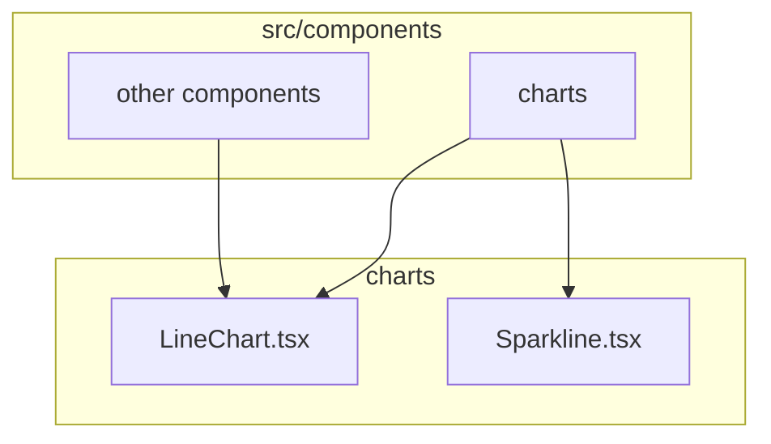
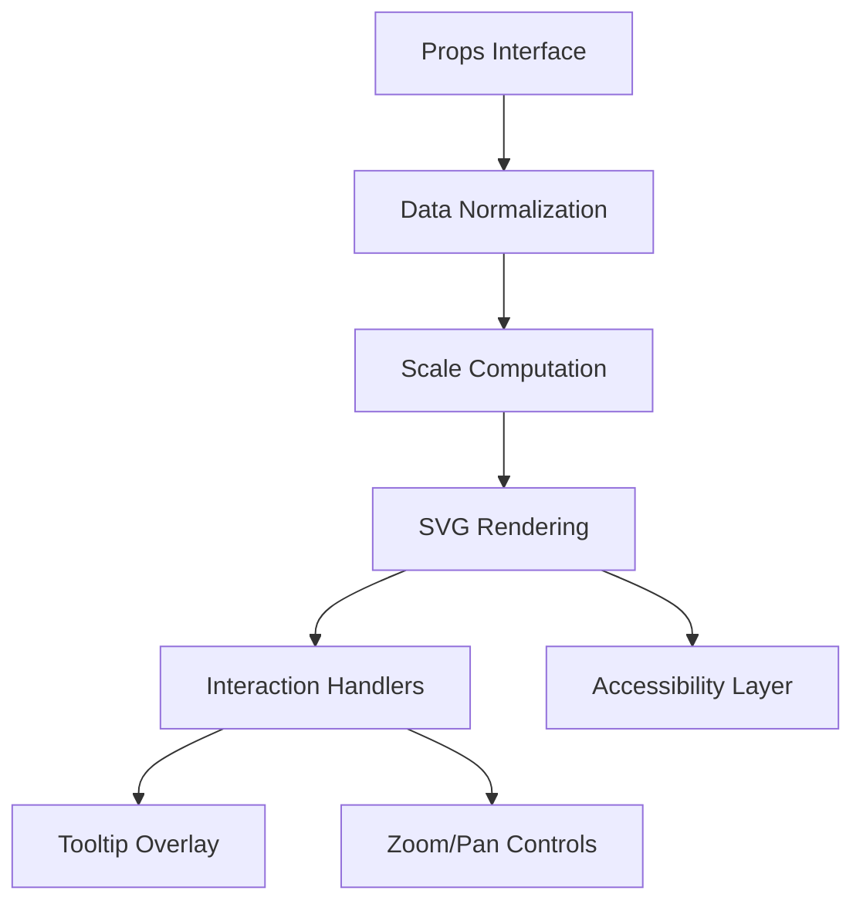
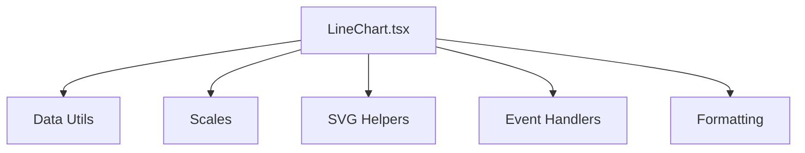

# LineChart Component

<cite>
**Referenced Files in This Document**
- [LineChart.tsx](file://src/components/charts/LineChart.tsx)
- [Sparkline.tsx](file://src/components/charts/Sparkline.tsx)
</cite>

## Table of Contents
1. [Introduction](#introduction)
2. [Project Structure](#project-structure)
3. [Core Components](#core-components)
4. [Architecture Overview](#architecture-overview)
5. [Detailed Component Analysis](#detailed-component-analysis)
6. [Dependency Analysis](#dependency-analysis)
7. [Performance Considerations](#performance-considerations)
8. [Troubleshooting Guide](#troubleshooting-guide)
9. [Conclusion](#conclusion)
10. [Appendices](#appendices)

## Introduction
This document provides comprehensive documentation for the LineChart component used in the frontend-vaya application. It focuses on how the component renders loan trends, payment schedules, and comparative analysis graphs. The guide explains the props interface, data binding patterns, configuration options (axes labels, color schemes, tooltips, zoom), and integration patterns for financial datasets such as loan comparisons, interest rate trends over time, and payment breakdowns. It also covers performance considerations for large datasets, animation smoothness, responsive behavior across screen sizes, and customization capabilities including styling, themes, and accessibility features.

## Project Structure
The LineChart component resides under the charts folder within the components directory. A related Sparkline component is also present for compact trend displays.

**Diagram sources**
- [LineChart.tsx](file://src/components/charts/LineChart.tsx)
- [Sparkline.tsx](file://src/components/charts/Sparkline.tsx)

**Section sources**
- [LineChart.tsx](file://src/components/charts/LineChart.tsx)
- [Sparkline.tsx](file://src/components/charts/Sparkline.tsx)

## Core Components
- LineChart: Renders line-based visualizations for financial data, supporting multiple series, axes, legends, tooltips, and interactive behaviors like zoom and pan.
- Sparkline: A lightweight variant designed for inline or small-space trend indicators.

Key responsibilities:
- Data ingestion and normalization
- Axis scaling and labeling
- Series rendering with colors and styles
- Interactive overlays (tooltips, crosshairs, zoom/pan)
- Responsive layout and accessibility

**Section sources**
- [LineChart.tsx](file://src/components/charts/LineChart.tsx)
- [Sparkline.tsx](file://src/components/charts/Sparkline.tsx)

## Architecture Overview
At a high level, the LineChart component follows a layered architecture:
- Input layer: Props define data, labels, colors, and interaction flags.
- Processing layer: Data validation, normalization, and scale computation.
- Rendering layer: SVG-based drawing of axes, gridlines, series lines, markers, and overlays.
- Interaction layer: Event handling for hover, tooltips, selection, zoom, and pan.
- Accessibility layer: ARIA attributes, keyboard navigation, and screen reader support.

[No sources needed since this diagram shows conceptual workflow, not actual code structure]

## Detailed Component Analysis

### Props Interface and Data Binding
The LineChart accepts a structured set of props to configure data and appearance:
- Data arrays: one or more series where each series contains points with x (time/category) and y (value) coordinates.
- Axes configuration: labels, units, tick formatting, min/max overrides, and domain mapping.
- Visual settings: color palette per series, stroke width, marker visibility, area fill toggles.
- Interactivity: enable/disable tooltips, crosshairs, zoom/pan, selection, and legend toggling.
- Layout and responsiveness: container sizing, aspect ratio hints, and breakpoints.
- Accessibility: aria labels, roles, and focus management.

Data binding patterns:
- Each series maps to a distinct line with its own color and label.
- X-axis values are typically dates or categories; Y-axis values represent monetary amounts, rates, or counts.
- Aggregation strategies can be applied when multiple points share the same x-value (e.g., sum, average).

Common financial use cases:
- Loan comparison: overlay multiple loan scenarios with different principal, rate, and term.
- Interest rate trends: plot historical or projected rates over time.
- Payment breakdowns: stack or compare principal vs. interest portions per period.

**Section sources**
- [LineChart.tsx](file://src/components/charts/LineChart.tsx)

### Axes Labels, Color Schemes, and Legends
- Axes labels: Provide clear titles and units (e.g., “Months”, “USD”, “%”).
- Tick formatting: Use locale-aware currency and percentage formatters.
- Color schemes: Assign consistent palettes across series; ensure sufficient contrast.
- Legends: Display series names with toggles to show/hide individual series.

Best practices:
- Keep axis labels concise and meaningful.
- Limit the number of series to avoid clutter.
- Use accessible color contrasts and provide non-color cues (markers, patterns).

**Section sources**
- [LineChart.tsx](file://src/components/charts/LineChart.tsx)

### Interactive Features: Tooltips, Crosshairs, Zoom, and Pan
- Tooltips: Show contextual details on hover (series name, x-value, y-value, formatted units).
- Crosshairs: Align vertical/horizontal guides to the hovered point for precise reading.
- Zoom and pan: Allow users to explore subsets of data by dragging or using controls.
- Selection: Highlight specific ranges or points for deeper inspection.

Implementation notes:
- Debounce heavy computations during drag interactions.
- Preserve state across re-renders to maintain user context.
- Ensure keyboard accessibility for tooltip activation and navigation.

**Section sources**
- [LineChart.tsx](file://src/components/charts/LineChart.tsx)

### Financial Chart Patterns and Examples
- Cumulative payment curves: Plot cumulative payments over time to visualize total cost growth.
- Balance projections: Show remaining balance decreasing over the loan term.
- Multi-bank comparison: Overlay multiple banks’ offers (rate, fees, monthly payment) for side-by-side analysis.
- Interest vs. principal split: Dual-line chart showing proportion changes over periods.

Integration tips:
- Normalize all currencies to a single unit before plotting.
- Align time series to consistent intervals (monthly, quarterly).
- Handle missing data gracefully (interpolation or gaps).

**Section sources**
- [LineChart.tsx](file://src/components/charts/LineChart.tsx)

### Responsiveness and Layout
- Responsive sizing: Adapt to container dimensions and screen size changes.
- Breakpoints: Adjust legend placement, font sizes, and tick density.
- Aspect ratio: Maintain readability across devices without distortion.

**Section sources**
- [LineChart.tsx](file://src/components/charts/LineChart.tsx)

### Accessibility Features
- ARIA roles and labels: Define chart role, series roles, and descriptive labels.
- Keyboard navigation: Support tabbing through series and interactive elements.
- Screen reader support: Provide textual summaries of key insights and trends.
- Focus management: Ensure logical focus order and visible focus indicators.

**Section sources**
- [LineChart.tsx](file://src/components/charts/LineChart.tsx)

### Sparkline Variant
The Sparkline component provides compact trend visuals suitable for cards, tables, or dashboards. It typically omits axes and complex interactions while preserving core line rendering and minimal tooltips.

Use cases:
- Inline trend indicators next to KPIs.
- Compact historical snapshots in lists.

**Section sources**
- [Sparkline.tsx](file://src/components/charts/Sparkline.tsx)

## Dependency Analysis
The LineChart component depends on:
- Data normalization utilities for consistent input formats.
- Scale calculators for axes mapping.
- SVG rendering helpers for paths, markers, and overlays.
- Event handlers for interactivity (hover, drag, zoom).
- Formatting utilities for currency, percentages, and dates.

Potential coupling:
- Strong cohesion within the component’s internal modules.
- Loose coupling with external libraries if any are used for math or formatting.

Circular dependencies:
- None expected; keep data processing separate from rendering.

External integrations:
- Date/time libraries for axis ticks and tooltips.
- Number formatting libraries for localized outputs.

**Diagram sources**
- [LineChart.tsx](file://src/components/charts/LineChart.tsx)

**Section sources**
- [LineChart.tsx](file://src/components/charts/LineChart.tsx)

## Performance Considerations
- Large datasets:
  - Downsample or aggregate data for better rendering performance.
  - Use virtualization for extremely long series.
  - Avoid recalculating scales on every render; memoize results.
- Animation smoothness:
  - Prefer CSS transitions for simple animations.
  - Use requestAnimationFrame for complex motion.
  - Limit frame updates during heavy interactions.
- Memory usage:
  - Reuse computed paths and shapes.
  - Clean up event listeners and timers on unmount.
- Responsive behavior:
  - Debounce resize handlers.
  - Recompute layouts only when necessary.

[No sources needed since this section provides general guidance]

## Troubleshooting Guide
Common issues and resolutions:
- Empty or malformed data:
  - Validate inputs and provide fallbacks.
  - Handle missing values via interpolation or gap rendering.
- Incorrect axis scaling:
  - Check domain/range mappings and min/max overrides.
  - Ensure consistent units across series.
- Tooltip misalignment:
  - Verify coordinate transformations and container offsets.
- Zoom/pan glitches:
  - Debounce events and reset state on interaction end.
- Accessibility failures:
  - Add ARIA attributes and test with screen readers.
  - Ensure keyboard operability and focus visibility.

**Section sources**
- [LineChart.tsx](file://src/components/charts/LineChart.tsx)

## Conclusion
The LineChart component is a versatile tool for visualizing financial data in the frontend-vaya application. With robust props, flexible configuration, and strong interactivity, it supports loan comparisons, interest rate trends, and payment breakdowns. By following best practices for performance, responsiveness, and accessibility, developers can deliver clear, insightful charts that enhance user understanding of complex financial information.

[No sources needed since this section summarizes without analyzing specific files]

## Appendices

### Integration Checklist
- Prepare normalized data arrays with consistent x/y formats.
- Configure axes labels, units, and tick formatting.
- Assign accessible color palettes and series labels.
- Enable tooltips, crosshairs, and zoom/pan as needed.
- Test responsiveness across breakpoints.
- Validate accessibility with tools and screen readers.

### Example Scenarios
- Loan comparison: Multiple series representing different loan terms and rates.
- Interest rate trend: Time-series of historical or projected rates.
- Payment breakdown: Principal vs. interest proportions over time.
- Cumulative payments: Total paid curve alongside balance projection.

[No sources needed since this section provides general guidance]