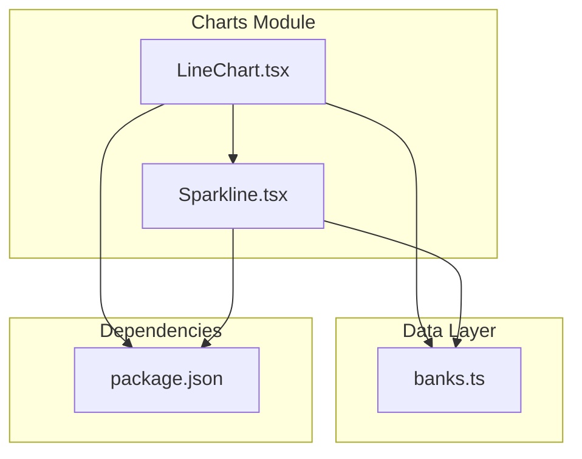
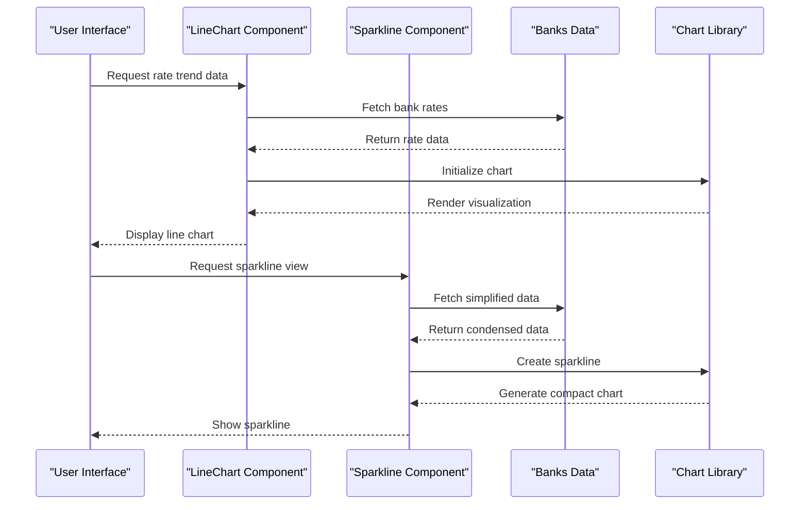
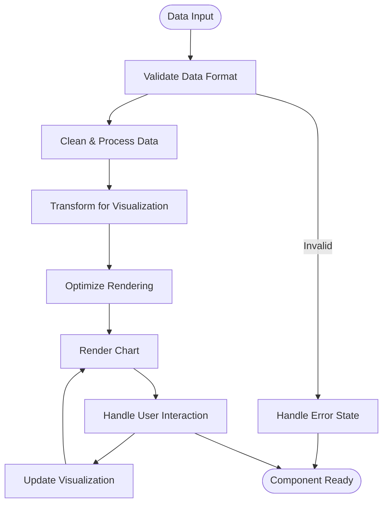
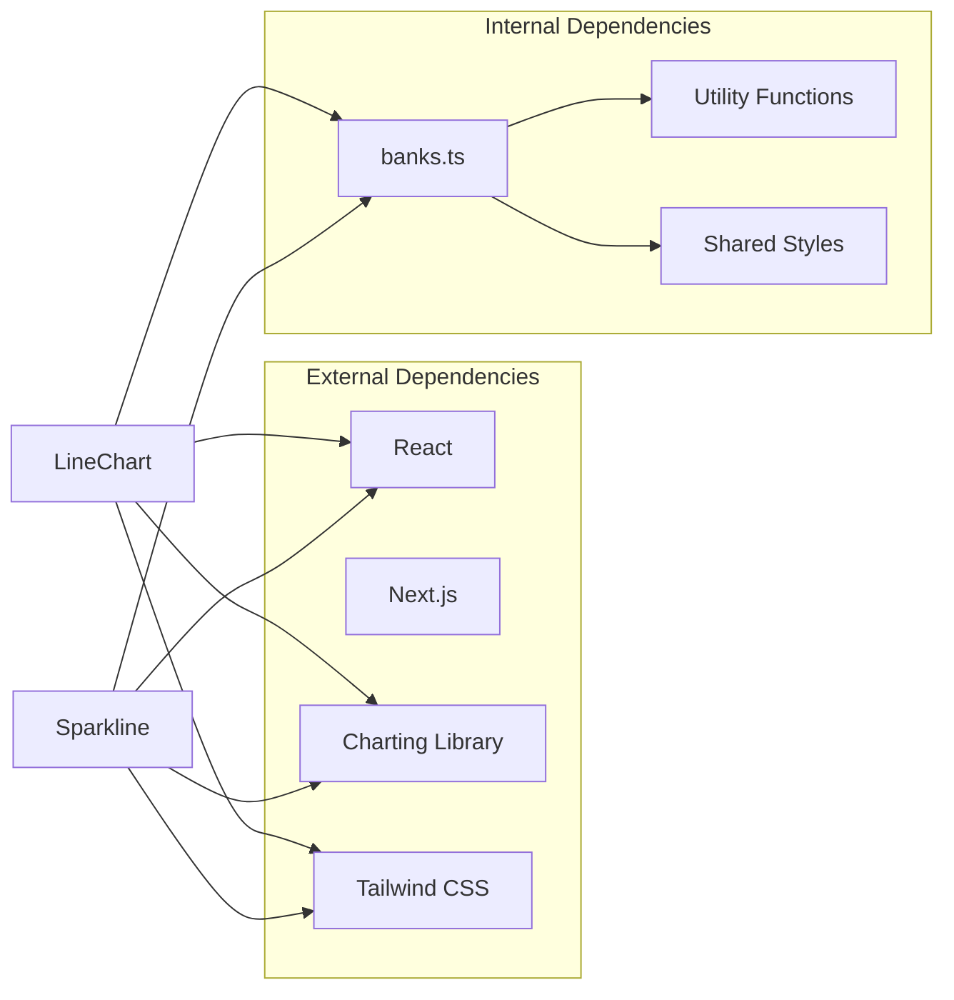

# Rate Trend Chart Component

<cite>
**Referenced Files in This Document**
- [LineChart.tsx](file://src/components/charts/LineChart.tsx)
- [Sparkline.tsx](file://src/components/charts/Sparkline.tsx)
- [banks.ts](file://src/data/banks.ts)
- [package.json](file://package.json)
</cite>

## Table of Contents
1. [Introduction](#introduction)
2. [Project Structure](#project-structure)
3. [Core Components](#core-components)
4. [Architecture Overview](#architecture-overview)
5. [Detailed Component Analysis](#detailed-component-analysis)
6. [Dependency Analysis](#dependency-analysis)
7. [Performance Considerations](#performance-considerations)
8. [Troubleshooting Guide](#troubleshooting-guide)
9. [Conclusion](#conclusion)

## Introduction
The Rate Trend Chart Component is a specialized visualization tool designed to display financial rate trends over time. This component provides interactive charts that help users understand market rate fluctuations, compare different financial institutions' rates, and make informed decisions about loans and investments.

## Project Structure
The chart components are organized within a dedicated `charts` directory under the components folder, following a modular architecture pattern. The implementation includes both full-line charts and compact sparkline visualizations.

**Diagram sources**
- [LineChart.tsx](file://src/components/charts/LineChart.tsx)
- [Sparkline.tsx](file://src/components/charts/Sparkline.tsx)
- [banks.ts](file://src/data/banks.ts)
- [package.json](file://package.json)

**Section sources**
- [LineChart.tsx](file://src/components/charts/LineChart.tsx)
- [Sparkline.tsx](file://src/components/charts/Sparkline.tsx)

## Core Components

### LineChart Component
The LineChart component serves as the primary visualization element for displaying detailed rate trend data. It handles complex data sets, interactive features, and responsive design considerations.

### Sparkline Component  
The Sparkline component provides compact, inline visualizations suitable for tables, cards, and summary views where space is limited but trend information is valuable.

### Data Integration
The components integrate with the banks data module to fetch and process financial institution rate information, ensuring consistent data presentation across all chart types.

**Section sources**
- [LineChart.tsx](file://src/components/charts/LineChart.tsx)
- [Sparkline.tsx](file://src/components/charts/Sparkline.tsx)
- [banks.ts](file://src/data/banks.ts)

## Architecture Overview
The chart system follows a component-based architecture with clear separation of concerns between data handling, visualization logic, and user interaction.

**Diagram sources**
- [LineChart.tsx](file://src/components/charts/LineChart.tsx)
- [Sparkline.tsx](file://src/components/charts/Sparkline.tsx)
- [banks.ts](file://src/data/banks.ts)

## Detailed Component Analysis

### LineChart Component Implementation
The LineChart component implements sophisticated data visualization capabilities including:
- Interactive tooltips and hover states
- Responsive scaling for different screen sizes
- Custom color schemes and styling options
- Animation transitions for data updates
- Accessibility features for screen readers

### Sparkline Component Design
The Sparkline component focuses on minimal visual footprint while maintaining readability:
- Optimized rendering for performance
- Simplified data processing pipeline
- Compact layout optimization
- Consistent styling with design system

### Data Processing Pipeline
Both components share a common data processing strategy:
- Data validation and sanitization
- Time-series normalization
- Outlier detection and handling
- Performance optimization through memoization

**Diagram sources**
- [LineChart.tsx](file://src/components/charts/LineChart.tsx)
- [Sparkline.tsx](file://src/components/charts/Sparkline.tsx)

**Section sources**
- [LineChart.tsx](file://src/components/charts/LineChart.tsx)
- [Sparkline.tsx](file://src/components/charts/Sparkline.tsx)

## Dependency Analysis
The chart components have specific dependencies that enable their functionality:

**Diagram sources**
- [package.json](file://package.json)
- [LineChart.tsx](file://src/components/charts/LineChart.tsx)
- [Sparkline.tsx](file://src/components/charts/Sparkline.tsx)
- [banks.ts](file://src/data/banks.ts)

**Section sources**
- [package.json](file://package.json)

## Performance Considerations
The chart components implement several performance optimization strategies:
- **Memoization**: Expensive calculations are cached using React.memo and useMemo hooks
- **Virtual Scrolling**: Large datasets are rendered efficiently through virtualization
- **Lazy Loading**: Charts load only when they enter the viewport
- **Debounced Updates**: User interactions trigger debounced re-renders
- **Memory Management**: Proper cleanup of event listeners and intervals

## Troubleshooting Guide

### Common Issues and Solutions

#### Data Loading Problems
- **Issue**: Charts not displaying data
- **Solution**: Verify data format matches expected schema and check network requests

#### Performance Issues
- **Issue**: Slow rendering with large datasets
- **Solution**: Implement pagination or virtual scrolling for better performance

#### Styling Conflicts
- **Issue**: Chart styles not applying correctly
- **Solution**: Check Tailwind CSS configuration and component-specific style overrides

#### Responsive Design Problems
- **Issue**: Charts not adapting to different screen sizes
- **Solution**: Ensure proper breakpoint handling and container queries

**Section sources**
- [LineChart.tsx](file://src/components/charts/LineChart.tsx)
- [Sparkline.tsx](file://src/components/charts/Sparkline.tsx)

## Conclusion
The Rate Trend Chart Component system provides a robust, scalable solution for financial data visualization. With its modular architecture, performance optimizations, and comprehensive feature set, it serves as an excellent foundation for building sophisticated financial dashboards and analysis tools. The separation between LineChart and Sparkline components allows for flexible usage patterns while maintaining consistency in data presentation and user experience.