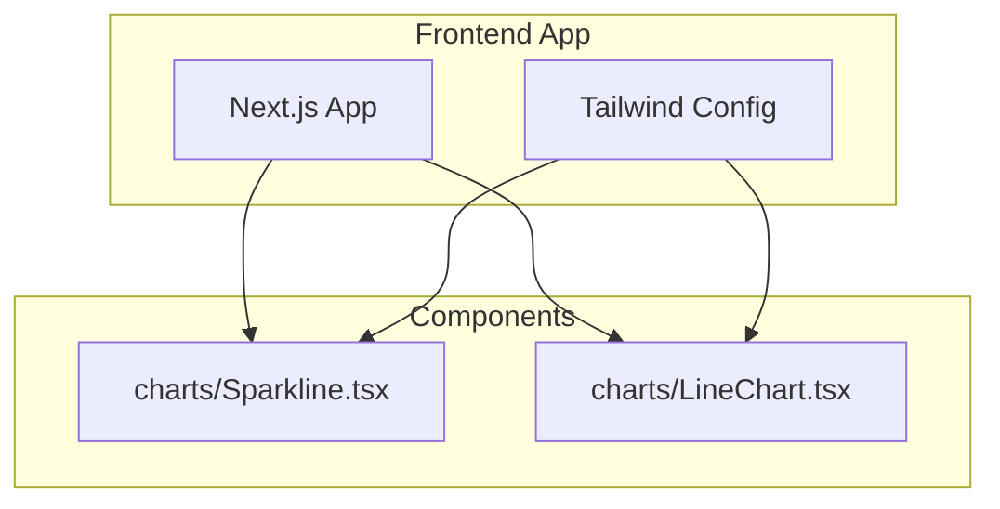
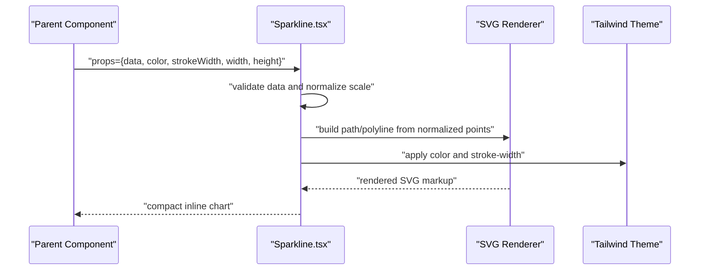
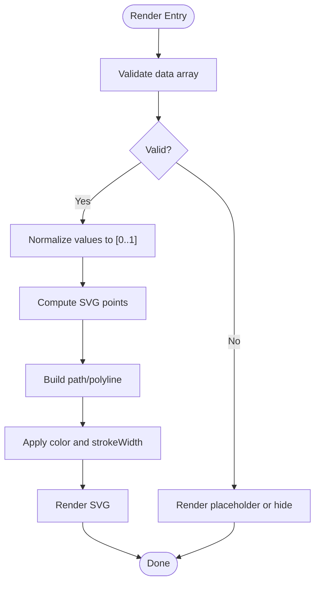
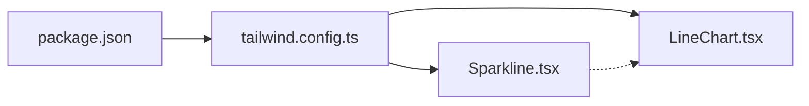

# Sparkline Component

<cite>
**Referenced Files in This Document**
- [Sparkline.tsx](file://src/components/charts/Sparkline.tsx)
- [LineChart.tsx](file://src/components/charts/LineChart.tsx)
- [tailwind.config.ts](file://tailwind.config.ts)
- [package.json](file://package.json)
</cite>

## Table of Contents
1. [Introduction](#introduction)
2. [Project Structure](#project-structure)
3. [Core Components](#core-components)
4. [Architecture Overview](#architecture-overview)
5. [Detailed Component Analysis](#detailed-component-analysis)
6. [Dependency Analysis](#dependency-analysis)
7. [Performance Considerations](#performance-considerations)
8. [Troubleshooting Guide](#troubleshooting-guide)
9. [Conclusion](#conclusion)
10. [Appendices](#appendices)

## Introduction
The Sparkline component is a lightweight, purpose-built visualization for compact data representation within tables and summaries. It renders small, simple charts that provide quick visual insights into data trends without the overhead of full-size charting libraries. Typical use cases include:
- Loan payment history mini-trends alongside numerical values
- Interest rate changes over time displayed inline with text or table cells
- Bank comparison indicators showing relative performance across institutions

This documentation explains how to integrate Sparkline into your frontend-vaya application, its props interface, data format requirements, configuration options (colors, line thickness, dimensions), performance optimization strategies for rendering many sparklines, mobile responsiveness, accessibility considerations, and customization via theme integration.

## Project Structure
The Sparkline implementation resides under the charts folder alongside other chart components. The project uses Tailwind CSS for styling and Next.js for the application framework.

**Diagram sources**
- [Sparkline.tsx](file://src/components/charts/Sparkline.tsx)
- [LineChart.tsx](file://src/components/charts/LineChart.tsx)
- [tailwind.config.ts](file://tailwind.config.ts)

**Section sources**
- [Sparkline.tsx](file://src/components/charts/Sparkline.tsx)
- [LineChart.tsx](file://src/components/charts/LineChart.tsx)
- [tailwind.config.ts](file://tailwind.config.ts)

## Core Components
- Sparkline: A minimal chart component optimized for inline display. It accepts an array of numeric values and renders a compact line path suitable for tight spaces like table rows or summary cards.
- LineChart: A more feature-rich line chart component intended for larger displays and complex interactions. While not required for Sparkline usage, it demonstrates the broader charting approach in the app.

Key responsibilities:
- Transform input data into a compact SVG path
- Apply configurable colors, stroke width, and dimensions
- Provide accessible labels and aria attributes
- Integrate with Tailwind for consistent theming

**Section sources**
- [Sparkline.tsx](file://src/components/charts/Sparkline.tsx)
- [LineChart.tsx](file://src/components/charts/LineChart.tsx)

## Architecture Overview
At runtime, Sparkline receives a numeric dataset and renders an SVG element containing a polyline or path representing the trend. Styling is applied through Tailwind classes and optional props. The component is stateless and designed for high-performance rendering when used in lists or tables.

**Diagram sources**
- [Sparkline.tsx](file://src/components/charts/Sparkline.tsx)
- [tailwind.config.ts](file://tailwind.config.ts)

## Detailed Component Analysis

### Props Interface and Data Format
- data: Array of numbers representing the trend values. Must be non-empty; undefined or empty arrays should be handled gracefully by the parent or component.
- color: Stroke color for the line. Accepts Tailwind color tokens or hex/rgb strings depending on implementation.
- strokeWidth: Numeric value controlling line thickness. Defaults to a thin stroke suitable for inline display.
- width: Display width in pixels or responsive units.
- height: Display height in pixels or responsive units.
- ariaLabel: Accessible label describing the sparkline’s meaning.
- showTooltip: Optional flag to enable hover tooltips with values.
- min/max: Optional bounds to normalize the scale consistently across multiple sparklines.

Data format requirements:
- Numeric array only (e.g., [10, 12, 11, 14, 13])
- Avoid NaN or null entries; filter or replace before passing to the component
- For consistent scaling across multiple sparklines, consider providing shared min/max

Accessibility:
- Provide ariaLabel for screen readers
- Ensure sufficient contrast between line color and background
- Use semantic roles where applicable

**Section sources**
- [Sparkline.tsx](file://src/components/charts/Sparkline.tsx)

### Rendering Logic and Scaling
- Input validation ensures the dataset is valid and non-empty
- Normalization maps values to the component’s coordinate space using provided or computed min/max
- Path generation creates a compact polyline/path optimized for small viewports
- Stroke and fill are applied via Tailwind classes or inline styles based on props

**Diagram sources**
- [Sparkline.tsx](file://src/components/charts/Sparkline.tsx)

### Integration Examples and Use Cases
- Loan payment history: Show monthly payments as a sparkline next to the total amount in a table row.
- Interest rate changes: Display historical rates as a mini-trend beside current rate values.
- Bank comparison indicators: Compare performance metrics across banks using aligned sparklines in a dashboard summary.

When integrating:
- Preprocess raw financial data to ensure clean numeric arrays
- Use shared min/max for consistent visual comparison across rows
- Keep widths and heights small (e.g., 60–120px wide, 20–40px tall) for inline placement

[No sources needed since this section provides conceptual guidance]

### Customization and Theme Integration
- Colors: Use Tailwind color tokens or custom theme colors defined in tailwind.config.ts
- Stroke width: Adjust via strokeWidth prop to balance visibility and compactness
- Dimensions: Set width and height to fit table cells or summary cards
- Accessibility: Ensure ariaLabel is descriptive and contrast ratios meet WCAG guidelines

To extend the theme:
- Add new color tokens in tailwind.config.ts
- Reference tokens in Sparkline props for consistent design system alignment

**Section sources**
- [tailwind.config.ts](file://tailwind.config.ts)
- [Sparkline.tsx](file://src/components/charts/Sparkline.tsx)

## Dependency Analysis
Sparkline has minimal dependencies:
- React for component structure
- Tailwind CSS for styling
- No heavy charting libraries, ensuring fast load times and low memory footprint

**Diagram sources**
- [package.json](file://package.json)
- [tailwind.config.ts](file://tailwind.config.ts)
- [Sparkline.tsx](file://src/components/charts/Sparkline.tsx)
- [LineChart.tsx](file://src/components/charts/LineChart.tsx)

**Section sources**
- [package.json](file://package.json)
- [tailwind.config.ts](file://tailwind.config.ts)
- [Sparkline.tsx](file://src/components/charts/Sparkline.tsx)
- [LineChart.tsx](file://src/components/charts/LineChart.tsx)

## Performance Considerations
- Prefer memoization for parent components rendering many sparklines to avoid unnecessary re-renders
- Use stable min/max values across datasets to prevent layout shifts and recalculations
- Keep data arrays concise; if large datasets are necessary, downsample or aggregate before rendering
- Avoid expensive computations inside render; precompute normalized points at the parent level when possible
- Leverage React keys correctly for list rendering to optimize reconciliation

[No sources needed since this section provides general guidance]

## Troubleshooting Guide
Common issues and resolutions:
- Empty or invalid data: Ensure data arrays are non-empty and contain valid numbers; handle edge cases upstream
- Poor contrast: Verify color choices against background; adjust color prop or theme tokens
- Inconsistent scaling: Provide shared min/max across related sparklines for fair comparisons
- Accessibility failures: Always set ariaLabel; test with screen readers and contrast checkers
- Mobile readability: Increase strokeWidth slightly on small screens; ensure adequate spacing around sparklines

[No sources needed since this section provides general guidance]

## Conclusion
The Sparkline component delivers a lightweight, efficient solution for inline trend visualization in tables and summaries. With a simple props interface, flexible styling via Tailwind, and strong accessibility support, it integrates seamlessly into the frontend-vaya design system. By following the recommended practices for data preparation, performance optimization, and theme integration, you can effectively communicate financial trends alongside numerical values in a compact and user-friendly manner.

[No sources needed since this section summarizes without analyzing specific files]

## Appendices

### Quick Reference: Props Summary
- data: number[] — Required numeric series
- color: string — Line color (Tailwind token or hex/rgb)
- strokeWidth: number — Line thickness
- width: number | string — Display width
- height: number | string — Display height
- ariaLabel: string — Accessible description
- showTooltip: boolean — Enable hover tooltips
- min: number — Optional lower bound for normalization
- max: number — Optional upper bound for normalization

[No sources needed since this section provides a reference summary]