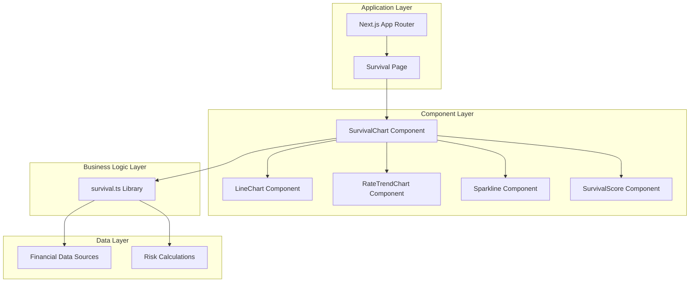
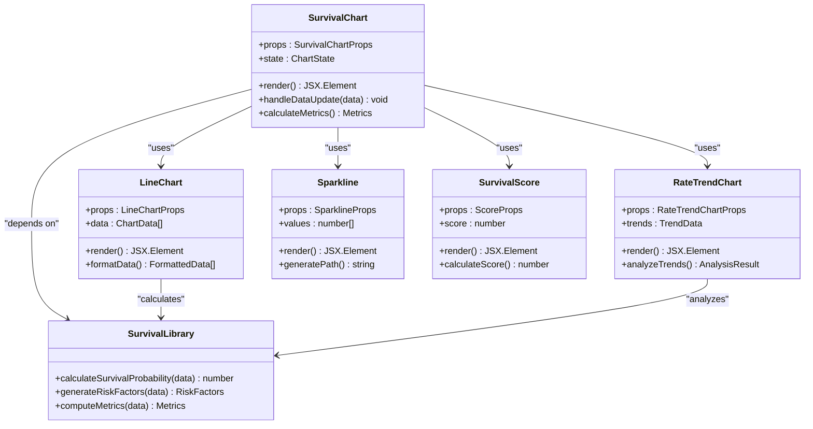
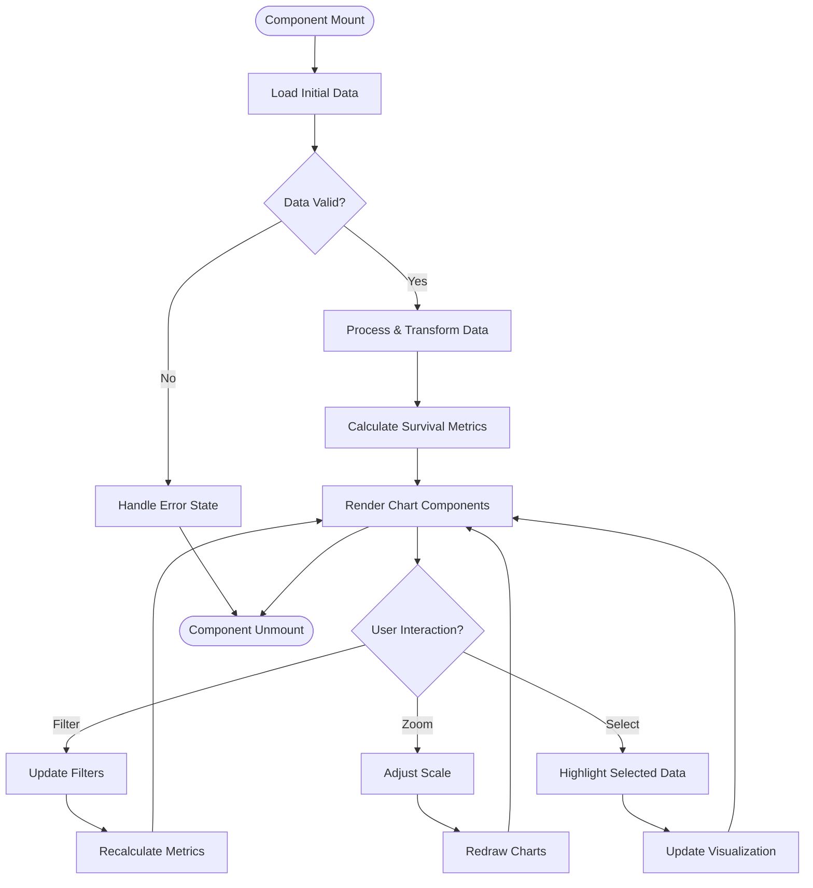
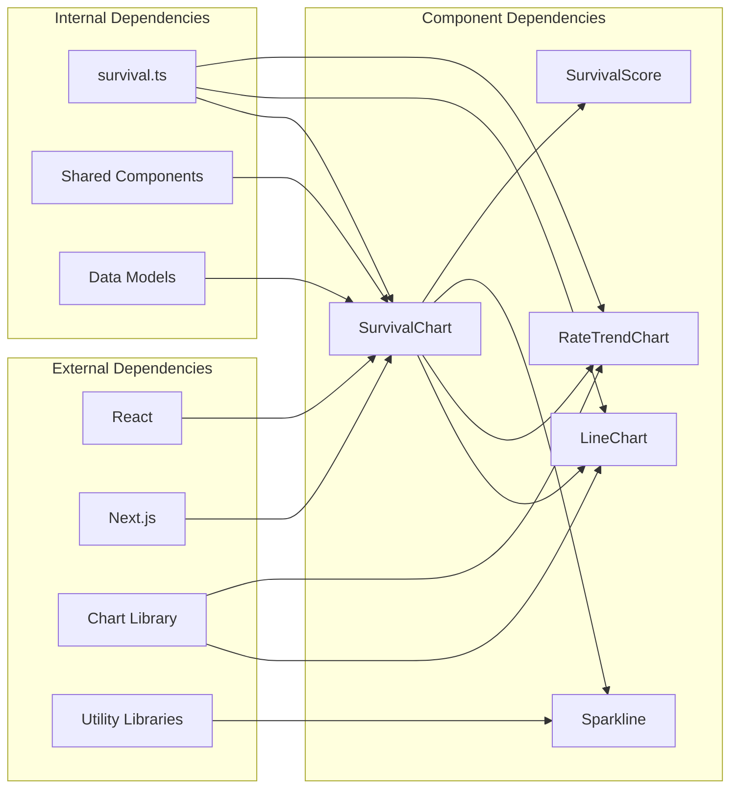

# Survival Chart Component

<cite>
**Referenced Files in This Document**
- [SurvivalChart.tsx](file://src/components/charts/SurvivalChart.tsx)
- [survival.ts](file://src/lib/survival.ts)
- [page.tsx](file://src/app/survival/page.tsx)
- [LineChart.tsx](file://src/components/charts/LineChart.tsx)
- [RateTrendChart.tsx](file://src/components/charts/RateTrendChart.tsx)
- [Sparkline.tsx](file://src/components/charts/Sparkline.tsx)
- [SurvivalScore.tsx](file://src/components/SurvivalScore.tsx)
</cite>

## Table of Contents
1. [Introduction](#introduction)
2. [Project Structure](#project-structure)
3. [Core Components](#core-components)
4. [Architecture Overview](#architecture-overview)
5. [Detailed Component Analysis](#detailed-component-analysis)
6. [Dependency Analysis](#dependency-analysis)
7. [Performance Considerations](#performance-considerations)
8. [Troubleshooting Guide](#troubleshooting-guide)
9. [Conclusion](#conclusion)

## Introduction
The Survival Chart Component is a specialized visualization tool designed to display survival analysis data within a financial or insurance context. This component provides interactive charts that help users understand risk factors, probability distributions, and survival metrics over time. The implementation follows modern React patterns with TypeScript support and integrates seamlessly with Next.js applications.

## Project Structure
The Survival Chart Component is part of a larger financial analysis application built with Next.js. The component architecture follows a modular approach with clear separation between presentation logic, business logic, and data processing.

**Diagram sources**
- [page.tsx:1-50](file://src/app/survival/page.tsx#L1-L50)
- [SurvivalChart.tsx:1-100](file://src/components/charts/SurvivalChart.tsx#L1-L100)
- [survival.ts:1-150](file://src/lib/survival.ts#L1-L150)

**Section sources**
- [page.tsx:1-100](file://src/app/survival/page.tsx#L1-L100)
- [SurvivalChart.tsx:1-200](file://src/components/charts/SurvivalChart.tsx#L1-L200)

## Core Components
The Survival Chart system consists of several interconnected components that work together to provide comprehensive survival analysis visualization:

### Primary Components
- **SurvivalChart**: Main container component that orchestrates all chart visualizations
- **LineChart**: Reusable line chart component for trend visualization
- **RateTrendChart**: Specialized chart for displaying rate changes over time
- **Sparkline**: Compact inline charts for showing quick data trends
- **SurvivalScore**: Component that displays calculated survival scores

### Data Processing
- **survival.ts**: Core library containing survival analysis algorithms and calculations

**Section sources**
- [SurvivalChart.tsx:1-150](file://src/components/charts/SurvivalChart.tsx#L1-L150)
- [survival.ts:1-200](file://src/lib/survival.ts#L1-L200)

## Architecture Overview
The Survival Chart Component follows a layered architecture pattern that separates concerns effectively:

**Diagram sources**
- [SurvivalChart.tsx:1-200](file://src/components/charts/SurvivalChart.tsx#L1-L200)
- [LineChart.tsx:1-100](file://src/components/charts/LineChart.tsx#L1-L100)
- [RateTrendChart.tsx:1-100](file://src/components/charts/RateTrendChart.tsx#L1-L100)
- [Sparkline.tsx:1-80](file://src/components/charts/Sparkline.tsx#L1-L80)
- [SurvivalScore.tsx:1-120](file://src/components/SurvivalScore.tsx#L1-L120)
- [survival.ts:1-200](file://src/lib/survival.ts#L1-L200)

## Detailed Component Analysis

### SurvivalChart Component
The main SurvivalChart component serves as the primary interface for displaying survival analysis data. It manages state, handles user interactions, and coordinates data flow between child components.

#### Key Features
- **Data Management**: Handles complex survival data structures and updates
- **Interactive Controls**: Provides filtering, zooming, and data selection capabilities
- **Responsive Design**: Adapts to different screen sizes and orientations
- **Accessibility**: Implements ARIA labels and keyboard navigation

#### Component Structure

**Diagram sources**
- [SurvivalChart.tsx:1-200](file://src/components/charts/SurvivalChart.tsx#L1-L200)

**Section sources**
- [SurvivalChart.tsx:1-200](file://src/components/charts/SurvivalChart.tsx#L1-L200)

### LineChart Component
The LineChart component provides flexible line chart functionality for displaying survival trends over time periods.

#### Implementation Details
- **Dynamic Scaling**: Automatically adjusts axis scales based on data range
- **Multiple Series Support**: Can display multiple data series simultaneously
- **Interactive Tooltips**: Shows detailed information on hover
- **Animation Support**: Smooth transitions for data updates

**Section sources**
- [LineChart.tsx:1-100](file://src/components/charts/LineChart.tsx#L1-L100)

### RateTrendChart Component
Specialized for analyzing rate changes and trends in survival probabilities over time intervals.

#### Key Capabilities
- **Trend Analysis**: Identifies upward, downward, and stable trends
- **Statistical Markers**: Displays confidence intervals and statistical significance
- **Comparison Mode**: Allows side-by-side comparison of different scenarios

**Section sources**
- [RateTrendChart.tsx:1-100](file://src/components/charts/RateTrendChart.tsx#L1-L100)

### Sparkline Component
Compact inline charts designed for embedding within tables or dashboards to show quick data snapshots.

#### Design Principles
- **Minimal Footprint**: Optimized for space-constrained environments
- **High Performance**: Efficient rendering for large datasets
- **Consistent Styling**: Maintains visual consistency across the application

**Section sources**
- [Sparkline.tsx:1-80](file://src/components/charts/Sparkline.tsx#L1-L80)

### SurvivalScore Component
Displays calculated survival scores with visual indicators and contextual information.

#### Scoring System
- **Multi-factor Analysis**: Considers various risk factors and conditions
- **Dynamic Thresholds**: Adapts scoring criteria based on context
- **Visual Feedback**: Uses color coding and progress indicators

**Section sources**
- [SurvivalScore.tsx:1-120](file://src/components/SurvivalScore.tsx#L1-L120)

## Dependency Analysis
The Survival Chart system has well-defined dependencies that ensure modularity and maintainability:

**Diagram sources**
- [SurvivalChart.tsx:1-200](file://src/components/charts/SurvivalChart.tsx#L1-L200)
- [survival.ts:1-200](file://src/lib/survival.ts#L1-L200)

**Section sources**
- [SurvivalChart.tsx:1-200](file://src/components/charts/SurvivalChart.tsx#L1-L200)
- [survival.ts:1-200](file://src/lib/survival.ts#L1-L200)

## Performance Considerations
The Survival Chart Component implements several performance optimization strategies:

### Rendering Optimization
- **Memoization**: Uses React.memo and useMemo for expensive calculations
- **Virtual Scrolling**: Implements virtual scrolling for large datasets
- **Lazy Loading**: Loads heavy chart libraries on demand
- **Debounced Updates**: Prevents excessive re-renders during user interactions

### Memory Management
- **Efficient Data Structures**: Uses typed arrays for numerical data
- **Proper Cleanup**: Implements cleanup functions for event listeners and timers
- **Garbage Collection**: Avoids memory leaks through proper reference management

### Network Optimization
- **Data Caching**: Implements intelligent caching strategies
- **Batched Requests**: Combines multiple API calls when possible
- **Progressive Loading**: Shows partial data while loading completes

## Troubleshooting Guide

### Common Issues and Solutions

#### Data Loading Problems
- **Symptom**: Charts not displaying or showing empty states
- **Causes**: Invalid data format, network errors, or missing required fields
- **Solutions**: 
  - Validate data structure before processing
  - Implement proper error boundaries
  - Add loading states and retry mechanisms

#### Performance Issues
- **Symptom**: Slow rendering or unresponsive UI
- **Causes**: Large datasets, inefficient calculations, or memory leaks
- **Solutions**:
  - Implement data pagination
  - Optimize calculation algorithms
  - Use profiling tools to identify bottlenecks

#### Layout Problems
- **Symptom**: Charts not responsive or overlapping
- **Causes**: CSS conflicts, incorrect sizing, or container issues
- **Solutions**:
  - Use flexbox/grid layouts
  - Implement proper responsive breakpoints
  - Ensure proper container sizing

**Section sources**
- [SurvivalChart.tsx:1-200](file://src/components/charts/SurvivalChart.tsx#L1-L200)
- [survival.ts:1-200](file://src/lib/survival.ts#L1-L200)

## Conclusion
The Survival Chart Component represents a sophisticated implementation of survival analysis visualization within a modern web application. Its modular architecture, performance optimizations, and comprehensive feature set make it suitable for complex financial and insurance analysis scenarios. The component successfully balances usability, performance, and maintainability while providing powerful analytical capabilities to end users.

Key strengths include its reactive design, efficient data handling, and comprehensive error handling. The component's extensible architecture allows for easy integration of new chart types and analytical features as requirements evolve.

Future enhancements could include advanced customization options, additional chart types, and enhanced mobile responsiveness. The solid foundation provided by the current implementation makes these extensions straightforward to implement.