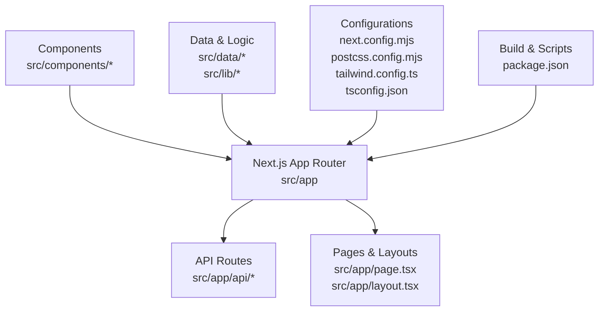
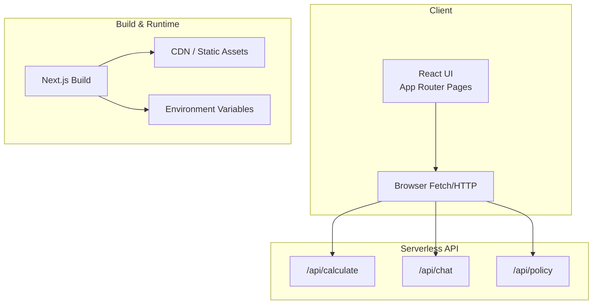
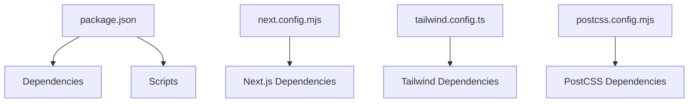

# Deployment Guide

<cite>
**Referenced Files in This Document**
- [next.config.mjs](file://next.config.mjs)
- [package.json](file://package.json)
- [postcss.config.mjs](file://postcss.config.mjs)
- [tailwind.config.ts](file://tailwind.config.ts)
- [tsconfig.json](file://tsconfig.json)
- [.gitignore](file://.gitignore)
- [README.md](file://README.md)
- [src/app/layout.tsx](file://src/app/layout.tsx)
- [src/app/page.tsx](file://src/app/page.tsx)
- [src/app/api/calculate/route.ts](file://src/app/api/calculate/route.ts)
- [src/app/api/chat/route.ts](file://src/app/api/chat/route.ts)
- [src/app/api/policy/route.ts](file://src/app/api/policy/route.ts)
</cite>

## Table of Contents
1. [Introduction](#introduction)
2. [Project Structure](#project-structure)
3. [Core Components](#core-components)
4. [Architecture Overview](#architecture-overview)
5. [Detailed Component Analysis](#detailed-component-analysis)
6. [Dependency Analysis](#dependency-analysis)
7. [Performance Considerations](#performance-considerations)
8. [Troubleshooting Guide](#troubleshooting-guide)
9. [Conclusion](#conclusion)
10. [Appendices](#appendices)

## Introduction
This guide provides comprehensive deployment instructions for the frontend-vaya application, a Next.js-based frontend. It covers build configuration, environment variables, asset optimization, performance tuning, and deployment to Vercel, Netlify, and custom hosting environments. It also includes guidance on production builds, caching strategies, CDN setup, environment-specific configurations, monitoring and logging, error tracking, performance monitoring, security considerations, step-by-step procedures, and troubleshooting common issues.

## Project Structure
The project follows the Next.js App Router structure with server routes under src/app/api, UI components under src/components, data under src/data, internationalization under src/i18n, and shared logic under src/lib. Configuration files include next.config.mjs, postcss.config.mjs, tailwind.config.ts, tsconfig.json, package.json, and .gitignore.

**Diagram sources**
- [next.config.mjs](file://next.config.mjs)
- [package.json](file://package.json)
- [postcss.config.mjs](file://postcss.config.mjs)
- [tailwind.config.ts](file://tailwind.config.ts)
- [tsconfig.json](file://tsconfig.json)
- [src/app/layout.tsx](file://src/app/layout.tsx)
- [src/app/page.tsx](file://src/app/page.tsx)
- [src/app/api/calculate/route.ts](file://src/app/api/calculate/route.ts)
- [src/app/api/chat/route.ts](file://src/app/api/chat/route.ts)
- [src/app/api/policy/route.ts](file://src/app/api/policy/route.ts)

**Section sources**
- [README.md](file://README.md)
- [package.json](file://package.json)
- [next.config.mjs](file://next.config.mjs)
- [postcss.config.mjs](file://postcss.config.mjs)
- [tailwind.config.ts](file://tailwind.config.ts)
- [tsconfig.json](file://tsconfig.json)
- [src/app/layout.tsx](file://src/app/layout.tsx)
- [src/app/page.tsx](file://src/app/page.tsx)

## Core Components
- Build system: Next.js with App Router and TypeScript.
- Styling pipeline: PostCSS and Tailwind CSS configured via dedicated config files.
- API routes: Serverless functions under src/app/api for calculate, chat, and policy endpoints.
- Internationalization: Provider and dictionary modules under src/i18n.
- Data and engine logic: Localized datasets and loan engine utilities under src/data and src/lib.

Key responsibilities:
- next.config.mjs controls Next.js behavior, including environment variables, asset handling, and optimizations.
- package.json defines scripts for development, building, and linting.
- postcss.config.mjs and tailwind.config.ts configure the styling pipeline.
- tsconfig.json enforces TypeScript settings for consistent builds.

**Section sources**
- [next.config.mjs](file://next.config.mjs)
- [package.json](file://package.json)
- [postcss.config.mjs](file://postcss.config.mjs)
- [tailwind.config.ts](file://tailwind.config.ts)
- [tsconfig.json](file://tsconfig.json)
- [src/app/api/calculate/route.ts](file://src/app/api/calculate/route.ts)
- [src/app/api/chat/route.ts](file://src/app/api/chat/route.ts)
- [src/app/api/policy/route.ts](file://src/app/api/policy/route.ts)

## Architecture Overview
The application is a client-side heavy Next.js app with serverless API routes. The build process produces static assets optimized for CDN delivery. Environment variables are injected at build time or runtime depending on platform support.

**Diagram sources**
- [src/app/page.tsx](file://src/app/page.tsx)
- [src/app/api/calculate/route.ts](file://src/app/api/calculate/route.ts)
- [src/app/api/chat/route.ts](file://src/app/api/chat/route.ts)
- [src/app/api/policy/route.ts](file://src/app/api/policy/route.ts)
- [next.config.mjs](file://next.config.mjs)

## Detailed Component Analysis

### Build Configuration (Next.js)
- next.config.mjs: Centralizes Next.js options such as environment variable exposure, asset optimization, and output behavior. Use it to enable/disable features like image optimization, experimental flags, and redirects.
- package.json: Contains scripts for dev, build, start, and lint tasks. Ensure correct Node.js version and dependencies are installed before building.
- postcss.config.mjs and tailwind.config.ts: Configure PostCSS plugins and Tailwind directives. Keep content paths accurate to avoid missing styles in production builds.
- tsconfig.json: Enforces strictness and module resolution. Align compiler options across environments to prevent build inconsistencies.

Best practices:
- Define only necessary public environment variables for client exposure.
- Avoid bundling large libraries; use dynamic imports where appropriate.
- Validate environment variables at runtime in API routes to fail fast.

**Section sources**
- [next.config.mjs](file://next.config.mjs)
- [package.json](file://package.json)
- [postcss.config.mjs](file://postcss.config.mjs)
- [tailwind.config.ts](file://tailwind.config.ts)
- [tsconfig.json](file://tsconfig.json)

### API Routes
- /api/calculate: Handles calculation requests from the client.
- /api/chat: Processes chat interactions, potentially integrating AI services.
- /api/policy: Manages policy-related operations.

Recommendations:
- Validate inputs and return standardized error responses.
- Use environment variables for secrets and external service keys.
- Implement rate limiting and request size limits if needed.

**Section sources**
- [src/app/api/calculate/route.ts](file://src/app/api/calculate/route.ts)
- [src/app/api/chat/route.ts](file://src/app/api/chat/route.ts)
- [src/app/api/policy/route.ts](file://src/app/api/policy/route.ts)

### UI and Layout
- src/app/page.tsx: Root page component.
- src/app/layout.tsx: Global layout and metadata provider.

Guidelines:
- Keep layout lightweight; defer non-critical scripts.
- Use Next.js built-in image optimization for images.
- Prefer static generation or incremental static regeneration where possible.

**Section sources**
- [src/app/page.tsx](file://src/app/page.tsx)
- [src/app/layout.tsx](file://src/app/layout.tsx)

## Dependency Analysis
Dependencies are managed through package.json. Ensure lockfiles are committed to maintain reproducible builds. External dependencies should be minimized and audited regularly.

**Diagram sources**
- [package.json](file://package.json)
- [next.config.mjs](file://next.config.mjs)
- [tailwind.config.ts](file://tailwind.config.ts)
- [postcss.config.mjs](file://postcss.config.mjs)

**Section sources**
- [package.json](file://package.json)
- [next.config.mjs](file://next.config.mjs)
- [tailwind.config.ts](file://tailwind.config.ts)
- [postcss.config.mjs](file://postcss.config.mjs)

## Performance Considerations
- Asset Optimization: Enable Next.js image optimization and ensure proper sizing. Use modern formats and lazy loading for offscreen assets.
- Code Splitting: Leverage dynamic imports for heavy components and third-party libraries.
- Caching Strategy: Set appropriate cache-control headers for static assets. Use immutable caching for hashed filenames.
- CDN Setup: Deploy static assets to a CDN with edge caching. Configure cache rules for HTML vs. assets.
- Bundle Size: Monitor bundle size using Next.js built-in reports. Remove unused dependencies and tree-shake effectively.
- Network Requests: Minimize API calls; batch requests where feasible. Use optimistic updates for better UX.

[No sources needed since this section provides general guidance]

## Troubleshooting Guide
Common issues and resolutions:
- Build fails due to missing environment variables: Ensure all required variables are set in the deployment platform’s environment settings.
- API routes not found: Verify route file names and paths match expected patterns. Check that serverless functions are supported by the target platform.
- Styles missing in production: Confirm Tailwind content paths include all relevant files. Rebuild after adding new components.
- CORS errors: Configure CORS headers in API routes or platform middleware. Allow only trusted origins.
- HTTPS misconfiguration: Ensure the platform enforces HTTPS and certificates are valid. Redirect HTTP to HTTPS.
- Large bundle sizes: Analyze bundle with Next.js report and remove unnecessary code.

**Section sources**
- [next.config.mjs](file://next.config.mjs)
- [src/app/api/calculate/route.ts](file://src/app/api/calculate/route.ts)
- [src/app/api/chat/route.ts](file://src/app/api/chat/route.ts)
- [src/app/api/policy/route.ts](file://src/app/api/policy/route.ts)
- [tailwind.config.ts](file://tailwind.config.ts)

## Conclusion
This guide outlined the deployment strategy for the frontend-vaya application using Next.js. By following the recommended build configurations, environment management, performance tuning, and security practices, you can achieve reliable and high-performance deployments across Vercel, Netlify, and custom hosting platforms.

[No sources needed since this section summarizes without analyzing specific files]

## Appendices

### Environment Variables Management
- Define variables in platform-specific settings (e.g., Vercel dashboard, Netlify environment).
- For local development, use .env files and ensure they are excluded via .gitignore.
- Expose only client-safe variables to the browser; keep secrets server-side.

**Section sources**
- [.gitignore](file://.gitignore)
- [next.config.mjs](file://next.config.mjs)
- [package.json](file://package.json)

### Production Build Configuration
- Run the production build script defined in package.json.
- Validate outputs and ensure no debug logs remain.
- Test API routes in a staging environment before production rollout.

**Section sources**
- [package.json](file://package.json)
- [next.config.mjs](file://next.config.mjs)

### Monitoring and Logging
- Integrate error tracking (e.g., Sentry) via SDK initialization in the app entry point.
- Use platform logs for API route diagnostics.
- Add performance metrics collection for critical user flows.

[No sources needed since this section provides general guidance]

### Security Considerations
- Enforce HTTPS at the platform level.
- Configure CORS policies to restrict origins.
- Sanitize and validate all inputs in API routes.
- Rotate secrets regularly and avoid committing sensitive data.

[No sources needed since this section provides general guidance]

### Step-by-Step Deployment Procedures

#### Vercel
- Connect repository to Vercel and select the Next.js preset.
- Configure environment variables in the Vercel dashboard.
- Deploy automatically on push or manually trigger builds.
- Verify API routes and static assets load correctly.

[No sources needed since this section provides general guidance]

#### Netlify
- Link repository and choose Next.js framework preset.
- Set environment variables in Netlify’s site settings.
- Configure build command and publish directory if needed.
- Test deployed site and API endpoints.

[No sources needed since this section provides general guidance]

#### Custom Hosting
- Build the app locally and upload the output directory.
- Configure reverse proxy (e.g., Nginx) to serve static assets and forward API routes.
- Set up HTTPS with a certificate manager.
- Optimize caching headers for assets and HTML.

[No sources needed since this section provides general guidance]