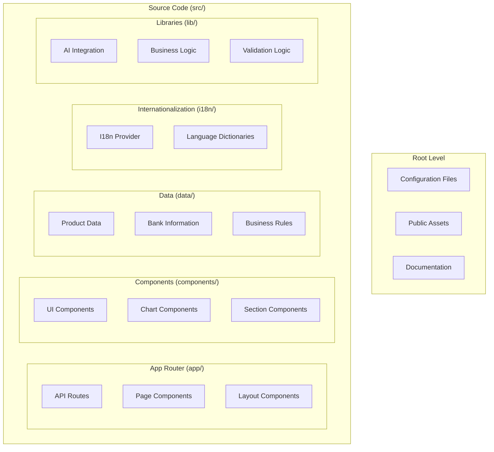
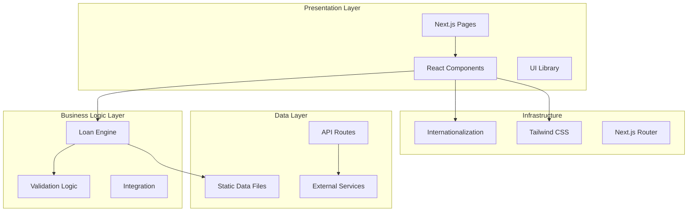
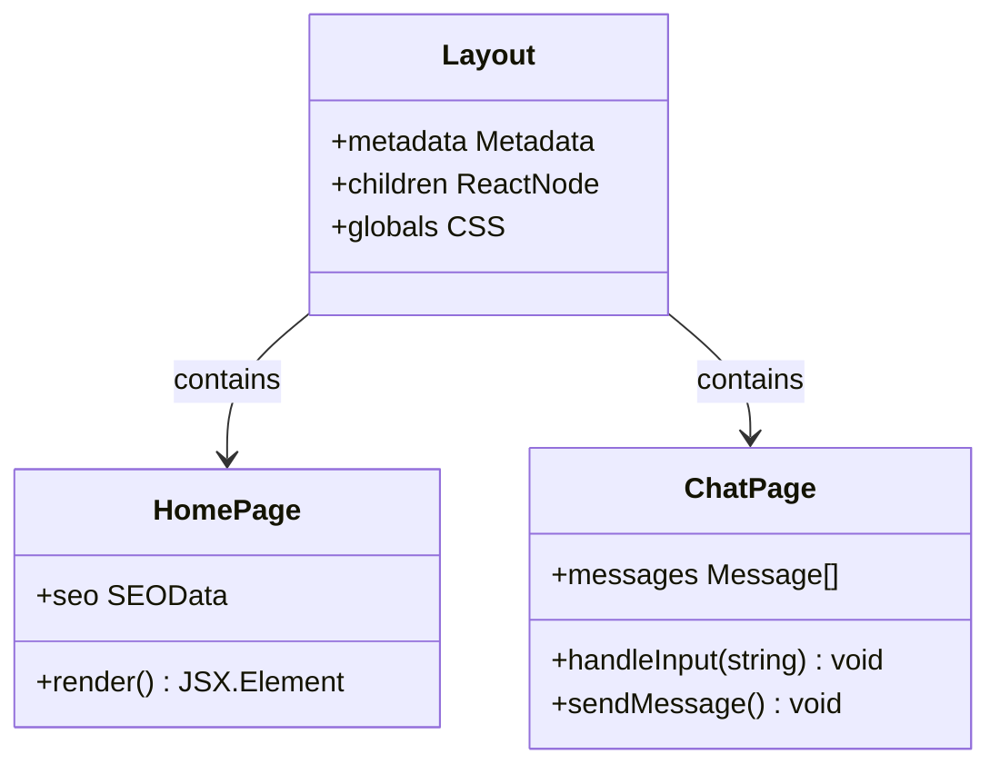
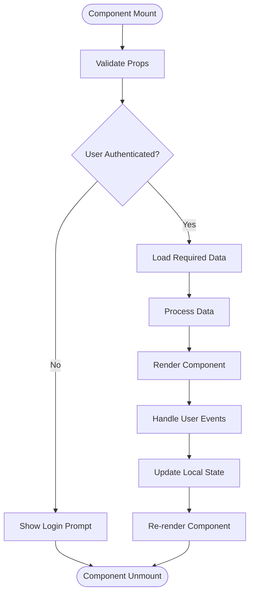
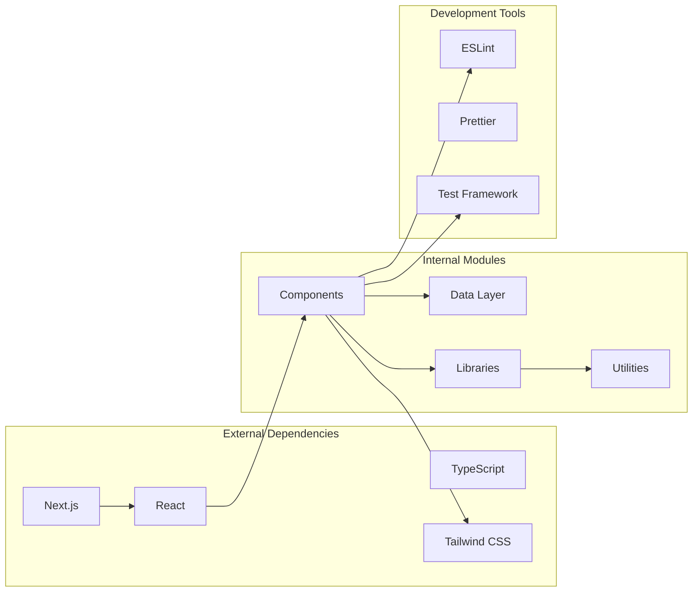

# Development Guidelines

<cite>
**Referenced Files in This Document**
- [package.json](file://package.json)
- [next.config.mjs](file://next.config.mjs)
- [tailwind.config.ts](file://tailwind.config.ts)
- [tsconfig.json](file://tsconfig.json)
- [README.md](file://README.md)
- [src/app/layout.tsx](file://src/app/layout.tsx)
- [src/app/page.tsx](file://src/app/page.tsx)
- [src/components/Navbar.tsx](file://src/components/Navbar.tsx)
- [src/components/Hero.tsx](file://src/components/Hero.tsx)
- [src/i18n/I18nProvider.tsx](file://src/i18n/I18nProvider.tsx)
- [src/lib/loanEngine.ts](file://src/lib/loanEngine.ts)
</cite>

## Table of Contents
1. [Introduction](#introduction)
2. [Project Structure](#project-structure)
3. [Core Components](#core-components)
4. [Architecture Overview](#architecture-overview)
5. [Detailed Component Analysis](#detailed-component-analysis)
6. [Dependency Analysis](#dependency-analysis)
7. [Performance Considerations](#performance-considerations)
8. [Troubleshooting Guide](#troubleshooting-guide)
9. [Conclusion](#conclusion)
10. [Appendices](#appendices)

## Introduction

The frontend-vaya project is a modern Next.js application built with TypeScript and React, designed to provide an intelligent financial advisory platform. This document serves as a comprehensive guide for developers contributing to the project, covering coding standards, architectural patterns, and best practices specific to this codebase.

The project follows modern web development principles with a focus on performance, accessibility, and maintainability. It leverages Next.js App Router, Tailwind CSS for styling, and TypeScript for type safety throughout the application.

## Project Structure

The project follows a feature-based organization pattern with clear separation of concerns:

**Diagram sources**
- [src/app/layout.tsx](file://src/app/layout.tsx)
- [src/components/Navbar.tsx](file://src/components/Navbar.tsx)
- [src/data/banks.ts](file://src/data/banks.ts)

### Directory Organization Principles

- **`src/app/`**: Next.js App Router pages and API routes
- **`src/components/`**: Reusable React components organized by functionality
- **`src/data/`**: Static data files and business rules
- **`src/i18n/`**: Internationalization setup and language dictionaries
- **`src/lib/`**: Core business logic and utility functions

### File Naming Conventions

- **Components**: PascalCase with descriptive names (e.g., `Navbar.tsx`, `Hero.tsx`)
- **Pages**: kebab-case for route-based files (e.g., `chat-page.tsx`)
- **Utilities**: camelCase for helper functions
- **Data files**: lowercase with descriptive names (e.g., `banks.ts`, `rules.ts`)

**Section sources**
- [src/app/layout.tsx](file://src/app/layout.tsx)
- [src/components/Navbar.tsx](file://src/components/Navbar.tsx)
- [src/data/banks.ts](file://src/data/banks.ts)

## Core Components

The component architecture follows React best practices with TypeScript integration:

### Component Categories

1. **Layout Components**: Structural elements like `Navbar`, `Footer`
2. **Feature Components**: Business-specific components like `ChatAdvisor`, `MarketsSection`
3. **UI Components**: Reusable interface elements like buttons, forms
4. **Chart Components**: Data visualization components

### Component Patterns

All components follow these patterns:
- Functional components with TypeScript interfaces
- Props validation through TypeScript
- Consistent naming conventions
- Proper error boundaries
- Accessibility compliance

**Section sources**
- [src/components/Navbar.tsx](file://src/components/Navbar.tsx)
- [src/components/Hero.tsx](file://src/components/Hero.tsx)
- [src/components/ChatAdvisor.tsx](file://src/components/ChatAdvisor.tsx)

## Architecture Overview

The application follows a layered architecture pattern:

**Diagram sources**
- [src/app/layout.tsx](file://src/app/layout.tsx)
- [src/lib/loanEngine.ts](file://src/lib/loanEngine.ts)
- [src/i18n/I18nProvider.tsx](file://src/i18n/I18nProvider.tsx)

### Key Architectural Decisions

1. **Server-Side Rendering**: Utilizes Next.js SSR for performance optimization
2. **Type Safety**: Full TypeScript coverage across all layers
3. **Modular Design**: Clear separation between presentation, business logic, and data
4. **Internationalization**: Built-in i18n support for global reach
5. **Responsive Design**: Mobile-first approach with Tailwind CSS

## Detailed Component Analysis

### Layout and Page Components

The layout system provides consistent structure across all pages:

**Diagram sources**
- [src/app/layout.tsx](file://src/app/layout.tsx)
- [src/app/page.tsx](file://src/app/page.tsx)

### Component Composition Pattern

Components are composed using a hierarchical approach:

**Diagram sources**
- [src/components/ChatAdvisor.tsx](file://src/components/ChatAdvisor.tsx)
- [src/components/Hero.tsx](file://src/components/Hero.tsx)

### State Management Patterns

The project uses React's built-in state management with hooks:

- **Local State**: `useState` for component-level state
- **Side Effects**: `useEffect` for data fetching and subscriptions
- **Context**: `useContext` for global state when needed
- **Custom Hooks**: Encapsulated logic for reusability

**Section sources**
- [src/app/page.tsx](file://src/app/page.tsx)
- [src/components/ChatAdvisor.tsx](file://src/components/ChatAdvisor.tsx)

## Dependency Analysis

The project maintains clean dependency relationships:

**Diagram sources**
- [package.json](file://package.json)
- [next.config.mjs](file://next.config.mjs)

### Dependency Management Best Practices

1. **Semantic Versioning**: Use caret ranges for dependencies
2. **Regular Updates**: Keep dependencies updated for security
3. **Minimal Dependencies**: Only include necessary packages
4. **Peer Dependencies**: Define peer dependencies clearly

**Section sources**
- [package.json](file://package.json)
- [next.config.mjs](file://next.config.mjs)

## Performance Considerations

### Optimization Strategies

1. **Code Splitting**: Automatic splitting with Next.js App Router
2. **Image Optimization**: Optimized image loading and formats
3. **Font Loading**: Efficient font loading strategies
4. **Bundle Analysis**: Regular bundle size analysis
5. **Lazy Loading**: Dynamic imports for heavy components

### Caching Strategies

- **Browser Caching**: Proper cache headers for static assets
- **API Caching**: Strategic caching for API responses
- **Component Caching**: Memoization for expensive computations

### Monitoring and Metrics

- **Core Web Vitals**: Monitor LCP, FID, CLS metrics
- **Error Tracking**: Centralized error logging
- **Performance Profiling**: Regular performance audits

## Troubleshooting Guide

### Common Issues and Solutions

1. **TypeScript Errors**: Ensure proper type definitions and imports
2. **Build Failures**: Check configuration files and dependencies
3. **Runtime Errors**: Implement proper error boundaries
4. **Performance Issues**: Use browser dev tools for profiling
5. **Styling Conflicts**: Review CSS specificity and Tailwind classes

### Debugging Techniques

- **Console Logging**: Structured logging with context
- **Error Boundaries**: Graceful error handling
- **Development Tools**: Browser dev tools and React DevTools
- **API Testing**: Postman or similar tools for API debugging

**Section sources**
- [src/lib/validation/index.ts](file://src/lib/validation/index.ts)
- [src/lib/loanEngine.ts](file://src/lib/loanEngine.ts)

## Conclusion

This development guidelines document provides a comprehensive framework for contributing to the frontend-vaya project. By following these standards and patterns, contributors can maintain code quality, ensure consistency, and build scalable features effectively.

Key takeaways:
- Maintain TypeScript strictness and type safety
- Follow component composition patterns
- Optimize for performance from the start
- Write accessible and internationalized code
- Implement proper error handling and testing

## Appendices

### A. Development Setup

1. **Environment Requirements**: Node.js 18+, npm/yarn
2. **Installation Steps**: Clone repo, install dependencies, configure environment
3. **Development Workflow**: Start dev server, hot reload, debugging

### B. Code Review Checklist

- [ ] TypeScript compilation passes
- [ ] No console.log statements in production code
- [ ] Proper error handling implemented
- [ ] Accessibility requirements met
- [ ] Performance considerations addressed
- [ ] Tests written and passing
- [ ] Documentation updated

### C. Deployment Guidelines

- **Environment Variables**: Secure configuration management
- **Build Optimization**: Production build settings
- **Monitoring**: Post-deployment monitoring setup
- **Rollback Strategy**: Safe deployment practices