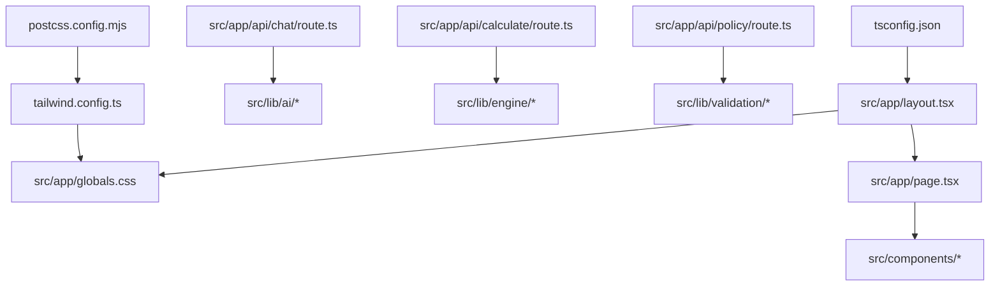
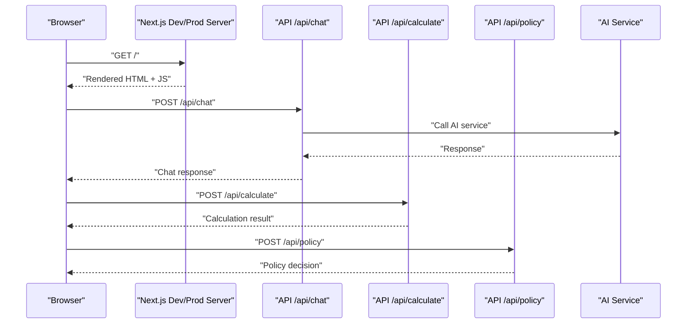

# Getting Started

<cite>
**Referenced Files in This Document**
- [package.json](file://package.json)
- [next.config.mjs](file://next.config.mjs)
- [postcss.config.mjs](file://postcss.config.mjs)
- [tailwind.config.ts](file://tailwind.config.ts)
- [tsconfig.json](file://tsconfig.json)
- [src/app/layout.tsx](file://src/app/layout.tsx)
- [src/app/page.tsx](file://src/app/page.tsx)
- [src/app/globals.css](file://src/app/globals.css)
- [src/app/api/chat/route.ts](file://src/app/api/chat/route.ts)
- [src/app/api/calculate/route.ts](file://src/app/api/calculate/route.ts)
- [src/app/api/policy/route.ts](file://src/app/api/policy/route.ts)
</cite>

## Table of Contents
1. Introduction
2. Project Structure
3. Core Components
4. Architecture Overview
5. Detailed Component Analysis
6. Dependency Analysis
7. Performance Considerations
8. Troubleshooting Guide
9. Conclusion

## Introduction
This guide helps you set up and run the frontend-vaya Next.js application locally, configure your development environment, and integrate AI services. It covers Node.js requirements, package manager setup (npm or yarn), TypeScript compilation settings, Tailwind CSS configuration, PostCSS pipeline, running the dev server, building for production, and basic customization. If you are new to Next.js, follow the steps sequentially; experienced developers can jump to the sections they need.

## Project Structure
The project follows a modern Next.js App Router layout with:
- src/app: Application routes, global styles, and API endpoints
- src/components: Reusable UI components
- src/data: Static data and business rules
- src/i18n: Internationalization provider and dictionary
- src/lib: Shared libraries including AI integration, engine logic, validation, and loan engine

**Diagram sources**
- [src/app/layout.tsx](file://src/app/layout.tsx)
- [src/app/globals.css](file://src/app/globals.css)
- [src/app/page.tsx](file://src/app/page.tsx)
- [tailwind.config.ts](file://tailwind.config.ts)
- [postcss.config.mjs](file://postcss.config.mjs)
- [tsconfig.json](file://tsconfig.json)
- [src/app/api/chat/route.ts](file://src/app/api/chat/route.ts)
- [src/app/api/calculate/route.ts](file://src/app/api/calculate/route.ts)
- [src/app/api/policy/route.ts](file://src/app/api/policy/route.ts)

**Section sources**
- [package.json](file://package.json)
- [next.config.mjs](file://next.config.mjs)
- [postcss.config.mjs](file://postcss.config.mjs)
- [tailwind.config.ts](file://tailwind.config.ts)
- [tsconfig.json](file://tsconfig.json)
- [src/app/layout.tsx](file://src/app/layout.tsx)
- [src/app/page.tsx](file://src/app/page.tsx)
- [src/app/globals.css](file://src/app/globals.css)
- [src/app/api/chat/route.ts](file://src/app/api/chat/route.ts)
- [src/app/api/calculate/route.ts](file://src/app/api/calculate/route.ts)
- [src/app/api/policy/route.ts](file://src/app/api/policy/route.ts)

## Core Components
Key runtime and build-time configuration files that define how the app runs and is processed:

- package.json: Declares dependencies, scripts, and metadata used by npm/yarn.
- next.config.mjs: Next.js configuration for the application.
- postcss.config.mjs: PostCSS pipeline configuration used by Tailwind.
- tailwind.config.ts: Tailwind CSS configuration for themes, plugins, and content scanning.
- tsconfig.json: TypeScript compiler options for the project.
- src/app/layout.tsx: Root layout component for the App Router.
- src/app/page.tsx: Home page route entry point.
- src/app/globals.css: Global styles consumed by Tailwind.
- src/app/api/*: Server-side API routes for chat, calculate, and policy features.

What this means for you:
- Scripts in package.json drive development, building, and linting tasks.
- Tailwind + PostCSS process styles defined in globals.css and component-level classes.
- TypeScript enforces type safety across components and APIs.
- API routes provide backend-like functionality within Next.js.

**Section sources**
- [package.json](file://package.json)
- [next.config.mjs](file://next.config.mjs)
- [postcss.config.mjs](file://postcss.config.mjs)
- [tailwind.config.ts](file://tailwind.config.ts)
- [tsconfig.json](file://tsconfig.json)
- [src/app/layout.tsx](file://src/app/layout.tsx)
- [src/app/page.tsx](file://src/app/page.tsx)
- [src/app/globals.css](file://src/app/globals.css)
- [src/app/api/chat/route.ts](file://src/app/api/chat/route.ts)
- [src/app/api/calculate/route.ts](file://src/app/api/calculate/route.ts)
- [src/app/api/policy/route.ts](file://src/app/api/policy/route.ts)

## Architecture Overview
High-level flow from browser to serverless API routes and external AI services:

**Diagram sources**
- [src/app/page.tsx](file://src/app/page.tsx)
- [src/app/api/chat/route.ts](file://src/app/api/chat/route.ts)
- [src/app/api/calculate/route.ts](file://src/app/api/calculate/route.ts)
- [src/app/api/policy/route.ts](file://src/app/api/policy/route.ts)

## Detailed Component Analysis

### Installation and Environment Setup
- Install Node.js using an LTS version recommended by Next.js.
- Choose a package manager:
  - npm: included with Node.js
  - yarn: install via npm or corepack
- Clone the repository and navigate into the project directory.
- Install dependencies:
  - With npm: run the install script from package.json
  - With yarn: run the equivalent install command
- Create an environment file for secrets and configuration variables. The typical location is a .env.local file at the project root. Add any required keys for AI services and other integrations.

Environment variables best practices:
- Keep secrets out of version control.
- Use descriptive names and group related variables together.
- Validate required variables at startup if possible.

**Section sources**
- [package.json](file://package.json)

### Development Environment Configuration
- TypeScript compilation:
  - Configured via tsconfig.json. Ensure paths, strictness, and module resolution match your preferences.
- Tailwind CSS:
  - Defined in tailwind.config.ts. Content paths should include all template files where Tailwind classes are used.
- PostCSS pipeline:
  - Configured in postcss.config.mjs. Tailwind is typically processed through PostCSS during builds and dev.
- Next.js configuration:
  - next.config.mjs controls Next-specific behavior such as redirects, rewrites, and performance optimizations.

Customization tips:
- Extend Tailwind theme colors, spacing, and typography in tailwind.config.ts.
- Adjust PostCSS plugins in postcss.config.mjs if needed.
- Update TypeScript settings in tsconfig.json for stricter checks or path aliases.

**Section sources**
- [tsconfig.json](file://tsconfig.json)
- [tailwind.config.ts](file://tailwind.config.ts)
- [postcss.config.mjs](file://postcss.config.mjs)
- [next.config.mjs](file://next.config.mjs)

### Running the Development Server
- Start the dev server using the script defined in package.json.
- Open the local URL shown in the terminal output.
- Hot reload is enabled by default; changes reflect immediately.

If the port is already in use:
- Change the port via environment variables or Next.js configuration.

**Section sources**
- [package.json](file://package.json)

### Building for Production
- Run the build script from package.json to generate optimized assets.
- After a successful build, start the production server using the appropriate script.
- Serve the production build with a static site host or Node.js server depending on deployment target.

Optimization notes:
- Enable image optimization and font loading strategies in next.config.mjs.
- Review bundle size and split code chunks automatically handled by Next.js.

**Section sources**
- [package.json](file://package.json)
- [next.config.mjs](file://next.config.mjs)

### Accessing the Application Locally
- After starting the dev server, open the provided localhost URL in your browser.
- Verify that pages render correctly and API routes respond.

**Section sources**
- [src/app/page.tsx](file://src/app/page.tsx)

### Initial Configuration for AI Service Integration
- Identify which AI endpoints are used by the API routes under src/app/api.
- Add required environment variables for authentication and base URLs.
- Test connectivity by calling the chat endpoint and verifying responses.

Security recommendations:
- Never hardcode secrets in source files.
- Rotate credentials regularly and restrict access to sensitive environments.

**Section sources**
- [src/app/api/chat/route.ts](file://src/app/api/chat/route.ts)
- [src/app/api/calculate/route.ts](file://src/app/api/calculate/route.ts)
- [src/app/api/policy/route.ts](file://src/app/api/policy/route.ts)

### Basic Customization Options
- Theme and design tokens:
  - Modify colors, fonts, and spacing in tailwind.config.ts.
- Global styles:
  - Add custom CSS in src/app/globals.css.
- Layout and navigation:
  - Edit src/app/layout.tsx to adjust global structure and metadata.
- Data and rules:
  - Update static datasets in src/data for quick content changes without code edits.

**Section sources**
- [tailwind.config.ts](file://tailwind.config.ts)
- [src/app/globals.css](file://src/app/globals.css)
- [src/app/layout.tsx](file://src/app/layout.tsx)

## Dependency Analysis
Core dependencies and their roles:
- Next.js: Framework for routing, rendering, and API routes.
- React: UI library powering components.
- TypeScript: Type checking and developer experience.
- Tailwind CSS: Utility-first styling framework.
- PostCSS: Pipeline for processing CSS.

Build-time vs runtime:
- Build-time: Tailwind scans content and generates styles; PostCSS processes CSS.
- Runtime: Next.js serves pages and API routes; TypeScript types are erased.

Potential circular dependencies:
- Avoid importing server-only modules into client components.
- Keep shared utilities in src/lib to minimize coupling.

**Section sources**
- [package.json](file://package.json)
- [next.config.mjs](file://next.config.mjs)
- [postcss.config.mjs](file://postcss.config.mjs)
- [tailwind.config.ts](file://tailwind.config.ts)
- [tsconfig.json](file://tsconfig.json)

## Performance Considerations
- Code splitting: Next.js splits bundles automatically; ensure dynamic imports for heavy features.
- Image optimization: Use Next.js Image component and configure sizes.
- Font loading: Preload critical fonts and avoid blocking renders.
- API efficiency: Cache responses when appropriate and validate inputs early.
- Tailwind purge: Ensure content paths are accurate to reduce CSS size.

[No sources needed since this section provides general guidance]

## Troubleshooting Guide
Common issues and resolutions:
- Port conflicts:
  - Change the dev server port via environment variables or configuration.
- Missing environment variables:
  - Ensure .env.local exists and contains required keys. Restart the dev server after adding variables.
- Tailwind not applying styles:
  - Verify content paths in tailwind.config.ts include all template files.
- TypeScript errors:
  - Check tsconfig.json settings and fix type mismatches.
- API route failures:
  - Inspect logs in the terminal and verify environment variables for external services.

Debugging tips:
- Use console logging sparingly in production builds.
- Leverage Next.js built-in error overlays in development.
- Validate environment variables at startup to catch misconfiguration early.

**Section sources**
- [package.json](file://package.json)
- [next.config.mjs](file://next.config.mjs)
- [tailwind.config.ts](file://tailwind.config.ts)
- [tsconfig.json](file://tsconfig.json)

## Conclusion
You now have the essentials to set up, run, and customize the frontend-vaya project. Follow the installation steps, configure environment variables for AI services, and leverage Tailwind and TypeScript for a robust development experience. For advanced customization, explore Next.js configuration and Tailwind theme extensions. If you encounter issues, consult the troubleshooting guide and validate your environment step by step.