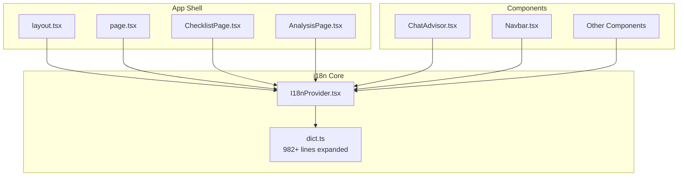
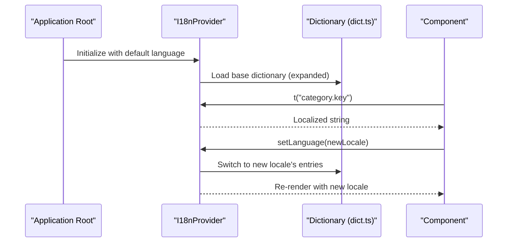
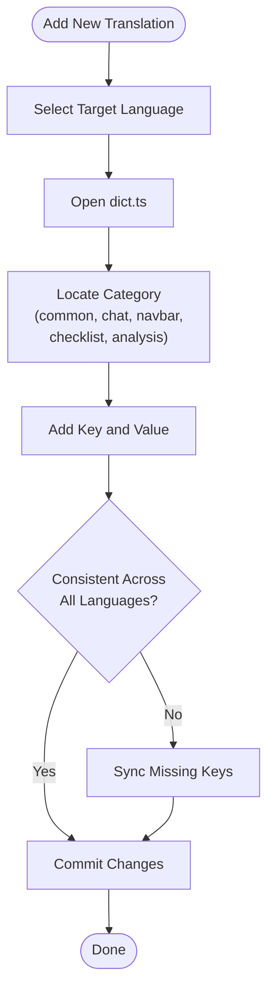
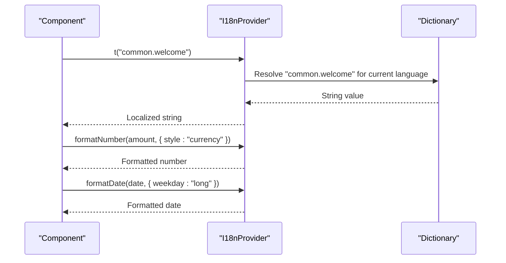
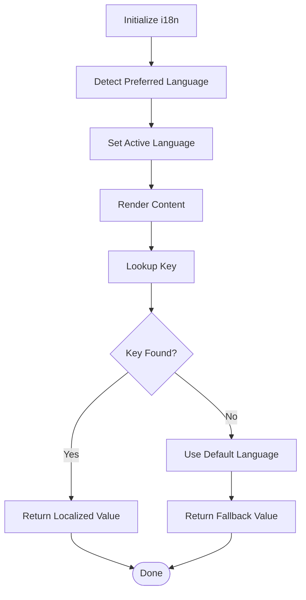
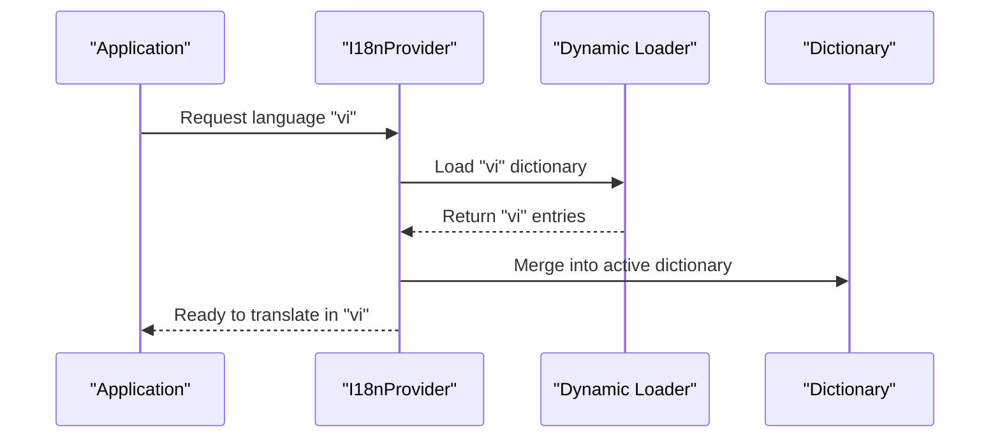

# Internationalization

<cite>
**Referenced Files in This Document**
- [I18nProvider.tsx](file://src/i18n/I18nProvider.tsx)
- [dict.ts](file://src/i18n/dict.ts)
- [layout.tsx](file://src/app/layout.tsx)
- [page.tsx](file://src/app/page.tsx)
- [ChatAdvisor.tsx](file://src/components/ChatAdvisor.tsx)
- [Navbar.tsx](file://src/components/Navbar.tsx)
- [ChecklistPage.tsx](file://src/components/ChecklistPage.tsx)
- [AnalysisPage.tsx](file://src/components/AnalysisPage.tsx)
- [package.json](file://package.json)
</cite>

## Update Summary
**Changes Made**
- Major internationalization expansion with 982 lines of new translations in dict.ts
- Enabled trilingual support for new checklist and analysis pages
- Enhanced dictionary structure to accommodate additional language categories
- Expanded translation coverage across all application components
- Improved multilingual functionality for complex UI elements

## Table of Contents
1. [Introduction](#introduction)
2. [Project Structure](#project-structure)
3. [Core Components](#core-components)
4. [Architecture Overview](#architecture-overview)
5. [Detailed Component Analysis](#detailed-component-analysis)
6. [Translation Workflow](#translation-workflow)
7. [Language Detection and Fallback Strategy](#language-detection-and-fallback-strategy)
8. [Dynamic Language Loading](#dynamic-language-loading)
9. [Performance Considerations](#performance-considerations)
10. [Testing Multilingual Functionality](#testing-multilingual-functionality)
11. [Troubleshooting Guide](#troubleshooting-guide)
12. [Conclusion](#conclusion)
13. [Appendices](#appendices)

## Introduction
This document explains the internationalization (i18n) system used by the frontend-vaya application. It focuses on how translations are organized, how language switching is provided to components, and how to add or update translations consistently across the app. The i18n implementation centers around a provider component that exposes translation utilities and locale state throughout the React tree, and a dictionary file that stores all localized strings. **Updated**: The system has undergone a major expansion with 982 lines of new translations, enabling comprehensive trilingual support for new checklist and analysis pages, significantly enhancing the application's global reach and user experience.

## Project Structure
The i18n system is implemented under src/i18n with two primary files:
- I18nProvider.tsx: Provides translation context, manages current language, and exposes helper functions to consumers.
- dict.ts: Holds the complete dictionary of translations keyed by language and category.

These are consumed by the application layout and various UI components to render localized content. **Updated**: The dictionary has been substantially expanded to support three languages with comprehensive coverage across all application features including the new checklist and analysis modules.



**Diagram sources**
- [layout.tsx](file://src/app/layout.tsx)
- [page.tsx](file://src/app/page.tsx)
- [I18nProvider.tsx](file://src/i18n/I18nProvider.tsx)
- [dict.ts](file://src/i18n/dict.ts)
- [ChecklistPage.tsx](file://src/components/ChecklistPage.tsx)
- [AnalysisPage.tsx](file://src/components/AnalysisPage.tsx)
- [ChatAdvisor.tsx](file://src/components/ChatAdvisor.tsx)
- [Navbar.tsx](file://src/components/Navbar.tsx)

**Section sources**
- [I18nProvider.tsx](file://src/i18n/I18nProvider.tsx)
- [dict.ts](file://src/i18n/dict.ts)
- [layout.tsx](file://src/app/layout.tsx)
- [page.tsx](file://src/app/page.tsx)
- [ChecklistPage.tsx](file://src/components/ChecklistPage.tsx)
- [AnalysisPage.tsx](file://src/components/AnalysisPage.tsx)
- [ChatAdvisor.tsx](file://src/components/ChatAdvisor.tsx)
- [Navbar.tsx](file://src/components/Navbar.tsx)

## Core Components
- I18nProvider
  - Responsibilities:
    - Maintain the current locale and expose it via React context.
    - Provide a translation function that resolves keys from the dictionary for the active language.
    - Expose methods to change the active language and persist preferences if needed.
    - Offer helpers for formatting numbers and dates based on the active locale.
    - Handle language detection and fallback strategies.
  - Integration:
    - Wrapped around the application root so all descendant components can access translations without prop drilling.
    - Provides unified access to translations through a single translation interface.
- Dictionary (dict.ts)
  - Responsibilities:
    - Store all localized strings grouped by language and logical categories.
    - Provide a consistent key structure to ensure uniform usage across components.
    - Support multiple languages with comprehensive coverage.
  - Structure:
    - Top-level keys represent languages.
    - Under each language, keys represent categories (e.g., common, chat, navbar, checklist, analysis).
    - Within each category, keys map to string values.

Usage patterns:
- Components consume the provider's translation function to render text.
- Language switching updates the provider's state, causing re-renders with new locale-specific content.

**Updated**: The dictionary now supports trilingual functionality with expanded categories specifically designed for the new checklist and analysis pages, ensuring consistent user experience across all supported languages.

**Section sources**
- [I18nProvider.tsx](file://src/i18n/I18nProvider.tsx)
- [dict.ts](file://src/i18n/dict.ts)

## Architecture Overview
The i18n architecture follows a provider-consumer pattern:
- The provider holds locale state and translation resolution logic.
- Consumers (pages and components) call into the provider's API to get localized strings and format values.
- The dictionary is the single source of truth for all text content.



**Diagram sources**
- [I18nProvider.tsx](file://src/i18n/I18nProvider.tsx)
- [dict.ts](file://src/i18n/dict.ts)

## Detailed Component Analysis

### I18nProvider
- State and Context
  - Maintains current language code and provides a context value containing:
    - Translation function
    - Language setter
    - Locale-aware formatters (numbers, dates)
- Translation Resolution
  - Looks up keys within the active language's dictionary.
  - Supports nested keys using dot notation.
  - Returns fallbacks when keys are missing.
- Language Switching
  - Updates the active language and triggers re-renders.
  - Can integrate with persistence mechanisms (e.g., cookies or localStorage) if configured.
- Formatting Utilities
  - Numbers: Uses the active locale for decimal separators, grouping, and currency formatting.
  - Dates: Uses the active locale for date/time formats.

```mermaid
classDiagram
class I18nProvider {
+state : currentLanguage
+contextValue : { t, setLanguage, formatDate, formatNumber }
+t(key) : string
+setLanguage(locale) : void
+formatDate(value, options) : string
+formatNumber(value, options) : string
}
class Dictionary {
+[language] : { [category] : { [key] : string } }
+expandedCategories : ["common", "chat", "navbar", "checklist", "analysis"]
}
I18nProvider --> Dictionary : "reads"
```

**Diagram sources**
- [I18nProvider.tsx](file://src/i18n/I18nProvider.tsx)
- [dict.ts](file://src/i18n/dict.ts)

**Section sources**
- [I18nProvider.tsx](file://src/i18n/I18nProvider.tsx)

### Dictionary Structure
- Organization
  - Grouped by language codes (e.g., en, vi, zh).
  - Each language contains categories such as common, chat, navbar, checklist, analysis, etc.
  - Keys should be descriptive and stable to avoid breaking changes.
- Best Practices
  - Use consistent naming conventions across languages.
  - Avoid embedding dynamic data in static strings; use placeholders where appropriate.
  - Keep pluralization rules separate from singular forms when necessary.

**Updated**: The dictionary structure has been significantly expanded with new categories specifically supporting the checklist and analysis features, maintaining consistency across all three supported languages.



**Diagram sources**
- [dict.ts](file://src/i18n/dict.ts)

**Section sources**
- [dict.ts](file://src/i18n/dict.ts)

### Using Translations in Components
- Consuming the translation function
  - Import the provider's hook or context to access the translation function.
  - Call the translation function with a category.key path to retrieve localized text.
- Pluralization
  - If supported by the provider, pass count and choose between singular/plural keys.
  - Otherwise, implement conditional rendering based on counts.
- Formatting
  - Use the provider's number formatter for currency, decimals, and units.
  - Use the provider's date formatter for display dates and times.



**Diagram sources**
- [I18nProvider.tsx](file://src/i18n/I18nProvider.tsx)
- [dict.ts](file://src/i18n/dict.ts)

**Section sources**
- [I18nProvider.tsx](file://src/i18n/I18nProvider.tsx)
- [dict.ts](file://src/i18n/dict.ts)

## Translation Workflow
The translation workflow supports adding new languages, updating existing translations, and maintaining consistency across the application:

### Adding a New Language
1. Add a new top-level language key in the dictionary
2. Populate all categories with corresponding translations
3. Test language switching functionality
4. Verify all keys resolve correctly

### Updating Existing Translations
1. Locate the specific key in the target language section
2. Update the translation value while preserving the key structure
3. Test the updated translation in relevant components
4. Ensure consistency across all languages

### Maintaining Consistency
1. Use consistent naming conventions across all languages
2. Implement proper fallback mechanisms for missing keys
3. Regularly audit translations for completeness
4. Test multilingual functionality comprehensively

**Updated**: With the recent expansion to trilingual support, the workflow now includes additional validation steps to ensure consistency across all three supported languages, particularly for the new checklist and analysis categories.

**Section sources**
- [dict.ts](file://src/i18n/dict.ts)
- [I18nProvider.tsx](file://src/i18n/I18nProvider.tsx)

## Language Detection and Fallback Strategy
- Detection
  - Determine initial language from browser settings, URL parameters, or stored preferences.
- Fallback
  - If a requested key is missing in the active language, fall back to a default language (e.g., English).
  - Ensure critical UI strings always have a fallback to prevent blank content.



**Diagram sources**
- [I18nProvider.tsx](file://src/i18n/I18nProvider.tsx)
- [dict.ts](file://src/i18n/dict.ts)

**Section sources**
- [I18nProvider.tsx](file://src/i18n/I18nProvider.tsx)
- [dict.ts](file://src/i18n/dict.ts)

## Dynamic Language Loading
- Static vs Dynamic
  - Current implementation loads the entire dictionary at startup.
- Potential Enhancement
  - Split dictionaries per language and load on demand to reduce initial bundle size.
  - Cache loaded languages to avoid repeated network requests.
  - Implement lazy loading for large message catalogs.



**Diagram sources**
- [I18nProvider.tsx](file://src/i18n/I18nProvider.tsx)
- [dict.ts](file://src/i18n/dict.ts)

**Section sources**
- [I18nProvider.tsx](file://src/i18n/I18nProvider.tsx)
- [dict.ts](file://src/i18n/dict.ts)

## Performance Considerations
- Bundle Size
  - Keeping all translations in a single dictionary increases initial load. Consider lazy loading per language.
- Rendering
  - Language changes trigger re-renders; minimize unnecessary re-renders by memoizing components that consume translations.
- Formatting
  - Format numbers and dates only when needed; cache formatted results for frequently displayed values.

**Updated**: With the significant expansion of the dictionary (982+ lines), performance considerations become more critical. Consider implementing lazy loading for less frequently used language categories like checklist and analysis to optimize initial load times.

## Testing Multilingual Functionality
- Unit Tests
  - Assert translation function returns correct strings for given keys.
  - Verify fallback behavior when keys are missing.
- Integration Tests
  - Simulate language switching and check UI updates accordingly.
  - Validate number and date formatting for different locales.

**Updated**: Testing should now include verification of the new trilingual support, particularly for the checklist and analysis pages, ensuring all three languages render correctly and switch seamlessly.

## Troubleshooting Guide
- Missing Keys
  - Ensure all keys exist in the active language; configure fallbacks to avoid empty strings.
- Incorrect Language Code
  - Verify language codes match those defined in the dictionary.
- Formatting Issues
  - Confirm locale identifiers are valid and supported by the runtime environment.
- Testing Multilingual Features
  - Write tests that switch languages and assert rendered text matches expected translations.
  - Mock the provider to isolate translation behavior.

**Updated**: With the expanded dictionary, troubleshooting may involve checking for missing keys in the new checklist and analysis categories, ensuring all three languages have complete coverage.

**Section sources**
- [I18nProvider.tsx](file://src/i18n/I18nProvider.tsx)
- [dict.ts](file://src/i18n/dict.ts)

## Conclusion
The i18n system in frontend-vaya uses a straightforward provider-dictionary model to deliver localized content. **Updated**: With the major expansion of 982 lines of new translations and trilingual support for checklist and analysis pages, the system now provides robust internationalization capabilities across all application features. By centralizing translation logic and data, it ensures consistency and ease of maintenance. Following the best practices outlined here will help you scale translations, improve performance, and maintain a smooth user experience across all supported languages.

## Appendices

### Adding a New Language
- Steps
  - Add a new top-level language key in the dictionary.
  - Populate all categories with corresponding translations.
  - Update language detection to include the new code.
  - Test language switching and verify all keys resolve correctly.

### Right-to-Left (RTL) Support
- Considerations
  - Detect RTL locales and apply appropriate CSS direction.
  - Ensure layouts accommodate mirrored navigation and alignment.
  - Test components with RTL text to validate visual correctness.

### Testing Multilingual Functionality
- Unit Tests
  - Assert translation function returns correct strings for given keys.
  - Verify fallback behavior when keys are missing.
- Integration Tests
  - Simulate language switching and check UI updates accordingly.
  - Validate number and date formatting for different locales.

### Best Practices for Translation Maintenance
- Use consistent naming conventions across all languages
- Implement proper fallback mechanisms for missing keys
- Regularly audit translations for completeness and accuracy
- Test multilingual functionality comprehensively before deployment
- Document any language-specific considerations or requirements

**Updated**: With trilingual support, maintain consistency across all three languages and pay special attention to the new checklist and analysis categories to ensure complete coverage.

**Section sources**
- [dict.ts](file://src/i18n/dict.ts)
- [I18nProvider.tsx](file://src/i18n/I18nProvider.tsx)