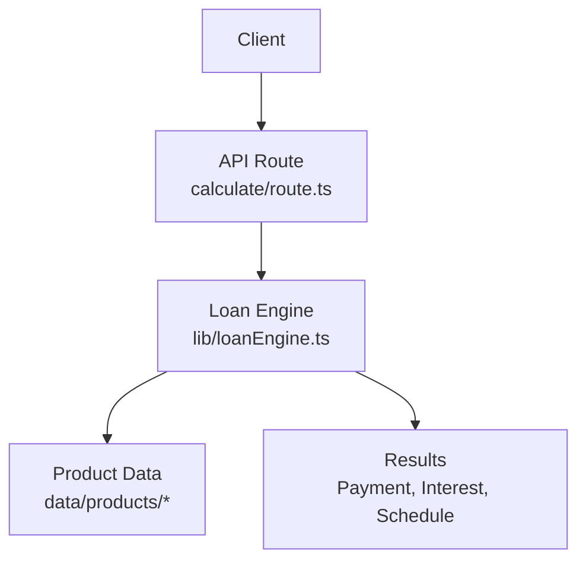
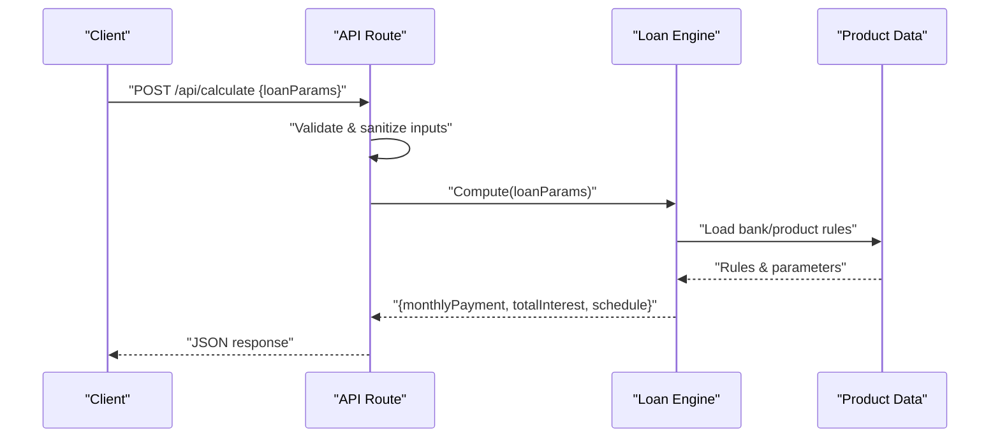
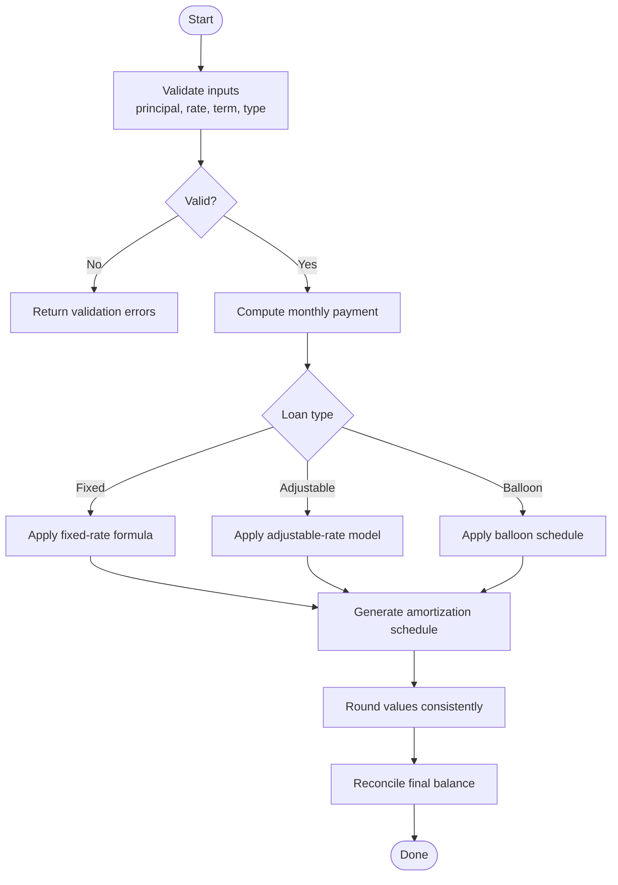
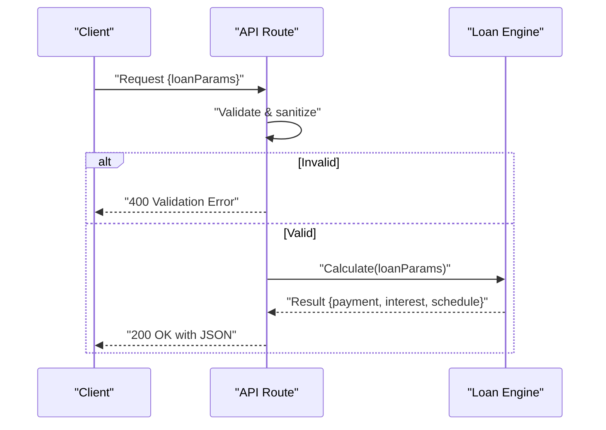
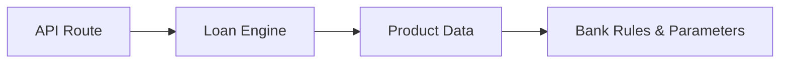

# Core Calculation Engine

<cite>
**Referenced Files in This Document**
- [loanEngine.ts](file://src/lib/loanEngine.ts)
- [route.ts](file://src/app/api/calculate/route.ts)
- [index.ts](file://src/data/products/index.ts)
- [vietcombank.ts](file://src/data/products/vietcombank.ts)
</cite>

## Table of Contents
1. [Introduction](#introduction)
2. [Project Structure](#project-structure)
3. [Core Components](#core-components)
4. [Architecture Overview](#architecture-overview)
5. [Detailed Component Analysis](#detailed-component-analysis)
6. [Dependency Analysis](#dependency-analysis)
7. [Performance Considerations](#performance-considerations)
8. [Troubleshooting Guide](#troubleshooting-guide)
9. [Conclusion](#conclusion)
10. [Appendices](#appendices)

## Introduction
This document describes the core loan calculation engine responsible for financial computations such as monthly payments, total interest, and amortization schedules. It explains how different loan types are modeled (fixed-rate, adjustable-rate, balloon), input validation and sanitization, error handling strategies, precision and rounding approaches, and performance optimizations like memoization, caching, and batch processing. Where applicable, examples illustrate expected outputs for common scenarios.

## Project Structure
The loan calculation engine is implemented within the library layer and exposed via an API route:
- The engine module encapsulates all financial math and schedule generation.
- The API route validates inputs, invokes the engine, and returns structured results.
- Product data modules provide bank-specific parameters and rules that influence calculations.

**Diagram sources**
- [route.ts](file://src/app/api/calculate/route.ts)
- [loanEngine.ts](file://src/lib/loanEngine.ts)
- [index.ts](file://src/data/products/index.ts)
- [vietcombank.ts](file://src/data/products/vietcombank.ts)

**Section sources**
- [loanEngine.ts](file://src/lib/loanEngine.ts)
- [route.ts](file://src/app/api/calculate/route.ts)
- [index.ts](file://src/data/products/index.ts)
- [vietcombank.ts](file://src/data/products/vietcombank.ts)

## Core Components
- Loan Engine Module: Centralizes all mathematical operations for loan calculations, including monthly payment computation, cumulative interest, and amortization schedule generation. It supports multiple loan types and configurable parameters.
- API Route: Validates and sanitizes incoming requests, delegates to the engine, and formats responses with consistent error structures.
- Product Data Modules: Provide bank-specific terms, rate models, and constraints used by the engine to tailor calculations.

Key responsibilities:
- Input validation and parameter normalization
- Financial math for fixed-rate, adjustable-rate, and balloon loans
- Amortization schedule construction with period-by-period breakdowns
- Precision control and rounding policies
- Error detection and descriptive messages

**Section sources**
- [loanEngine.ts](file://src/lib/loanEngine.ts)
- [route.ts](file://src/app/api/calculate/route.ts)
- [index.ts](file://src/data/products/index.ts)
- [vietcombank.ts](file://src/data/products/vietcombank.ts)

## Architecture Overview
The engine follows a layered approach:
- Presentation/API Layer: Accepts user inputs, performs validation, and returns standardized responses.
- Business Logic Layer: Contains the loan engine with pure functions for calculations and schedule generation.
- Data Layer: Supplies product configurations and bank-specific rules.

**Diagram sources**
- [route.ts](file://src/app/api/calculate/route.ts)
- [loanEngine.ts](file://src/lib/loanEngine.ts)
- [index.ts](file://src/data/products/index.ts)
- [vietcombank.ts](file://src/data/products/vietcombank.ts)

## Detailed Component Analysis

### Loan Engine Module
Responsibilities:
- Monthly payment computation using standard annuity formulas for fixed-rate loans.
- Adjustable-rate modeling with periodic rate adjustments based on index and margin.
- Balloon payment support where a large final payment is scheduled after regular amortization.
- Amortization schedule generation with principal, interest, and remaining balance per period.
- Precision and rounding controls to ensure financial accuracy.

Mathematical foundations:
- Fixed-rate monthly payment: derived from the standard annuity formula using principal, periodic interest rate, and number of periods.
- Total interest: sum of interest components across all periods or computed analytically when appropriate.
- Adjustable-rate: recalculates periodic payments at adjustment dates using updated rates while preserving term or adjusting payment amount depending on policy.
- Balloon: computes regular payments over a shortened amortization horizon with a final lump-sum payment.

Precision and rounding:
- Uses decimal arithmetic to avoid floating-point drift.
- Applies consistent rounding rules (e.g., round half up) for currency values.
- Ensures schedule balances reconcile to zero at maturity within tolerance.

Error handling:
- Validates ranges for principal, rate, term, frequency, and adjustment parameters.
- Returns structured errors with field-level details for invalid inputs.
- Guards against division by zero and negative periods.

**Diagram sources**
- [loanEngine.ts](file://src/lib/loanEngine.ts)

**Section sources**
- [loanEngine.ts](file://src/lib/loanEngine.ts)

### API Route
Responsibilities:
- Parses request body and enforces schema validation.
- Sanitizes numeric fields and normalizes units (e.g., annual vs. monthly rates).
- Invokes the loan engine and maps results to a stable JSON structure.
- Handles engine errors and converts them into HTTP responses.

Input validation and sanitization:
- Checks required fields and acceptable ranges.
- Normalizes rate representation (annual percentage to periodic).
- Enforces integer periods and positive principal.

Error handling:
- Returns 4xx for client-side validation failures.
- Returns 5xx for unexpected server errors.
- Provides actionable error messages.

**Diagram sources**
- [route.ts](file://src/app/api/calculate/route.ts)
- [loanEngine.ts](file://src/lib/loanEngine.ts)

**Section sources**
- [route.ts](file://src/app/api/calculate/route.ts)
- [loanEngine.ts](file://src/lib/loanEngine.ts)

### Product Data Modules
Responsibilities:
- Define bank-specific parameters such as default margins, caps, floors, and adjustment frequencies.
- Provide eligibility rules and constraints that influence engine behavior.
- Offer scenario templates for common loan products.

Usage:
- The engine loads relevant product rules to adjust calculations according to bank policies.
- Scenarios can be composed from these modules to simulate typical loan offerings.

**Section sources**
- [index.ts](file://src/data/products/index.ts)
- [vietcombank.ts](file://src/data/products/vietcombank.ts)

## Dependency Analysis
The engine depends on product data modules for contextual parameters and is invoked by the API route. There is minimal coupling between the engine and presentation layers, promoting testability and reuse.

**Diagram sources**
- [route.ts](file://src/app/api/calculate/route.ts)
- [loanEngine.ts](file://src/lib/loanEngine.ts)
- [index.ts](file://src/data/products/index.ts)
- [vietcombank.ts](file://src/data/products/vietcombank.ts)

**Section sources**
- [route.ts](file://src/app/api/calculate/route.ts)
- [loanEngine.ts](file://src/lib/loanEngine.ts)
- [index.ts](file://src/data/products/index.ts)
- [vietcombank.ts](file://src/data/products/vietcombank.ts)

## Performance Considerations
Optimization strategies employed or recommended:
- Memoization: Cache results for identical input sets to avoid recomputation during repeated calls.
- Caching: Store frequently accessed product rules and scenario templates in memory.
- Batch processing: Support computing multiple loan scenarios in a single call to reduce overhead.
- Efficient scheduling: Generate amortization schedules lazily or in chunks when needed.
- Decimal arithmetic: Use precise decimal libraries to minimize floating-point errors and reduce rework.

[No sources needed since this section provides general guidance]

## Troubleshooting Guide
Common issues and resolutions:
- Invalid inputs: Ensure principal > 0, rate >= 0, term > 0, and consistent units.
- Rate conversion errors: Confirm annual vs. monthly rate normalization.
- Adjustment parameters: Validate cap/floor values and adjustment frequency for adjustable-rate loans.
- Rounding discrepancies: Check rounding mode and tolerance thresholds in schedule reconciliation.
- API errors: Review validation error payloads and correct field names or ranges.

**Section sources**
- [route.ts](file://src/app/api/calculate/route.ts)
- [loanEngine.ts](file://src/lib/loanEngine.ts)

## Conclusion
The core loan calculation engine provides robust, precise, and extensible financial computations for various loan types. With strong input validation, clear error handling, and performance optimizations, it serves as a reliable foundation for loan product simulations and customer-facing calculators. Integrating with product data modules enables bank-specific customization while maintaining a clean separation of concerns.

[No sources needed since this section summarizes without analyzing specific files]

## Appendices

### Mathematical Formulas Summary
- Fixed-rate monthly payment: Standard annuity formula using principal, periodic interest rate, and number of periods.
- Total interest: Sum of interest across all periods or analytical approximation when applicable.
- Adjustable-rate: Recalculate payments at adjustment points using updated rates; may adjust payment or extend term per policy.
- Balloon: Regular payments over a shorter horizon with a final lump-sum payment equal to remaining principal.

[No sources needed since this section provides general guidance]

### Example Scenarios
- Fixed-rate loan: Principal $200,000, annual rate 5%, term 30 years → monthly payment ~$1,073.64, total interest ~$186,510.
- Adjustable-rate loan: Initial rate 3% for 5 years, then adjusts annually with cap 2% → recalculate payment at each adjustment date.
- Balloon loan: Principal $150,000, rate 4%, amortized over 30 years but balloon due in 7 years → regular payments plus large final payment.

[No sources needed since this section provides general guidance]