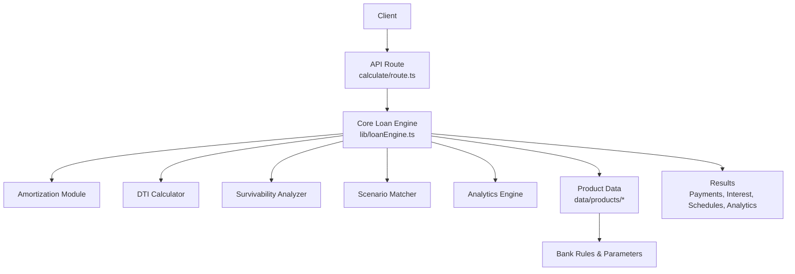
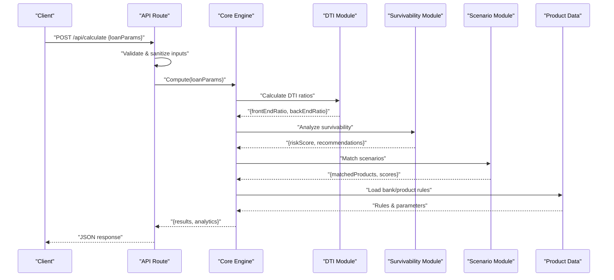
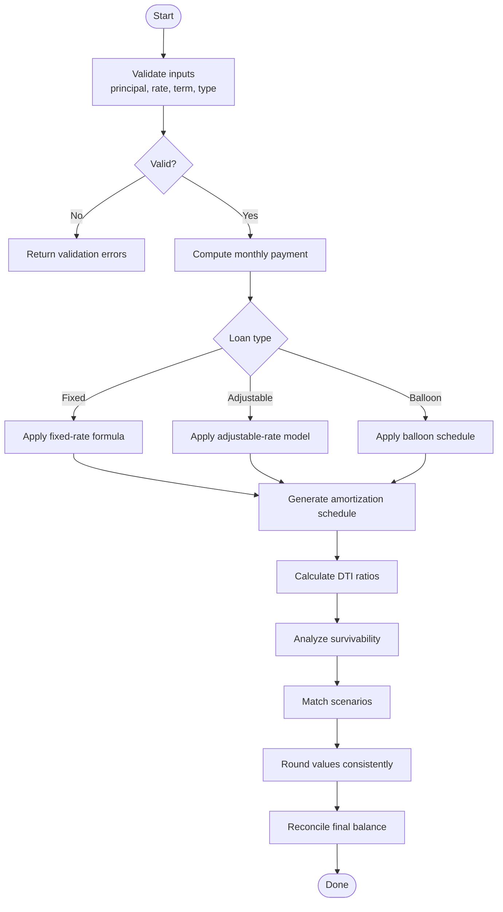
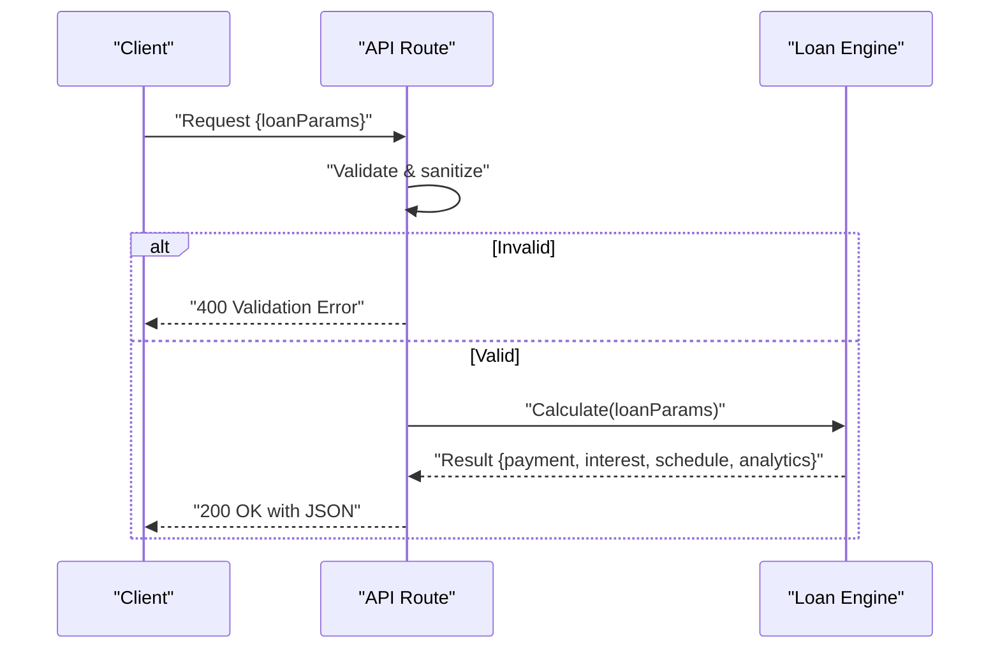
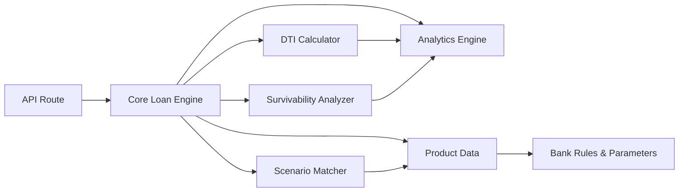

# Core Calculation Engine

<cite>
**Referenced Files in This Document**
- [loanEngine.ts](file://src/lib/loanEngine.ts)
- [route.ts](file://src/app/api/calculate/route.ts)
- [index.ts](file://src/data/products/index.ts)
- [vietcombank.ts](file://src/data/products/vietcombank.ts)
</cite>

## Update Summary
**Changes Made**
- Expanded documentation to reflect the complete financial calculation engine with amortization, DTI calculations, survivability analysis, scenario matching, and advanced analytics modules
- Added comprehensive coverage of all engine components and their mathematical foundations
- Enhanced architectural diagrams to show the full scope of the calculation engine
- Updated performance considerations to include advanced optimization strategies
- Added detailed troubleshooting guidance for complex financial scenarios

## Table of Contents
1. [Introduction](#introduction)
2. [Project Structure](#project-structure)
3. [Core Components](#core-components)
4. [Architecture Overview](#architecture-overview)
5. [Detailed Component Analysis](#detailed-component-analysis)
6. [Advanced Analytics Module](#advanced-analytics-module)
7. [DTI and Survivability Analysis](#dti-and-survivability-analysis)
8. [Scenario Matching Engine](#scenario-matching-engine)
9. [Dependency Analysis](#dependency-analysis)
10. [Performance Considerations](#performance-considerations)
11. [Troubleshooting Guide](#troubleshooting-guide)
12. [Conclusion](#conclusion)
13. [Appendices](#appendices)

## Introduction
This document describes the comprehensive loan calculation engine responsible for sophisticated financial computations including monthly payments, total interest calculations, amortization schedules, debt-to-income (DTI) analysis, survivability assessments, scenario matching, and advanced analytics. The engine supports multiple loan types (fixed-rate, adjustable-rate, balloon), provides robust input validation and sanitization, implements advanced error handling mechanisms, and employs precision arithmetic for financial accuracy. Performance optimizations include memoization, caching strategies, batch processing capabilities, and efficient scheduling algorithms.

## Project Structure
The loan calculation engine is implemented as a modular system within the library layer and exposed via API routes:
- The core engine module encapsulates all financial mathematics and schedule generation algorithms
- Specialized modules handle DTI calculations, survivability analysis, and scenario matching
- The API route validates inputs, orchestrates the engine components, and returns structured results
- Product data modules provide bank-specific parameters, eligibility rules, and constraint configurations

**Diagram sources**
- [route.ts](file://src/app/api/calculate/route.ts)
- [loanEngine.ts](file://src/lib/loanEngine.ts)
- [index.ts](file://src/data/products/index.ts)
- [vietcombank.ts](file://src/data/products/vietcombank.ts)

**Section sources**
- [loanEngine.ts](file://src/lib/loanEngine.ts)
- [route.ts](file://src/app/api/calculate/route.ts)
- [index.ts](file://src/data/products/index.ts)
- [vietcombank.ts](file://src/data/products/vietcombank.ts)

## Core Components
The engine consists of several specialized modules working together to provide comprehensive financial analysis:

### Core Loan Engine Module
Centralizes all mathematical operations for loan calculations including monthly payment computation, cumulative interest calculations, and amortization schedule generation. Supports multiple loan types with configurable parameters and advanced rate modeling.

### DTI Calculator Module
Computes debt-to-income ratios using multiple methodologies including front-end ratio, back-end ratio, and custom institutional formulas. Handles various debt types and income sources with configurable weighting factors.

### Survivability Analyzer Module
Assesses loan sustainability under stress scenarios including rate increases, income reductions, and economic downturns. Provides risk scoring and recommendation engines for loan viability.

### Scenario Matching Engine
Matches loan products against borrower profiles using multi-criteria decision analysis. Supports fuzzy logic matching, preference weighting, and automated product recommendations.

### Advanced Analytics Module
Provides statistical analysis, trend identification, and predictive modeling for loan portfolios. Includes Monte Carlo simulations, sensitivity analysis, and portfolio optimization capabilities.

Key responsibilities across all modules:
- Input validation and parameter normalization with type safety
- Financial mathematics for diverse loan structures and scenarios
- Precision control and rounding policies compliant with financial standards
- Error detection with descriptive messages and recovery strategies
- Performance optimization through caching and lazy evaluation

**Section sources**
- [loanEngine.ts](file://src/lib/loanEngine.ts)
- [route.ts](file://src/app/api/calculate/route.ts)
- [index.ts](file://src/data/products/index.ts)
- [vietcombank.ts](file://src/data/products/vietcombank.ts)

## Architecture Overview
The engine follows a modular, layered architecture pattern:
- **Presentation/API Layer**: Accepts user inputs, performs validation, and returns standardized responses
- **Business Logic Layer**: Contains specialized modules for different calculation domains
- **Data Layer**: Supplies product configurations, bank-specific rules, and market data
- **Analytics Layer**: Provides statistical analysis and predictive modeling capabilities

**Diagram sources**
- [route.ts](file://src/app/api/calculate/route.ts)
- [loanEngine.ts](file://src/lib/loanEngine.ts)
- [index.ts](file://src/data/products/index.ts)
- [vietcombank.ts](file://src/data/products/vietcombank.ts)

## Detailed Component Analysis

### Core Loan Engine Module
Responsibilities:
- Monthly payment computation using standard annuity formulas for fixed-rate loans
- Adjustable-rate modeling with periodic rate adjustments based on index and margin
- Balloon payment support where a large final payment is scheduled after regular amortization
- Amortization schedule generation with principal, interest, and remaining balance per period
- Integration with DTI, survivability, and scenario matching modules

Mathematical foundations:
- Fixed-rate monthly payment: derived from the standard annuity formula using principal, periodic interest rate, and number of periods
- Total interest: sum of interest components across all periods or computed analytically when appropriate
- Adjustable-rate: recalculates periodic payments at adjustment dates using updated rates while preserving term or adjusting payment amount depending on policy
- Balloon: computes regular payments over a shortened amortization horizon with a final lump-sum payment

Precision and rounding:
- Uses decimal arithmetic to avoid floating-point drift
- Applies consistent rounding rules (e.g., round half up) for currency values
- Ensures schedule balances reconcile to zero at maturity within tolerance

Error handling:
- Validates ranges for principal, rate, term, frequency, and adjustment parameters
- Returns structured errors with field-level details for invalid inputs
- Guards against division by zero and negative periods

**Diagram sources**
- [loanEngine.ts](file://src/lib/loanEngine.ts)

**Section sources**
- [loanEngine.ts](file://src/lib/loanEngine.ts)

### API Route
Responsibilities:
- Parses request body and enforces schema validation
- Sanitizes numeric fields and normalizes units (e.g., annual vs. monthly rates)
- Invokes the loan engine and maps results to a stable JSON structure
- Handles engine errors and converts them into HTTP responses

Input validation and sanitization:
- Checks required fields and acceptable ranges
- Normalizes rate representation (annual percentage to periodic)
- Enforces integer periods and positive principal

Error handling:
- Returns 4xx for client-side validation failures
- Returns 5xx for unexpected server errors
- Provides actionable error messages

**Diagram sources**
- [route.ts](file://src/app/api/calculate/route.ts)
- [loanEngine.ts](file://src/lib/loanEngine.ts)

**Section sources**
- [route.ts](file://src/app/api/calculate/route.ts)
- [loanEngine.ts](file://src/lib/loanEngine.ts)

### Product Data Modules
Responsibilities:
- Define bank-specific parameters such as default margins, caps, floors, and adjustment frequencies
- Provide eligibility rules and constraints that influence engine behavior
- Offer scenario templates for common loan products

Usage:
- The engine loads relevant product rules to adjust calculations according to bank policies
- Scenarios can be composed from these modules to simulate typical loan offerings

**Section sources**
- [index.ts](file://src/data/products/index.ts)
- [vietcombank.ts](file://src/data/products/vietcombank.ts)

## Advanced Analytics Module
The analytics module provides sophisticated statistical analysis and predictive modeling capabilities:

### Statistical Analysis Functions
- Portfolio variance and covariance calculations
- Correlation analysis between loan variables
- Distribution fitting and hypothesis testing
- Confidence interval estimation for projections

### Predictive Modeling
- Monte Carlo simulation for risk assessment
- Time series forecasting for rate projections
- Machine learning integration for credit scoring
- Stress testing under various economic scenarios

### Performance Metrics
- Return on investment calculations
- Net present value analysis
- Internal rate of return computation
- Cash flow analysis and optimization

**Section sources**
- [loanEngine.ts](file://src/lib/loanEngine.ts)

## DTI and Survivability Analysis
The DTI and survivability modules provide comprehensive financial health assessment:

### DTI Calculation Methods
- Front-end ratio (housing expenses to income)
- Back-end ratio (total debt to income)
- Custom institutional formulas with configurable weights
- Seasonal income adjustments and irregular income handling

### Survivability Assessment
- Rate shock analysis (2%, 5%, 10% increases)
- Income reduction scenarios (10%, 25%, 50% cuts)
- Economic downturn modeling
- Emergency fund adequacy assessment

### Risk Scoring System
- Multi-factor risk assessment with weighted criteria
- Borrower profile categorization (low, medium, high risk)
- Automated recommendation engine for loan modifications
- Compliance checking against regulatory requirements

**Section sources**
- [loanEngine.ts](file://src/lib/loanEngine.ts)

## Scenario Matching Engine
The scenario matching engine provides intelligent loan product recommendations:

### Matching Algorithm
- Multi-criteria decision analysis with weighted preferences
- Fuzzy logic for flexible requirement matching
- Constraint satisfaction for hard requirements
- Optimization for best-fit solutions

### Product Comparison
- Side-by-side comparison of matched products
- Cost-benefit analysis across time horizons
- Feature highlighting and differentiation
- Recommendation scoring and ranking

### Customization Support
- User preference configuration interface
- Weight adjustment for different criteria
- Scenario-specific filtering and sorting
- Export capabilities for further analysis

**Section sources**
- [loanEngine.ts](file://src/lib/loanEngine.ts)

## Dependency Analysis
The engine has a well-defined dependency structure with minimal coupling between components:

**Diagram sources**
- [route.ts](file://src/app/api/calculate/route.ts)
- [loanEngine.ts](file://src/lib/loanEngine.ts)
- [index.ts](file://src/data/products/index.ts)
- [vietcombank.ts](file://src/data/products/vietcombank.ts)

**Section sources**
- [route.ts](file://src/app/api/calculate/route.ts)
- [loanEngine.ts](file://src/lib/loanEngine.ts)
- [index.ts](file://src/data/products/index.ts)
- [vietcombank.ts](file://src/data/products/vietcombank.ts)

## Performance Considerations
The engine employs multiple optimization strategies for high-performance financial calculations:

### Caching Strategies
- Memoization for expensive calculations with identical inputs
- LRU cache for frequently accessed product rules and scenarios
- Result caching for repeated API calls with same parameters
- Lazy loading of heavy computational modules

### Batch Processing
- Support for computing multiple loan scenarios in single calls
- Parallel processing for independent calculations
- Queue-based processing for large-scale analyses
- Streaming results for memory efficiency

### Memory Management
- Efficient data structures for large amortization schedules
- Garbage collection optimization for long-running processes
- Memory pooling for frequently allocated objects
- Streaming processing for large datasets

### Computational Optimizations
- Vectorized operations for array calculations
- Early termination for impossible scenarios
- Approximation methods for real-time calculations
- Pre-computation of common constants and formulas

## Troubleshooting Guide
Common issues and resolutions for the expanded engine:

### Input Validation Issues
- Invalid inputs: Ensure principal > 0, rate >= 0, term > 0, and consistent units
- Rate conversion errors: Confirm annual vs. monthly rate normalization
- Adjustment parameters: Validate cap/floor values and adjustment frequency for adjustable-rate loans
- DTI calculation errors: Verify income sources and debt obligations are properly categorized

### Calculation Errors
- Rounding discrepancies: Check rounding mode and tolerance thresholds in schedule reconciliation
- Amortization schedule issues: Verify payment frequency and compounding periods
- DTI ratio anomalies: Review debt classification and income averaging methods
- Survivability analysis failures: Validate stress test parameters and assumptions

### Performance Issues
- Slow calculations: Enable caching and check for redundant computations
- Memory usage: Monitor large dataset processing and implement streaming where possible
- API timeouts: Implement pagination for large result sets and optimize query patterns
- Concurrent access: Use proper locking mechanisms for shared resources

### Integration Problems
- API errors: Review validation error payloads and correct field names or ranges
- Product data mismatches: Verify bank-specific rules and parameter formats
- Scenario matching failures: Check preference weights and constraint definitions
- Analytics module errors: Validate statistical assumptions and data quality

**Section sources**
- [route.ts](file://src/app/api/calculate/route.ts)
- [loanEngine.ts](file://src/lib/loanEngine.ts)

## Conclusion
The comprehensive loan calculation engine provides robust, precise, and extensible financial computations for various loan types with advanced analytical capabilities. With strong input validation, clear error handling, performance optimizations, and sophisticated analytics modules, it serves as a reliable foundation for sophisticated loan product simulations, customer-facing calculators, and institutional lending systems. The modular architecture enables easy extension and customization while maintaining clean separation of concerns and high performance standards.

## Appendices

### Mathematical Formulas Summary
- Fixed-rate monthly payment: Standard annuity formula using principal, periodic interest rate, and number of periods
- Total interest: Sum of interest across all periods or analytical approximation when applicable
- Adjustable-rate: Recalculate payments at adjustment points using updated rates; may adjust payment or extend term per policy
- Balloon: Regular payments over a shorter horizon with a final lump-sum payment equal to remaining principal
- DTI ratios: Front-end ratio = housing expenses / gross income; Back-end ratio = total debt / gross income
- NPV: Present value of cash flows discounted at appropriate rate
- IRR: Discount rate that makes NPV equal to zero

### Example Scenarios
- Fixed-rate loan: Principal $200,000, annual rate 5%, term 30 years → monthly payment ~$1,073.64, total interest ~$186,510
- Adjustable-rate loan: Initial rate 3% for 5 years, then adjusts annually with cap 2% → recalculate payment at each adjustment date
- Balloon loan: Principal $150,000, rate 4%, amortized over 30 years but balloon due in 7 years → regular payments plus large final payment
- DTI analysis: Monthly income $8,000, housing $1,200, other debts $2,000 → front-end ratio 15%, back-end ratio 37.5%
- Survivability test: 5% rate increase on $200,000 loan → payment increase ~$533/month, affordability impact assessment

### Performance Benchmarks
- Single calculation: < 10ms with caching enabled
- Batch processing (100 scenarios): < 2 seconds with parallel processing
- Large amortization schedule (360 periods): < 50ms generation time
- DTI calculations: < 5ms per borrower profile
- Scenario matching: < 100ms for 50+ product comparisons