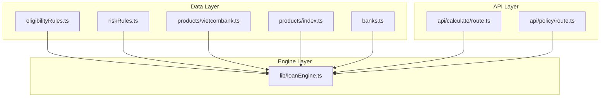
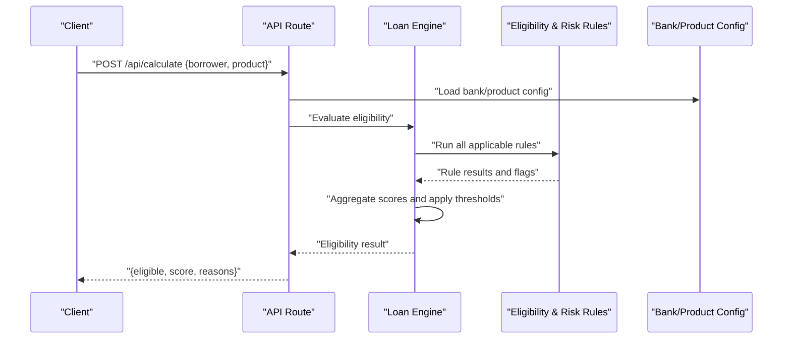
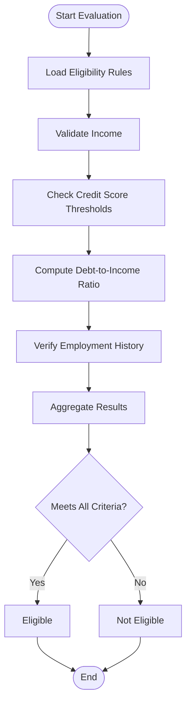
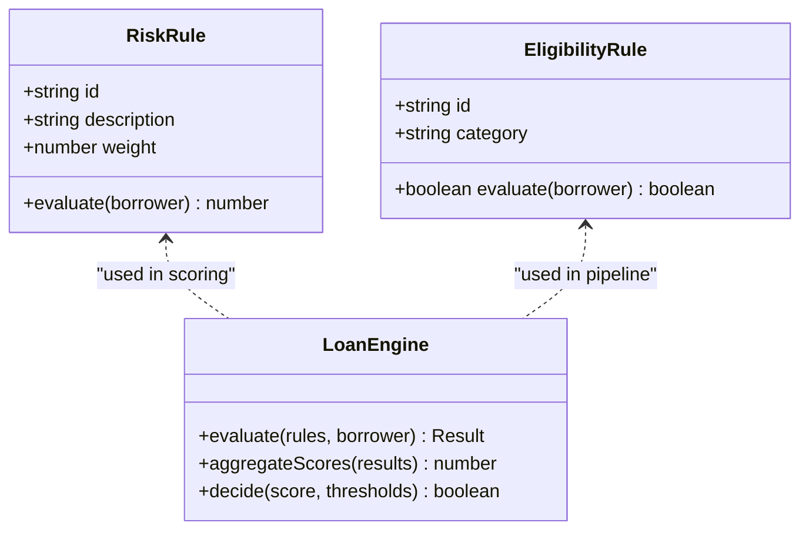
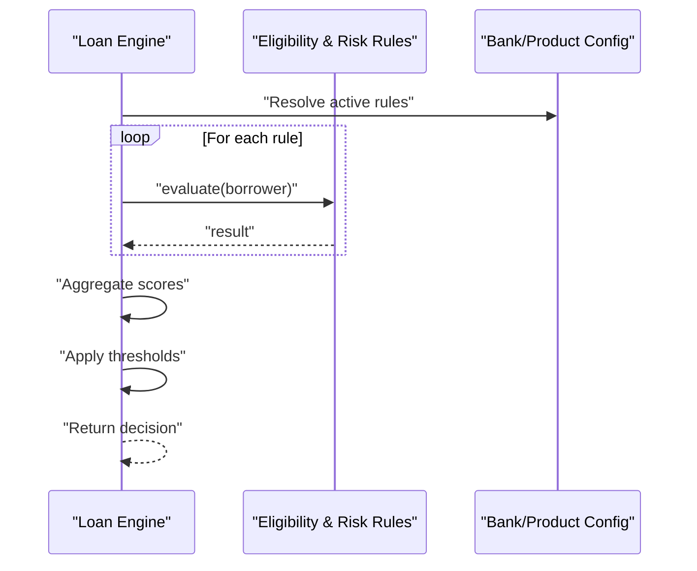
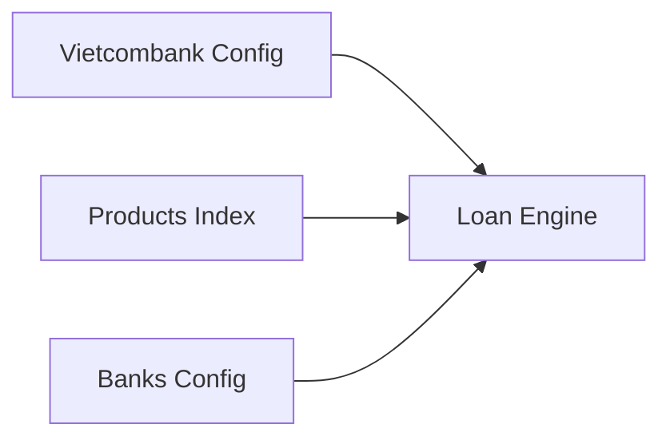
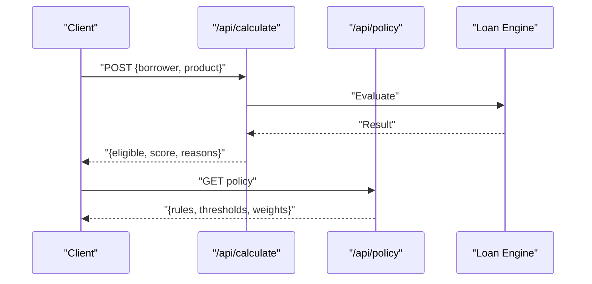
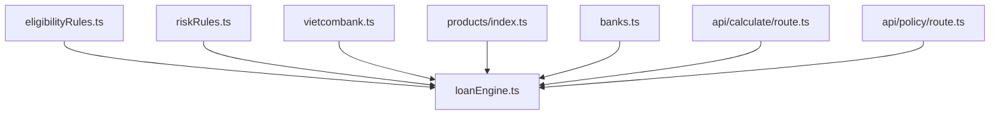

# Eligibility Rules System

<cite>
**Referenced Files in This Document**
- [eligibilityRules.ts](file://src/data/eligibilityRules.ts)
- [riskRules.ts](file://src/data/riskRules.ts)
- [loanEngine.ts](file://src/lib/loanEngine.ts)
- [vietcombank.ts](file://src/data/products/vietcombank.ts)
- [index.ts](file://src/data/products/index.ts)
- [banks.ts](file://src/data/banks.ts)
- [calculate/route.ts](file://src/app/api/calculate/route.ts)
- [policy/route.ts](file://src/app/api/policy/route.ts)
</cite>

## Table of Contents
1. [Introduction](#introduction)
2. [Project Structure](#project-structure)
3. [Core Components](#core-components)
4. [Architecture Overview](#architecture-overview)
5. [Detailed Component Analysis](#detailed-component-analysis)
6. [Dependency Analysis](#dependency-analysis)
7. [Performance Considerations](#performance-considerations)
8. [Troubleshooting Guide](#troubleshooting-guide)
9. [Conclusion](#conclusion)
10. [Appendices](#appendices)

## Introduction
This document explains the eligibility rules system that validates borrower qualifications against bank policies and regulatory requirements. It covers how rules are structured, configured, and extended for different banks and loan products; how the rule evaluation engine processes multiple criteria simultaneously (income verification, credit score thresholds, debt-to-income ratios, employment history checks); how scoring combines multiple factors into a comprehensive qualification assessment; and how to create custom rules, integrate them, version rules, test them, and debug complex scenarios.

## Project Structure
The eligibility rules system is implemented as data-driven rules with an evaluation engine:
- Rule definitions live under src/data (eligibilityRules.ts, riskRules.ts).
- Product-specific configurations live under src/data/products (vietcombank.ts, index.ts).
- Bank configuration lives under src/data/banks.ts.
- The evaluation engine lives under src/lib/loanEngine.ts.
- API routes expose endpoints for calculation and policy retrieval under src/app/api.

**Diagram sources**
- [eligibilityRules.ts](file://src/data/eligibilityRules.ts)
- [riskRules.ts](file://src/data/riskRules.ts)
- [vietcombank.ts](file://src/data/products/vietcombank.ts)
- [index.ts](file://src/data/products/index.ts)
- [banks.ts](file://src/data/banks.ts)
- [loanEngine.ts](file://src/lib/loanEngine.ts)
- [calculate/route.ts](file://src/app/api/calculate/route.ts)
- [policy/route.ts](file://src/app/api/policy/route.ts)

**Section sources**
- [eligibilityRules.ts](file://src/data/eligibilityRules.ts)
- [riskRules.ts](file://src/data/riskRules.ts)
- [vietcombank.ts](file://src/data/products/vietcombank.ts)
- [index.ts](file://src/data/products/index.ts)
- [banks.ts](file://src/data/banks.ts)
- [loanEngine.ts](file://src/lib/loanEngine.ts)
- [calculate/route.ts](file://src/app/api/calculate/route.ts)
- [policy/route.ts](file://src/app/api/policy/route.ts)

## Core Components
- Eligibility rules: Define criteria such as income verification, credit score thresholds, debt-to-income ratio limits, and employment history checks. These are stored as structured rule sets that can be combined and evaluated.
- Risk rules: Provide additional constraints or penalties based on risk indicators.
- Loan engine: Orchestrates rule evaluation, computes scores, and returns eligibility decisions.
- Product and bank configs: Allow customization per bank and product, including thresholds, weights, and rule variants.
- API routes: Expose endpoints to calculate eligibility and retrieve policies.

Key responsibilities:
- Rule definition and composition
- Evaluation pipeline execution
- Scoring aggregation and decision output
- Configuration binding per bank/product
- API exposure for client integration

**Section sources**
- [eligibilityRules.ts](file://src/data/eligibilityRules.ts)
- [riskRules.ts](file://src/data/riskRules.ts)
- [loanEngine.ts](file://src/lib/loanEngine.ts)
- [vietcombank.ts](file://src/data/products/vietcombank.ts)
- [index.ts](file://src/data/products/index.ts)
- [banks.ts](file://src/data/banks.ts)
- [calculate/route.ts](file://src/app/api/calculate/route.ts)
- [policy/route.ts](file://src/app/api/policy/route.ts)

## Architecture Overview
The system follows a layered architecture:
- Data layer holds rule definitions and product/bank configurations.
- Engine layer evaluates rules and computes scores.
- API layer exposes endpoints for clients to request calculations and policies.

**Diagram sources**
- [calculate/route.ts](file://src/app/api/calculate/route.ts)
- [loanEngine.ts](file://src/lib/loanEngine.ts)
- [eligibilityRules.ts](file://src/data/eligibilityRules.ts)
- [riskRules.ts](file://src/data/riskRules.ts)
- [vietcombank.ts](file://src/data/products/vietcombank.ts)
- [index.ts](file://src/data/products/index.ts)
- [banks.ts](file://src/data/banks.ts)

## Detailed Component Analysis

### Eligibility Rules
- Purpose: Define criteria for borrower qualification across dimensions like income, credit score, DTI, and employment history.
- Structure: Rules are organized as a set of conditions and outcomes, enabling combination and prioritization.
- Extension: New rules can be added by defining additional criteria and integrating them into the evaluation pipeline.

**Diagram sources**
- [eligibilityRules.ts](file://src/data/eligibilityRules.ts)

**Section sources**
- [eligibilityRules.ts](file://src/data/eligibilityRules.ts)

### Risk Rules
- Purpose: Capture risk-related constraints and penalties that affect eligibility beyond basic criteria.
- Integration: Combined with eligibility rules during scoring to produce a final decision.

**Diagram sources**
- [riskRules.ts](file://src/data/riskRules.ts)
- [eligibilityRules.ts](file://src/data/eligibilityRules.ts)
- [loanEngine.ts](file://src/lib/loanEngine.ts)

**Section sources**
- [riskRules.ts](file://src/data/riskRules.ts)

### Loan Engine
- Purpose: Orchestrate rule evaluation, compute composite scores, and determine eligibility.
- Responsibilities:
  - Load applicable rules based on bank/product configuration.
  - Execute rules concurrently where possible.
  - Aggregate individual rule results into a single score.
  - Apply thresholds and return a decision with reasons.

**Diagram sources**
- [loanEngine.ts](file://src/lib/loanEngine.ts)
- [eligibilityRules.ts](file://src/data/eligibilityRules.ts)
- [riskRules.ts](file://src/data/riskRules.ts)
- [vietcombank.ts](file://src/data/products/vietcombank.ts)
- [index.ts](file://src/data/products/index.ts)

**Section sources**
- [loanEngine.ts](file://src/lib/loanEngine.ts)

### Product and Bank Configuration
- Purpose: Customize rules, thresholds, and weights per bank and product.
- Example: Vietcombank configuration defines specific rule sets and parameters.
- Index module aggregates product configurations for easy access.

**Diagram sources**
- [vietcombank.ts](file://src/data/products/vietcombank.ts)
- [index.ts](file://src/data/products/index.ts)
- [banks.ts](file://src/data/banks.ts)
- [loanEngine.ts](file://src/lib/loanEngine.ts)

**Section sources**
- [vietcombank.ts](file://src/data/products/vietcombank.ts)
- [index.ts](file://src/data/products/index.ts)
- [banks.ts](file://src/data/banks.ts)

### API Routes
- Calculate endpoint: Accepts borrower and product inputs, invokes the loan engine, and returns eligibility results.
- Policy endpoint: Returns current policy configuration for clients to display or validate locally.

**Diagram sources**
- [calculate/route.ts](file://src/app/api/calculate/route.ts)
- [policy/route.ts](file://src/app/api/policy/route.ts)
- [loanEngine.ts](file://src/lib/loanEngine.ts)

**Section sources**
- [calculate/route.ts](file://src/app/api/calculate/route.ts)
- [policy/route.ts](file://src/app/api/policy/route.ts)

## Dependency Analysis
The system exhibits clear separation between data, engine, and API layers:
- Data layer provides rule definitions and configurations.
- Engine depends on data layer to execute evaluations.
- API layer depends on engine to expose functionality.

**Diagram sources**
- [eligibilityRules.ts](file://src/data/eligibilityRules.ts)
- [riskRules.ts](file://src/data/riskRules.ts)
- [vietcombank.ts](file://src/data/products/vietcombank.ts)
- [index.ts](file://src/data/products/index.ts)
- [banks.ts](file://src/data/banks.ts)
- [loanEngine.ts](file://src/lib/loanEngine.ts)
- [calculate/route.ts](file://src/app/api/calculate/route.ts)
- [policy/route.ts](file://src/app/api/policy/route.ts)

**Section sources**
- [eligibilityRules.ts](file://src/data/eligibilityRules.ts)
- [riskRules.ts](file://src/data/riskRules.ts)
- [vietcombank.ts](file://src/data/products/vietcombank.ts)
- [index.ts](file://src/data/products/index.ts)
- [banks.ts](file://src/data/banks.ts)
- [loanEngine.ts](file://src/lib/loanEngine.ts)
- [calculate/route.ts](file://src/app/api/calculate/route.ts)
- [policy/route.ts](file://src/app/api/policy/route.ts)

## Performance Considerations
- Rule evaluation should be optimized for concurrent execution where safe to reduce latency.
- Avoid heavy computations inside hot paths; precompute derived fields when possible.
- Cache static configurations and rule metadata to minimize repeated loading.
- Use efficient data structures for rule matching and scoring aggregation.
- Profile rule execution to identify bottlenecks and optimize critical paths.

[No sources needed since this section provides general guidance]

## Troubleshooting Guide
Common issues and debugging strategies:
- Missing or invalid borrower data: Ensure input validation before rule evaluation.
- Incorrect thresholds or weights: Review bank/product configuration files.
- Unexpected eligibility decisions: Inspect rule outputs and aggregation logic in the engine.
- Policy drift: Compare current policy endpoint responses with expected versions.

Debugging steps:
- Log rule-by-rule results to pinpoint failing criteria.
- Validate inputs against schema expectations.
- Temporarily disable non-critical rules to isolate issues.
- Use the policy endpoint to verify active configurations.

**Section sources**
- [loanEngine.ts](file://src/lib/loanEngine.ts)
- [calculate/route.ts](file://src/app/api/calculate/route.ts)
- [policy/route.ts](file://src/app/api/policy/route.ts)

## Conclusion
The eligibility rules system provides a flexible, configurable framework for validating borrower qualifications across multiple criteria. By separating rule definitions, engine logic, and configuration, it supports extension for new banks and products, robust scoring, and maintainable evolution of policies. Proper testing, versioning, and debugging practices ensure reliability and clarity in complex scenarios.

[No sources needed since this section summarizes without analyzing specific files]

## Appendices

### Custom Rule Creation and Integration Patterns
- Define a new rule with an identifier, category, and evaluation function.
- Integrate the rule into the engine’s pipeline via configuration.
- Assign appropriate weights and thresholds in bank/product configs.
- Test the rule independently and within the full pipeline.

**Section sources**
- [eligibilityRules.ts](file://src/data/eligibilityRules.ts)
- [riskRules.ts](file://src/data/riskRules.ts)
- [loanEngine.ts](file://src/lib/loanEngine.ts)
- [vietcombank.ts](file://src/data/products/vietcombank.ts)

### Rule Versioning Strategy
- Maintain versioned rule sets per bank/product configuration.
- Track changes in rule definitions and thresholds over time.
- Use the policy endpoint to serve current and historical policies.
- Implement migration scripts to transition borrowers to updated rules.

**Section sources**
- [vietcombank.ts](file://src/data/products/vietcombank.ts)
- [index.ts](file://src/data/products/index.ts)
- [policy/route.ts](file://src/app/api/policy/route.ts)

### Testing Strategies
- Unit tests for individual rules to validate correctness.
- Integration tests for the engine’s aggregation and decision logic.
- Scenario-based tests using sample borrower profiles.
- Regression tests to prevent unintended behavior after changes.

**Section sources**
- [loanEngine.ts](file://src/lib/loanEngine.ts)
- [eligibilityRules.ts](file://src/data/eligibilityRules.ts)
- [riskRules.ts](file://src/data/riskRules.ts)