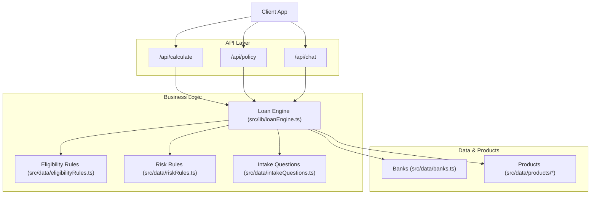
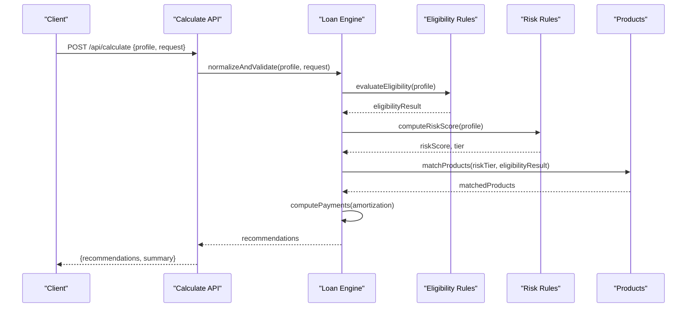
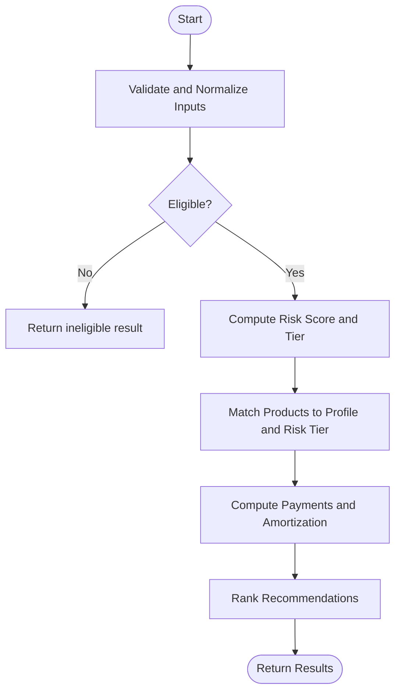
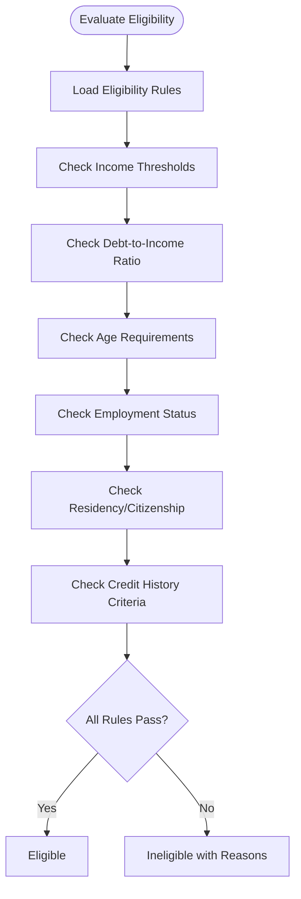
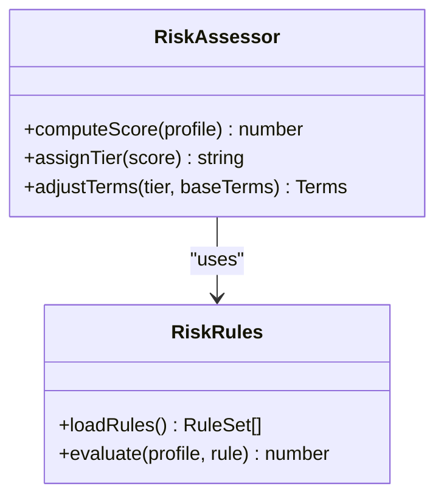
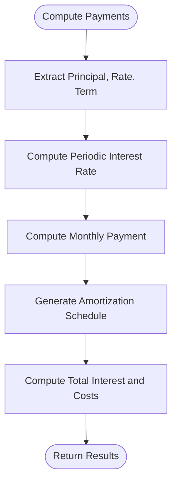
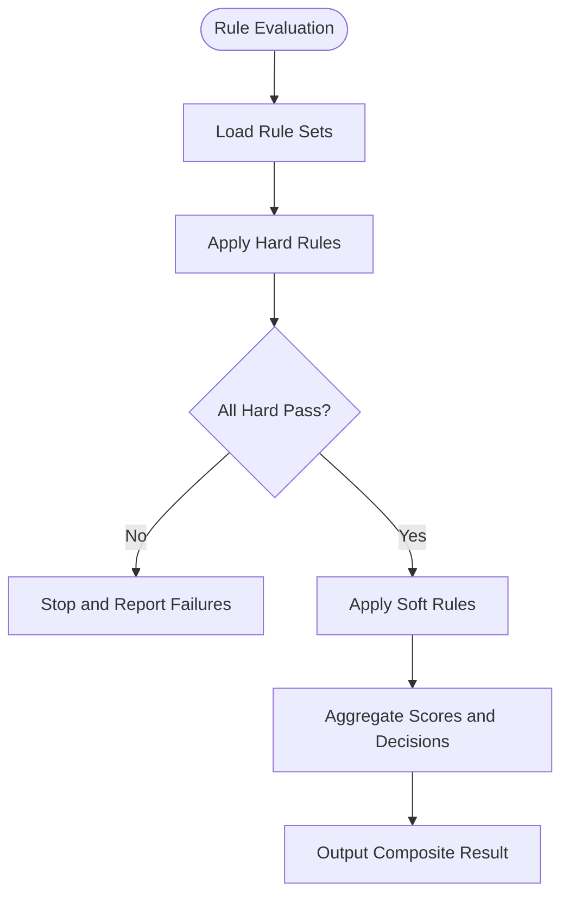
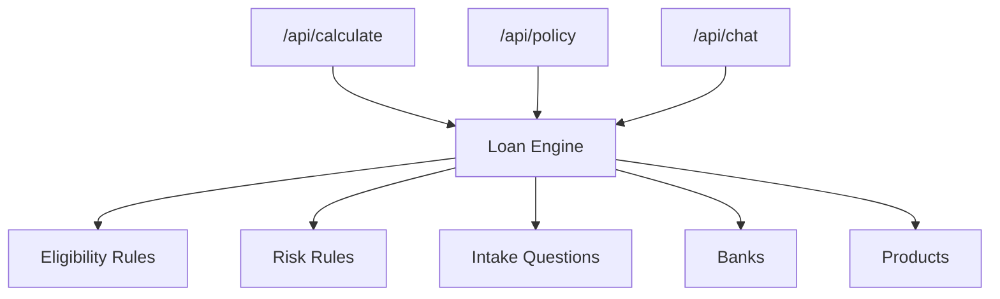

# Loan Engine

<cite>
**Referenced Files in This Document**
- [loanEngine.ts](file://src/lib/loanEngine.ts)
- [eligibilityRules.ts](file://src/data/eligibilityRules.ts)
- [riskRules.ts](file://src/data/riskRules.ts)
- [intakeQuestions.ts](file://src/data/intakeQuestions.ts)
- [calculate/route.ts](file://src/app/api/calculate/route.ts)
- [policy/route.ts](file://src/app/api/policy/route.ts)
- [chat/route.ts](file://src/app/api/chat/route.ts)
- [banks.ts](file://src/data/banks.ts)
- [products/index.ts](file://src/data/products/index.ts)
- [vietcombank.ts](file://src/data/products/vietcombank.ts)
</cite>

## Table of Contents
1. [Introduction](#introduction)
2. [Project Structure](#project-structure)
3. [Core Components](#core-components)
4. [Architecture Overview](#architecture-overview)
5. [Detailed Component Analysis](#detailed-component-analysis)
6. [Dependency Analysis](#dependency-analysis)
7. [Performance Considerations](#performance-considerations)
8. [Troubleshooting Guide](#troubleshooting-guide)
9. [Conclusion](#conclusion)

## Introduction
This document explains the loan calculation engine and business logic layer, focusing on eligibility checks, payment calculations, risk assessments, intake question processing, rule evaluation, and performance optimizations. It targets both technical and non-technical readers by progressively detailing system architecture, data flows, algorithms, and integration points.

## Project Structure
The loan engine resides primarily under src/lib and src/data, with API routes exposing endpoints for calculation, policy retrieval, and chat assistance. Data modules define eligibility rules, risk rules, bank products, and intake questions. The API routes orchestrate requests, validate inputs, invoke the engine, and return results.

**Diagram sources**
- [calculate/route.ts](file://src/app/api/calculate/route.ts)
- [policy/route.ts](file://src/app/api/policy/route.ts)
- [chat/route.ts](file://src/app/api/chat/route.ts)
- [loanEngine.ts](file://src/lib/loanEngine.ts)
- [eligibilityRules.ts](file://src/data/eligibilityRules.ts)
- [riskRules.ts](file://src/data/riskRules.ts)
- [intakeQuestions.ts](file://src/data/intakeQuestions.ts)
- [banks.ts](file://src/data/banks.ts)
- [products/index.ts](file://src/data/products/index.ts)

**Section sources**
- [calculate/route.ts](file://src/app/api/calculate/route.ts)
- [policy/route.ts](file://src/app/api/policy/route.ts)
- [chat/route.ts](file://src/app/api/chat/route.ts)
- [loanEngine.ts](file://src/lib/loanEngine.ts)
- [eligibilityRules.ts](file://src/data/eligibilityRules.ts)
- [riskRules.ts](file://src/data/riskRules.ts)
- [intakeQuestions.ts](file://src/data/intakeQuestions.ts)
- [banks.ts](file://src/data/banks.ts)
- [products/index.ts](file://src/data/products/index.ts)

## Core Components
- Loan Engine: Orchestrates eligibility validation, risk scoring, product matching, and payment amortization calculations. It normalizes intake data, applies rules, and returns structured recommendations.
- Eligibility Rules: Encodes borrower qualifications against bank policies and regulatory constraints (e.g., income thresholds, debt-to-income limits, age, employment status).
- Risk Assessment: Evaluates creditworthiness using risk rules to determine risk tiers, pricing adjustments, and term limits.
- Intake Question System: Collects user financial information via guided questions and translates responses into a normalized profile used by the engine.
- Product Catalog: Bank-specific loan packages and terms that the engine matches against borrower profiles and risk scores.

Key responsibilities:
- Input normalization and validation
- Rule evaluation across multiple criteria
- Risk scoring and tier assignment
- Payment computation and amortization schedule generation
- Recommendation ranking and filtering

**Section sources**
- [loanEngine.ts](file://src/lib/loanEngine.ts)
- [eligibilityRules.ts](file://src/data/eligibilityRules.ts)
- [riskRules.ts](file://src/data/riskRules.ts)
- [intakeQuestions.ts](file://src/data/intakeQuestions.ts)
- [products/index.ts](file://src/data/products/index.ts)

## Architecture Overview
The system follows a layered architecture:
- API Layer: HTTP endpoints for calculate, policy, and chat.
- Business Logic Layer: Loan engine orchestrating eligibility, risk, and product matching.
- Data Layer: Static or dynamic rule sets, bank products, and intake question definitions.

**Diagram sources**
- [calculate/route.ts](file://src/app/api/calculate/route.ts)
- [loanEngine.ts](file://src/lib/loanEngine.ts)
- [eligibilityRules.ts](file://src/data/eligibilityRules.ts)
- [riskRules.ts](file://src/data/riskRules.ts)
- [products/index.ts](file://src/data/products/index.ts)

## Detailed Component Analysis

### Loan Engine
Responsibilities:
- Normalize intake data into a consistent profile schema.
- Validate input completeness and correctness.
- Run eligibility checks against policy rules.
- Compute risk score and assign risk tier.
- Match eligible products and compute payments.
- Generate amortization schedules and summaries.

Processing flow:
- Input validation and normalization
- Eligibility evaluation
- Risk assessment
- Product matching and filtering
- Payment and amortization calculation
- Result aggregation and recommendation ranking

**Diagram sources**
- [loanEngine.ts](file://src/lib/loanEngine.ts)

**Section sources**
- [loanEngine.ts](file://src/lib/loanEngine.ts)

### Eligibility Rules System
Purpose:
- Encode borrower qualification criteria aligned with bank policies and regulations.
- Evaluate conditions such as income, DTI, age, employment, residency, and credit history thresholds.
- Produce pass/fail decisions and reasons for ineligibility.

Evaluation approach:
- Define rule sets per bank/product category.
- Apply hard constraints first (regulatory), then soft constraints (bank policy).
- Aggregate rule outcomes into an eligibility decision with detailed feedback.

**Diagram sources**
- [eligibilityRules.ts](file://src/data/eligibilityRules.ts)

**Section sources**
- [eligibilityRules.ts](file://src/data/eligibilityRules.ts)

### Risk Assessment Algorithms
Purpose:
- Quantify borrower creditworthiness using risk rules.
- Determine risk tiers that influence pricing, limits, and terms.
- Provide actionable insights for loan structuring.

Algorithm highlights:
- Weighted scoring across factors (income stability, DTI, credit history, employment length, collateral).
- Non-linear adjustments for extreme values (e.g., high DTI penalties).
- Tier mapping to interest rate bands and maximum loan amounts.

**Diagram sources**
- [riskRules.ts](file://src/data/riskRules.ts)
- [loanEngine.ts](file://src/lib/loanEngine.ts)

**Section sources**
- [riskRules.ts](file://src/data/riskRules.ts)
- [loanEngine.ts](file://src/lib/loanEngine.ts)

### Intake Question System
Purpose:
- Gather user financial information through guided questions.
- Translate answers into a structured profile for engine processing.
- Support progressive profiling and validation at each step.

Design:
- Question catalog with types (numeric, categorical, conditional).
- Validation rules per question (ranges, dependencies).
- Normalization pipeline producing a canonical profile object.

**Diagram sources**
- [intakeQuestions.ts](file://src/data/intakeQuestions.ts)

**Section sources**
- [intakeQuestions.ts](file://src/data/intakeQuestions.ts)

### Calculation Formulas and Amortization
Payment formulas:
- Monthly payment uses standard amortization formula based on principal, annual interest rate, and loan term in months.
- Total interest equals sum of monthly payments minus principal.
- Amortization schedule lists each period’s principal portion, interest portion, and remaining balance.

Implementation notes:
- Use precise floating-point arithmetic and rounding conventions for currency.
- Handle edge cases like zero interest, very short terms, and negative balances due to rounding.
- Precompute periodic rate and total periods; iterate to build schedule.

**Diagram sources**
- [loanEngine.ts](file://src/lib/loanEngine.ts)

**Section sources**
- [loanEngine.ts](file://src/lib/loanEngine.ts)

### Rule Evaluation Engine
Purpose:
- Apply multiple eligibility and risk criteria simultaneously.
- Combine rule outcomes into composite decisions and recommendations.
- Provide explainability by returning rule-level results.

Approach:
- Rule sets are evaluated in priority order.
- Hard rules must pass; soft rules adjust scores or weights.
- Aggregation produces final eligibility, risk tier, and recommended products.

**Diagram sources**
- [eligibilityRules.ts](file://src/data/eligibilityRules.ts)
- [riskRules.ts](file://src/data/riskRules.ts)
- [loanEngine.ts](file://src/lib/loanEngine.ts)

**Section sources**
- [eligibilityRules.ts](file://src/data/eligibilityRules.ts)
- [riskRules.ts](file://src/data/riskRules.ts)
- [loanEngine.ts](file://src/lib/loanEngine.ts)

### API Endpoints
- /api/calculate: Accepts borrower profile and loan request, returns recommendations and amortization details.
- /api/policy: Returns current eligibility and risk policy definitions for client-side guidance.
- /api/chat: Provides conversational assistance to guide users through intake and explain results.

Request/response outlines:
- Calculate:
  - Request: borrower profile, requested loan amount, term preferences.
  - Response: eligible products, risk tier, monthly payments, amortization schedule, reasons if ineligible.
- Policy:
  - Request: minimal or none.
  - Response: rule definitions, thresholds, and product catalogs.
- Chat:
  - Request: conversation context and user inputs.
  - Response: guidance, clarifications, and next steps.

**Section sources**
- [calculate/route.ts](file://src/app/api/calculate/route.ts)
- [policy/route.ts](file://src/app/api/policy/route.ts)
- [chat/route.ts](file://src/app/api/chat/route.ts)

## Dependency Analysis
The loan engine depends on rule sets and product catalogs. API routes depend on the engine to process requests. Clear separation ensures maintainability and testability.

**Diagram sources**
- [calculate/route.ts](file://src/app/api/calculate/route.ts)
- [policy/route.ts](file://src/app/api/policy/route.ts)
- [chat/route.ts](file://src/app/api/chat/route.ts)
- [loanEngine.ts](file://src/lib/loanEngine.ts)
- [eligibilityRules.ts](file://src/data/eligibilityRules.ts)
- [riskRules.ts](file://src/data/riskRules.ts)
- [intakeQuestions.ts](file://src/data/intakeQuestions.ts)
- [banks.ts](file://src/data/banks.ts)
- [products/index.ts](file://src/data/products/index.ts)

**Section sources**
- [calculate/route.ts](file://src/app/api/calculate/route.ts)
- [policy/route.ts](file://src/app/api/policy/route.ts)
- [chat/route.ts](file://src/app/api/chat/route.ts)
- [loanEngine.ts](file://src/lib/loanEngine.ts)
- [eligibilityRules.ts](file://src/data/eligibilityRules.ts)
- [riskRules.ts](file://src/data/riskRules.ts)
- [intakeQuestions.ts](file://src/data/intakeQuestions.ts)
- [banks.ts](file://src/data/banks.ts)
- [products/index.ts](file://src/data/products/index.ts)

## Performance Considerations
Optimizations for large-scale calculations:
- Memoization: Cache repeated eligibility and risk evaluations keyed by normalized profile hashes.
- Rule caching: Persist compiled rule sets and product catalogs in memory to avoid re-parsing.
- Batch processing: Process multiple profiles in batches to reduce overhead and leverage vectorized operations where possible.
- Lazy evaluation: Defer expensive computations until needed (e.g., amortization schedules generated on demand).
- Early exits: Short-circuit rule evaluation when hard constraints fail.
- Numerical precision: Use stable arithmetic routines and round consistently to avoid drift in amortization totals.

Caching strategies:
- In-memory LRU cache for frequent queries (e.g., same borrower profile variations).
- TTL-based invalidation for policy changes.
- Segment caches by bank/product to minimize contention.

[No sources needed since this section provides general guidance]

## Troubleshooting Guide
Common issues and resolutions:
- Invalid or incomplete intake data: Ensure all required fields are present and validated before engine invocation.
- Unexpected ineligibility: Inspect rule failure reasons returned by eligibility evaluation.
- Incorrect payment totals: Verify periodic rate computation, rounding, and schedule iteration logic.
- Stale policy results: Refresh cached rule sets when policies change; implement versioning for rule sets.
- Performance regressions: Monitor cache hit rates and rule evaluation times; consider batching and lazy evaluation.

Diagnostics:
- Log rule evaluation paths and outcomes for traceability.
- Expose diagnostic endpoints or flags to retrieve intermediate results during development.
- Validate amortization schedules against known benchmarks.

**Section sources**
- [loanEngine.ts](file://src/lib/loanEngine.ts)
- [eligibilityRules.ts](file://src/data/eligibilityRules.ts)
- [riskRules.ts](file://src/data/riskRules.ts)
- [intakeQuestions.ts](file://src/data/intakeQuestions.ts)

## Conclusion
The loan engine integrates eligibility rules, risk assessment, intake profiling, and product matching to deliver accurate loan recommendations and amortization schedules. By applying structured rule evaluation, robust numerical computation, and performance optimizations, the system supports scalable and reliable loan processing. Clear API boundaries and modular design facilitate maintenance, testing, and future enhancements.

[No sources needed since this section summarizes without analyzing specific files]