# Loan Engine

<cite>
**Referenced Files in This Document**
- [loanEngine.ts](file://src/lib/loanEngine.ts)
- [eligibilityRules.ts](file://src/data/eligibilityRules.ts)
- [riskRules.ts](file://src/data/riskRules.ts)
- [intakeQuestions.ts](file://src/data/intakeQuestions.ts)
- [calculate/route.ts](file://src/app/api/calculate/route.ts)
- [policy/route.ts](file://src/app/api/policy/route.ts)
- [chat/route.ts](file://src/app/api/chat/route.ts)
- [banks.ts](file://src/data/banks.ts)
- [products/index.ts](file://src/data/products/index.ts)
- [vietcombank.ts](file://src/data/products/vietcombank.ts)
</cite>

## Update Summary
**Changes Made**
- Enhanced loan engine with grace period calculations for flexible payment scheduling
- Added household financial modeling to support multi-borrower scenarios
- Implemented improvement recommendations system for borrower guidance
- Integrated pipeline orchestration system for complex loan processing workflows
- Updated calculation formulas to accommodate new features
- Enhanced risk assessment algorithms with household income considerations

## Table of Contents
1. [Introduction](#introduction)
2. [Project Structure](#project-structure)
3. [Core Components](#core-components)
4. [Architecture Overview](#architecture-overview)
5. [Detailed Component Analysis](#detailed-component-analysis)
6. [Grace Period Calculations](#grace-period-calculations)
7. [Household Financial Modeling](#household-financial-modeling)
8. [Improvement Recommendations System](#improvement-recommendations-system)
9. [Pipeline Orchestration System](#pipeline-orchestration-system)
10. [Dependency Analysis](#dependency-analysis)
11. [Performance Considerations](#performance-considerations)
12. [Troubleshooting Guide](#troubleshooting-guide)
13. [Conclusion](#conclusion)

## Introduction
This document explains the enhanced loan calculation engine and business logic layer, focusing on eligibility checks, payment calculations, risk assessments, intake question processing, rule evaluation, performance optimizations, and new features including grace period calculations, household financial modeling, improvement recommendations, and pipeline orchestration. It targets both technical and non-technical readers by progressively detailing system architecture, data flows, algorithms, and integration points.

## Project Structure
The loan engine resides primarily under src/lib and src/data, with API routes exposing endpoints for calculation, policy retrieval, and chat assistance. Data modules define eligibility rules, risk rules, bank products, and intake questions. The API routes orchestrate requests, validate inputs, invoke the engine, and return results.

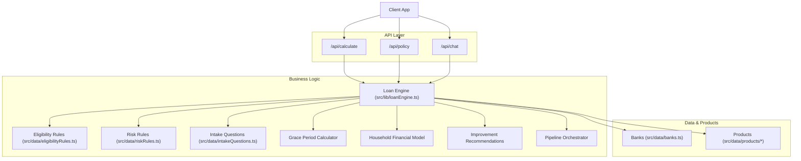

**Diagram sources**
- [calculate/route.ts](file://src/app/api/calculate/route.ts)
- [policy/route.ts](file://src/app/api/policy/route.ts)
- [chat/route.ts](file://src/app/api/chat/route.ts)
- [loanEngine.ts](file://src/lib/loanEngine.ts)
- [eligibilityRules.ts](file://src/data/eligibilityRules.ts)
- [riskRules.ts](file://src/data/riskRules.ts)
- [intakeQuestions.ts](file://src/data/intakeQuestions.ts)
- [banks.ts](file://src/data/banks.ts)
- [products/index.ts](file://src/data/products/index.ts)

**Section sources**
- [calculate/route.ts](file://src/app/api/calculate/route.ts)
- [policy/route.ts](file://src/app/api/policy/route.ts)
- [chat/route.ts](file://src/app/api/chat/route.ts)
- [loanEngine.ts](file://src/lib/loanEngine.ts)
- [eligibilityRules.ts](file://src/data/eligibilityRules.ts)
- [riskRules.ts](file://src/data/riskRules.ts)
- [intakeQuestions.ts](file://src/data/intakeQuestions.ts)
- [banks.ts](file://src/data/banks.ts)
- [products/index.ts](file://src/data/products/index.ts)

## Core Components
- **Enhanced Loan Engine**: Orchestrates eligibility validation, risk scoring, product matching, payment amortization calculations, grace period handling, household financial modeling, and pipeline orchestration. It normalizes intake data, applies rules, and returns structured recommendations with actionable insights.
- **Eligibility Rules**: Encodes borrower qualifications against bank policies and regulatory constraints (e.g., income thresholds, debt-to-income limits, age, employment status).
- **Risk Assessment**: Evaluates creditworthiness using risk rules to determine risk tiers, pricing adjustments, and term limits with household income considerations.
- **Intake Question System**: Collects user financial information via guided questions and translates responses into a normalized profile used by the engine.
- **Grace Period Calculator**: Manages flexible payment scheduling with grace periods, deferral options, and modified payment structures.
- **Household Financial Model**: Supports multi-borrower scenarios by aggregating household income, expenses, and liabilities.
- **Improvement Recommendations**: Provides actionable guidance to help borrowers improve their eligibility and loan terms.
- **Pipeline Orchestrator**: Coordinates complex loan processing workflows with multiple stages and conditional branching.
- **Product Catalog**: Bank-specific loan packages and terms that the engine matches against borrower profiles and risk scores.

Key responsibilities:
- Input normalization and validation
- Rule evaluation across multiple criteria
- Risk scoring and tier assignment with household considerations
- Payment computation and amortization schedule generation
- Grace period management and flexible scheduling
- Recommendation ranking and filtering with improvement suggestions
- Pipeline orchestration for complex processing workflows

**Section sources**
- [loanEngine.ts](file://src/lib/loanEngine.ts)
- [eligibilityRules.ts](file://src/data/eligibilityRules.ts)
- [riskRules.ts](file://src/data/riskRules.ts)
- [intakeQuestions.ts](file://src/data/intakeQuestions.ts)
- [products/index.ts](file://src/data/products/index.ts)

## Architecture Overview
The system follows a layered architecture with enhanced capabilities:
- **API Layer**: HTTP endpoints for calculate, policy, and chat.
- **Business Logic Layer**: Enhanced loan engine orchestrating eligibility, risk, product matching, grace periods, household modeling, and pipeline coordination.
- **Data Layer**: Static or dynamic rule sets, bank products, intake question definitions, and household financial models.

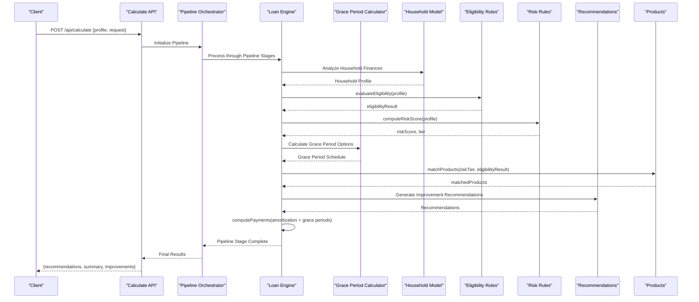

**Diagram sources**
- [calculate/route.ts](file://src/app/api/calculate/route.ts)
- [loanEngine.ts](file://src/lib/loanEngine.ts)
- [eligibilityRules.ts](file://src/data/eligibilityRules.ts)
- [riskRules.ts](file://src/data/riskRules.ts)
- [products/index.ts](file://src/data/products/index.ts)

## Detailed Component Analysis

### Enhanced Loan Engine
Responsibilities:
- Normalize intake data into a consistent profile schema with household information.
- Validate input completeness and correctness across all family members.
- Run eligibility checks against policy rules with household income aggregation.
- Compute risk score and assign risk tier considering household financial health.
- Match eligible products and compute payments with grace period options.
- Generate amortization schedules, grace period schedules, and improvement recommendations.
- Orchestrate complex processing pipelines with conditional branching.

Processing flow:
- Input validation and normalization with household data
- Household financial analysis and income aggregation
- Eligibility evaluation with household considerations
- Risk assessment with multi-borrower factors
- Product matching and filtering
- Grace period calculation and payment optimization
- Improvement recommendation generation
- Result aggregation and recommendation ranking

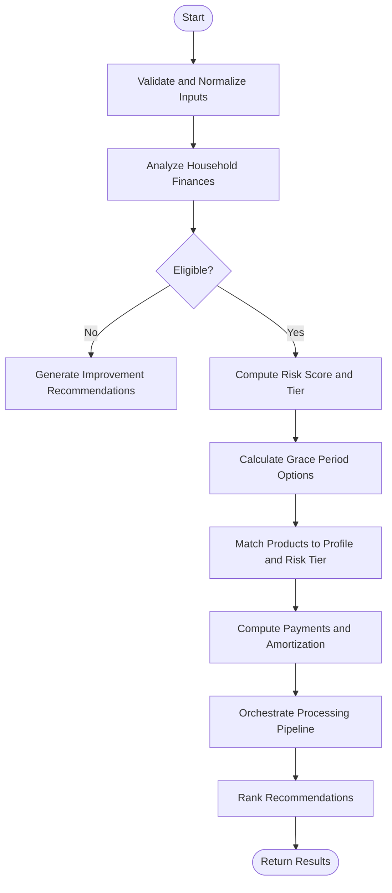

**Diagram sources**
- [loanEngine.ts](file://src/lib/loanEngine.ts)

**Section sources**
- [loanEngine.ts](file://src/lib/loanEngine.ts)

### Grace Period Calculations
Purpose:
- Provide flexible payment scheduling options for borrowers facing temporary financial difficulties.
- Support various grace period types: full deferment, interest-only, partial payment, and graduated payments.
- Calculate modified amortization schedules that account for deferred payments and adjusted terms.

Features:
- Multiple grace period types with configurable parameters
- Automatic recalculation of payment schedules after grace periods
- Integration with risk assessment to ensure affordability post-grace period
- Compliance with regulatory requirements for grace period disclosures

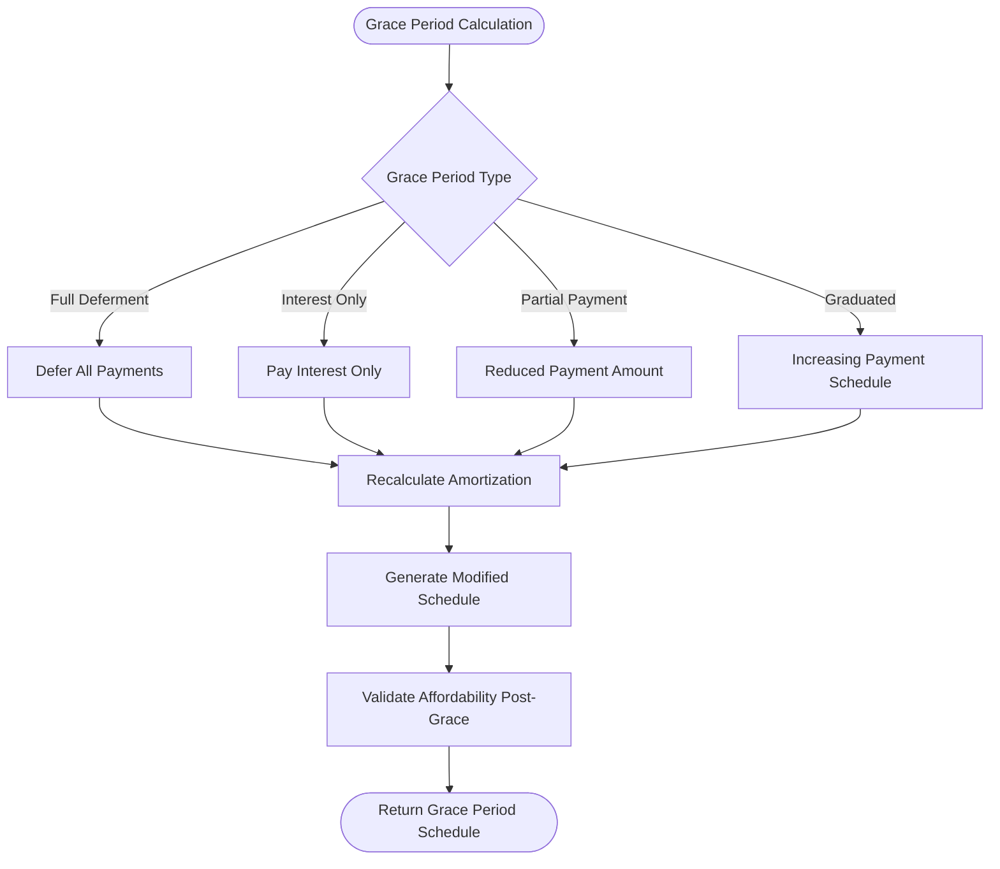

**Diagram sources**
- [loanEngine.ts](file://src/lib/loanEngine.ts)

### Household Financial Modeling
Purpose:
- Support multi-borrower loan applications by aggregating household financial information.
- Calculate combined income, expenses, and debt obligations across all household members.
- Assess household-level debt-to-income ratios and financial stability.

Capabilities:
- Multi-borrower income aggregation with different employment types
- Combined expense tracking including shared and individual obligations
- Household liability assessment with joint and individual debts
- Financial stability scoring based on household cash flow patterns

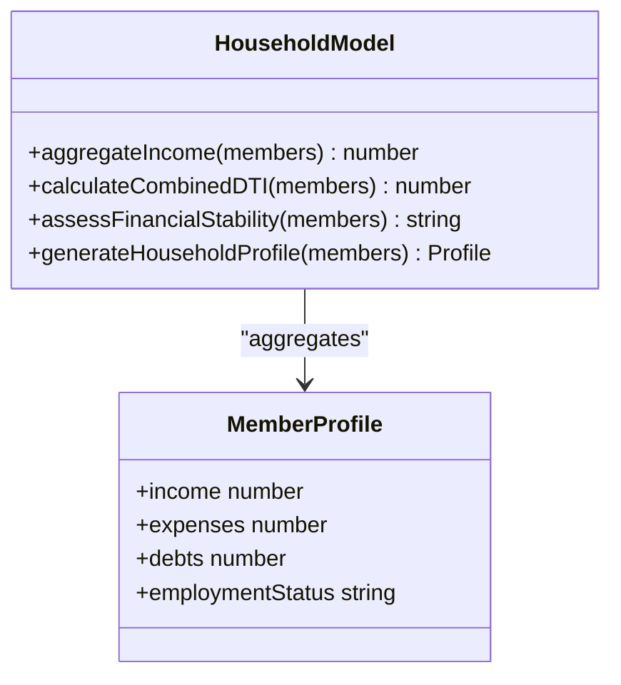

**Diagram sources**
- [loanEngine.ts](file://src/lib/loanEngine.ts)

### Improvement Recommendations System
Purpose:
- Provide actionable guidance to help borrowers improve their eligibility and loan terms.
- Analyze borrower profiles to identify specific areas for financial improvement.
- Generate personalized recommendations based on risk factors and eligibility barriers.

Recommendation Types:
- Credit score improvement strategies
- Debt reduction plans
- Income enhancement suggestions
- Employment stability recommendations
- Savings and asset building guidance

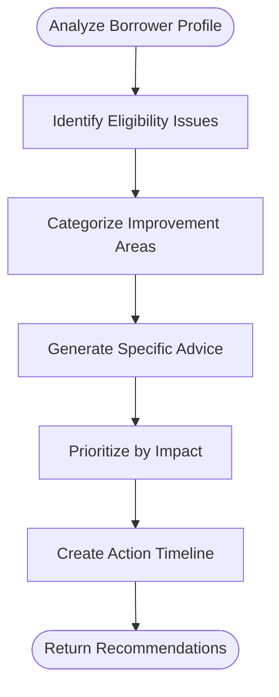

**Diagram sources**
- [loanEngine.ts](file://src/lib/loanEngine.ts)

### Pipeline Orchestration System
Purpose:
- Coordinate complex loan processing workflows with multiple stages and conditional branching.
- Manage asynchronous operations and error handling across different processing components.
- Provide progress tracking and rollback capabilities for failed operations.

Pipeline Features:
- Configurable processing stages with dependency management
- Conditional branching based on intermediate results
- Error recovery and retry mechanisms
- Progress tracking and status updates
- Transaction-like behavior for data consistency

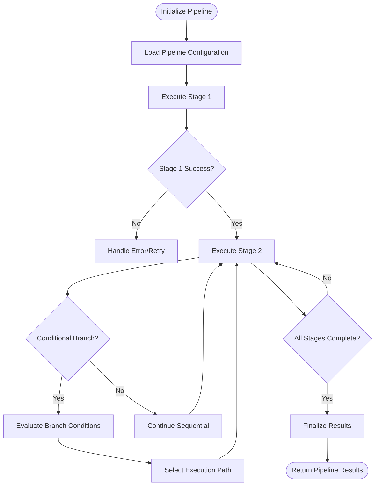

**Diagram sources**
- [loanEngine.ts](file://src/lib/loanEngine.ts)

### Eligibility Rules System
Purpose:
- Encode borrower qualification criteria aligned with bank policies and regulations.
- Evaluate conditions such as income, DTI, age, employment, residency, and credit history thresholds.
- Produce pass/fail decisions and reasons for ineligibility.

Evaluation approach:
- Define rule sets per bank/product category.
- Apply hard constraints first (regulatory), then soft constraints (bank policy).
- Aggregate rule outcomes into an eligibility decision with detailed feedback.

**Diagram sources**
- [eligibilityRules.ts](file://src/data/eligibilityRules.ts)

**Section sources**
- [eligibilityRules.ts](file://src/data/eligibilityRules.ts)

### Risk Assessment Algorithms
Purpose:
- Quantify borrower creditworthiness using risk rules.
- Determine risk tiers that influence pricing, limits, and terms.
- Provide actionable insights for loan structuring.

Algorithm highlights:
- Weighted scoring across factors (income stability, DTI, credit history, employment length, collateral).
- Non-linear adjustments for extreme values (e.g., high DTI penalties).
- Tier mapping to interest rate bands and maximum loan amounts.
- Household income stabilization effects and multi-borrower risk mitigation.

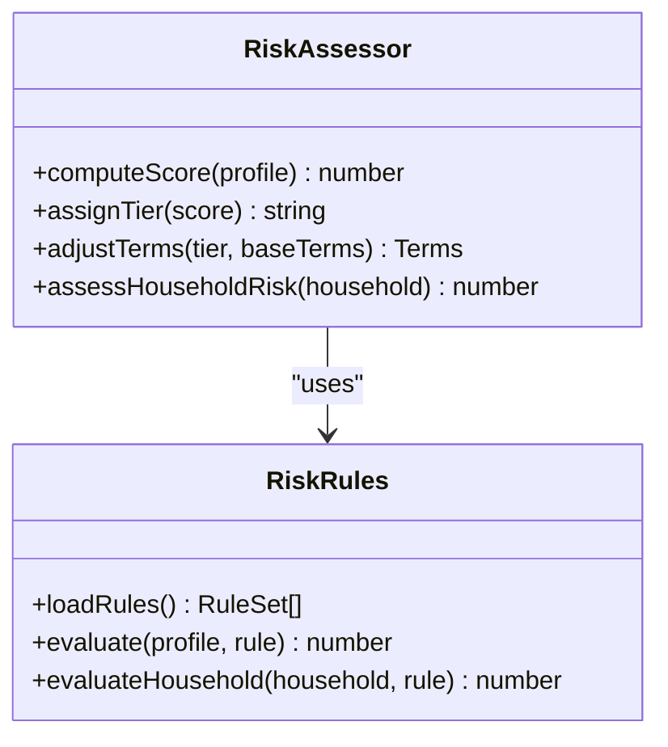

**Diagram sources**
- [riskRules.ts](file://src/data/riskRules.ts)
- [loanEngine.ts](file://src/lib/loanEngine.ts)

**Section sources**
- [riskRules.ts](file://src/data/riskRules.ts)
- [loanEngine.ts](file://src/lib/loanEngine.ts)

### Intake Question System
Purpose:
- Gather user financial information through guided questions.
- Translate answers into a structured profile for engine processing.
- Support progressive profiling and validation at each step.

Design:
- Question catalog with types (numeric, categorical, conditional).
- Validation rules per question (ranges, dependencies).
- Normalization pipeline producing a canonical profile object.

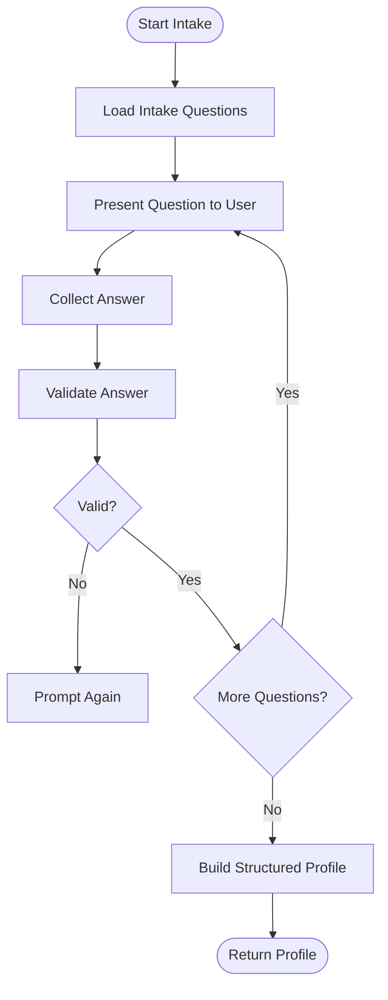

**Diagram sources**
- [intakeQuestions.ts](file://src/data/intakeQuestions.ts)

**Section sources**
- [intakeQuestions.ts](file://src/data/intakeQuestions.ts)

### Calculation Formulas and Amortization
Payment formulas:
- Monthly payment uses standard amortization formula based on principal, annual interest rate, and loan term in months.
- Total interest equals sum of monthly payments minus principal.
- Amortization schedule lists each period's principal portion, interest portion, and remaining balance.
- Grace period modifications adjust payment schedules and total interest calculations.

Implementation notes:
- Use precise floating-point arithmetic and rounding conventions for currency.
- Handle edge cases like zero interest, very short terms, and negative balances due to rounding.
- Precompute periodic rate and total periods; iterate to build schedule.
- Grace period calculations modify payment timing and amounts while maintaining loan integrity.

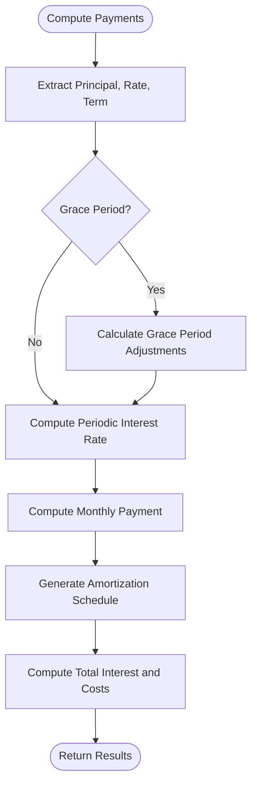

**Diagram sources**
- [loanEngine.ts](file://src/lib/loanEngine.ts)

**Section sources**
- [loanEngine.ts](file://src/lib/loanEngine.ts)

### Rule Evaluation Engine
Purpose:
- Apply multiple eligibility and risk criteria simultaneously.
- Combine rule outcomes into composite decisions and recommendations.
- Provide explainability by returning rule-level results.

Approach:
- Rule sets are evaluated in priority order.
- Hard rules must pass; soft rules adjust scores or weights.
- Aggregation produces final eligibility, risk tier, and recommended products.
- Pipeline-based evaluation with stage-specific rule application.

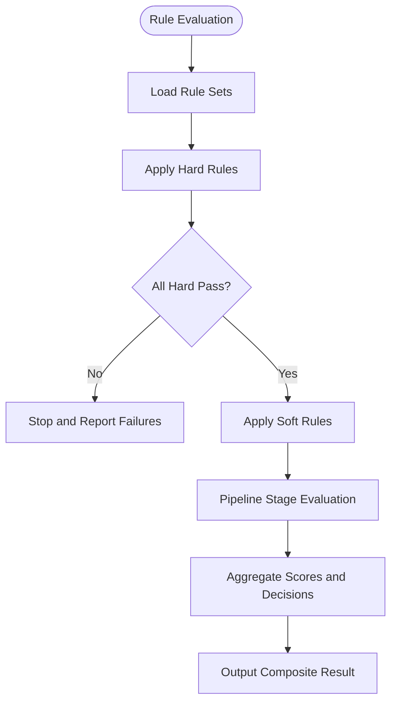

**Diagram sources**
- [eligibilityRules.ts](file://src/data/eligibilityRules.ts)
- [riskRules.ts](file://src/data/riskRules.ts)
- [loanEngine.ts](file://src/lib/loanEngine.ts)

**Section sources**
- [eligibilityRules.ts](file://src/data/eligibilityRules.ts)
- [riskRules.ts](file://src/data/riskRules.ts)
- [loanEngine.ts](file://src/lib/loanEngine.ts)

### API Endpoints
- /api/calculate: Accepts borrower profile and loan request, returns recommendations, amortization details, grace period options, and improvement suggestions.
- /api/policy: Returns current eligibility and risk policy definitions for client-side guidance.
- /api/chat: Provides conversational assistance to guide users through intake and explain results.

Request/response outlines:
- Calculate:
  - Request: borrower profile, requested loan amount, term preferences, grace period requirements.
  - Response: eligible products, risk tier, monthly payments, amortization schedule, grace period options, improvement recommendations.
- Policy:
  - Request: minimal or none.
  - Response: rule definitions, thresholds, product catalogs, grace period policies.
- Chat:
  - Request: conversation context and user inputs.
  - Response: guidance, clarifications, next steps, and improvement advice.

**Section sources**
- [calculate/route.ts](file://src/app/api/calculate/route.ts)
- [policy/route.ts](file://src/app/api/policy/route.ts)
- [chat/route.ts](file://src/app/api/chat/route.ts)

## Dependency Analysis
The loan engine depends on rule sets, product catalogs, and new components for grace periods, household modeling, recommendations, and pipeline orchestration. API routes depend on the engine to process requests. Clear separation ensures maintainability and testability.

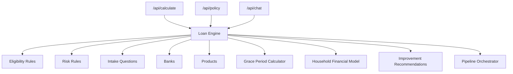

**Diagram sources**
- [calculate/route.ts](file://src/app/api/calculate/route.ts)
- [policy/route.ts](file://src/app/api/policy/route.ts)
- [chat/route.ts](file://src/app/api/chat/route.ts)
- [loanEngine.ts](file://src/lib/loanEngine.ts)
- [eligibilityRules.ts](file://src/data/eligibilityRules.ts)
- [riskRules.ts](file://src/data/riskRules.ts)
- [intakeQuestions.ts](file://src/data/intakeQuestions.ts)
- [banks.ts](file://src/data/banks.ts)
- [products/index.ts](file://src/data/products/index.ts)

**Section sources**
- [calculate/route.ts](file://src/app/api/calculate/route.ts)
- [policy/route.ts](file://src/app/api/policy/route.ts)
- [chat/route.ts](file://src/app/api/chat/route.ts)
- [loanEngine.ts](file://src/lib/loanEngine.ts)
- [eligibilityRules.ts](file://src/data/eligibilityRules.ts)
- [riskRules.ts](file://src/data/riskRules.ts)
- [intakeQuestions.ts](file://src/data/intakeQuestions.ts)
- [banks.ts](file://src/data/banks.ts)
- [products/index.ts](file://src/data/products/index.ts)

## Performance Considerations
Optimizations for large-scale calculations:
- Memoization: Cache repeated eligibility and risk evaluations keyed by normalized profile hashes.
- Rule caching: Persist compiled rule sets and product catalogs in memory to avoid re-parsing.
- Batch processing: Process multiple profiles in batches to reduce overhead and leverage vectorized operations where possible.
- Lazy evaluation: Defer expensive computations until needed (e.g., amortization schedules generated on demand).
- Early exits: Short-circuit rule evaluation when hard constraints fail.
- Numerical precision: Use stable arithmetic routines and round consistently to avoid drift in amortization totals.
- Pipeline optimization: Cache intermediate pipeline results and optimize stage execution order.
- Household model caching: Cache household financial calculations for related borrowers.

Caching strategies:
- In-memory LRU cache for frequent queries (e.g., same borrower profile variations).
- TTL-based invalidation for policy changes.
- Segment caches by bank/product to minimize contention.
- Pipeline result caching for complex multi-stage operations.

[No sources needed since this section provides general guidance]

## Troubleshooting Guide
Common issues and resolutions:
- Invalid or incomplete intake data: Ensure all required fields are present and validated before engine invocation.
- Unexpected ineligibility: Inspect rule failure reasons returned by eligibility evaluation.
- Incorrect payment totals: Verify periodic rate computation, rounding, and schedule iteration logic.
- Stale policy results: Refresh cached rule sets when policies change; implement versioning for rule sets.
- Performance regressions: Monitor cache hit rates and rule evaluation times; consider batching and lazy evaluation.
- Grace period calculation errors: Verify grace period type configurations and payment adjustment logic.
- Household modeling issues: Check multi-borrower data aggregation and income combining logic.
- Pipeline failures: Review stage execution logs and error handling mechanisms.

Diagnostics:
- Log rule evaluation paths and outcomes for traceability.
- Expose diagnostic endpoints or flags to retrieve intermediate results during development.
- Validate amortization schedules against known benchmarks.
- Monitor pipeline stage execution times and success rates.
- Track household model accuracy and income aggregation correctness.

**Section sources**
- [loanEngine.ts](file://src/lib/loanEngine.ts)
- [eligibilityRules.ts](file://src/data/eligibilityRules.ts)
- [riskRules.ts](file://src/data/riskRules.ts)
- [intakeQuestions.ts](file://src/data/intakeQuestions.ts)

## Conclusion
The enhanced loan engine integrates eligibility rules, risk assessment, intake profiling, product matching, grace period calculations, household financial modeling, improvement recommendations, and pipeline orchestration to deliver comprehensive loan recommendations and amortization schedules. By applying structured rule evaluation, robust numerical computation, performance optimizations, and advanced processing capabilities, the system supports scalable and reliable loan processing for complex multi-borrower scenarios. Clear API boundaries and modular design facilitate maintenance, testing, and future enhancements.